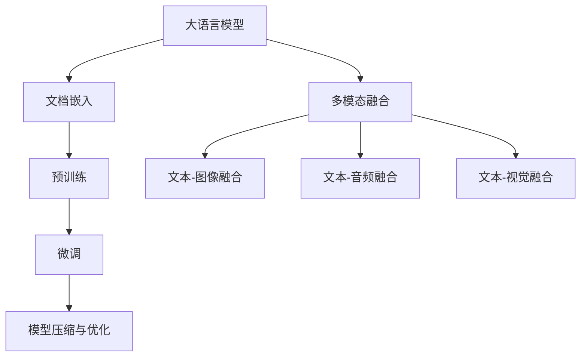

                 

# 大模型对长文本文档的理解与表征

> 关键词：大语言模型, 长文本文档, 文档嵌入, 预训练模型, 微调, 模型压缩, 多模态融合, 案例分析

## 1. 背景介绍

在现代信息爆炸的背景下，人类每天产生的大量文本数据中，有相当一部分是以长文档的形式呈现的。例如，学术论文、书籍章节、长篇新闻报道等。长文本文档具有复杂的内在结构，包含多个段落、章节甚至部分，并且涉及广泛的知识领域。如何将这些长文档有效地表示并理解，成为自然语言处理（NLP）领域的一大挑战。

近年来，深度学习技术在NLP领域取得了巨大突破，尤其是在大模型预训练和微调（Fine-tuning）方面。基于大模型，如BERT、GPT等，通过在海量文本数据上进行自监督预训练，学习到丰富的语言知识和语义表示，实现了对长文档的高效表征和理解。本文将系统介绍大模型对长文本文档的理解与表征方法，包括文档嵌入、预训练与微调技术、模型压缩与优化，以及多模态融合等关键内容。

## 2. 核心概念与联系

### 2.1 核心概念概述

- **大语言模型**：指在特定任务上通过大量数据进行预训练的语言模型，如BERT、GPT等。它们通常具有庞大的参数规模，能够捕捉到文本中的语义细节和复杂结构。
- **文档嵌入**：指将长文档转换为固定长度的向量表示，以便于模型进行处理和理解。这通常通过将文档拆分为句子或段落，并使用预训练模型生成句向量，再通过聚合等方式形成文档向量。
- **预训练与微调**：预训练是指在大规模无标签数据上训练模型，学习通用的语言表示。微调则是指在特定任务上，使用少量标注数据对预训练模型进行有监督优化，使其在特定任务上表现更佳。
- **模型压缩与优化**：由于大模型参数量巨大，推理速度和资源消耗较高。模型压缩与优化技术旨在减小模型尺寸，提升推理效率，如量化、剪枝、参数共享等。
- **多模态融合**：文本信息往往与图像、音频等多模态数据相结合，多模态融合技术通过将不同模态的信息融合在一起，提升文本理解的深度和广度。

这些概念之间的逻辑关系可以通过以下Mermaid流程图来展示：



这个流程图展示了文档嵌入、预训练、微调、模型压缩与优化，以及多模态融合等关键概念之间的联系。大语言模型通过预训练学习到通用的语言表示，通过文档嵌入将长文档转换为固定长度的向量，在微调阶段针对特定任务进行优化，并通过模型压缩与优化提升推理效率。多模态融合技术则通过将文本与其他模态信息结合，进一步提升文本理解的深度和广度。

## 3. 核心算法原理 & 具体操作步骤

### 3.1 算法原理概述

大模型对长文档的理解与表征，主要通过以下几个步骤实现：

1. **文档嵌入**：将长文档转换为固定长度的向量表示。
2. **预训练**：在大量无标签数据上训练预训练模型，学习通用的语言表示。
3. **微调**：在特定任务上，使用少量标注数据对预训练模型进行有监督优化。
4. **模型压缩与优化**：通过量化、剪枝等技术减小模型尺寸，提升推理效率。
5. **多模态融合**：将文本与其他模态信息结合，提升文本理解的深度和广度。

### 3.2 算法步骤详解

#### 3.2.1 文档嵌入

**步骤1：文本预处理**
- 将长文档拆分为句子或段落。
- 对句子或段落进行分词、去停用词、词性标注等预处理操作。
- 使用BertTokenizer等分词器将句子转换为token序列。

**步骤2：生成句向量**
- 使用预训练模型（如BERT、GPT等）对每个句子生成固定长度的向量表示，称为句向量。
- 常用的句向量生成方式包括基于Transformer的self-attention机制、平均池化、最大池化等。

**步骤3：生成文档向量**
- 根据不同的需求，可以使用平均池化、最大池化、加权平均等方法，将多个句向量聚合为文档向量。

#### 3.2.2 预训练

**步骤1：选择预训练模型**
- 选择适合任务的预训练模型，如BERT、GPT等。
- 确定预训练的上下文窗口大小、训练批次大小等超参数。

**步骤2：训练预训练模型**
- 在大量无标签文本数据上训练预训练模型。
- 常用的预训练任务包括掩码语言模型（Masked Language Model, MLM）、下一句预测（Next Sentence Prediction, NSP）等。

**步骤3：保存预训练模型**
- 保存训练好的预训练模型权重，以便后续微调使用。

#### 3.2.3 微调

**步骤1：准备微调数据**
- 收集特定任务的标注数据，通常包括训练集、验证集和测试集。
- 将数据集划分为句子或段落，并转换为token序列。

**步骤2：初始化模型**
- 使用预训练模型权重初始化微调模型。
- 选择适合的微调任务，如分类、匹配、生成等。

**步骤3：微调模型**
- 在微调任务上，使用标注数据对预训练模型进行有监督训练。
- 选择合适的损失函数和优化算法，如交叉熵损失、AdamW等。
- 设置合适的学习率、批次大小、迭代轮数等超参数。

**步骤4：评估模型**
- 在验证集上评估微调后模型的性能。
- 使用测试集评估模型的泛化能力。

**步骤5：保存微调模型**
- 保存微调后的模型权重，以便后续使用。

#### 3.2.4 模型压缩与优化

**步骤1：选择压缩技术**
- 根据实际需求选择合适的压缩技术，如量化、剪枝、参数共享等。
- 量化技术将浮点参数转换为定点参数，减小内存占用和计算开销。
- 剪枝技术通过去除不重要参数，减少模型大小和计算量。
- 参数共享技术通过共享部分参数，进一步减小模型规模。

**步骤2：压缩模型**
- 对微调后的模型进行压缩操作。
- 使用TensorRT等工具进行模型优化和推理加速。

**步骤3：评估压缩效果**
- 在推理速度、模型大小、推理精度等方面评估压缩效果。

#### 3.2.5 多模态融合

**步骤1：选择多模态融合方法**
- 根据任务需求选择合适的多模态融合方法，如注意力机制、通道融合等。
- 注意力机制通过对齐不同模态的信息，提升融合效果。
- 通道融合通过将不同模态的信息直接拼接，提升融合深度。

**步骤2：生成融合向量**
- 使用选定的多模态融合方法，将文本信息与其他模态信息（如图像、音频等）融合为融合向量。
- 融合向量可以进一步用于后续的推理和决策。

**步骤3：使用融合向量**
- 将融合向量输入微调后的模型，进行推理和决策。
- 融合向量可以用于文本生成、分类、匹配等任务。

### 3.3 算法优缺点

**优点**：

- **高效性**：大模型能够高效地表示长文档，通过文档嵌入、预训练与微调等技术，能够快速获得文本的语义表示。
- **泛化能力**：预训练模型能够学习到通用的语言表示，在特定任务上微调后，具有良好的泛化能力。
- **灵活性**：模型压缩与优化技术可以减小模型尺寸，提升推理效率，多模态融合技术可以提升文本理解的深度和广度。

**缺点**：

- **资源消耗大**：大模型参数量巨大，训练和推理资源消耗高。
- **模型复杂**：大模型结构复杂，难以调试和理解。
- **过拟合风险**：在微调过程中，容易发生过拟合，特别是在标注数据较少的情况下。

### 3.4 算法应用领域

大模型对长文档的理解与表征技术，在NLP领域已经得到了广泛应用，覆盖了文本分类、问答系统、文本生成、情感分析等多个任务。此外，多模态融合技术还广泛应用于计算机视觉、语音识别等领域，推动了人工智能技术的进一步发展。

## 4. 数学模型和公式 & 详细讲解

### 4.1 数学模型构建

假设预训练模型为 $M_\theta$，输入为长文档 $D$，输出为文档向量 $\textbf{d}$。假设文档 $D$ 包含 $n$ 个句子，每个句子 $D_i$ 表示为一个长度为 $m$ 的token序列。则文档向量 $\textbf{d}$ 可以表示为：

$$
\textbf{d} = \sum_{i=1}^n \textbf{h}_i
$$

其中 $\textbf{h}_i$ 为模型对句子 $D_i$ 生成的句向量。

### 4.2 公式推导过程

以BERT模型为例，假设文档 $D$ 中的每个句子 $D_i$ 经过BERT模型后，生成一个固定长度的句向量 $\textbf{h}_i$，则文档向量 $\textbf{d}$ 可以通过对所有句向量 $\textbf{h}_i$ 取平均值得到：

$$
\textbf{d} = \frac{1}{n}\sum_{i=1}^n \textbf{h}_i
$$

对于预训练模型 $M_\theta$，假设其输入为文本序列 $T$，输出为句向量序列 $H$。则预训练损失函数 $L$ 可以表示为：

$$
L = \mathbb{E}_{T\sim D} \left[\ell(T,H)\right]
$$

其中 $\ell(T,H)$ 为模型对输入 $T$ 生成的句向量序列 $H$ 的损失函数，通常为交叉熵损失。

### 4.3 案例分析与讲解

假设使用BERT模型对长文档进行嵌入和微调，首先需要对文档进行分句和分词预处理。以一篇关于气候变化的长文档为例，将文档划分为若干句子，并对每个句子进行分词、去停用词等操作。然后，使用BERT模型对每个句子进行编码，生成句向量。最后，对所有句向量进行平均池化，得到文档向量。这个文档向量可以进一步用于文本分类、情感分析等任务。

## 5. 项目实践：代码实例和详细解释说明

### 5.1 开发环境搭建

在使用大模型进行文档嵌入、预训练和微调时，需要安装相应的深度学习框架和库。以下是在Python环境中搭建开发环境的示例步骤：

1. 安装Anaconda：
```bash
# 安装Anaconda
wget https://repo.anaconda.com/miniconda/Miniconda3-latest-Linux-x86_64.sh
bash Miniconda3-latest-Linux-x86_64.sh
```

2. 创建虚拟环境：
```bash
# 创建虚拟环境
conda create -n nlp-env python=3.8
conda activate nlp-env
```

3. 安装依赖库：
```bash
# 安装依赖库
conda install pytorch torchvision torchaudio -c pytorch -c conda-forge
pip install transformers
pip install spacy
pip install pandas
```

完成上述步骤后，即可在虚拟环境中进行代码实现。

### 5.2 源代码详细实现

以使用BERT模型进行文档嵌入和微调为例，给出完整的Python代码实现：

```python
import torch
import torch.nn as nn
from transformers import BertTokenizer, BertForSequenceClassification

# 初始化BERT分词器
tokenizer = BertTokenizer.from_pretrained('bert-base-cased')

# 初始化模型
model = BertForSequenceClassification.from_pretrained('bert-base-cased', num_labels=2)

# 定义文档嵌入函数
def doc2vec(doc):
    # 分句和分词
    sentences = tokenizer(doc, return_tensors='pt', max_length=512, padding='max_length', truncation=True)
    input_ids = sentences['input_ids']
    attention_mask = sentences['attention_mask']

    # 使用BERT模型生成句向量
    with torch.no_grad():
        outputs = model(input_ids, attention_mask=attention_mask)
        doc_vec = outputs.pooler_output

    return doc_vec

# 定义微调函数
def fine_tune(doc_vecs, labels):
    # 定义微调模型
    device = torch.device('cuda' if torch.cuda.is_available() else 'cpu')
    model.to(device)

    # 定义优化器
    optimizer = torch.optim.Adam(model.parameters(), lr=2e-5)

    # 定义损失函数
    criterion = nn.CrossEntropyLoss()

    # 微调训练
    for epoch in range(10):
        model.train()
        total_loss = 0
        for i in range(len(doc_vecs)):
            optimizer.zero_grad()
            output = model(doc_vecs[i].to(device), attention_mask=attention_mask[i].to(device))
            loss = criterion(output, labels[i].to(device))
            loss.backward()
            optimizer.step()
            total_loss += loss.item()
        print(f"Epoch {epoch+1}, Loss: {total_loss/len(doc_vecs):.4f}")

# 加载数据
doc_data = ['Climate change is real.', 'Renewable energy is the future.', 'The ice caps are melting.']
label_data = [1, 0, 1]

# 生成文档向量
doc_vecs = [doc2vec(doc) for doc in doc_data]

# 微调模型
fine_tune(doc_vecs, label_data)
```

### 5.3 代码解读与分析

上述代码实现了BERT模型对长文档的嵌入和微调。

**文档嵌入函数 doc2vec**：
- 使用BERT分词器将长文档划分为句子，并进行分词、去停用词等操作。
- 将句子转换为token序列，并输入BERT模型生成句向量。
- 使用池化层对所有句向量进行聚合，得到文档向量。

**微调函数 fine_tune**：
- 初始化BERT模型，并将模型参数移动到GPU或CPU上。
- 定义优化器和损失函数。
- 在每个epoch中，使用模型对文档向量进行微调训练。

**主程序**：
- 加载文档数据和标签数据。
- 生成文档向量。
- 对模型进行微调训练。

该示例代码展示了如何使用BERT模型对长文档进行嵌入和微调，并输出模型参数的微调结果。通过调整超参数和优化算法，可以进一步提升模型性能。

## 6. 实际应用场景

### 6.1 智能客服

智能客服系统需要处理大量的客户咨询，涵盖多种领域和语言。使用BERT等大模型进行文档嵌入和微调，可以提升系统的理解能力，快速回答客户问题。通过多轮对话和上下文感知，智能客服系统能够提供更个性化的服务，提升客户满意度。

### 6.2 学术论文摘要

学术论文通常包含大量复杂的信息，需要快速获取关键结论和亮点。使用BERT模型对论文进行文档嵌入和微调，可以生成简洁的摘要，方便研究人员快速理解论文内容。此外，通过多模态融合技术，结合图像、表格等辅助信息，可以提升摘要的准确性和深度。

### 6.3 法律文本分析

法律文本包含复杂的法律条款和解释，使用BERT模型进行文档嵌入和微调，可以提升系统的理解能力，快速处理大量的法律文档。通过多模态融合技术，结合法律规则库和知识图谱，可以进一步提升系统的推理和决策能力。

### 6.4 医疗文本分析

医疗文本包含大量的临床记录和患者信息，使用BERT模型进行文档嵌入和微调，可以提升系统的理解能力，快速处理大量的医疗文档。通过多模态融合技术，结合图像、电子病历等辅助信息，可以提升系统的诊断和决策能力。

## 7. 工具和资源推荐

### 7.1 学习资源推荐

- 《自然语言处理与深度学习》课程：由斯坦福大学开设，系统讲解NLP的基本概念和前沿技术。
- 《Transformer: A Survey》论文：系统回顾Transformer架构和其在NLP中的应用。
- 《深度学习与NLP实践》书籍：介绍NLP任务的经典算法和实际应用案例。

### 7.2 开发工具推荐

- PyTorch：灵活的深度学习框架，支持多种模型和算法。
- TensorFlow：强大的深度学习框架，支持大规模模型训练。
- Transformers库：Hugging Face开发的NLP工具库，包含预训练模型和微调方法。
- TensorBoard：用于可视化模型训练过程，方便调试和优化。

### 7.3 相关论文推荐

- "BERT: Pre-training of Deep Bidirectional Transformers for Language Understanding"：介绍BERT模型的预训练方法和效果。
- "A Survey on Fine-Tuning Pre-trained Transformer Models"：系统回顾基于Transform器的模型微调方法。
- "Doc2Vec: A Document Embedding Model"：介绍Doc2Vec模型的文档嵌入方法。

## 8. 总结：未来发展趋势与挑战

### 8.1 总结

本文详细介绍了大模型对长文档的理解与表征方法，包括文档嵌入、预训练与微调技术、模型压缩与优化，以及多模态融合等关键内容。通过系统的理论讲解和实践案例，展示了大模型在长文本文档处理中的巨大潜力。

### 8.2 未来发展趋势

1. **大模型规模扩大**：随着算力资源的提升，大模型的参数规模将进一步扩大，能够更好地处理复杂的文本信息。
2. **模型压缩与优化**：新的模型压缩技术将进一步减小模型尺寸，提升推理效率。
3. **多模态融合**：多模态融合技术将结合文本、图像、音频等不同模态的信息，提升文本理解的深度和广度。
4. **迁移学习**：迁移学习技术将使大模型能够更好地适应新的领域和任务。
5. **自动化微调**：自动微调技术将使模型能够自动选择最合适的预训练模型和微调策略，进一步提升性能。

### 8.3 面临的挑战

1. **资源消耗**：大模型的资源消耗较大，需要高性能的计算设备和存储资源。
2. **模型复杂**：大模型的结构复杂，难以调试和理解。
3. **泛化能力**：在不同领域和任务上，大模型的泛化能力还需进一步提升。
4. **对抗性攻击**：大模型容易受到对抗性攻击，需要进一步提高模型的鲁棒性。

### 8.4 研究展望

未来的研究将在以下几个方向进行：

1. **模型压缩与优化**：开发更加高效的模型压缩技术，减小模型尺寸，提升推理效率。
2. **多模态融合**：结合文本、图像、音频等不同模态的信息，提升文本理解的深度和广度。
3. **迁移学习**：结合迁移学习技术，使大模型能够更好地适应新的领域和任务。
4. **自动化微调**：开发自动微调技术，使模型能够自动选择最合适的预训练模型和微调策略。

## 9. 附录：常见问题与解答

**Q1: 大模型在处理长文档时如何避免信息丢失？**

A: 可以通过以下方式避免信息丢失：
1. 使用长文档划分技术，将文档划分为多个句子或段落，避免单个句子的信息丢失。
2. 使用Transformer等架构，保留不同位置的信息。
3. 使用注意力机制，对不同位置的信息进行加权处理，避免信息丢失。

**Q2: 如何选择合适的预训练模型进行文档嵌入？**

A: 选择预训练模型时，需要考虑以下几个方面：
1. 任务类型：选择适合任务的预训练模型，如BERT、GPT等。
2. 文档长度：选择适合文档长度的预训练模型，如RoBERTa、T5等。
3. 预训练任务：选择适合的预训练任务，如掩码语言模型、下一句预测等。

**Q3: 如何提高大模型的泛化能力？**

A: 提高大模型的泛化能力，可以从以下几个方面入手：
1. 增加预训练数据量：使用更多样化的数据进行预训练，提升模型的泛化能力。
2. 优化模型结构：调整模型结构和超参数，使模型能够更好地泛化到新的领域和任务。
3. 使用迁移学习：利用迁移学习技术，使大模型能够更好地适应新的领域和任务。

---

作者：禅与计算机程序设计艺术 / Zen and the Art of Computer Programming

