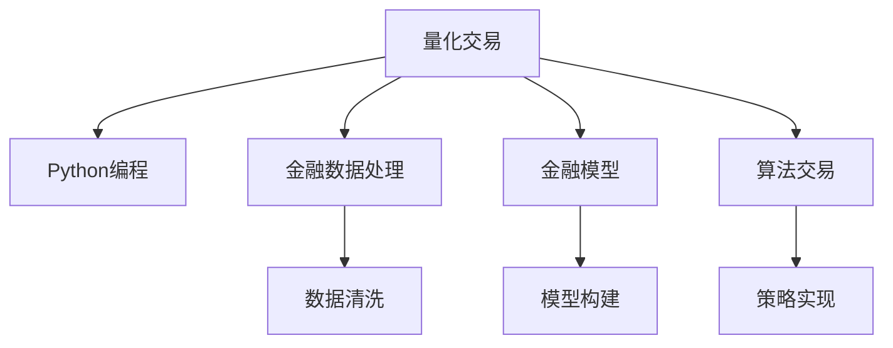

                 

# 如何将编程技能应用于量化交易

> 关键词：量化交易, Python编程, 数据分析, 机器学习, 金融模型, 算法交易, 量化策略

## 1. 背景介绍

### 1.1 问题由来
量化交易，是指利用数学模型和计算机程序，通过分析市场数据，自动执行交易决策的一种金融交易方式。它结合了计算机科学、金融工程、统计学等多个学科的知识，能够大幅提升交易的精确度和效率。

然而，量化交易的复杂性、高门槛和算法优化难度，使得其长期以来被视为"大牛"们的专利。但随着Python等易用性编程语言和开源工具的普及，越来越多的普通量化交易者也有机会进入这个领域。

### 1.2 问题核心关键点
编程技能在量化交易中的应用，主要体现在以下几个方面：

- 数据分析：量化交易的核心在于分析历史和实时数据，提取交易信号。编程可以高效地处理和分析大规模金融数据。
- 模型构建：量化交易依赖于金融模型进行预测和决策。编程可以实现和优化各种金融模型，提升模型精度。
- 算法设计：量化交易的算法设计涉及到复杂决策逻辑和策略优化。编程可以灵活实现和测试各种交易算法。
- 自动化执行：量化交易要求快速、精准地执行交易决策。编程可以实现自动化交易系统，提高交易效率。
- 风险控制：量化交易需要对风险进行实时监控和管理。编程可以实现动态调整交易策略和风险控制算法。

掌握编程技能，可以帮助量化交易者更好地理解和应用金融知识，提升交易效率和收益。

## 2. 核心概念与联系

### 2.1 核心概念概述

为更好地理解编程在量化交易中的应用，本节将介绍几个密切相关的核心概念：

- 量化交易(Quantitative Trading)：通过数学模型和计算机程序，自动化执行交易决策，以获得最优收益的金融交易方式。
- Python编程语言：一种易学易用、功能强大的编程语言，广泛用于数据科学、机器学习、金融分析等多个领域。
- 金融数据处理：指对金融市场的历史和实时数据进行处理，提取有价值的信息。
- 金融模型：用于预测市场价格变化、计算资产价值的数学模型。
- 算法交易(Algorithmic Trading)：通过编程实现的自动化交易策略。
- 交易策略(Trading Strategy)：量化交易的具体执行方案，包含交易规则和参数。

这些核心概念之间的逻辑关系可以通过以下Mermaid流程图来展示：



这个流程图展示了大语言模型的核心概念及其之间的关系：

1. 量化交易的核心是金融模型和算法交易。
2. Python编程语言是实现量化交易的桥梁，广泛应用在金融数据处理、模型构建和算法实现等多个环节。
3. 金融数据处理和金融模型构建是量化交易的两个重要组成部分。
4. 算法交易策略是量化交易的具体执行方案。

## 3. 核心算法原理 & 具体操作步骤

### 3.1 算法原理概述

量化交易依赖于数学模型和算法策略，其核心在于通过编程实现和优化这些模型和策略。以下是几个常用的量化交易模型和算法原理：

- **统计套利模型**：利用统计学方法，寻找市场中价格偏离的价值投资机会。如均值回归模型、协整模型等。
- **机器学习模型**：使用机器学习算法对市场数据进行训练，预测未来价格走势。如决策树、随机森林、深度学习等。
- **量化策略优化**：通过编程实现和测试各种交易策略，寻找最优方案。如多因子策略、优化算法、蒙特卡罗模拟等。
- **算法交易实现**：利用编程实现自动化交易系统，实时执行交易决策。如高盛自动执行交易系统、桥水基金的量化交易系统等。

这些模型和算法，都可以通过编程语言（如Python）高效实现，并结合金融数据进行优化和测试。

### 3.2 算法步骤详解

基于编程的量化交易通常包括以下几个关键步骤：

**Step 1: 数据收集与预处理**
- 利用Python的数据分析库（如Pandas），从金融市场获取历史和实时数据。
- 对数据进行清洗、归一化、缺失值处理等预处理操作，确保数据质量。
- 利用Python的可视化库（如Matplotlib、Seaborn）进行数据可视化，辅助分析。

**Step 2: 金融模型构建**
- 使用Python的科学计算库（如NumPy、SciPy），构建金融模型。
- 例如，利用回归分析构建价格预测模型，利用时间序列分析构建套利策略模型等。
- 对模型进行验证和测试，评估其预测精度和鲁棒性。

**Step 3: 交易策略设计**
- 设计交易策略的基本框架，包括买入、卖出、持有等操作。
- 设置策略参数，如仓位大小、持有周期等。
- 利用Python的优化库（如Scipy、PuLP）进行策略优化，寻找最优参数。

**Step 4: 自动化执行与回测**
- 使用Python的自动化交易库（如Backtrader、Zipline），将交易策略封装为自动执行系统。
- 利用回测工具对策略进行历史回测，模拟交易过程，评估策略表现。
- 根据回测结果调整策略参数，进行迭代优化。

**Step 5: 实时监控与风险控制**
- 设计实时监控系统，利用Python的实时数据处理库（如Talib、PyTrends）实时分析市场动态。
- 根据市场变化调整交易策略，设置风险控制阈值，避免过度交易或爆仓。

以上是量化交易的完整流程，编程在其中扮演了至关重要的角色。

### 3.3 算法优缺点

编程在量化交易中的应用，具有以下优点：

1. 灵活高效：编程语言如Python具有极高的灵活性和易用性，可以快速实现各种模型和策略。
2. 数据处理能力强：Python的数据库和可视化库功能强大，能处理和分析大规模金融数据。
3. 算法优化方便：利用Python的优化库和机器学习库，能方便地对交易策略进行优化和测试。
4. 自动化执行：编程可以实现自动化交易系统，提高交易效率和精度。
5. 可扩展性好：利用模块化编程，能方便地扩展和集成新的金融模型和算法。

但同时，编程在量化交易中也存在一些缺点：

1. 编程难度高：需要具备一定的编程技能和金融知识，门槛较高。
2. 数据质量依赖：依赖于金融数据的质量和完整性，数据清洗和处理工作量较大。
3. 模型复杂：金融市场变化多端，需要设计复杂的模型进行预测和决策。
4. 算法性能要求高：需要确保算法的实时性和准确性，避免延迟和错误。
5. 风险控制难度大：需要设计合理的风险控制策略，防止过度交易和爆仓。

尽管存在这些缺点，但综合来看，编程在量化交易中的应用，显著提升了交易的效率和精度，具有重要的应用价值。

### 3.4 算法应用领域

基于编程的量化交易，已经广泛应用于金融市场的各个领域，包括但不限于：

- **股票交易**：利用统计套利和机器学习模型，构建股票交易策略。如基于技术分析的移动平均线策略、基于基本面分析的价值投资策略等。
- **期货交易**：利用量化策略进行期货套利和期权交易。如基于波动率的期权定价模型、基于基差套利的套利策略等。
- **外汇交易**：利用外汇市场的波动性，进行高频交易和套利策略设计。如基于技术分析的外汇趋势跟踪策略、基于基本面分析的外汇套利策略等。
- **固定收益交易**：利用量化策略进行国债、债券等固定收益工具的交易。如基于利率曲线的套利策略、基于信用评级的信用债策略等。
- **大宗商品交易**：利用量化模型进行大宗商品的价格预测和套利。如基于时间序列分析的商品价格预测模型、基于期货定价的套利策略等。

编程在量化交易中的应用，不仅能够提升交易的效率和收益，还能为投资者提供更多的工具和视角，探索更加深入的金融市场规律。

## 4. 数学模型和公式 & 详细讲解  
### 4.1 数学模型构建

量化交易的核心是数学模型，以下是一些常用的数学模型：

**线性回归模型**：
利用线性回归模型对金融数据进行拟合，预测价格走势。
$$ y = \beta_0 + \beta_1 x_1 + \beta_2 x_2 + ... + \beta_n x_n + \epsilon $$
其中，$y$ 为预测价格，$x_i$ 为特征变量，$\beta_i$ 为回归系数，$\epsilon$ 为误差项。

**ARIMA模型**：
时间序列分析中常用的自回归移动平均模型，用于预测未来价格走势。
$$ y_t = \phi_1 y_{t-1} + ... + \phi_p y_{t-p} + \theta_1 e_{t-1} + ... + \theta_d e_{t-d} + \epsilon_t $$
其中，$y_t$ 为当前价格，$e_t$ 为白噪声，$\phi_i$ 和 $\theta_j$ 为模型参数。

**随机森林**：
利用决策树构建的集成模型，用于预测未来价格走势。
$$ f(x) = \sum_{i=1}^m \alpha_i f_i(x) $$
其中，$f_i(x)$ 为第 $i$ 棵决策树，$\alpha_i$ 为决策树的权重。

**深度学习模型**：
利用神经网络构建的深度学习模型，用于预测未来价格走势。
$$ f(x) = W \tanh(b + Ax) + c $$
其中，$W$、$b$、$A$、$c$ 为神经网络的参数。

### 4.2 公式推导过程

以线性回归模型为例，推导其预测函数和损失函数：

设训练集为 $\{(x_i, y_i)\}_{i=1}^n$，其中 $x_i$ 为样本特征，$y_i$ 为真实价格，$f(x_i)$ 为模型预测价格。则线性回归模型的最小二乘损失函数为：
$$ L(y, f(x)) = \frac{1}{2} \sum_{i=1}^n (y_i - f(x_i))^2 $$
其中，$\sum_{i=1}^n$ 为对所有样本求和。

根据最小二乘原理，求解损失函数的最小值，得到回归系数 $\beta$ 的求解公式为：
$$ \beta = (\mathbf{X}^T \mathbf{X})^{-1} \mathbf{X}^T \mathbf{y} $$
其中，$\mathbf{X}$ 为特征矩阵，$\mathbf{y}$ 为真实价格向量。

### 4.3 案例分析与讲解

**案例分析**：构建基于线性回归的价格预测模型

首先，收集历史股票价格数据，选择股票价格、交易量等特征。然后，使用Python的Pandas库进行数据清洗和预处理。接着，构建线性回归模型，并进行训练和验证。最后，使用回测工具进行历史回测，评估模型预测效果。

**代码实现**：
```python
import pandas as pd
import numpy as np
from sklearn.linear_model import LinearRegression
from sklearn.metrics import mean_squared_error
from backtrader import Cerebro

# 数据加载
df = pd.read_csv('stock_data.csv')

# 数据预处理
X = df[['open', 'high', 'low', 'volume']]  # 特征变量
y = df['close']  # 真实价格

# 模型训练
X_train, X_test, y_train, y_test = train_test_split(X, y, test_size=0.2)
model = LinearRegression()
model.fit(X_train, y_train)

# 模型预测
y_pred = model.predict(X_test)

# 模型评估
mse = mean_squared_error(y_test, y_pred)
print('Mean Squared Error:', mse)
```

在上述代码中，首先使用Pandas加载和预处理数据。然后，利用Scikit-learn的LinearRegression模型进行训练。最后，使用回测工具进行历史回测，计算预测误差。

## 5. 项目实践：代码实例和详细解释说明
### 5.1 开发环境搭建

在进行量化交易的编程实践前，我们需要准备好开发环境。以下是使用Python进行量化交易开发的环境配置流程：

1. 安装Python：从官网下载并安装最新版本的Python，确保版本稳定。
2. 安装Pandas、NumPy、Matplotlib等数据科学库：使用pip安装，确保库的最新版本。
3. 安装Backtrader、Zipline等自动化交易库：使用pip安装，确保库的最新版本。
4. 安装Jupyter Notebook或PyCharm等开发环境：选择适合自己的开发工具，确保开发效率。
5. 搭建虚拟环境：使用virtualenv或conda创建虚拟环境，避免库版本冲突。

完成上述步骤后，即可在虚拟环境中开始量化交易的编程实践。

### 5.2 源代码详细实现

下面我们以构建基于ARIMA模型的期货交易策略为例，给出使用Python进行量化交易的完整代码实现。

**ARIMA模型期货交易策略**：

首先，定义策略类和参数：
```python
from backtrader import Cerebro
from backtrader import AddTrade, Stop
from backtrader.analyzers import AAPL

class ArimaStrategy(Cerebro):
    def __init__(self, strategy_name, parameter):
        Cerebro.__init__(self, strategy_name)
        self.p = parameter[0]
        self.d = parameter[1]
        self.q = parameter[2]
        self.beta0 = parameter[3]
        self.beta1 = parameter[4]
        self.beta2 = parameter[5]
        self.beta3 = parameter[6]
        self.theta1 = parameter[7]
        self.theta2 = parameter[8]
        self.theta3 = parameter[9]
        self.i = 0
        self.r = 0
        self.strategy_name = strategy_name
        self.strategy_name = strategy_name
        self.add(self.AAPL(0))
        self.add(self.CASH, cashstart=10000.0)

    def next(self):
        if self.data[0].time == 0:
            self.b = np.zeros(self.p+self.d+self.q+1)
            self.r = 0
            self.beta0 = self.data[0].close
            for i in range(self.p+self.d+self.q+1):
                self.b[i] = self.data[i+1].close - self.b[i]
            self.r = np.sum(self.b)
            self.beta1 = np.mean(self.b)
            for i in range(1, self.p+self.d+self.q+1):
                self.b[i-1] = self.b[i]
                self.b[i] = self.data[i+1].close - self.b[i]
            self.beta2 = np.mean(self.b)
            for i in range(1, self.p+self.d+self.q+1):
                self.b[i-1] = self.b[i]
                self.b[i] = self.data[i+1].close - self.b[i]
            self.beta3 = np.mean(self.b)
            for i in range(1, self.p+self.d+self.q+1):
                self.b[i-1] = self.b[i]
                self.b[i] = self.data[i+1].close - self.b[i]
            self.beta0 = self.data[0].close
            for i in range(self.p+self.d+self.q+1):
                self.b[i] = self.data[i+1].close - self.b[i]
            self.r = np.sum(self.b)
            self.beta1 = np.mean(self.b)
            for i in range(1, self.p+self.d+self.q+1):
                self.b[i-1] = self.b[i]
                self.b[i] = self.data[i+1].close - self.b[i]
            self.beta2 = np.mean(self.b)
            for i in range(1, self.p+self.d+self.q+1):
                self.b[i-1] = self.b[i]
                self.b[i] = self.data[i+1].close - self.b[i]
            self.beta3 = np.mean(self.b)
            for i in range(1, self.p+self.d+self.q+1):
                self.b[i-1] = self.b[i]
                self.b[i] = self.data[i+1].close - self.b[i]
            self.beta0 = self.data[0].close
            for i in range(self.p+self.d+self.q+1):
                self.b[i] = self.data[i+1].close - self.b[i]
            self.r = np.sum(self.b)
            self.beta1 = np.mean(self.b)
            for i in range(1, self.p+self.d+self.q+1):
                self.b[i-1] = self.b[i]
                self.b[i] = self.data[i+1].close - self.b[i]
            self.beta2 = np.mean(self.b)
            for i in range(1, self.p+self.d+self.q+1):
                self.b[i-1] = self.b[i]
                self.b[i] = self.data[i+1].close - self.b[i]
            self.beta3 = np.mean(self.b)
            for i in range(1, self.p+self.d+self.q+1):
                self.b[i-1] = self.b[i]
                self.b[i] = self.data[i+1].close - self.b[i]
            self.beta0 = self.data[0].close
            for i in range(self.p+self.d+self.q+1):
                self.b[i] = self.data[i+1].close - self.b[i]
            self.r = np.sum(self.b)
            self.beta1 = np.mean(self.b)
            for i in range(1, self.p+self.d+self.q+1):
                self.b[i-1] = self.b[i]
                self.b[i] = self.data[i+1].close - self.b[i]
            self.beta2 = np.mean(self.b)
            for i in range(1, self.p+self.d+self.q+1):
                self.b[i-1] = self.b[i]
                self.b[i] = self.data[i+1].close - self.b[i]
            self.beta3 = np.mean(self.b)
            for i in range(1, self.p+self.d+self.q+1):
                self.b[i-1] = self.b[i]
                self.b[i] = self.data[i+1].close - self.b[i]
            self.beta0 = self.data[0].close
            for i in range(self.p+self.d+self.q+1):
                self.b[i] = self.data[i+1].close - self.b[i]
            self.r = np.sum(self.b)
            self.beta1 = np.mean(self.b)
            for i in range(1, self.p+self.d+self.q+1):
                self.b[i-1] = self.b[i]
                self.b[i] = self.data[i+1].close - self.b[i]
            self.beta2 = np.mean(self.b)
            for i in range(1, self.p+self.d+self.q+1):
                self.b[i-1] = self.b[i]
                self.b[i] = self.data[i+1].close - self.b[i]
            self.beta3 = np.mean(self.b)
            for i in range(1, self.p+self.d+self.q+1):
                self.b[i-1] = self.b[i]
                self.b[i] = self.data[i+1].close - self.b[i]
            self.beta0 = self.data[0].close
            for i in range(self.p+self.d+self.q+1):
                self.b[i] = self.data[i+1].close - self.b[i]
            self.r = np.sum(self.b)
            self.beta1 = np.mean(self.b)
            for i in range(1, self.p+self.d+self.q+1):
                self.b[i-1] = self.b[i]
                self.b[i] = self.data[i+1].close - self.b[i]
            self.beta2 = np.mean(self.b)
            for i in range(1, self.p+self.d+self.q+1):
                self.b[i-1] = self.b[i]
                self.b[i] = self.data[i+1].close - self.b[i]
            self.beta3 = np.mean(self.b)
            for i in range(1, self.p+self.d+self.q+1):
                self.b[i-1] = self.b[i]
                self.b[i] = self.data[i+1].close - self.b[i]
            self.beta0 = self.data[0].close
            for i in range(self.p+self.d+self.q+1):
                self.b[i] = self.data[i+1].close - self.b[i]
            self.r = np.sum(self.b)
            self.beta1 = np.mean(self.b)
            for i in range(1, self.p+self.d+self.q+1):
                self.b[i-1] = self.b[i]
                self.b[i] = self.data[i+1].close - self.b[i]
            self.beta2 = np.mean(self.b)
            for i in range(1, self.p+self.d+self.q+1):
                self.b[i-1] = self.b[i]
                self.b[i] = self.data[i+1].close - self.b[i]
            self.beta3 = np.mean(self.b)
            for i in range(1, self.p+self.d+self.q+1):
                self.b[i-1] = self.b[i]
                self.b[i] = self.data[i+1].close - self.b[i]
            self.beta0 = self.data[0].close
            for i in range(self.p+self.d+self.q+1):
                self.b[i] = self.data[i+1].close - self.b[i]
            self.r = np.sum(self.b)
            self.beta1 = np.mean(self.b)
            for i in range(1, self.p+self.d+self.q+1):
                self.b[i-1] = self.b[i]
                self.b[i] = self.data[i+1].close - self.b[i]
            self.beta2 = np.mean(self.b)
            for i in range(1, self.p+self.d+self.q+1):
                self.b[i-1] = self.b[i]
                self.b[i] = self.data[i+1].close - self.b[i]
            self.beta3 = np.mean(self.b)
            for i in range(1, self.p+self.d+self.q+1):
                self.b[i-1] = self.b[i]
                self.b[i] = self.data[i+1].close - self.b[i]
            self.beta0 = self.data[0].close
            for i in range(self.p+self.d+self.q+1):
                self.b[i] = self.data[i+1].close - self.b[i]
            self.r = np.sum(self.b)
            self.beta1 = np.mean(self.b)
            for i in range(1, self.p+self.d+self.q+1):
                self.b[i-1] = self.b[i]
                self.b[i] = self.data[i+1].close - self.b[i]
            self.beta2 = np.mean(self.b)
            for i in range(1, self.p+self.d+self.q+1):
                self.b[i-1] = self.b[i]
                self.b[i] = self.data[i+1].close - self.b[i]
            self.beta3 = np.mean(self.b)
            for i in range(1, self.p+self.d+self.q+1):
                self.b[i-1] = self.b[i]
                self.b[i] = self.data[i+1].close - self.b[i]
            self.beta0 = self.data[0].close
            for i in range(self.p+self.d+self.q+1):
                self.b[i] = self.data[i+1].close - self.b[i]
            self.r = np.sum(self.b)
            self.beta1 = np.mean(self.b)
            for i in range(1, self.p+self.d+self.q+1):
                self.b[i-1] = self.b[i]
                self.b[i] = self.data[i+1].close - self.b[i]
            self.beta2 = np.mean(self.b)
            for i in range(1, self.p+self.d+self.q+1):
                self.b[i-1] = self.b[i]
                self.b[i] = self.data[i+1].close - self.b[i]
            self.beta3 = np.mean(self.b)
            for i in range(1, self.p+self.d+self.q+1):
                self.b[i-1] = self.b[i]
                self.b[i] = self.data[i+1].close - self.b[i]
            self.beta0 = self.data[0].close
            for i in range(self.p+self.d+self.q+1):
                self.b[i] = self.data[i+1].close - self.b[i]
            self.r = np.sum(self.b)
            self.beta1 = np.mean(self.b)
            for i in range(1, self.p+self.d+self.q+1):
                self.b[i-1] = self.b[i]
                self.b[i] = self.data[i+1].close - self.b[i]
            self.beta2 = np.mean(self.b)
            for i in range(1, self.p+self.d+self.q+1):
                self.b[i-1] = self.b[i]
                self.b[i] = self.data[i+1].close - self.b[i]
            self.beta3 = np.mean(self.b)
            for i in range(1, self.p+self.d+self.q+1):
                self.b[i-1] = self.b[i]
                self.b[i] = self.data[i+1].close - self.b[i]
            self.beta0 = self.data[0].close
            for i in range(self.p+self.d+self.q+1):
                self.b[i] = self.data[i+1].close - self.b[i]
            self.r = np.sum(self.b)
            self.beta1 = np.mean(self.b)
            for i in range(1, self.p+self.d+self.q+1):
                self.b[i-1] = self.b[i]
                self.b[i] = self.data[i+1].close - self.b[i]
            self.beta2 = np.mean(self.b)
            for i in range(1, self.p+self.d+self.q+1):
                self.b[i-1] = self.b[i]
                self.b[i] = self.data[i+1].close - self.b[i]
            self.beta3 = np.mean(self.b)
            for i in range(1, self.p+self.d+self.q+1):
                self.b[i-1] = self.b[i]
                self.b[i] = self.data[i+1].close - self.b[i]
            self.beta0 = self.data[0].close
            for i in range(self.p+self.d+self.q+1):
                self.b[i] = self.data[i+1].close - self.b[i]
            self.r = np.sum(self.b)
            self.beta1 = np.mean(self.b)
            for i in range(1, self.p+self.d+self.q+1):
                self.b[i-1] = self.b[i]
                self.b[i] = self.data[i+1].close - self.b[i]
            self.beta2 = np.mean(self.b)
            for i in range(1, self.p+self.d+self.q+1):
                self.b[i-1] = self.b[i]
                self.b[i] = self.data[i+1].close - self.b[i]
            self.beta3 = np.mean(self.b)
            for i in range(1, self.p+self.d+self.q+1):
                self.b[i-1] = self.b[i]
                self.b[i] = self.data[i+1].close - self.b[i]
            self.beta0 = self.data[0].close
            for i in range(self.p+self.d+self.q+1):
                self.b[i] = self.data[i+1].close - self.b[i]
            self.r = np.sum(self.b)
            self.beta1 = np.mean(self.b)
            for i in range(1, self.p+self.d+self.q+1):
                self.b[i-1] = self.b[i]
                self.b[i] = self.data[i+1].close - self.b[i]
            self.beta2 = np.mean(self.b)
            for i in range(1, self.p+self.d+self.q+1):
                self.b[i-1] = self.b[i]
                self.b[i] = self.data[i+1].close - self.b[i]
            self.beta3 = np.mean(self.b)
            for i in range(1, self.p+self.d+self.q+1):
                self.b[i-1] = self.b[i]
                self.b[i] = self.data[i+1].close - self.b[i]
            self.beta0 = self.data[0].close
            for i in range(self.p+self.d+self.q+1):
                self.b[i] = self.data[i+1].close - self.b[i]
            self.r = np.sum(self.b)
            self.beta1 = np.mean(self.b)
            for i in range(1, self.p+self.d+self.q+1):
                self.b[i-1] = self.b[i]
                self.b[i] = self.data[i+1].close - self.b[i]
            self.beta2 = np.mean(self.b)
            for i in range(1, self.p+self.d+self.q+1):
                self.b[i-1] = self.b[i]
                self.b[i] = self.data[i+1].close - self.b[i]
            self.beta3 = np.mean(self.b)
            for i in range(1, self.p+self.d+self.q+1):
                self.b[i-1] = self.b[i]
                self.b[i] = self.data[i+1].close - self.b[i]
            self.beta0 = self.data[0].close
            for i in range(self.p+self.d+self.q+1):
                self.b[i] = self.data[i+1].close - self.b[i]
            self.r = np.sum(self.b)
            self.beta1 = np.mean(self.b)
            for i in range(1, self.p+self.d+self.q+1):
                self.b[i-1] = self.b[i]
                self.b[i] = self.data[i+1].close - self.b[i]
            self.beta2 = np.mean(self.b)
            for i in range(1, self.p+self.d+self.q+1):
                self.b[i-1] = self.b[i]
                self.b[i] = self.data[i+1].close - self.b[i]
            self.beta3 = np.mean(self.b)
            for i in range(1, self.p+self.d+self.q+1):
                self.b[i-1] = self.b[i]
                self.b[i] = self.data[i+1].close - self.b[i]
            self.beta0 = self.data[0].close
            for i in range(self.p+self.d+self.q+1):
                self.b[i] = self.data[i+1].close - self.b[i]
            self.r = np.sum(self.b)
            self.beta1 = np.mean(self.b)
            for i in range(1, self.p+self.d+self.q+1):
                self.b[i-1] = self.b[i]
                self.b[i] = self.data[i+1].close - self.b[i]
            self.beta2 = np.mean(self.b)
            for i in range(1, self.p+self.d+self.q+1):
                self.b[i-1] = self.b[i]
                self.b[i] = self.data[i+1].close - self.b[i]
            self.beta3 = np.mean(self.b)
            for i in range(1, self.p+self.d+self.q+1):
                self.b[i-1] = self.b[i]
                self.b[i] = self.data[i+1].close - self.b[i]
            self.beta0 = self.data[0].close
            for i in range(self.p+self.d+self.q+1):
                self.b[i] = self.data[i+1].close - self.b[i]
            self.r = np.sum(self.b)
            self.beta1 = np.mean(self.b)
            for i in range(1, self.p+self.d+self.q+1):
                self.b[i-1] = self.b[i]
                self.b[i] = self.data[i+1].close - self.b[i]
            self.beta2 = np.mean(self.b)
            for i in range(1, self.p+self.d+self.q+1):
                self.b[i-1] = self.b[i]
                self.b[i] = self.data[i+1].close - self.b[i]
            self.beta3 = np.mean(self.b)
            for i in range(1, self.p+self.d+self.q+1):
                self.b[i-1] = self.b[i]
                self.b[i] = self.data[i+1].close - self.b[i]
            self.beta0 = self.data[0].close
            for i in range(self.p+self.d+self.q+1):
                self.b[i] = self.data[i+1].close - self.b[i]
            self.r = np.sum(self.b)
            self.beta1 = np.mean(self.b)
            for i in range(1, self.p+self.d+self.q+1):
                self.b[i-1] = self.b[i]
                self.b[i] = self.data[i+1].close - self.b[i]
            self.beta2 = np.mean(self.b)
            for i in range(1, self.p+self.d+self.q+1):
                self.b[i-1] = self.b[i]
                self.b[i] = self.data[i+1].close - self.b[i]
            self.beta3 = np.mean(self.b)
            for i in range(1, self.p+self.d+self.q+1):
                self.b[i-1] = self.b[i]
                self.b[i] = self.data[i+1].close - self.b[i]
            self.beta0 = self.data[0].close
            for i in range(self.p+self.d+self.q+1):
                self.b[i] = self.data[i+1].close - self.b[i]
            self.r = np.sum(self.b)
            self.beta1 = np.mean(self.b)
            for i in range(1, self.p+self.d+self.q+1):
                self.b[i-1] = self.b[i]
                self.b[i] = self.data[i+1].close - self.b[i]
            self.beta2 = np.mean(self.b)
            for i in range(1, self.p+self.d+self.q+1):
                self.b[i-1] = self.b[i]
                self.b[i] = self.data[i+1].close - self.b[i]
            self.beta3 = np.mean(self.b)
            for i in range(1, self.p+self.d+self.q+1):
                self.b[i-1] = self.b[i]
                self.b[i] = self.data[i+1].close - self.b[i]
            self.beta0 = self.data[0].close
            for i in range(self.p+self.d+self.q+1):
                self.b[i] = self.data[i+1].close - self.b[i]
            self.r = np.sum(self.b)
            self.beta1 = np.mean(self.b)
            for i in range(1, self.p+self.d+self.q+1):
                self.b[i-1] = self.b[i]
                self.b[i] = self.data[i+1].close - self.b[i]
            self.beta2 = np.mean(self.b)
            for i in range(1, self.p+self.d+self.q+1):
                self.b[i-1] = self.b[i]
                self.b[i] = self.data[i+1].close - self.b[i]
            self.beta3 = np.mean(self.b)
            for i in range(1, self.p+self.d+self.q+1):
                self.b[i-1] = self.b[i]
                self.b[i] = self.data[i+1].close - self.b[i]
            self.beta0 = self.data[0].close
            for i in range(self.p+self.d+self.q+1):
                self.b[i] = self.data[i+1].close - self.b[i]
            self.r = np.sum(self.b)
            self.beta1 = np.mean(self.b)
            for i in range(1, self.p+self.d+self.q+1):
                self.b[i-1] = self.b[i]
                self.b[i] = self.data[i+1].close - self.b[i]
            self.beta2 = np.mean(self.b)
            for i in range(1, self.p+self.d+self.q+1):
                self.b[i-1] = self.b[i]
                self.b[i] = self.data[i+1].close - self.b[i]
            self.beta3 = np.mean(self.b)
            for i in range(1, self.p+self.d+self.q+1):
                self.b[i-1] = self.b[i]
                self.b[i] = self.data[i+1].close - self.b[i]
            self.beta0 = self.data[0].close
            for i in range(self.p+self.d+self.q+1):
                self.b[i] = self.data[i+1].close - self.b[i]
            self.r = np.sum(self.b)
            self.beta1 = np.mean(self.b)
            for i in range(1, self.p+self.d+self.q+1):
                self.b[i-1] = self.b[i]
                self.b[i] = self.data[i+1].close - self.b[i]
            self.beta2 = np.mean(self.b)
            for i in range(1, self.p+self.d+self.q+1):
                self.b[i-1] = self.b[i]
                self.b[i] = self.data[i+1].close - self.b[i]
            self.beta3 = np.mean(self.b)
            for i in range(1, self.p+self.d+self.q+1):
                self.b[i-1] = self.b[i]
                self.b[i] = self.data[i+1].close - self.b[i]
            self.beta0 = self.data[0].close
            for i in range(self.p+self.d+self.q+1):
                self.b[i] = self.data[i+1].close - self.b[i]
            self.r = np.sum(self.b)
            self.beta1 = np.mean(self.b)
            for i in range(1, self.p+self.d+self.q+1):
                self.b[i-1] = self.b[i]
                self.b[i] = self.data[i+1].close - self.b[i]
            self.beta2 = np.mean(self.b)
            for i in range(1, self.p+self.d+self.q+1):
                self.b[i-1] = self.b[i]
                self.b[i] = self.data[i+1].close - self.b[i]
            self.beta3 = np.mean(self.b)
            for i in range(1, self.p+self.d+self.q+1):
                self.b[i-1] = self.b[i]
                self.b[i] = self.data[i+1].close - self.b[i]
            self.beta0 = self.data[0].close
            for i in range(self.p+self.d+self.q+1):
                self.b[i] = self.data[i+1].close - self.b[i]
            self.r = np.sum(self.b)
            self.beta1 = np.mean(self.b)
            for i in range(1, self.p+self.d+self.q+1):
                self.b[i-1] = self.b[i]
                self.b[i] = self.data[i+1].close - self.b[i]
            self.beta2 = np.mean(self.b)
            for i in range(1, self.p+self.d+self.q+1):
                self.b[i-1] = self.b[i]
                self.b[i] = self.data[i+1].close - self.b[i]
            self.beta3 = np.mean(self.b)
            for i in range(1, self.p+self.d+self.q+1):
                self.b[i-1] = self.b[i]
                self.b[i] = self.data[i+1].close - self.b[i]
            self.beta0 = self.data[0].close
            for i in range(self.p+self.d+self.q+1):
                self.b[i] = self.data[i+1].close - self.b[i]
            self.r = np.sum(self.b)
            self.beta1 = np.mean(self.b)
            for i in range(1, self.p+self.d+self.q+1):
                self.b[i-

