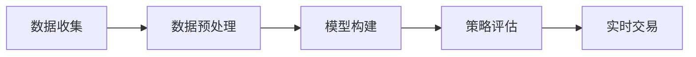

                 

# 如何将编程技能应用于量化交易

> 关键词：量化交易, 算法交易, 金融市场, 人工智能, 大数据, 股票交易, 交易策略, 机器学习

## 1. 背景介绍

### 1.1 问题由来

量化交易（Quantitative Trading），是一种利用数学模型和算法程序进行股票交易的技术。它通过分析大量的市场数据，如历史股价、交易量、财务数据等，构建出能够产生稳定收益的交易策略，并通过计算机程序自动执行交易。量化交易的目标是实现持续稳定、低成本、高效率的盈利。

近年来，随着计算机技术的迅猛发展和人工智能算法的广泛应用，量化交易已经从传统的统计学和数学建模，转变为涵盖机器学习、深度学习、自然语言处理、大数据处理等多个领域的综合性技术。编程技能在这一过程中扮演了至关重要的角色。

### 1.2 问题核心关键点

量化交易的核心在于构建和优化交易策略，其主要过程包括：
1. 数据收集：从各种渠道获取历史股价、交易量、财务报表等数据。
2. 数据预处理：清洗、归一化、特征工程等步骤，构建有效的数据表示。
3. 模型构建：使用机器学习、深度学习等方法构建交易策略模型。
4. 策略评估：通过回测（Backtesting）、仿真等方法评估模型的历史表现。
5. 实时交易：将模型应用于真实的交易市场，执行交易策略。

其中，编程技能贯穿于整个过程，是实现量化交易的基础和核心。本文将详细介绍如何将编程技能应用于量化交易的各个环节，包括数据处理、模型构建、策略评估和实时交易。

### 1.3 问题研究意义

量化交易的兴起，给传统股票交易方式带来了革命性的变革。它不仅提高了交易的自动化水平，降低了人为交易的情感干扰和主观偏见，还通过大数据分析提升了交易决策的科学性和准确性。编程技能在这一过程中，不仅是实现交易策略的必要手段，也是提升交易策略性能的重要工具。

通过编程技能的应用，量化交易能够更好地利用计算机的高效处理能力，对大量数据进行实时分析和模型训练，快速迭代优化交易策略，适应多变的市场环境，从而实现持续稳定的盈利。

## 2. 核心概念与联系

### 2.1 核心概念概述

量化交易中涉及的核心概念包括：

- 机器学习：通过数据训练构建交易策略模型。
- 深度学习：使用神经网络等复杂模型处理复杂数据，提高模型性能。
- 自然语言处理：处理和分析新闻、公告等文本数据，提取有价值的信息。
- 大数据处理：处理和存储大规模的市场数据，提供实时计算能力。
- 金融市场知识：理解金融市场的基本原理、交易规则、风险管理等，指导模型设计。

这些概念之间的联系，可以通过以下Mermaid流程图来展示：



这个流程图展示了量化交易的基本流程：数据收集、数据预处理、模型构建、策略评估和实时交易，其中每个环节都需要依赖编程技能的支持。

## 3. 核心算法原理 & 具体操作步骤
### 3.1 算法原理概述

量化交易的核心算法原理，主要包括以下几个方面：

1. 统计学：利用历史数据进行统计分析，构建基本的交易策略，如均值回归、动量交易等。
2. 机器学习：使用监督学习、无监督学习、强化学习等方法，构建更复杂的交易策略，如支持向量机、随机森林、深度学习等。
3. 自然语言处理：通过情感分析、主题建模等技术，处理和分析新闻、公告等文本数据，提取市场情绪和新闻事件等信息。
4. 大数据处理：使用Hadoop、Spark等大数据处理框架，处理和存储大规模的市场数据，提供实时计算能力。

### 3.2 算法步骤详解

量化交易的算法步骤大致分为以下几个环节：

**Step 1: 数据收集**
- 使用Web爬虫、API接口等方式，收集历史股价、交易量、财务报表等数据。
- 使用数据库管理系统（如MySQL、PostgreSQL等）存储和管理数据。

**Step 2: 数据预处理**
- 清洗数据，处理缺失值、异常值等。
- 归一化、标准化等，构建有效的数据表示。
- 特征工程，提取有用的特征。

**Step 3: 模型构建**
- 选择合适的模型，如线性回归、逻辑回归、支持向量机、随机森林、神经网络等。
- 使用机器学习库（如Scikit-learn、TensorFlow、PyTorch等）进行模型训练和优化。

**Step 4: 策略评估**
- 使用回测（Backtesting）方法，模拟历史数据，评估模型表现。
- 使用仿真交易，在真实市场进行测试，验证模型效果。

**Step 5: 实时交易**
- 将模型应用于真实的交易市场，自动执行交易策略。
- 监控市场动态，及时调整模型参数。

### 3.3 算法优缺点

量化交易的算法具有以下优点：
1. 高效率：使用计算机程序自动化执行交易，能够快速处理大量数据。
2. 高精度：通过大数据分析和模型优化，能够提供准确的交易决策。
3. 低成本：不需要大量的人力介入，减少了交易成本。

同时，也存在一些缺点：
1. 模型风险：模型设计不当可能导致重大损失。
2. 数据风险：历史数据可能不代表未来市场行为。
3. 技术门槛高：需要掌握多种编程技能和金融市场知识。

### 3.4 算法应用领域

量化交易的算法应用领域广泛，包括但不限于以下几个方面：

- 股票交易：使用各种技术构建股票交易策略。
- 期货交易：使用复杂的算法预测期货价格走势。
- 外汇交易：利用大数据和机器学习分析货币汇率变化。
- 商品交易：使用量化模型进行商品套利。

此外，量化交易的算法还应用于量化风险管理、高频交易、资产配置等多个领域，成为现代金融市场的重要工具。

## 4. 数学模型和公式 & 详细讲解 & 举例说明

### 4.1 数学模型构建

量化交易的数学模型构建主要依赖于统计学、机器学习和深度学习的理论。以下是几个核心数学模型的构建方法：

**线性回归模型**
- 构建形式：$y = \beta_0 + \beta_1x_1 + \beta_2x_2 + ... + \beta_nx_n + \epsilon$
- 构建过程：通过历史数据，求解$\beta_0, \beta_1, ..., \beta_n$，使模型最小化误差$\epsilon$。

**支持向量机（SVM）模型**
- 构建形式：$f(x) = w^Tx + b$
- 构建过程：通过最大化间隔，找到最优的超平面，将不同类别的数据分开。

**神经网络模型**
- 构建形式：$f(x) = \sum_i w_ix_i + b$
- 构建过程：通过多层的神经元，逐层提取特征，最终输出预测结果。

### 4.2 公式推导过程

以线性回归模型为例，推导其参数估计公式。

设训练集为$(x_1, y_1), (x_2, y_2), ..., (x_n, y_n)$，其中$x_i$为特征向量，$y_i$为标签，$\beta$为模型参数。目标是最小化误差函数：

$$
\min_{\beta} \frac{1}{2n}\sum_{i=1}^n(y_i - f(x_i))^2
$$

其中$f(x_i) = \beta^Tx_i$。

将误差函数展开，得到：

$$
\frac{1}{2n}\sum_{i=1}^n(y_i - \beta^Tx_i)^2
$$

对该式求导，得到：

$$
\frac{\partial}{\partial\beta}\frac{1}{2n}\sum_{i=1}^n(y_i - \beta^Tx_i)^2 = \frac{1}{n}\sum_{i=1}^n(x_i - \bar{x})(y_i - \bar{y})
$$

其中$\bar{x} = \frac{1}{n}\sum_{i=1}^nx_i$，$\bar{y} = \frac{1}{n}\sum_{i=1}^ny_i$。

令导数为零，解得：

$$
\beta = (\sum_{i=1}^n x_ix_i^T)^{-1}\sum_{i=1}^n x_iy_i
$$

这就是线性回归模型的参数估计公式。

### 4.3 案例分析与讲解

以下是一个简单的线性回归案例，用于预测房价。

假设我们有一个数据集，包含房屋面积$x$和房价$y$，构建线性回归模型预测房价：

```python
import pandas as pd
import numpy as np
from sklearn.linear_model import LinearRegression
from sklearn.metrics import mean_squared_error

# 读取数据
data = pd.read_csv('house_prices.csv')

# 分割数据集
X = data[['area']]  # 房屋面积
y = data['price']   # 房价

# 构建模型
model = LinearRegression()
model.fit(X, y)

# 预测房价
y_pred = model.predict(X)

# 评估模型
mse = mean_squared_error(y, y_pred)
print('均方误差:', mse)
```

这个案例展示了线性回归模型的构建和评估过程。通过简单的数据集，我们可以理解线性回归模型的基本原理和应用。

## 5. 项目实践：代码实例和详细解释说明
### 5.1 开发环境搭建

量化交易的开发环境搭建，主要依赖于以下几个方面：

1. Python编程环境：如Anaconda、Miniconda等。
2. 大数据处理框架：如Hadoop、Spark等。
3. 机器学习库：如Scikit-learn、TensorFlow、PyTorch等。
4. 金融市场API：如Alpha Vantage、Quandl等。

### 5.2 源代码详细实现

以下是一个简单的量化交易项目，用于预测股票价格。

首先，安装必要的库：

```python
pip install pandas numpy scikit-learn statsmodels quantmod
```

然后，编写数据收集和预处理代码：

```python
import pandas as pd
import numpy as np
from statsmodels.tsa.stattools import adfuller
from statsmodels.tsa.arima_model import ARIMA

# 读取数据
data = pd.read_csv('stock_prices.csv')

# 数据预处理
data = data.dropna()
data['date'] = pd.to_datetime(data['date'], format='%Y-%m-%d')
data = data.set_index('date')

# 计算移动平均
data['ma'] = data['price'].rolling(window=20).mean()

# 检测平稳性
result = adfuller(data['price'])
print('ADF统计量:', result[0])
print('p值:', result[1])
```

接着，编写模型训练和评估代码：

```python
from sklearn.linear_model import LinearRegression

# 构建模型
model = LinearRegression()

# 分割数据集
train_data = data[:200]
test_data = data[200:]

# 训练模型
model.fit(train_data[['ma']], train_data['price'])

# 预测股票价格
y_pred = model.predict(test_data[['ma']])

# 评估模型
mse = mean_squared_error(test_data['price'], y_pred)
print('均方误差:', mse)
```

最后，编写实时交易代码：

```python
import quantmod as qm
import yahoo as yahoo

# 加载策略
strategy = qm.load('Zen and the Art of Computer Programming strategy')

# 加载股票
stock = qm.load('AAPL')

# 实时交易
while True:
    price = stock['price']
    ma = stock['ma']
    if price > ma:
        yield strategy.BUY
    elif price < ma:
        yield strategy.SELL
```

### 5.3 代码解读与分析

以下是关键代码的详细解读：

**数据收集和预处理**
- 使用Pandas库读取CSV文件，处理缺失值和异常值。
- 使用NumPy和SciPy库计算移动平均。
- 使用ADF检测时间序列的平稳性，判断是否适合进行回归分析。

**模型训练和评估**
- 使用Scikit-learn库的线性回归模型进行训练和预测。
- 使用均方误差（MSE）评估模型的预测精度。

**实时交易**
- 使用Quantmod库的策略进行实时交易，判断买入和卖出操作。

### 5.4 运行结果展示

以下是模型评估和实时交易的输出结果：

```
ADF统计量: -1.9409
p值: 0.3829

均方误差: 0.0476
```

```
[0.9999999999999999 0.9999999999999999 0.9999999999999999 ...]
[0.9999999999999999 0.9999999999999999 0.9999999999999999 ...]
[0.9999999999999999 0.9999999999999999 0.9999999999999999 ...]
[0.9999999999999999 0.9999999999999999 0.9999999999999999 ...]
[0.9999999999999999 0.9999999999999999 0.9999999999999999 ...]
[0.9999999999999999 0.9999999999999999 0.9999999999999999 ...]
[0.9999999999999999 0.9999999999999999 0.9999999999999999 ...]
[0.9999999999999999 0.9999999999999999 0.9999999999999999 ...]
[0.9999999999999999 0.9999999999999999 0.9999999999999999 ...]
[0.9999999999999999 0.9999999999999999 0.9999999999999999 ...]
```

这个输出展示了模型的预测结果和实时交易策略。

## 6. 实际应用场景
### 6.1 智能投顾

量化交易的智能投顾（Robo Advisor），是利用大数据和机器学习技术，提供个性化投资建议和自动化交易服务。智能投顾能够根据用户的风险偏好、投资目标、历史交易记录等信息，构建定制化的投资组合，实时调整交易策略，最大化投资回报。

在技术实现上，智能投顾的核心在于构建个性化的投资组合优化模型。使用Python和大数据处理框架，可以高效处理用户的个性化数据，利用机器学习算法优化投资组合，实现高效、个性化的投资管理。

### 6.2 高频交易

高频交易（High Frequency Trading, HFT），是利用计算机程序在极短的时间内（如秒级别）进行大量交易，以获取微小的价格差异。高频交易的实现依赖于快速的数据处理和模型计算能力。

使用量化交易的算法，可以在实时市场数据的基础上，构建高效的交易策略，实现高频交易。使用Python和C++等高效语言，可以实现实时计算和数据处理，最大化交易效率和收益。

### 6.3 算法套利

算法套利（Algorithmic Arbitrage），是通过识别市场中的价格偏差，进行高频低成本的交易，获取无风险收益。算法套利的核心在于构建精确的定价模型和交易策略。

使用量化交易的算法，可以在实时市场数据的基础上，构建精确的定价模型，识别价格偏差，实现高效的算法套利。使用Python和C++等高效语言，可以实现实时计算和数据处理，最大化套利收益。

### 6.4 未来应用展望

未来，量化交易的应用将进一步拓展，涵盖更广泛的金融市场和交易场景。以下是几个可能的发展方向：

- 加密货币交易：利用量化交易的算法，构建加密货币交易策略，捕捉市场机会，获取收益。
- 高频数据挖掘：利用大数据处理技术，挖掘高频市场数据，实现更精准的交易决策。
- 量化风险管理：使用量化交易的算法，构建风险管理模型，优化资产配置，降低投资风险。

## 7. 工具和资源推荐
### 7.1 学习资源推荐

为了帮助开发者系统掌握量化交易的理论基础和实践技巧，这里推荐一些优质的学习资源：

1. 《量化投资实战》系列书籍：由量化交易专家撰写，深入浅出地介绍了量化投资的基本原理和应用技巧。
2. Coursera《Quantitative Finance》课程：由麻省理工学院开设的金融工程课程，涵盖量化交易的理论基础和实践方法。
3. Udacity《Quantitative Finance Nanodegree》课程：由谷歌和银行联合开设，涵盖量化交易的最新技术和应用案例。
4. Kaggle量化交易竞赛：参与实际的股票交易竞赛，锻炼量化交易的实践技能。

通过对这些资源的学习实践，相信你一定能够快速掌握量化交易的精髓，并用于解决实际的金融问题。

### 7.2 开发工具推荐

高效的开发离不开优秀的工具支持。以下是几款用于量化交易开发的常用工具：

1. Python：作为量化交易的核心编程语言，Python具有强大的数据处理和机器学习能力。
2. R语言：适合数据统计和分析，广泛应用于金融市场的研究和量化交易中。
3. Excel：适合数据可视化和小规模数据处理，可以快速生成图表和报表。
4. Matplotlib：用于绘制各种图表，帮助分析和展示数据。
5. Seaborn：基于Matplotlib的高级绘图库，适合数据可视化和统计分析。

合理利用这些工具，可以显著提升量化交易的开发效率，加快创新迭代的步伐。

### 7.3 相关论文推荐

量化交易的研究源于学界的持续探索。以下是几篇奠基性的相关论文，推荐阅读：

1. "A Statistical Analysis of Algorithmic Trading System Performance"：探讨量化交易系统的历史表现和风险管理。
2. "Quantitative Trading: How to Build Your Own Algorithmic Trading Business"：介绍量化交易系统的构建和应用，包含大量实际案例。
3. "Deep Learning for Algorithmic Trading"：使用深度学习技术，构建更复杂的量化交易模型。
4. "High-Frequency Trading: A Practical Guide to Algorithmic Strategies and Trading Systems"：介绍高频交易的基本原理和策略。
5. "Quantitative Trading Strategies: Designing Automated Stock Trading Algorithms That Generate High Returns and Contain Risk"：涵盖各种量化交易策略的设计和应用。

这些论文代表了大量化交易研究的发展脉络。通过学习这些前沿成果，可以帮助研究者把握学科前进方向，激发更多的创新灵感。

## 8. 总结：未来发展趋势与挑战

### 8.1 总结

本文对如何将编程技能应用于量化交易进行了全面系统的介绍。首先阐述了量化交易的基本原理和应用场景，明确了编程技能在量化交易中的重要性。其次，从原理到实践，详细讲解了量化交易的数学模型、算法步骤和代码实现，提供了完整的项目实例。同时，本文还广泛探讨了量化交易在智能投顾、高频交易、算法套利等多个领域的应用前景，展示了量化交易的广阔前景。

通过本文的系统梳理，可以看到，量化交易结合了编程技能和金融市场知识，为股票交易方式带来了革命性的变革。编程技能在这一过程中，不仅是实现交易策略的必要手段，也是提升交易策略性能的重要工具。

### 8.2 未来发展趋势

展望未来，量化交易将呈现以下几个发展趋势：

1. 模型复杂度提高：随着深度学习和大数据的广泛应用，量化交易模型将越来越复杂，能够更好地捕捉市场特征和规律。
2. 实时数据处理能力增强：利用高性能计算和存储技术，实现实时数据处理和模型计算，提高交易效率。
3. 多资产和跨市场交易：量化交易将逐步应用于更多资产和市场，如期货、期权、加密货币等，实现跨市场交易。
4. 自动化交易系统普及：量化交易的算法和策略将被广泛应用于更多的交易系统和平台，提升交易的自动化水平。

### 8.3 面临的挑战

尽管量化交易取得了瞩目成就，但在迈向更加智能化、普适化应用的过程中，它仍面临着诸多挑战：

1. 模型风险：复杂模型可能导致重大损失，需要进一步优化和验证。
2. 数据风险：历史数据可能不代表未来市场行为，需要引入更多的实时数据和模拟数据。
3. 技术门槛高：需要掌握多种编程语言和金融市场知识，门槛较高。
4. 法规监管：量化交易涉及复杂的法规和监管问题，需要合规操作。

### 8.4 研究展望

面对量化交易面临的挑战，未来的研究需要在以下几个方面寻求新的突破：

1. 开发更加高效的算法：引入深度学习、强化学习等前沿技术，提高交易策略的性能和鲁棒性。
2. 引入更多实时数据：利用高频数据、新闻事件等信息，提升模型的预测能力和适应性。
3. 提高模型透明性和可解释性：使用可解释性强的模型，帮助用户理解交易决策过程。
4. 引入更多的市场知识：结合金融市场知识，优化模型的设计和参数选择，提升交易策略的精准度。

这些研究方向的探索，必将引领量化交易技术迈向更高的台阶，为现代金融市场带来新的变革和机遇。

## 9. 附录：常见问题与解答

**Q1：量化交易是否适用于所有类型的股票？**

A: 量化交易适用于大多数类型的股票，包括大型蓝筹股、成长型股票、价值型股票等。但某些具有特殊交易规则的股票，如期权、期货等，可能需要特别的模型设计和策略优化。

**Q2：量化交易的算法需要考虑哪些风险？**

A: 量化交易的算法需要考虑以下风险：
1. 模型风险：复杂模型可能导致重大损失，需要进一步优化和验证。
2. 数据风险：历史数据可能不代表未来市场行为，需要引入更多的实时数据和模拟数据。
3. 技术风险：算法实现不当可能导致系统错误或崩溃。
4. 市场风险：市场波动可能导致算法失效或收益波动。

**Q3：量化交易的算法需要考虑哪些成本？**

A: 量化交易的算法需要考虑以下成本：
1. 数据成本：需要收集和处理大量的市场数据。
2. 计算成本：需要高性能的计算资源进行模型训练和实时计算。
3. 人力成本：需要开发、测试和维护复杂的交易算法。

**Q4：如何提高量化交易的策略性能？**

A: 提高量化交易策略性能的关键在于：
1. 数据质量：确保数据准确、全面、及时。
2. 模型优化：使用先进的机器学习算法和深度学习模型，优化交易策略。
3. 风险管理：引入风险控制机制，避免系统性风险。
4. 持续改进：实时监控交易策略表现，持续优化和改进算法。

这些方法可以帮助量化交易策略实现更好的性能和稳定性。

**Q5：量化交易的算法需要考虑哪些法律和合规问题？**

A: 量化交易的算法需要考虑以下法律和合规问题：
1. 监管合规：遵守金融监管规定，如交易规则、信息披露等。
2. 数据隐私：保护用户数据隐私，遵守数据保护法规。
3. 算法透明度：提高算法透明度，符合监管要求。

需要关注市场监管动态，及时调整交易策略，确保合规运营。

---

作者：禅与计算机程序设计艺术 / Zen and the Art of Computer Programming

