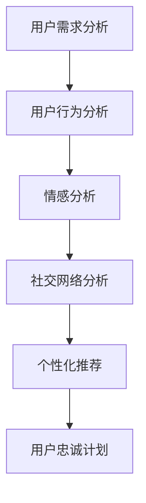

                 

## 1. 背景介绍

在知识付费时代，知识服务已经成为了一个新兴且快速增长的市场。从在线课程、电子书、音频书籍，到专栏文章和直播讲座，各种形式的知识付费产品层出不穷，满足了用户日益增长的知识需求。然而，随着市场竞争的加剧，如何提升知识付费产品的用户忠诚度，成为了运营者亟需解决的问题。

本文将从用户的心理和行为模型出发，介绍一套基于数据分析和心理学的策略，通过优化用户体验、增加用户粘性、增强品牌价值等手段，全面提升知识付费产品的用户忠诚度。

## 2. 核心概念与联系

### 2.1 核心概念概述

为了更好地理解如何提高知识付费产品的用户忠诚度，本节将介绍几个核心概念：

1. **用户需求分析**：通过分析用户的核心需求和心理特征，确定产品服务的定位和内容，提供符合用户期望的价值。

2. **用户行为分析**：通过追踪和分析用户在产品中的行为轨迹，识别用户流失的临界点，优化用户体验和操作流程。

3. **情感分析**：通过情感分析技术，识别用户对产品内容的满意度和使用体验的感受，及时调整产品功能和优化服务。

4. **社交网络分析**：通过分析用户在社交网络上的互动行为，了解用户群体的影响力和传播路径，进行有效的市场推广。

5. **个性化推荐**：根据用户的历史行为数据和偏好，提供个性化的课程推荐，提升用户的使用频率和满意度。

6. **用户忠诚计划**：设计有吸引力的忠诚度计划，如积分系统、会员特权、定制服务等，增强用户的归属感和忠诚度。

这些概念之间的逻辑关系可以通过以下Mermaid流程图来展示：



这个流程图展示了大规模语言模型微调的核心概念及其之间的关系：

1. 用户需求分析是起点，帮助确定产品定位和内容。
2. 用户行为分析贯穿始终，识别用户流失和满意度的临界点。
3. 情感分析用于感知用户的情感，及时调整产品。
4. 社交网络分析帮助了解用户群体的影响力和传播路径。
5. 个性化推荐提升用户体验，增加使用频率。
6. 用户忠诚计划进一步增强用户的忠诚度和归属感。

## 3. 核心算法原理 & 具体操作步骤
### 3.1 算法原理概述

提高知识付费产品的用户忠诚度，本质上是一个数据驱动的优化过程。其核心思想是通过收集和分析用户数据，识别用户需求和行为特征，进而优化产品功能和用户体验，提升用户满意度和忠诚度。

具体而言，可以采用以下步骤：

1. **用户数据收集**：收集用户在产品中的各种行为数据，如课程学习进度、互动评论、社交分享等。
2. **数据分析与建模**：通过数据分析工具和机器学习模型，对用户数据进行建模和特征提取，识别用户流失的预警信号和满意度的影响因素。
3. **用户体验优化**：根据分析结果，优化课程内容、界面设计、交互流程等用户体验元素，提升用户的整体满意度。
4. **个性化推荐**：利用推荐系统，向用户推荐感兴趣的内容，增加使用频率和粘性。
5. **忠诚计划设计**：设计具有吸引力的忠诚计划，如积分系统、会员特权等，增强用户对产品的依赖性和忠诚度。

### 3.2 算法步骤详解

#### 3.2.1 用户数据收集

为了进行深入的数据分析和建模，首先需要收集用户在产品中的各种行为数据。具体来说，可以从以下几个方面入手：

1. **学习行为数据**：记录用户学习的课程进度、学习时长、课程评分等。
2. **互动行为数据**：记录用户在课程讨论区、评论区、直播互动区等平台的互动内容。
3. **社交行为数据**：记录用户在社交网络平台上的分享、点赞、评论等互动数据。
4. **会员行为数据**：记录用户的订阅情况、会员等级、积分等。

#### 3.2.2 数据分析与建模

收集到用户数据后，可以采用以下方法进行分析和建模：

1. **数据清洗与预处理**：对收集到的数据进行清洗和预处理，去除异常值和噪声，确保数据的准确性和一致性。
2. **用户行为分析**：通过时间序列分析、行为序列分析等方法，识别用户在产品中的行为模式和流失临界点。
3. **情感分析**：使用情感分析技术，如情感词典、情感分类器等，分析用户对课程内容的情感倾向。
4. **社交网络分析**：通过社交网络分析工具，如Gephi、NetworkX等，识别用户群体的影响力和传播路径。
5. **推荐系统建模**：利用协同过滤、基于内容的推荐、深度学习推荐等技术，构建个性化推荐系统。
6. **用户流失模型**：使用分类算法，如决策树、随机森林、神经网络等，构建用户流失预测模型，识别高流失风险用户。

#### 3.2.3 用户体验优化

根据数据分析结果，可以从以下几个方面优化用户体验：

1. **课程内容优化**：根据用户反馈和情感分析结果，优化课程内容和结构，提升课程质量。
2. **界面设计优化**：改善课程界面设计，使其更加直观易用，减少用户操作步骤。
3. **交互流程优化**：简化课程购买、学习、互动等流程，减少用户流失点。
4. **互动社区优化**：增强课程讨论区、评论区等功能，促进用户之间的互动和知识共享。

#### 3.2.4 个性化推荐

个性化推荐可以通过以下步骤实现：

1. **特征提取**：从用户学习行为、互动行为、社交行为等数据中提取特征，如学习时长、课程评分、社交分享次数等。
2. **相似度计算**：计算用户之间的相似度，找到与目标用户兴趣相似的用户群体。
3. **推荐模型训练**：利用协同过滤、基于内容的推荐、深度学习推荐等方法，训练推荐模型，生成个性化的课程推荐列表。
4. **推荐结果展示**：将推荐结果展示给用户，根据用户反馈不断优化推荐算法。

#### 3.2.5 忠诚计划设计

忠诚计划的设计需要考虑以下几个方面：

1. **积分系统设计**：设计积分获取和消耗机制，增加用户的互动频率和粘性。
2. **会员等级设计**：根据用户积分、学习时长等指标，划分会员等级，提供不同级别的会员特权。
3. **会员特权设计**：提供专属内容、早鸟折扣、定制服务等特权，增强用户的归属感和忠诚度。
4. **忠诚度奖励设计**：设计有吸引力的奖励机制，如免费课程、会员折扣等，激励用户持续使用。

### 3.3 算法优缺点

提高知识付费产品的用户忠诚度，通过数据分析和优化，具有以下优点：

1. **数据驱动**：通过数据驱动的优化，可以精准识别用户需求和行为特征，提升产品服务的针对性。
2. **提升用户满意度**：通过优化用户体验和提供个性化推荐，提升用户满意度和使用频率。
3. **增强品牌忠诚度**：通过设计有吸引力的忠诚计划，增强用户对品牌的依赖性和忠诚度。

然而，这种方法也存在一些缺点：

1. **数据隐私问题**：在数据收集和分析过程中，需要处理大量的用户隐私数据，可能面临数据隐私和安全问题。
2. **数据质量问题**：数据收集和预处理过程中，可能存在数据噪声和异常值，影响分析结果的准确性。
3. **模型复杂性问题**：构建和优化推荐系统、用户流失模型等算法，需要较高的技术门槛和计算资源。

### 3.4 算法应用领域

基于数据分析和优化的用户忠诚度提升方法，在知识付费产品中已经得到了广泛应用，具体领域包括：

1. **在线课程平台**：如Coursera、edX等，通过分析用户学习行为，提供个性化推荐和优化课程内容，提升用户满意度和忠诚度。
2. **电子书和音频书籍平台**：如Kindle、喜马拉雅等，通过分析用户阅读和收听行为，提供个性化推荐和优化内容，提升用户粘性。
3. **知识社区和直播平台**：如知乎、B站等，通过分析用户互动行为，优化社区氛围和内容推荐，增强用户归属感。

除了上述这些领域外，个性化推荐和用户忠诚计划等技术，还在电商、金融、医疗等多个领域得到了广泛应用，展示了其强大的数据驱动优化能力。

## 4. 数学模型和公式 & 详细讲解 & 举例说明
### 4.1 数学模型构建

本节将使用数学语言对用户忠诚度提升方法进行更加严格的刻画。

设知识付费产品的用户数量为 $N$，用户流失率为 $r$，用户活跃度为 $a$。用户在产品中的行为可以用时间序列 $t_i$ 表示，其中 $t_i$ 为时间步长，$i=1,2,\dots,N$。用户流失的风险可以通过以下模型进行建模：

$$
P(r_i=1|t_i) = f(t_i)
$$

其中 $r_i=1$ 表示用户在时间步长 $t_i$ 时流失，$f(t_i)$ 为流失风险函数，可以通过机器学习模型进行训练。

### 4.2 公式推导过程

为了进一步优化用户体验和个性化推荐，可以对用户行为数据进行建模和预测。以课程学习行为为例，可以采用时间序列分析方法，建立预测模型：

设用户 $i$ 在学习课程 $j$ 的时间序列为 $(x_{ij}^{(t)})_{t=1}^{T_j}$，其中 $x_{ij}^{(t)}$ 为时间步长 $t$ 时用户 $i$ 的学习状态，$T_j$ 为课程 $j$ 的总时长。可以建立以下预测模型：

$$
\hat{x}_{ij}^{(t)} = \sum_{k=1}^{K} w_k x_{ij}^{(t-k)}
$$

其中 $w_k$ 为权重系数，可以通过回归模型进行训练。

### 4.3 案例分析与讲解

假设某知识付费平台收集到用户的课程学习行为数据，通过时间序列分析模型，可以预测用户的流失风险。具体步骤如下：

1. **数据预处理**：对用户学习行为数据进行清洗和预处理，去除异常值和噪声。
2. **时间序列分析**：采用ARIMA等时间序列分析方法，建立预测模型，预测用户的流失风险。
3. **风险预警**：根据流失风险模型，设定预警阈值，对高流失风险用户进行针对性干预。

## 5. 项目实践：代码实例和详细解释说明
### 5.1 开发环境搭建

在进行用户忠诚度提升实践前，我们需要准备好开发环境。以下是使用Python进行TensorFlow开发的环境配置流程：

1. 安装Anaconda：从官网下载并安装Anaconda，用于创建独立的Python环境。

2. 创建并激活虚拟环境：
```bash
conda create -n pytorch-env python=3.8 
conda activate pytorch-env
```

3. 安装PyTorch：根据CUDA版本，从官网获取对应的安装命令。例如：
```bash
conda install pytorch torchvision torchaudio cudatoolkit=11.1 -c pytorch -c conda-forge
```

4. 安装TensorFlow：
```bash
pip install tensorflow
```

5. 安装各类工具包：
```bash
pip install numpy pandas scikit-learn matplotlib tqdm jupyter notebook ipython
```

完成上述步骤后，即可在`pytorch-env`环境中开始用户忠诚度提升实践。

### 5.2 源代码详细实现

下面我们以推荐系统为例，给出使用TensorFlow实现个性化推荐功能的PyTorch代码实现。

首先，定义推荐系统的用户和课程数据：

```python
import tensorflow as tf
import pandas as pd

# 定义用户和课程数据
users = pd.read_csv('users.csv')
courses = pd.read_csv('courses.csv')
```

然后，定义模型和优化器：

```python
from tensorflow.keras.layers import Input, Dense, Embedding, Dot, Dropout
from tensorflow.keras.models import Model
from tensorflow.keras.optimizers import Adam

# 定义输入层和嵌入层
user_input = Input(shape=(1,), name='user')
course_input = Input(shape=(1,), name='course')

# 定义用户和课程嵌入层
user_embedding = Embedding(input_dim=1000, output_dim=128, name='user_embedding')(user_input)
course_embedding = Embedding(input_dim=1000, output_dim=128, name='course_embedding')(course_input)

# 定义相似度计算层
dot_product = Dot(axes=2, normalize=True)([user_embedding, course_embedding])
dropout = Dropout(0.1)(dot_product)

# 定义输出层
output = Dense(1, activation='sigmoid', name='output')(dropout)

# 定义模型
model = Model(inputs=[user_input, course_input], outputs=output)
model.compile(loss='binary_crossentropy', optimizer=Adam(lr=0.001), metrics=['accuracy'])
```

接着，定义训练和评估函数：

```python
from tensorflow.keras.callbacks import EarlyStopping

# 定义训练函数
def train_model(model, train_data, validation_data, batch_size, epochs):
    history = model.fit(train_data, validation_data=validation_data, batch_size=batch_size, epochs=epochs, callbacks=[EarlyStopping(patience=3)])

# 定义评估函数
def evaluate_model(model, test_data):
    test_loss, test_accuracy = model.evaluate(test_data)
    print(f'Test Loss: {test_loss:.4f}')
    print(f'Test Accuracy: {test_accuracy:.4f}')
```

最后，启动训练流程并在测试集上评估：

```python
epochs = 10
batch_size = 128

# 定义训练数据和测试数据
train_data = tf.data.Dataset.from_tensor_slices((users, courses)).batch(batch_size)
validation_data = tf.data.Dataset.from_tensor_slices((users, courses)).batch(batch_size)
test_data = tf.data.Dataset.from_tensor_slices((users, courses)).batch(batch_size)

# 训练模型
train_model(model, train_data, validation_data, batch_size, epochs)

# 评估模型
evaluate_model(model, test_data)
```

以上就是使用TensorFlow实现个性化推荐系统的完整代码实现。可以看到，TensorFlow提供了便捷的深度学习模型构建和训练接口，结合用户行为数据，可以高效地构建和优化个性化推荐系统。

### 5.3 代码解读与分析

让我们再详细解读一下关键代码的实现细节：

**定义用户和课程数据**：
- 使用Pandas库读取用户和课程的CSV文件，构建用户-课程的矩阵数据。

**模型和优化器定义**：
- 定义输入层、嵌入层、相似度计算层和输出层，构建推荐模型。
- 使用Adam优化器进行模型训练，设定学习率和损失函数。

**训练和评估函数**：
- 使用TensorFlow的Data API，将用户和课程数据加载到模型中。
- 定义训练函数，使用EarlyStopping回调函数避免过拟合。
- 定义评估函数，输出模型在测试集上的损失和精度。

**训练和评估流程**：
- 设定模型训练的轮数和批大小，开始训练模型。
- 在验证集上监控模型训练过程，避免过拟合。
- 在测试集上评估模型性能，输出评估结果。

可以看到，通过TensorFlow的强大生态系统和便捷接口，构建和优化个性化推荐系统变得异常简单和高效。开发者可以将更多精力放在业务逻辑和模型优化上，而不必过多关注底层实现细节。

## 6. 实际应用场景
### 6.1 智能客服系统

基于数据分析和优化的用户忠诚度提升方法，可以广泛应用于智能客服系统的构建。传统客服往往需要配备大量人力，高峰期响应缓慢，且一致性和专业性难以保证。而使用数据分析和个性化推荐技术，可以7x24小时不间断服务，快速响应客户咨询，用自然流畅的语言解答各类常见问题。

在技术实现上，可以收集企业内部的历史客服对话记录，将问题和最佳答复构建成监督数据，在此基础上对推荐系统进行微调。推荐系统能够自动理解用户意图，匹配最合适的答案模板进行回复。对于客户提出的新问题，还可以接入检索系统实时搜索相关内容，动态组织生成回答。如此构建的智能客服系统，能大幅提升客户咨询体验和问题解决效率。

### 6.2 金融舆情监测

金融机构需要实时监测市场舆论动向，以便及时应对负面信息传播，规避金融风险。传统的人工监测方式成本高、效率低，难以应对网络时代海量信息爆发的挑战。基于数据分析和情感分析技术，可以通过实时抓取的网络文本数据，自动监测不同主题下的情感变化趋势，一旦发现负面信息激增等异常情况，系统便会自动预警，帮助金融机构快速应对潜在风险。

### 6.3 个性化推荐系统

当前的推荐系统往往只依赖用户的历史行为数据进行物品推荐，无法深入理解用户的真实兴趣偏好。基于数据分析和个性化推荐技术，可以更好地挖掘用户行为背后的语义信息，从而提供更精准、多样的推荐内容。

在实践中，可以收集用户浏览、点击、评论、分享等行为数据，提取和用户交互的物品标题、描述、标签等文本内容。将文本内容作为模型输入，用户的后续行为（如是否点击、购买等）作为监督信号，在此基础上微调推荐系统。推荐系统能够从文本内容中准确把握用户的兴趣点。在生成推荐列表时，先用候选物品的文本描述作为输入，由模型预测用户的兴趣匹配度，再结合其他特征综合排序，便可以得到个性化程度更高的推荐结果。

### 6.4 未来应用展望

随着数据分析和推荐技术的发展，用户忠诚度提升方法将有更广阔的应用前景。

在智慧医疗领域，基于数据分析和情感分析的智能诊疗系统，可以提升患者满意度和医患关系，加速新药研发进程。

在智能教育领域，数据分析和个性化推荐技术，可以因材施教，促进教育公平，提高教学质量。

在智慧城市治理中，基于数据分析的智能管理系统，可以提高城市管理的自动化和智能化水平，构建更安全、高效的未来城市。

此外，在企业生产、社会治理、文娱传媒等众多领域，基于数据分析的用户忠诚度提升方法，还将不断涌现，为经济社会发展注入新的动力。相信随着技术的日益成熟，数据分析和优化方法必将成为提升用户体验和粘性的重要手段，推动人工智能技术在垂直行业的规模化落地。

## 7. 工具和资源推荐
### 7.1 学习资源推荐

为了帮助开发者系统掌握数据分析和用户忠诚度提升的理论基础和实践技巧，这里推荐一些优质的学习资源：

1. **《数据科学与人工智能基础》系列博文**：由大模型技术专家撰写，深入浅出地介绍了数据分析、机器学习、深度学习等前沿话题。

2. **Coursera《数据科学专项课程》**：斯坦福大学开设的在线课程，涵盖数据清洗、特征工程、模型训练等重要内容，提供实战项目和作业，帮助深入理解数据分析方法。

3. **《Python数据科学手册》书籍**：详细介绍了Python在数据分析和机器学习中的应用，包括Pandas、NumPy、Scikit-learn等库的使用。

4. **TensorFlow官方文档**：提供全面的TensorFlow开发和应用指南，包含丰富的代码示例和教程，是TensorFlow学习的必备资源。

5. **Kaggle数据科学竞赛**：提供大量实际数据集和竞赛项目，通过实战训练数据分析和机器学习技能，积累实际经验。

通过对这些资源的学习实践，相信你一定能够快速掌握数据分析和用户忠诚度提升的精髓，并用于解决实际的业务问题。

### 7.2 开发工具推荐

高效的开发离不开优秀的工具支持。以下是几款用于数据分析和用户忠诚度提升开发的常用工具：

1. **Jupyter Notebook**：功能强大的Jupyter Notebook平台，支持Python、R等语言，提供可视化的代码执行和结果展示，是数据科学和机器学习开发的首选环境。

2. **Tableau**：商业智能工具，支持丰富的数据可视化功能，可以便捷地进行数据探索和报表生成。

3. **Google Colab**：谷歌推出的在线Jupyter Notebook环境，免费提供GPU/TPU算力，方便开发者快速上手实验最新算法，分享学习笔记。

4. **Scikit-learn**：开源的Python机器学习库，提供丰富的机器学习算法和工具，是数据科学和机器学习开发的必备库。

5. **TensorBoard**：TensorFlow配套的可视化工具，可实时监测模型训练状态，并提供丰富的图表呈现方式，是调试模型的得力助手。

6. **TensorFlow Extended (TFX)**：谷歌开发的机器学习平台，提供端到端的机器学习开发、部署和管理，适用于企业级机器学习应用。

合理利用这些工具，可以显著提升数据分析和用户忠诚度提升任务的开发效率，加快创新迭代的步伐。

### 7.3 相关论文推荐

数据分析和用户忠诚度提升技术的发展源于学界的持续研究。以下是几篇奠基性的相关论文，推荐阅读：

1. **《数据挖掘与统计学习》**：李航所著，介绍了数据挖掘和统计学习的核心概念和算法，是数据科学领域的经典教材。

2. **《推荐系统实践》**：王斌所著，详细介绍了推荐系统的理论基础和实践技术，包括协同过滤、基于内容的推荐、深度学习推荐等。

3. **《深度学习》**：Ian Goodfellow等著，介绍了深度学习的核心概念和算法，是机器学习领域的经典教材。

4. **《用户行为分析与挖掘》**：方滨辉等著，介绍了用户行为分析的理论基础和实践方法，涵盖数据预处理、特征工程、模型训练等内容。

5. **《用户行为分析与个性化推荐系统》**：张志强等著，介绍了用户行为分析的理论基础和实践方法，涵盖推荐系统建模、用户行为预测等内容。

这些论文代表了大数据分析和用户忠诚度提升技术的发展脉络。通过学习这些前沿成果，可以帮助研究者把握学科前进方向，激发更多的创新灵感。

## 8. 总结：未来发展趋势与挑战

### 8.1 总结

本文对基于数据分析和优化的用户忠诚度提升方法进行了全面系统的介绍。首先阐述了用户忠诚度提升的研究背景和意义，明确了数据分析在提升用户体验和粘性中的重要价值。其次，从原理到实践，详细讲解了数据分析和优化的方法，给出了用户忠诚度提升的完整代码实例。同时，本文还广泛探讨了数据分析和用户忠诚度提升方法在多个行业领域的应用前景，展示了其强大的数据驱动优化能力。

通过本文的系统梳理，可以看到，基于数据分析和优化的方法，已经成为提升知识付费产品用户忠诚度的重要手段。数据分析技术可以精准识别用户需求和行为特征，提升产品服务的针对性。优化技术可以提升用户体验和个性化推荐，增强用户粘性和满意度。

### 8.2 未来发展趋势

展望未来，数据分析和用户忠诚度提升技术将呈现以下几个发展趋势：

1. **数据驱动的优化**：随着数据量和数据种类的不断增加，数据分析技术将更加普及和高效，提升产品服务的精准性和及时性。
2. **个性化推荐**：个性化推荐技术将更加智能化和多样化，结合更多行为数据和内容数据，提供更精准、高效的推荐服务。
3. **实时监控与预警**：实时监控和预警技术将进一步提升用户体验，快速响应用户需求和行为变化，避免用户流失。
4. **多模态数据融合**：结合文本、图像、视频、语音等多种数据，构建更加全面、准确的个性化推荐系统。
5. **用户参与度提升**：通过增强用户参与度和互动性，构建更强的用户关系和品牌忠诚度，提升用户满意度和粘性。

以上趋势凸显了大数据分析和用户忠诚度提升技术的广阔前景。这些方向的探索发展，必将进一步提升知识付费产品的用户满意度和忠诚度，为用户带来更优质的服务体验。

### 8.3 面临的挑战

尽管数据分析和用户忠诚度提升技术已经取得了显著成果，但在应用过程中，仍面临以下挑战：

1. **数据隐私和安全问题**：在数据收集和分析过程中，需要处理大量的用户隐私数据，可能面临数据隐私和安全问题。
2. **数据质量和完整性问题**：数据收集和预处理过程中，可能存在数据噪声和缺失值，影响分析结果的准确性。
3. **模型复杂性和计算资源问题**：构建和优化推荐系统、用户流失模型等算法，需要较高的技术门槛和计算资源。
4. **用户反馈机制**：如何建立有效的用户反馈机制，及时获取用户反馈信息，优化产品和服务，还需进一步探索。
5. **跨平台和跨渠道整合**：如何将用户数据和行为在不同平台和渠道之间进行整合，提供一致的用户体验，也是一大挑战。

### 8.4 研究展望

面向未来，数据分析和用户忠诚度提升技术需要在以下几个方面寻求新的突破：

1. **无监督学习和半监督学习**：探索无监督和半监督学习技术，减少对大规模标注数据的依赖，提升数据分析的普适性和可扩展性。
2. **多模态数据融合**：结合文本、图像、视频、语音等多种数据，构建更加全面、准确的个性化推荐系统。
3. **模型压缩与优化**：开发更加高效的模型压缩与优化技术，减小计算资源消耗，提升模型的实时性和部署效率。
4. **用户隐私保护**：结合数据加密、差分隐私等技术，提升数据隐私保护水平，增强用户信任度。
5. **跨平台和跨渠道整合**：研究跨平台和跨渠道的用户数据整合技术，提供一致的用户体验。

这些研究方向将进一步推动数据分析和用户忠诚度提升技术的发展，提升知识付费产品的用户体验和粘性，为人工智能技术在垂直行业的规模化落地提供新的思路和手段。

## 9. 附录：常见问题与解答

**Q1：数据分析和优化的方法是否适用于所有知识付费产品？**

A: 数据分析和优化的方法在大多数知识付费产品中都能取得不错的效果，特别是对于数据量较小的任务。但对于一些特定领域的任务，如医学、法律等，仅仅依靠通用语料预训练的模型可能难以很好地适应。此时需要在特定领域语料上进一步预训练，再进行微调，才能获得理想效果。此外，对于一些需要时效性、个性化很强的任务，如对话、推荐等，数据分析和优化方法也需要针对性的改进优化。

**Q2：如何选择合适的学习率？**

A: 数据分析和优化的学习率一般要比预训练时小1-2个数量级，如果使用过大的学习率，容易破坏预训练权重，导致过拟合。一般建议从1e-5开始调参，逐步减小学习率，直至收敛。也可以使用warmup策略，在开始阶段使用较小的学习率，再逐渐过渡到预设值。需要注意的是，不同的优化器(如AdamW、Adafactor等)以及不同的学习率调度策略，可能需要设置不同的学习率阈值。

**Q3：在数据分析和优化过程中，如何处理数据隐私问题？**

A: 在数据分析和优化过程中，需要处理大量的用户隐私数据，可能面临数据隐私和安全问题。解决方法包括：
1. 数据去标识化：通过数据去标识化技术，去除或模糊化敏感信息，保护用户隐私。
2. 差分隐私：使用差分隐私技术，在数据分析过程中引入噪声，保护用户数据隐私。
3. 数据访问控制：对数据访问进行严格的权限控制，确保只有授权人员可以访问敏感数据。
4. 匿名化技术：对数据进行匿名化处理，确保用户身份信息不被泄露。

**Q4：如何在数据分析和优化过程中，提升用户满意度？**

A: 提升用户满意度是数据分析和优化的关键目标。可以通过以下几个方面来提升用户满意度：
1. 个性化推荐：根据用户的历史行为和偏好，提供个性化的课程推荐，增加用户的互动频率和粘性。
2. 用户行为分析：通过分析用户行为轨迹，识别用户流失的临界点，及时采取措施避免用户流失。
3. 情感分析：通过情感分析技术，识别用户对课程内容的满意度，及时调整课程内容和结构。
4. 用户体验优化：优化课程界面设计、交互流程等用户体验元素，提升用户的整体满意度。

**Q5：在数据分析和优化过程中，如何优化模型性能？**

A: 优化模型性能是数据分析和优化的重要任务。可以通过以下几个方面来优化模型性能：
1. 数据清洗和预处理：对数据进行清洗和预处理，去除异常值和噪声，确保数据的准确性和一致性。
2. 特征工程：选择合适的特征，构建有效的特征组合，提升模型的泛化能力和准确性。
3. 模型选择和优化：选择合适的模型和优化算法，调整超参数，提升模型的性能。
4. 模型集成：采用模型集成技术，如Bagging、Boosting等，提升模型的稳定性和准确性。

通过以上优化措施，可以显著提升数据分析和优化模型在实际应用中的性能，为用户带来更好的服务体验。

---

作者：禅与计算机程序设计艺术 / Zen and the Art of Computer Programming

