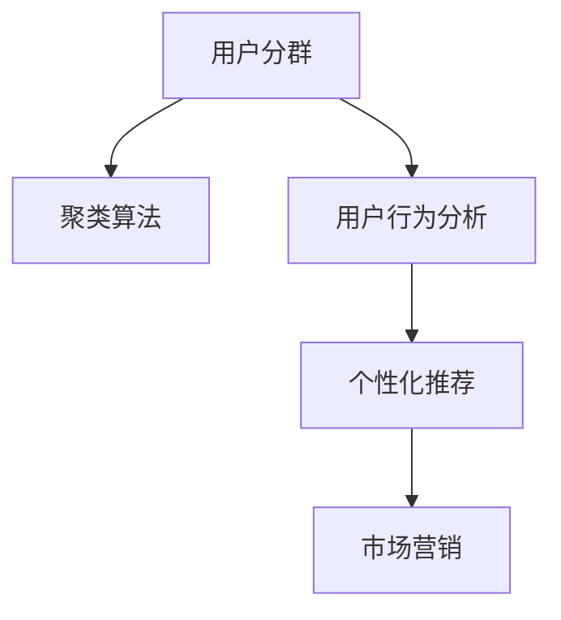

                 

# 如何进行有效的用户分群管理

> 关键词：用户分群,聚类算法,用户行为分析,个性化推荐,市场营销

## 1. 背景介绍

### 1.1 问题由来

在数字化时代，用户分群管理成为企业精细化运营的重要手段。通过对用户行为数据的分析，企业可以更精准地识别不同用户群体，制定个性化的营销策略和产品推荐，从而提升用户满意度和转化率。传统的用户分群方法依赖人工经验和规则，难以全面覆盖所有用户特征，且容易受主观偏见影响。随着大数据和机器学习技术的发展，基于数据驱动的用户分群方法应运而生，逐渐成为主流。

用户分群是指将用户按照其行为特征、兴趣偏好、消费习惯等相似度进行划分，形成具有相似特征的用户群体。有效的用户分群不仅能提升营销精准度，还能优化资源配置，提高运营效率。例如，电商平台的商品推荐系统可以根据用户分群结果，推送更符合用户偏好的商品，提高销售转化率；市场营销团队可以针对不同用户群体制定差异化的推广策略，实现更高的投资回报率。

### 1.2 问题核心关键点

用户分群的本质是数据挖掘和聚类分析，通过将用户数据映射到高维空间，并利用聚类算法寻找相似用户。常用的聚类算法包括K-means、层次聚类、DBSCAN等。此外，用户分群还需要考虑时间、场景、环境等多个因素，以提升分群的准确性和实用性。

用户分群的目的是为了更好地理解用户特征，实现精细化的管理和运营。具体来说，它可以帮助企业：
- 识别高价值用户群体，实现定向营销和个性化推荐。
- 优化产品设计和推广策略，提升用户体验和转化率。
- 监控用户行为变化，及时调整运营策略，防范风险。

### 1.3 问题研究意义

有效的用户分群管理是企业数字化转型的关键环节，对于提升用户体验、优化资源配置、增强市场竞争力具有重要意义：

1. **提升用户满意度**：通过个性化推荐和精准营销，提升用户粘性和满意度，增加用户忠诚度。
2. **优化资源配置**：合理分配营销、客服、技术等资源，提升运营效率和成本效益。
3. **增强市场竞争力**：深入了解用户需求，快速响应市场变化，提升产品和服务的竞争力。
4. **防范风险**：及时识别异常用户行为，防范欺诈、流失等风险，降低运营成本。

## 2. 核心概念与联系

### 2.1 核心概念概述

为更好地理解用户分群管理的核心概念，本节将介绍几个关键术语及其联系：

- **用户分群**：将用户按照其行为特征、兴趣偏好、消费习惯等相似度进行划分，形成具有相似特征的用户群体。
- **聚类算法**：基于相似性度量，将数据点划分为不同类别的算法。常用的聚类算法包括K-means、层次聚类、DBSCAN等。
- **用户行为分析**：通过收集和分析用户在不同场景下的行为数据，提取用户特征，用于用户分群和个性化推荐。
- **个性化推荐**：根据用户分群结果，通过算法为用户推荐最符合其兴趣的产品或内容。
- **市场营销**：利用用户分群结果，制定差异化的营销策略和推广活动，提升投资回报率。

这些核心概念之间的逻辑关系可以通过以下Mermaid流程图来展示：



这个流程图展示了用户分群管理的关键流程和组件：

1. 用户分群通过聚类算法实现，聚类算法依赖用户行为分析结果。
2. 用户行为分析是从用户数据中提取特征的过程。
3. 个性化推荐根据用户分群结果，生成个性化内容。
4. 市场营销利用用户分群结果，制定差异化策略。

## 3. 核心算法原理 & 具体操作步骤
### 3.1 算法原理概述

用户分群管理基于数据驱动的聚类算法，其核心思想是：将用户数据映射到高维空间，利用聚类算法寻找具有相似特征的用户群体。用户分群的数学基础是高维空间中的相似度度量，如欧氏距离、余弦相似度等。

用户分群流程一般包括以下几个关键步骤：

1. **数据预处理**：清洗和预处理用户数据，提取特征，构建数据集。
2. **聚类算法选择**：根据数据特征和问题需求选择合适的聚类算法。
3. **聚类分析**：对数据集进行聚类分析，找到具有相似特征的用户群体。
4. **用户分群**：将用户数据划分为不同类别，生成用户分群结果。
5. **验证评估**：通过指标评估聚类结果的质量和实用性。
6. **应用优化**：根据应用需求和聚类结果，进行后续的个性化推荐、市场营销等操作。

### 3.2 算法步骤详解

#### 3.2.1 数据预处理

用户分群管理的第一步是数据预处理。数据预处理包括数据清洗、特征提取、数据归一化等步骤，目的是从原始数据中提取出有用的信息，并确保数据的一致性和可用性。

1. **数据清洗**：去除缺失、异常、重复的数据，确保数据质量。
2. **特征提取**：从原始数据中提取关键特征，如用户行为、兴趣偏好、消费习惯等。
3. **数据归一化**：将数据映射到[0,1]区间，避免特征尺度差异过大影响模型性能。

#### 3.2.2 聚类算法选择

选择合适的聚类算法是用户分群管理的关键步骤。聚类算法的选择取决于数据特征和应用需求。常用的聚类算法包括：

- **K-means**：基于欧氏距离，将数据点分为K个簇。适合处理大规模数据，但需要手动指定簇数。
- **层次聚类**：基于相似性度量，自底向上或自顶向下构建聚类树。适合处理非球形簇，但计算复杂度较高。
- **DBSCAN**：基于密度，将高密度区域划分为簇，低密度区域视为噪声。适合处理复杂簇结构，但对参数敏感。

#### 3.2.3 聚类分析

聚类分析是用户分群管理的核心步骤，通过聚类算法将用户数据划分为不同类别。聚类分析的目标是找到具有相似特征的用户群体，生成聚类结果。

1. **相似度度量**：选择合适的相似度度量方法，如欧氏距离、余弦相似度等。
2. **聚类算法应用**：应用聚类算法对数据集进行聚类分析。
3. **簇中心计算**：计算每个簇的中心点，用于表示簇特征。
4. **簇评估**：通过簇内距离、簇间距离等指标评估聚类结果的质量。

#### 3.2.4 用户分群

用户分群是指将用户数据划分为不同类别，生成用户分群结果。用户分群通常用于指导后续的个性化推荐和市场营销策略。

1. **簇划分**：根据聚类结果，将用户数据划分为不同簇。
2. **簇编号**：为每个簇分配一个编号，用于标识用户群体。
3. **用户标签**：将用户数据映射到对应的簇编号，生成用户分群结果。

#### 3.2.5 验证评估

聚类结果的质量直接影响后续的应用效果，因此需要通过指标验证聚类结果的实用性和准确性。常用的聚类评估指标包括：

- **簇内距离**：簇内数据点间的距离，用于衡量簇的紧密度。
- **簇间距离**：簇间距离用于衡量簇间的差异性。
- **轮廓系数**：综合评估簇内紧密度和簇间差异性，用于衡量聚类结果的质量。

#### 3.2.6 应用优化

根据聚类结果，可以进行后续的个性化推荐、市场营销等操作，实现精细化管理。

1. **个性化推荐**：根据用户分群结果，为用户推荐最符合其兴趣的产品或内容。
2. **市场营销**：制定差异化的营销策略和推广活动，提升投资回报率。

## 4. 数学模型和公式 & 详细讲解 & 举例说明

### 4.1 数学模型构建

用户分群管理基于高维空间中的聚类算法，其数学模型可以表示为：

$$
X \in \mathbb{R}^{n \times d}, Y \in \{1,2,...,K\}
$$

其中 $X$ 表示用户数据矩阵，$n$ 表示用户数，$d$ 表示特征维度，$Y$ 表示用户分群结果。

聚类算法的目标是找到最优的聚类中心，使得聚类结果的差异性最大化。常用的聚类目标函数包括：

- **K-means目标函数**：

$$
\min_{\mu_1,...,\mu_K} \sum_{i=1}^n \sum_{k=1}^K w_{ik} d(x_i,\mu_k)^2
$$

其中 $\mu_k$ 表示第 $k$ 个簇的中心，$d(x_i,\mu_k)$ 表示用户 $i$ 到簇 $k$ 的距离，$w_{ik}$ 表示用户 $i$ 在簇 $k$ 中的权重。

- **层次聚类目标函数**：

$$
\min_{T} \sum_{i=1}^n \sum_{k=1}^K d(x_i,\mu_k)
$$

其中 $T$ 表示聚类树，$d(x_i,\mu_k)$ 表示用户 $i$ 到簇 $k$ 的距离。

### 4.2 公式推导过程

以K-means算法为例，推导其目标函数的梯度公式。

K-means算法的目标函数为：

$$
\min_{\mu_1,...,\mu_K} \sum_{i=1}^n \sum_{k=1}^K w_{ik} d(x_i,\mu_k)^2
$$

其中 $w_{ik}$ 表示用户 $i$ 在簇 $k$ 中的权重，$d(x_i,\mu_k)$ 表示用户 $i$ 到簇 $k$ 的距离。

对每个簇的中心 $\mu_k$ 求偏导数，得到：

$$
\frac{\partial \mathcal{L}}{\partial \mu_k} = -2 \sum_{i=1}^n w_{ik} (x_i - \mu_k) = -2 \sum_{i=1}^n w_{ik} \Delta_i
$$

其中 $\Delta_i$ 表示用户 $i$ 对簇 $k$ 的贡献。

将上述公式代入梯度公式，得到K-means算法的梯度公式：

$$
\frac{\partial \mathcal{L}}{\partial \mu_k} = -2 \sum_{i=1}^n w_{ik} (x_i - \mu_k)
$$

通过迭代更新每个簇的中心，直至收敛。

### 4.3 案例分析与讲解

以电商平台的个性化推荐为例，分析用户分群管理的实际应用。

电商平台的推荐系统通过收集用户浏览、点击、购买等行为数据，提取用户特征，如商品偏好、浏览时长、购买频率等。将这些特征作为输入，应用K-means算法对用户进行分群。

假设用户数据集 $X$ 包含1000个用户，每个用户有10个特征。应用K-means算法，将用户分为5个簇，每个簇包含200个用户。每个簇的中心点表示簇的特征。

通过聚类结果，可以发现：

- 簇1的用户倾向于购买低价的日用品。
- 簇2的用户倾向于购买高价值的电子产品。
- 簇3的用户倾向于购买个性化定制的商品。

基于这些分群结果，可以制定个性化的推荐策略：

- 向簇1用户推荐价格低廉的日用品。
- 向簇2用户推荐高端电子产品。
- 向簇3用户推荐定制化商品。

通过这种方式，电商平台可以显著提升个性化推荐的准确性和用户满意度。

## 5. 项目实践：代码实例和详细解释说明
### 5.1 开发环境搭建

在进行用户分群管理的项目实践前，需要准备好开发环境。以下是使用Python进行Scikit-learn开发的环境配置流程：

1. 安装Anaconda：从官网下载并安装Anaconda，用于创建独立的Python环境。

2. 创建并激活虚拟环境：
```bash
conda create -n clustering-env python=3.8 
conda activate clustering-env
```

3. 安装Scikit-learn：
```bash
pip install scikit-learn
```

4. 安装numpy、pandas等各类工具包：
```bash
pip install numpy pandas matplotlib scikit-learn scikit-learn-tutorial
```

完成上述步骤后，即可在`clustering-env`环境中开始项目实践。

### 5.2 源代码详细实现

这里我们以K-means算法为例，给出使用Scikit-learn库对用户数据进行聚类分群的Python代码实现。

首先，定义聚类函数：

```python
from sklearn.cluster import KMeans
import numpy as np

def kmeans_clustering(data, k=5, max_iter=100, random_state=0):
    kmeans = KMeans(n_clusters=k, max_iter=max_iter, random_state=random_state)
    kmeans.fit(data)
    return kmeans.labels_, kmeans.cluster_centers_
```

然后，定义用户行为数据分析函数：

```python
from sklearn.preprocessing import MinMaxScaler

def feature_analysis(data, features, scale=True):
    X = data[:, features]
    if scale:
        scaler = MinMaxScaler()
        X = scaler.fit_transform(X)
    return X
```

接着，定义用户分群和评估函数：

```python
from sklearn.metrics import silhouette_score

def user_clustering(data, features, k=5, max_iter=100, random_state=0, scale=True):
    X = feature_analysis(data, features, scale=scale)
    labels, centers = kmeans_clustering(X, k=k, max_iter=max_iter, random_state=random_state)
    silhouette = silhouette_score(X, labels)
    return labels, centers, silhouette
```

最后，启动聚类流程并输出结果：

```python
data = np.random.rand(1000, 10)
features = [0, 1, 2, 3, 4, 5, 6, 7, 8, 9]
labels, centers, silhouette = user_clustering(data, features, k=5, max_iter=100, random_state=0, scale=True)
print(f"Silhouette score: {silhouette:.3f}")
```

以上就是使用Scikit-learn进行用户分群管理的完整代码实现。可以看到，Scikit-learn提供了便捷的聚类算法封装，使得用户分群管理的实现变得非常直观和高效。

### 5.3 代码解读与分析

让我们再详细解读一下关键代码的实现细节：

**kmeans_clustering函数**：
- 定义了一个K-means聚类函数，接受用户数据、簇数、迭代次数和随机种子作为参数。
- 使用KMeans算法进行聚类，返回聚类结果和簇中心。

**feature_analysis函数**：
- 定义了一个用户行为数据分析函数，接受用户数据、特征列和是否进行归一化作为参数。
- 从用户数据中提取指定特征列，并使用MinMaxScaler进行归一化。

**user_clustering函数**：
- 定义了一个用户分群和评估函数，接受用户数据、特征列、簇数、迭代次数、随机种子和是否进行归一化作为参数。
- 对用户数据进行特征分析，并应用K-means算法进行聚类分群。
- 计算轮廓系数，评估聚类结果的质量。

**启动聚类流程**：
- 生成1000个随机用户数据，包含10个特征。
- 指定特征列，进行归一化处理。
- 应用用户分群函数，生成聚类结果和簇中心。
- 输出轮廓系数，评估聚类效果。

可以看到，通过Scikit-learn库的封装，用户分群管理的代码实现变得非常简洁和高效。开发者可以更专注于算法的选择和调参，而不必过多关注底层的实现细节。

当然，工业级的系统实现还需考虑更多因素，如模型的保存和部署、超参数的自动搜索、多模态数据的融合等。但核心的聚类范式基本与此类似。

## 6. 实际应用场景
### 6.1 智能客服系统

智能客服系统通过用户分群管理，可以实现更加高效和个性化的客户服务。

智能客服系统可以收集用户的历史咨询记录、聊天记录等数据，提取用户特征，如问题类型、对话时长、用户满意度等。将这些特征作为输入，应用聚类算法对用户进行分群。

假设用户数据集 $X$ 包含1000个用户，每个用户有5个特征。应用K-means算法，将用户分为5个簇，每个簇包含200个用户。每个簇的中心点表示簇的特征。

通过聚类结果，可以发现：

- 簇1的用户倾向于询问售后服务问题。
- 簇2的用户倾向于咨询产品功能。
- 簇3的用户倾向于投诉服务质量。

基于这些分群结果，可以制定个性化的客服策略：

- 向簇1用户推送售后服务指南。
- 向簇2用户提供产品使用教程。
- 向簇3用户提供快速反馈渠道。

通过这种方式，智能客服系统可以显著提升服务质量和用户满意度。

### 6.2 金融舆情监测

金融舆情监测通过用户分群管理，可以实现更加精准和实时的舆情分析。

金融舆情监测可以收集用户的股票交易记录、新闻评论、社交媒体数据等，提取用户特征，如交易频率、评论情绪、社交互动等。将这些特征作为输入，应用聚类算法对用户进行分群。

假设用户数据集 $X$ 包含1000个用户，每个用户有5个特征。应用K-means算法，将用户分为5个簇，每个簇包含200个用户。每个簇的中心点表示簇的特征。

通过聚类结果，可以发现：

- 簇1的用户倾向于购买稳健型股票。
- 簇2的用户倾向于交易高风险股票。
- 簇3的用户倾向于跟踪市场动态。

基于这些分群结果，可以制定针对性的舆情监测策略：

- 向簇1用户推送稳健型股票的投资建议。
- 向簇2用户提供风险管理方案。
- 向簇3用户提供市场趋势分析报告。

通过这种方式，金融舆情监测可以实时监控用户情绪变化，防范市场风险，提升投资决策的科学性和精准性。

### 6.3 个性化推荐系统

个性化推荐系统通过用户分群管理，可以实现更加精准和多样化的推荐服务。

个性化推荐系统可以收集用户的浏览、点击、购买等行为数据，提取用户特征，如商品偏好、浏览时长、购买频率等。将这些特征作为输入，应用聚类算法对用户进行分群。

假设用户数据集 $X$ 包含1000个用户，每个用户有10个特征。应用K-means算法，将用户分为5个簇，每个簇包含200个用户。每个簇的中心点表示簇的特征。

通过聚类结果，可以发现：

- 簇1的用户倾向于购买低价的日用品。
- 簇2的用户倾向于购买高价值的电子产品。
- 簇3的用户倾向于购买个性化定制的商品。

基于这些分群结果，可以制定个性化的推荐策略：

- 向簇1用户推荐价格低廉的日用品。
- 向簇2用户推荐高端电子产品。
- 向簇3用户推荐定制化商品。

通过这种方式，个性化推荐系统可以显著提升推荐效果和用户满意度。

### 6.4 未来应用展望

随着用户分群管理技术的不断发展，其在更多领域的应用前景值得期待：

1. **智能家居**：通过用户分群管理，智能家居系统可以提供个性化的环境控制和服务，提升用户的生活质量。
2. **智慧医疗**：通过用户分群管理，智慧医疗系统可以提供个性化的健康管理和服务，提升用户的健康水平。
3. **智能交通**：通过用户分群管理，智能交通系统可以提供个性化的出行建议和服务，提升用户的出行体验。
4. **智能教育**：通过用户分群管理，智能教育系统可以提供个性化的学习建议和服务，提升学生的学习效果。

以上应用场景展示了用户分群管理在各个领域中的广泛适用性和巨大潜力。未来，随着技术进步和数据积累，用户分群管理将发挥更大的作用，推动各行业的智能化转型。

## 7. 工具和资源推荐
### 7.1 学习资源推荐

为了帮助开发者系统掌握用户分群管理的理论基础和实践技巧，这里推荐一些优质的学习资源：

1. **《机器学习实战》**：这是一本经典的机器学习入门书籍，详细介绍了机器学习的基本概念和常用算法，包括聚类分析、特征提取等。
2. **Coursera《机器学习》课程**：由斯坦福大学Andrew Ng教授讲授的机器学习课程，覆盖了机器学习的基本理论和应用，包括聚类算法、数据预处理等。
3. **Kaggle竞赛平台**：这是一个数据科学竞赛平台，可以通过参加竞赛学习和实践数据挖掘和机器学习技术，包括用户分群管理。
4. **Scikit-learn官方文档**：Scikit-learn官方文档提供了丰富的聚类算法和用户分群管理的样例代码，是学习和实践用户分群管理的必备资料。
5. **K-means算法论文**：了解K-means算法的数学原理和算法实现，推荐阅读Arthur Breoad和John MacQueen于1957年发表的论文《Clustering by Hierarchical Methods》。

通过对这些资源的学习实践，相信你一定能够快速掌握用户分群管理的精髓，并用于解决实际的业务问题。

### 7.2 开发工具推荐

高效的开发离不开优秀的工具支持。以下是几款用于用户分群管理的常用工具：

1. **Scikit-learn**：开源的Python机器学习库，提供了丰富的聚类算法和用户分群管理的封装接口。
2. **Matplotlib**：数据可视化库，可以绘制聚类结果的簇分布图，帮助理解和优化聚类模型。
3. **Pandas**：数据处理库，可以高效处理和分析用户数据，提取关键特征。
4. **Jupyter Notebook**：交互式编程环境，支持Python代码的在线执行和可视化展示，非常适合数据科学和机器学习项目。
5. **TensorBoard**：数据可视化工具，可以实时监控模型训练状态，可视化聚类结果。

合理利用这些工具，可以显著提升用户分群管理的开发效率，加快创新迭代的步伐。

### 7.3 相关论文推荐

用户分群管理的研究源于学界的持续研究。以下是几篇奠基性的相关论文，推荐阅读：

1. **K-means算法论文**：Arthur Breoad和John MacQueen于1957年发表的《Clustering by Hierarchical Methods》，介绍了K-means算法的数学原理和算法实现。
2. **层次聚类算法论文**：Hierarchical Clustering Algorithms in Data Mining，介绍了层次聚类的数学原理和算法实现。
3. **DBSCAN算法论文**：DENIS ARNAUDHOT，Pierre Kröger，Arthur Montandon的《A Density-Based Algorithm for Discovering Clusters in Large Spatial Databases with Noise》，介绍了DBSCAN算法的数学原理和算法实现。
4. **聚类算法综述论文**：A Survey on Clustering Algorithms，介绍了各种聚类算法的数学原理和应用场景，包括K-means、层次聚类、DBSCAN等。
5. **用户分群管理论文**：User Segmentation and Targeting：A Review and Research Directions，介绍了用户分群管理的数学原理和应用场景，包括聚类算法、特征提取等。

这些论文代表了大数据和机器学习技术的发展脉络，通过学习这些前沿成果，可以帮助研究者把握学科前进方向，激发更多的创新灵感。

## 8. 总结：未来发展趋势与挑战
### 8.1 总结

本文对用户分群管理的核心概念和实现方法进行了全面系统的介绍。首先阐述了用户分群管理的背景和意义，明确了聚类算法在用户分群中的关键作用。其次，从原理到实践，详细讲解了聚类算法的数学模型和实现步骤，给出了用户分群管理的完整代码实现。同时，本文还广泛探讨了用户分群管理的实际应用场景，展示了其广阔的前景。

通过本文的系统梳理，可以看到，用户分群管理基于数据驱动的聚类算法，能够高效地识别用户群体，制定个性化的营销策略，提升运营效率和用户满意度。未来，伴随数据量的大幅增加和聚类算法的不断进步，用户分群管理将更加高效、精准和实用，成为企业数字化转型的重要工具。

### 8.2 未来发展趋势

用户分群管理技术的发展将呈现以下几个趋势：

1. **自动化和智能化**：未来的聚类算法将更加自动化和智能化，能够自动选择最优的算法和参数，提升聚类效果。
2. **多模态融合**：未来的用户分群管理将融合视觉、听觉等多模态数据，提升聚类结果的全面性和准确性。
3. **实时化处理**：未来的用户分群管理将支持实时处理和更新，能够快速响应用户行为变化，提升用户体验。
4. **可解释性增强**：未来的聚类模型将增强可解释性，能够解释聚类结果的生成过程，提升用户信任度。
5. **分布式计算**：未来的用户分群管理将支持分布式计算，能够处理海量数据和复杂聚类任务，提升处理效率。

### 8.3 面临的挑战

尽管用户分群管理技术已经取得了一定的成就，但在迈向更加智能化和普适化应用的过程中，它仍面临着诸多挑战：

1. **数据质量和数量**：用户分群管理依赖高质量和大量标注数据，数据缺失或不完整会影响聚类效果。
2. **算法复杂性**：不同聚类算法在处理复杂数据时，可能需要复杂的参数设置和调参，增加了实现难度。
3. **模型解释性**：聚类结果的生成过程复杂，难以解释和理解，可能导致用户不信任。
4. **计算资源限制**：海量数据和复杂聚类任务需要大量计算资源，可能超出部分企业的资源承载能力。
5. **隐私保护**：用户分群管理涉及用户隐私数据，如何保护用户隐私和数据安全是一个重要问题。

### 8.4 研究展望

面对用户分群管理所面临的挑战，未来的研究需要在以下几个方面寻求新的突破：

1. **无监督和半监督学习**：探索无需标注数据的用户分群方法，利用自监督学习、半监督学习等技术，提升聚类效果。
2. **分布式计算**：研究分布式聚类算法，提升大规模数据处理能力，支持实时化和持续学习。
3. **可解释性增强**：开发可解释的聚类模型，增强聚类结果的可理解和信任度。
4. **多模态融合**：研究多模态数据融合技术，提升聚类结果的全面性和准确性。
5. **隐私保护**：研究隐私保护技术，确保用户数据的安全和匿名性。

这些研究方向将推动用户分群管理技术的发展，提升其在各行业中的应用效果，进一步推动企业的数字化转型。

## 9. 附录：常见问题与解答

**Q1：用户分群管理需要多少数据？**

A: 用户分群管理需要高质量和大量标注数据，数据量应根据聚类算法的复杂度和实际应用需求而定。一般来说，数据量越大，聚类结果的准确性越高。但在标注数据不足的情况下，可以通过数据增强、半监督学习等技术，提升聚类效果。

**Q2：聚类算法如何选择？**

A: 聚类算法的选择取决于数据特征和应用需求。常用的聚类算法包括K-means、层次聚类、DBSCAN等。一般来说，K-means算法适合处理大规模数据，但需要手动指定簇数；层次聚类算法适合处理非球形簇，但计算复杂度较高；DBSCAN算法适合处理复杂簇结构，但对参数敏感。需要根据具体问题选择合适的算法。

**Q3：用户分群管理的应用场景有哪些？**

A: 用户分群管理在许多领域都有广泛应用，如电商、金融、智能客服、智慧医疗等。具体应用场景包括：

1. 电商平台的个性化推荐和营销策略。
2. 金融机构的舆情分析和投资决策。
3. 智能客服系统的客户服务和故障诊断。
4. 智慧医疗系统的健康管理和疾病预测。

**Q4：用户分群管理的优势有哪些？**

A: 用户分群管理具有以下优势：

1. 提升营销精准度：通过个性化推荐和定向营销，提高用户满意度和转化率。
2. 优化资源配置：合理分配营销、客服、技术等资源，提升运营效率和成本效益。
3. 增强市场竞争力：深入了解用户需求，快速响应市场变化，提升产品和服务的竞争力。
4. 防范风险：及时识别异常用户行为，防范欺诈、流失等风险，降低运营成本。

**Q5：用户分群管理的实现难点有哪些？**

A: 用户分群管理的实现难点包括：

1. 数据质量和数量：需要高质量和大量标注数据，数据缺失或不完整会影响聚类效果。
2. 算法复杂性：不同聚类算法在处理复杂数据时，可能需要复杂的参数设置和调参。
3. 模型解释性：聚类结果的生成过程复杂，难以解释和理解。
4. 计算资源限制：海量数据和复杂聚类任务需要大量计算资源，可能超出部分企业的资源承载能力。
5. 隐私保护：用户分群管理涉及用户隐私数据，如何保护用户隐私和数据安全是一个重要问题。

---

作者：禅与计算机程序设计艺术 / Zen and the Art of Computer Programming

