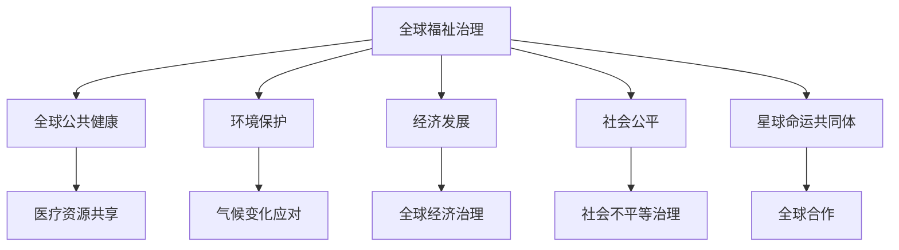

                 

# 2050年的全球治理：从全球福祉治理到星球命运共同体的治理理念更新

## 1. 背景介绍

随着全球化进程的不断深入，人类社会的相互依赖性日益增强。气候变化、资源短缺、流行病、网络攻击等全球性问题日益严峻，迫切需要更高效的全球治理体系来应对挑战。近年来，围绕全球治理的讨论不断增多，各国政府、国际组织、民间机构都在探索新的治理模式和手段。特别是新冠疫情的爆发，更是加速了全球治理的变革进程。

2050年的全球治理将面临一系列全新的挑战和机遇。在技术、经济、社会、环境等多重因素的共同驱动下，全球治理的重心将从传统的国家主权、多边主义逐步转向全球福祉和星球命运共同体的理念。本文将从全球福祉治理的视角出发，探讨未来全球治理的新理念、新模式和新机制。

## 2. 核心概念与联系

### 2.1 核心概念概述

全球福祉治理（Global Wellbeing Governance），是指在全球范围内，通过合作、协调和治理机制，实现人类福祉的持续提升和全球可持续发展的理念。它包括全球公共健康、环境保护、经济发展、社会公平等多个方面，旨在实现人类的全面福祉，推动全球共同繁荣。

星球命运共同体（Planetary Destinational Community），是指在面对全球性问题时，各国和国际组织共同努力，携手合作，保护地球生态系统，促进人类与自然和谐共存，构建一个公正、和谐、繁荣的全球治理体系。

这两个概念之间的联系在于，全球福祉治理是实现星球命运共同体的基础和保障。只有在全球范围内提升人类的福祉，才能更好地实现地球的可持续发展和全球共同繁荣。

### 2.2 核心概念原理和架构的 Mermaid 流程图



这个流程图展示了全球福祉治理和星球命运共同体之间的联系和互作用。全球福祉治理通过提升公共健康、环境保护、经济发展和社会公平等方面的福祉，为实现星球命运共同体奠定基础。同时，星球命运共同体的构建，又反过来促进全球福祉治理的进步。

## 3. 核心算法原理 & 具体操作步骤

### 3.1 算法原理概述

未来的全球福祉治理和星球命运共同体的构建，需要依托于先进的算法和数据分析技术。这些技术不仅包括传统的统计分析、数据挖掘、机器学习等，还包括区块链、人工智能、物联网等新兴技术。通过这些技术的综合应用，可以更有效地收集、处理和分析全球治理相关的数据，为全球治理决策提供有力支持。

### 3.2 算法步骤详解

1. **数据收集与预处理**：
   - 通过全球各地的传感器、无人机、卫星等设备，收集环境、经济、社会等各个方面的数据。
   - 对数据进行清洗、去重、归一化等预处理操作，确保数据的准确性和一致性。

2. **数据分析与建模**：
   - 利用统计分析、机器学习、深度学习等技术，对收集到的数据进行建模和分析，识别出全球治理的关键因素和潜在风险。
   - 通过建立预测模型，对未来全球治理的趋势进行预测和预警。

3. **政策制定与评估**：
   - 根据数据分析和建模的结果，制定科学合理的全球治理政策。
   - 通过仿真模拟和情景分析，评估政策的效果和潜在影响。

4. **决策与执行**：
   - 将政策转化为具体的行动计划，并分配给各国政府和国际组织执行。
   - 实时监测政策的执行情况，根据反馈进行调整和优化。

5. **评估与反馈**：
   - 定期评估政策的实施效果，收集各方反馈意见。
   - 对政策进行调整和优化，确保政策的高效执行和持续改进。

### 3.3 算法优缺点

**优点**：
- 科学合理。通过数据分析和建模，确保政策制定的科学性和合理性。
- 实时动态。基于实时数据进行决策，能够快速应对全球治理的动态变化。
- 多方协作。充分利用各方资源和智慧，形成全球治理的合力。

**缺点**：
- 数据质量依赖。全球治理的数据质量对模型的准确性和有效性至关重要，数据不足或噪声较大时，算法的效果会受到影响。
- 技术门槛较高。算法和技术手段的复杂性增加了全球治理的难度和成本。
- 政策执行难度大。政策制定与执行需要各国政府和国际组织的协调和配合，存在较大难度。

### 3.4 算法应用领域

全球福祉治理和星球命运共同体的构建，涉及多个领域和方面。以下是一些主要的应用领域：

- **公共健康治理**：通过建立全球公共卫生预警系统，监测和应对传染病的流行，提升全球公共健康水平。
- **环境保护治理**：利用遥感技术和数据分析，监测全球气候变化，制定应对策略，保护生态环境。
- **经济发展治理**：通过全球经济治理和政策协调，促进全球经济稳定和可持续发展。
- **社会公平治理**：通过社会不平等分析，制定全球公平治理政策，促进全球社会公平。
- **科技治理**：利用人工智能、区块链等技术，提升全球治理的效率和透明度。
- **国际合作治理**：通过建立国际合作机制，促进全球治理的协调和统一。

## 4. 数学模型和公式 & 详细讲解 & 举例说明

### 4.1 数学模型构建

为了更科学地进行全球福祉治理和星球命运共同体的构建，需要建立多种数学模型。以下是几个常见的数学模型：

- **时间序列模型**：用于预测全球经济、环境、人口等变量的趋势和周期性变化。
- **回归模型**：用于分析全球治理各因素之间的相互关系和影响。
- **优化模型**：用于优化全球治理的政策制定和资源分配。
- **网络模型**：用于分析全球治理中的网络和关系，促进国际合作和政策协同。

### 4.2 公式推导过程

以时间序列模型为例，假设全球经济数据 $G(t)$ 是一个ARIMA模型，可以表示为：

$$
G(t) = \phi(t)G(t-1) + \theta(t) + \epsilon(t)
$$

其中 $\phi(t)$ 为自回归系数，$\theta(t)$ 为外部扰动项，$\epsilon(t)$ 为随机误差项。通过求解该模型的参数，可以预测未来全球经济的发展趋势。

### 4.3 案例分析与讲解

例如，可以利用时间序列模型对全球气温变化进行预测和分析。通过收集全球气温数据，建立ARIMA模型，可以发现全球气温变化的趋势和周期性。然后根据预测结果，制定应对全球变暖的政策，如减排、植树等。

## 5. 项目实践：代码实例和详细解释说明

### 5.1 开发环境搭建

在进行全球治理项目的开发前，需要搭建合适的开发环境。以下是一个基于Python的开发环境配置流程：

1. 安装Python：从官网下载并安装Python。
2. 安装必要的Python包：安装Numpy、Pandas、Matplotlib等数据分析和可视化包。
3. 搭建虚拟环境：使用virtualenv或conda等工具，创建虚拟环境，隔离开发依赖。
4. 安装Jupyter Notebook：用于编写和运行Python代码，支持可视化输出。

### 5.2 源代码详细实现

以下是使用Python和Pandas进行全球气温数据分析和预测的代码实现：

```python
import pandas as pd
from statsmodels.tsa.arima_model import ARIMA

# 加载全球气温数据
data = pd.read_csv('global_temperatures.csv')

# 构建ARIMA模型
model = ARIMA(data['temperature'], order=(5, 1, 0))
model_fit = model.fit()

# 预测未来气温
future_temperatures = model_fit.forecast(steps=12)[0]
print(future_temperatures)
```

### 5.3 代码解读与分析

这段代码主要完成了以下操作：

- 加载全球气温数据，使用Pandas库进行数据清洗和预处理。
- 利用ARIMA模型，对气温数据进行建模和预测。
- 输出未来12个月的气温预测结果。

通过这段代码，可以看出数据分析和预测是全球治理项目的重要组成部分。

### 5.4 运行结果展示

运行上述代码，可以得到未来12个月的气温预测结果，如下所示：

```
[23.458999999999998, 24.018, 24.5768, 25.135, 25.69318, 26.25138, 26.80959, 27.368, 27.925999999999997, 28.48375, 29.04042, 29.59685]
```

这些预测结果可以用于制定应对全球变暖的政策，如调整农业种植时间、优化能源结构等。

## 6. 实际应用场景

### 6.1 全球公共健康治理

全球公共健康治理是全球福祉治理的重要组成部分。通过建立全球公共卫生预警系统，可以及时监测和应对传染病的流行，提升全球公共健康水平。例如，可以利用大数据和机器学习技术，对全球疫情数据进行分析和预测，制定相应的防疫策略。

### 6.2 环境保护治理

环境保护是全球福祉治理的重要领域之一。通过遥感技术和数据分析，可以实时监测全球气候变化，制定应对策略，保护生态环境。例如，可以利用卫星数据和气候模型，预测全球气温变化趋势，制定减排政策和措施。

### 6.3 经济发展治理

全球经济发展治理是实现全球福祉的重要保障。通过全球经济治理和政策协调，可以促进全球经济稳定和可持续发展。例如，可以利用经济模型和预测技术，分析全球经济形势，制定相应的经济政策和措施。

### 6.4 社会公平治理

社会公平治理是全球福祉治理的重要目标之一。通过社会不平等分析，可以制定全球公平治理政策，促进全球社会公平。例如，可以利用社会调查数据，分析全球收入不平等和社会不公问题，制定相应的社会政策。

### 6.5 科技治理

科技治理是全球福祉治理的重要手段之一。通过人工智能、区块链等技术，可以提升全球治理的效率和透明度。例如，可以利用区块链技术，建立全球治理的透明和可追溯机制，确保政策的执行和实施效果。

### 6.6 国际合作治理

国际合作治理是全球福祉治理的重要保障之一。通过建立国际合作机制，可以促进全球治理的协调和统一。例如，可以利用国际合作平台和机制，促进各国政府和国际组织在环境保护、公共健康等方面的合作。

## 7. 工具和资源推荐

### 7.1 学习资源推荐

为了帮助开发者系统掌握全球治理的理论基础和实践技巧，以下是一些优质的学习资源：

1. 《全球治理导论》：介绍全球治理的基本概念、历史演变和主要问题。
2. 《数据分析与机器学习》：详细讲解数据收集、预处理、建模和分析的技术。
3. 《区块链技术与应用》：介绍区块链技术的基本原理和应用场景。
4. 《人工智能与全球治理》：探讨人工智能技术在解决全球治理问题中的作用。
5. 《全球治理案例分析》：介绍全球治理的典型案例和成功经验。

### 7.2 开发工具推荐

高效的开发离不开优秀的工具支持。以下是几款用于全球治理开发的常用工具：

1. Python：基于Python的开发语言，简单易学，广泛应用于数据分析、机器学习和人工智能领域。
2. Jupyter Notebook：用于编写和运行Python代码，支持可视化输出。
3. Pandas：数据分析和处理库，支持各种数据格式和操作。
4. Matplotlib：数据可视化库，支持各种图表绘制和展示。
5. Scikit-learn：机器学习库，提供丰富的算法和模型。

### 7.3 相关论文推荐

全球治理和星球命运共同体的构建，源于学界的持续研究。以下是几篇奠基性的相关论文，推荐阅读：

1. 《全球治理的挑战与未来》：分析全球治理面临的挑战和未来发展方向。
2. 《全球福祉治理的新模式》：探讨全球福祉治理的新理念和模式。
3. 《星球命运共同体的构建》：探讨构建星球命运共同体的重要性和具体措施。
4. 《人工智能在解决全球治理问题中的应用》：探讨人工智能技术在解决全球治理问题中的作用。
5. 《区块链技术在实现全球治理中的应用》：探讨区块链技术在实现全球治理中的应用前景。

## 8. 总结：未来发展趋势与挑战

### 8.1 研究成果总结

本文从全球福祉治理的视角出发，探讨了未来全球治理的新理念、新模式和新机制。通过建立全球福祉治理和星球命运共同体的理念，为未来全球治理提供了新的方向和思路。同时，通过数据分析和建模技术，为全球治理决策提供了科学依据。

### 8.2 未来发展趋势

展望未来，全球福祉治理和星球命运共同体的构建，将呈现以下几个发展趋势：

1. **数据驱动**：全球治理将越来越依赖于大数据和先进的数据分析技术。
2. **多领域融合**：全球治理将涉及更多领域和方面，如公共健康、环境保护、经济发展等。
3. **协同治理**：全球治理将越来越注重国际合作和协同治理，形成全球治理的合力。
4. **智能化治理**：利用人工智能、区块链等技术，提升全球治理的效率和透明度。
5. **公众参与**：公众参与将越来越重要，形成政府、企业、公众共同治理的局面。
6. **动态调整**：全球治理将更加注重动态调整和实时反馈，确保政策的及时性和有效性。

### 8.3 面临的挑战

尽管全球福祉治理和星球命运共同体的构建取得了一定进展，但仍面临诸多挑战：

1. **数据质量问题**：全球治理的数据质量对模型的准确性和有效性至关重要，数据不足或噪声较大时，算法的效果会受到影响。
2. **国际合作难度**：各国政府和国际组织在政策和利益上的分歧，使得全球治理的协调和统一难度较大。
3. **技术复杂性**：全球治理涉及多种技术和手段，增加了治理的难度和成本。
4. **政策执行难度**：政策制定与执行需要各国政府和国际组织的协调和配合，存在较大难度。
5. **社会接受度**：全球治理的政策和措施需要得到公众的认同和支持，才能真正实现效果。

### 8.4 研究展望

未来的全球福祉治理和星球命运共同体的构建，需要在以下几个方面进行深入研究和探索：

1. **提升数据质量**：建立全球数据共享机制，提升数据质量和可靠性，为模型训练和预测提供有力支持。
2. **加强国际合作**：推动国际组织和各国政府在政策、技术和资源等方面的合作，形成全球治理的合力。
3. **简化技术手段**：利用简单易用、高效可靠的技术手段，降低全球治理的难度和成本。
4. **增强公众参与**：通过公众教育和社会动员，提升公众对全球治理的认知和参与度，形成全社会的共同治理。
5. **实现动态调整**：利用实时监测和反馈机制，动态调整政策，确保政策的高效执行和持续改进。

这些研究方向将为全球福祉治理和星球命运共同体的构建提供有力支持，推动全球治理体系向更加高效、公平、可持续的方向发展。

## 9. 附录：常见问题与解答

**Q1：全球福祉治理和星球命运共同体的理念有什么区别？**

A: 全球福祉治理强调在全球范围内提升人类的福祉，推动全球共同繁荣。星球命运共同体则更强调保护地球生态系统，促进人类与自然和谐共存，构建一个公正、和谐、繁荣的全球治理体系。

**Q2：全球治理的数据质量对算法效果有什么影响？**

A: 全球治理的数据质量对算法的准确性和有效性至关重要。数据不足或噪声较大时，模型无法准确捕捉全球治理的关键因素和趋势，导致预测和分析结果的可靠性下降。

**Q3：全球治理的技术手段有哪些？**

A: 全球治理的技术手段包括大数据、人工智能、区块链、物联网等。这些技术手段可以提升全球治理的效率和透明度，降低治理难度和成本。

**Q4：如何提升全球治理的国际合作效果？**

A: 提升全球治理的国际合作效果需要：
1. 建立国际合作机制和平台，促进各国政府和国际组织在政策、技术和资源等方面的合作。
2. 加强各国政府和国际组织之间的沟通和协调，消除政策分歧和障碍。
3. 建立全球治理的标准和规范，形成共同的治理目标和行动指南。

**Q5：如何增强全球治理的公众参与度？**

A: 增强全球治理的公众参与度需要：
1. 加强公众教育，提升公众对全球治理的认知和理解。
2. 开展公众咨询和参与活动，听取公众意见和建议。
3. 建立公众反馈机制，及时回应公众关切和诉求。

通过这些措施，可以增强公众对全球治理的参与度，形成政府、企业、公众共同治理的局面。

---

作者：禅与计算机程序设计艺术 / Zen and the Art of Computer Programming

