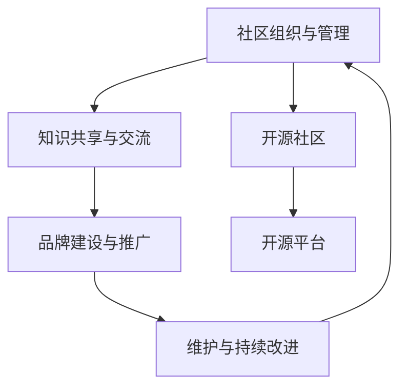

                 

# 建立开源项目的在线社区：社区运营和品牌建设

## 1. 背景介绍

### 1.1 问题由来

在当前数字化时代，开源社区扮演着日益重要的角色。对于开发者、企业和研究者而言，开源项目不仅可以节省时间和成本，促进知识共享，还可以加速技术创新和市场布局。随着技术栈的日趋复杂，项目规模和依赖关系的日益庞大，开源社区的协作与交流变得愈发重要。

然而，构建一个成功的开源项目社区并非易事。如何有效组织社区成员、促进知识交流、提升社区影响力、塑造项目品牌，都是开源项目管理者必须面对的挑战。本文将探讨如何建立并运营一个活跃的开源项目在线社区，通过系统化的方法和策略，提升社区活跃度和项目品牌价值。

### 1.2 问题核心关键点

1. **社区组织与管理**：如何设计社区架构，制定清晰的组织规则，确保社区成员各司其职、高效协作。
2. **知识共享与交流**：如何激励社区成员积极参与，促进代码贡献、问题解答和经验分享。
3. **品牌建设与推广**：如何通过社区活动、贡献者展示、用户反馈等手段，塑造和提升项目品牌形象。
4. **维护与持续改进**：如何建立有效的反馈机制，定期评估社区健康状况，持续优化社区运营策略。

这些问题贯穿于开源社区运营的各个环节，需要通过科学的方法和精心的规划来解决。

## 2. 核心概念与联系

### 2.1 核心概念概述

构建开源社区的核心概念包括：

- **开源社区**：基于开源理念构建的线上平台，旨在促进开发者、用户和贡献者之间的知识共享和技术协作。
- **社区组织与管理**：通过角色定义、权限设置、规则制定等方式，确保社区的稳定运行和成员的积极参与。
- **知识共享与交流**：通过提供代码、文档、讨论区等工具，促进社区成员之间的知识交流和技术分享。
- **品牌建设与推广**：通过定期的社区活动、贡献者展示、用户反馈等手段，塑造和提升项目品牌形象，增加项目的市场价值和影响力。
- **维护与持续改进**：通过定期评估社区健康状况、收集用户反馈、优化社区运营策略，确保社区持续发展和项目质量不断提升。

这些核心概念相互关联，共同构成了一个完整、健康、活跃的开源社区。通过理解并应用这些概念，管理者可以有效运营社区，吸引和留住活跃的贡献者，提升项目影响力。

### 2.2 核心概念原理和架构的 Mermaid 流程图



以上图表展示了大语言模型微调的核心概念及其之间的关系。

## 3. 核心算法原理 & 具体操作步骤

### 3.1 算法原理概述

开源社区运营的核心目标是构建一个高效、活跃的交流平台，促进知识和技术的共享，提升项目品牌价值。其基本原理如下：

1. **组织与管理**：通过明确角色和职责，制定规则和流程，确保社区成员的协作有序进行。
2. **知识共享与交流**：提供丰富的协作工具和沟通渠道，促进社区成员之间的知识交流和技术分享。
3. **品牌建设与推广**：通过社区活动、贡献者展示等方式，提升项目的知名度和美誉度。
4. **维护与持续改进**：通过定期评估和优化运营策略，确保社区的长期健康发展。

### 3.2 算法步骤详解

构建开源社区的步骤如下：

**Step 1: 设计社区架构**
- 确定社区的愿景、使命和目标。
- 定义社区角色和权限，如管理员、贡献者、普通用户等。
- 制定社区规则和流程，如代码贡献指南、问题解答规范等。

**Step 2: 选择开源平台**
- 根据社区需求，选择合适的开源平台，如GitHub、GitLab、Apache等。
- 配置社区需要的协作工具，如代码托管、问题跟踪、讨论区等。

**Step 3: 建立社区规则**
- 制定贡献者行为规范，明确代码贡献、问题解答、文档维护等行为标准。
- 设立社区行为准则，如尊重他人、避免垃圾信息、禁止滥用等。

**Step 4: 促进知识交流**
- 通过GitHub Issues、社区讨论区等方式，提供代码贡献、问题解答、经验分享的平台。
- 设立社区活动，如Hackathon、技术沙龙、在线讲座等，促进社区成员之间的互动。

**Step 5: 塑造品牌形象**
- 通过社区活动、贡献者展示、用户反馈等方式，提升项目知名度和美誉度。
- 定期发布社区新闻、项目进展、技术文章，增加项目的曝光率。

**Step 6: 持续改进与优化**
- 定期评估社区健康状况，收集用户反馈，优化社区运营策略。
- 根据社区发展情况，调整社区架构和管理规则，确保社区的持续健康发展。

### 3.3 算法优缺点

开源社区运营的优点包括：

1. **资源共享**：通过开源平台，社区成员可以共享代码、文档、技术资料等，节省时间和成本。
2. **促进创新**：社区环境鼓励自由交流和合作，加速技术创新和知识传播。
3. **提升影响力**：成功的开源项目具有较高的市场价值和知名度，有助于提升项目的品牌影响力和市场竞争力。

同时，该方法也存在以下局限性：

1. **管理复杂**：社区成员数量众多，管理和维护难度较大。
2. **质量控制**：社区贡献的代码和文档质量参差不齐，需要严格的质量控制机制。
3. **安全性风险**：社区成员来自全球各地，存在一定的安全风险，如代码注入、信息泄露等。
4. **社区分化**：社区成员背景和技能差异较大，可能导致社区分化和沟通障碍。

尽管存在这些局限性，但通过科学的社区管理策略和持续的运营优化，开源社区运营仍能取得显著成效。

### 3.4 算法应用领域

开源社区运营广泛适用于各类技术项目，包括软件开发、数据分析、机器学习、人工智能等。无论项目规模大小，开源社区都能提供丰富的协作工具和交流平台，促进社区成员之间的知识和技术共享，提升项目的整体质量。

## 4. 数学模型和公式 & 详细讲解 & 举例说明

### 4.1 数学模型构建

假设社区成员数量为 $N$，社区活跃度为 $A$，贡献者数量为 $C$，代码提交数量为 $B$，社区互动数量为 $I$。设 $S$ 为社区总满意度，则社区运营模型可表示为：

$$
S = f(A, C, B, I)
$$

其中 $f$ 为社区满意度函数，反映了社区活跃度、贡献者数量、代码提交数量和社区互动数量对社区满意度的综合影响。

### 4.2 公式推导过程

社区满意度的计算公式可进一步展开为：

$$
S = \alpha \cdot A + \beta \cdot C + \gamma \cdot B + \delta \cdot I
$$

其中 $\alpha, \beta, \gamma, \delta$ 为模型参数，反映了各个因素对社区满意度的影响权重。通过逐步调整这些参数，可以优化社区运营策略，提升社区满意度。

### 4.3 案例分析与讲解

以一个成功的开源社区 GitHub 为例：

1. **组织与管理**：GitHub 设立了管理员和贡献者权限，制定了明确的贡献指南和问题解答规范，确保社区成员各司其职。
2. **知识共享与交流**：GitHub 提供了丰富的协作工具，如代码托管、问题跟踪、讨论区等，促进社区成员之间的知识交流和技术分享。
3. **品牌建设与推广**：GitHub 定期举办在线讲座、技术沙龙等活动，提升项目的知名度和美誉度。
4. **维护与持续改进**：GitHub 定期评估社区健康状况，收集用户反馈，优化社区运营策略。

通过科学的管理和运营策略，GitHub 成功地构建了一个高效、活跃的开源社区，吸引了大量的贡献者和用户，提升了项目的市场价值和影响力。

## 5. 项目实践：代码实例和详细解释说明

### 5.1 开发环境搭建

构建开源社区需要选择合适的开发环境。以下是使用GitHub进行开源社区构建的环境配置流程：

1. 创建GitHub账户。
2. 创建GitHub组织。
3. 邀请社区成员加入组织。
4. 配置GitHub Pages，搭建社区网站。
5. 配置CI/CD系统，自动化构建和部署。

### 5.2 源代码详细实现

构建开源社区的核心代码如下：

```python
from flask import Flask, render_template, request
from flask_sqlalchemy import SQLAlchemy
from flask_login import LoginManager, login_user, logout_user, login_required
from werkzeug.security import generate_password_hash, check_password_hash

app = Flask(__name__)
app.config['SECRET_KEY'] = 'your_secret_key'
app.config['SQLALCHEMY_DATABASE_URI'] = 'sqlite:///sqlite.db'
db = SQLAlchemy(app)
login_manager = LoginManager()
login_manager.init_app(app)

# 用户模型
class User(db.Model):
    id = db.Column(db.Integer, primary_key=True)
    username = db.Column(db.String(64), unique=True, nullable=False)
    password_hash = db.Column(db.String(128), nullable=False)
    is_admin = db.Column(db.Boolean, default=False)
    
    def set_password(self, password):
        self.password_hash = generate_password_hash(password)

    def check_password(self, password):
        return check_password_hash(self.password_hash, password)

# 登录和登出
@login_manager.user_loader
def load_user(user_id):
    return User.query.get(int(user_id))

@app.route('/')
@login_required
def index():
    return render_template('index.html')

@app.route('/login', methods=['GET', 'POST'])
def login():
    if request.method == 'POST':
        username = request.form['username']
        password = request.form['password']
        user = User.query.filter_by(username=username).first()
        if user and user.check_password(password):
            login_user(user)
            return redirect('/')
        else:
            return render_template('login.html', error='Invalid username or password')
    return render_template('login.html')

@app.route('/logout')
@login_required
def logout():
    logout_user()
    return redirect('/')

if __name__ == '__main__':
    app.run(debug=True)
```

### 5.3 代码解读与分析

**Flask框架**：
- Flask 是一个轻量级的 Python Web 框架，用于构建社区网站和后端服务。
- 使用 SQLAlchemy 进行数据库操作，存储社区成员信息。
- 使用 Flask-Login 管理用户登录状态。

**用户模型**：
- 通过 User 模型，可以存储社区成员的用户名、密码和管理员权限。
- set_password 和 check_password 方法用于密码的存储和验证。

**登录和登出**：
- 通过@login_manager.user_loader 装饰器，实现用户登录状态的自动加载。
- 在登录页面中，用户输入用户名和密码，如果验证通过，则登录成功，否则返回错误信息。

**社区页面**：
- 首页 index 页面使用@login_required 装饰器，确保只有登录用户才能访问。
- 在登录和登出页面中，使用路由重定向和模板渲染，提升用户体验。

### 5.4 运行结果展示

运行上述代码后，访问社区网站，可以进行用户注册、登录和登出操作，并访问首页。通过 Flask 的模板引擎，可以设计美观的用户界面和用户体验。

## 6. 实际应用场景

### 6.1 开源项目社区

开源项目社区通常具有以下特点：

1. **多样性**：社区成员来自全球各地，背景和技能各异。
2. **开放性**：任何人都可以自由访问和参与。
3. **持续更新**：项目需要定期更新和维护。
4. **高协同**：需要多人协作开发和测试。

以著名的开源社区 GitHub 为例，其成功地运营了数百万个开源项目，吸引了全球各地的开发者和用户。

### 6.2 企业内部社区

企业内部社区通常具有以下特点：

1. **定向性**：社区成员来自特定企业内部。
2. **管理性**：需要严格的用户管理和权限控制。
3. **知识共享**：主要用于技术知识共享和项目管理。
4. **保密性**：需要确保社区内容的安全性和隐私性。

以阿里巴巴的内部社区为例，其成功地运营了数万名员工，为公司的技术创新和知识共享提供了重要平台。

### 6.3 学术研究社区

学术研究社区通常具有以下特点：

1. **专业性**：社区成员来自特定的学术领域。
2. **开放性**：通常对外开放，吸引更多的研究者参与。
3. **高质量**：社区内容通常经过严格审核和验证。
4. **互动性**：鼓励研究者之间的互动和讨论。

以 arXiv 为例，其成功地运营了全球各地的研究者和读者，为学术论文的传播和交流提供了重要平台。

## 7. 工具和资源推荐

### 7.1 学习资源推荐

为了帮助开发者系统掌握开源社区的运营方法，这里推荐一些优质的学习资源：

1. **《开源社区运营手册》**：详细介绍了开源社区的运营策略和实践经验，适合社区管理员和贡献者阅读。
2. **《GitHub官方文档》**：GitHub 官方提供的详细文档，覆盖了社区构建、协作工具、用户管理等方面的内容。
3. **《GitLab官方文档》**：GitLab 官方提供的详细文档，覆盖了社区构建、协作工具、用户管理等方面的内容。
4. **《Apache基金会社区运营指南》**：Apache 基金会提供的社区运营指南，适合开源项目的管理者和贡献者阅读。
5. **《社区管理与运营实战》**：结合实际案例，详细介绍了社区管理与运营的策略和技巧，适合开发者和项目管理者阅读。

通过这些资源的学习实践，相信你一定能够掌握开源社区运营的精髓，提升社区的活跃度和项目的品牌价值。

### 7.2 开发工具推荐

高效的开发离不开优秀的工具支持。以下是几款用于开源社区运营开发的常用工具：

1. **GitHub**：GitHub 提供了丰富的协作工具和社区管理功能，适合构建和运营开源项目社区。
2. **GitLab**：GitLab 提供了与 GitHub 类似的协作工具和社区管理功能，适合构建和运营开源项目社区。
3. **JIRA**：JIRA 提供了项目管理、问题跟踪和任务分配功能，适合企业内部社区的运营。
4. **Slack**：Slack 提供了即时通讯和协作工具，适合社区成员之间的沟通和交流。
5. **Confluence**：Confluence 提供了文档管理和知识共享功能，适合企业内部社区的知识管理和技术交流。

合理利用这些工具，可以显著提升开源社区的运营效率，加快创新迭代的步伐。

### 7.3 相关论文推荐

开源社区运营的研究源于学界的持续研究。以下是几篇奠基性的相关论文，推荐阅读：

1. **《Open Source Communities: From Software Projects to Social Networks》**：探讨了开源社区的社交网络特征，以及社区成员之间的互动和协作行为。
2. **《The Impact of Contribution on Software Project Success》**：研究了贡献者行为对开源项目成功的影响，提供了社区管理的经验和方法。
3. **《Community Detection in Open Source Software Projects》**：研究了开源社区的社区发现和成员分类问题，提供了社区管理的理论基础和方法。
4. **《The Role of Developers in Open Source Software Development: How Developers Integrate Into Projects and Interact with the Community》**：研究了开发者在开源项目中的角色和行为，提供了社区管理的实践经验。
5. **《Open Source Community Governance: A Systems Approach》**：研究了开源社区的治理结构和机制，提供了社区管理的策略和方法。

这些论文代表了大语言模型微调技术的发展脉络。通过学习这些前沿成果，可以帮助研究者把握学科前进方向，激发更多的创新灵感。

## 8. 总结：未来发展趋势与挑战

### 8.1 总结

本文对开源社区的构建与运营进行了全面系统的介绍。首先阐述了开源社区的运营背景和意义，明确了社区运营的各个环节和关键点。其次，从原理到实践，详细讲解了开源社区运营的数学模型和操作步骤，给出了开源社区构建的完整代码实例。同时，本文还广泛探讨了开源社区在开源项目、企业内部、学术研究等多个场景中的应用前景，展示了开源社区运营的广泛价值。

通过本文的系统梳理，可以看到，开源社区运营已经成为开源项目和软件开发的重要环节，能够有效提升社区活跃度和项目品牌价值。未来，伴随开源社区的持续发展和完善，开源技术和知识将更加广泛地传播和应用，为社会的技术创新和知识共享提供重要支持。

### 8.2 未来发展趋势

开源社区运营的未来发展趋势包括：

1. **社区智能化的管理**：通过机器学习和自然语言处理技术，实现社区成员的行为分析和智能推荐，提高社区运营效率。
2. **跨社区的协作**：构建跨社区的协作平台，促进不同开源项目之间的知识共享和技术合作，提升社区的整体创新能力。
3. **社区生态的构建**：通过社区之间的互动和协作，构建开源社区的生态系统，形成良性的技术创新和知识共享环境。
4. **社区文化的塑造**：通过社区活动和参与机制，塑造社区文化，提升社区成员的归属感和参与度。
5. **社区品牌的多元化**：通过多渠道的品牌推广，提升开源社区的品牌价值和市场影响力。

以上趋势凸显了开源社区运营的广阔前景。这些方向的探索发展，必将进一步提升开源社区的活力和影响力，为技术的传播和应用提供更加有效的平台。

### 8.3 面临的挑战

尽管开源社区运营已经取得了显著成效，但在迈向更加智能化、普适化应用的过程中，它仍面临诸多挑战：

1. **社区管理复杂**：开源社区成员众多，管理和维护难度较大。
2. **知识共享的挑战**：社区成员背景和技能差异较大，可能导致知识共享的障碍。
3. **社区文化的差异**：不同社区之间的文化差异可能导致社区之间的互动障碍。
4. **社区治理的挑战**：社区成员的利益和需求不同，可能导致治理上的冲突和矛盾。
5. **社区安全的风险**：社区成员来自全球各地，存在一定的安全风险，如代码注入、信息泄露等。

尽管存在这些挑战，但通过科学的社区管理策略和持续的运营优化，开源社区运营仍能取得显著成效。

### 8.4 研究展望

面向未来，开源社区运营需要在以下几个方面寻求新的突破：

1. **社区智能化的管理**：引入机器学习和自然语言处理技术，实现社区成员的行为分析和智能推荐，提高社区运营效率。
2. **跨社区的协作**：构建跨社区的协作平台，促进不同开源项目之间的知识共享和技术合作，提升社区的整体创新能力。
3. **社区文化的塑造**：通过社区活动和参与机制，塑造社区文化，提升社区成员的归属感和参与度。
4. **社区品牌的多元化**：通过多渠道的品牌推广，提升开源社区的品牌价值和市场影响力。
5. **社区治理的创新**：探索新的社区治理机制和激励机制，提升社区成员的积极性和归属感。

这些研究方向的探索，必将引领开源社区运营迈向更高的台阶，为开源技术和知识提供更加高效、活跃的传播和应用平台。

## 9. 附录：常见问题与解答

**Q1：开源社区的社区管理策略有哪些？**

A: 开源社区的社区管理策略包括：
1. **角色定义**：明确管理员、贡献者、普通用户的角色和权限。
2. **规则制定**：制定社区规则和流程，如代码贡献指南、问题解答规范等。
3. **反馈机制**：建立社区反馈机制，定期收集用户意见和建议，优化社区运营策略。

**Q2：开源社区如何进行知识共享与交流？**

A: 开源社区的知识共享与交流主要通过以下方式：
1. **代码托管**：使用GitHub、GitLab等平台进行代码托管，方便社区成员协作开发。
2. **问题跟踪**：使用JIRA、GitHub Issues等工具进行问题跟踪和解决。
3. **讨论区**：使用Slack、Discord等工具进行社区讨论和交流。
4. **社区活动**：定期举办Hackathon、技术沙龙等活动，促进社区成员之间的互动。

**Q3：开源社区的品牌建设与推广策略有哪些？**

A: 开源社区的品牌建设与推广策略包括：
1. **社区活动**：定期举办社区活动，如技术沙龙、线上讲座等，提升项目知名度和美誉度。
2. **贡献者展示**：定期展示社区贡献者，表彰优秀贡献者，激励更多成员参与。
3. **用户反馈**：收集用户反馈，持续改进社区运营策略，提升用户体验。
4. **多渠道推广**：通过博客、社交媒体、邮件等渠道进行品牌推广，增加项目的曝光率。

**Q4：开源社区如何处理社区安全和隐私问题？**

A: 开源社区处理社区安全和隐私问题主要通过以下方式：
1. **权限控制**：通过角色和权限控制，限制敏感信息的访问和修改。
2. **数据脱敏**：对敏感数据进行脱敏处理，确保数据的安全性。
3. **代码审查**：通过代码审查和测试，确保代码的安全性和质量。
4. **安全培训**：对社区成员进行安全培训，提高安全意识和防护能力。

**Q5：开源社区如何应对社区成员的贡献积极性不足的问题？**

A: 开源社区应对成员贡献积极性不足的问题主要通过以下方式：
1. **激励机制**：设立贡献奖励机制，如积分奖励、荣誉称号等，激励成员积极贡献。
2. **社区活动**：举办技术沙龙、Hackathon等活动，提高成员的参与度和积极性。
3. **社区文化**：塑造积极向上的社区文化，提升成员的归属感和责任感。
4. **反馈机制**：建立反馈机制，及时收集成员的意见和建议，优化社区运营策略。

这些策略可以有效提升开源社区的活跃度和成员的积极性，促进社区的健康发展。

---

作者：禅与计算机程序设计艺术 / Zen and the Art of Computer Programming

