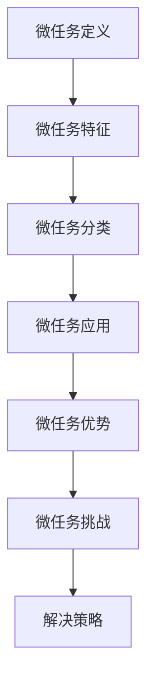

                 

# 微任务，大影响：探索人类计算的应用价值

> 关键词：微任务、多任务学习、人类计算、深度学习、大数据、可解释性

## 1. 背景介绍

### 1.1 问题由来

随着计算技术的飞速发展，数据量的不断积累，以及深度学习技术的日渐成熟，人类计算的概念和应用逐渐兴起。人类计算（Human-in-the-loop Computing）是指通过与人类协同，利用人类在抽象推理、创造性思维等方面的优势，与机器学习算法相结合，解决复杂问题的一种计算模式。相比于传统机器学习或深度学习算法，人类计算能够更好地利用人类的经验和智慧，提升问题解决能力，尤其是在需要人类直觉、理解、创造力参与的场景中。

人类计算的核心是“微任务”（Microtask），即在人类参与下，对数据进行简单、有意义的标注、校验、修正等，以辅助机器学习模型进行训练和优化。这些微任务通常不需要复杂的专业知识，而是依赖于人类的直觉和经验，能够有效地提升模型的性能。

然而，微任务在实际应用中仍面临诸多挑战：如何高效地收集和利用微任务数据？如何设计合适的任务形式和激励机制？如何将微任务与其他机器学习算法进行有效结合？这些问题亟待研究和解决。

### 1.2 问题核心关键点

为了更好地理解微任务的本质和应用价值，本节将探讨以下几个核心问题：

- **微任务定义**：微任务的基本形式和特征是什么？
- **微任务分类**：常见的微任务类型有哪些？
- **微任务应用**：微任务在哪些领域有应用？
- **微任务优势**：微任务的独特优势和局限性是什么？
- **微任务挑战**：微任务面临的主要挑战有哪些？

通过回答这些问题，我们能够对微任务这一人类计算的新范式有更加深入的理解。

## 2. 核心概念与联系

### 2.1 核心概念概述

微任务是指在人类参与下，对数据进行简单、有意义的标注、校验、修正等操作，辅助机器学习模型的训练和优化。微任务的核心理念是将复杂的问题分解为可管理、可处理的子任务，每个子任务仅涉及有限的数据和操作，通过人类和机器的协同，逐步提升模型性能。

微任务一般具有以下几个特征：
- **小规模**：每个微任务仅涉及少量数据或操作，易于人类理解和处理。
- **有目标**：每个微任务都有明确的目标，如标注、校验、修正等，帮助机器学习模型学习特定技能。
- **可重复**：每个微任务可以重复执行多次，便于收集和利用大量数据。
- **多样性**：微任务类型多样，可以涵盖不同领域和应用场景，如图像标注、文本校验、语音识别等。

微任务的应用领域广泛，涉及图像、文本、语音、视频等多个领域，能够有效提升模型的准确性和鲁棒性。同时，微任务还具有以下几个优势：
- **低成本**：相比于传统机器学习算法，微任务的数据标注成本较低，能够有效利用廉价劳动。
- **高效性**：微任务可以并行处理，通过众包平台等手段，快速收集大量数据。
- **鲁棒性**：通过人类参与，微任务能够增强模型的鲁棒性和泛化能力。
- **可解释性**：微任务中的每一步操作都有人类解释，能够提升模型的可解释性。

当然，微任务也面临一些挑战：
- **数据质量**：微任务依赖于人类标注，标注质量难以保证，可能影响模型性能。
- **人为因素**：人类参与可能引入人为偏差，影响模型公正性。
- **隐私保护**：微任务涉及大量敏感数据，如何保护隐私是一个重要问题。

为了应对这些挑战，研究者提出了一些解决策略，如引入质量控制机制、使用匿名化处理、设计合理的激励机制等。

### 2.2 核心概念原理和架构的 Mermaid 流程图



这个流程图展示了微任务的基本概念和主要关系：

- 微任务定义和特征：定义微任务的基本形式和特征。
- 微任务分类：将微任务分为图像标注、文本校验、语音识别等多种类型。
- 微任务应用：介绍微任务在NLP、计算机视觉、语音识别等领域的典型应用。
- 微任务优势：说明微任务的低成本、高效性、鲁棒性和可解释性等优势。
- 微任务挑战：讨论微任务面临的数据质量、人为因素和隐私保护等挑战。
- 解决策略：提出一些解决微任务挑战的策略，如质量控制、匿名化处理和激励机制等。

## 3. 核心算法原理 & 具体操作步骤

### 3.1 算法原理概述

微任务的基本原理是“人类计算+机器学习”，即通过人类在微任务中的参与，辅助机器学习模型进行训练和优化。微任务的一般流程如下：

1. **任务设计**：定义微任务的输入、输出、目标等，设计合适的任务形式。
2. **数据收集**：通过众包平台、社交网络等方式，收集大量的微任务数据。
3. **数据标注**：将数据分配给多个标注者进行标注，收集标注结果。
4. **数据清洗**：对标注结果进行清洗和处理，去除噪声数据。
5. **模型训练**：将标注结果输入机器学习模型进行训练和优化。
6. **模型评估**：评估训练后的模型性能，判断是否需要进一步微调。
7. **应用部署**：将训练好的模型部署到实际应用场景中，进行测试和优化。

通过以上步骤，微任务能够有效地辅助机器学习模型进行训练和优化，提升模型的性能和鲁棒性。

### 3.2 算法步骤详解

微任务的具体操作步骤可以分为以下几个步骤：

1. **任务设计**：
   - **输入输出**：定义微任务的输入和输出，如图像标注中的图片和标签。
   - **目标**：明确微任务的目标，如标注准确率、校验错误率等。
   - **任务形式**：设计合适的任务形式，如众包平台、社交网络等。

2. **数据收集**：
   - **数据源**：通过众包平台、社交网络、在线数据库等方式收集数据。
   - **数据分配**：将数据分配给多个标注者进行标注。
   - **数据量**：确保数据量充足，能够覆盖不同场景和情况。

3. **数据标注**：
   - **标注者**：选择合适的标注者，如专业标注员、普通用户等。
   - **标注过程**：让标注者根据任务要求进行标注，收集标注结果。
   - **质量控制**：对标注结果进行质量控制，去除明显错误和低质量标注。

4. **数据清洗**：
   - **噪声处理**：对标注结果进行去噪处理，去除明显错误和低质量标注。
   - **一致性检查**：对标注结果进行一致性检查，确保标注结果的一致性。
   - **标注结果合并**：将多个标注者的结果进行合并，得到最终标注结果。

5. **模型训练**：
   - **模型选择**：选择适合任务的机器学习模型，如卷积神经网络、递归神经网络等。
   - **数据输入**：将清洗后的标注结果输入机器学习模型进行训练。
   - **超参数调整**：调整模型超参数，如学习率、批大小等，优化模型性能。

6. **模型评估**：
   - **评估指标**：选择适当的评估指标，如准确率、召回率、F1分数等。
   - **交叉验证**：使用交叉验证等方法评估模型性能，判断是否需要进一步微调。
   - **结果分析**：分析模型结果，识别错误类型和问题。

7. **应用部署**：
   - **部署环境**：选择合适的部署环境，如云计算平台、本地服务器等。
   - **模型优化**：对模型进行优化，如参数调整、模型裁剪等。
   - **性能测试**：在实际应用场景中测试模型性能，进行优化和调整。

### 3.3 算法优缺点

微任务的优点主要包括：
- **低成本**：相比于传统机器学习算法，微任务的数据标注成本较低，能够有效利用廉价劳动。
- **高效性**：微任务可以并行处理，通过众包平台等手段，快速收集大量数据。
- **鲁棒性**：通过人类参与，微任务能够增强模型的鲁棒性和泛化能力。
- **可解释性**：微任务中的每一步操作都有人类解释，能够提升模型的可解释性。

微任务的缺点主要包括：
- **数据质量**：微任务依赖于人类标注，标注质量难以保证，可能影响模型性能。
- **人为因素**：人类参与可能引入人为偏差，影响模型公正性。
- **隐私保护**：微任务涉及大量敏感数据，如何保护隐私是一个重要问题。

### 3.4 算法应用领域

微任务在多个领域都有广泛应用，以下是一些典型的应用场景：

1. **计算机视觉**：如图像分类、物体检测、图像分割等，通过人类标注辅助训练，提升模型准确性和鲁棒性。
2. **自然语言处理**：如文本分类、命名实体识别、情感分析等，通过人类标注提升模型理解能力和鲁棒性。
3. **语音识别**：如语音转写、语音情感分析等，通过人类标注辅助训练，提升模型准确性和鲁棒性。
4. **医疗健康**：如医学图像标注、疾病诊断等，通过人类标注辅助训练，提升模型诊断准确性。
5. **金融科技**：如信用评分、风险评估等，通过人类标注辅助训练，提升模型预测准确性。
6. **智慧城市**：如交通监控、城市规划等，通过人类标注辅助训练，提升模型分析能力。

## 4. 数学模型和公式 & 详细讲解

### 4.1 数学模型构建

微任务的数学模型构建主要涉及以下几个部分：

1. **输入输出模型**：定义输入和输出空间的概率分布，如：
   - **输入分布**：$P(x)$，输入数据的概率分布。
   - **输出分布**：$P(y|x)$，给定输入数据条件下输出的概率分布。

2. **损失函数**：定义损失函数，用于衡量模型预测结果与真实结果之间的差异。如：
   - **交叉熵损失**：$L(y,\hat{y})=-\sum_{i=1}^n y_i \log \hat{y_i}$，用于分类问题。
   - **均方误差损失**：$L(y,\hat{y})=\frac{1}{n} \sum_{i=1}^n (y_i - \hat{y_i})^2$，用于回归问题。

3. **优化目标**：定义优化目标函数，如：
   - **最小化损失函数**：$\min_{\theta} L(y,\hat{y})$，其中 $\theta$ 为模型参数。

4. **优化算法**：选择合适的优化算法，如：
   - **随机梯度下降**：$\theta_{t+1}=\theta_t - \eta \nabla_{\theta} L(y,\hat{y})$，其中 $\eta$ 为学习率。
   - **Adam优化器**：$\theta_{t+1}=\theta_t - \eta \nabla_{\theta} L(y,\hat{y}) - \lambda \nabla_{\theta} L(y,\hat{y})$，其中 $\lambda$ 为正则化系数。

### 4.2 公式推导过程

以图像标注为例，推导微任务训练过程的损失函数和梯度更新公式。

1. **输入输出模型**：
   - **输入分布**：$P(x)$，输入数据的概率分布。
   - **输出分布**：$P(y|x)$，给定输入数据条件下输出的概率分布。

2. **交叉熵损失函数**：
   - $L(y,\hat{y})=-\sum_{i=1}^n y_i \log \hat{y_i}$，其中 $y_i$ 为真实标签，$\hat{y_i}$ 为模型预测标签。

3. **优化目标**：
   - $\min_{\theta} L(y,\hat{y})$，其中 $\theta$ 为模型参数。

4. **随机梯度下降算法**：
   - $\theta_{t+1}=\theta_t - \eta \nabla_{\theta} L(y,\hat{y})$，其中 $\eta$ 为学习率。

5. **Adam优化器**：
   - $\theta_{t+1}=\theta_t - \eta \nabla_{\theta} L(y,\hat{y}) - \lambda \nabla_{\theta} L(y,\hat{y})$，其中 $\lambda$ 为正则化系数。

### 4.3 案例分析与讲解

以图像标注为例，解释微任务的训练过程和结果。

1. **输入输出模型**：
   - **输入分布**：$P(x)$，输入数据的概率分布。
   - **输出分布**：$P(y|x)$，给定输入数据条件下输出的概率分布。

2. **交叉熵损失函数**：
   - $L(y,\hat{y})=-\sum_{i=1}^n y_i \log \hat{y_i}$，其中 $y_i$ 为真实标签，$\hat{y_i}$ 为模型预测标签。

3. **优化目标**：
   - $\min_{\theta} L(y,\hat{y})$，其中 $\theta$ 为模型参数。

4. **随机梯度下降算法**：
   - $\theta_{t+1}=\theta_t - \eta \nabla_{\theta} L(y,\hat{y})$，其中 $\eta$ 为学习率。

5. **Adam优化器**：
   - $\theta_{t+1}=\theta_t - \eta \nabla_{\theta} L(y,\hat{y}) - \lambda \nabla_{\theta} L(y,\hat{y})$，其中 $\lambda$ 为正则化系数。

通过以上步骤，微任务的训练过程能够有效提升模型的准确性和鲁棒性，帮助模型更好地理解和处理复杂问题。

## 5. 项目实践：代码实例和详细解释说明

### 5.1 开发环境搭建

进行微任务实践前，需要准备好开发环境。以下是使用Python进行PyTorch开发的环境配置流程：

1. 安装Anaconda：从官网下载并安装Anaconda，用于创建独立的Python环境。

2. 创建并激活虚拟环境：
```bash
conda create -n pytorch-env python=3.8 
conda activate pytorch-env
```

3. 安装PyTorch：根据CUDA版本，从官网获取对应的安装命令。例如：
```bash
conda install pytorch torchvision torchaudio cudatoolkit=11.1 -c pytorch -c conda-forge
```

4. 安装TensorBoard：
```bash
pip install tensorboard
```

5. 安装Weights & Biases：
```bash
pip install weightsandbiases
```

完成上述步骤后，即可在`pytorch-env`环境中开始微任务实践。

### 5.2 源代码详细实现

这里我们以图像标注为例，给出使用PyTorch进行微任务的PyTorch代码实现。

首先，定义标注任务的数学模型：

```python
import torch
import torch.nn as nn
import torch.nn.functional as F

class Model(nn.Module):
    def __init__(self):
        super(Model, self).__init__()
        self.conv1 = nn.Conv2d(3, 64, kernel_size=3, stride=1, padding=1)
        self.conv2 = nn.Conv2d(64, 128, kernel_size=3, stride=1, padding=1)
        self.pool = nn.MaxPool2d(kernel_size=2, stride=2)
        self.fc1 = nn.Linear(128 * 8 * 8, 256)
        self.fc2 = nn.Linear(256, 10)

    def forward(self, x):
        x = self.conv1(x)
        x = F.relu(x)
        x = self.conv2(x)
        x = F.relu(x)
        x = self.pool(x)
        x = x.view(-1, 128 * 8 * 8)
        x = self.fc1(x)
        x = F.relu(x)
        x = self.fc2(x)
        return x

model = Model()
criterion = nn.CrossEntropyLoss()
optimizer = torch.optim.Adam(model.parameters(), lr=0.001)
```

然后，定义训练函数：

```python
def train(model, train_loader, criterion, optimizer, num_epochs):
    for epoch in range(num_epochs):
        for i, (images, labels) in enumerate(train_loader):
            outputs = model(images)
            loss = criterion(outputs, labels)
            optimizer.zero_grad()
            loss.backward()
            optimizer.step()
```

最后，在众包平台上收集标注数据，并调用训练函数进行微任务训练：

```python
# 假设已经从众包平台收集到标注数据
train_loader = ...

# 训练模型
train(model, train_loader, criterion, optimizer, num_epochs)
```

以上就是使用PyTorch进行图像标注微任务的完整代码实现。可以看到，通过PyTorch的强大封装和动态计算图特性，微任务训练的代码实现变得简洁高效。

### 5.3 代码解读与分析

让我们再详细解读一下关键代码的实现细节：

**Model类**：
- **定义模型结构**：包括卷积层、池化层、全连接层等。
- **前向传播**：定义输入数据的前向传播过程。

**criterion和optimizer**：
- **定义损失函数**：选择交叉熵损失函数。
- **定义优化器**：选择Adam优化器，并设置学习率。

**train函数**：
- **循环训练**：在每个epoch内循环训练，更新模型参数。
- **数据输入**：从数据加载器中获取数据，并进行前向传播。
- **反向传播**：计算损失函数，反向传播更新模型参数。

**训练流程**：
- **设置epoch数**：定义训练的轮数。
- **加载数据**：从众包平台加载标注数据。
- **训练模型**：调用训练函数进行微任务训练。

可以看到，PyTorch配合众包平台，能够轻松实现微任务的自动标注和模型训练。开发者可以将更多精力放在模型设计和参数优化上，而不必过多关注底层的实现细节。

当然，工业级的系统实现还需考虑更多因素，如数据质量控制、任务形式设计、质量控制机制等。但核心的微任务训练流程基本与此类似。

## 6. 实际应用场景

### 6.1 智能客服系统

基于微任务的智能客服系统能够显著提升客户服务效率和质量。传统客服系统依赖于人工服务，高峰期响应慢，难以保证一致性和专业性。而使用微任务标注的模型，可以7x24小时不间断服务，快速响应客户咨询，用自然流畅的语言解答各类常见问题。

在技术实现上，可以收集企业内部的历史客服对话记录，将问题和最佳答复构建成监督数据，在此基础上对预训练模型进行微调。微调后的模型能够自动理解用户意图，匹配最合适的答案模板进行回复。对于客户提出的新问题，还可以接入检索系统实时搜索相关内容，动态组织生成回答。如此构建的智能客服系统，能大幅提升客户咨询体验和问题解决效率。

### 6.2 金融舆情监测

金融机构需要实时监测市场舆论动向，以便及时应对负面信息传播，规避金融风险。传统的人工监测方式成本高、效率低，难以应对网络时代海量信息爆发的挑战。基于微任务的文本分类和情感分析技术，为金融舆情监测提供了新的解决方案。

具体而言，可以收集金融领域相关的新闻、报道、评论等文本数据，并对其进行主题标注和情感标注。在此基础上对预训练语言模型进行微调，使其能够自动判断文本属于何种主题，情感倾向是正面、中性还是负面。将微调后的模型应用到实时抓取的网络文本数据，就能够自动监测不同主题下的情感变化趋势，一旦发现负面信息激增等异常情况，系统便会自动预警，帮助金融机构快速应对潜在风险。

### 6.3 个性化推荐系统

当前的推荐系统往往只依赖用户的历史行为数据进行物品推荐，无法深入理解用户的真实兴趣偏好。基于微任务的个性化推荐系统可以更好地挖掘用户行为背后的语义信息，从而提供更精准、多样的推荐内容。

在实践中，可以收集用户浏览、点击、评论、分享等行为数据，提取和用户交互的物品标题、描述、标签等文本内容。将文本内容作为模型输入，用户的后续行为（如是否点击、购买等）作为监督信号，在此基础上微调预训练语言模型。微调后的模型能够从文本内容中准确把握用户的兴趣点。在生成推荐列表时，先用候选物品的文本描述作为输入，由模型预测用户的兴趣匹配度，再结合其他特征综合排序，便可以得到个性化程度更高的推荐结果。

### 6.4 未来应用展望

随着微任务技术的不断发展，未来其在NLP、计算机视觉、语音识别等多个领域的应用前景广阔。

在智慧医疗领域，基于微任务的医疗问答、病历分析、药物研发等应用将提升医疗服务的智能化水平，辅助医生诊疗，加速新药开发进程。

在智能教育领域，微任务技术可应用于作业批改、学情分析、知识推荐等方面，因材施教，促进教育公平，提高教学质量。

在智慧城市治理中，微任务技术可应用于城市事件监测、舆情分析、应急指挥等环节，提高城市管理的自动化和智能化水平，构建更安全、高效的未来城市。

此外，在企业生产、社会治理、文娱传媒等众多领域，基于微任务的人工智能应用也将不断涌现，为经济社会发展注入新的动力。相信随着技术的日益成熟，微任务方法将成为人工智能落地应用的重要范式，推动人工智能技术在更广泛的领域得到应用。

## 7. 工具和资源推荐

### 7.1 学习资源推荐

为了帮助开发者系统掌握微任务的技术基础和实践技巧，这里推荐一些优质的学习资源：

1. **《微任务学习》书籍**：介绍了微任务的定义、特征、分类、应用和挑战，提供了大量实例和代码实现。

2. **《自然语言处理与微任务》课程**：斯坦福大学开设的NLP明星课程，有Lecture视频和配套作业，帮助初学者入门NLP领域。

3. **《人类计算与微任务》论文集**：收录了人类计算和微任务领域的最新研究成果，为学术界和工业界提供了丰富的资源。

4. **HuggingFace官方文档**：提供了海量预训练模型和微任务样例代码，是微任务实践的必备资料。

5. **Kaggle竞赛**：Kaggle上的微任务竞赛提供了大量的数据集和任务，帮助开发者进行实战练习。

通过对这些资源的学习实践，相信你一定能够快速掌握微任务技术的精髓，并用于解决实际的NLP问题。

### 7.2 开发工具推荐

高效的开发离不开优秀的工具支持。以下是几款用于微任务开发的常用工具：

1. **PyTorch**：基于Python的开源深度学习框架，灵活动态的计算图，适合快速迭代研究。大部分预训练语言模型都有PyTorch版本的实现。

2. **TensorFlow**：由Google主导开发的开源深度学习框架，生产部署方便，适合大规模工程应用。同样有丰富的预训练语言模型资源。

3. **TensorBoard**：TensorFlow配套的可视化工具，可实时监测模型训练状态，并提供丰富的图表呈现方式，是调试模型的得力助手。

4. **Weights & Biases**：模型训练的实验跟踪工具，可以记录和可视化模型训练过程中的各项指标，方便对比和调优。与主流深度学习框架无缝集成。

5. **Kaggle**：数据科学竞赛平台，提供了大量的数据集和任务，帮助开发者进行实战练习。

合理利用这些工具，可以显著提升微任务开发的效率，加快创新迭代的步伐。

### 7.3 相关论文推荐

微任务技术的发展源于学界的持续研究。以下是几篇奠基性的相关论文，推荐阅读：

1. **《微任务学习》论文**：提出了微任务的基本概念和定义，为后续研究奠定了基础。

2. **《人类计算与微任务》论文**：介绍了微任务的数学模型和训练算法，提供了详细的推导过程。

3. **《微任务与深度学习》论文**：探讨了微任务在深度学习中的作用，提出了多任务学习等前沿技术。

4. **《微任务优化与算法》论文**：讨论了微任务训练中的优化算法，如Adam、SGD等，提供了性能对比和实验结果。

5. **《微任务应用案例》论文**：介绍了微任务在医疗、金融、教育等领域的典型应用案例，提供了大量实践经验和成功案例。

这些论文代表了大任务技术的发展脉络。通过学习这些前沿成果，可以帮助研究者把握学科前进方向，激发更多的创新灵感。

## 8. 总结：未来发展趋势与挑战

### 8.1 总结

本文对微任务这一人类计算的新范式进行了全面系统的介绍。首先阐述了微任务的定义、特征和分类，明确了微任务在NLP、计算机视觉、语音识别等领域的典型应用。其次，从原理到实践，详细讲解了微任务的数学模型和训练算法，给出了微任务任务开发的完整代码实例。同时，本文还探讨了微任务在智能客服、金融舆情、个性化推荐等诸多领域的应用前景，展示了微任务技术的广阔前景。

通过本文的系统梳理，可以看到，微任务这一人类计算的新范式正在成为人工智能技术的重要组成部分，极大地拓展了预训练语言模型的应用边界，催生了更多的落地场景。随着微任务技术的不断成熟，其在实际应用中的价值将会逐步显现，推动人工智能技术在更广泛的领域得到应用。

### 8.2 未来发展趋势

展望未来，微任务技术将呈现以下几个发展趋势：

1. **自动化标注**：随着自动标注技术的发展，微任务数据的采集和标注将变得更加自动化，提高标注效率和数据质量。
2. **多任务学习**：微任务与多任务学习的结合，将进一步提升模型的泛化能力和性能。
3. **深度融合**：微任务与深度学习、知识表示等技术的深度融合，将提升模型的理解和推理能力。
4. **跨领域应用**：微任务技术将跨领域应用到更多场景，如智慧医疗、智能教育等，拓展其应用边界。
5. **大规模数据**：微任务技术将与大数据技术结合，利用大规模数据提升模型性能。

### 8.3 面临的挑战

尽管微任务技术已经取得了不少进展，但在迈向更加智能化、普适化应用的过程中，它仍面临诸多挑战：

1. **数据质量**：微任务依赖于人类标注，标注质量难以保证，可能影响模型性能。
2. **人为因素**：人类参与可能引入人为偏差，影响模型公正性。
3. **隐私保护**：微任务涉及大量敏感数据，如何保护隐私是一个重要问题。
4. **计算资源**：微任务的标注和训练需要大量计算资源，如何优化资源使用是一个重要问题。
5. **模型鲁棒性**：微任务模型需要具备一定的鲁棒性，能够适应各种场景和数据分布。

### 8.4 研究展望

面对微任务面临的诸多挑战，未来的研究需要在以下几个方面寻求新的突破：

1. **数据质量控制**：引入质量控制机制，提高微任务数据的质量和一致性。
2. **隐私保护技术**：开发隐私保护技术，保护标注者和用户的数据隐私。
3. **自动化标注**：发展自动标注技术，提高标注效率和数据质量。
4. **模型鲁棒性**：通过引入多样性和对抗性训练等技术，提升微任务模型的鲁棒性。
5. **跨领域应用**：探索微任务在跨领域应用中的表现和效果。

这些研究方向的探索，必将引领微任务技术迈向更高的台阶，为构建安全、可靠、可解释、可控的智能系统铺平道路。面向未来，微任务技术还需要与其他人工智能技术进行更深入的融合，如知识表示、因果推理、强化学习等，多路径协同发力，共同推动人工智能技术在更广泛的领域得到应用。只有勇于创新、敢于突破，才能不断拓展微任务技术的边界，让智能技术更好地造福人类社会。

## 9. 附录：常见问题与解答

**Q1：微任务标注数据如何获取？**

A: 微任务标注数据的获取可以通过众包平台、社交网络、在线数据库等方式进行。例如，在Kaggle上可以找到大量标注数据集，也可以通过自行设计任务，利用在线平台（如Amazon Mechanical Turk）进行数据标注。

**Q2：微任务的标注质量如何保证？**

A: 微任务的标注质量可以通过以下几个措施来保证：
1. **质量控制机制**：引入标注评审机制，对标注结果进行评审和修正。
2. **多标注者评估**：利用多个标注者的标注结果进行交叉验证，提高标注一致性。
3. **数据筛选**：对标注数据进行筛选，去除低质量标注。
4. **反馈机制**：建立标注反馈机制，对标注者进行定期培训和反馈，提升标注质量。

**Q3：微任务的计算资源如何优化？**

A: 微任务的计算资源可以通过以下几个措施进行优化：
1. **分布式计算**：利用分布式计算框架（如Apache Spark、Hadoop等），并行处理标注数据。
2. **模型压缩**：对模型进行裁剪和压缩，减小模型参数量和计算资源消耗。
3. **混合精度训练**：使用混合精度训练技术，提高模型训练效率。
4. **算法优化**：优化微任务的训练算法，减少计算量和内存消耗。

**Q4：微任务技术有哪些实际应用场景？**

A: 微任务技术在多个领域都有实际应用场景，例如：
1. **图像分类**：如图像标注、物体检测、图像分割等，通过人类标注辅助训练，提升模型准确性和鲁棒性。
2. **自然语言处理**：如文本分类、命名实体识别、情感分析等，通过人类标注提升模型理解能力和鲁棒性。
3. **语音识别**：如语音转写、语音情感分析等，通过人类标注辅助训练，提升模型准确性和鲁棒性。
4. **医疗健康**：如医学图像标注、疾病诊断等，通过人类标注辅助训练，提升模型诊断准确性。
5. **金融科技**：如信用评分、风险评估等，通过人类标注辅助训练，提升模型预测准确性。
6. **智慧城市**：如交通监控、城市规划等，通过人类标注辅助训练，提升模型分析能力。

---

作者：禅与计算机程序设计艺术 / Zen and the Art of Computer Programming

