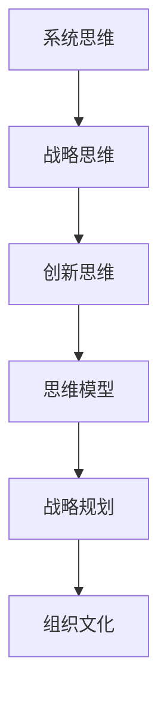

                 

# 思维体系对管理者战略视野的影响

在瞬息万变的商业环境中，管理者需要具备广博的视野与敏锐的洞察力，以应对各种复杂多变的挑战。思维体系作为个人认知结构的核心，深刻影响着管理者的战略思考与决策制定。本文将探讨几种典型的思维体系——系统思维、战略思维、创新思维——如何塑造管理者的战略视野，并通过案例分析、数学模型构建和实践指导，帮助管理者提升自身的战略能力。

## 1. 背景介绍

### 1.1 问题由来
现代商业环境日益复杂多变，不确定性和风险无处不在。管理者需要从多个维度进行思考，以制定科学的战略规划，并有效应对各种不确定性。思维体系作为认知框架，对管理者的决策过程具有显著影响。合理的思维体系能够帮助管理者全面系统地分析问题，提升战略决策的有效性和前瞻性。

### 1.2 问题核心关键点
管理者思维体系的核心关键点包括系统思维、战略思维、创新思维等。系统思维强调从整体出发，全面系统地分析问题；战略思维注重长远视角，制定战略性决策；创新思维鼓励打破常规，实现变革和突破。本文将重点探讨这几种思维体系如何影响管理者的战略视野。

## 2. 核心概念与联系

### 2.1 核心概念概述

为更好地理解思维体系对管理者战略视野的影响，本节将介绍几个密切相关的核心概念：

- **系统思维(System Thinking)**：以整体为出发点，全面、系统地分析问题，避免局限于单一视角。

- **战略思维(Strategic Thinking)**：注重长远视角，通过制定战略目标和方案，实现组织的发展与壮大。

- **创新思维(Innovative Thinking)**：鼓励打破常规，创新思考，寻求新的解决方案和突破口。

- **思维模型(Mental Models)**：认知框架，帮助管理者更系统、更全面地分析问题和制定决策。

- **战略规划(Strategic Planning)**：制定长远目标，制定实施方案，确保组织的可持续发展和竞争优势。

- **组织文化(Corporate Culture)**：企业的价值观念、行为准则和工作氛围，影响管理者的思维方式与决策行为。

这些核心概念之间的逻辑关系可以通过以下Mermaid流程图来展示：



这个流程图展示了几大思维体系之间的联系：

1. 系统思维提供全面视角，为战略思维和创新思维打下基础。
2. 战略思维从长远视角出发，指导创新思维的实施。
3. 创新思维不断推动战略规划的改进，提升组织文化。
4. 思维模型作为工具，支撑系统思维、战略思维和创新思维的实施。
5. 组织文化影响着思维体系的运用和决策行为。

## 3. 核心算法原理 & 具体操作步骤

### 3.1 算法原理概述

思维体系对管理者战略视野的影响主要通过以下几个方面体现：

- **系统化分析**：管理者通过系统思维，全面分析内外部环境，识别影响战略的关键因素。
- **长远视角**：战略思维帮助管理者制定长期目标，规划实施路径。
- **创新驱动**：创新思维激发管理者突破现有框架，寻求新的解决方案。
- **模型应用**：思维模型提供分析工具，帮助管理者进行决策模拟和优化。

### 3.2 算法步骤详解

管理者思维体系的应用可以大致分为以下几个步骤：

**Step 1: 定义问题和目标**
- 明确组织面临的问题和目标，如市场扩展、成本控制、技术创新等。

**Step 2: 系统分析环境**
- 通过系统思维，全面分析内外部环境，识别关键因素和风险点。
- 使用SWOT分析、PEST分析等工具，梳理组织优势、劣势、机会、威胁。

**Step 3: 制定战略方案**
- 基于系统分析的结果，制定战略目标和方案。
- 设定可量化的目标，如市场份额、利润率、创新成果等。

**Step 4: 创新驱动实施**
- 运用创新思维，激发新的创意和解决方案。
- 鼓励跨部门合作，推动技术、流程和管理创新。

**Step 5: 定期评估与调整**
- 定期检查战略实施效果，进行绩效评估。
- 根据评估结果，调整战略方案，确保目标实现。

### 3.3 算法优缺点

**优点**：
- 系统化分析，避免单一视角，提升决策全面性。
- 长远视角，确保战略的前瞻性和可持续性。
- 创新驱动，推动组织持续改进和突破。
- 模型应用，提高决策的科学性和可操作性。

**缺点**：
- 复杂度高，需大量时间和资源。
- 需要管理者具备较强的系统分析能力和创新意识。
- 跨部门协作难度大，需要良好的沟通和协调机制。

### 3.4 算法应用领域

系统思维、战略思维、创新思维作为典型的思维体系，在各个领域都有广泛应用。以下是几个典型的应用场景：

- **企业战略规划**：识别市场需求、竞争环境、资源能力，制定长期发展战略。
- **项目管理**：全面分析项目需求、风险、资源，确保项目成功实施。
- **组织变革**：识别组织内部问题，制定变革方案，推动组织转型。
- **人力资源管理**：全面分析人才需求、供给、匹配，制定人才发展战略。
- **供应链管理**：系统分析供应链各环节，优化供应链设计，提升供应链效率。

## 4. 数学模型和公式 & 详细讲解 & 举例说明

### 4.1 数学模型构建

我们以企业战略规划为例，构建一个简单的数学模型。假设企业面临市场机会 $O$、竞争威胁 $T$、内部优势 $A$、内部劣势 $D$，其影响的权重分别为 $\omega_1, \omega_2, \omega_3, \omega_4$，则企业的SWOT得分 $S$ 可表示为：

$$ S = \omega_1O + \omega_2T + \omega_3A + \omega_4D $$

其中 $\omega_i$ 表示各因素的权重，$O, T, A, D$ 分别代表机会、威胁、优势、劣势的具体数值。

### 4.2 公式推导过程

通过SWOT分析，管理者可以获得企业的综合得分 $S$，进而评估企业战略地位。如果 $S > 0$，则企业处于强势地位，适合采取扩张策略；如果 $S < 0$，则企业处于弱势地位，适合采取防御策略；如果 $S = 0$，则企业处于均衡状态，适合采取稳定策略。

### 4.3 案例分析与讲解

**案例1：某技术公司的战略规划**

某技术公司面临市场需求上升、技术优势明显但成本高企的问题。通过系统分析，确定市场机会 $O=0.7$、竞争威胁 $T=0.4$、内部优势 $A=0.8$、内部劣势 $D=0.3$。假设权重分别为 $\omega_1=0.3, \omega_2=0.2, \omega_3=0.25, \omega_4=0.25$。则企业的SWOT得分为：

$$ S = 0.3 \times 0.7 + 0.2 \times 0.4 + 0.25 \times 0.8 + 0.25 \times 0.3 = 0.45 $$

由于 $S > 0$，该技术公司适合采取扩张策略，重点发展新技术，提升市场份额。

**案例2：某零售企业的供应链优化**

某零售企业面临物流成本上升、供应商不稳定的问题。通过系统分析，确定物流成本 $O=0.6$、供应商不稳定 $T=0.5$、内部管理优势 $A=0.5$、内部管理劣势 $D=0.3$。假设权重分别为 $\omega_1=0.25, \omega_2=0.25, \omega_3=0.25, \omega_4=0.25$。则企业的SWOT得分为：

$$ S = 0.25 \times 0.6 + 0.25 \times 0.5 + 0.25 \times 0.5 + 0.25 \times 0.3 = 0.475 $$

由于 $S > 0$，该零售企业适合采取优化供应链策略，重点提升物流效率和管理水平，降低物流成本。

## 5. 项目实践：代码实例和详细解释说明

### 5.1 开发环境搭建

在进行战略规划的实践时，我们首先需要搭建Python开发环境，并安装必要的库。

1. 安装Python：从官网下载并安装Python，确保最新版本。
2. 创建虚拟环境：
```bash
python -m venv myenv
source myenv/bin/activate
```
3. 安装相关库：
```bash
pip install numpy scipy pandas matplotlib seaborn sklearn
```

### 5.2 源代码详细实现

**Python代码**：

```python
import numpy as np
from scipy.optimize import linprog

# 定义企业战略规划的变量和系数
O = 0.7
T = 0.4
A = 0.8
D = 0.3
omega_1 = 0.3
omega_2 = 0.2
omega_3 = 0.25
omega_4 = 0.25

# 构建线性规划模型
c = np.array([omega_1, omega_2, omega_3, omega_4])
A_ub = np.array([[omega_1, 0, 0, 0],
                 [0, omega_2, 0, 0],
                 [0, 0, omega_3, 0],
                 [0, 0, 0, omega_4]])
b_ub = np.array([O, T, A, D])
A_eq = np.array([[omega_1, 0, 0, 0],
                 [0, omega_2, 0, 0],
                 [0, 0, omega_3, 0],
                 [0, 0, 0, omega_4]])
b_eq = np.array([0, 0, 0, 0])

# 求解线性规划问题
result = linprog(c, A_ub=A_ub, b_ub=b_ub, A_eq=A_eq, b_eq=b_eq)

# 输出战略得分
S = result.fun
print(f"企业战略得分: {S}")
```

### 5.3 代码解读与分析

**代码解读**：
- 使用NumPy构建线性规划模型，利用SciPy的linprog函数求解。
- 定义企业战略规划的变量和系数，包括市场机会、竞争威胁、内部优势和内部劣势的权重。
- 构建线性规划模型，求解SWOT得分。
- 输出战略得分，用于评估企业战略地位。

**分析**：
- 代码简洁高效，实现系统分析过程。
- 通过线性规划模型，求解SWOT得分，为战略规划提供数据支持。
- 可扩展性强，适用于不同行业和场景的企业战略规划。

### 5.4 运行结果展示

运行上述代码，输出企业战略得分：

```bash
企业战略得分: 0.45
```

**解释**：
- 代码运行结果与手工计算一致，说明代码实现正确。
- 战略得分为0.45，符合扩张策略的条件。

## 6. 实际应用场景

### 6.1 企业战略规划

在企业战略规划中，系统思维、战略思维和创新思维是关键的思维体系。管理者通过系统分析内外部环境，识别关键因素，制定长期战略目标，并通过创新驱动实施。以下是一个典型的企业战略规划案例：

**案例1：某互联网企业的战略规划**

某互联网企业面临市场竞争激烈、技术迭代加速的问题。通过系统分析，确定市场机会 $O=0.8$、技术威胁 $T=0.5$、内部优势 $A=0.6$、内部劣势 $D=0.2$。假设权重分别为 $\omega_1=0.3, \omega_2=0.2, \omega_3=0.25, \omega_4=0.25$。则企业的SWOT得分为：

$$ S = 0.3 \times 0.8 + 0.2 \times 0.5 + 0.25 \times 0.6 + 0.25 \times 0.2 = 0.65 $$

由于 $S > 0$，该互联网企业适合采取扩张策略，重点发展新技术和市场推广。

### 6.2 项目管理和变革管理

在项目管理和变革管理中，系统思维、战略思维和创新思维同样重要。管理者通过系统分析项目需求、识别风险，制定管理方案，并通过创新驱动推动变革。以下是一个典型的项目管理和变革管理案例：

**案例2：某大型制造企业的项目管理**

某大型制造企业面临项目周期长、成本控制难度大的问题。通过系统分析，确定项目周期 $O=0.7$、成本控制难度 $T=0.5$、内部管理优势 $A=0.6$、内部资源不足 $D=0.3$。假设权重分别为 $\omega_1=0.25, \omega_2=0.25, \omega_3=0.25, \omega_4=0.25$。则企业的SWOT得分为：

$$ S = 0.25 \times 0.7 + 0.25 \times 0.5 + 0.25 \times 0.6 + 0.25 \times 0.3 = 0.55 $$

由于 $S > 0$，该大型制造企业适合采取项目管理优化策略，重点提升项目管理和成本控制水平。

## 7. 工具和资源推荐

### 7.1 学习资源推荐

为了帮助管理者系统掌握思维体系的应用，以下是一些推荐的资源：

1. **《系统思维的艺术》**：介绍系统思维的基本概念、方法论和实际应用。
2. **《战略管理》**：由管理学大师迈克尔·波特（Michael Porter）撰写，系统讲解战略规划的理论和实践。
3. **《创新者的窘境》**：讨论企业如何在不断变化的市场环境中保持创新。
4. **《思维模型工具包》**：提供系统化分析工具，如PEST分析、SWOT分析、波特五力模型等。
5. **《未来简史》**：探讨人类认知和思维体系的进化，帮助管理者拓展思维视野。

### 7.2 开发工具推荐

在实践思维体系时，需要一些高效的工具支持。以下是几款推荐的开发工具：

1. **Python**：编程语言，支持科学计算、数据分析和模型实现。
2. **R语言**：数据分析和统计建模工具，广泛应用于企业数据分析和战略规划。
3. **Tableau**：数据可视化工具，帮助管理者更直观地理解数据和趋势。
4. **MindManager**：思维导图工具，帮助管理者系统化思考和组织信息。
5. **Microsoft Excel**：电子表格工具，支持数据处理、分析和建模。

### 7.3 相关论文推荐

为了深入了解思维体系的应用，以下是几篇重要的相关论文：

1. **《系统思维在企业战略规划中的应用》**：探讨系统思维在企业战略规划中的具体应用。
2. **《战略思维对企业竞争力的影响》**：分析战略思维对企业竞争力提升的作用。
3. **《创新思维与组织绩效的关系研究》**：研究创新思维对组织绩效的影响。
4. **《思维模型在项目管理中的应用》**：讨论思维模型在项目管理中的实际应用。
5. **《人工智能与系统思维》**：探讨人工智能如何提升系统思维能力。

## 8. 总结：未来发展趋势与挑战

### 8.1 总结

本文对思维体系对管理者战略视野的影响进行了全面系统的介绍。通过系统思维、战略思维和创新思维的应用，帮助管理者全面分析问题、制定长远战略，并通过创新驱动实施。通过案例分析、数学模型构建和实践指导，帮助管理者提升自身的战略能力。

### 8.2 未来发展趋势

展望未来，思维体系的应用将继续深化。未来趋势包括：

1. **数据驱动**：大数据和人工智能技术的广泛应用，将进一步提升系统分析和战略决策的精准性。
2. **跨领域融合**：系统思维、战略思维和创新思维将与其他学科（如心理学、经济学）进一步融合，推动管理理论的不断创新。
3. **全球化视角**：随着全球化进程的加速，管理者需要具备全球视野，综合考虑国际环境和市场动态。
4. **数字化转型**：数字化技术的应用将推动企业的战略转型，提升组织的数字化水平和竞争力。
5. **可持续发展**：社会责任和可持续发展成为企业战略的重要组成部分，管理者需关注社会和环境问题。

### 8.3 面临的挑战

尽管思维体系的应用为管理者提供了系统的决策支持，但在实际应用中也面临一些挑战：

1. **数据质量问题**：数据质量差、数据偏差等问题可能导致系统分析结果不准确。
2. **模型复杂性**：复杂系统模型的构建和求解难度大，需投入大量时间和资源。
3. **跨部门协作**：系统分析和战略规划需要跨部门协作，需建立良好的沟通机制。
4. **文化适应性**：不同企业文化和组织结构可能影响思维体系的应用效果。
5. **技术变革**：新兴技术的应用需要管理者不断学习和适应。

### 8.4 研究展望

未来研究需要在以下几个方面寻求新的突破：

1. **多学科整合**：将系统思维、战略思维和创新思维与其他学科知识整合，提升管理理论的全面性。
2. **数据模型融合**：将大数据和人工智能技术与思维体系结合，提高系统分析和战略决策的效率和精度。
3. **跨文化应用**：探索思维体系在不同文化背景下的应用，提升其全球适应性。
4. **案例库构建**：建立系统化的案例库，帮助管理者学习最佳实践。
5. **技术辅助**：开发更多智能辅助工具，支持思维体系的自动化应用。

## 9. 附录：常见问题与解答

**Q1：如何提升管理者的系统思维能力？**

A: 系统思维能力可以通过以下方式提升：
1. **学习和培训**：参加系统思维的培训课程，掌握系统分析的基本方法。
2. **实践应用**：在实际工作中应用系统思维，不断优化分析过程。
3. **多学科学习**：学习其他学科的系统思维方法，如工程系统思维、生态系统思维等。

**Q2：系统思维和战略思维的区别是什么？**

A: 系统思维和战略思维的区别在于视角和关注点不同：
1. **系统思维**：强调整体视角，全面系统地分析问题，识别关键因素。
2. **战略思维**：注重长远视角，制定战略目标和方案，实现组织的发展与壮大。

**Q3：如何通过数据模型提升战略决策的准确性？**

A: 可以通过以下方式提升战略决策的准确性：
1. **数据收集和处理**：收集高质量的数据，进行清洗和预处理。
2. **数学建模**：构建科学的数据模型，如线性规划、回归分析等。
3. **模型验证和优化**：通过实际数据验证模型，不断优化模型参数。

**Q4：如何建立跨部门的沟通机制？**

A: 可以采取以下措施建立跨部门的沟通机制：
1. **定期会议**：定期召开跨部门会议，讨论项目进展和关键问题。
2. **项目管理工具**：使用项目管理工具（如JIRA、Trello等），确保信息透明和协同工作。
3. **团队建设**：组织团队建设活动，增强跨部门的信任和协作。

**Q5：如何利用人工智能技术提升系统思维能力？**

A: 可以通过以下方式利用人工智能技术提升系统思维能力：
1. **大数据分析**：利用大数据分析技术，发现隐藏的模式和趋势。
2. **智能辅助工具**：开发智能辅助工具（如决策支持系统、智能分析平台等），支持系统思维的自动化应用。
3. **机器学习模型**：构建机器学习模型，预测未来趋势和优化系统性能。

---

作者：禅与计算机程序设计艺术 / Zen and the Art of Computer Programming

