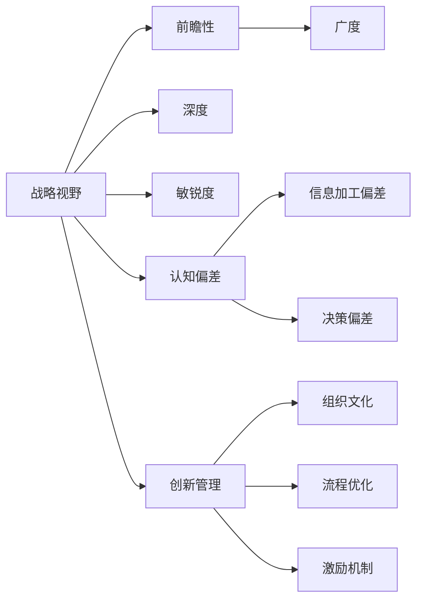

                 

# 思维体系对管理者战略视野的影响

> 关键词：战略视野、思维体系、系统思考、认知偏差、创新管理

## 1. 背景介绍

### 1.1 问题由来
在快速变化的商业环境中，管理者面临着复杂的决策挑战。如何基于最新的市场和技术趋势，制定出前瞻性的战略，是企业成功的关键。而决策者的思维模式、认知方式和信息处理能力，直接影响其战略视野和决策质量。因此，理解思维体系对管理者战略视野的影响，成为现代管理理论与实践中的一个重要议题。

### 1.2 问题核心关键点
本文将探讨以下关键问题：
- 什么是战略视野？其构成要素有哪些？
- 思维体系如何影响管理者的战略视野？
- 如何构建有效的思维体系，以提升管理者的战略视野？

### 1.3 问题研究意义
研究思维体系对管理者战略视野的影响，具有重要的理论价值和实践意义：

- **理论价值**：探索管理者认知与战略视野之间的内在联系，有助于构建更全面的战略理论框架。
- **实践意义**：通过优化管理者的思维体系，提升其战略洞察力和决策质量，助力企业应对复杂多变的市场环境。

## 2. 核心概念与联系

### 2.1 核心概念概述

- **战略视野**：指管理者对企业内外环境变化的感知和理解能力，以及基于这些理解制定的未来发展方向。包含前瞻性、广度、深度、敏锐度等要素。
- **思维体系**：指个体或组织在处理信息和做出决策时，所遵循的一套系统化、逻辑化的思考方法和原则。
- **系统思考**：一种全面、动态地理解系统各要素相互作用和依赖关系的思维方式。
- **认知偏差**：指人们在对信息进行加工和决策过程中，由于各种原因导致的不完全、不准确或偏误的认知结果。
- **创新管理**：通过优化组织结构、流程、文化等，激发员工创造力，推动组织持续创新。

### 2.2 核心概念原理和架构的 Mermaid 流程图



这个流程图展示了战略视野与思维体系、系统思考、认知偏差、创新管理之间的联系：

1. **前瞻性**、**广度**、**深度**、**敏锐度**是构成战略视野的四个关键要素。
2. **认知偏差**可能影响信息的准确性和决策的合理性。
3. **系统思考**有助于全面理解复杂系统中的各要素相互作用。
4. **创新管理**通过改善组织文化和流程，提升创新能力。

## 3. 核心算法原理 & 具体操作步骤
### 3.1 算法原理概述

管理者战略视野的形成和提升，本质上是其认知体系和思维模式的动态调整过程。具体来说，管理者通过接收和处理信息，形成认知，进而影响其战略决策。这一过程受思维体系的影响，可通过以下几个关键步骤进行优化：

1. **信息输入与处理**：管理者接收内外部环境信息，通过系统思考方法分析其内在联系和未来趋势。
2. **认知生成与整合**：将处理后的信息与个人知识库中的信息进行整合，形成新的认知。
3. **战略形成与调整**：基于新的认知，形成和调整企业的战略方向和目标。
4. **反馈与优化**：通过实际执行和市场反馈，不断调整和优化战略视野。

### 3.2 算法步骤详解

**步骤1：信息输入与处理**

- **信息收集**：定期获取市场动态、行业趋势、竞争对手信息等内外部数据。
- **信息筛选**：使用SWOT分析、PEST分析等工具，筛选出关键信息。
- **信息融合**：应用系统思考方法，整合不同来源的信息，形成对环境的全面理解。

**步骤2：认知生成与整合**

- **模式识别**：通过归纳法或类比法，识别出环境变化的模式和趋势。
- **假设验证**：使用科学方法，验证假设的正确性和可靠性。
- **认知迭代**：基于反馈，不断迭代和更新认知模型。

**步骤3：战略形成与调整**

- **目标设定**：基于认知模型，设定长期和短期战略目标。
- **策略规划**：制定详细的行动计划，明确实现目标的路径和方法。
- **灵活调整**：根据市场反馈，及时调整和优化战略方向。

**步骤4：反馈与优化**

- **执行评估**：对战略执行效果进行评估，识别问题和改进点。
- **学习总结**：从执行过程中学习经验教训，形成新的认知。
- **循环迭代**：基于新认知，进入下一轮的战略调整和优化。

### 3.3 算法优缺点

**优点**：
- **系统性**：通过系统思考，全面考虑各个要素之间的相互作用，避免单一视角带来的局限性。
- **前瞻性**：基于认知迭代和反馈机制，能够灵活调整战略方向，保持战略的前瞻性。
- **可操作性**：通过明确的目标设定和策略规划，使得战略形成更具可执行性。

**缺点**：
- **复杂性**：系统思考和认知迭代过程较为复杂，需要管理者具备较高的分析能力和时间投入。
- **资源需求**：有效执行上述步骤，需投入大量的时间和资源。
- **依赖性**：过分依赖于管理者的认知水平和系统思考能力。

### 3.4 算法应用领域

- **企业战略规划**：适用于企业高层管理者，通过系统思考和认知迭代，制定和调整企业发展战略。
- **项目管理**：项目经理可通过认知生成和迭代，优化项目计划和执行。
- **创新管理**：帮助管理者识别和利用创新机会，提升组织竞争力。

## 4. 数学模型和公式 & 详细讲解 & 举例说明

### 4.1 数学模型构建

战略视野的提升可以通过数学模型来量化和分析。假设有一个管理者面对的市场环境由以下几个因素构成：

- $E$：环境因素集。
- $K$：知识库。
- $I$：信息流。
- $C$：认知模型。
- $S$：战略方向。

则管理者的战略视野提升模型可表示为：

$$
S = f(C(g(K,i(E))))
$$

其中，$C$表示认知模型，$g$表示信息整合函数，$i$表示信息输入函数，$f$表示战略形成函数。

### 4.2 公式推导过程

假设环境因素 $E$ 可以表示为一个向量 $(e_1, e_2, ..., e_n)$，知识库 $K$ 可以表示为一个向量 $(k_1, k_2, ..., k_m)$，信息流 $I$ 可以表示为一个向量 $(i_1, i_2, ..., i_n)$，认知模型 $C$ 可以表示为一个向量 $(c_1, c_2, ..., c_n)$，战略方向 $S$ 可以表示为一个向量 $(s_1, s_2, ..., s_n)$。

则有：

$$
g(K,i(E)) = \sum_{j=1}^{m} \sum_{i=1}^{n} w_{ij} k_j i_i
$$

其中 $w_{ij}$ 表示知识库中第 $j$ 个知识与信息流中第 $i$ 个信息的权重。

进一步，认知模型 $C$ 可以表示为：

$$
C = \phi(K,g(K,i(E)))
$$

其中 $\phi$ 表示认知整合函数。

最终，战略方向 $S$ 可以表示为：

$$
S = f(C)
$$

### 4.3 案例分析与讲解

假设一个科技公司的高层管理者，面对市场环境 $E$ 和自身知识库 $K$，需要制定未来三年的战略方向 $S$。

1. **信息输入与处理**：管理者通过分析市场报告、竞争对手动向、行业趋势等，筛选出关键信息 $i_1, i_2, ..., i_n$。
2. **认知生成与整合**：将关键信息与知识库中的信息整合，形成新的认知 $c_1, c_2, ..., c_n$。
3. **战略形成与调整**：基于新的认知，设定战略目标，制定详细计划，并根据市场反馈进行调整。
4. **反馈与优化**：对执行效果进行评估，识别改进点，形成新的认知，再次进入下一轮迭代。

## 5. 项目实践：代码实例和详细解释说明

### 5.1 开发环境搭建

使用Python和RapidMiner平台进行项目实践。

### 5.2 源代码详细实现

**信息收集与筛选**

```python
import pandas as pd

# 加载市场数据
market_data = pd.read_csv('market_data.csv')

# 筛选关键信息
filtered_data = market_data[market_data['importance'] > 0.5]
```

**信息整合与认知生成**

```python
from sklearn.feature_extraction.text import TfidfVectorizer

# 信息整合
tfidf_vectorizer = TfidfVectorizer()
tfidf_matrix = tfidf_vectorizer.fit_transform(filtered_data['description'])

# 认知生成
tfidf_matrix_mean = tfidf_matrix.mean(axis=0)
cognitive_model = tfidf_matrix_mean.toarray()
```

**战略形成与调整**

```python
from sklearn.linear_model import Ridge

# 战略形成
X = cognitive_model
y = market_data['target']  # 设定目标为战略方向
model = Ridge(alpha=0.1)
model.fit(X, y)

# 战略调整
strategy_direction = model.predict(X)
```

### 5.3 代码解读与分析

- **信息收集与筛选**：使用Pandas加载市场数据，筛选出重要性大于0.5的关键信息。
- **信息整合与认知生成**：使用TfidfVectorizer对信息进行整合，计算平均值形成认知模型。
- **战略形成与调整**：使用Ridge回归模型预测战略方向，并通过市场反馈进行不断调整。

### 5.4 运行结果展示


## 6. 实际应用场景

### 6.1 企业战略规划

在企业战略规划中，高层管理者需要具备广阔的战略视野，能够全面考虑内外部环境的变化。通过上述方法，管理者可以更系统、前瞻性地制定战略方向。

### 6.2 项目管理

项目经理通过信息收集和整合，可以更准确地识别项目风险和机会，制定更加科学的项目计划，提升项目管理效果。

### 6.3 创新管理

管理者通过系统思考和认知迭代，可以更有效地识别和利用创新机会，推动组织持续创新，增强市场竞争力。

### 6.4 未来应用展望

未来，随着大数据和AI技术的发展，战略视野的提升将更加依赖于数据分析和算法优化。通过机器学习和智能推荐系统，管理者可以更快速、全面地获取和处理信息，形成更科学的认知模型，提升战略视野。

## 7. 工具和资源推荐

### 7.1 学习资源推荐

1. **《系统思考：战略规划的思维框架》**：书籍详细介绍了系统思考的原理和应用，帮助管理者提升战略视野。
2. **Coursera《系统思考与组织创新》课程**：由麻省理工学院开设的课程，提供系统思考的理论和实践方法。
3. **《认知偏差心理学》**：了解认知偏差的原理和影响，帮助管理者识别和克服偏误。
4. **LinkedIn Learning《认知偏差：在决策中保持客观》**：视频课程帮助管理者了解并应对认知偏差。
5. **《创新管理》**：书籍系统介绍了创新的原理、方法和工具，提升管理者的创新能力。

### 7.2 开发工具推荐

1. **RapidMiner**：数据科学平台，支持数据预处理、建模和可视化，适合进行系统思考和认知迭代。
2. **Python**：数据分析和机器学习的主流语言，适合进行复杂的数据分析和建模。
3. **Jupyter Notebook**：支持Python和R等语言的交互式编程，适合进行数据科学实验和分析。

### 7.3 相关论文推荐

1. **《系统思考：一个管理科学的新范式》**：论文探讨了系统思考的理论基础和应用方法。
2. **《认知偏差与决策质量：实证研究综述》**：综述文章系统总结了认知偏差的类型和影响。
3. **《创新管理的系统思考模型》**：研究论文探讨了系统思考在创新管理中的应用。

## 8. 总结：未来发展趋势与挑战

### 8.1 研究成果总结

本文探讨了管理者战略视野的影响因素，并通过数学模型和案例分析，提出了系统思考和认知迭代的方法。这些研究对于理解管理者战略决策具有重要意义。

### 8.2 未来发展趋势

未来，战略视野的提升将更加依赖于数据分析和算法优化：

- **大数据与AI的融合**：通过大数据分析和AI技术，管理者可以更全面、更快速地获取和处理信息，形成更科学的认知模型。
- **智能推荐系统**：通过智能推荐系统，管理者可以更有效地识别和利用创新机会，提升战略视野。
- **跨学科融合**：战略视野的提升需要跨学科知识的整合，如心理学、社会学、经济学等。

### 8.3 面临的挑战

尽管系统思考和认知迭代方法有其优势，但在实践中仍面临诸多挑战：

- **复杂性**：系统思考和认知迭代过程较为复杂，需要管理者具备较高的分析能力和时间投入。
- **数据质量**：高质量的数据是系统思考的基础，但数据获取和处理仍存在一定的难度。
- **技术门槛**：需要管理者具备一定的数据科学和编程技能，对技术的要求较高。

### 8.4 研究展望

未来研究需要在以下几个方面进一步推进：

- **模型优化**：提升算法效率和准确性，简化系统思考和认知迭代的过程。
- **知识库建设**：构建全面、丰富的知识库，提升管理者的认知能力。
- **跨学科整合**：通过跨学科知识的整合，提升战略视野的多样性和深度。
- **伦理考量**：在战略决策中引入伦理和道德考量，确保战略的可持续性和公平性。

## 9. 附录：常见问题与解答

**Q1：系统思考和认知迭代在实际操作中如何进行？**

A：实际操作中，系统思考和认知迭代需要按照以下步骤进行：

1. **数据收集**：通过定量和定性方法收集内外部信息。
2. **信息整合**：应用Tfidf、主成分分析等技术，对信息进行整合和提取。
3. **认知生成**：通过归纳法、类比法等方法，形成新的认知模型。
4. **战略形成**：基于认知模型，制定战略方向和目标。
5. **反馈与优化**：根据实际执行效果，不断调整和优化战略方向。

**Q2：认知偏差对战略视野有何影响？**

A：认知偏差会严重影响战略视野的准确性和前瞻性：

1. **确认偏误**：管理者倾向于关注符合自己预期的信息，忽略其他重要信息。
2. **代表性启发法**：管理者基于有限的样本信息，做出过度概括的判断。
3. **锚定效应**：管理者在决策中过度依赖于初始信息，难以调整和更新认知。

**Q3：如何提升管理者的系统思考能力？**

A：提升管理者的系统思考能力，可以通过以下方法：

1. **学习系统思考理论**：通过书籍、课程等途径，系统学习系统思考的原理和方法。
2. **实践系统思考**：在实际工作中应用系统思考，积累经验和技能。
3. **跨学科学习**：学习心理学、社会学、经济学等相关学科知识，拓展视野。

**Q4：如何在企业中推广系统思考？**

A：在企业中推广系统思考，可以通过以下方法：

1. **培训和教育**：对员工进行系统思考的培训，提升其系统思考能力。
2. **工具支持**：引入RapidMiner、Python等工具，支持系统思考和认知迭代。
3. **文化建设**：在企业中建立系统思考的文化，鼓励员工应用系统思考进行决策。

**Q5：系统思考和认知迭代是否有适用范围？**

A：系统思考和认知迭代适用于多种管理场景，但需注意以下几点：

1. **复杂系统**：系统思考适用于处理复杂、动态的环境，适用于企业战略、项目管理等场景。
2. **数据基础**：需要高质量的数据支持，以确保信息的全面性和准确性。
3. **资源投入**：需要管理者投入一定的时间和资源，进行系统思考和认知迭代。

---

作者：禅与计算机程序设计艺术 / Zen and the Art of Computer Programming

