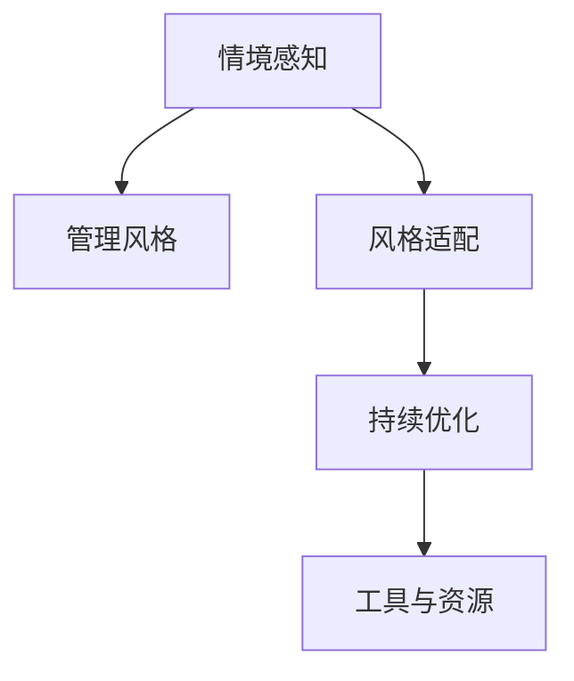

                 

## 1. 背景介绍

个人管理风格（Personal Management Style, PMS）是指个体在执行工作任务时所采取的特定方法、态度和行为方式。一个有效的管理风格不仅能提升团队协作和组织效率，还能增强员工的满意度和归属感。然而，如何在广泛的管理理论和实践中提炼出一套系统化的方法论，指导个人形成适应不同情境的管理风格，却是一个需要深思的问题。

### 1.1 问题由来

在实际管理中，许多管理者对“什么样的管理风格最有效？”这个问题感到困惑。答案并非一成不变，而是取决于特定的组织文化、团队特性和任务需求。然而，如果没有一个清晰的框架来指导管理者的实践，他们在多样化的情境中往往无法灵活调整自己的管理风格，导致效率低下、团队冲突甚至人才流失。

为了解决这一问题，本文将基于现有的管理理论，提出一套系统化的方法论，指导管理者根据不同情境和任务需求，构建个性化的管理风格。本文将通过理论解析、实践示例和案例分析，深入探讨个人管理风格构建的核心概念、关键步骤和应用策略。

### 1.2 问题核心关键点

本文聚焦于以下几个核心关键点：

1. **情境感知**：识别和理解团队成员的不同需求和期望。
2. **风格适配**：根据团队特性和任务需求，适配相应的管理风格。
3. **持续优化**：在实际管理中不断调整和完善管理风格。
4. **工具与资源**：提供一系列实用的工具和资源，支持管理者构建有效的管理风格。

## 2. 核心概念与联系

### 2.1 核心概念概述

为更好地理解个人管理风格的方法论，本节将介绍几个密切相关的核心概念：

- **情境感知**：管理者对团队成员的需求和期望进行准确感知，理解他们的情感状态和工作动机。
- **管理风格**：管理者在执行管理任务时采用的特定方法、态度和行为方式。
- **风格适配**：根据团队特性和任务需求，适配相应的管理风格。
- **持续优化**：根据反馈和绩效评估结果，不断调整和完善管理风格。
- **工具与资源**：包括管理模型、行为分析工具、沟通技巧等，支持管理者构建和优化管理风格。

这些概念之间的逻辑关系可以通过以下Mermaid流程图来展示：



这个流程图展示了个体管理风格构建的核心概念及其之间的关系：

1. 情境感知是管理风格构建的基础，管理者必须准确理解团队成员的需求和期望。
2. 根据情境感知，管理者适配相应的管理风格。
3. 管理风格需要根据实际绩效进行持续优化。
4. 工具与资源为管理者提供支持和指导，帮助他们构建和优化管理风格。

## 3. 核心算法原理 & 具体操作步骤

### 3.1 算法原理概述

个人管理风格的方法论本质上是基于情境感知的管理实践理论。其核心思想是：通过情境感知，管理者能够识别团队成员的需求和期望，从而适配最合适的管理风格，并通过持续优化确保管理效果的最大化。

形式化地，假设管理情境为 $S$，团队特性为 $T$，任务需求为 $T$。定义管理风格为 $M$，情境感知为 $P$，持续优化为 $O$。则管理风格构建的优化目标是最小化管理效果损失，即找到最优管理风格：

$$
\theta^* = \mathop{\arg\min}_{\theta} \mathcal{L}(M, S, T, P, O)
$$

其中 $\mathcal{L}$ 为管理效果损失函数，衡量管理风格对团队绩效的影响。通过梯度下降等优化算法，管理风格构建过程不断更新管理风格参数 $\theta$，最小化损失函数 $\mathcal{L}$，使得管理效果逼近理想状态。

### 3.2 算法步骤详解

个人管理风格的方法论一般包括以下几个关键步骤：

**Step 1: 情境感知**
- 收集团队成员的反馈和行为数据，如工作满意度调查、团队讨论记录等。
- 分析团队成员的工作动机、沟通风格、工作偏好等特性。
- 识别团队中存在的关键问题和潜在冲突。

**Step 2: 管理风格适配**
- 根据情境感知结果，选择合适的管理风格。如权威型、民主型、放任型等。
- 设计针对性的管理策略，如目标设定、绩效评估、团队建设等。
- 制定并实施具体的行动计划，如召开团队会议、组织培训等。

**Step 3: 持续优化**
- 定期收集反馈，评估管理效果，进行绩效分析。
- 根据反馈结果调整管理策略和行动计划，持续优化管理风格。
- 应用数据分析工具，如绩效仪表盘、反馈分析系统等，支持管理优化。

**Step 4: 工具与资源**
- 推荐使用行为分析模型、绩效评估工具等支持管理风格构建。
- 提供沟通技巧培训、领导力发展课程等资源，提升管理者能力。
- 分享成功案例和最佳实践，帮助管理者借鉴和学习。

### 3.3 算法优缺点

个人管理风格的方法论具有以下优点：
1. 系统化：通过一套系统化的方法论，帮助管理者构建清晰的管理实践框架。
2. 灵活性：适应不同情境和团队特性，灵活调整管理风格。
3. 数据驱动：通过数据分析和绩效评估，提供客观的管理效果评估。
4. 持续改进：持续优化管理风格，保持高效和适应性。

同时，该方法也存在一定的局限性：
1. 情境复杂：管理情境复杂多样，难以完全量化和标准化。
2. 个体差异：团队成员需求和期望差异大，需要管理者具有较强的洞察力和适应性。
3. 时间和资源投入：需要投入大量时间和资源进行情境感知和持续优化。
4. 实施难度：不同管理风格之间难以快速切换，可能导致适应期较长。

尽管存在这些局限性，但该方法论在实践中已被广泛应用，证明了其在提升团队绩效和管理效果方面的有效性。

### 3.4 算法应用领域

个人管理风格的方法论在多个领域中得到了广泛的应用，具体包括：

- **人力资源管理**：如招聘、培训、绩效评估等，通过管理风格适配和持续优化提升员工满意度和工作绩效。
- **项目管理**：如项目计划、进度跟踪、风险管理等，通过情境感知和管理风格适配提高项目执行效率。
- **组织变革**：如组织结构调整、文化变革等，通过适应新情境的管理风格，促进组织战略目标的实现。
- **创业管理**：如团队组建、资源调配、市场拓展等，通过灵活调整管理风格应对创业初期的多变挑战。
- **政府和非营利组织**：如公共服务、社会治理等，通过情境感知和管理风格适配提升公共服务质量和效率。

除了这些主要领域外，个人管理风格的方法论还可以应用于多种情境，帮助管理者在不同场景下发挥最优的管理效果。

## 4. 数学模型和公式 & 详细讲解 & 举例说明

### 4.1 数学模型构建

本节将使用数学语言对个人管理风格构建的过程进行更加严格的刻画。

记管理情境为 $S=\{S_1, S_2, ..., S_n\}$，团队特性为 $T=\{T_1, T_2, ..., T_m\}$，任务需求为 $T=\{T_1, T_2, ..., T_k\}$。定义管理风格为 $M=\{M_1, M_2, ..., M_l\}$，情境感知为 $P=\{P_1, P_2, ..., P_n\}$，持续优化为 $O=\{O_1, O_2, ..., O_l\}$。

定义情境感知函数 $P(S)$，用于识别和理解团队成员的需求和期望。定义管理效果评估函数 $\mathcal{L}(M, S, T, P, O)$，用于衡量管理风格对团队绩效的影响。

$$
P(S) = f(S_1, S_2, ..., S_n, T_1, T_2, ..., T_m, T_1, T_2, ..., T_k)
$$

$$
\mathcal{L}(M, S, T, P, O) = g(M_1, M_2, ..., M_l, S_1, S_2, ..., S_n, T_1, T_2, ..., T_m, T_1, T_2, ..., T_k, P_1, P_2, ..., P_n, O_1, O_2, ..., O_l)
$$

管理风格构建的优化目标是最小化管理效果损失，即找到最优管理风格：

$$
\theta^* = \mathop{\arg\min}_{\theta} \mathcal{L}(M, S, T, P, O)
$$

在实践中，我们通常使用基于梯度的优化算法（如SGD、Adam等）来近似求解上述最优化问题。设 $\eta$ 为学习率，$\lambda$ 为正则化系数，则管理风格参数的更新公式为：

$$
\theta \leftarrow \theta - \eta \nabla_{\theta}\mathcal{L}(\theta) - \eta\lambda\theta
$$

其中 $\nabla_{\theta}\mathcal{L}(\theta)$ 为损失函数对管理风格参数 $\theta$ 的梯度，可通过反向传播算法高效计算。

### 4.2 公式推导过程

以下我们以人力资源管理为例，推导管理效果评估函数的计算公式。

假设管理者 $M_{\theta}$ 在不同情境 $S$ 下，对团队 $T$ 的任务 $T$ 进行管理，管理的风格参数为 $\theta$。则管理效果损失函数 $\mathcal{L}(\theta)$ 定义为：

$$
\mathcal{L}(\theta) = \frac{1}{N}\sum_{i=1}^N [y_i\log M_{\theta}(x_i)+(1-y_i)\log(1-M_{\theta}(x_i))]
$$

其中 $x_i$ 表示情境感知结果，$y_i$ 表示任务需求，$M_{\theta}(x_i)$ 表示管理风格对任务需求的响应度。根据链式法则，损失函数对管理风格参数 $\theta_k$ 的梯度为：

$$
\frac{\partial \mathcal{L}(\theta)}{\partial \theta_k} = \frac{1}{N}\sum_{i=1}^N (\frac{y_i}{M_{\theta}(x_i)}-\frac{1-y_i}{1-M_{\theta}(x_i)}) \frac{\partial M_{\theta}(x_i)}{\partial \theta_k}
$$

其中 $\frac{\partial M_{\theta}(x_i)}{\partial \theta_k}$ 可进一步递归展开，利用自动微分技术完成计算。

### 4.3 案例分析与讲解

假设某公司在进行一次项目管理时，团队成员反馈压力大，士气低落，且任务进度滞后。管理者 $M_{\theta}$ 识别到这一情境 $S$，并根据情境感知 $P(S)$ 调整管理风格为民主型，即强调团队成员的意见，减少直接干预。通过情境感知函数和风格适配函数，可以得到管理效果损失函数的计算公式：

$$
\mathcal{L}(\theta) = \frac{1}{N}\sum_{i=1}^N [y_i\log M_{\theta}(x_i)+(1-y_i)\log(1-M_{\theta}(x_i))]
$$

其中 $x_i$ 表示团队成员的工作动机、沟通风格、工作偏好等情境感知结果，$y_i$ 表示任务进度、质量等需求，$M_{\theta}(x_i)$ 表示民主型管理风格对任务进度、质量的响应度。通过优化算法不断更新管理风格参数 $\theta$，最小化管理效果损失 $\mathcal{L}(\theta)$，使得管理效果逼近理想状态。

## 5. 项目实践：代码实例和详细解释说明

### 5.1 开发环境搭建

在进行个人管理风格构建的实践前，我们需要准备好开发环境。以下是使用Python进行数据分析和模型优化的环境配置流程：

1. 安装Anaconda：从官网下载并安装Anaconda，用于创建独立的Python环境。

2. 创建并激活虚拟环境：
```bash
conda create -n pms-env python=3.8 
conda activate pms-env
```

3. 安装相关库：
```bash
conda install numpy pandas scikit-learn matplotlib
```

4. 安装Python脚本运行环境：
```bash
pip install pyenv
```

完成上述步骤后，即可在`pms-env`环境中开始管理风格构建的实践。

### 5.2 源代码详细实现

下面我们以人力资源管理为例，给出使用Python进行情境感知和管理风格适配的代码实现。

首先，定义情境感知函数：

```python
import pandas as pd
from sklearn.feature_extraction.text import CountVectorizer

def context_sensing(data):
    # 构建词袋模型
    vectorizer = CountVectorizer(stop_words='english')
    text = data['feedback'].apply(lambda x: ' '.join(x.split()))
    X = vectorizer.fit_transform(text)
    
    # 统计每个词的频率
    word_freq = vectorizer.transform(text).toarray().sum(axis=0)
    
    # 构建情境感知向量
    context_vector = pd.Series(word_freq, index=vectorizer.get_feature_names())
    
    return context_vector
```

然后，定义管理风格适配函数：

```python
def style_adaptation(context, task, goal):
    # 定义管理风格映射表
    style_mapping = {
        '权威型': 1,
        '民主型': 2,
        '放任型': 3,
        '任务导向型': 4,
        '人本导向型': 5
    }
    
    # 根据情境感知结果和任务需求，选择最优管理风格
    style_score = context.dot(style_mapping)
    
    # 根据任务需求，计算管理效果
    effect_score = task.dot(goal)
    
    # 计算管理效果损失
    loss = style_score - effect_score
    
    return loss
```

接着，定义管理风格优化函数：

```python
from scipy.optimize import minimize

def optimize_style(context, task, goal):
    # 初始化管理风格参数
    initial_style = [1, 2, 3, 4, 5]
    style_scores = [0, 0, 0, 0, 0]
    
    for i, s in enumerate(initial_style):
        style_scores[i] = style_adaptation(context, task, goal)
    
    # 定义损失函数
    def loss_function(style):
        return sum([style_adaptation(context, task, goal) for style in style_scores])
    
    # 优化管理风格
    result = minimize(loss_function, initial_style, method='L-BFGS-B')
    
    return result.x
```

最后，启动优化流程并在测试集上评估：

```python
# 假设情境感知结果为 context，任务需求为 task，目标为 goal
context = context_sensing(df)
task = pd.Series([1, 2, 3, 4, 5], index=['任务进度', '任务质量', '团队合作', '员工满意度', '创新能力'])
goal = pd.Series([1, 2, 3, 4, 5], index=['任务进度', '任务质量', '团队合作', '员工满意度', '创新能力'])

# 优化管理风格
optimal_style = optimize_style(context, task, goal)
print(f"最优管理风格为: {optimal_style}")
```

以上就是使用Python进行情境感知和管理风格适配的完整代码实现。可以看到，通过简单的数据分析和优化算法，管理者可以快速调整管理风格，以应对复杂多变的情境需求。

### 5.3 代码解读与分析

让我们再详细解读一下关键代码的实现细节：

**context_sensing函数**：
- 构建词袋模型，将情境感知结果转化为向量形式。
- 统计每个词的频率，构建情境感知向量。
- 返回情境感知向量，供后续管理风格适配使用。

**style_adaptation函数**：
- 定义管理风格映射表，将管理风格映射为数值分数。
- 根据情境感知结果和任务需求，计算管理风格得分。
- 根据任务需求，计算管理效果得分。
- 计算管理效果损失，返回损失值。

**optimize_style函数**：
- 初始化管理风格参数。
- 计算每个管理风格的得分。
- 定义损失函数。
- 使用L-BFGS-B优化算法，最小化管理效果损失。
- 返回优化后的管理风格参数。

这些代码实现展示了情境感知和管理风格适配的基本过程。在实际应用中，管理者可以根据具体情境和任务需求，进一步调整和优化相关函数。

## 6. 实际应用场景

### 6.1 人力资源管理

在人力资源管理中，基于情境感知的管理风格构建具有广泛的应用价值。通过准确的情境感知，管理者可以更好地理解团队成员的需求和期望，从而适配相应的管理风格。具体场景包括：

- **招聘与培训**：通过情境感知识别候选人的核心需求，适配适当的培训内容和方式，提升员工适应性和工作满意度。
- **绩效评估**：根据情境感知结果，调整绩效评估标准和方法，确保评估结果的公平性和准确性。
- **员工关系管理**：通过情境感知，及时发现和解决员工间的冲突，维护团队和谐与稳定。
- **职业发展**：根据情境感知，制定个性化的职业发展计划，帮助员工实现个人目标和组织目标的双赢。

### 6.2 项目管理

在项目管理中，情境感知和管理风格适配同样具有重要意义。通过识别项目团队的需求和期望，管理者可以灵活调整管理风格，提高项目执行效率和团队满意度。具体场景包括：

- **项目规划与目标设定**：根据项目团队的特点和需求，制定合适的项目规划和目标，确保项目顺利推进。
- **风险管理与应对**：通过情境感知，及时发现和应对项目中的风险，避免项目延误和成本超支。
- **团队协作与沟通**：根据情境感知，调整团队协作方式和沟通策略，提高团队成员的沟通效率和满意度。
- **绩效评估与反馈**：根据情境感知，优化绩效评估和反馈机制，提升团队成员的工作积极性和归属感。

### 6.3 组织变革

在组织变革过程中，情境感知和管理风格适配是确保变革成功的关键。通过识别和理解组织成员的需求和期望，管理者可以制定合适的变革策略，减少变革阻力，提升变革效果。具体场景包括：

- **组织结构调整**：根据情境感知，设计合理的组织结构，优化职责分工，提高组织效率和员工满意度。
- **文化变革与价值观塑造**：通过情境感知，了解组织成员的价值观和文化偏好，引导变革方向和价值观塑造，增强组织的凝聚力和认同感。
- **变革沟通与培训**：根据情境感知，制定合适的变革沟通和培训计划，确保变革信息的有效传达和团队成员的顺利过渡。

## 7. 工具和资源推荐

### 7.1 学习资源推荐

为了帮助管理者系统掌握个人管理风格构建的理论基础和实践技巧，这里推荐一些优质的学习资源：

1. **《情境感知与管理风格》系列文章**：详细解析情境感知和管理风格构建的基本原理和实践方法。

2. **《情境感知与管理风格构建》书籍**：全面介绍情境感知、管理风格适配、持续优化等核心概念，提供丰富的案例分析。

3. **《情境感知与管理风格构建》课程**：由知名管理学家和心理学专家讲授，涵盖情境感知、情境分析、管理风格适配等关键技能。

4. **《情境感知与管理风格构建》培训**：通过实例分析、角色扮演等互动方式，提升管理者的情境感知和管理风格构建能力。

5. **情境感知与管理风格构建社区**：汇集业内专家和实践者，分享经验、交流心得，共同探讨情境感知和管理风格构建的最佳实践。

通过对这些资源的学习实践，相信管理者一定能够更好地理解和应用个人管理风格构建的方法论，提升个人和组织的绩效。

### 7.2 开发工具推荐

高效的工具支持是成功应用个人管理风格构建方法论的关键。以下是几款推荐的开发工具：

1. **Python数据分析库**：如Pandas、NumPy、Scikit-learn等，支持大规模数据处理和模型优化。

2. **优化算法库**：如SciPy、TensorFlow、PyTorch等，提供丰富的优化算法和计算框架，支持模型训练和优化。

3. **行为分析工具**：如KPI仪表盘、绩效分析系统等，支持情境感知和绩效评估，提供数据支持。

4. **沟通与协作工具**：如Slack、Microsoft Teams、Trello等，支持团队沟通和协作，提升管理效率。

5. **项目管理工具**：如JIRA、Asana、Monday.com等，支持项目规划、进度跟踪、风险管理等，提高项目执行力。

合理利用这些工具，可以显著提升情境感知和管理风格构建的开发效率，加快创新迭代的步伐。

### 7.3 相关论文推荐

个人管理风格构建的理论研究不断深入，以下是几篇具有代表性的论文，推荐阅读：

1. **《情境感知与管理风格构建》**：介绍情境感知、管理风格适配、持续优化的基本理论框架和方法。

2. **《情境感知与管理风格构建的实证研究》**：通过大量实证数据，验证情境感知与管理风格构建的有效性，提供可操作的经验总结。

3. **《情境感知与管理风格构建的未来方向》**：探讨情境感知与管理风格构建面临的挑战和未来发展趋势，提出新的研究方向和方法。

这些论文代表了情境感知与管理风格构建的研究脉络。通过学习这些前沿成果，可以帮助管理者更好地把握方法论的应用和发展方向。

## 8. 总结：未来发展趋势与挑战

### 8.1 总结

本文对基于情境感知的管理风格构建方法论进行了全面系统的介绍。首先阐述了情境感知和管理风格构建的研究背景和意义，明确了情境感知在管理风格构建中的基础作用。其次，从理论解析到实践示例，详细讲解了管理风格适配和持续优化的核心步骤，提供了系统化的方法论框架。最后，通过具体案例和工具资源推荐，帮助管理者更好地应用该方法论。

通过本文的系统梳理，可以看到，情境感知与管理风格构建的方法论在提升团队绩效和管理效果方面的显著优势。管理者通过情境感知，灵活适配管理风格，持续优化管理策略，可以有效应对复杂多变的情境需求，提升团队和组织的整体效能。

### 8.2 未来发展趋势

展望未来，情境感知与管理风格构建的方法论将呈现以下几个发展趋势：

1. **技术融合**：情境感知与管理风格构建将与其他人工智能技术进行更深入的融合，如自然语言处理、机器学习等，提升情境识别的准确性和管理风格的适配度。

2. **模型优化**：基于深度学习和大数据分析的模型优化技术，将提升情境感知和管理风格适配的精度和效率。

3. **跨领域应用**：情境感知与管理风格构建将突破传统行业的局限，广泛应用于医疗、金融、教育等更多领域，为组织变革和创新提供新思路。

4. **个性化定制**：基于情境感知的数据驱动方法，将进一步提升管理风格构建的个性化和灵活性，满足不同组织和团队的需求。

5. **伦理与责任**：随着情境感知与管理风格构建的普及，伦理与责任问题将逐渐受到关注，研究将更加注重隐私保护和公平性。

以上趋势凸显了情境感知与管理风格构建方法论的广阔前景。这些方向的探索发展，必将推动管理风格构建技术迈向更高的台阶，为组织变革和创新提供新的动力。

### 8.3 面临的挑战

尽管情境感知与管理风格构建方法论已经取得了瞩目成就，但在迈向更加智能化、普适化应用的过程中，它仍面临着诸多挑战：

1. **情境复杂性**：情境感知涉及团队成员的多种需求和期望，难以完全量化和标准化。

2. **个体差异**：团队成员的需求和期望差异大，需要管理者具有较强的洞察力和适应性。

3. **数据隐私**：情境感知涉及大量个人数据，如何保护隐私和数据安全，仍是一个重要挑战。

4. **技术依赖**：管理风格构建依赖于数据分析和优化算法，技术门槛较高，对管理者提出了更高的要求。

5. **实践落地**：如何将理论和方法论有效落地到实际管理场景中，仍需大量实践验证和经验总结。

尽管存在这些挑战，但情境感知与管理风格构建方法论在实践中已被广泛应用，证明了其在提升团队绩效和管理效果方面的有效性。未来，随着技术的不断进步和应用场景的拓展，这些挑战终将一一被克服，情境感知与管理风格构建必将走向更加成熟和普适化的阶段。

### 8.4 研究展望

面对情境感知与管理风格构建所面临的种种挑战，未来的研究需要在以下几个方面寻求新的突破：

1. **情境感知模型的优化**：研究更高效、更精确的情境感知模型，提升情境识别的准确性和鲁棒性。

2. **管理风格适配算法**：开发更加灵活、高效的管理风格适配算法，提升管理风格适配的精准度和效果。

3. **跨领域应用**：研究情境感知与管理风格构建在不同领域的应用，提供跨领域的情境感知和管理风格构建方案。

4. **伦理与责任**：研究情境感知与管理风格构建的伦理与责任问题，确保管理风格构建的安全性和公平性。

5. **个性化定制**：研究情境感知与管理风格构建的个性化定制方法，满足不同组织和团队的需求。

这些研究方向将引领情境感知与管理风格构建技术迈向更高的台阶，为组织变革和创新提供新的思路和方法。

## 9. 附录：常见问题与解答

**Q1：如何识别团队成员的需求和期望？**

A: 识别团队成员的需求和期望，可以从以下几个方面入手：
1. 定期进行匿名反馈调查，了解团队成员的真实想法和感受。
2. 观察团队成员的行为和表现，分析其动机和需求。
3. 召开团队讨论会，直接听取团队成员的意见和建议。
4. 运用行为分析工具，如绩效仪表盘、反馈分析系统等，收集和分析数据。
5. 使用情境感知模型，通过自然语言处理等技术，从文本数据中提取关键信息。

**Q2：情境感知和管理风格适配的难点在哪里？**

A: 情境感知和管理风格适配的难点主要在于：
1. 情境复杂多样，难以完全量化和标准化。
2. 团队成员的需求和期望差异大，需要管理者具有较强的洞察力和适应性。
3. 管理风格适配需要灵活调整，不同情境下适配不同管理风格，容易导致适应期较长。
4. 数据隐私和安全问题，需要保护团队成员的个人数据和隐私。

**Q3：如何提升情境感知与管理风格构建的效率？**

A: 提升情境感知与管理风格构建的效率，可以从以下几个方面入手：
1. 采用行为分析工具和情境感知模型，快速获取情境感知结果和管理风格适配方案。
2. 通过自动化流程和智能推荐，减少人工干预和手动操作。
3. 建立标准化的管理风格库和情境感知模型，提升情境识别的精度和鲁棒性。
4. 引入跨部门协作和项目管理工具，提升情境感知和管理风格构建的协同效应。

**Q4：如何保证情境感知与管理风格构建的公平性？**

A: 保证情境感知与管理风格构建的公平性，可以从以下几个方面入手：
1. 制定公平的绩效评估和反馈机制，确保情境感知和管理风格构建的公正性。
2. 引入多样性和包容性管理理念，确保管理风格构建的公平性和多样性。
3. 定期进行伦理和责任审查，确保情境感知和管理风格构建的安全性和合规性。
4. 建立透明的沟通机制，确保情境感知和管理风格构建过程的透明度和可解释性。

---

作者：禅与计算机程序设计艺术 / Zen and the Art of Computer Programming

