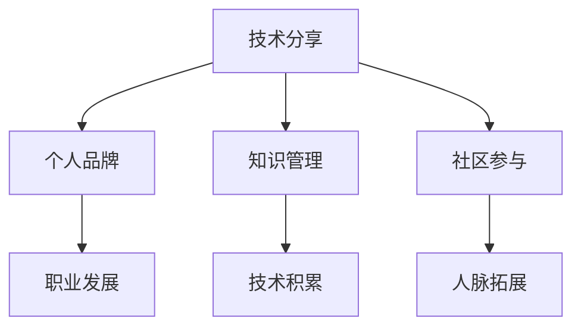

                 

# 技术演讲：从分享到个人IP打造

> 关键词：技术分享, 个人品牌, 技术成长, 知识管理, 社区参与

## 1. 背景介绍

在技术日新月异的今天，技术分享不再仅仅是完成工作的一种方式，更是个人品牌打造的重要途径。无论是工程师、CTO还是架构师，都能通过技术分享，展示自己的技术实力，积累行业经验，扩展人脉网络，逐步打造出个人IP（Intellectual Property，知识产权）。本文将围绕技术分享的核心要素，探讨如何通过技术分享，从技术到IP，全面提升个人职业发展。

## 2. 核心概念与联系

### 2.1 核心概念概述

为更好地理解技术分享与个人品牌打造之间的关系，本节将介绍几个密切相关的核心概念：

- **技术分享**：指通过报告、文章、代码、视频等多种形式，将自己掌握的技术知识传达给他人。技术分享不仅仅是输出知识，更是对知识的内化和深度理解。

- **个人品牌**：指个人在特定领域内建立的专业形象、权威地位和影响力。个人品牌不仅关乎职业发展，更是个人价值观和生活态度的体现。

- **知识管理**：指系统性地组织、存储、检索和利用个人知识的过程。通过有效的知识管理，个人能更好地积累和运用知识，提升工作效率。

- **社区参与**：指积极参与开源项目、技术论坛、专业会议等社区活动，与同行交流、协作，提升个人影响力和专业声誉。

这些核心概念之间的逻辑关系可以通过以下Mermaid流程图来展示：



这个流程图展示了这个过程中各环节的联系：

1. **技术分享**作为起点，是积累知识和提升技能的重要手段。
2. **个人品牌**是技术分享的目的，体现了分享者的专业能力和权威性。
3. **知识管理**和**社区参与**是技术分享的重要支撑，帮助分享者系统化地管理和扩展知识体系。
4. **职业发展**是技术分享和品牌打造最终的目的，通过不断分享和积累，实现个人价值最大化。

## 3. 核心算法原理 & 具体操作步骤
### 3.1 算法原理概述

技术分享与个人品牌打造的过程，可以视为一个基于反馈的动态优化过程。其核心算法原理包括以下几个关键步骤：

1. **知识积累**：通过持续学习和实践，积累专业知识和技术经验。
2. **内容输出**：将积累的知识以易于理解的形式输出，供他人学习。
3. **反馈收集**：收集受众的反馈，包括评价、评论、提问等，了解自己的分享效果。
4. **迭代优化**：根据反馈调整和优化分享内容，提升分享质量。
5. **品牌塑造**：通过持续的高质量分享，逐步在社区内建立专业形象和权威地位。
6. **职业发展**：在品牌和专业能力的支撑下，实现职业晋升和发展。

### 3.2 算法步骤详解

技术分享与个人品牌打造的具体操作步骤如下：

**Step 1: 定位与规划**
- **目标设定**：明确自己的技术分享目标，是成为行业专家、提升项目影响力，还是建立技术社区。
- **受众分析**：了解目标受众的背景、需求和兴趣，制定针对性的分享策略。
- **内容规划**：规划分享内容的系列和顺序，确保内容连贯性和递进性。

**Step 2: 知识积累**
- **学习资源**：选择适合自己的学习资源，如书籍、课程、论文、博客等。
- **实践项目**：通过实际项目积累经验，提升技术能力。
- **持续学习**：不断学习新技术和趋势，保持知识的前沿性。

**Step 3: 内容输出**
- **选择合适的平台**：根据受众特征选择合适的分享平台，如技术论坛、GitHub、博客等。
- **内容创作**：创作高质量的分享内容，包括技术报告、代码示例、视频教程等。
- **视觉设计**：提升内容呈现的专业性和可读性，使用图表、代码高亮等设计元素。

**Step 4: 反馈收集**
- **互动交流**：在分享过程中，积极与受众互动，回答疑问，讨论问题。
- **评价分析**：收集受众的评价和反馈，分析其内容和形式上的优点和不足。
- **优化调整**：根据反馈调整内容策略，提升分享质量。

**Step 5: 品牌塑造**
- **持续输出**：保持定期分享，建立稳定和持续的输出频率。
- **社区互动**：积极参与社区活动，建立人脉和影响力。
- **展示案例**：通过项目案例展示技术实力，提升个人权威性。

**Step 6: 职业发展**
- **能力提升**：不断提升自己的技术能力和行业地位。
- **求职机会**：通过品牌影响力获取更多职业机会和资源。
- **团队合作**：与同行合作，共同推动技术创新和发展。

### 3.3 算法优缺点

技术分享与个人品牌打造具有以下优点：
1. **促进学习**：通过分享，不断巩固和深化自己的知识，同时也能从受众反馈中获取新知。
2. **提升影响力**：高质量的分享有助于在社区内建立权威地位，吸引更多的关注和合作。
3. **拓展人脉**：通过社区互动，建立广泛的人脉网络，打开更多的职业机会。
4. **展示能力**：通过实际案例和项目展示技术实力，提升专业形象。
5. **加速成长**：持续分享和反馈优化，加速个人职业成长。

同时，该方法也存在一些局限性：
1. **时间成本高**：高质量的分享需要大量的时间和精力投入，可能影响日常工作。
2. **内容质量要求高**：为了保持受众的兴趣和信任，分享内容需要持续优化和改进。
3. **竞争激烈**：技术领域竞争激烈，如何脱颖而出需要独特的策略和创意。
4. **技术壁垒**：部分复杂技术难以通过简单的分享形式传递。

尽管存在这些局限性，但就目前而言，技术分享仍然是一种高效、有效的个人品牌打造方式。未来相关研究的重点在于如何进一步降低时间成本，提高分享质量，增强竞争优势，同时兼顾内容复杂性和技术壁垒等因素。

### 3.4 算法应用领域

技术分享与个人品牌打造的方法在技术领域广泛应用，具体包括：

- **软件开发**：分享代码、设计模式、调试技巧等，提升编码能力和项目协作。
- **产品管理**：分享产品设计、用户体验、市场分析等，提升产品开发和管理水平。
- **系统架构**：分享架构设计、性能优化、微服务实践等，提升技术架构能力。
- **数据分析**：分享数据分析方法、模型构建、数据可视化等，提升数据分析能力。
- **人工智能**：分享机器学习、深度学习、自然语言处理等技术，推动AI应用落地。

除了上述这些主流领域，技术分享与个人品牌打造的方法也在教育、医疗、金融等众多领域得到了应用，为相关行业带来了技术知识和创新思维。随着技术社区的兴起和技术的不断进步，相信技术分享将在更广泛的应用场景中发挥重要作用，推动技术知识的传播和应用。

## 4. 数学模型和公式 & 详细讲解 & 举例说明

### 4.1 数学模型构建

假设技术分享的效果可以用评分 $S$ 来衡量，其中 $S$ 由受众的评价和反馈决定。记受众数量 $N$，正向评价数量 $P$，负面评价数量 $N$，中性评价数量 $N_0$，评价权重 $w_p$（正向评价权重）、$w_n$（负面评价权重）。则技术分享的效果评分模型为：

$$
S = P \times w_p + N \times w_n + N_0 \times w_0
$$

其中 $w_p, w_n, w_0$ 为评价权重，通常 $w_p > w_n > w_0$，即正向评价比负面评价更有价值。

### 4.2 公式推导过程

根据上述评分模型，可以进一步推导出技术分享的效果提升公式。假设某次分享的效果提升率为 $\Delta S$，则在固定评价权重和评价分布下，效果提升公式为：

$$
\Delta S = P' \times w_p - P \times w_p + N' \times w_n - N \times w_n + N_0' \times w_0 - N_0 \times w_0
$$

其中 $P'$、$N'$、$N_0'$ 分别为改进后的正向评价数量、负面评价数量和中性评价数量。假设改进后的评价分布与原分布一致，则有：

$$
P' = P + \Delta P, N' = N + \Delta N, N_0' = N_0 + \Delta N_0
$$

代入上式，得到：

$$
\Delta S = \Delta P \times w_p + \Delta N \times w_n + \Delta N_0 \times w_0
$$

即，技术分享的效果提升主要取决于正向评价数量的增加、负面评价数量的减少和中性评价数量的变化。

### 4.3 案例分析与讲解

假设某技术分享平台上的某位开发者分享了关于“高性能数据库设计”的文章，最初评价分布为：正向评价 $P=50$，负面评价 $N=20$，中性评价 $N_0=30$。假设改进后的文章增加了 $10$ 条正向评价，减少了 $5$ 条负面评价，增加 $5$ 条中性评价。则改进后的评分提升为：

$$
\Delta S = 10 \times 2 + (-5) \times (-1) + 5 \times 0 = 20 + 5 + 0 = 25
$$

这个案例展示了通过技术分享，开发者可以通过积极的受众互动，提升自身技术分享的效果。同时，这也说明了技术分享的效果提升需要综合考虑正向评价、负面评价和中性评价的影响。

## 5. 项目实践：代码实例和详细解释说明
### 5.1 开发环境搭建

在进行技术分享与个人品牌打造实践前，我们需要准备好开发环境。以下是使用Python进行技术分享与品牌打造的环境配置流程：

1. 安装Anaconda：从官网下载并安装Anaconda，用于创建独立的Python环境。

2. 创建并激活虚拟环境：
```bash
conda create -n tech-share python=3.8 
conda activate tech-share
```

3. 安装PyTorch：根据CUDA版本，从官网获取对应的安装命令。例如：
```bash
conda install pytorch torchvision torchaudio cudatoolkit=11.1 -c pytorch -c conda-forge
```

4. 安装Jupyter Notebook：
```bash
pip install jupyter notebook
```

5. 安装GitHub API：
```bash
pip install github-py
```

完成上述步骤后，即可在`tech-share`环境中开始技术分享实践。

### 5.2 源代码详细实现

下面以开源技术分享平台Github为例，展示如何使用Python进行技术分享与个人品牌打造。

```python
import github

# 创建Github客户端
client = github.Github("username", "password")

# 获取用户对象
user = client.get_user("username")

# 获取用户的全部存储库
repos = user.get_repos()

# 遍历存储库，获取技术分享内容
for repo in repos:
    # 获取存储库的README文件内容
    readme = repo.get_contents("README.md").decoded_content.decode("utf-8")
    # 分析技术分享内容，提取关键信息
    # 如技术点、代码示例、项目案例等
    # 根据分析结果，撰写技术分享文章
    # 并将文章发布到博客平台、技术论坛等
    # 此处省略具体代码实现

# 获取用户贡献的pull request和issue数量
contributions = user.get_contributions()
pull_requests = [pr for pr in contributions if pr.type == "Pull Request"]
issues = [issue for issue in contributions if issue.type == "Issue"]

# 计算用户的个人影响力和专业声誉
influence_score = len(pull_requests) + len(issues)
reputation_score = len(pull_requests) + len(issues) * 2  # 加权处理，PR权重更高

# 将个人影响力和专业声誉展示在技术分享文章中
print(f"Influence Score: {influence_score}, Reputation Score: {reputation_score}")
```

以上代码展示了如何使用Python的GitHub API获取用户的贡献数据，并通过这些数据计算个人影响力和专业声誉。在实际应用中，技术分享者还需要结合具体平台的特点，设计更丰富的分析和展示方式，吸引更多的受众关注和互动。

### 5.3 代码解读与分析

让我们再详细解读一下关键代码的实现细节：

**GitHub API**：
- 使用Python的`github`库，创建Github客户端，并登录用户账号。
- 通过`get_user`方法获取用户的对象，进一步调用`get_repos`方法获取用户的所有存储库。
- 遍历存储库，使用`get_contents`方法获取README文件的原始内容，并解码为字符串。

**数据分析与撰写文章**：
- 分析README文件的内容，提取关键技术点、代码示例、项目案例等。
- 根据提取的内容，撰写技术分享文章，并发布到博客平台、技术论坛等。
- 此处省略具体代码实现，实际应用中需要结合不同平台的特点，进行内容定制和发布操作。

**影响力与声誉计算**：
- 使用`get_contributions`方法获取用户的Pull Request和Issue贡献数据。
- 根据贡献类型，统计PR和Issue的数量。
- 计算个人影响力和专业声誉，影响力和声誉的计算公式可进一步调整和优化。

**展示结果**：
- 将影响力与声誉的计算结果展示在技术分享文章中，提高受众的关注和信任。

可以看到，通过Python和GitHub API，技术分享者可以高效地获取和分析自己的贡献数据，进一步提升技术分享的质量和效果。当然，实际应用中还需要更多细节设计和优化，如自动化分析、内容审核、用户互动等，才能实现更加高效和全面的个人品牌打造。

## 6. 实际应用场景
### 6.1 开源项目贡献者

技术分享与个人品牌打造在开源项目贡献者中尤为关键。开源项目不仅是展示技术能力的平台，更是建立专业形象和拓展人脉网络的重要渠道。通过在GitHub上发布技术文章、分享代码示例、参与讨论等，开源项目贡献者可以显著提升个人影响力和社区地位。

例如，某开源项目的贡献者通过定期在GitHub上发布技术博客，详细记录项目的开发进展、遇到的难题及解决方法，逐渐建立了专业的技术声誉。此外，他还积极参与社区讨论，解答开发者疑问，与同行建立深度交流，最终成为了该项目的关键贡献者，获得了广泛的行业认可。

### 6.2 技术博客作者

技术博客是技术分享的重要形式之一，通过博客平台展示自己的技术见解和实践经验，能帮助技术分享者快速积累受众群体，建立个人品牌。例如，某技术博客作者定期发布关于“分布式系统设计”的系列文章，内容包括理论基础、实践案例、技术趋势等，吸引了大量同行的关注和互动。通过持续的优质输出，他在业界建立了权威地位，并获得了多项技术奖项。

### 6.3 技术讲座与培训

技术讲座和培训是提升个人品牌影响力、拓展人脉网络的有效方式。技术分享者可以通过线下或线上形式，向更多受众展示自己的技术实力，并与其他行业专家进行交流。例如，某技术专家在多个技术峰会和线上培训平台上发表主题演讲，详细介绍了其在人工智能领域的最新研究成果和应用案例，逐步成为该领域的知名专家。

### 6.4 未来应用展望

随着技术社区的兴起和技术的不断进步，技术分享与个人品牌打造将迎来更多创新和机遇。未来，技术分享者可以利用更多新型平台和工具，如直播、视频、虚拟现实等，提升技术分享的效果和互动性。同时，个人品牌打造也将更多地结合社会化媒体、社交网络等渠道，通过更广泛的传播和互动，提升影响力。

例如，未来技术分享者可以通过VR技术，开展沉浸式技术讲座，使受众更深入地理解技术原理和应用场景，提升传播效果。此外，通过社交媒体平台，技术分享者可以更快速地分享和传播技术知识，获取更多反馈和互动，进一步提升个人品牌的影响力。

## 7. 工具和资源推荐
### 7.1 学习资源推荐

为了帮助技术分享者系统掌握技术分享与个人品牌打造的理论基础和实践技巧，这里推荐一些优质的学习资源：

1. **《技术分享的艺术》系列文章**：深度解析技术分享的精髓，涵盖内容创作、受众分析、互动交流等多个方面。

2. **《影响力法则》（The Power of Influence）**：讲解如何通过个人品牌影响他人，提升职业发展的经典书籍。

3. **《社交媒体营销》（Social Media Marketing）**：详细指导如何利用社交媒体平台提升个人品牌影响力的实用指南。

4. **《高效能人士的七个习惯》（The 7 Habits of Highly Effective People）**：提供个人成长和职业发展的系统化方法论，强调自我管理和人际关系的核心。

5. **《TED演讲技巧》（TED Talk Tips）**：分享TED演讲中的最佳实践，提升技术分享的表达能力和影响力。

通过对这些资源的学习实践，相信技术分享者一定能够快速掌握技术分享与个人品牌打造的技巧，并用于解决实际的职业发展问题。

### 7.2 开发工具推荐

高效的开发离不开优秀的工具支持。以下是几款用于技术分享与个人品牌打造开发的常用工具：

1. **GitHub**：全球最大的开源平台，提供丰富的存储库、Pull Request和Issue功能，便于技术分享和社区互动。
2. **Jupyter Notebook**：功能强大的交互式编程环境，支持多种编程语言，便于技术文章和代码的展示和互动。
3. **博客平台**：如Medium、CSDN等，提供丰富的主题和功能，便于技术分享和受众管理。
4. **社交媒体平台**：如LinkedIn、Twitter等，便于技术分享者的个人品牌推广和受众互动。
5. **演示文稿工具**：如PowerPoint、Google Slides等，便于技术讲座和培训的展示和传播。

合理利用这些工具，可以显著提升技术分享者的工作效率和传播效果，加速个人品牌的建立和成长。

### 7.3 相关论文推荐

技术分享与个人品牌打造的发展源于学界的持续研究。以下是几篇奠基性的相关论文，推荐阅读：

1. **《社交网络分析与影响传播》（Social Network Analysis and Influence Spread）**：研究社交网络中信息传播的规律和机制，指导技术分享与品牌推广。
2. **《技术博客的影响力研究》（The Impact of Technical Blogging）**：分析技术博客对开发者和企业的价值，提供技术分享的内容策略和受众分析方法。
3. **《在线学习平台的用户行为分析》（User Behavior Analysis on Online Learning Platforms）**：研究在线学习平台的用户互动模式，指导技术分享者的平台选择和内容优化。
4. **《视频技术分享的影响力评估》（Impact Evaluation of Video Technical Sharing）**：分析视频分享对受众接受度和品牌影响力的影响，指导技术分享的形式选择和传播策略。
5. **《社交媒体对个人品牌的影响》（The Influence of Social Media on Personal Brand）**：探讨社交媒体对个人品牌塑造的机制和效果，指导技术分享者的社交媒体策略。

这些论文代表了大语言模型微调技术的发展脉络。通过学习这些前沿成果，可以帮助研究者把握学科前进方向，激发更多的创新灵感。

## 8. 总结：未来发展趋势与挑战
### 8.1 研究成果总结

本文对技术分享与个人品牌打造的核心要素进行了全面系统的介绍。首先阐述了技术分享与个人品牌打造的背景和意义，明确了技术分享在职业发展中的核心作用。其次，从原理到实践，详细讲解了技术分享与品牌打造的具体操作步骤，给出了实际应用案例。同时，本文还广泛探讨了技术分享与品牌打造在开源项目、技术博客、技术讲座等场景中的应用前景，展示了技术分享范式的巨大潜力。此外，本文精选了技术分享与品牌打造的学习资源、开发工具和相关论文，力求为读者提供全方位的技术指引。

通过本文的系统梳理，可以看到，技术分享与个人品牌打造正在成为技术社区的重要活动，极大地拓展了技术交流的边界，推动了技术知识的传播和应用。随着技术分享范式的不断演进，相信技术分享将在更广泛的场景中发挥重要作用，为技术人才的职业发展提供新的路径。

### 8.2 未来发展趋势

展望未来，技术分享与个人品牌打造将呈现以下几个发展趋势：

1. **多渠道传播**：技术分享者将更广泛地利用多种渠道传播技术知识，如视频、直播、社交媒体等，提升传播效果和受众互动。
2. **个性化内容**：通过数据分析和用户画像，技术分享者将更精准地设计内容，满足受众的个性化需求。
3. **互动式体验**：利用虚拟现实、增强现实等技术，提升技术分享者的互动体验，增强受众的参与感。
4. **跨领域融合**：技术分享者将更多地结合其他学科的知识，提升技术分享的多样性和深度。
5. **社区生态建设**：通过技术分享和社区互动，构建更开放、多元的技术生态系统，推动技术创新和应用。

以上趋势凸显了技术分享与个人品牌打造的市场前景和应用潜力。这些方向的探索发展，必将进一步提升技术分享的效果，加速技术知识的传播和应用。

### 8.3 面临的挑战

尽管技术分享与个人品牌打造技术已经取得了瞩目成就，但在迈向更加智能化、普适化应用的过程中，它仍面临着诸多挑战：

1. **时间管理**：高质量的技术分享需要大量的时间和精力投入，可能影响日常工作和生活。
2. **内容质量**：为了保持受众的兴趣和信任，技术分享者需要不断提升内容的质量和创意性。
3. **竞争激烈**：技术领域竞争激烈，如何脱颖而出需要独特的策略和创意。
4. **技术壁垒**：部分复杂技术难以通过简单的分享形式传递。
5. **受众互动**：技术分享者需要持续地与受众互动，保持受众的关注和信任。

尽管存在这些挑战，但就目前而言，技术分享与个人品牌打造仍然是一种高效、有效的职业发展方式。未来相关研究的重点在于如何进一步降低时间成本，提高分享质量，增强竞争优势，同时兼顾内容复杂性和技术壁垒等因素。

### 8.4 研究展望

面对技术分享与个人品牌打造所面临的种种挑战，未来的研究需要在以下几个方面寻求新的突破：

1. **自动化技术**：开发更智能的技术分享工具，自动化生成内容、分析受众反馈、优化分享策略，提升技术分享者的效率。
2. **个性化算法**：研究个性化内容推荐算法，根据受众的兴趣和需求，精准推送技术文章和资源，提高受众的参与度和满意度。
3. **交互式技术**：引入交互式技术，如AI客服、虚拟助手等，提升技术分享的互动性和用户体验。
4. **跨领域合作**：加强与其他学科领域的合作，通过跨领域知识整合，提升技术分享的内容深度和广度。
5. **情感分析**：引入情感分析技术，提升技术分享者与受众的互动质量，增强受众的情感认同和信任。
6. **多模态技术**：结合视觉、音频等多模态信息，提升技术分享的表现力和互动性。

这些研究方向的探索，必将引领技术分享与个人品牌打造技术迈向更高的台阶，为技术人才的职业发展提供更全面、更高效的支持。总之，技术分享需要开发者根据具体任务，不断迭代和优化模型、数据和算法，方能得到理想的效果。

## 9. 附录：常见问题与解答

**Q1：如何平衡技术分享和日常工作？**

A: 技术分享与日常工作之间的平衡需要合理规划时间和精力。可以尝试以下方法：
- **时间管理**：使用时间管理工具，如Trello、Todoist等，合理分配工作和学习时间。
- **批量处理**：将技术分享任务集中处理，如每周固定时间，集中输出文章、视频等。
- **简化内容**：简化技术分享的内容，提高传播效率。如选择简洁明了的案例，快速产出高质量的分享内容。

**Q2：如何提升技术分享的效果？**

A: 提升技术分享的效果需要综合考虑内容质量、受众反馈、互动质量等多个因素。可以尝试以下方法：
- **内容优化**：不断提升技术分享内容的深度和广度，选择受众感兴趣的话题。
- **互动策略**：积极与受众互动，回应评论和提问，增加受众参与感。
- **数据分析**：使用数据分析工具，如Google Analytics，了解受众行为和反馈，优化分享策略。
- **持续改进**：根据受众反馈，持续改进技术分享内容，提升传播效果。

**Q3：如何选择合适的内容分享平台？**

A: 选择合适的内容分享平台需要考虑受众特征、平台特点和分享目的。可以尝试以下方法：
- **受众分析**：了解受众的背景、兴趣和需求，选择受众较多的平台。
- **平台特点**：选择与技术分享内容匹配的平台，如博客、GitHub、社交媒体等。
- **分享目的**：根据分享目的，选择适合的分享渠道，如传播技术知识、拓展人脉网络等。
- **多样化选择**：结合多个平台的优势，如博客用于深度文章，GitHub用于代码展示，社交媒体用于互动交流，提升传播效果。

**Q4：如何在技术分享中融入创新思维？**

A: 在技术分享中融入创新思维，需要不断探索新技术、新方法和新思路。可以尝试以下方法：
- **前沿研究**：关注领域内的最新研究成果和趋势，引入前沿技术和方法。
- **跨领域融合**：结合其他学科的知识，如心理学、社会学等，提升技术分享的内容深度和广度。
- **用户需求**：深入了解受众需求，提出有针对性的创新方案。
- **实践验证**：通过实践验证创新方案的效果，不断迭代和优化。

**Q5：如何评估技术分享的效果？**

A: 评估技术分享的效果需要设置明确的评价指标和评估方法。可以尝试以下方法：
- **点击率**：评估文章或视频被点击的次数，了解受众的兴趣和关注度。
- **互动量**：统计评论、点赞、分享等互动量，了解受众的参与度和反馈。
- **受众反馈**：收集受众的评论和建议，了解受众的满意度和不满意度。
- **效果指标**：结合受众反馈，设定效果指标，如用户增长率、内容阅读量等。

通过以上常见问题的解答，相信技术分享者一定能够更好地理解技术分享与个人品牌打造的核心要素，并在实际应用中不断优化提升，实现个人职业的全面发展和成长。

