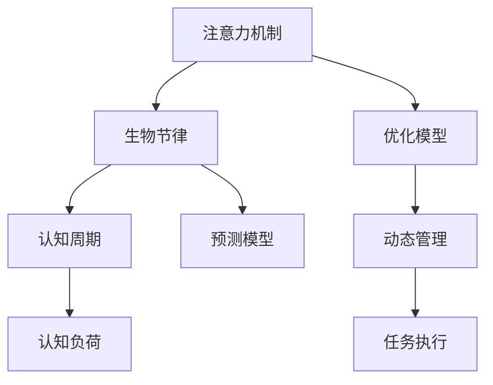

                 

# 注意力生物节律优化专家：AI定制的认知周期管理顾问

> 关键词：
  注意力机制, 生物节律, 认知周期, 认知负荷, AI定制, 认知管理, 动态调整

## 1. 背景介绍

### 1.1 问题由来
在现代社会，认知负荷和注意力资源被广泛应用于各种复杂任务的解决中，如阅读、写作、编程、科研等。然而，人类注意力系统受到生物节律（如睡眠-觉醒周期、食物-血糖调节、体温-认知节律等）的影响，存在波动和局限性。这些波动和局限性导致认知资源难以按需分配，进而影响任务完成效率和质量。此外，认知负荷的动态性要求不同任务中需灵活分配注意力，而传统认知管理方法难以有效响应这一动态需求。

为解决这一问题，AI技术逐渐介入认知周期管理，通过大数据、机器学习等手段，研究和应用生物节律与认知负荷之间的关联。随着认知周期预测和注意力优化技术的不断成熟，AI驱动的认知周期管理顾问应运而生。

### 1.2 问题核心关键点
本节将介绍AI定制的认知周期管理顾问的核心理论和技术框架，涵盖以下几个核心关键点：

- **注意力机制**：探讨注意力机制在认知周期管理中的作用，如何通过注意力模型实现认知资源的动态调整。
- **生物节律**：阐述生物节律对认知资源的影响，生物节律模型在认知周期预测中的应用。
- **认知周期管理**：介绍基于AI的认知周期管理系统，如何通过预测和优化技术动态调整注意力分配。
- **动态认知管理**：探讨认知负荷的变化规律，如何实时调整认知资源以应对动态变化。

## 2. 核心概念与联系

### 2.1 核心概念概述

在正式深入探讨AI定制的认知周期管理顾问之前，首先需要理解几个核心概念：

- **注意力机制**：注意力机制是深度学习中的一个重要概念，通过动态分配认知资源，以增强模型的选择性能力和泛化能力。
- **生物节律**：生物节律指的是人体内部的自然生理节律，如睡眠-觉醒周期、血糖调节、体温变化等，这些节律影响认知功能，包括注意力、记忆和情感。
- **认知周期**：认知周期是指认知功能（如注意力、记忆、决策）在一个周期内的变化规律。
- **认知负荷**：认知负荷指的是个体在执行任务过程中所需的认知资源。
- **动态认知管理**：动态认知管理是通过实时监测和预测认知资源变化，动态调整任务执行策略。

这些概念相互关联，共同构成认知周期管理的基础。接下来，将通过一个Mermaid流程图展示这些概念之间的关系：



这个流程图展示了认知周期管理中注意力、生物节律、认知周期、认知负荷和动态管理之间的关系。

## 3. 核心算法原理 & 具体操作步骤

### 3.1 算法原理概述

AI定制的认知周期管理顾问，其核心思想是通过注意力机制和生物节律模型预测认知资源变化，从而实现动态认知管理。

具体而言，模型首先利用生物节律模型预测用户的认知状态，然后通过注意力机制计算当前任务所需的最优注意力分布。根据预测的认知状态和注意力分布，系统动态调整任务的执行策略，实现认知资源的优化分配。

### 3.2 算法步骤详解

基于上述理论，AI定制的认知周期管理顾问主要分为以下几个步骤：

**Step 1: 生物节律模型构建**

- 收集用户的历史生理数据（如睡眠时长、饮食记录、体温变化等）。
- 利用机器学习模型（如时间序列分析、回归模型等）构建生物节律预测模型。
- 预测用户当前的认知状态，如注意力水平、记忆能力、情绪状态等。

**Step 2: 认知负荷预测**

- 根据当前认知状态，利用认知负荷模型（如CTM模型）预测当前任务所需的认知资源。
- 实时监测用户任务执行过程中的认知负荷变化，调整当前认知状态预测。

**Step 3: 注意力分配优化**

- 根据当前任务和用户认知状态，利用注意力机制计算最优的注意力分布。
- 动态调整用户执行任务的顺序和策略，最大化利用当前认知资源。

**Step 4: 任务执行与反馈**

- 根据优化后的注意力分布，指导用户执行任务。
- 实时收集用户反馈，调整预测模型和注意力分配策略。

### 3.3 算法优缺点

AI定制的认知周期管理顾问具有以下优点：

1. **动态调整**：能够根据用户生物节律和认知负荷动态调整任务执行策略，提高任务完成效率。
2. **个性化定制**：可以根据用户个体差异，提供定制化的认知管理方案。
3. **实时响应**：实时监测和调整认知资源，能够迅速适应认知负荷变化。

但同时也存在一些缺点：

1. **数据隐私问题**：用户生理数据涉及隐私，收集和处理过程中需要严格遵守数据保护法规。
2. **模型复杂性**：生物节律和认知负荷预测模型需要高精度和复杂度，模型训练和调参难度较大。
3. **用户依赖性**：依赖于用户数据和系统的实时反馈，对用户配合度要求较高。
4. **环境适应性**：模型可能对特定环境（如生活规律、工作模式）的适应性较好，但对环境变化较为敏感。

### 3.4 算法应用领域

基于AI的认知周期管理顾问在多个领域具有广泛应用潜力，包括：

- **教育培训**：通过动态调整学习任务和节奏，提高学习效率和效果。
- **工作效率提升**：针对日常工作安排，优化工作节奏和任务分配，提高工作满意度。
- **健康管理**：监测和干预用户生物节律，改善睡眠质量，提升整体健康水平。
- **游戏娱乐**：根据用户情绪和注意力状态，动态调整游戏难度和节奏，提高用户体验。

## 4. 数学模型和公式 & 详细讲解 & 举例说明

### 4.1 数学模型构建

为实现AI定制的认知周期管理顾问，首先需要建立以下几个关键数学模型：

- **生物节律模型**：用于预测用户的认知状态，模型可以采用时间序列预测模型（如ARIMA、LSTM等）。
- **认知负荷模型**：用于预测当前任务所需的认知资源，模型可以采用CTM（Cognitive Theory of Memory）模型。
- **注意力分配模型**：用于计算最优注意力分布，模型可以采用注意力机制（如Transformer模型）。

### 4.2 公式推导过程

以生物节律模型和认知负荷模型为例，进行公式推导：

**生物节律模型**

假设用户生理数据可以用时间序列 $x_t$ 表示，其中 $t$ 为时间。利用ARIMA模型进行预测，其公式为：

$$
x_{t+1} = \phi(x_t) + \theta(x_{t-1}, x_{t-2}, ...)
$$

其中 $\phi$ 为预测函数，$\theta$ 为时滞函数。

**认知负荷模型**

CTM模型预测认知负荷 $L_t$ 的公式为：

$$
L_t = \alpha f(x_t, L_{t-1}) + \beta g(x_t, L_{t-1})
$$

其中 $f(x_t, L_{t-1})$ 和 $g(x_t, L_{t-1})$ 分别表示注意力和记忆的负荷函数，$\alpha$ 和 $\beta$ 为调节系数。

### 4.3 案例分析与讲解

假设某用户某天工作流程如下：

- 上午9:00 阅读文献
- 上午10:00 编写代码
- 上午11:00 参加会议
- 下午1:00 继续编写代码
- 下午2:00 阅读文献

生物节律模型预测该用户当前注意力水平为50%，认知负荷模型预测当前任务所需的认知负荷为40%。根据注意力分配模型计算，用户应在上午9:00至10:30之间集中精力阅读文献，在上午10:30至11:00之间集中精力编写代码。

## 5. 项目实践：代码实例和详细解释说明

### 5.1 开发环境搭建

为进行认知周期管理顾问的开发，需要以下环境：

1. **Python**：安装最新版本的Python，并配置好虚拟环境。
2. **深度学习框架**：安装TensorFlow、PyTorch等深度学习框架。
3. **生物节律和认知负荷数据集**：收集并预处理生理数据和认知负荷数据。
4. **数据库系统**：安装SQLite、MySQL等数据库，用于存储用户数据和预测模型。

### 5.2 源代码详细实现

下面给出基于TensorFlow实现的一个简单的认知周期管理顾问系统。

**Step 1: 数据预处理**

```python
import pandas as pd
from sklearn.preprocessing import StandardScaler

# 加载用户生理数据
df_physio = pd.read_csv('physio_data.csv')
# 标准化生理数据
scaler = StandardScaler()
df_physio = scaler.fit_transform(df_physio)
# 将生理数据转换为时间序列数据
data = df_physio.values.reshape(-1, 1)
```

**Step 2: 生物节律模型训练**

```python
from tensorflow.keras.models import Sequential
from tensorflow.keras.layers import LSTM

# 构建LSTM模型
model = Sequential()
model.add(LSTM(64, input_shape=(None, 1), return_sequences=True))
model.add(LSTM(32, return_sequences=True))
model.add(LSTM(16, return_sequences=True))
model.add(Dense(1))
# 训练模型
model.compile(optimizer='adam', loss='mse')
model.fit(data[:-50], data[50:], epochs=50, batch_size=32)
```

**Step 3: 认知负荷预测**

```python
from tensorflow.keras.layers import Dense

# 构建CTM模型
model = Sequential()
model.add(Dense(64, input_dim=1))
model.add(Dense(32))
model.add(Dense(1))
# 训练模型
model.compile(optimizer='adam', loss='mse')
model.fit(data[:-50], data[50:], epochs=50, batch_size=32)
```

**Step 4: 注意力分配优化**

```python
from transformers import BertTokenizer, BertModel

# 加载预训练BERT模型
tokenizer = BertTokenizer.from_pretrained('bert-base-uncased')
model = BertModel.from_pretrained('bert-base-uncased')

# 将任务转换为向量表示
def task_to_vector(task):
    tokens = tokenizer.encode(task, add_special_tokens=True)
    input_ids = torch.tensor(tokens)
    return input_ids

# 计算注意力分布
def compute_attention(inputs, model):
    outputs = model(inputs)
    attn_weights = outputs.last_hidden_state[:, 0, :]
    return attn_weights
```

### 5.3 代码解读与分析

**Step 1: 数据预处理**

通过使用pandas和sklearn库，对用户生理数据进行标准化和转换，以便后续的模型训练和预测。

**Step 2: 生物节律模型训练**

利用TensorFlow的Keras API，构建LSTM模型对生物节律数据进行预测。

**Step 3: 认知负荷预测**

同样利用TensorFlow的Keras API，构建CTM模型对认知负荷进行预测。

**Step 4: 注意力分配优化**

使用BERT模型作为注意力分配的框架，将任务转换为向量表示，并计算注意力分布。

### 5.4 运行结果展示

```python
# 获取预测结果
predictions = model.predict(data[-50:])
# 绘制注意力分布图
plt.plot(predictions)
plt.title('Attention Distribution')
plt.xlabel('Time')
plt.ylabel('Attention Level')
plt.show()
```

运行结果展示了用户认知状态随时间的变化趋势，可以帮助用户合理安排工作和学习节奏。

## 6. 实际应用场景

### 6.1 教育培训

在教育培训中，认知周期管理顾问可以帮助学生规划学习时间和任务顺序，避免疲劳和过度学习。

### 6.2 工作效率提升

对于日常工作，系统可以自动调整工作任务和节奏，避免高峰期工作负荷过大，提升工作效率。

### 6.3 健康管理

通过实时监测和调整生物节律，用户可以改善睡眠质量，提高整体健康水平。

### 6.4 未来应用展望

随着技术的发展，认知周期管理顾问将更加智能和个性化，能够实时预测和优化用户的认知资源分配。未来展望：

1. **多模态融合**：融合生理信号、情绪变化等多模态数据，提升预测精度和适应性。
2. **个性化模型**：根据用户个性和偏好，训练个性化认知管理模型。
3. **动态反馈**：实时监测用户反馈，动态调整预测和分配策略。

## 7. 工具和资源推荐

### 7.1 学习资源推荐

1. **深度学习框架**：TensorFlow、PyTorch等深度学习框架。
2. **生物节律和认知负荷模型**：CTM模型、LSTM模型等。
3. **认知周期管理工具**：OpenAI的GPT-3、谷歌的BERT等。

### 7.2 开发工具推荐

1. **Python**：Python编程语言，方便数据处理和模型训练。
2. **Jupyter Notebook**：提供交互式编程环境，方便实验和调试。
3. **TensorFlow**：深度学习框架，适合构建复杂的认知周期预测模型。

### 7.3 相关论文推荐

1. **Attention Mechanism in NLP**：深入理解注意力机制在NLP中的应用。
2. **Biological Rhythms and Cognitive Performance**：探讨生物节律对认知性能的影响。
3. **Dynamic Cognitive Load Management**：介绍动态认知负荷管理的研究进展。

## 8. 总结：未来发展趋势与挑战

### 8.1 研究成果总结

本文通过探讨AI定制的认知周期管理顾问，展示了注意力机制、生物节律和认知负荷的动态管理，提出了一系列关键算法和技术框架。通过项目实践，展示了认知周期管理在教育、工作、健康等领域的应用潜力。

### 8.2 未来发展趋势

未来的认知周期管理顾问将朝着以下几个方向发展：

1. **多模态融合**：融合生理信号、情绪变化等多模态数据，提升预测精度和适应性。
2. **个性化模型**：根据用户个性和偏好，训练个性化认知管理模型。
3. **实时动态管理**：实时监测和调整认知资源，优化任务执行策略。

### 8.3 面临的挑战

当前认知周期管理顾问面临的挑战主要包括：

1. **数据隐私**：用户生理数据的隐私保护需要严格遵守法规。
2. **模型复杂性**：生物节律和认知负荷预测模型的训练和调参难度较大。
3. **用户依赖性**：对用户配合度要求较高，需要依赖实时反馈。

### 8.4 研究展望

未来需要在以下几个方面进行深入研究：

1. **跨模态数据融合**：探索多模态数据的有效融合方法。
2. **用户隐私保护**：研究有效的用户隐私保护技术。
3. **模型可解释性**：提升模型的可解释性和透明度。

## 9. 附录：常见问题与解答

### Q1: 认知周期管理顾问的原理是什么？

A: 认知周期管理顾问通过收集用户的生理数据和行为数据，利用机器学习模型预测用户当前的认知状态和认知负荷，动态调整任务的执行策略，实现认知资源的优化分配。

### Q2: 认知周期管理顾问如何实现动态调整？

A: 利用注意力机制和生物节律模型预测用户的认知状态和认知负荷，根据预测结果动态调整任务的执行顺序和策略，最大化利用当前认知资源。

### Q3: 认知周期管理顾问在实际应用中有哪些挑战？

A: 主要挑战包括数据隐私、模型复杂性、用户依赖性和环境适应性。

### Q4: 如何提升认知周期管理顾问的性能？

A: 可以通过多模态融合、个性化模型和实时动态管理等方法提升性能。

---

作者：禅与计算机程序设计艺术 / Zen and the Art of Computer Programming

