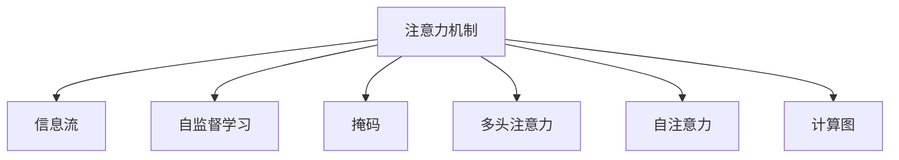

                 

# 注意力的生态系统：AI时代的信息流

> 关键词：注意力机制, 信息流, 深度学习, 神经网络, 优化算法, 自然语言处理, 图像识别

## 1. 背景介绍

### 1.1 问题由来
在深度学习领域，尤其是在自然语言处理(NLP)和计算机视觉(CV)等任务中，注意力机制(Attention Mechanism)已成为核心技术之一。注意力机制能够从海量的数据中筛选出关键信息，使得模型能够更加专注地处理输入，显著提升了模型的性能。然而，由于注意力机制的复杂性和多样性，如何设计、优化和应用注意力模型，成为了一项重要的研究课题。

### 1.2 问题核心关键点
注意力机制的核心在于如何通过模型自适应地分配计算资源，实现对输入数据中不同部分的关注。基于此，本文将详细介绍注意力机制的原理、算法和优化方法，重点讨论其在NLP和CV等领域的实际应用，并通过具体案例展示注意力机制在实际项目中的实践。

## 2. 核心概念与联系

### 2.1 核心概念概述

为更好地理解注意力机制，本节将介绍几个密切相关的核心概念：

- 注意力机制(Attention Mechanism)：一种用于处理序列数据的神经网络模块，能够自适应地分配计算资源，聚焦于输入数据的关键部分，从而提升模型的性能。

- 信息流(Information Flow)：数据在模型中的流动路径和处理顺序。在注意力机制中，信息流通常从输入层开始，通过注意力权重的选择，流向输出层。

- 自监督学习(Self-Supervised Learning)：一种无需人工标注的训练方法，通过模型自身的预测与真实值之间的差异进行反向传播，从而学习模型参数。

- 掩码(掩码)：用于遮盖特定数据或参数的矩阵，常用于实现信息流的多路并行。

- 多头注意力(Multi-Head Attention)：通过并行多个注意力机制，提升模型的泛化能力和表示能力。

- 自注意力(Self-Attention)：一种无监督的注意力机制，通过计算输入自身的相对关系，实现对序列中不同位置的关注。

- 计算图(Computation Graph)：描述模型计算过程的有向无环图，用于指导模型的前向传播和反向传播。

这些核心概念之间的逻辑关系可以通过以下Mermaid流程图来展示：



这个流程图展示了一些与注意力机制密切相关的核心概念及其之间的关系：注意力机制通过信息流传递输入数据，并通过自监督学习和掩码实现对序列的聚焦处理。多头注意力和多头自注意力提升模型的泛化能力和表示能力，而计算图则指导模型的前向传播和反向传播过程。

## 3. 核心算法原理 & 具体操作步骤
### 3.1 算法原理概述

注意力机制的核心思想是通过计算输入数据中各部分的相关性，选择性地关注或忽略某些信息，从而提升模型的性能。在NLP和CV中，注意力机制常用于解决序列数据或图像数据中的信息聚合问题，其基本框架通常包括以下几个步骤：

1. 计算注意力权重：通过计算输入数据中各部分的相关性，得到注意力权重。
2. 加权聚合信息：根据注意力权重，对输入数据进行加权聚合，得到注意力的输出。
3. 多头注意力：将输入数据经过多头注意力模块，得到多个注意力向量，提升模型的表示能力。
4. 优化和训练：通过反向传播算法，最小化模型的预测误差，更新模型参数。

### 3.2 算法步骤详解

以自注意力机制为例，介绍其在NLP中的应用：

#### 3.2.1 输入层

将输入序列 $x$ 转化为模型可处理的向量表示 $X$，通常采用嵌入层(Embedding Layer)将每个单词或字符映射到高维空间。例如，对于输入序列 $x = \{x_i\}_{i=1}^n$，嵌入层的输出为：

$$
X = \{E(x_i)\}_{i=1}^n
$$

其中 $E(\cdot)$ 为嵌入函数。

#### 3.2.2 注意力权重计算

自注意力机制通过计算输入序列中各部分的相对关系，得到注意力权重 $W$。以向量 $q$ 作为查询向量，矩阵 $K$ 和 $V$ 分别作为键和值矩阵，计算注意力权重 $a$ 的公式为：

$$
a_{ij} = \frac{\exp(\text{scores}(i,j))}{\sum_{k=1}^n \exp(\text{scores}(k,j))}
$$

其中 $\text{scores}(i,j) = q_i \cdot K_j$，$K_j$ 和 $V_j$ 分别为矩阵 $K$ 和 $V$ 的第 $j$ 列。

#### 3.2.3 加权聚合信息

根据注意力权重 $a$，对输入序列进行加权聚合，得到注意力输出 $z$：

$$
z = \sum_{j=1}^n a_{ij}V_j
$$

#### 3.2.4 多头注意力

为提升模型的表示能力，通常将输入序列 $x$ 通过多头注意力模块，得到多个注意力向量 $z_1, z_2, ..., z_h$，其中 $h$ 为注意力头的数量。例如：

$$
z_1 = \text{Multi-Head Attention}(X, K_1, V_1)
$$
$$
z_2 = \text{Multi-Head Attention}(X, K_2, V_2)
$$
$$
... 
$$

#### 3.2.5 优化和训练

通过反向传播算法，最小化模型的预测误差，更新模型参数。常见的优化算法包括Adam、SGD等，通常使用交叉熵损失函数。

### 3.3 算法优缺点

自注意力机制具有以下优点：

1. 能够自适应地选择重要信息，提升模型对输入序列的关注能力。
2. 可以通过多头注意力提升模型的泛化能力和表示能力。
3. 在处理长序列数据时，计算复杂度较低。

但同时也存在一些缺点：

1. 对于高维输入数据，计算量和内存消耗较大。
2. 对数据中的噪声敏感，容易产生错误。
3. 在序列较长时，容易出现梯度消失或梯度爆炸的问题。

### 3.4 算法应用领域

自注意力机制在NLP和CV中有着广泛的应用：

- 在NLP中，自注意力机制常用于机器翻译、文本分类、问答系统等任务。
- 在CV中，自注意力机制常用于图像分类、目标检测、语义分割等任务。

此外，自注意力机制还可以与其他模型结构结合，如Transformer结构，在自然语言处理领域中取得了非常好的效果。

## 4. 数学模型和公式 & 详细讲解 & 举例说明

### 4.1 数学模型构建

在NLP中，假设输入序列 $x = \{x_i\}_{i=1}^n$，其中 $x_i$ 为单词或字符的嵌入向量，输入序列的嵌入表示为 $X = \{E(x_i)\}_{i=1}^n$。

#### 4.1.1 自注意力计算

假设输入序列 $X$ 经过嵌入层后，得到嵌入表示 $X \in \mathbb{R}^{n\times d}$，其中 $d$ 为嵌入维度。以向量 $q$ 作为查询向量，矩阵 $K$ 和 $V$ 分别作为键和值矩阵，计算注意力权重 $a$ 的公式为：

$$
a_{ij} = \frac{\exp(\text{scores}(i,j))}{\sum_{k=1}^n \exp(\text{scores}(k,j))}
$$

其中 $\text{scores}(i,j) = q_i \cdot K_j$，$K_j$ 和 $V_j$ 分别为矩阵 $K$ 和 $V$ 的第 $j$ 列。

#### 4.1.2 多头注意力计算

通过并行多个注意力头，得到多个注意力向量 $z_1, z_2, ..., z_h$，其中 $h$ 为注意力头的数量。例如：

$$
z_1 = \text{Multi-Head Attention}(X, K_1, V_1)
$$
$$
z_2 = \text{Multi-Head Attention}(X, K_2, V_2)
$$
$$
... 
$$

#### 4.1.3 加权聚合信息

根据注意力权重 $a$，对输入序列进行加权聚合，得到注意力输出 $z$：

$$
z = \sum_{j=1}^n a_{ij}V_j
$$

### 4.2 公式推导过程

以Transformer为例，展示多头自注意力模块的计算过程。假设输入序列 $X$ 经过嵌入层后，得到嵌入表示 $X \in \mathbb{R}^{n\times d}$，其中 $d$ 为嵌入维度。假设 $d$ 和 $d_k$ 分别为嵌入维度和键维，$h$ 为注意力头数量。计算多头自注意力模块的公式为：

$$
Q = XW_Q \in \mathbb{R}^{n\times \frac{d}{h} \times h}
$$
$$
K = XW_K \in \mathbb{R}^{n\times d_k \times h}
$$
$$
V = XW_V \in \mathbb{R}^{n\times d_v \times h}
$$

其中 $W_Q$, $W_K$ 和 $W_V$ 为线性变换矩阵。计算注意力权重 $a$ 的公式为：

$$
a = \frac{\exp(QK^T)}{\sum_{j=1}^n \exp(QK_j^T)}
$$

其中 $K_j^T$ 为矩阵 $K_j$ 的转置。计算注意力输出 $z$ 的公式为：

$$
z = aV
$$

### 4.3 案例分析与讲解

假设输入序列 $x = \{x_i\}_{i=1}^n$，其中 $x_i$ 为单词或字符的嵌入向量，输入序列的嵌入表示为 $X = \{E(x_i)\}_{i=1}^n$。以向量 $q$ 作为查询向量，矩阵 $K$ 和 $V$ 分别作为键和值矩阵，计算注意力权重 $a$ 的公式为：

$$
a_{ij} = \frac{\exp(\text{scores}(i,j))}{\sum_{k=1}^n \exp(\text{scores}(k,j))}
$$

其中 $\text{scores}(i,j) = q_i \cdot K_j$，$K_j$ 和 $V_j$ 分别为矩阵 $K$ 和 $V$ 的第 $j$ 列。

以Transformer模型为例，假设输入序列 $X$ 经过嵌入层后，得到嵌入表示 $X \in \mathbb{R}^{n\times d}$，其中 $d$ 为嵌入维度。假设 $d$ 和 $d_k$ 分别为嵌入维度和键维，$h$ 为注意力头数量。计算多头自注意力模块的公式为：

$$
Q = XW_Q \in \mathbb{R}^{n\times \frac{d}{h} \times h}
$$
$$
K = XW_K \in \mathbb{R}^{n\times d_k \times h}
$$
$$
V = XW_V \in \mathbb{R}^{n\times d_v \times h}
$$

其中 $W_Q$, $W_K$ 和 $W_V$ 为线性变换矩阵。计算注意力权重 $a$ 的公式为：

$$
a = \frac{\exp(QK^T)}{\sum_{j=1}^n \exp(QK_j^T)}
$$

其中 $K_j^T$ 为矩阵 $K_j$ 的转置。计算注意力输出 $z$ 的公式为：

$$
z = aV
$$

## 5. 项目实践：代码实例和详细解释说明

### 5.1 开发环境搭建

在进行注意力机制的实践前，我们需要准备好开发环境。以下是使用Python进行TensorFlow开发的环境配置流程：

1. 安装Anaconda：从官网下载并安装Anaconda，用于创建独立的Python环境。

2. 创建并激活虚拟环境：
```bash
conda create -n attention-env python=3.8 
conda activate attention-env
```

3. 安装TensorFlow：根据CUDA版本，从官网获取对应的安装命令。例如：
```bash
conda install tensorflow -c conda-forge
```

4. 安装TensorBoard：
```bash
pip install tensorboard
```

5. 安装TensorFlow Addons：
```bash
pip install tensorflow-addons
```

完成上述步骤后，即可在`attention-env`环境中开始注意力机制的实践。

### 5.2 源代码详细实现

这里我们以Transformer模型为例，展示注意力机制在TensorFlow中的实现。

```python
import tensorflow as tf
from tensorflow.keras.layers import Layer

class MultiHeadAttention(tf.keras.layers.Layer):
    def __init__(self, d_model, num_heads):
        super(MultiHeadAttention, self).__init__()
        self.num_heads = num_heads
        self.d_model = d_model
        assert d_model % self.num_heads == 0
        
        self.Wq = tf.keras.layers.Dense(d_model)
        self.Wk = tf.keras.layers.Dense(d_model)
        self.Wv = tf.keras.layers.Dense(d_model)
        
    def split_heads(self, x, batch_size):
        x = tf.reshape(x, (batch_size, -1, self.num_heads, self.d_model // self.num_heads))
        return tf.transpose(x, perm=[0, 2, 1, 3])
    
    def call(self, v, k, q):
        batch_size = tf.shape(q)[0]
        
        q = self.Wq(q)
        k = self.Wk(k)
        v = self.Wv(v)
        
        q = self.split_heads(q, batch_size)
        k = self.split_heads(k, batch_size)
        v = self.split_heads(v, batch_size)
        
        scores = tf.matmul(q, k, transpose_b=True)
        a = tf.nn.softmax(scores, axis=-1)
        o = tf.matmul(a, v)
        
        o = tf.transpose(o, perm=[0, 2, 1, 3])
        o = tf.reshape(o, (batch_size, -1, self.d_model))
        
        return o
```

### 5.3 代码解读与分析

这里我们详细解读一下关键代码的实现细节：

**MultiHeadAttention类**：
- 继承自Layer类，用于实现自注意力机制。
- `__init__`方法：初始化注意力头的数量和嵌入维度。
- `split_heads`方法：将输入张量按照注意力头的数量进行分拆。
- `call`方法：实现自注意力机制的计算过程，包括查询向量、键向量和值向量的线性变换、注意力权重的计算、加权聚合等步骤。

**调用MultiHeadAttention类**：

```python
q = tf.keras.layers.Dense(d_model)(q)
k = tf.keras.layers.Dense(d_model)(k)
v = tf.keras.layers.Dense(d_model)(v)
```

其中 `d_model` 为嵌入维度，`q`, `k` 和 `v` 分别为查询向量、键向量和值向量，分别通过线性变换矩阵 $W_Q$, $W_K$ 和 $W_V$ 计算得到。

## 6. 实际应用场景

### 6.1 自然语言处理

自注意力机制在NLP中有着广泛的应用，以下以机器翻译为例进行展示：

假设输入序列 $x$ 和输出序列 $y$ 分别表示源语言和目标语言的单词序列。假设 $q$, $k$ 和 $v$ 分别为查询向量、键向量和值向量，分别通过线性变换矩阵 $W_Q$, $W_K$ 和 $W_V$ 计算得到。计算注意力权重 $a$ 的公式为：

$$
a = \frac{\exp(QK^T)}{\sum_{j=1}^n \exp(QK_j^T)}
$$

其中 $K_j^T$ 为矩阵 $K_j$ 的转置。计算注意力输出 $z$ 的公式为：

$$
z = aV
$$

在机器翻译任务中，通过多头自注意力模块，将源语言序列 $x$ 转换为目标语言序列 $y$，从而实现翻译。

### 6.2 计算机视觉

自注意力机制在CV中也得到了广泛的应用，以下以图像分类为例进行展示：

假设输入图像 $x$ 经过卷积层和池化层后，得到特征图 $X$。假设 $q$, $k$ 和 $v$ 分别为查询向量、键向量和值向量，分别通过线性变换矩阵 $W_Q$, $W_K$ 和 $W_V$ 计算得到。计算注意力权重 $a$ 的公式为：

$$
a = \frac{\exp(QK^T)}{\sum_{j=1}^n \exp(QK_j^T)}
$$

其中 $K_j^T$ 为矩阵 $K_j$ 的转置。计算注意力输出 $z$ 的公式为：

$$
z = aV
$$

在图像分类任务中，通过自注意力机制，将特征图 $X$ 中的重要部分提取出来，从而实现分类。

## 7. 工具和资源推荐

### 7.1 学习资源推荐

为了帮助开发者系统掌握自注意力机制的理论基础和实践技巧，这里推荐一些优质的学习资源：

1. Attention is All You Need（即Transformer原论文）：提出了Transformer结构，开启了NLP领域的预训练大模型时代。

2. 《Deep Learning with PyTorch》书籍：详细介绍了TensorFlow和PyTorch等深度学习框架的实现原理和应用，包括自注意力机制。

3. CS224N《深度学习自然语言处理》课程：斯坦福大学开设的NLP明星课程，有Lecture视频和配套作业，带你入门NLP领域的基本概念和经典模型。

4. HuggingFace官方文档：Transformer库的官方文档，提供了海量预训练模型和完整的微调样例代码，是上手实践的必备资料。

5. CS231n《卷积神经网络》课程：斯坦福大学开设的计算机视觉课程，涵盖图像分类、目标检测等任务，并介绍了自注意力机制在CV中的应用。

通过对这些资源的学习实践，相信你一定能够快速掌握自注意力机制的精髓，并用于解决实际的NLP和CV问题。

### 7.2 开发工具推荐

高效的开发离不开优秀的工具支持。以下是几款用于自注意力机制开发的常用工具：

1. PyTorch：基于Python的开源深度学习框架，灵活动态的计算图，适合快速迭代研究。大部分深度学习模型都有PyTorch版本的实现。

2. TensorFlow：由Google主导开发的开源深度学习框架，生产部署方便，适合大规模工程应用。同样有丰富的深度学习模型资源。

3. TensorFlow Addons：提供了一系列高级功能，包括自注意力机制在内的多种深度学习模型。

4. Weights & Biases：模型训练的实验跟踪工具，可以记录和可视化模型训练过程中的各项指标，方便对比和调优。与主流深度学习框架无缝集成。

5. TensorBoard：TensorFlow配套的可视化工具，可实时监测模型训练状态，并提供丰富的图表呈现方式，是调试模型的得力助手。

合理利用这些工具，可以显著提升自注意力机制的开发效率，加快创新迭代的步伐。

### 7.3 相关论文推荐

自注意力机制的发展源于学界的持续研究。以下是几篇奠基性的相关论文，推荐阅读：

1. Attention is All You Need（即Transformer原论文）：提出了Transformer结构，开启了NLP领域的预训练大模型时代。

2. Self-Attention with Transformers：探讨了自注意力机制在自然语言处理中的应用，并提出了多头注意力机制。

3. Vision Transformers：提出了一种基于自注意力机制的图像分类模型，在ImageNet数据集上取得了非常好的效果。

4. Transformer-XL：一种长序列自注意力模型，能够处理非常长的文本序列，提升了Transformer在大规模文本处理中的应用。

5. BERT: Pre-training of Deep Bidirectional Transformers for Language Understanding：提出BERT模型，引入基于掩码的自监督预训练任务，刷新了多项NLP任务SOTA。

这些论文代表了大注意力机制的发展脉络。通过学习这些前沿成果，可以帮助研究者把握学科前进方向，激发更多的创新灵感。

## 8. 总结：未来发展趋势与挑战

### 8.1 研究成果总结

本文对自注意力机制进行了全面系统的介绍，从原理到实践，详细讲解了其在NLP和CV等领域的实际应用，并通过具体案例展示注意力机制在实际项目中的实践。

通过本文的系统梳理，可以看到，自注意力机制已经成为深度学习领域的核心技术之一，极大地提升了模型对输入序列的关注能力，提升了模型的性能和泛化能力。

### 8.2 未来发展趋势

展望未来，自注意力机制将呈现以下几个发展趋势：

1. 多模态注意力：将注意力机制扩展到多模态数据，实现视觉、语音、文本等多种模态数据的协同建模。

2. 多任务学习：通过自注意力机制，实现多任务之间的协同训练，提升模型的泛化能力和表示能力。

3. 自适应注意力：通过自适应学习，动态调整注意力权重，提高模型对不同输入序列的关注能力。

4. 混合注意力：结合自注意力机制和卷积、池化等传统方法，提升模型的性能和泛化能力。

5. 自监督学习：通过自监督学习，实现无监督的注意力学习，减少对标注数据的依赖。

6. 分布式计算：通过分布式计算，提升模型的计算能力和处理速度，实现大规模的并行计算。

### 8.3 面临的挑战

尽管自注意力机制已经取得了瞩目成就，但在迈向更加智能化、普适化应用的过程中，它仍面临着诸多挑战：

1. 计算资源消耗大：自注意力机制在大规模数据上的计算资源消耗较大，如何优化计算效率，减少内存和显存消耗，仍需进一步研究。

2. 模型的泛化能力不足：自注意力机制在处理长序列数据时，容易产生梯度消失和梯度爆炸等问题，如何提升模型的泛化能力，仍需深入研究。

3. 模型解释性不足：自注意力机制作为一种"黑盒"模型，难以解释其内部工作机制和决策逻辑，如何提高模型的可解释性，仍需进一步研究。

4. 模型的鲁棒性不足：自注意力机制在面对噪声和异常数据时，容易出现错误，如何提高模型的鲁棒性，仍需进一步研究。

5. 模型效率低：自注意力机制在实际应用中，仍存在推理速度慢、模型效率低等问题，如何提升模型效率，仍需进一步研究。

6. 模型泛化能力不足：自注意力机制在处理长序列数据时，容易产生梯度消失和梯度爆炸等问题，如何提升模型的泛化能力，仍需深入研究。

### 8.4 研究展望

面对自注意力机制面临的种种挑战，未来的研究需要在以下几个方面寻求新的突破：

1. 探索新的注意力机制：如自适应注意力、混合注意力等，提升模型的泛化能力和表示能力。

2. 引入外部知识：将符号化的先验知识，如知识图谱、逻辑规则等，与神经网络模型进行巧妙融合，引导自注意力机制学习更准确、合理的语言模型。

3. 优化计算效率：通过分布式计算、模型压缩等技术，提升自注意力机制的计算效率和推理速度。

4. 提高模型的鲁棒性和可解释性：通过引入对抗训练、知识图谱等方法，提升自注意力机制的鲁棒性和可解释性。

这些研究方向的探索，必将引领自注意力机制技术迈向更高的台阶，为构建安全、可靠、可解释、可控的智能系统铺平道路。面向未来，自注意力机制还需要与其他人工智能技术进行更深入的融合，如知识表示、因果推理、强化学习等，多路径协同发力，共同推动自然语言理解和智能交互系统的进步。只有勇于创新、敢于突破，才能不断拓展自注意力机制的边界，让智能技术更好地造福人类社会。

## 9. 附录：常见问题与解答

**Q1：自注意力机制在实际项目中应注意哪些问题？**

A: 在实际项目中，自注意力机制应注意以下几个问题：
1. 计算资源消耗：自注意力机制在大规模数据上的计算资源消耗较大，应合理选择模型大小和优化计算效率。
2. 模型的泛化能力：自注意力机制在处理长序列数据时，容易产生梯度消失和梯度爆炸等问题，应选择适当的优化算法和损失函数。
3. 模型的鲁棒性：自注意力机制在面对噪声和异常数据时，容易出现错误，应引入对抗训练等方法提高模型的鲁棒性。
4. 模型效率：自注意力机制在实际应用中，仍存在推理速度慢、模型效率低等问题，应选择适当的优化器和剪枝策略。

**Q2：如何优化自注意力机制的计算效率？**

A: 优化自注意力机制的计算效率，可以通过以下方法：
1. 分布式计算：通过分布式计算，提升模型的计算能力和处理速度，实现大规模的并行计算。
2. 模型压缩：通过剪枝、量化等技术，减少模型的参数量和内存消耗，提高计算效率。
3. 混合注意力：结合自注意力机制和卷积、池化等传统方法，提升模型的计算效率和性能。

**Q3：如何提高自注意力机制的泛化能力和表示能力？**

A: 提高自注意力机制的泛化能力和表示能力，可以通过以下方法：
1. 多任务学习：通过自注意力机制，实现多任务之间的协同训练，提升模型的泛化能力和表示能力。
2. 多模态注意力：将注意力机制扩展到多模态数据，实现视觉、语音、文本等多种模态数据的协同建模。
3. 自适应注意力：通过自适应学习，动态调整注意力权重，提高模型对不同输入序列的关注能力。
4. 引入外部知识：将符号化的先验知识，如知识图谱、逻辑规则等，与神经网络模型进行巧妙融合，引导自注意力机制学习更准确、合理的语言模型。

这些方法能够提升自注意力机制的泛化能力和表示能力，使模型能够更好地适应不同的任务和数据。

通过本文的系统梳理，可以看到，自注意力机制已经成为深度学习领域的核心技术之一，极大地提升了模型对输入序列的关注能力，提升了模型的性能和泛化能力。未来，随着技术的不断进步，自注意力机制将更加深入地应用于各种任务和领域，推动人工智能技术的持续发展和应用。

---
作者：禅与计算机程序设计艺术 / Zen and the Art of Computer Programming

