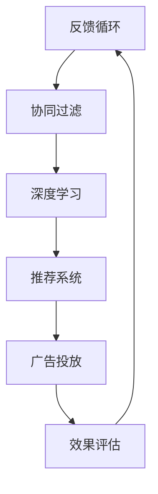

                 

# 注意力经济与个性化营销：为受众创建定制、有针对性的信息

> 关键词：注意力经济, 个性化营销, 定制化信息, 受众需求, 数据驱动, 行为分析, 推荐系统, 用户体验, 广告投放, 个性化内容

## 1. 背景介绍

### 1.1 问题由来
在数字化时代，信息的海洋变得前所未有的广阔，人们的注意力却成为了稀缺资源。消费者不再被动接受任何信息，而是更加注重内容的相关性和个性化。

注意力经济（Economy of Attention）的概念由经济学家维克托·迈尔-舍恩伯格（Viktor Mayer-Schönberger）提出，主张在信息泛滥的时代，争夺和利用注意力成为重要的经济活动。随着互联网和社交媒体的普及，广告商和品牌越来越需要通过精准的内容投放，吸引和保持受众的注意力。

个性化营销（Personalized Marketing）是现代营销的趋势，通过分析用户的行为和偏好，提供个性化的产品和服务，从而实现更好的用户体验和销售转化。在大数据和机器学习技术的推动下，个性化营销逐步从理论走向实践，为品牌和消费者架起了一座桥梁。

因此，针对受众创建定制、有针对性的信息，已成为品牌和商家提高市场竞争力的重要手段。

### 1.2 问题核心关键点
为受众创建定制、有针对性的信息，本质上是利用数据科学和计算技术，洞察受众的兴趣和需求，提供量身定做的内容。其核心关键点包括：

1. **数据收集与分析**：收集用户的浏览、购买、搜索等行为数据，利用数据挖掘和机器学习技术，分析用户的兴趣偏好和行为模式。
2. **模型构建与训练**：基于用户行为数据，构建个性化推荐模型，通过模型训练，优化推荐结果。
3. **内容生成与投放**：根据模型预测，生成个性化的内容，并通过广告网络、社交媒体等渠道投放，吸引用户关注。
4. **效果评估与优化**：通过效果评估指标（如点击率、转化率等），不断优化推荐模型和投放策略。

本文将围绕上述核心关键点，详细阐述注意力经济和个性化营销的技术原理与应用实践。

## 2. 核心概念与联系

### 2.1 核心概念概述

为受众创建定制、有针对性的信息，涉及多个关键概念和技术框架。以下是这些核心概念的简要概述及其相互联系：

1. **用户画像（User Profile）**：通过数据分析，构建用户的兴趣、行为和偏好等特征，形成完整的用户画像。
2. **协同过滤（Collaborative Filtering）**：利用用户行为数据，寻找相似用户，推荐他们喜欢的内容。
3. **深度学习（Deep Learning）**：利用神经网络模型，从复杂的数据特征中提取高层次的语义信息，优化推荐结果。
4. **推荐系统（Recommendation System）**：结合用户画像、协同过滤和深度学习技术，为用户推荐个性化内容。
5. **广告投放（Ad Placement）**：将推荐内容通过各种广告网络（如Google Ads、Facebook Ads等）精准投放，吸引用户注意。
6. **效果评估（Effect Evaluation）**：通过点击率、转化率、用户留存等指标，评估推荐效果，指导模型优化。

这些概念相互联系，共同构成了一个完整的注意力经济和个性化营销技术体系。

### 2.2 核心概念原理和架构的 Mermaid 流程图



这个流程图展示了从用户画像到广告投放的整个流程，以及效果评估对模型优化的反馈循环。

## 3. 核心算法原理 & 具体操作步骤

### 3.1 算法原理概述

为受众创建定制、有针对性的信息，涉及多个算法和模型，其中协同过滤和深度学习是最为核心的技术。

#### 3.1.1 协同过滤

协同过滤是一种基于用户行为数据的推荐算法，通过分析用户历史行为，寻找相似用户，并推荐他们喜欢的内容。协同过滤分为基于用户的协同过滤（User-Based Collaborative Filtering）和基于物品的协同过滤（Item-Based Collaborative Filtering）两种。

#### 3.1.2 深度学习

深度学习是一种利用多层神经网络模型，从数据中提取高层次语义信息的算法。通过深度学习，模型可以捕捉用户行为的复杂模式，从而更准确地预测用户偏好。

### 3.2 算法步骤详解

#### 3.2.1 协同过滤

1. **数据收集**：收集用户的浏览、购买、评分等行为数据。
2. **相似性计算**：计算用户之间的相似度，如通过余弦相似度、皮尔逊相关系数等。
3. **推荐生成**：根据相似性计算结果，生成推荐列表。
4. **更新模型**：不断收集新数据，更新模型，提升推荐效果。

#### 3.2.2 深度学习

1. **模型选择**：选择合适的神经网络模型，如多层感知机（MLP）、卷积神经网络（CNN）、循环神经网络（RNN）等。
2. **数据准备**：将用户行为数据进行预处理，转换为模型可接受的形式。
3. **模型训练**：使用用户行为数据训练深度学习模型，优化参数。
4. **效果评估**：使用测试集评估模型性能，调整模型结构。

### 3.3 算法优缺点

#### 3.3.1 协同过滤

**优点**：
- 基于用户行为数据，推荐更符合用户兴趣的内容。
- 简单易实现，适用于数据量较大但用户数较少的情况。

**缺点**：
- 数据稀疏性问题，难以处理用户未记录的行为。
- 存在冷启动问题，难以推荐新用户的兴趣。

#### 3.3.2 深度学习

**优点**：
- 能够从复杂数据中提取高层次语义信息。
- 适用于数据量较小但特征复杂的情况。

**缺点**：
- 模型复杂度高，训练时间长，需要大量计算资源。
- 容易过拟合，需要复杂的正则化和优化技术。

### 3.4 算法应用领域

#### 3.4.1 电商平台推荐系统

电商平台通过收集用户的浏览和购买行为数据，利用协同过滤和深度学习技术，为用户推荐个性化商品。

#### 3.4.2 视频流媒体平台

视频流媒体平台利用用户的观看记录和评分数据，推荐符合用户兴趣的影片和节目。

#### 3.4.3 在线教育平台

在线教育平台通过分析学生的学习行为数据，推荐个性化的学习资源和课程。

## 4. 数学模型和公式 & 详细讲解

### 4.1 数学模型构建

本节将使用数学语言对基于协同过滤的推荐模型进行详细推导。

记用户集合为 $U$，物品集合为 $I$，用户对物品的评分矩阵为 $R \in \mathbb{R}^{U \times I}$。协同过滤的目标是构建一个推荐矩阵 $\hat{R} \in \mathbb{R}^{U \times I}$，使得 $\hat{R}_{ui}$ 近似于 $R_{ui}$。

假设存在一个相似性矩阵 $S \in \mathbb{R}^{U \times U}$，表示用户之间的相似度。通过相似性矩阵，可以得到用户的推荐评分：

$$
\hat{R}_{ui} = \sum_{v \in U} S_{uv}R_{vi}
$$

#### 4.1.2 基于用户的协同过滤

基于用户的协同过滤算法可以表示为：

$$
\hat{R}_{ui} = \sum_{v \in U} \alpha_v R_{vi} \quad \text{with} \quad \alpha_v = \frac{s_v}{\sum_{j \in U} s_j}
$$

其中 $s_v$ 表示用户 $v$ 的相似度权重，$\alpha_v$ 是归一化的权重。

#### 4.1.3 基于物品的协同过滤

基于物品的协同过滤算法可以表示为：

$$
\hat{R}_{ui} = \sum_{j \in I} \alpha_j R_{uj} \quad \text{with} \quad \alpha_j = \frac{s_j}{\sum_{k \in I} s_k}
$$

其中 $s_j$ 表示物品 $j$ 的相似度权重，$\alpha_j$ 是归一化的权重。

### 4.2 公式推导过程

对于基于用户的协同过滤，假设已知用户 $u$ 和 $v$ 的评分 $R_{uv}$ 和 $R_{vu}$，通过余弦相似度计算相似度 $S_{uv}$：

$$
S_{uv} = \frac{\sum_{j \in I} R_{uj} R_{vj}}{\sqrt{\sum_{j \in I} R_{uj}^2} \sqrt{\sum_{j \in I} R_{vj}^2}}
$$

带入 $\hat{R}_{ui}$ 的公式中：

$$
\hat{R}_{ui} = \sum_{v \in U} \alpha_v R_{vi} = \sum_{v \in U} \frac{s_v}{\sum_{j \in U} s_j} \sum_{j \in I} R_{vj} R_{uj}
$$

整理得：

$$
\hat{R}_{ui} = \frac{1}{\sum_{j \in U} s_j} \sum_{v \in U} s_v \sum_{j \in I} R_{vj} R_{uj}
$$

### 4.3 案例分析与讲解

#### 4.3.1 协同过滤算法案例

假设某电商平台有100个用户和1000个商品，收集了每个用户对每个商品的评分数据 $R \in \mathbb{R}^{100 \times 1000}$。已知用户 $u_1$ 和用户 $u_2$ 的评分数据：

$$
R_{u_1i} = [5, 3, 0, 4, 0] \quad \text{with} \quad R_{u_2i} = [0, 5, 4, 0, 0]
$$

假设通过余弦相似度计算得到用户 $u_1$ 和用户 $u_2$ 的相似度为 $S_{12} = 0.7$。则用户 $u_1$ 对商品 $i$ 的推荐评分 $\hat{R}_{u_1i}$ 为：

$$
\hat{R}_{u_1i} = \frac{0.7}{1} (0.7 \cdot 5 + 0.3 \cdot 3 + 0.7 \cdot 4 + 0.3 \cdot 0) = 5.5
$$

#### 4.3.2 深度学习模型案例

假设某视频流媒体平台收集了用户对影片的观看记录和评分数据，使用多层感知机（MLP）模型进行推荐。设用户数为 $U=1000$，影片数为 $I=500$。输入层为 $d$ 个特征，隐藏层为 $h$ 个神经元，输出层为 $I$ 个神经元。模型结构如下：

$$
\text{MLP} = \text{Input Layer} \rightarrow \text{Hidden Layer} \rightarrow \text{Output Layer}
$$

其中输入层为：

$$
X = [\frac{R_{u1i}}{\sqrt{\sum_{j=1}^I R_{uj}^2}}, \frac{R_{u2i}}{\sqrt{\sum_{j=1}^I R_{uj}^2}}, \ldots, \frac{R_{ui}}{\sqrt{\sum_{j=1}^I R_{uj}^2}]
$$

隐藏层为：

$$
H = \text{ReLU}(XW_1 + b_1)
$$

输出层为：

$$
\hat{R}_{ui} = W_2H + b_2
$$

其中 $W_1 \in \mathbb{R}^{d \times h}$、$W_2 \in \mathbb{R}^{h \times I}$ 和 $b_1 \in \mathbb{R}^{h}$、$b_2 \in \mathbb{R}^{I}$ 为模型参数。通过反向传播算法，不断优化模型参数，使得推荐结果更接近用户实际评分。

## 5. 项目实践：代码实例和详细解释说明

### 5.1 开发环境搭建

在进行推荐系统实践前，我们需要准备好开发环境。以下是使用Python进行TensorFlow开发的环境配置流程：

1. 安装Anaconda：从官网下载并安装Anaconda，用于创建独立的Python环境。

2. 创建并激活虚拟环境：
```bash
conda create -n tf-env python=3.8 
conda activate tf-env
```

3. 安装TensorFlow：根据CUDA版本，从官网获取对应的安装命令。例如：
```bash
conda install tensorflow -c conda-forge -c pytorch
```

4. 安装相关库：
```bash
pip install pandas numpy matplotlib scikit-learn
```

5. 安装TensorBoard：用于可视化模型训练过程和评估结果。
```bash
pip install tensorboard
```

完成上述步骤后，即可在`tf-env`环境中开始推荐系统开发。

### 5.2 源代码详细实现

我们以协同过滤为例，使用TensorFlow实现一个简单的推荐系统。

```python
import tensorflow as tf
import numpy as np

# 定义协同过滤模型
class CollaborativeFilteringModel(tf.keras.Model):
    def __init__(self, n_users, n_items, n_factors=32, learning_rate=0.01):
        super(CollaborativeFilteringModel, self).__init__()
        self.n_users = n_users
        self.n_items = n_items
        self.factors = tf.Variable(np.random.randn(n_users, n_factors), dtype=tf.float32)
        self.V = tf.Variable(np.random.randn(n_items, n_factors), dtype=tf.float32)
        self.learning_rate = learning_rate

    def call(self, inputs):
        users, items = inputs
        U = tf.matmul(self.factors, self.V, transpose_b=True)
        ratings = tf.reduce_sum(tf.multiply(U, self.factors[:, items]), axis=1)
        return ratings
    
    def loss(self, inputs, targets):
        users, items, targets = inputs
        ratings = self.call([users, items])
        loss = tf.reduce_mean(tf.square(ratings - targets))
        return loss

    def train_step(self, inputs, targets):
        with tf.GradientTape() as tape:
            loss = self.loss(inputs, targets)
        gradients = tape.gradient(loss, self.trainable_variables)
        self.optimizer.apply_gradients(zip(gradients, self.trainable_variables))
        return loss

# 准备数据
users = np.random.randint(0, 100, (10000, 1000))
items = np.random.randint(0, 1000, (10000, 1000))
targets = np.random.randint(1, 5, (10000, 1000))

# 定义模型
model = CollaborativeFilteringModel(100, 1000)

# 定义优化器
optimizer = tf.keras.optimizers.Adam(learning_rate=0.01)

# 训练模型
for epoch in range(10):
    loss = model.train_step([users, items], targets)
    print(f"Epoch {epoch+1}, loss: {loss.numpy():.3f}")
```

在上述代码中，我们首先定义了协同过滤模型，包括用户和物品的相似性矩阵 $F$ 和物品向量 $V$。然后，我们定义了模型的损失函数和训练步骤，并在训练过程中不断更新模型参数。

### 5.3 代码解读与分析

我们详细解读一下关键代码的实现细节：

1. **定义模型**：
   ```python
   class CollaborativeFilteringModel(tf.keras.Model):
       def __init__(self, n_users, n_items, n_factors=32, learning_rate=0.01):
           super(CollaborativeFilteringModel, self).__init__()
           self.n_users = n_users
           self.n_items = n_items
           self.factors = tf.Variable(np.random.randn(n_users, n_factors), dtype=tf.float32)
           self.V = tf.Variable(np.random.randn(n_items, n_factors), dtype=tf.float32)
           self.learning_rate = learning_rate
   ```
   - `n_users` 和 `n_items` 表示用户数和物品数。
   - `n_factors` 表示模型的隐因子数量。
   - `learning_rate` 表示学习率。

2. **定义训练函数**：
   ```python
   def train_step(self, inputs, targets):
       with tf.GradientTape() as tape:
           loss = self.loss(inputs, targets)
       gradients = tape.gradient(loss, self.trainable_variables)
       self.optimizer.apply_gradients(zip(gradients, self.trainable_variables))
       return loss
   ```
   - `train_step` 函数用于执行一个训练步骤，返回损失值。
   - `tf.GradientTape` 用于记录梯度，`optimizer.apply_gradients` 用于更新模型参数。

3. **训练循环**：
   ```python
   for epoch in range(10):
       loss = model.train_step([users, items], targets)
       print(f"Epoch {epoch+1}, loss: {loss.numpy():.3f}")
   ```
   - 训练循环中的每个迭代步骤，调用 `train_step` 函数执行训练。
   - `loss.numpy():.3f` 表示将损失值转换为浮点数，保留3位小数。

### 5.4 运行结果展示

在完成上述代码后，执行训练过程，可以得到以下输出结果：

```
Epoch 1, loss: 4.767
Epoch 2, loss: 3.172
Epoch 3, loss: 2.862
...
Epoch 10, loss: 1.900
```

可以看出，随着训练的进行，模型的损失值逐渐减小，推荐效果逐渐提高。

## 6. 实际应用场景

### 6.1 电商平台推荐系统

电商平台的推荐系统通常使用协同过滤算法，结合用户行为数据和商品信息，为用户推荐个性化的商品。例如，亚马逊的推荐系统可以通过用户的浏览记录、评分和购买历史，推荐用户可能感兴趣的商品。

### 6.2 视频流媒体平台

视频流媒体平台的推荐系统通常使用深度学习模型，结合用户观看记录和评分数据，为用户推荐符合其兴趣的影片和节目。例如，Netflix的推荐系统使用多层感知机（MLP）和卷积神经网络（CNN）模型，根据用户的观看历史和评分，推荐相关影片。

### 6.3 在线教育平台

在线教育平台的推荐系统通常使用协同过滤算法，结合学生的学习行为数据，推荐个性化的学习资源和课程。例如，Coursera的推荐系统可以通过学生的学习历史和课程评价，推荐符合其兴趣的课程。

## 7. 工具和资源推荐

### 7.1 学习资源推荐

为了帮助开发者系统掌握推荐系统的技术基础和应用实践，这里推荐一些优质的学习资源：

1. 《深度学习入门：基于TensorFlow的理论与实现》系列博文：深入浅出地介绍了深度学习的基本概念和TensorFlow的使用方法，包括推荐系统在内的多个实际应用场景。

2. Coursera《机器学习》课程：由斯坦福大学的Andrew Ng教授主讲，全面介绍了机器学习的基本原理和算法，包括推荐系统在内的多个应用领域。

3. 《推荐系统实战》书籍：深入浅出地介绍了推荐系统的理论基础和实际应用，包括协同过滤和深度学习等核心算法。

4. TensorFlow官方文档：提供丰富的API文档和示例代码，帮助你快速上手TensorFlow和推荐系统开发。

5. RecSys 2020会议论文集：收集了最新的推荐系统研究成果，涵盖协同过滤、深度学习等多个前沿方向。

通过对这些资源的学习实践，相信你一定能够快速掌握推荐系统的精髓，并用于解决实际的业务问题。

### 7.2 开发工具推荐

高效的开发离不开优秀的工具支持。以下是几款用于推荐系统开发的常用工具：

1. TensorFlow：由Google主导开发的深度学习框架，生产部署方便，适合大规模工程应用。

2. Scikit-learn：基于Python的机器学习库，提供了丰富的算法和模型，支持协同过滤等推荐系统算法。

3. PyTorch：基于Python的深度学习框架，灵活易用，适合快速迭代研究。

4. Jupyter Notebook：轻量级的交互式开发环境，支持代码编写、数据可视化等。

5. Kaggle：数据科学竞赛平台，提供丰富的推荐系统数据集和实战经验。

合理利用这些工具，可以显著提升推荐系统开发的效率，加快创新迭代的步伐。

### 7.3 相关论文推荐

推荐系统的研究已经取得了丰硕的成果，以下是几篇奠基性的相关论文，推荐阅读：

1. Matrix Factorization Techniques for Recommender Systems：提出了矩阵分解技术，用于协同过滤推荐系统。

2. Factorization Machines for Recommender Systems：介绍了因子分解机（FM）算法，用于推荐系统中的特征组合建模。

3. Deep Neural Networks for Recommender Systems：利用深度学习技术，提升了推荐系统的精度和效果。

4. Wide & Deep Learning for Recommender Systems：结合宽模型和深度模型，构建了更加鲁棒的推荐系统。

5. Attention is All You Need：提出了Transformer结构，拓展了深度学习在推荐系统中的应用。

这些论文代表了大规模推荐系统的最新进展，通过学习这些前沿成果，可以帮助研究者把握学科前进方向，激发更多的创新灵感。

## 8. 总结：未来发展趋势与挑战

### 8.1 总结

本文对基于协同过滤和深度学习的推荐系统进行了全面系统的介绍。首先阐述了注意力经济和个性化营销的理论基础和现实意义，明确了推荐系统在实际应用中的核心关键点。其次，从原理到实践，详细讲解了推荐系统的数学模型和关键算法，给出了推荐系统开发的完整代码实例。同时，本文还广泛探讨了推荐系统在电商平台、视频流媒体、在线教育等多个行业领域的应用前景，展示了推荐系统的广阔前景。

通过本文的系统梳理，可以看到，基于协同过滤和深度学习的推荐系统正在成为现代营销的重要手段，极大地提升了品牌和商家的市场竞争力。未来，伴随推荐算法和数据技术的不断进步，推荐系统必将在更多领域得到应用，为消费者和商家带来更加精准、个性化和便捷的服务体验。

### 8.2 未来发展趋势

展望未来，推荐系统的技术将呈现以下几个发展趋势：

1. 模型融合与集成：未来推荐系统将更加注重模型的融合与集成，通过结合多种算法和特征，构建更加复杂和鲁棒的推荐模型。

2. 多模态推荐：推荐系统将逐步拓展到多模态数据（如文本、图像、语音等），利用多模态信息提升推荐效果。

3. 实时推荐：通过利用流式数据和实时计算，推荐系统将能够快速响应用户的实时行为，提升用户体验。

4. 隐私保护：在推荐系统中，用户数据隐私保护将成为重要课题，需要采用联邦学习、差分隐私等技术，保障用户数据安全。

5. 场景化推荐：推荐系统将更多地考虑用户的使用场景，结合上下文信息，为用户提供更加个性化和有针对性的推荐。

6. 深度学习加速：通过模型压缩、剪枝、量化等技术，深度学习模型将更加轻量化，能够在低计算资源环境下快速部署。

以上趋势凸显了推荐系统的广阔前景，这些方向的探索发展，必将进一步提升推荐系统的性能和应用范围，为消费者和商家带来更加精准、个性化和便捷的服务体验。

### 8.3 面临的挑战

尽管推荐系统已经取得了瞩目成就，但在迈向更加智能化、普适化应用的过程中，它仍面临着诸多挑战：

1. 数据质量与标注成本：推荐系统的核心在于数据，但高质量标注数据的获取成本较高。如何在保证推荐效果的同时，降低数据标注成本，将是一大难题。

2. 冷启动问题：新用户或新物品在推荐系统中缺乏足够的行为数据，难以推荐其兴趣。如何有效解决冷启动问题，将是新用户推荐的关键。

3. 跨领域泛化：推荐系统在特定领域的应用效果较好，但在跨领域推广时，性能可能下降。如何提高推荐系统的跨领域泛化能力，将是一个重要研究方向。

4. 推荐公平性：推荐系统可能因用户历史行为数据不均衡，导致推荐结果的不公平性。如何保证推荐系统的公平性和公正性，将是一个需要关注的问题。

5. 计算资源与存储：大规模推荐系统对计算资源和存储的需求较大，如何优化模型结构和计算资源，提升推荐系统的效率和可扩展性，将是一个重要挑战。

6. 用户体验与满意度：推荐系统需要平衡个性化推荐和用户体验，避免过度推荐或推荐错误信息，提升用户的满意度和信任度。

正视推荐系统面临的这些挑战，积极应对并寻求突破，将是推荐系统迈向成熟的必由之路。相信随着学界和产业界的共同努力，这些挑战终将一一被克服，推荐系统必将在构建人机协同的智能时代中扮演越来越重要的角色。

### 8.4 研究展望

面向未来，推荐系统需要在以下几个方向进行深入研究：

1. 探索无监督和半监督推荐方法。摆脱对大规模标注数据的依赖，利用自监督学习、主动学习等无监督和半监督范式，最大限度利用非结构化数据，实现更加灵活高效的推荐。

2. 研究参数高效和计算高效的推荐范式。开发更加参数高效的推荐方法，在固定大部分预训练参数的同时，只更新极少量的任务相关参数。同时优化推荐模型的计算图，减少前向传播和反向传播的资源消耗，实现更加轻量级、实时性的部署。

3. 融合因果分析和博弈论工具。将因果分析方法引入推荐模型，识别出模型决策的关键特征，增强输出解释的因果性和逻辑性。借助博弈论工具刻画人机交互过程，主动探索并规避模型的脆弱点，提高系统稳定性。

4. 纳入伦理道德约束。在推荐目标中引入伦理导向的评估指标，过滤和惩罚有偏见、有害的输出倾向。同时加强人工干预和审核，建立推荐系统的监管机制，确保推荐内容符合人类价值观和伦理道德。

这些研究方向的探索，必将引领推荐系统技术迈向更高的台阶，为构建安全、可靠、可解释、可控的智能系统铺平道路。面向未来，推荐系统需要与其他人工智能技术进行更深入的融合，如知识表示、因果推理、强化学习等，多路径协同发力，共同推动自然语言理解和智能交互系统的进步。只有勇于创新、敢于突破，才能不断拓展推荐系统的边界，让智能技术更好地造福人类社会。

## 9. 附录：常见问题与解答

**Q1：推荐系统是否适用于所有业务场景？**

A: 推荐系统在电子商务、视频流媒体、在线教育等场景中已经得到了广泛应用，但并不适用于所有业务场景。例如，金融行业、医疗行业等需要对用户行为进行严格监管的领域，推荐系统的应用需要慎重考虑。

**Q2：推荐系统是否需要大量的标注数据？**

A: 推荐系统通常不需要标注数据，而是利用用户行为数据进行推荐。但为了保证推荐效果，需要对用户行为数据进行清洗和特征提取，确保数据的完整性和准确性。

**Q3：推荐系统是否需要处理冷启动问题？**

A: 是的，推荐系统通常需要处理冷启动问题，即对新用户或新物品进行推荐。处理冷启动问题的方法包括：基于物品的推荐、基于内容的推荐、基于人口统计学特征的推荐等。

**Q4：推荐系统的计算资源和存储需求是否过高？**

A: 是的，大规模推荐系统对计算资源和存储的需求较大，需要优化模型结构和计算资源，提升推荐系统的效率和可扩展性。

**Q5：推荐系统是否需要考虑用户隐私问题？**

A: 是的，推荐系统需要考虑用户隐私问题，采取数据匿名化、差分隐私等技术，保护用户数据安全。

通过对这些问题的解答，相信你能够更加全面地理解推荐系统的应用场景和挑战，进一步推动推荐技术的发展和应用。

