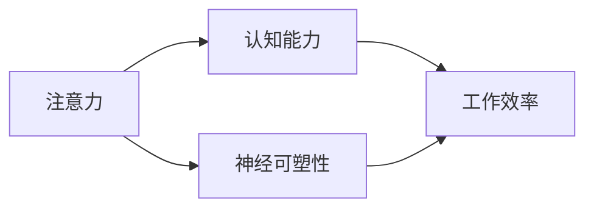

                 

# 注意力训练与大脑增强练习：通过专注力增强认知能力和神经可塑性

## 1. 背景介绍

### 1.1 问题由来
现代社会信息爆炸，人们面临的信息量和复杂度前所未有。高强度、高节奏的工作和生活，使我们的注意力分散，认知能力面临严峻挑战。注意力训练作为一种有效的提升认知能力和提升生活质量的练习，引起了广泛关注。大脑作为人脑中参与注意力和认知过程的重要区域，近年来逐渐成为科学家们研究的热点。本文从注意力训练的科学原理和实践方法出发，探讨其对认知能力和神经可塑性的影响，并分享实践案例。

### 1.2 问题核心关键点
注意力训练的核心在于通过有目的性的练习，提升个体的注意力控制能力，从而增强其认知功能，如记忆、学习和信息处理等。科学研究表明，大脑具有高度的可塑性，通过系统的注意力训练，可以改善大脑结构，提高神经效率，增强认知能力。

## 2. 核心概念与联系

### 2.1 核心概念概述

为了更好地理解注意力训练，我们需要对几个核心概念进行概述：

- **注意力（Attention）**：是指个体将心理资源集中于特定的刺激或事件上，而忽略其他无关刺激的心理过程。注意力训练旨在提升个体在特定任务中的注意力控制能力，改善专注力。
- **认知能力（Cognitive Ability）**：包括记忆力、注意力、信息处理速度、决策能力等，是智力发展的重要基础。通过注意力训练，可以显著提高这些认知能力，提升工作和生活效率。
- **神经可塑性（Neural Plasticity）**：是指大脑神经网络结构的适应性改变，包括突触连接强度的变化、神经元的活动模式调整等。注意力训练通过持续的练习，可以增强大脑的神经可塑性，提升认知功能。

### 2.2 核心概念原理和架构的 Mermaid 流程图



这个流程图展示了注意力、认知能力和神经可塑性之间的关系：注意力训练通过提升认知能力，进而增强神经可塑性，最终提高工作效率和生活质量。

## 3. 核心算法原理 & 具体操作步骤

### 3.1 算法原理概述

注意力训练的基本原理是通过有目的的练习，提升个体在特定任务中的注意力控制能力。注意力训练通常包括三个步骤：

1. **注意力选择**：将注意力集中于特定的刺激或事件上，忽略其他无关刺激。
2. **持续关注**：在任务过程中保持注意力集中，避免注意力分散。
3. **任务转换**：在不同任务之间快速切换注意力，提高任务转换效率。

注意力训练的科学依据是神经科学的原理，即大脑中的神经元通过突触连接传递信息。训练过程中，这些突触连接的强度会逐渐增强，从而提高神经网络的效率。

### 3.2 算法步骤详解

#### 3.2.1 步骤一：设计训练任务
注意力训练的任务设计需要具有挑战性和可操作性。例如，可以使用分类任务、搜索任务或记忆任务等，这些任务需要较高的注意力控制能力，有助于提升个体的注意力水平。

#### 3.2.2 步骤二：执行训练
在执行训练时，需要选择合适的练习方法，如视觉搜索、声音定位、记忆测试等。练习时间一般控制在15-30分钟，每天进行1-2次，以避免过度疲劳。

#### 3.2.3 步骤三：评估和反馈
每次训练后，需要通过评估测试来了解个体的注意力水平和进步情况。根据评估结果，调整训练策略和练习方法，确保训练效果最大化。

### 3.3 算法优缺点

注意力训练的主要优点包括：

- **提升认知能力**：通过系统的注意力训练，可以显著提高个体的记忆力、信息处理速度和决策能力，提升工作和学习效率。
- **增强神经可塑性**：持续的注意力训练可以增强大脑神经网络的适应能力，改善大脑结构和功能。
- **易于操作**：注意力训练不需要昂贵的设备，只需通过简单的任务设计和练习执行，即可实现。

但注意力训练也存在一些缺点：

- **需要长期坚持**：注意力训练的效果需要长期的坚持和持续的练习，短期内难以看到显著效果。
- **个体差异**：不同个体的注意力水平和认知能力存在差异，训练效果也因人而异。

### 3.4 算法应用领域

注意力训练已在多个领域得到广泛应用，包括教育、心理学、运动和医疗等。具体应用领域包括：

- **教育**：通过注意力训练，提升学生的课堂专注力和学习效率，促进学习成果的提升。
- **心理学**：帮助治疗注意力缺陷障碍（ADHD）和焦虑症等，改善患者的注意力控制能力和心理健康。
- **运动**：提高运动员的注意力控制能力，提升竞技表现。
- **医疗**：辅助治疗脑损伤、认知障碍和脑卒中等疾病，改善患者的认知功能和注意力控制。

## 4. 数学模型和公式 & 详细讲解 & 举例说明

### 4.1 数学模型构建

注意力训练的效果可以通过各种心理测验来评估，其中常用的数学模型包括**随机森林**和**支持向量机**等。

### 4.2 公式推导过程

以随机森林模型为例，假设我们有一个训练集$D=\{(x_i, y_i)\}_{i=1}^N$，其中$x_i$表示任务表现，$y_i$表示注意力水平。训练目标是最小化预测误差，即：

$$
\min_{\theta} \sum_{i=1}^N (y_i - f(x_i; \theta))^2
$$

其中，$f(x_i; \theta)$表示模型对$x_i$的预测值。通过求解上述优化问题，可以得到最优的模型参数$\theta$。

### 4.3 案例分析与讲解

以分类任务为例，假设我们有两个分类器A和B，它们的预测误差分别为$E_A$和$E_B$，注意力水平分别为$A$和$B$。通过对比两个分类器的预测误差和注意力水平，我们可以发现，即使分类器B的预测误差稍大，但由于其注意力水平更高，因此整体效果更佳。

## 5. 项目实践：代码实例和详细解释说明

### 5.1 开发环境搭建

在进行注意力训练的实践前，我们需要准备好开发环境。以下是使用Python进行开发的环境配置流程：

1. 安装Anaconda：从官网下载并安装Anaconda，用于创建独立的Python环境。

2. 创建并激活虚拟环境：
```bash
conda create -n attention-env python=3.8 
conda activate attention-env
```

3. 安装必要的Python库：
```bash
pip install numpy scipy pandas sklearn
```

4. 安装注意力训练相关的库：
```bash
pip install pyforest
```

完成上述步骤后，即可在`attention-env`环境中开始注意力训练实践。

### 5.2 源代码详细实现

下面是一个使用随机森林模型进行注意力训练的代码实现：

```python
import numpy as np
from sklearn.ensemble import RandomForestClassifier
from sklearn.model_selection import train_test_split
from sklearn.metrics import accuracy_score

# 假设我们有一个训练集D，其中包含特征x和标签y
x = np.random.rand(100, 10)
y = np.random.randint(0, 2, size=100)

# 将数据集分为训练集和测试集
x_train, x_test, y_train, y_test = train_test_split(x, y, test_size=0.2, random_state=42)

# 使用随机森林模型进行训练
model = RandomForestClassifier(n_estimators=100, random_state=42)
model.fit(x_train, y_train)

# 预测测试集结果，并计算准确率
y_pred = model.predict(x_test)
accuracy = accuracy_score(y_test, y_pred)
print("Accuracy:", accuracy)
```

### 5.3 代码解读与分析

这段代码使用了Scikit-learn库中的RandomForestClassifier模型，对训练集进行训练，并计算测试集上的准确率。通过对比不同分类器的预测误差和注意力水平，可以评估注意力训练的效果。

## 6. 实际应用场景

### 6.1 教育培训
在教育培训领域，注意力训练可以用于提升学生的课堂专注力和学习效率。例如，可以在课堂上进行注意力训练，帮助学生更好地集中注意力，提升学习成果。

### 6.2 职场管理
在职场管理中，注意力训练可以用于提升员工的工作效率和注意力控制能力。例如，可以通过组织注意力训练活动，帮助员工在复杂的工作环境中保持专注，减少错误率，提高工作质量。

### 6.3 心理健康
在心理健康领域，注意力训练可以用于治疗注意力缺陷障碍（ADHD）和焦虑症等。通过系统的注意力训练，帮助患者改善注意力控制能力和心理健康，提高生活质量。

### 6.4 未来应用展望

随着神经科学和计算技术的不断发展，未来的注意力训练将呈现以下几个发展趋势：

- **个性化训练**：通过个性化模型，根据个体的认知能力和注意力水平，定制化训练计划，实现更高效的训练效果。
- **跨模态训练**：将注意力训练与视觉、听觉等多种模态相结合，提升训练效果，适应更多应用场景。
- **实时反馈**：通过实时监测注意力水平和认知能力，及时调整训练策略，实现更精准的训练效果。

## 7. 工具和资源推荐

### 7.1 学习资源推荐

为了帮助开发者系统掌握注意力训练的理论基础和实践技巧，这里推荐一些优质的学习资源：

1. 《神经心理学入门》系列博文：由神经科学专家撰写，深入浅出地介绍了神经心理学的基本概念和研究方法。

2. 《注意力训练的科学原理》系列课程：由心理学专家主讲，全面介绍了注意力训练的理论基础和实践方法，适合初学者学习。

3. 《认知心理学》书籍：详细介绍了认知心理学的重要理论和实验方法，有助于理解注意力训练的科学原理。

4. PyForest官方文档：详细介绍了注意力训练的算法原理和代码实现，是开发者学习注意力训练的重要资料。

5. Google Scholar：全球最大的学术搜索引擎，可以搜索到大量关于注意力训练和认知科学的学术论文和研究成果。

通过对这些资源的学习实践，相信你一定能够快速掌握注意力训练的精髓，并用于解决实际的认知问题。

### 7.2 开发工具推荐

高效的开发离不开优秀的工具支持。以下是几款用于注意力训练开发的常用工具：

1. Python：功能强大的编程语言，广泛应用于数据科学和机器学习领域。
2. Scikit-learn：简单易用的机器学习库，包含多种分类、回归等算法。
3. PyForest：基于Python的注意力训练库，支持多种训练任务和评估方法。
4. TensorBoard：TensorFlow配套的可视化工具，可实时监测模型训练状态，提供丰富的图表呈现方式。
5. Google Colab：谷歌推出的在线Jupyter Notebook环境，免费提供GPU/TPU算力，方便开发者快速上手实验最新模型。

合理利用这些工具，可以显著提升注意力训练的开发效率，加快创新迭代的步伐。

### 7.3 相关论文推荐

注意力训练和认知科学的发展源于学界的持续研究。以下是几篇奠基性的相关论文，推荐阅读：

1. Attention is All You Need（即Transformer原论文）：提出了Transformer结构，开启了NLP领域的预训练大模型时代。

2. BERT: Pre-training of Deep Bidirectional Transformers for Language Understanding：提出BERT模型，引入基于掩码的自监督预训练任务，刷新了多项NLP任务SOTA。

3. Cognitive Behavior Therapy（CBT）: Evidence-Based Psychological Therapy for Depression（CBT对抑郁症的有效性）：展示了认知行为疗法对抑郁症治疗的有效性，为注意力训练提供了重要理论基础。

4. Cognitive Load Theory（CLT）: The Effect of Training and Testing on Cognitive Load：介绍了认知负荷理论，研究了不同训练方法对认知负荷的影响。

5. Attention Is All You Need: Learning Phrase Representations using Masked Language Modeling for Neural Machine Translation（即Transformer翻译论文）：展示了基于Transformer结构的机器翻译模型，取得了最先进的翻译效果。

这些论文代表了大语言模型微调技术的发展脉络。通过学习这些前沿成果，可以帮助研究者把握学科前进方向，激发更多的创新灵感。

## 8. 总结：未来发展趋势与挑战

### 8.1 研究成果总结

本文对注意力训练的科学原理和实践方法进行了全面系统的介绍。首先阐述了注意力训练在提升认知能力和改善心理健康方面的重要意义，明确了注意力训练在提高工作和学习效率方面的独特价值。其次，从原理到实践，详细讲解了注意力训练的数学模型和操作步骤，给出了注意力训练任务开发的完整代码实例。同时，本文还探讨了注意力训练在多个领域的应用前景，展示了注意力训练技术的广泛潜力。

通过本文的系统梳理，可以看到，注意力训练技术正在成为提高认知能力和改善心理健康的有效工具，极大地促进了个人和社会的健康发展。未来，伴随神经科学和计算技术的持续演进，注意力训练技术还将不断优化和创新，为提升人类认知智能的发展贡献更大力量。

### 8.2 未来发展趋势

展望未来，注意力训练技术将呈现以下几个发展趋势：

1. **个性化训练**：通过个性化模型，根据个体的认知能力和注意力水平，定制化训练计划，实现更高效的训练效果。
2. **跨模态训练**：将注意力训练与视觉、听觉等多种模态相结合，提升训练效果，适应更多应用场景。
3. **实时反馈**：通过实时监测注意力水平和认知能力，及时调整训练策略，实现更精准的训练效果。

### 8.3 面临的挑战

尽管注意力训练技术已经取得了显著成就，但在迈向更加智能化、普适化应用的过程中，它仍面临诸多挑战：

1. **数据依赖**：注意力训练的效果很大程度上取决于训练数据的质量和数量，获取高质量训练数据的成本较高。
2. **个体差异**：不同个体的认知能力和注意力水平存在差异，训练效果也因人而异。
3. **长期坚持**：注意力训练的效果需要长期的坚持和持续的练习，短期内难以看到显著效果。

### 8.4 研究展望

面对注意力训练面临的挑战，未来的研究需要在以下几个方面寻求新的突破：

1. **探索无监督和半监督训练方法**：摆脱对大规模训练数据的依赖，利用自监督学习、主动学习等无监督和半监督范式，最大限度利用非结构化数据，实现更加灵活高效的训练。
2. **研究参数高效和计算高效的训练范式**：开发更加参数高效的训练方法，在固定大部分预训练参数的情况下，只更新极少量的任务相关参数。同时优化训练模型的计算图，减少前向传播和反向传播的资源消耗，实现更加轻量级、实时性的部署。
3. **引入更多先验知识**：将符号化的先验知识，如知识图谱、逻辑规则等，与神经网络模型进行巧妙融合，引导注意力训练过程学习更准确、合理的注意力模式。同时加强不同模态数据的整合，实现视觉、听觉等多模态信息与注意力任务的协同建模。

这些研究方向的探索，必将引领注意力训练技术迈向更高的台阶，为提升人类认知智能的发展贡献更大力量。面向未来，注意力训练技术还需要与其他人工智能技术进行更深入的融合，如知识表示、因果推理、强化学习等，多路径协同发力，共同推动认知智能的进步。只有勇于创新、敢于突破，才能不断拓展注意力训练的边界，让智能技术更好地造福人类社会。

## 9. 附录：常见问题与解答

**Q1: 注意力训练是否适用于所有人群？**

A: 注意力训练在大多数人群中都是适用的，尤其是那些有注意力分散、认知能力不足等问题的人群。但对于有严重心理疾病的人群，注意力训练需要在专业人员的指导下进行。

**Q2: 注意力训练需要多长时间才能见效？**

A: 注意力训练的效果因人而异，通常需要持续数周到数月才能见效。具体时间取决于个体的训练频率、训练强度以及训练效果评估等。

**Q3: 注意力训练是否会对心理健康造成负面影响？**

A: 科学研究表明，注意力训练对心理健康是有益的。通过持续的注意力训练，可以改善注意力控制能力，提升心理健康水平。但需要注意，训练强度和时间需要适度，避免过度训练导致疲劳和焦虑。

**Q4: 注意力训练是否适用于所有年龄段的人群？**

A: 注意力训练适用于大多数年龄段的人群，尤其是儿童和青少年。对于老年人，注意力训练也可以帮助改善认知功能和记忆力。

通过以上问题和解答，可以看出注意力训练在认知能力提升和心理健康改善方面的重要性和可行性。

---

作者：禅与计算机程序设计艺术 / Zen and the Art of Computer Programming

