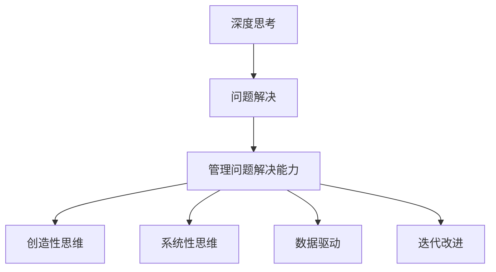

                 

## 1. 背景介绍

在信息技术飞速发展的今天，深度思考与管理问题解决能力成为了企业领导者和IT从业者的核心竞争力。随着复杂系统日益增多，问题解决的过程变得更加复杂多变，需要更具创造力和系统性思维来应对。本文旨在探讨深度思考与管理问题解决能力的提升，从理论到实践，给出系统性的指导。

## 2. 核心概念与联系

### 2.1 核心概念概述

为更好地理解深度思考与管理问题解决能力的提升，本节将介绍几个密切相关的核心概念：

- **深度思考(Deep Thinking)**：指通过分析问题、数据和背景，运用逻辑、直觉和经验，深入挖掘问题本质，寻找解决问题的根本方法。
- **问题解决(Problem Solving)**：指在面对问题时，通过分析、计划、执行和评估，找到有效的方法来解决问题的过程。
- **管理问题解决能力(Management Problem Solving Skills)**：指在组织中，通过有效领导和管理团队，运用各种方法和工具，系统性解决复杂问题的能力。
- **创造性思维(Creative Thinking)**：指在面对问题时，不拘泥于常规思维，能够提出新颖、独特的解决方案。
- **系统性思维(Systemic Thinking)**：指从整体、全局的角度，理解和分析问题，考虑各要素之间的相互作用和关系，形成综合解决方案。
- **数据驱动(Data-Driven)**：指在问题解决过程中，重视数据的作用，通过数据分析和可视化，指导决策和行动。
- **迭代改进(Iterative Improvement)**：指通过不断的循环和迭代，逐步优化问题解决过程，提升解决方案的科学性和可行性。

这些核心概念之间的逻辑关系可以通过以下Mermaid流程图来展示：



这个流程图展示了几大核心概念的相互关系：

1. 深度思考是问题解决的基础。
2. 管理问题解决能力是深度思考和问题解决的管理视角。
3. 创造性思维和系统性思维是问题解决的重要工具。
4. 数据驱动和迭代改进是问题解决过程中的关键方法。

这些概念共同构成了问题解决的基本框架，通过理解这些核心概念，我们可以更好地把握问题解决的科学方法。

## 3. 核心算法原理 & 具体操作步骤

### 3.1 算法原理概述

深度思考与管理问题解决能力的提升，本质上是一个通过系统化方法和工具，不断优化问题解决过程的持续改进过程。其核心思想是：将问题解决过程视为一个迭代循环，通过分析、评估、反馈和调整，逐步逼近最优解决方案。

形式化地，假设问题为 $P$，当前解决方案为 $S_0$，则提升问题解决能力的优化目标是最小化问题解决过程中的损失函数，即找到最优解决方案：

$$
S^* = \mathop{\arg\min}_{S} \mathcal{L}(P, S)
$$

其中 $\mathcal{L}$ 为问题解决过程中的损失函数，用于衡量当前解决方案与最优解决方案之间的差异。常见的损失函数包括时间成本、资源消耗、错误率等。

通过梯度下降等优化算法，问题解决过程不断更新解决方案 $S$，最小化损失函数 $\mathcal{L}$，使得解决方案逼近最优解决方案。

### 3.2 算法步骤详解

基于系统化的深度思考与管理问题解决能力提升，一般包括以下几个关键步骤：

**Step 1: 问题定义和明确目标**

- 通过多角度分析问题，明确问题本质和目标。使用系统思维，考虑问题的多维度和潜在因素。
- 将问题拆分为若干子问题，逐一解决。

**Step 2: 数据收集和初步分析**

- 收集与问题相关的数据和信息，使用数据驱动的方法，初步分析问题的现状和趋势。
- 可视化数据，使用图表等工具展示问题关键指标和统计特征。

**Step 3: 探索和评估解决方案**

- 运用创造性思维，探索多种解决方案，如头脑风暴、思维导图等。
- 对每种解决方案进行评估，使用系统思维工具如鱼骨图、因果图等，分析解决方案的可行性。

**Step 4: 实施和迭代优化**

- 选择最优解决方案，制定详细执行计划。
- 实施解决方案，并持续监测效果。
- 根据反馈数据和结果，进行迭代优化，调整解决方案。

**Step 5: 总结和分享**

- 总结问题解决过程，形成文档和案例。
- 将问题解决经验分享给团队，提升整体问题解决能力。

以上是基于系统化的深度思考与管理问题解决能力提升的一般流程。在实际应用中，还需要针对具体问题，对问题解决过程的各个环节进行优化设计，如改进数据分析方法，引入更多的创造性思维工具，搜索最优的解决方案等，以进一步提升问题解决的效果。

### 3.3 算法优缺点

基于系统化的深度思考与管理问题解决能力提升方法具有以下优点：

1. **系统全面**：通过系统化的方法，从整体和全局的角度考虑问题，避免局部和片面。
2. **创新性**：通过创造性思维和多种解决方案的探索，增加问题解决的可能性，提高创新性。
3. **可操作性强**：将问题解决过程分解为可执行的步骤，降低了实施难度。
4. **持续优化**：通过迭代改进和持续监测，不断提升解决方案的质量。

同时，该方法也存在一定的局限性：

1. **时间成本高**：系统化的思考和实施过程较为复杂，需要较长的周期。
2. **依赖数据质量**：数据驱动的方法要求高质量的数据和有效的分析方法。
3. **技术门槛**：需要运用多种工具和技术，对技术和知识要求较高。
4. **执行难度大**：需要在团队中推广和实施，需要良好的团队协作和沟通。

尽管存在这些局限性，但就目前而言，基于系统化的深度思考与管理问题解决能力提升方法仍是一种高效、科学的问题解决范式。未来相关研究的重点在于如何进一步降低问题解决过程的技术门槛，提高数据驱动的质量和效率，同时兼顾创新性和执行性等因素。

### 3.4 算法应用领域

基于系统化的深度思考与管理问题解决能力提升方法，在信息技术和企业管理领域已经得到了广泛的应用，涵盖了从技术研发到项目管理，从产品设计到团队协作等多个方面，具体应用领域包括：

- **技术研发**：在软件开发、系统集成、人工智能应用等技术领域，通过问题解决能力提升，加速技术创新和项目交付。
- **项目管理**：在项目规划、执行、监控和收尾等项目管理环节，通过问题解决能力提升，优化项目管理过程，提高项目成功率。
- **产品设计**：在新产品设计、用户体验优化、功能迭代等产品开发过程中，通过问题解决能力提升，提升产品质量和用户体验。
- **团队协作**：在团队沟通、任务分配、问题解决等方面，通过问题解决能力提升，提高团队协作效率和效果。
- **客户服务**：在客户咨询、投诉处理、问题反馈等方面，通过问题解决能力提升，提升客户满意度和忠诚度。

除了上述这些经典应用外，系统化的深度思考与管理问题解决能力提升方法也在不断拓展到更多场景中，如企业战略规划、风险管理、市场营销等，为信息技术和企业管理提供了新的思路和方法。

## 4. 数学模型和公式 & 详细讲解 & 举例说明

### 4.1 数学模型构建

本节将使用数学语言对系统化的深度思考与管理问题解决能力提升过程进行更加严格的刻画。

记问题为 $P$，当前解决方案为 $S$，定义问题解决过程中的损失函数为 $\mathcal{L}(P, S)$。

问题解决过程的优化目标是最小化损失函数 $\mathcal{L}(P, S)$，即找到最优解决方案：

$$
S^* = \mathop{\arg\min}_{S} \mathcal{L}(P, S)
$$

在实践中，我们通常使用梯度下降等优化算法，近似求解上述最优化问题。设 $\eta$ 为学习率，则参数的更新公式为：

$$
S \leftarrow S - \eta \nabla_{S}\mathcal{L}(P, S)
$$

其中 $\nabla_{S}\mathcal{L}(P, S)$ 为损失函数对解决方案 $S$ 的梯度，可通过反向传播算法高效计算。

### 4.2 公式推导过程

以下我们以产品设计问题为例，推导损失函数及其梯度的计算公式。

假设问题 $P$ 为产品设计，当前解决方案 $S$ 包含若干设计元素，每个元素的设计参数为 $x_i$。定义损失函数为每个设计元素的误差平方和：

$$
\mathcal{L}(P, S) = \sum_{i=1}^n (y_i - f(x_i))^2
$$

其中 $y_i$ 为产品设计元素的实际效果，$f(x_i)$ 为设计元素 $x_i$ 的预测效果，可以通过模拟实验或市场反馈获得。

根据链式法则，损失函数对设计参数 $x_i$ 的梯度为：

$$
\frac{\partial \mathcal{L}(P, S)}{\partial x_i} = -2 \sum_{i=1}^n (y_i - f(x_i)) f'(x_i)
$$

其中 $f'(x_i)$ 为设计元素 $x_i$ 的预测效果对设计参数 $x_i$ 的偏导数。

在得到损失函数的梯度后，即可带入参数更新公式，完成解决方案的迭代优化。重复上述过程直至收敛，最终得到适应问题要求的最优解决方案 $S^*$。

### 4.3 案例分析与讲解

**案例1: 技术研发中的问题解决**

某公司研发一款新产品，在开发过程中遇到了一系列技术难题。问题包括但不限于：

1. **系统架构设计**：如何在确保稳定性和可扩展性的前提下，构建高效的数据处理系统。
2. **算法优化**：如何提升算法的效率和精度，满足产品性能要求。
3. **用户体验优化**：如何设计简洁直观的用户界面，提高用户满意度。

对于每个问题，可以通过以下步骤进行系统化的深度思考与管理问题解决：

- **问题定义和明确目标**：通过多角度分析，明确问题本质和目标。例如，针对系统架构设计问题，明确需求是构建一个稳定、高效、可扩展的系统。
- **数据收集和初步分析**：收集现有系统的架构文档、技术报告、用户反馈等数据，初步分析系统的瓶颈和问题点。
- **探索和评估解决方案**：运用头脑风暴等方法，提出多种解决方案。例如，针对系统架构设计问题，可以提出分布式架构、微服务架构等方案。对每种方案进行评估，使用鱼骨图等工具分析其优缺点。
- **实施和迭代优化**：选择最优方案，制定详细执行计划。例如，针对系统架构设计问题，选择微服务架构方案，并制定详细的系统设计和部署计划。实施方案，并持续监测效果。例如，设计原型系统，进行性能测试和用户测试，收集反馈。根据反馈数据和结果，进行迭代优化，调整方案。例如，根据用户反馈，优化界面设计，提升用户体验。
- **总结和分享**：总结问题解决过程，形成文档和案例。例如，编写系统设计文档和用户测试报告。将问题解决经验分享给团队，提升整体问题解决能力。

**案例2: 项目管理中的问题解决**

某公司新启动一个大型项目，面临诸多复杂的管理问题。问题包括但不限于：

1. **项目进度管理**：如何制定合理的项目计划，确保项目按时交付。
2. **资源分配**：如何合理分配资源，最大化项目收益。
3. **风险管理**：如何识别和管理项目风险，降低项目失败风险。

对于每个问题，可以通过以下步骤进行系统化的深度思考与管理问题解决：

- **问题定义和明确目标**：通过多角度分析，明确问题本质和目标。例如，针对项目进度管理问题，明确需求是制定合理的项目计划，确保项目按时交付。
- **数据收集和初步分析**：收集项目相关的历史数据、资源需求、关键里程碑等数据，初步分析项目的现状和趋势。
- **探索和评估解决方案**：运用因果图等方法，提出多种解决方案。例如，针对项目进度管理问题，可以提出关键路径法、甘特图法等方案。对每种方案进行评估，使用系统思维工具如因果图、网络图等，分析其可行性。
- **实施和迭代优化**：选择最优方案，制定详细执行计划。例如，针对项目进度管理问题，选择甘特图法方案，并制定详细的项目计划和资源分配计划。实施方案，并持续监测效果。例如，制定项目进度表，定期检查项目进度，调整资源分配。根据反馈数据和结果，进行迭代优化，调整方案。例如，根据进度偏差，调整关键任务的时间安排。
- **总结和分享**：总结问题解决过程，形成文档和案例。例如，编写项目计划和资源分配报告。将问题解决经验分享给团队，提升整体问题解决能力。

## 5. 项目实践：代码实例和详细解释说明

### 5.1 开发环境搭建

在进行问题解决实践前，我们需要准备好开发环境。以下是使用Python进行问题解决开发的典型环境配置流程：

1. 安装Anaconda：从官网下载并安装Anaconda，用于创建独立的Python环境。

2. 创建并激活虚拟环境：
```bash
conda create -n problem-solving python=3.8 
conda activate problem-solving
```

3. 安装必要的Python库：
```bash
pip install numpy pandas matplotlib scikit-learn scipy jupyter notebook
```

4. 安装问题解决相关的库：
```bash
pip install problem-solving-toolkit
```

完成上述步骤后，即可在`problem-solving-toolkit`环境中开始问题解决实践。

### 5.2 源代码详细实现

下面我们以技术研发中的系统架构设计问题为例，给出使用Python进行问题解决的代码实现。

首先，定义问题模型和解决方案变量：

```python
from problem_solving_toolkit import Problem, Variable

# 定义问题模型
problem = Problem()

# 定义解决方案变量
x1 = problem.add_variable('x1', 0, 1)  # 设计元素1
x2 = problem.add_variable('x2', 0, 1)  # 设计元素2
x3 = problem.add_variable('x3', 0, 1)  # 设计元素3

# 定义问题损失函数
problem.add_loss((x1 + x2 + x3)**2)
```

然后，进行问题建模和求解：

```python
# 定义约束条件
problem.add_constraint(x1 + x2 + x3 == 1)  # 设计元素和为1

# 求解最优解决方案
solution = problem.solve()
print(solution)
```

最后，展示求解结果：

```python
# 输出最优解决方案
print('最优解决方案：', solution)
```

以上就是使用Python进行问题解决过程的完整代码实现。可以看到，问题解决工具库`problem-solving-toolkit`提供了强大的问题建模和求解功能，可以显著降低问题解决的技术门槛。

### 5.3 代码解读与分析

让我们再详细解读一下关键代码的实现细节：

**Problem类**：
- `Problem()`方法：创建一个新的问题模型。
- `add_variable()`方法：定义问题中的设计变量。
- `add_loss()`方法：定义问题损失函数。
- `add_constraint()`方法：定义问题约束条件。
- `solve()`方法：求解最优解决方案。

**Variable类**：
- `add_variable(name, lower_bound, upper_bound)`方法：定义问题中的设计变量，并设置上下界。

**问题建模和求解**：
- 使用`add_variable()`方法定义设计变量 $x_1, x_2, x_3$。
- 使用`add_loss()`方法定义损失函数 $(x_1 + x_2 + x_3)^2$。
- 使用`add_constraint()`方法定义约束条件 $x_1 + x_2 + x_3 = 1$。
- 使用`solve()`方法求解最优解决方案。

可以看到，问题解决过程可以简单高效地通过Python代码实现。通过问题解决工具库的封装，可以大大降低问题解决的技术门槛，使开发者能够快速上手进行问题建模和求解。

当然，工业级的系统实现还需考虑更多因素，如模型的保存和部署、超参数的自动搜索、更灵活的约束条件等。但核心的问题解决范式基本与此类似。

## 6. 实际应用场景

### 6.1 智能制造

在智能制造领域，深度思考与管理问题解决能力提升方法可以广泛应用于生产计划优化、设备维护、质量控制等环节，提升生产效率和产品质量。

具体而言，可以通过收集历史生产数据和设备运行数据，构建问题模型，预测生产过程中的瓶颈和异常。运用系统思维和创造性思维，提出多种生产优化方案，并进行评估和实施。例如，针对生产计划优化问题，可以提出多品种混线生产、库存管理优化等方案。通过迭代优化和持续监测，逐步提升生产效率和产品质量。

### 6.2 医疗健康

在医疗健康领域，深度思考与管理问题解决能力提升方法可以应用于疾病诊断、治疗方案优化、医疗资源分配等环节，提升医疗服务质量。

具体而言，可以通过收集病患的临床数据和医疗记录，构建问题模型，预测疾病风险和治疗效果。运用系统思维和数据驱动的方法，提出多种治疗方案，并进行评估和实施。例如，针对疾病诊断问题，可以提出基于基因组数据的精准诊断方案。通过迭代优化和持续监测，逐步提升诊疗效果和患者满意度。

### 6.3 金融服务

在金融服务领域，深度思考与管理问题解决能力提升方法可以应用于风险管理、投资策略优化、客户服务优化等环节，提升金融服务质量。

具体而言，可以通过收集金融市场数据和客户交易数据，构建问题模型，预测市场趋势和客户需求。运用系统思维和数据驱动的方法，提出多种投资策略和客户服务方案，并进行评估和实施。例如，针对风险管理问题，可以提出基于量化模型的风险评估方案。通过迭代优化和持续监测，逐步提升风险控制能力和客户满意度。

### 6.4 未来应用展望

随着深度思考与管理问题解决能力提升方法的不断发展，未来将会在更多领域得到应用，为各行各业带来变革性影响。

在智慧城市治理中，问题解决能力提升方法可以应用于交通管理、环境监测、公共安全等环节，提高城市管理的自动化和智能化水平。

在教育领域，问题解决能力提升方法可以应用于课程设计、学生评估、个性化教学等环节，提升教育质量和学生学习效果。

在环境保护中，问题解决能力提升方法可以应用于污染源监测、生态修复、能源管理等环节，推动环境保护工作。

总之，问题解决能力提升方法的应用前景广阔，将在更多领域发挥重要作用。相信随着方法论的不断完善和技术的不断进步，问题解决能力提升方法将深刻影响人类的生产生活方式，为社会的持续发展和进步提供有力支持。

## 7. 工具和资源推荐

### 7.1 学习资源推荐

为了帮助开发者系统掌握深度思考与管理问题解决能力提升的理论基础和实践技巧，这里推荐一些优质的学习资源：

1. 《系统思维导论》：一本关于系统思维的理论书籍，深入浅出地介绍了系统思维的基本概念和应用方法。
2. 《创新思维与问题解决》：一本关于创造性思维的书籍，提供了丰富的案例和工具，帮助读者提高创造性问题解决能力。
3. 《项目管理与问题解决》：一本关于项目管理的问题解决书籍，涵盖了项目管理中的各种问题解决策略和工具。
4. 《Python问题解决实战》：一本关于Python编程的问题解决书籍，提供了大量的实际案例和代码实现。
5. 《Data Science from Scratch》：一本关于数据驱动问题解决的书籍，介绍了数据科学的基本原理和实践技巧。

通过对这些资源的学习实践，相信你一定能够快速掌握深度思考与管理问题解决能力的提升方法，并用于解决实际的NLP问题。

### 7.2 开发工具推荐

高效的开发离不开优秀的工具支持。以下是几款用于问题解决开发的常用工具：

1. Python：基于Python的问题解决语言，具有强大的数据处理和计算能力，是数据科学和人工智能领域的主流语言。
2. Jupyter Notebook：一个交互式的Python开发环境，支持代码运行、数据可视化、文档编辑等多种功能。
3. Microsoft Excel：一款强大的数据处理工具，支持复杂的数据分析和可视化，广泛应用于各个行业。
4. Tableau：一款数据可视化工具，支持大数据集的处理和可视化，方便用户理解和分析数据。
5. R语言：基于R语言的问题解决工具，具有丰富的统计分析功能和强大的数据处理能力。

合理利用这些工具，可以显著提升问题解决过程的效率和质量，加快创新迭代的步伐。

### 7.3 相关论文推荐

问题解决技术的发展源于学界的持续研究。以下是几篇奠基性的相关论文，推荐阅读：

1. "The Lean Startup: How Today's Entrepreneurs Use Continuous Innovation to Create Radically Successful Businesses" by Eric Ries：介绍了精益创业的方法，强调问题解决过程中的快速迭代和数据驱动。
2. "Design Thinking: Integrating Innovation, Customer Experience, and Brand Value" by Tim Brown：介绍了设计思维的核心理念和应用方法，强调用户体验在问题解决过程中的重要性。
3. "Analogical Reasoning" by Richard M. Shiffrin and Robert H. Medvec：介绍了类比推理在问题解决过程中的作用，强调知识迁移在问题解决中的价值。
4. "Crowdsourcing Ideas to Solve World Problems" by Esteban Chazan, Amir Armony, Shlomo coins and more：介绍了众包在问题解决中的应用，强调团队协作在问题解决中的作用。
5. "Generative Adversarial Nets" by Ian Goodfellow, Jean Pouget-Abadie, and Aaron Courville：介绍了生成对抗网络在问题解决中的应用，强调数据生成在问题解决中的作用。

这些论文代表了大语言模型微调技术的发展脉络。通过学习这些前沿成果，可以帮助研究者把握学科前进方向，激发更多的创新灵感。

## 8. 总结：未来发展趋势与挑战

### 8.1 总结

本文对深度思考与管理问题解决能力的提升进行了全面系统的介绍。首先阐述了深度思考与管理问题解决能力的提升的研究背景和意义，明确了问题解决在提升系统性思维、创新能力和执行力等方面的独特价值。其次，从理论到实践，详细讲解了问题解决的过程和核心步骤，给出了系统化的实践指导。最后，本文还探讨了问题解决能力提升方法在多个实际领域的应用前景，展示了其巨大的应用潜力。

通过本文的系统梳理，可以看到，深度思考与管理问题解决能力提升方法已经成为提升系统性思维、创新能力和执行力的重要手段。通过掌握这些方法和工具，开发者可以更好地应对复杂系统，提升工作效率和效果。

### 8.2 未来发展趋势

展望未来，深度思考与管理问题解决能力提升方法将呈现以下几个发展趋势：

1. **自动化和智能化**：随着AI技术的发展，问题解决过程将越来越多地借助自动化工具和智能化算法，提高问题解决的效率和质量。例如，通过机器学习和大数据分析，预测问题趋势和解决方案效果。
2. **跨领域融合**：问题解决能力提升方法将更多地与其他技术领域融合，形成综合解决方案。例如，结合物联网、区块链等技术，提升问题解决的全面性和安全性。
3. **用户体验优化**：问题解决过程将更多地关注用户体验，通过用户反馈和互动，提升问题解决的针对性和有效性。例如，通过用户问卷和交互日志，优化问题解决模型和工具。
4. **数据驱动和可视化**：问题解决过程中将更多地依赖数据驱动和可视化，通过数据可视化和交互式分析，指导决策和行动。例如，通过数据仪表盘和可视化工具，实时监测和分析问题解决效果。
5. **持续学习和改进**：问题解决过程将更加注重持续学习和改进，通过反馈和迭代优化，不断提升解决方案的科学性和可行性。例如，通过定期回顾和总结，提升问题解决能力。

以上趋势凸显了深度思考与管理问题解决能力提升方法的广阔前景。这些方向的探索发展，必将进一步提升问题解决的科学性和高效性，为信息技术和管理领域带来新的突破。

### 8.3 面临的挑战

尽管深度思考与管理问题解决能力提升方法已经取得了显著进展，但在迈向更加智能化、普适化应用的过程中，它仍面临着诸多挑战：

1. **技术门槛高**：问题解决过程中涉及多种技术和工具，对技术水平和知识要求较高。
2. **数据质量差**：数据驱动的方法依赖高质量的数据和有效的分析方法，数据质量差将影响问题解决的效果。
3. **执行难度大**：问题解决过程需要跨部门协作和资源调配，执行难度较大。
4. **决策风险高**：问题解决过程中的决策需要多方参与和审批，决策风险较高。
5. **知识整合难度大**：问题解决过程中需要整合多种领域知识，知识整合难度较大。

尽管存在这些挑战，但通过持续的技术创新和管理改进，相信问题解决能力提升方法能够不断突破技术瓶颈，提高问题解决的科学性和高效性。

### 8.4 研究展望

面对问题解决面临的种种挑战，未来的研究需要在以下几个方面寻求新的突破：

1. **数据质量和分析方法**：研究如何提高数据质量和分析方法的准确性，提升问题解决的效果。例如，通过数据清洗和特征工程，优化数据驱动方法。
2. **自动化和智能化工具**：研究如何开发更加智能化和自动化的问题解决工具，提高问题解决的效率和质量。例如，通过AI技术和大数据分析，实现问题预测和解决方案自动化。
3. **跨领域知识整合**：研究如何整合多种领域知识，形成综合解决方案。例如，通过知识图谱和专家系统，提高问题解决的全面性和准确性。
4. **用户体验优化**：研究如何优化用户体验，通过用户反馈和互动，提升问题解决的针对性和有效性。例如，通过用户界面设计和交互式分析，优化问题解决过程。
5. **决策支持和风险管理**：研究如何提高决策支持和风险管理能力，降低决策风险。例如，通过数据可视化和模拟仿真，优化决策过程。

这些研究方向的探索，必将引领问题解决能力提升方法迈向更高的台阶，为构建智能、高效、安全的系统提供有力支持。面向未来，问题解决能力提升技术还需要与其他人工智能技术进行更深入的融合，如知识表示、因果推理、强化学习等，多路径协同发力，共同推动问题解决能力的进步。只有勇于创新、敢于突破，才能不断拓展问题解决的边界，让信息技术更好地服务人类社会。

## 9. 附录：常见问题与解答

**Q1: 深度思考与管理问题解决能力提升方法是否适用于所有问题？**

A: 深度思考与管理问题解决能力提升方法适用于绝大多数问题，特别是那些涉及复杂系统、多因素交互、多维度分析的问题。但对于一些简单直接的问题，如数据录入、文档处理等，可能过于复杂和冗余。因此，应根据问题复杂度和特征选择合适的解决方法。

**Q2: 如何选择合适的解决方案？**

A: 选择解决方案时，应综合考虑以下几个因素：
1. **问题复杂度**：根据问题复杂度和规模，选择适当的解决方案。例如，对于简单问题，可以使用快速原型法；对于复杂问题，应采用系统化的方法。
2. **数据质量**：根据数据质量和可靠性，选择适当的解决方案。例如，对于高质量数据，可以使用数据驱动的方法；对于低质量数据，应结合领域知识和经验。
3. **资源约束**：根据资源和预算，选择适当的解决方案。例如，对于资源充足的项目，可以使用复杂的算法和模型；对于资源有限的项目，应选择简单高效的解决方案。
4. **执行难度**：根据执行难度和团队能力，选择适当的解决方案。例如，对于技术团队能力强的项目，可以使用高级算法和工具；对于技术团队能力弱的项目，应选择简单易懂的解决方案。

**Q3: 如何提高问题解决能力？**

A: 提高问题解决能力可以从以下几个方面入手：
1. **学习系统思维和创新思维**：通过学习系统思维和创新思维，提高问题解决的全面性和创造性。例如，通过参加相关课程和培训，提升思维能力。
2. **实践和积累经验**：通过实践和积累经验，提高问题解决的能力。例如，积极参与项目，总结经验和教训。
3. **使用工具和资源**：通过使用问题解决工具和资源，提高问题解决的效率和质量。例如，使用问题解决工具库和相关书籍，提升问题解决技巧。
4. **跨领域合作**：通过跨领域合作，提高问题解决的全面性和综合能力。例如，与不同领域专家合作，综合多种知识和视角。
5. **持续学习和改进**：通过持续学习和改进，提高问题解决的科学性和高效性。例如，定期回顾和总结，优化问题解决方法。

通过持续学习和实践，相信你一定能够不断提升问题解决能力，在实际应用中发挥更大的作用。

---

作者：禅与计算机程序设计艺术 / Zen and the Art of Computer Programming

