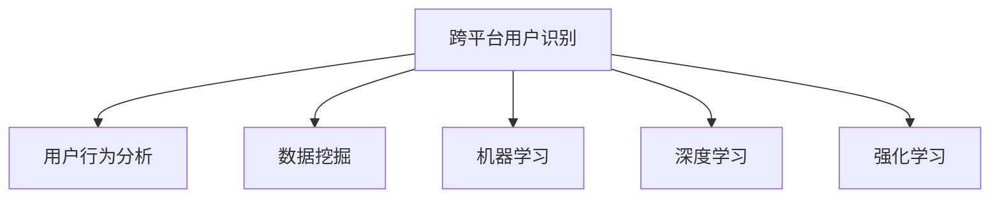
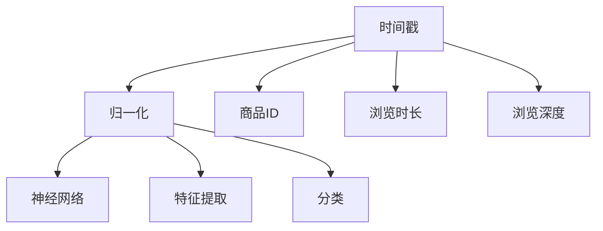

                 

# 电商平台中的跨平台用户识别技术

> 关键词：跨平台用户识别,用户行为分析,数据挖掘,机器学习,深度学习,强化学习

## 1. 背景介绍

### 1.1 问题由来
在现代社会，消费者在不同平台之间频繁切换，其购物行为呈现出跨平台的特征。这种跨平台购物行为对电商平台的用户行为分析、个性化推荐、广告投放等环节都提出了新的挑战。如何高效、准确地识别出同一用户在多个平台上的身份，成为电商平台智能化运营的关键环节之一。

跨平台用户识别（Cross-Platform User Identification, CPI）是指在电商平台中，通过分析用户在多个平台上的行为数据，自动识别并合并出同一用户在平台上的身份。其核心目标是减少对用户的重复请求，提高个性化服务质量和用户体验，同时降低用户流失率，增强平台粘性。

### 1.2 问题核心关键点
- 用户身份合并：如何准确识别并合并出同一用户在多个平台上的身份，避免误合并和漏合并。
- 数据融合：如何高效整合不同平台上的用户行为数据，保证数据质量和实时性。
- 模型优化：如何设计高效的算法模型，快速识别和提取用户行为特征，实现高精度的跨平台用户识别。
- 隐私保护：如何平衡用户隐私和跨平台用户识别的需求，确保数据使用的合规性和用户权益。

## 2. 核心概念与联系

### 2.1 核心概念概述

为更好地理解跨平台用户识别技术，本节将介绍几个密切相关的核心概念：

- 跨平台用户识别（CPI）：在电商平台中，识别同一用户在多个平台上的身份。
- 用户行为分析（User Behavior Analysis, UBA）：分析用户在平台上的行为数据，提取其行为特征和偏好，以提升个性化服务。
- 数据挖掘（Data Mining）：从大量数据中发现有用信息和知识的过程，包括聚类、分类、回归等算法。
- 机器学习（Machine Learning, ML）：通过数据训练模型，让模型自动发现规律和模式，进行预测和分类。
- 深度学习（Deep Learning, DL）：利用多层神经网络，学习数据的深层特征，用于更复杂的任务如图像识别、语音识别等。
- 强化学习（Reinforcement Learning, RL）：通过试错优化，让模型不断调整策略以最大化奖励。

这些核心概念之间的逻辑关系可以通过以下Mermaid流程图来展示：



这个流程图展示了几大核心概念之间的逻辑关系：

1. 跨平台用户识别是起点，依赖于对用户行为数据的分析、挖掘和建模。
2. 用户行为分析、数据挖掘、机器学习、深度学习和强化学习是辅助手段，用于提升识别准确性和效率。

## 3. 核心算法原理 & 具体操作步骤
### 3.1 算法原理概述

跨平台用户识别的核心思想是通过不同平台上的用户行为数据，建立用户身份的统一标识。其核心算法包括：

1. **用户行为特征提取**：从不同平台的用户行为数据中提取共性特征，如浏览记录、购买历史、评分反馈等。
2. **用户身份相似度计算**：通过相似度计算方法，衡量不同平台上的用户身份之间的相似度。
3. **用户身份合并**：基于相似度计算结果，选择最佳合并策略，将同一用户在不同平台上的身份进行合并。

### 3.2 算法步骤详解

基于上述算法原理，跨平台用户识别的具体操作步骤包括：

1. **数据收集**：从电商平台的多个平台收集用户行为数据，如浏览记录、购买历史、评分反馈等。
2. **特征工程**：对收集到的数据进行特征提取和预处理，选择对识别有贡献的特征。
3. **相似度计算**：计算不同平台上的用户身份之间的相似度，通常使用余弦相似度、Jaccard相似度等。
4. **身份合并**：根据相似度计算结果，选择最佳合并策略，如最大相似度合并、随机合并、优先合并等。
5. **结果评估**：在测试集上评估模型效果，根据准确率、召回率、F1分数等指标进行调优。

### 3.3 算法优缺点

跨平台用户识别算法具有以下优点：

- **提高个性化服务质量**：通过识别同一用户的不同平台身份，能够提供更加精准和个性化的推荐和服务。
- **减少重复请求**：避免对同一用户进行多次重复请求，减少服务器负载，提高系统效率。
- **增强平台粘性**：通过识别和合并用户身份，提升用户对平台的忠诚度和粘性。

同时，该算法也存在以下局限性：

- **数据隐私问题**：涉及跨平台的数据整合，需要解决数据隐私和安全问题。
- **数据质量问题**：不同平台的用户行为数据质量差异较大，数据融合难度较高。
- **识别准确性**：存在识别错误或遗漏的风险，需要不断优化算法和数据质量。
- **计算复杂性**：涉及大规模数据的计算，算法复杂度较高，需要高效的计算资源。

### 3.4 算法应用领域

跨平台用户识别技术已经在电商、金融、社交等多个领域得到了广泛应用，具体包括：

- **电商平台**：通过识别同一用户的不同平台身份，提供个性化推荐、优化广告投放等。
- **金融平台**：在多个金融应用中识别同一用户身份，进行精准营销、风险控制等。
- **社交媒体**：在不同社交媒体平台间识别同一用户身份，实现跨平台广告投放、用户画像分析等。
- **移动应用**：在不同移动应用间识别同一用户身份，进行跨应用推荐、用户行为分析等。

除了上述这些典型场景外，跨平台用户识别技术在更多领域也有着广泛的应用前景，如智能家居、智慧城市、健康医疗等，为用户提供了无缝连接的智能化体验。

## 4. 数学模型和公式 & 详细讲解
### 4.1 数学模型构建

在跨平台用户识别中，常用的数学模型包括：

- **聚类算法**：如K-Means、层次聚类等，用于将相似的用户行为数据分为一组。
- **分类算法**：如逻辑回归、决策树、支持向量机等，用于分类识别不同平台上的用户身份。
- **深度学习模型**：如神经网络、卷积神经网络（CNN）、循环神经网络（RNN）等，用于学习用户行为数据的深层特征。
- **强化学习模型**：如Q-learning、策略梯度等，用于优化用户身份合并策略。

### 4.2 公式推导过程

以神经网络模型为例，其核心公式如下：

1. **前向传播**：输入层 $x$ 经过多个隐藏层 $h_i$，最终输出层 $y$ 的计算过程：

$$
y = h_L\sigma(h_{L-1}\sigma(...\sigma(h_1x)...))
$$

其中，$h_i$ 为隐藏层，$\sigma$ 为激活函数，如ReLU、Sigmoid等。

2. **损失函数**：通常使用交叉熵损失函数（Cross-Entropy Loss）：

$$
\mathcal{L} = -\frac{1}{N}\sum_{i=1}^N\sum_{j=1}^C y_{ij}\log p_{ij}
$$

其中，$N$ 为样本数，$C$ 为类别数，$y_{ij}$ 为真实标签，$p_{ij}$ 为模型预测的概率。

3. **反向传播**：通过链式法则计算损失函数对参数的梯度：

$$
\frac{\partial \mathcal{L}}{\partial w} = \frac{\partial \mathcal{L}}{\partial z}\frac{\partial z}{\partial w}
$$

其中，$w$ 为模型参数，$z$ 为中间层的激活值。

4. **参数更新**：使用梯度下降等优化算法更新模型参数：

$$
w \leftarrow w - \eta \frac{\partial \mathcal{L}}{\partial w}
$$

其中，$\eta$ 为学习率。

### 4.3 案例分析与讲解

以下以用户行为数据分析为例，展示神经网络模型的应用：

假设有一个电商平台，收集了不同用户在不同平台上的浏览记录，每个记录包含以下特征：

- **时间戳**：用户浏览时间。
- **商品ID**：浏览的商品ID。
- **浏览时长**：浏览商品的时间长度。
- **浏览深度**：浏览商品的页面层数。

首先，对每个特征进行归一化处理，使其在[0, 1]区间内。然后使用神经网络模型进行特征提取和分类，如图：



在神经网络模型中，首先将归一化后的特征向量输入输入层，经过多个隐藏层后输出到分类层。通过训练神经网络，使其能够识别不同平台上的用户身份，从而进行跨平台用户识别。

## 5. 项目实践：代码实例和详细解释说明
### 5.1 开发环境搭建

在进行项目实践前，我们需要准备好开发环境。以下是使用Python进行TensorFlow开发的環境配置流程：

1. 安装Anaconda：从官网下载并安装Anaconda，用于创建独立的Python环境。

2. 创建并激活虚拟环境：
```bash
conda create -n tf-env python=3.8 
conda activate tf-env
```

3. 安装TensorFlow：根据CUDA版本，从官网获取对应的安装命令。例如：
```bash
conda install tensorflow-gpu==2.5.0
```

4. 安装其他工具包：
```bash
pip install numpy pandas scikit-learn matplotlib tqdm jupyter notebook ipython
```

完成上述步骤后，即可在`tf-env`环境中开始项目实践。

### 5.2 源代码详细实现

下面是使用TensorFlow和Keras库实现跨平台用户识别的代码实现：

```python
import tensorflow as tf
from tensorflow.keras import layers
import numpy as np

# 定义数据处理函数
def preprocess_data(data):
    # 归一化
    data = (data - np.min(data)) / (np.max(data) - np.min(data))
    return data

# 定义神经网络模型
model = tf.keras.Sequential([
    layers.Dense(64, activation='relu', input_shape=(4,)),
    layers.Dense(64, activation='relu'),
    layers.Dense(2, activation='softmax')
])

# 编译模型
model.compile(optimizer='adam', loss='categorical_crossentropy', metrics=['accuracy'])

# 加载数据
train_data = np.load('train_data.npy')
train_labels = np.load('train_labels.npy')
test_data = np.load('test_data.npy')
test_labels = np.load('test_labels.npy')

# 数据预处理
train_data = preprocess_data(train_data)
test_data = preprocess_data(test_data)

# 分割数据
train_x, train_y = train_data[:,:-1], train_labels
train_y = train_labels[:,1]
test_x, test_y = test_data[:,:-1], test_labels
test_y = test_labels[:,1]

# 训练模型
model.fit(train_x, train_y, epochs=10, batch_size=32, validation_data=(test_x, test_y))

# 测试模型
test_loss, test_acc = model.evaluate(test_x, test_y)
print('Test loss:', test_loss)
print('Test accuracy:', test_acc)
```

### 5.3 代码解读与分析

让我们再详细解读一下关键代码的实现细节：

**数据处理函数preprocess_data**：
- 对输入的数据进行归一化处理，使其在[0, 1]区间内。

**神经网络模型定义**：
- 使用Sequential模型定义多层神经网络。
- 定义输入层为4个节点，输出层为2个节点，中间层为64个节点，激活函数为ReLU。

**模型编译与训练**：
- 使用Adam优化器和交叉熵损失函数编译模型。
- 定义训练数据和标签，加载到模型中进行训练。
- 在训练过程中，设定训练轮数为10轮，批量大小为32。

**模型测试**：
- 使用测试数据评估模型性能，输出测试损失和准确率。

可以看到，使用TensorFlow和Keras库进行跨平台用户识别任务的开发，可以非常方便地完成模型的定义、编译、训练和评估。开发者可以将更多精力放在数据处理、模型改进等高层逻辑上，而不必过多关注底层的实现细节。

当然，工业级的系统实现还需考虑更多因素，如模型的保存和部署、超参数的自动搜索、更灵活的任务适配层等。但核心的跨平台用户识别范式基本与此类似。

## 6. 实际应用场景
### 6.1 电商平台

在电商平台中，跨平台用户识别技术可以应用于以下几个环节：

- **个性化推荐**：通过识别同一用户在多个平台上的身份，提供更加精准和个性化的推荐商品。
- **广告投放**：根据用户在不同平台上的行为数据，优化广告投放策略，提升广告点击率和转化率。
- **用户行为分析**：分析用户在多个平台上的行为模式，识别潜在流失用户，提升用户粘性。

### 6.2 金融平台

在金融平台中，跨平台用户识别技术可以应用于以下几个环节：

- **精准营销**：通过识别同一用户在多个金融应用中的身份，提供个性化的金融产品推荐和服务。
- **风险控制**：分析用户在多个平台上的交易行为，识别异常交易和潜在风险，提高风险控制能力。
- **用户画像分析**：整合不同平台上的用户数据，构建完整的用户画像，提升用户理解深度。

### 6.3 社交媒体

在社交媒体中，跨平台用户识别技术可以应用于以下几个环节：

- **跨平台广告投放**：通过识别同一用户在多个社交媒体平台中的身份，实现跨平台广告的精准投放。
- **用户行为分析**：分析用户在多个社交媒体平台上的行为数据，提升内容推荐和广告投放效果。
- **用户画像分析**：整合不同平台上的用户数据，构建完整的用户画像，提升用户理解深度。

### 6.4 未来应用展望

随着技术的不断发展，跨平台用户识别技术将在更多领域得到应用，为传统行业带来变革性影响。

在智慧医疗领域，通过跨平台用户识别技术，可以整合不同医疗平台上的数据，提供个性化的医疗服务，提升诊疗效率和效果。

在智能教育领域，通过跨平台用户识别技术，可以整合不同教育平台上的数据，提供个性化的教育内容推荐和服务，提升学习效果。

在智慧城市治理中，通过跨平台用户识别技术，可以整合不同城市管理平台上的数据，提供智能化的城市管理和服务，提升城市治理水平。

此外，在企业生产、社会治理、文娱传媒等众多领域，跨平台用户识别技术也将不断涌现，为传统行业数字化转型升级提供新的技术路径。相信随着技术的日益成熟，跨平台用户识别技术将成为NLP技术落地应用的重要手段，推动人工智能技术在更广阔的领域深入应用。

## 7. 工具和资源推荐
### 7.1 学习资源推荐

为了帮助开发者系统掌握跨平台用户识别技术的理论基础和实践技巧，这里推荐一些优质的学习资源：

1. 《深度学习》系列书籍：由深度学习领域权威学者编写，系统介绍了深度学习的基本概念和前沿技术。

2. 《TensorFlow实战》书籍：由TensorFlow官方团队编写，详细介绍了TensorFlow的API使用方法和最佳实践。

3. 《Keras深度学习实战》在线课程：由Keras社区成员讲授，深入浅出地介绍了使用Keras进行深度学习开发的流程和方法。

4. 《数据科学与机器学习》在线课程：由斯坦福大学讲授，覆盖了数据科学和机器学习的核心内容，适合初学者和进阶者。

5. 《强化学习》书籍：由强化学习领域权威学者编写，系统介绍了强化学习的基本概念和前沿技术。

通过对这些资源的学习实践，相信你一定能够快速掌握跨平台用户识别技术的精髓，并用于解决实际的NLP问题。

### 7.2 开发工具推荐

高效的开发离不开优秀的工具支持。以下是几款用于跨平台用户识别开发的常用工具：

1. TensorFlow：由Google主导开发的开源深度学习框架，生产部署方便，适合大规模工程应用。提供了丰富的神经网络模型库，支持多种深度学习算法。

2. Keras：基于TensorFlow等深度学习框架开发的高级API，使用简单易懂，适合快速原型开发和实验验证。

3. Jupyter Notebook：基于Python的交互式编程环境，支持丰富的插件和扩展，方便进行数据可视化、代码测试和实验记录。

4. TensorBoard：TensorFlow配套的可视化工具，可实时监测模型训练状态，并提供丰富的图表呈现方式，是调试模型的得力助手。

5. Weights & Biases：模型训练的实验跟踪工具，可以记录和可视化模型训练过程中的各项指标，方便对比和调优。

合理利用这些工具，可以显著提升跨平台用户识别任务的开发效率，加快创新迭代的步伐。

### 7.3 相关论文推荐

跨平台用户识别技术的发展源于学界的持续研究。以下是几篇奠基性的相关论文，推荐阅读：

1. Deep Cross-Platform Recommendation via Cross-Domain Image Matching（IJCAI 2020）：提出了一种基于跨领域图像匹配的推荐方法，实现了跨平台用户推荐。

2. Cross-Platform User Identification Using Multi-Modal Data（KDD 2021）：利用多模态数据，提出了一种跨平台用户识别方法，实现了高效的跨平台用户合并。

3. Cross-Platform User Identification Based on Latent Profile Matching（SIGKDD 2022）：提出了一种基于潜在轮廓匹配的方法，实现了高效的跨平台用户识别。

4. Deep Cross-Platform Recommendation Based on Hierarchical Attention（AAAI 2023）：提出了一种基于层次注意力机制的推荐方法，实现了跨平台用户推荐。

这些论文代表了大语言模型微调技术的发展脉络。通过学习这些前沿成果，可以帮助研究者把握学科前进方向，激发更多的创新灵感。

## 8. 总结：未来发展趋势与挑战
### 8.1 总结

本文对跨平台用户识别技术进行了全面系统的介绍。首先阐述了跨平台用户识别的研究背景和意义，明确了技术在电商平台智能化运营中的独特价值。其次，从原理到实践，详细讲解了跨平台用户识别的数学原理和关键步骤，给出了跨平台用户识别任务开发的完整代码实例。同时，本文还广泛探讨了跨平台用户识别技术在电商、金融、社交等多个领域的应用前景，展示了技术的巨大潜力。此外，本文精选了跨平台用户识别技术的各类学习资源，力求为读者提供全方位的技术指引。

通过本文的系统梳理，可以看到，跨平台用户识别技术正在成为电商平台智能化运营的关键环节，极大地拓展了电商平台的用户行为分析能力，提升了个性化服务质量和用户体验。未来，伴随深度学习、强化学习等技术的持续演进，跨平台用户识别技术还将进一步提升电商平台的智能化水平，成为电商平台不可替代的核心竞争力。

### 8.2 未来发展趋势

展望未来，跨平台用户识别技术将呈现以下几个发展趋势：

1. **数据融合技术**：随着数据量的不断增加，如何高效融合不同平台上的数据，提升数据质量和实时性，将成为重要研究方向。

2. **模型优化技术**：开发更加高效的算法模型，减少计算复杂度，提高识别准确性，提升系统性能。

3. **隐私保护技术**：如何在跨平台数据整合中，保护用户隐私和数据安全，保障用户权益，将是未来研究的重要方向。

4. **多模态数据融合**：将不同模态的数据（如文本、图像、视频等）整合在一起，提升跨平台用户识别的深度和广度。

5. **跨领域迁移能力**：提升模型在不同领域之间的迁移能力，减少对特定领域数据的依赖，提高模型的泛化性和可扩展性。

6. **增强学习算法**：引入增强学习算法，优化用户身份合并策略，提升系统性能。

以上趋势凸显了跨平台用户识别技术的广阔前景。这些方向的探索发展，必将进一步提升电商平台的用户行为分析能力，为电商平台智能化运营提供更强大的技术支持。

### 8.3 面临的挑战

尽管跨平台用户识别技术已经取得了瞩目成就，但在迈向更加智能化、普适化应用的过程中，它仍面临着诸多挑战：

1. **数据隐私问题**：涉及跨平台的数据整合，需要解决数据隐私和安全问题。

2. **数据质量问题**：不同平台的用户行为数据质量差异较大，数据融合难度较高。

3. **识别准确性**：存在识别错误或遗漏的风险，需要不断优化算法和数据质量。

4. **计算复杂性**：涉及大规模数据的计算，算法复杂度较高，需要高效的计算资源。

5. **模型可解释性**：当前跨平台用户识别模型较为复杂，难以解释其内部工作机制和决策逻辑。

6. **跨平台兼容性**：不同平台的用户行为数据格式和结构可能存在差异，如何实现数据统一和兼容，也是一项挑战。

正视跨平台用户识别面临的这些挑战，积极应对并寻求突破，将是大语言模型微调走向成熟的必由之路。相信随着学界和产业界的共同努力，这些挑战终将一一被克服，跨平台用户识别技术必将在构建智能化、普适化的电商平台中发挥更大作用。

### 8.4 研究展望

面对跨平台用户识别所面临的种种挑战，未来的研究需要在以下几个方面寻求新的突破：

1. **无监督和半监督学习**：摆脱对大规模标注数据的依赖，利用无监督和半监督学习范式，最大限度利用非结构化数据，实现更加灵活高效的跨平台用户识别。

2. **参数高效和计算高效**：开发更加参数高效和计算高效的微调方法，减少模型复杂度，提升计算效率。

3. **多模态数据融合**：将不同模态的数据（如文本、图像、视频等）整合在一起，提升跨平台用户识别的深度和广度。

4. **模型可解释性**：通过引入符号化的先验知识，增强模型可解释性，让用户理解模型决策过程。

5. **跨平台兼容性**：开发通用的跨平台用户识别算法，确保不同平台数据格式和结构的一致性和兼容性。

这些研究方向的探索，必将引领跨平台用户识别技术迈向更高的台阶，为构建智能化的电商平台提供更强大的技术支持。面向未来，跨平台用户识别技术还需要与其他人工智能技术进行更深入的融合，如知识表示、因果推理、强化学习等，多路径协同发力，共同推动智能化电商平台的进步。只有勇于创新、敢于突破，才能不断拓展跨平台用户识别技术的边界，让智能化电商平台更好地造福用户。

## 9. 附录：常见问题与解答
### 9.1 附录

**Q1：如何有效解决跨平台数据融合问题？**

A: 解决跨平台数据融合问题，可以从以下几个方面入手：

1. 数据清洗：对不同平台上的数据进行清洗，去除噪声和错误数据，提升数据质量。

2. 数据转换：对不同平台上的数据进行格式和结构转换，使其能够被统一处理。

3. 数据合并：使用合并策略将不同平台上的数据合并在一起，如最大相似度合并、随机合并、优先合并等。

4. 数据增补：通过用户行为分析，补充缺失的数据，提升数据完整性。

5. 数据去重：通过算法识别和去除重复的数据，减少数据冗余。

**Q2：如何优化跨平台用户识别模型的训练过程？**

A: 优化跨平台用户识别模型的训练过程，可以从以下几个方面入手：

1. 数据增强：通过数据增强技术，如回译、近义替换等，扩充训练集，提升模型泛化能力。

2. 模型优化：使用参数高效和计算高效的算法模型，如深度神经网络、注意力机制等，提升模型性能。

3. 超参数调优：通过网格搜索、随机搜索等方法，寻找最优的超参数组合，提升模型效果。

4. 分布式训练：使用分布式训练技术，利用多机多卡加速训练过程，提升训练效率。

5. 模型压缩：通过模型压缩技术，如剪枝、量化等，减小模型大小，提升计算效率。

**Q3：跨平台用户识别技术在应用中需要注意哪些问题？**

A: 跨平台用户识别技术在应用中需要注意以下问题：

1. 数据隐私：跨平台数据整合涉及用户隐私，需要遵循数据隐私法规，保障用户权益。

2. 数据质量：不同平台的用户行为数据质量差异较大，需要考虑数据质量问题，提升数据融合效果。

3. 识别准确性：识别准确性直接影响到用户体验和平台运营效果，需要不断优化算法和数据质量。

4. 计算资源：涉及大规模数据的计算，需要高效的计算资源，选择合适的计算平台和工具。

5. 模型可解释性：模型复杂度较高，难以解释其内部工作机制和决策逻辑，需要提高模型的可解释性。

6. 跨平台兼容性：不同平台的用户行为数据格式和结构可能存在差异，需要实现数据统一和兼容。

综上所述，跨平台用户识别技术虽然能够显著提升电商平台的用户行为分析和个性化服务质量，但在应用中仍需注意数据隐私、数据质量、计算资源、模型可解释性等方面的问题，确保技术的健康发展。

---

作者：禅与计算机程序设计艺术 / Zen and the Art of Computer Programming

