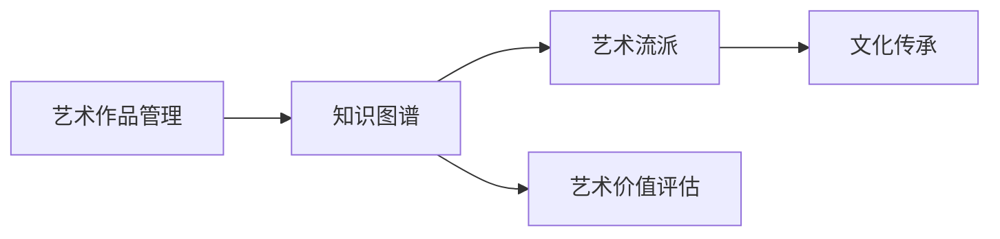
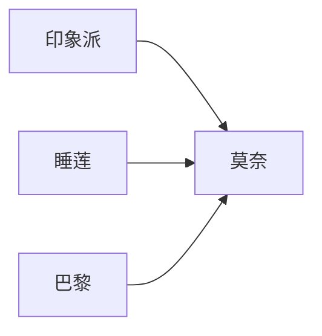

                 

# 知识管理在艺术领域的实践

> 关键词：艺术作品管理, 知识图谱, 艺术流派, 艺术价值评估, 文化传承

## 1. 背景介绍

在数字化时代，如何有效管理并利用庞大的艺术作品集，成为博物馆、艺术机构、以及研究者面临的重要问题。传统的手工档案管理方式费时费力，且易出错。而利用现代信息技术，特别是知识管理技术，可以实现对艺术作品的全面、高效、科学的组织与检索。

### 1.1 问题由来

艺术作品是文化和人类智慧的宝贵遗产，通过数字化的方式对其进行保护和利用，不仅可以促进文化遗产的传承，还能为艺术研究和教育提供更丰富的素材。然而，艺术作品的数量庞大，风格各异，且具有高度复杂性和多样性，使得传统手工管理方式难以满足需求。因此，如何有效管理艺术作品，挖掘其价值，成为亟待解决的难题。

### 1.2 问题核心关键点

该问题的核心在于：
- 如何构建艺术作品的知识图谱，实现对作品的全面描述和分类？
- 如何评估艺术作品的价值，并通过知识管理提升作品的市场和学术价值？
- 如何通过数字化手段，促进艺术作品的传承与文化传播？

## 2. 核心概念与联系

### 2.1 核心概念概述

在艺术领域中，知识管理的核心概念主要包括：

- **艺术作品管理(Artwork Management)**：指对艺术作品进行数字化和结构化处理，实现作品的高效管理和检索。
- **知识图谱(Knowledge Graph)**：通过实体-关系-属性三元组的形式，构建艺术作品的知识结构体系。
- **艺术流派(Artistic Movements)**：指同一时期、风格相近的艺术创作集合，体现艺术发展的阶段性特征。
- **艺术价值评估(Artistic Value Assessment)**：通过模型和算法，对艺术作品的市场价值、学术价值进行量化评估。
- **文化传承(Cultural Heritage Preservation)**：指通过数字化手段，促进艺术作品的传播和历史文化的保存。

这些核心概念之间存在密切联系，共同构成了艺术领域知识管理的完整框架。

### 2.2 核心概念原理和架构的 Mermaid 流程图



这个流程图展示了艺术作品管理的核心流程，从作品管理到知识图谱构建，再到艺术流派的划分、艺术价值评估和文化传承，各个环节相互衔接，共同构成了一个完整的艺术知识管理框架。

## 3. 核心算法原理 & 具体操作步骤

### 3.1 算法原理概述

艺术作品的知识管理主要分为两个阶段：数据准备和知识抽取与挖掘。

**数据准备阶段**：主要通过OCR、图像处理、语义分析等技术，将艺术作品的图像、文字、音频等信息进行数字化处理，并构建元数据信息。

**知识抽取与挖掘阶段**：主要通过自然语言处理(NLP)、图像识别、文本挖掘等技术，从数字化的艺术作品中提取知识信息，构建知识图谱。

### 3.2 算法步骤详解

**Step 1: 数据采集与预处理**

- **数据采集**：从博物馆、美术馆、档案馆等机构，获取艺术作品的数字化资料。包括作品图像、文字说明、作者信息等。
- **数据预处理**：包括图像去噪、颜色校正、文字识别、结构化处理等，使数据符合后续处理要求。

**Step 2: 元数据抽取与构建**

- **元数据抽取**：从原始数据中提取作品的基本信息，如作品名、作者、创作时间、艺术流派等。
- **元数据构建**：使用RDF、JSON-LD等格式，构建艺术作品的元数据信息。

**Step 3: 知识抽取与图谱构建**

- **知识抽取**：使用NLP技术，从文字说明、文献资料中抽取实体、关系和属性，构建艺术作品的知识信息。
- **知识图谱构建**：将提取的知识信息转化为三元组形式，使用OWL、Turtle等格式，构建艺术作品的知识图谱。

**Step 4: 知识抽取与图谱优化**

- **知识抽取优化**：通过模型和算法，对抽取的知识信息进行清洗、校验、合并，避免冗余和错误。
- **图谱优化**：对知识图谱进行实体消歧、关系对齐、属性填充等处理，提升图谱的完整性和准确性。

**Step 5: 艺术价值评估**

- **价值模型构建**：设计价值评估模型，包括市场价值、学术价值、历史价值等维度。
- **价值评估计算**：根据模型和算法，对艺术作品的价值进行量化评估，生成评估报告。

### 3.3 算法优缺点

**优点**：
- 数字化管理：将艺术作品转化为数字形式，便于长期存储和检索。
- 自动化处理：自动化数据采集、预处理、知识抽取等，提升效率。
- 知识图谱：构建艺术作品的知识图谱，实现对作品的全面描述和分类。
- 价值评估：对艺术作品的价值进行量化评估，提升市场和学术价值。

**缺点**：
- 数据隐私：在数据采集和处理过程中，涉及大量个人隐私信息，需要采取严格的隐私保护措施。
- 知识复杂性：艺术作品的复杂性和多样性，使得知识抽取和图谱构建面临挑战。
- 模型局限：艺术价值的评估模型尚未成熟，需要更多实际案例的验证和优化。

### 3.4 算法应用领域

艺术作品的知识管理技术广泛应用于以下几个领域：

- **博物馆和美术馆**：通过知识管理技术，实现对艺术作品的数字化管理和展示，提升参观体验。
- **艺术研究机构**：通过知识图谱和价值评估，促进艺术作品的研究和教育。
- **艺术市场**：通过市场价值评估，提升艺术作品的市场价值，促进艺术交易。
- **文化遗产保护**：通过数字化手段，保护和传承艺术作品，促进文化遗产的传播。

## 4. 数学模型和公式 & 详细讲解 & 举例说明

### 4.1 数学模型构建

知识图谱的构建可以通过三元组形式表达，即 $(g, r, o)$，其中 $g$ 为图形节点，$r$ 为关系，$o$ 为对象节点。

### 4.2 公式推导过程

以艺术作品的知识图谱为例，假设 $g$ 为艺术作品节点，$r$ 为关系节点，$o$ 为属性节点。根据实体-关系-属性三元组，构建知识图谱的数学模型如下：

$$
\mathcal{G} = (N, E, R)
$$

其中，$N$ 为节点集合，$E$ 为边集合，$R$ 为关系集合。

### 4.3 案例分析与讲解

以莫奈的《睡莲》为例，我们可以构建其知识图谱：



在这个知识图谱中，莫奈、《睡莲》、印象派、巴黎之间建立了关系。这种基于关系的知识结构，可以方便地进行查询和推理。

## 5. 项目实践：代码实例和详细解释说明

### 5.1 开发环境搭建

1. **安装 Python 环境**：
   - 下载并安装 Python 3.x。
   - 使用虚拟环境（如 `conda` 或 `virtualenv`）创建独立环境。

2. **安装相关包**：
   - `pip install pandas numpy scikit-learn`

3. **数据准备**：
   - 获取艺术作品的数字化资料，包括图像、文字、音频等。
   - 使用图像处理工具（如 OpenCV）对图像进行预处理。

### 5.2 源代码详细实现

以下是一个简单的 Python 代码示例，展示如何构建艺术作品的元数据信息：

```python
import pandas as pd

# 从 CSV 文件中读取艺术作品信息
data = pd.read_csv('artworks.csv')

# 构建元数据字典
metadata = {}
for row in data.itertuples():
    metadata[row.name] = {
        'title': row.title,
        'artist': row.artist,
        'creation_date': row.creation_date,
        'movement': row.movement
    }

# 保存元数据字典为 JSON 格式
with open('metadata.json', 'w') as f:
    json.dump(metadata, f, indent=4)
```

### 5.3 代码解读与分析

**代码解释**：
- 首先使用 `pandas` 库读取 CSV 文件，将艺术作品的基本信息加载到 DataFrame 中。
- 通过遍历 DataFrame 的每一行，构建元数据字典。
- 最后将元数据字典保存为 JSON 文件，方便后续处理。

**代码分析**：
- 代码实现了艺术作品的基本信息提取和构建，为后续知识管理提供了数据基础。
- 数据格式转换（从 CSV 到 JSON）是关键步骤，需要确保数据格式的正确性。
- 元数据信息的选择需要根据具体需求进行，可以包括更多属性（如尺寸、材料等）。

### 5.4 运行结果展示

运行上述代码后，得到 JSON 格式的元数据文件，可以用 Python 继续读取并进一步处理。

## 6. 实际应用场景

### 6.1 博物馆和美术馆

在博物馆和美术馆中，利用知识管理技术可以实现以下应用：
- **作品检索**：通过输入关键词，快速找到对应的艺术作品。
- **作品展览**：根据作品的风格、流派、作者等信息，推荐展出作品。
- **互动展览**：通过增强现实（AR）技术，增强参观体验。

### 6.2 艺术研究机构

艺术研究机构可以利用知识管理技术进行以下研究：
- **作品比较研究**：通过知识图谱，比较不同作品之间的关系和影响。
- **艺术史研究**：利用历史数据，研究艺术发展的脉络和趋势。
- **教育应用**：将艺术作品和知识图谱作为教学资源，提升艺术教育水平。

### 6.3 艺术市场

在艺术市场中，知识管理技术可以用于以下应用：
- **价值评估**：对艺术作品进行价值评估，提供市场参考。
- **艺术交易**：通过价值评估结果，促进艺术交易。
- **收藏管理**：通过数字化手段，管理艺术收藏品的数量和状态。

### 6.4 文化遗产保护

知识管理技术在文化遗产保护中的应用包括：
- **数字化档案**：对文化遗产进行数字化，实现长期保存。
- **文化传播**：通过数字化手段，促进文化遗产的传播和教育。
- **保护修复**：利用数字化信息，指导文物保护和修复工作。

## 7. 工具和资源推荐

### 7.1 学习资源推荐

1. **《知识管理概论》**：介绍知识管理的概念、原理和方法。
2. **《艺术史》**：涵盖艺术发展的历史和重要作品。
3. **Coursera 和 edX 课程**：提供艺术管理和知识图谱构建的在线课程。
4. **GitHub 开源项目**：参考一些艺术作品管理系统的开源代码。
5. **Hugging Face 文档**：学习 NLP 和知识抽取相关技术。

### 7.2 开发工具推荐

1. **Python**：支持强大的 NLP 和知识图谱处理。
2. **OWL 和 RDF**：用于构建和查询知识图谱。
3. **Turtle 和 SPARQL**：用于查询和更新知识图谱。
4. **Jupyter Notebook**：支持交互式编程和数据可视化。
5. **TensorBoard**：可视化模型的训练和推理过程。

### 7.3 相关论文推荐

1. **《知识图谱技术与应用》**：介绍知识图谱的构建和应用。
2. **《艺术作品管理与检索》**：介绍艺术作品数字化和知识管理技术。
3. **《自然语言处理在艺术中的应用》**：介绍 NLP 技术在艺术作品管理中的应用。

## 8. 总结：未来发展趋势与挑战

### 8.1 研究成果总结

本文详细介绍了知识管理在艺术领域的实践，通过数据准备、元数据抽取、知识图谱构建、艺术价值评估等步骤，实现对艺术作品的全面管理和利用。

### 8.2 未来发展趋势

未来，知识管理在艺术领域的发展趋势包括：
- **自动化与智能化**：利用 AI 技术，提升自动化处理和智能化推理能力。
- **多模态融合**：结合图像、视频、音频等多模态信息，构建更全面的艺术作品知识图谱。
- **跨领域融合**：与博物馆学、考古学、历史学等领域进行跨学科融合，提升研究深度和广度。

### 8.3 面临的挑战

知识管理在艺术领域面临的挑战包括：
- **数据隐私**：在数据采集和处理过程中，需要严格保护隐私。
- **知识复杂性**：艺术作品的复杂性和多样性，使得知识抽取和图谱构建面临挑战。
- **价值评估模型**：艺术价值的评估模型尚未成熟，需要更多实际案例的验证和优化。

### 8.4 研究展望

未来，在艺术领域知识管理的研究展望包括：
- **大规模数据处理**：构建大规模艺术作品数据集，进行数据分析和挖掘。
- **模型优化与改进**：优化知识抽取和图谱构建模型，提升准确性和效率。
- **跨学科应用**：将知识管理技术应用于其他领域，如历史、文学、建筑等，促进跨学科研究。

## 9. 附录：常见问题与解答

**Q1: 什么是知识图谱？**
A: 知识图谱是一种语义化的知识表示方法，通过实体-关系-属性三元组的形式，构建知识结构体系。

**Q2: 如何构建艺术作品的知识图谱？**
A: 首先通过 NLP 技术抽取实体、关系和属性，然后使用 OWL、Turtle 等格式构建知识图谱。

**Q3: 艺术价值评估如何计算？**
A: 通过构建价值评估模型，包括市场价值、学术价值、历史价值等维度，对艺术作品进行量化评估。

**Q4: 如何保护艺术作品数据隐私？**
A: 在数据采集和处理过程中，采取严格的隐私保护措施，如匿名化、去标识化等。

**Q5: 如何提高知识图谱的准确性？**
A: 通过模型和算法对抽取的知识信息进行清洗、校验、合并，避免冗余和错误。

---

作者：禅与计算机程序设计艺术 / Zen and the Art of Computer Programming

