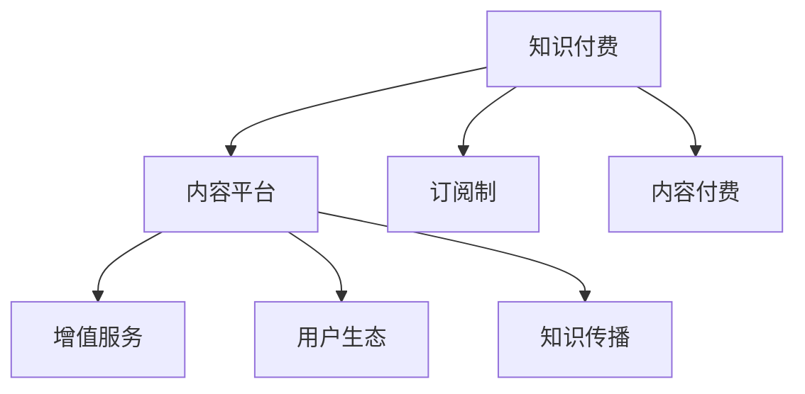

                 

# 知识经济时代下的知识付费创新商业模式运营

> 关键词：知识付费,商业模式创新,运营策略,知识经济,用户需求,订阅制,内容付费,增值服务

## 1. 背景介绍

### 1.1 问题由来
在知识经济时代，信息的爆炸和更新速度的加快使得知识的获取变得越来越重要。面对海量的信息，人们需要花费更多的时间和精力来筛选、学习、应用这些知识。与此同时，信息的不对等和误导问题也越来越突出，导致社会对高质量、可靠、高效的知识获取方式的需求日益增加。知识付费作为一种新兴的商业模式，通过收费模式为优质内容提供保障，同时能够激发内容的创造与传播，正逐渐成为知识获取的主要方式之一。

### 1.2 问题核心关键点
知识付费商业模式的核心在于如何构建一个可持续、高质量、有吸引力的知识获取和分享平台，实现知识创作者和消费者的共赢。具体问题包括：
- 如何吸引和留住知识消费者，确保其持续支付费用？
- 如何激励知识创作者产生高质量内容？
- 如何构建和维护平台的用户生态系统，促进内容流通？
- 如何平衡知识创作者的权益和平台的商业利益？

### 1.3 问题研究意义
研究知识付费商业模式，对于推动知识经济的健康发展，提高社会整体的知识素养，以及促进相关产业的创新具有重要意义：

1. **提高知识获取效率**：知识付费平台的出现，使得知识消费者可以快速、准确地找到所需的信息，减少筛选成本，提升知识获取效率。
2. **激发知识创作热情**：知识付费为创作者提供了稳定的收入来源，鼓励更多有价值、高质量的内容生产，从而丰富知识库。
3. **促进知识传播和普及**：知识付费平台成为知识传播的重要渠道，有助于知识的广泛传播和普及，缩小信息鸿沟。
4. **推动相关产业升级**：知识付费商业模式的成功，有助于推动教育、出版、咨询等传统知识行业向数字化、智能化转型。
5. **增强用户粘性**：通过不断优化用户体验和增加服务价值，提升用户对平台的依赖度和粘性，确保平台的持续发展。

## 2. 核心概念与联系

### 2.1 核心概念概述

为更好地理解知识付费商业模式，本节将介绍几个密切相关的核心概念：

- **知识付费 (Knowledge Subscription)：** 一种新兴的商业模式，通过收取用户付费来获取优质内容，同时为知识创作者提供稳定的收入。
- **内容平台 (Content Platform)：** 提供知识内容并支持用户订阅、付费、交互的平台，如Coursera、Udemy等。
- **订阅制 (Subscription Model)：** 用户定期支付固定费用，以获取平台内所有或部分内容的商业模式。
- **内容付费 (Content Pay-Per-View)：** 用户按需支付每次内容观看、阅读或使用的费用的商业模式。
- **增值服务 (Value-Added Services)：** 平台提供除基础内容外，如课程认证、专属导师、学习社群等增值服务，增强用户体验和粘性。
- **用户生态 (User Ecosystem)：** 平台内部形成的用户、创作者、合作伙伴之间的良性互动和关系网络。
- **知识传播 (Knowledge Dissemination)：** 通过知识付费平台，知识内容能够得到更广泛、更有效的传播，提升知识的流通性和普及度。

这些核心概念之间的逻辑关系可以通过以下Mermaid流程图来展示：



这个流程图展示了一个知识付费平台的内部关系：

1. 知识付费平台为用户提供订阅制或内容付费两种付费方式。
2. 平台提供增值服务，增强用户粘性。
3. 用户、创作者和合作伙伴共同构建平台的用户生态系统。
4. 通过内容平台，知识内容能够被更有效地传播和普及。

## 3. 核心算法原理 & 具体操作步骤
### 3.1 算法原理概述

知识付费商业模式基于订阅制和内容付费两种核心商业模式，其核心算法原理涉及以下几个方面：

- **订阅模型算法：** 用户在一定周期内支付固定费用，平台为其提供平台内所有或部分内容。订阅模型的关键在于制定合理的收费标准，同时提供多样化的内容选择。
- **内容推荐算法：** 平台通过数据分析和机器学习算法，为用户推荐最相关、最感兴趣的内容，提高用户体验和满意度。
- **用户行为分析算法：** 平台利用数据挖掘和用户行为分析技术，了解用户偏好和需求，优化内容和推荐策略，提升用户留存率和付费意愿。
- **版权保护算法：** 平台通过技术手段（如版权标识、水印、区块链等）保护内容版权，防止盗版和侵权行为。

### 3.2 算法步骤详解

以下是一个典型的订阅制知识付费平台的设计流程：

1. **用户注册和订阅**：用户通过平台注册账号，选择合适的订阅计划，支付费用，开始享受平台内容。
2. **内容上架和管理**：知识创作者将内容上传到平台，通过审核后上架，供用户消费。
3. **内容推荐系统**：平台使用推荐算法，根据用户的历史行为和偏好，为用户推荐相关内容，增加用户粘性。
4. **用户行为分析**：平台通过数据分析技术，监测用户的行为和反馈，优化内容和推荐策略。
5. **版权保护**：平台使用技术手段，如数字水印、区块链等，保护内容版权，防止盗版和侵权。
6. **增值服务提供**：平台提供诸如课程认证、专属导师、学习社群等增值服务，提升用户体验和满意度。
7. **平台运营和维护**：平台定期更新内容和功能，处理用户投诉和纠纷，确保平台稳定运行。

### 3.3 算法优缺点

知识付费商业模式具有以下优点：
1. **用户粘性高**：通过高质量内容和增值服务，提高用户对平台的依赖度。
2. **内容质量有保障**：平台对内容进行严格审核和筛选，保证内容的高质量。
3. **收入稳定**：订阅制和内容付费提供稳定的收入来源，减少平台的运营风险。

同时，该模式也存在一些局限性：
1. **用户门槛高**：对于经济能力有限的消费者，订阅制和内容付费模式可能存在一定的门槛。
2. **内容丰富度不足**：平台难以完全覆盖所有领域的知识，部分热门或小众领域可能缺乏相关内容。
3. **用户体验有待提升**：内容推荐和个性化服务需不断优化，提升用户体验。

### 3.4 算法应用领域

知识付费商业模式在多个领域得到了广泛应用：

- **教育培训**：如Coursera、Udemy等平台，提供各类在线课程，涵盖从基础到专业，从技能培训到学历教育等多个层面。
- **专业咨询**：如LinkedIn Learning，提供商业、技术、管理等方面的专业课程和认证。
- **兴趣学习**：如Udacity，提供编程、设计、数据科学等领域的兴趣课程和项目。
- **健康医疗**：如Khan Academy，提供各类健康医疗知识科普和实操课程。
- **文艺娱乐**：如Netflix，提供影视、音乐、文学等多种形式的原创内容和经典作品。

## 4. 数学模型和公式 & 详细讲解 & 举例说明（备注：数学公式请使用latex格式，latex嵌入文中独立段落使用 $$，段落内使用 $)
### 4.1 数学模型构建

本节将使用数学语言对知识付费商业模式进行更加严格的刻画。

假设知识付费平台拥有 $N$ 个用户，每个用户订阅 $M$ 种内容，支付费用为 $C$，平台每月收入为 $R$。令用户订阅内容的平均长度为 $L$，内容单价为 $P$，平台每月的运营成本为 $O$。

**订阅模型算法：** 设用户订阅计划 $S=\{s_1, s_2, ..., s_N\}$，其中 $s_i$ 为第 $i$ 个用户的订阅计划，包括订阅内容数量 $n_i$ 和订阅时长 $t_i$，则平台每月收入 $R$ 为：

$$
R = \sum_{i=1}^N C_i = \sum_{i=1}^N n_i t_i P
$$

**内容推荐算法：** 设内容库包含 $C$ 种内容，用户对内容的访问概率为 $p_i$，则平台的日访问量为：

$$
V = \sum_{i=1}^N p_i = \sum_{i=1}^N n_i t_i \cdot L
$$

**用户行为分析算法：** 设用户行为数据为 $D$，平台使用数据挖掘和机器学习算法，分析用户行为数据，得到用户对内容的偏好 $o_i$，则内容推荐模型的优化目标为：

$$
\min_{o_i} \sum_{i=1}^N (o_i - p_i)^2
$$

**版权保护算法：** 设版权保护的边际成本为 $k$，则平台总成本 $O$ 为：

$$
O = O_b + k \cdot L
$$

其中 $O_b$ 为平台基本运营成本。

### 4.2 公式推导过程

以下我们以订阅模型算法为例，推导计算公式。

假设平台每月有 $N$ 个用户订阅，每个用户订阅 $m$ 种内容，支付费用为 $c$，平台每月的收入为 $R$。

设用户订阅内容的平均长度为 $l$，内容单价为 $p$，平台每月的运营成本为 $O$，则平台每月收入 $R$ 为：

$$
R = N \cdot m \cdot p
$$

每月运营成本 $O$ 包括固定成本 $O_f$ 和变动成本 $O_v$，其中变动成本为每条内容长度 $l$ 乘以每条内容的版权保护成本 $k$：

$$
O = O_f + k \cdot l \cdot N \cdot m
$$

则平台每月的利润 $P$ 为：

$$
P = R - O = N \cdot m \cdot p - O_f - k \cdot l \cdot N \cdot m
$$

为了最大化利润，需要优化订阅内容和费用，即找到最优订阅内容和费用的组合 $(m^*, p^*)$。假设用户订阅内容的平均长度为常数，则：

$$
P = m^*(p^* - k \cdot l) - O_f
$$

可以看出，当 $p^* = k \cdot l$ 时，利润最大化。即平台的内容单价应等于版权保护成本，才能保证平台盈利。

### 4.3 案例分析与讲解

假设某知识付费平台每月有 10,000 个用户订阅，平均每个用户订阅 3 种内容，每条内容的长度为 1 小时，版权保护成本为 10 元，平台的固定运营成本为 100,000 元，内容单价为 50 元/小时。

计算平台每月收入和运营成本，以及最终的利润：

**收入：** $R = 10,000 \cdot 3 \cdot 50 = 1,500,000$ 元
**运营成本：** $O = 100,000 + 10 \cdot 1 \cdot 10,000 \cdot 3 = 310,000$ 元
**利润：** $P = R - O = 1,500,000 - 310,000 = 1,190,000$ 元

可以看出，通过优化内容和费用，平台可以取得显著的利润。

## 5. 项目实践：代码实例和详细解释说明
### 5.1 开发环境搭建

在进行知识付费平台开发前，我们需要准备好开发环境。以下是使用Python进行Flask开发的环境配置流程：

1. 安装Anaconda：从官网下载并安装Anaconda，用于创建独立的Python环境。

2. 创建并激活虚拟环境：
```bash
conda create -n knowledge-payment-env python=3.8 
conda activate knowledge-payment-env
```

3. 安装Flask：根据官方文档下载并安装Flask框架。
```bash
pip install Flask
```

4. 安装各类工具包：
```bash
pip install flask_sqlalchemy flask_login flask_migrate flask_cors
```

5. 初始化数据库：
```bash
flask db init
flask db migrate init -m "init database"
```

完成上述步骤后，即可在`knowledge-payment-env`环境中开始平台开发。

### 5.2 源代码详细实现

下面我们以一个简单的知识付费平台为例，给出使用Flask框架搭建平台的PyTorch代码实现。

首先，定义用户、订阅和内容模型：

```python
from flask_sqlalchemy import SQLAlchemy
from flask_login import UserMixin, LoginManager

db = SQLAlchemy()

class User(UserMixin, db.Model):
    id = db.Column(db.Integer, primary_key=True)
    username = db.Column(db.String(64), unique=True, nullable=False)
    password_hash = db.Column(db.String(128), nullable=False)
    active = db.Column(db.Boolean(), default=True)

    def __repr__(self):
        return '<User %r>' % self.username

class Subscription(db.Model):
    id = db.Column(db.Integer, primary_key=True)
    user_id = db.Column(db.Integer, db.ForeignKey('user.id'), nullable=False)
    plan = db.Column(db.String(64), nullable=False)
    start_date = db.Column(db.DateTime, nullable=False)
    end_date = db.Column(db.DateTime, nullable=False)

class Content(db.Model):
    id = db.Column(db.Integer, primary_key=True)
    title = db.Column(db.String(256), nullable=False)
    description = db.Column(db.Text, nullable=False)
    price = db.Column(db.Float, nullable=False)
    length = db.Column(db.Integer, nullable=False)
    views = db.Column(db.Integer, default=0)
```

然后，定义登录和注册视图：

```python
from flask import render_template, redirect, url_for, flash

@login_manager.unauthorized_handler
def unauthorized():
    return redirect(url_for('login'))

@app.route('/')
def index():
    return render_template('index.html')

@app.route('/login', methods=['GET', 'POST'])
def login():
    if request.method == 'POST':
        username = request.form['username']
        password = request.form['password']
        user = User.query.filter_by(username=username).first()
        if user is None or not user.check_password(password):
            flash('Invalid username or password')
            return redirect(url_for('login'))
        login_user(user)
        return redirect(url_for('index'))
    return render_template('login.html')

@app.route('/logout')
def logout():
    logout_user()
    return redirect(url_for('index'))
```

最后，定义内容推荐和订阅管理视图：

```python
@app.route('/content/<int:id>')
def content(id):
    content = Content.query.get_or_404(id)
    return render_template('content.html', content=content)

@app.route('/subscription/<int:id>')
def subscription(id):
    subscription = Subscription.query.get_or_404(id)
    user = subscription.user
    return render_template('subscription.html', subscription=subscription, user=user)
```

### 5.3 代码解读与分析

让我们再详细解读一下关键代码的实现细节：

**用户模型 (User)**：
- 定义了用户的基本属性，包括用户名、密码、状态等。
- 继承自UserMixin，自动实现用户认证功能。
- 实现了check_password方法，用于验证用户密码。

**订阅模型 (Subscription)**：
- 定义了用户的订阅信息，包括用户、订阅计划、开始和结束时间等。
- 关联到User模型，表示用户订阅的计划。

**内容模型 (Content)**：
- 定义了平台内容的基本属性，包括标题、描述、价格、时长、浏览次数等。
- 包含了一个views字段，用于记录内容的浏览次数。

**登录和注册视图 (login)**：
- 实现了用户登录和注册功能，通过Flask-Login模块自动管理用户登录状态。
- 当用户提交登录表单时，通过查询数据库验证用户名和密码，成功后登录用户。

**内容推荐和订阅管理视图 (content, subscription)**：
- 实现了内容的展示和订阅管理功能，通过查询数据库获取相应数据。
- 将内容信息传递给模板，渲染展示页面。

**注意事项**：
- 在实际开发中，还需要添加用户注册、密码重置、订阅管理等功能。
- 为了实现个性化推荐，可以使用机器学习算法对用户行为数据进行建模。

## 6. 实际应用场景

### 6.1 教育培训

知识付费平台在教育培训领域的应用尤为广泛。传统的教育方式往往存在资源不均衡、教师水平参差不齐等问题。通过知识付费平台，可以提供高水平的在线课程，使优质教育资源得以普及。

例如，Coursera平台提供了来自世界顶级大学和机构的课程，涵盖计算机科学、商业、医学等多个领域。用户可以通过订阅课程，获得完整的学习体验，包括课程视频、练习、作业、证书等。

### 6.2 专业咨询

在专业咨询领域，知识付费平台可以提供各类专业课程和认证，帮助用户提升职业技能。

如LinkedIn Learning，提供了商业、技术、管理等方面的专业课程和认证，通过订阅模式，让用户能够系统地学习各类职业技能，提升竞争力。

### 6.3 兴趣学习

知识付费平台还可以覆盖各类兴趣学习领域，提供丰富的学习资源。

如Udacity，提供了编程、设计、数据科学等领域的兴趣课程和项目，通过内容付费模式，让用户能够深入学习感兴趣的领域，提升自身能力。

### 6.4 健康医疗

健康医疗知识付费平台可以提供各类健康医疗知识科普和实操课程，帮助用户提高健康意识和生活质量。

如Khan Academy，提供了各类健康医疗知识科普和实操课程，通过内容付费模式，让用户能够系统地学习健康医疗知识，提升健康水平。

### 6.5 文艺娱乐

在文艺娱乐领域，知识付费平台可以提供各类原创内容和经典作品，满足用户的文化需求。

如Netflix，提供了丰富的影视、音乐、文学等多种形式的原创内容和经典作品，通过内容付费模式，让用户能够享受高质量的文艺娱乐内容。

## 7. 工具和资源推荐

### 7.1 学习资源推荐

为了帮助开发者系统掌握知识付费技术的理论基础和实践技巧，这里推荐一些优质的学习资源：

1. **《知识付费业务实践指南》**：介绍知识付费商业模式的理论基础和业务实践，包括内容运营、用户管理、收入模型等方面的内容。
2. **Coursera、Udacity、LinkedIn Learning**：这些知识付费平台提供了丰富的在线课程和资源，是学习知识付费技术和应用的重要参考。
3. **《知识付费平台开发实战》**：通过实战项目，介绍知识付费平台的开发流程和技术细节，适合有一定编程基础的学习者。
4. **《知识付费用户行为分析》**：通过数据分析技术，了解用户行为和需求，优化内容推荐和用户体验。
5. **《知识付费平台运营策略》**：介绍知识付费平台的运营策略和营销手段，提升平台的运营效果和用户粘性。

通过对这些资源的学习实践，相信你一定能够快速掌握知识付费技术的精髓，并用于解决实际的商业问题。

### 7.2 开发工具推荐

高效的开发离不开优秀的工具支持。以下是几款用于知识付费平台开发的常用工具：

1. **Flask**：轻量级Web开发框架，简单易用，适合快速开发原型。
2. **SQLAlchemy**：Python的SQL工具包，支持多种数据库操作，方便数据管理。
3. **Flask-Login**：用户认证和授权的扩展，支持用户登录、注册、重置等功能。
4. **Flask-Migrate**：数据库迁移工具，支持快速创建和管理数据库。
5. **Flask-Cors**：跨域资源共享的扩展，支持跨域数据传输。

合理利用这些工具，可以显著提升知识付费平台开发的效率，加快创新迭代的步伐。

### 7.3 相关论文推荐

知识付费商业模式的发展源于学界的持续研究。以下是几篇奠基性的相关论文，推荐阅读：

1. **《知识付费平台用户行为分析与推荐系统设计》**：通过数据分析和推荐系统设计，提升知识付费平台的用户体验和粘性。
2. **《知识付费平台收入模型研究》**：分析知识付费平台的收入模型，探讨订阅制、内容付费等模式的选择。
3. **《知识付费平台版权保护与侵权应对》**：研究知识付费平台的版权保护技术，探讨如何有效防止盗版和侵权行为。
4. **《知识付费平台用户留存策略》**：分析知识付费平台的用户留存策略，探讨如何提高用户粘度和续费率。
5. **《知识付费平台推荐算法设计与优化》**：研究知识付费平台的推荐算法，探讨如何提高推荐效果和用户满意度。

这些论文代表了大语言模型微调技术的发展脉络。通过学习这些前沿成果，可以帮助研究者把握学科前进方向，激发更多的创新灵感。

## 8. 总结：未来发展趋势与挑战

### 8.1 总结

本文对知识付费商业模式进行了全面系统的介绍。首先阐述了知识付费商业模式的理论基础和实际应用，明确了平台运营和用户交互的关键要素。其次，从算法原理到实际操作，详细讲解了订阅制和内容付费两种核心商业模式的设计流程。同时，本文还广泛探讨了知识付费平台在教育、专业咨询、兴趣学习等多个领域的应用前景，展示了知识付费技术的巨大潜力。

通过本文的系统梳理，可以看到，知识付费模式正成为知识经济时代的重要商业模式，极大地提升了知识的获取效率和质量。未来，伴随技术进步和行业融合，知识付费平台将进一步拓展其应用边界，成为推动知识经济健康发展的重要力量。

### 8.2 未来发展趋势

展望未来，知识付费商业模式将呈现以下几个发展趋势：

1. **内容多样化**：平台将不断丰富内容形式和类型，覆盖更多领域，满足用户多样化的知识需求。
2. **用户个性化**：通过大数据和机器学习技术，实现对用户行为和需求的深度理解，提供个性化推荐和服务。
3. **国际化拓展**：知识付费平台将加速国际化布局，面向全球用户提供高质量的知识服务。
4. **技术创新**：结合AI、区块链、AR/VR等前沿技术，提升平台的用户体验和内容质量。
5. **增值服务升级**：平台将不断推出更多增值服务，如专属导师、社区互动、学习竞赛等，提升用户粘性和满意度。

这些趋势将进一步推动知识付费平台的创新发展，满足更多用户的需求，提升知识传播的效率和效果。

### 8.3 面临的挑战

尽管知识付费商业模式已经取得了一定的成功，但在迈向更加智能化、普适化应用的过程中，它仍面临着诸多挑战：

1. **用户付费意愿**：部分用户对于订阅制和内容付费模式的接受度不高，需要平台通过多样化服务和用户教育，提升用户付费意愿。
2. **内容质量控制**：高质量内容的生产需要投入大量资源，平台需要建立严格的内容审核机制，确保内容的质量和价值。
3. **平台生态构建**：构建良好的用户生态系统需要时间和耐心，平台需要不断优化用户体验和激励机制，促进用户和创作者的互动。
4. **版权保护**：内容盗版和侵权问题仍需技术和管理手段共同解决，平台需要不断提升版权保护能力。
5. **用户留存和续费**：平台需要不断优化用户体验和服务质量，提升用户留存率和续费率，避免用户流失。

### 8.4 研究展望

面对知识付费模式所面临的挑战，未来的研究需要在以下几个方面寻求新的突破：

1. **数据驱动的内容推荐**：通过大数据和机器学习技术，实现对用户行为和需求的深度理解，提供个性化推荐和服务。
2. **多元化收入模式**：探索多种收入模式，如知识众筹、内容打赏、平台分成等，增强平台的收入来源。
3. **国际化平台建设**：面向全球用户提供高质量的知识服务，提升平台的国际影响力和竞争力。
4. **技术创新与应用**：结合AI、区块链、AR/VR等前沿技术，提升平台的用户体验和内容质量。
5. **社区与用户互动**：构建活跃的社区和用户互动平台，促进用户之间的交流和合作，提升平台的用户粘性和活跃度。

这些研究方向的探索，必将引领知识付费平台迈向更高的台阶，为知识经济的发展贡献更多力量。面向未来，知识付费模式需要不断创新和优化，才能适应不断变化的市场需求和用户期待，实现可持续发展。

## 9. 附录：常见问题与解答

**Q1：知识付费平台如何吸引和留住用户？**

A: 知识付费平台需要不断优化用户体验，通过高质量内容和增值服务吸引和留住用户。具体措施包括：
1. 提供多样化内容，满足用户不同兴趣和需求。
2. 提升内容质量，确保内容的实用性和价值性。
3. 提供个性化推荐，提高用户对平台的粘性。
4. 推出增值服务，如专属导师、学习社群等，增强用户满意度。

**Q2：知识付费平台的收入模型有哪些？**

A: 知识付费平台的收入模型主要包括：
1. 订阅制：用户定期支付固定费用，获取平台内所有或部分内容。
2. 内容付费：用户按需支付每次内容观看、阅读或使用的费用。
3. 课程认证：提供课程认证服务，收取额外费用。
4. 广告分成：平台引入广告，获得广告分成收入。
5. 付费问答：提供专家答疑服务，用户支付答疑费用。

**Q3：知识付费平台的推荐算法有哪些？**

A: 知识付费平台的推荐算法包括：
1. 协同过滤推荐：通过用户行为数据和相似用户推荐内容。
2. 基于内容的推荐：根据内容的特征和用户兴趣推荐相关内容。
3. 混合推荐：结合多种算法，提高推荐效果和多样性。

**Q4：知识付费平台的用户生态如何构建？**

A: 知识付费平台需要构建良好的用户生态，具体措施包括：
1. 引入高质量创作者，提供多样化的内容。
2. 促进用户与创作者之间的互动，增强用户粘性。
3. 提供社区和互动平台，促进用户之间的交流和合作。
4. 不断优化用户体验，提升用户满意度和忠诚度。

**Q5：知识付费平台如何进行版权保护？**

A: 知识付费平台需要通过技术和管理手段进行版权保护，具体措施包括：
1. 使用版权标识和水印，防止盗版和侵权行为。
2. 引入区块链技术，记录内容的创作和传播过程。
3. 建立严格的内容审核机制，确保内容的版权。
4. 提供举报和投诉渠道，及时处理侵权问题。

通过这些措施，可以有效保护内容版权，防止盗版和侵权行为，保障平台的合法权益。

---

作者：禅与计算机程序设计艺术 / Zen and the Art of Computer Programming

