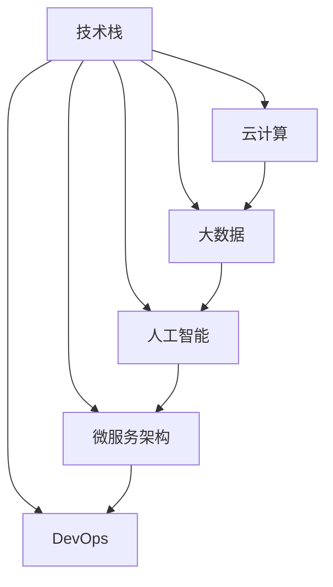

                 

# 程序员如何应对行业变革与转型

在当今快速发展的科技行业中，程序员必须不断学习新知识、新技能，以应对行业变革与转型。本文将从背景介绍、核心概念与联系、核心算法原理、数学模型与公式、项目实践、实际应用场景、工具和资源推荐、总结与展望、常见问题与解答等多个维度，全面阐述程序员应对行业变革与转型的策略和方法。

## 1. 背景介绍

### 1.1 问题由来

随着科技的迅猛发展，软件开发环境和技术栈不断变化，程序员面临的挑战也越来越多。从编程语言和框架的更新，到云计算、大数据、人工智能等新技术的普及，都要求程序员不断学习和适应新的技术和方法。

### 1.2 问题核心关键点

- **技术栈变化**：编程语言、框架和工具的快速迭代要求程序员持续学习和更新知识。
- **云计算和大数据**：云计算服务、大数据平台的应用要求程序员掌握相关技术和架构。
- **人工智能**：人工智能技术的发展对程序员提出了新的要求，包括算法、模型和部署等。
- **行业转型**：行业应用对软件开发的需求不断变化，要求程序员具备快速适应的能力。

## 2. 核心概念与联系

### 2.1 核心概念概述

为了更好地理解程序员应对行业变革与转型的方法，我们首先介绍一些核心概念：

- **技术栈**：指程序员所使用的编程语言、框架、工具和技术集合。
- **云计算**：通过互联网提供计算服务，包括计算资源、存储、数据库等。
- **大数据**：处理、分析和应用海量数据的技术，包括数据存储、处理和分析工具。
- **人工智能**：模拟、延伸和扩展人的智能，包括机器学习、深度学习等技术。
- **微服务架构**：将应用拆分为多个小服务，通过轻量级通信实现松散耦合的架构。
- **DevOps**：融合开发与运维的实践，强调协作、自动化和持续集成。

这些核心概念之间存在紧密联系，共同构成了现代软件开发的基础。通过理解这些概念，我们可以更好地把握行业发展的趋势和变化。

### 2.2 核心概念原理和架构的 Mermaid 流程图

## 3. 核心算法原理 & 具体操作步骤

### 3.1 算法原理概述

技术栈、云计算、大数据、人工智能、微服务架构和DevOps等核心概念，共同构成了现代软件开发的基础。程序员应对行业变革与转型，需要掌握这些核心概念的原理和应用，通过不断学习和实践，保持技术栈的更新，适应行业发展的需求。

### 3.2 算法步骤详解

程序员应对行业变革与转型的步骤主要包括：

1. **持续学习**：不断学习新技术、新框架、新工具，保持技术栈的更新。
2. **实践与应用**：在实际项目中应用新技术，积累经验和知识。
3. **参与社区**：积极参与开源社区，获取最新的技术动态和最佳实践。
4. **跨领域学习**：学习不同领域的知识，拓展技术视野和应用场景。
5. **构建个人品牌**：通过博客、演讲、培训等形式，分享知识和经验，提升个人影响力。

### 3.3 算法优缺点

- **优点**：
  - 保持技术栈的更新，适应行业发展的需求。
  - 提高个人技能和知识水平，增强竞争力。
  - 增强团队协作和沟通能力，提升团队效率。

- **缺点**：
  - 学习曲线较陡，需要大量时间和精力。
  - 技术更新快，容易产生知识过时的问题。
  - 跨领域学习可能存在一定的难度，需要持续投入。

### 3.4 算法应用领域

程序员应对行业变革与转型的策略和方法，在多个领域都有广泛应用：

- **软件开发**：通过学习新技术、新框架、新工具，提升软件开发的效率和质量。
- **云计算和大数据**：掌握云计算和数据平台技术，实现数据驱动的业务决策。
- **人工智能**：应用机器学习、深度学习等技术，开发智能应用，提升用户体验。
- **微服务架构**：通过微服务架构，实现系统的可扩展性和高可用性。
- **DevOps**：融合开发与运维，提升软件交付的效率和质量。

## 4. 数学模型和公式 & 详细讲解 & 举例说明

### 4.1 数学模型构建

在软件开发中，数学模型和公式的应用无处不在。以下是几个常见的数学模型和公式：

- **概率模型**：用于预测事件发生的概率，如贝叶斯定理、条件概率等。
- **优化模型**：用于求解最优化问题，如线性规划、整数规划等。
- **统计模型**：用于分析数据和预测未来趋势，如回归分析、时间序列分析等。

### 4.2 公式推导过程

以线性回归为例，其数学模型为：

$$
y = w_0 + w_1x_1 + w_2x_2 + \cdots + w_nx_n + \epsilon
$$

其中，$w_0, w_1, w_2, \cdots, w_n$ 为模型参数，$\epsilon$ 为随机误差项。通过最小二乘法求解模型参数，得到：

$$
w_i = \frac{\sum_{j=1}^{n}x_{ij}\epsilon_j}{\sum_{j=1}^{n}x_{ij}^2}, \quad i=1,2,\cdots,n
$$

### 4.3 案例分析与讲解

在实际软件开发中，数学模型和公式的应用非常广泛。例如，在推荐系统中，通过协同过滤和矩阵分解等数学模型，为用户推荐个性化的产品和服务。在金融风险评估中，利用统计模型预测违约风险，为贷款决策提供依据。

## 5. 项目实践：代码实例和详细解释说明

### 5.1 开发环境搭建

在实际项目开发中，良好的开发环境是成功的关键。以下是开发环境搭建的详细步骤：

1. **安装开发工具**：如Visual Studio、Eclipse、IntelliJ IDEA等。
2. **配置开发环境**：如配置虚拟主机、安装数据库、搭建版本控制系统等。
3. **安装依赖库**：通过Maven、Pip等工具安装项目所需的依赖库。
4. **初始化项目**：创建项目结构、编写开发文档等。

### 5.2 源代码详细实现

以一个简单的推荐系统为例，展示代码实现过程：

1. **数据准备**：收集用户历史行为数据、商品信息等。
2. **模型训练**：使用协同过滤和矩阵分解等数学模型，训练推荐模型。
3. **系统部署**：将模型部署到服务器，实现实时推荐。

### 5.3 代码解读与分析

在代码实现中，需要注意以下几点：

- **数据清洗和预处理**：确保数据的质量和一致性。
- **模型选择和调参**：选择合适的数学模型，进行参数优化。
- **系统性能优化**：通过缓存、异步处理等技术，提升系统性能。
- **系统安全与稳定性**：确保系统的高可用性和数据安全。

### 5.4 运行结果展示

运行推荐系统，通过用户界面展示推荐结果，如商品推荐、用户兴趣等。

## 6. 实际应用场景

### 6.1 电子商务推荐系统

在电子商务领域，推荐系统通过分析用户历史行为和商品属性，为用户推荐个性化的商品。通过机器学习和统计模型，提高用户满意度和销售额。

### 6.2 金融风险评估

在金融领域，推荐系统通过分析用户历史交易数据和市场动态，评估用户信用风险，为贷款审批和投资决策提供依据。

### 6.3 智能客服

在智能客服领域，推荐系统通过分析用户问题，推荐合适的答案模板，提高客服效率和用户满意度。

## 7. 工具和资源推荐

### 7.1 学习资源推荐

为了帮助程序员不断学习和提升技能，以下是一些优质的学习资源：

- **在线课程**：如Coursera、Udemy等平台上的计算机科学课程。
- **书籍**：如《算法导论》、《计算机网络》等经典书籍。
- **博客和技术社区**：如Stack Overflow、GitHub、CSDN等。
- **开源项目**：如TensorFlow、Apache Hadoop等。

### 7.2 开发工具推荐

以下是一些常用的开发工具：

- **IDE**：如Visual Studio、Eclipse、IntelliJ IDEA等。
- **版本控制**：如Git、SVN等。
- **数据库**：如MySQL、Oracle、MongoDB等。
- **云服务**：如AWS、Google Cloud、阿里云等。

### 7.3 相关论文推荐

以下是几篇影响深远的论文，推荐阅读：

- **线性回归**：《Least Squares Estimation》，Gauss
- **深度学习**：《Deep Learning》，Yann LeCun
- **协同过滤**：《Collaborative Filtering for Implicit Feedback Datasets》，SVD分解，SVD++

## 8. 总结：未来发展趋势与挑战

### 8.1 研究成果总结

本文总结了程序员应对行业变革与转型的关键策略和方法，涵盖了技术栈、云计算、大数据、人工智能、微服务架构、DevOps等多个领域。通过不断学习和实践，程序员能够保持技术栈的更新，适应行业发展的需求。

### 8.2 未来发展趋势

未来，软件开发将更加注重自动化、协作和安全性。新技术和工具将继续涌现，如无代码开发、微服务架构、DevOps等，提升开发效率和系统稳定性。人工智能和大数据的应用也将更加广泛，推动软件开发向智能化和自动化方向发展。

### 8.3 面临的挑战

尽管技术不断进步，但程序员仍面临诸多挑战：

- **技术栈更新**：新框架和工具层出不穷，需要不断学习和适应。
- **跨领域知识**：不同领域的知识和技能需要不断学习和整合。
- **系统复杂性**：大型系统设计和维护的复杂性增加。
- **安全性和稳定性**：系统的高可用性和数据安全需要持续关注。

### 8.4 研究展望

未来，需要不断探索新技术和工具，提升软件开发效率和系统稳定性。同时，加强跨领域知识的整合和应用，推动软件开发的智能化和自动化。

## 9. 附录：常见问题与解答

**Q1: 如何保持技术栈的更新？**

A: 持续学习新技术和框架，关注行业动态和开源社区。积极参与技术交流和培训，不断积累经验和知识。

**Q2: 如何应对技术栈变化？**

A: 灵活选择框架和工具，注重代码的可复用性和可维护性。使用设计模式和架构模式，提升系统的可扩展性和可维护性。

**Q3: 如何提升开发效率？**

A: 使用自动化工具和持续集成，提升代码质量和开发速度。注重代码重构和优化，提升系统性能。

**Q4: 如何提高团队协作？**

A: 使用版本控制和代码审查，确保代码质量和团队协作。定期进行技术分享和讨论，提升团队的技术水平和协作能力。

**Q5: 如何应对系统复杂性？**

A: 使用微服务架构和模块化设计，分解系统的复杂性。注重代码的可读性和可维护性，提升系统的可扩展性和可维护性。

通过不断学习和实践，程序员能够应对行业变革与转型，保持技术栈的更新，提升开发效率和系统稳定性，推动软件开发向智能化和自动化方向发展。

