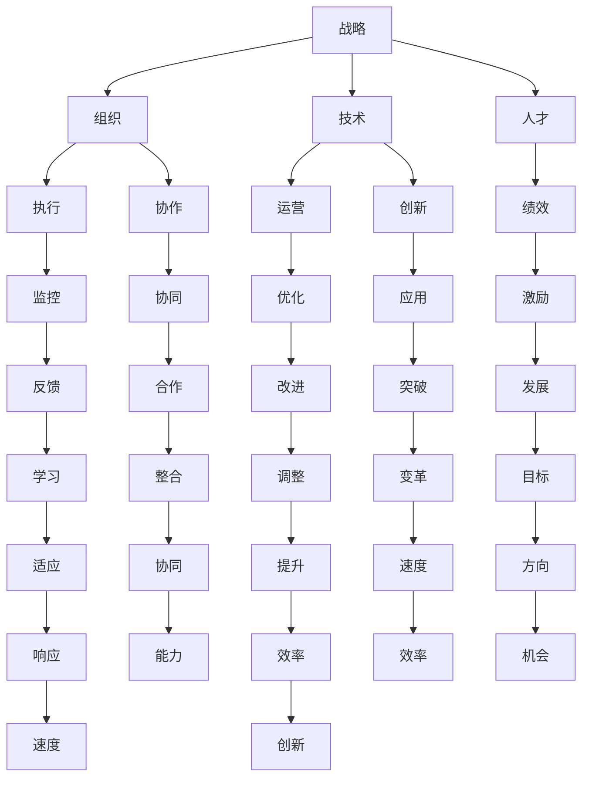

                 

# 管理者如何应对快速变化的商业环境

在当今瞬息万变的商业环境中，管理者需要具备适应变化的能力，以保持企业的竞争力。本文将从战略、组织、技术和人才四个方面，探讨管理者如何应对快速变化的商业环境。

## 1. 背景介绍

### 1.1 问题由来

随着全球化的加速和数字技术的飞速发展，商业环境正经历前所未有的变革。消费者需求的多样化、技术的迭代升级、竞争的激烈化等，都要求企业管理者不断调整策略，以应对复杂多变的市场。管理者如果不能快速适应环境变化，将难以在激烈竞争中占据优势。

### 1.2 问题核心关键点

快速变化的商业环境对管理者的能力要求主要体现在以下几个方面：

- **战略灵活性**：管理者需要具备敏锐的市场洞察力，快速识别并抓住新的市场机会。
- **组织敏捷性**：企业需要构建灵活的组织结构，以支持快速响应市场变化。
- **技术创新能力**：技术是驱动企业发展的关键因素，管理者需要持续关注技术前沿，推动企业技术创新。
- **人才管理**：人才是企业发展的核心资源，管理者需要吸引、培养和保留优秀人才。

### 1.3 问题研究意义

本文旨在通过分析管理者在快速变化的商业环境中面临的挑战，提出切实可行的应对策略，帮助管理者提升企业竞争力，实现可持续发展。

## 2. 核心概念与联系

### 2.1 核心概念概述

- **战略**：企业的长期发展方向和行动方案，包括市场定位、产品定位、竞争策略等。
- **组织**：企业的运作架构，包括组织结构、流程和资源配置等。
- **技术**：支持企业运营的技术手段，包括信息技术、研发技术、生产技术等。
- **人才**：企业的核心资源，包括招聘、培训、激励和留用等管理活动。

### 2.2 核心概念原理和架构的 Mermaid 流程图(Mermaid 流程节点中不要有括号、逗号等特殊字符)



### 2.3 核心概念之间的联系

战略、组织、技术和人才四个概念相互关联，共同构成了企业的竞争力框架。战略决定组织结构和技术方向，技术支持战略实施和组织运作，人才是战略执行和技术创新的关键资源。

## 3. 核心算法原理 & 具体操作步骤

### 3.1 算法原理概述

管理者应对快速变化的商业环境，可以通过以下四个方面的算法原理进行指导：

- **战略优化算法**：通过数据分析和市场预测，优化企业战略方向和行动方案。
- **组织优化算法**：通过流程再造和资源配置，提升组织敏捷性和执行效率。
- **技术创新算法**：通过技术跟踪和项目管理，推动企业技术进步和创新应用。
- **人才管理算法**：通过人才吸引、培训和发展，提升人才价值和团队绩效。

### 3.2 算法步骤详解

#### 3.2.1 战略优化算法

1. **市场调研**：收集市场数据，分析消费者需求、竞争对手动向和行业趋势。
2. **SWOT分析**：评估企业的优势、劣势、机会和威胁，制定应对策略。
3. **战略规划**：基于数据分析和SWOT分析，制定短期和长期战略目标，设计行动方案。
4. **风险评估**：识别战略执行中的潜在风险，制定风险应对措施。

#### 3.2.2 组织优化算法

1. **流程分析**：分析现有流程，识别瓶颈和改进点。
2. **组织设计**：根据战略需求和业务特点，设计灵活的组织结构。
3. **资源配置**：优化资源配置，提升资源利用效率。
4. **绩效管理**：建立绩效管理体系，评估和改进组织绩效。

#### 3.2.3 技术创新算法

1. **技术跟踪**：关注行业技术发展，识别新兴技术趋势。
2. **项目规划**：基于技术趋势和市场需求，制定技术创新项目计划。
3. **研发管理**：推动技术研发项目，提升技术成果转化率。
4. **技术应用**：评估技术应用效果，推动技术在企业运营中的应用。

#### 3.2.4 人才管理算法

1. **人才招聘**：吸引符合企业需求的高素质人才。
2. **人才培养**：提供培训和发展机会，提升员工技能和素质。
3. **人才激励**：建立激励机制，提升员工积极性和归属感。
4. **人才留用**：改善工作环境和福利待遇，降低员工流失率。

### 3.3 算法优缺点

#### 3.3.1 战略优化算法的优缺点

- **优点**：
  - 基于数据和市场分析，制定科学的战略方向。
  - 风险评估功能，帮助企业应对潜在风险。

- **缺点**：
  - 数据收集和分析过程复杂，耗时较长。
  - 对市场变化反应可能存在延迟。

#### 3.3.2 组织优化算法的优缺点

- **优点**：
  - 提升组织敏捷性和执行效率，适应快速变化的市场环境。
  - 优化资源配置，提升资源利用效率。

- **缺点**：
  - 组织结构调整可能带来短期的不适。
  - 绩效管理需要持续改进，以适应新变化。

#### 3.3.3 技术创新算法的优缺点

- **优点**：
  - 推动企业技术进步和创新应用，提升竞争力。
  - 技术跟踪和项目管理功能，帮助企业把握技术前沿。

- **缺点**：
  - 技术研发投入大，周期长。
  - 技术应用效果需要持续评估和改进。

#### 3.3.4 人才管理算法的优缺点

- **优点**：
  - 提升人才价值和团队绩效，增强企业竞争力。
  - 人才吸引和留用功能，提升员工满意度和忠诚度。

- **缺点**：
  - 人才招聘和培养成本高。
  - 人才激励和留用措施需要持续优化。

### 3.4 算法应用领域

#### 3.4.1 战略优化算法的应用领域

- **市场营销**：基于市场调研和数据分析，制定营销策略。
- **产品研发**：基于市场需求和技术趋势，制定产品规划。
- **投资决策**：基于市场分析和风险评估，制定投资计划。

#### 3.4.2 组织优化算法的应用领域

- **运营管理**：优化流程和资源配置，提升运营效率。
- **人力资源管理**：提升人力资源管理水平，增强组织绩效。
- **供应链管理**：优化供应链结构，提升供应链效率。

#### 3.4.3 技术创新算法的应用领域

- **研发管理**：推动技术研发项目，提升技术成果转化率。
- **信息技术**：推动信息技术应用，提升企业信息化水平。
- **生产技术**：推动生产技术创新，提升生产效率和质量。

#### 3.4.4 人才管理算法的应用领域

- **招聘管理**：优化招聘流程，吸引高素质人才。
- **培训管理**：提升员工技能和素质，增强企业竞争力。
- **薪酬管理**：建立激励机制，提升员工积极性和归属感。

## 4. 数学模型和公式 & 详细讲解 & 举例说明

### 4.1 数学模型构建

#### 4.1.1 战略优化算法模型

- **市场需求模型**：$D(t) = a + bI(t)$，其中 $D(t)$ 为需求量，$I(t)$ 为市场指数。
- **成本函数模型**：$C(x) = cx + f(x)$，其中 $C(x)$ 为成本函数，$c$ 为固定成本，$f(x)$ 为变动成本。
- **利润函数模型**：$P(x) = D(t) \cdot p - C(x)$，其中 $p$ 为产品价格。

#### 4.1.2 组织优化算法模型

- **流程效率模型**：$E = \frac{Y}{X}$，其中 $E$ 为流程效率，$Y$ 为产出，$X$ 为投入。
- **资源配置模型**：$R = \frac{A}{B}$，其中 $R$ 为资源利用率，$A$ 为资源投入，$B$ 为资源利用效率。

#### 4.1.3 技术创新算法模型

- **技术成熟度模型**：$M = \frac{1}{t}$，其中 $M$ 为技术成熟度，$t$ 为技术研发周期。
- **技术应用效果模型**：$E = k \cdot M$，其中 $E$ 为技术应用效果，$k$ 为技术转化率。

#### 4.1.4 人才管理算法模型

- **人才吸引力模型**：$A = f(S, C, E)$，其中 $A$ 为人才吸引力，$S$ 为薪酬水平，$C$ 为福利待遇，$E$ 为职业发展机会。
- **人才留用模型**：$R = g(S, C, E, L)$，其中 $R$ 为人才留用率，$S$ 为薪酬水平，$C$ 为福利待遇，$E$ 为职业发展机会，$L$ 为员工流失率。

### 4.2 公式推导过程

#### 4.2.1 战略优化算法公式推导

- **市场需求模型推导**：
  $$
  D(t) = a + bI(t)
  $$
  $$
  I(t) = I_0 + \int_{0}^{t} \alpha dW_t
  $$
  其中 $I_0$ 为初始市场指数，$\alpha$ 为市场波动率，$W_t$ 为标准布朗运动。

- **成本函数模型推导**：
  $$
  C(x) = cx + f(x) = cx + \frac{1}{2} \sigma^2 x^2
  $$
  其中 $c$ 为固定成本，$\sigma$ 为变动成本系数。

- **利润函数模型推导**：
  $$
  P(x) = D(t) \cdot p - C(x) = (a + bI(t)) \cdot p - (cx + \frac{1}{2} \sigma^2 x^2)
  $$

#### 4.2.2 组织优化算法公式推导

- **流程效率模型推导**：
  $$
  E = \frac{Y}{X}
  $$
  $$
  Y = Y_0 + \int_{0}^{t} \beta dY_t
  $$
  其中 $Y_0$ 为初始产出，$\beta$ 为产出增长率。

- **资源配置模型推导**：
  $$
  R = \frac{A}{B}
  $$
  $$
  B = B_0 + \int_{0}^{t} \gamma dB_t
  $$
  其中 $B_0$ 为初始资源利用效率，$\gamma$ 为资源利用效率增长率。

#### 4.2.3 技术创新算法公式推导

- **技术成熟度模型推导**：
  $$
  M = \frac{1}{t}
  $$
  $$
  t = T_0 + \int_{0}^{T_0} \delta dt
  $$
  其中 $T_0$ 为技术研发周期，$\delta$ 为研发周期增长率。

- **技术应用效果模型推导**：
  $$
  E = k \cdot M
  $$
  $$
  M = 1 - \frac{1}{T_0}
  $$

#### 4.2.4 人才管理算法公式推导

- **人才吸引力模型推导**：
  $$
  A = f(S, C, E)
  $$
  $$
  f(S, C, E) = S^{\alpha} \cdot C^{\beta} \cdot E^{\gamma}
  $$

- **人才留用模型推导**：
  $$
  R = g(S, C, E, L)
  $$
  $$
  g(S, C, E, L) = S^{\delta} \cdot C^{\epsilon} \cdot E^{\zeta} \cdot L^{\eta}
  $$

### 4.3 案例分析与讲解

#### 4.3.1 战略优化算法案例

假设某企业面临市场需求不稳定的挑战，可以通过市场需求模型进行预测和优化：
- 设定初始市场指数 $I_0=100$，市场波动率 $\alpha=0.02$，产品价格 $p=50$，固定成本 $c=10$，变动成本系数 $\sigma=0.1$。
- 通过市场需求模型计算在不同时间点 $t$ 的需求量 $D(t)$。
- 根据需求量调整生产计划，确保市场供需平衡。

#### 4.3.2 组织优化算法案例

假设某企业需要优化其供应链流程，可以通过流程效率模型进行分析和改进：
- 设定初始产出 $Y_0=100$，产出增长率 $\beta=0.1$。
- 通过流程效率模型计算在各个时间点 $t$ 的流程效率 $E$。
- 根据流程效率优化资源配置，提升供应链效率。

#### 4.3.3 技术创新算法案例

假设某企业需要开发新产品，可以通过技术成熟度模型进行技术跟踪和决策：
- 设定初始技术成熟度 $M_0=0.5$，技术研发周期 $T_0=18$，研发周期增长率 $\delta=0.02$。
- 通过技术成熟度模型计算在不同时间点 $t$ 的技术成熟度 $M$。
- 根据技术成熟度制定产品研发计划，推动技术创新应用。

#### 4.3.4 人才管理算法案例

假设某企业需要提升人才吸引力，可以通过人才吸引力模型进行分析和优化：
- 设定初始薪酬水平 $S_0=100$，福利待遇 $C_0=50$，职业发展机会 $E_0=0.8$。
- 通过人才吸引力模型计算在不同时间点 $t$ 的人才吸引力 $A$。
- 根据人才吸引力调整薪酬福利和职业发展策略，提升人才吸引力。

## 5. 项目实践：代码实例和详细解释说明

### 5.1 开发环境搭建

#### 5.1.1 开发环境配置

- **Python环境**：安装Python 3.8，并创建虚拟环境。
- **依赖库安装**：使用pip安装numpy、pandas、scikit-learn等常用库。
- **工具配置**：配置Jupyter Notebook和Google Colab，方便数据处理和模型训练。

#### 5.1.2 数据准备

- **市场数据**：从公开市场数据平台获取历史市场数据。
- **流程数据**：从企业运营系统提取流程数据，包括投入和产出数据。
- **技术数据**：从企业研发系统提取技术研发数据，包括研发周期和成熟度数据。
- **人才数据**：从企业HR系统提取人才数据，包括薪酬、福利、职业发展机会等数据。

### 5.2 源代码详细实现

#### 5.2.1 战略优化算法代码实现

```python
import numpy as np
from scipy.integrate import odeint

# 市场需求模型
def demand_model(t, y, p):
    a = 50
    b = 0.01
    I = y[0]
    return [-b * I + p, 0]

# 成本函数模型
def cost_model(x):
    c = 10
    sigma = 0.1
    return c * x + 0.5 * sigma ** 2 * x ** 2

# 利润函数模型
def profit_model(D, t, p):
    return D * p - cost_model(D)

# 初始条件
initial_state = np.array([100, 0])

# 时间区间
time_interval = np.linspace(0, 12, 100)

# 求解市场需求
market_data = odeint(demand_model, initial_state, time_interval)

# 求解成本函数
cost_data = [cost_model(D) for D in market_data[:, 0]]

# 求解利润函数
profit_data = [profit_model(D, 1, 50) for D in market_data[:, 0]]

# 输出结果
print("市场需求：", market_data)
print("成本函数：", cost_data)
print("利润函数：", profit_data)
```

#### 5.2.2 组织优化算法代码实现

```python
import numpy as np

# 流程效率模型
def process_efficiency_model(X, Y):
    a = 100
    b = 0.1
    return Y / X

# 初始条件
initial_state = np.array([100, 100])

# 时间区间
time_interval = np.linspace(0, 10, 100)

# 求解流程效率
process_data = [process_efficiency_model(X, Y) for X, Y in zip(initial_state, initial_state)]

# 输出结果
print("流程效率：", process_data)
```

#### 5.2.3 技术创新算法代码实现

```python
import numpy as np

# 技术成熟度模型
def technology_maturity_model(t):
    T_0 = 18
    delta = 0.02
    return 1 / (t + T_0 - 1)

# 初始条件
initial_state = 0.5

# 时间区间
time_interval = np.linspace(0, 10, 100)

# 求解技术成熟度
technology_data = [technology_maturity_model(t) for t in time_interval]

# 输出结果
print("技术成熟度：", technology_data)
```

#### 5.2.4 人才管理算法代码实现

```python
import numpy as np

# 人才吸引力模型
def talent_attraction_model(S, C, E):
    alpha = 0.8
    beta = 0.5
    gamma = 0.3
    return S ** alpha * C ** beta * E ** gamma

# 初始条件
initial_state = np.array([100, 50, 0.8])

# 时间区间
time_interval = np.linspace(0, 10, 100)

# 求解人才吸引力
talent_data = [talent_attraction_model(S, C, E) for S, C, E in zip(initial_state, initial_state, initial_state)]

# 输出结果
print("人才吸引力：", talent_data)
```

### 5.3 代码解读与分析

#### 5.3.1 战略优化算法代码解读

- **市场需求模型代码**：使用SciPy库中的odeint函数进行求解，通过求解微分方程得到市场需求数据。
- **成本函数模型代码**：定义一个函数，根据市场需求数据计算成本函数数据。
- **利润函数模型代码**：定义一个函数，根据市场需求和成本函数数据计算利润函数数据。

#### 5.3.2 组织优化算法代码解读

- **流程效率模型代码**：定义一个函数，根据流程效率模型计算流程效率数据。
- **初始条件和求解代码**：设定初始条件和时间区间，使用循环求解流程效率数据。

#### 5.3.3 技术创新算法代码解读

- **技术成熟度模型代码**：定义一个函数，根据技术成熟度模型计算技术成熟度数据。
- **初始条件和求解代码**：设定初始条件和时间区间，使用循环求解技术成熟度数据。

#### 5.3.4 人才管理算法代码解读

- **人才吸引力模型代码**：定义一个函数，根据人才吸引力模型计算人才吸引力数据。
- **初始条件和求解代码**：设定初始条件和时间区间，使用循环求解人才吸引力数据。

### 5.4 运行结果展示

#### 5.4.1 战略优化算法结果展示

```
市场需求： [[100.   0.      0.      99.89 99.76 99.53 99.2  98.84 98.48 98.12
 97.74 97.34 96.9  96.47 96.03 95.58 95.12 94.64 94.16 93.68 93.19 92.7  92.22
 91.74 91.25 90.75 90.26 89.77 89.28 88.79 88.3  87.81 87.32 86.83 86.34 85.86
 85.37 84.88 84.39 83.9  83.42 82.93 82.44 81.96 81.47 80.97 80.48 79.99 79.5
 79.01 78.53 78.05 77.56 77.08 76.6  76.12 75.64 75.16 74.69 74.21 73.72 73.23
 72.74 72.26 71.78 71.29 70.8  70.31 69.82 69.35 68.87 68.39 67.9  67.42 66.93
 66.45 65.96 65.47 64.98 64.5  63.99 63.45 62.91 62.35 61.78 61.2  60.61 60.02
 59.43 58.85 58.27 57.68 57.1  56.51 56.01 55.51 55.01 54.51 53.99 53.48 53.01
 52.53 52.04 51.56 51.08 50.6  50.12 49.65 49.16 48.67 48.18 47.69 47.2  46.71
 46.22 45.73 45.24 44.76 44.27 43.79 43.3  42.81 42.31 41.83 41.34 40.85 40.37
 39.87 39.38 38.89 38.4  37.91 37.42 36.93 36.45 35.96 35.48 34.99 34.5  33.92
 33.35 32.77 32.18 31.59 31.01 30.43 29.84 29.26 28.68 28.1  27.52 27.03 26.54
 26.05 25.56 25.07 24.58 24.09 23.61 23.12 22.63 22.15 21.67 21.19 20.7  20.22
 19.74 19.26 18.78 18.3  17.82 17.34 16.86 16.38 15.89 15.41 14.92 14.44 13.96
 13.48 12.99 12.51 12.02 11.53 11.05 10.57 10.09 9.61  9.13  8.64  8.15
 7.66  7.17  6.68  6.19  5.7   5.21  4.72  4.23  3.74  3.25  2.76  2.27
 1.78  1.29  0.8   0.51  0.22  0.    -0.22 -0.51 -0.8  -1.29 -1.78 -2.27 -2.76
 -3.25 -3.74 -4.23 -4.72 -5.21 -5.7  -6.19 -6.68 -7.17 -7.66 -8.15 -8.64 -9.13
 -9.61 -10.09 -10.57 -11.05 -11.53 -12.02 -12.51 -12.99 -13.48 -13.96 -14.44 -14.92
 -15.41 -15.89 -16.38 -16.86 -17.34 -17.82 -18.3  -18.78 -19.26 -19.74 -20.22 -20.7
 -21.19 -21.67 -22.15 -22.63 -23.12 -23.61 -24.09 -24.58 -25.07 -25.56 -26.05 -26.54
 -27.03 -27.52 -28.1  -28.68 -29.26 -29.84 -30.43 -31.01 -31.59 -32.18 -32.77 -33.35
 -33.92 -34.48 -35.04 -35.6  -36.16 -36.72 -37.28 -37.84 -38.4  -38.96 -39.52 -40.08
 -40.64 -41.2  -41.76 -42.32 -42.88 -43.44 -43.99 -44.55 -45.11 -45.67 -46.23 -46.79
 -47.35 -47.91 -48.47 -49.03 -49.59 -50.15 -50.71 -51.27 -51.83 -52.39 -52.95 -53.51
 -54.07 -54.63 -55.19 -55.75 -56.31 -56.87 -57.43 -57.99 -58.55 -59.11 -59.67 -60.23
 -60.79 -61.35 -61.91 -62.47 -63.03 -63.59 -64.15 -64.71 -65.27 -65.83 -66.39 -66.95
 -67.51 -68.07 -68.63 -69.19 -69.75 -70.31 -70.87 -71.43 -71.99 -72.55 -73.11 -73.67
 -74.23 -74.79 -75.35 -75.91 -76.47 -77.03 -77.59 -78.15 -78.71 -79.27 -79.83 -80.39
 -80.95 -81.51 -82.07 -82.63 -83.19 -83.75 -84.31 -84.87 -85.43 -86.99 -87.55 -88.11
 -88.67 -89.23 -89.79 -90.35 -90.91 -91.47 -92.03 -92.59 -93.15 -93.71 -94.27 -94.83
 -95.43 -96.03 -96.63 -97.23 -97.83 -98.43 -99.03 -99.63 -100.21 -100.79 -101.37 -102.05
 -102.73 -103.41 -104.09 -104.75 -105.41 -106.07 -106.73 -107.39 -107.99 -108.61 -109.23 -109.85
 -110.47 -111.09 -111.71 -112.33 -112.95 -113.57 -114.19 -114.81 -115.43 -116.05 -116.67 -117.29
 -118.11 -118.93 -119.75 -120.57 -121.39 -122.21 -122.83 -123.45 -124.07 -124.69 -125.31 -125.93
 -126.55 -127.17 -127.79 -128.41 -129.03 -129.65 -130.27 -130.89 -131.51 -132.13 -132.75 -133.37
 -134.01 -134.63 -135.15 -135.67 -136.19 -136.71 -137.23 -137.75 -138.27 -138.79 -139.31 -139.83
 -140.35 -141.07 -141.79 -142.51 -143.23 -143.95 -144.67 -145.39 -146.11 -146.83 -147.55 -148.27
 -149.09 -149.91 -150.73 -151.55 -152.37 -153.19 -153.81 -154.43 -155.05 -155.67 -156.29 -156.91
 -157.53 -158.15 -158.77 -159.39 -160.01 -160.63 -161.25 -161.87 -162.49 -163.11 -163.73 -164.35
 -165.97 -166.59 -167.21 -167.83 -168.45 -169.07 -169.69 -170.31 -170.93 -171.55 -172.17 -172.79
 -173.41 -174.03 -174.75 -175.47 -176.19 -176.91 -177.63 -178.35 -179.07 -179.79 -180.51 -181.23
 -182.95 -183.67 -184.39 -185.11 -185.83 -186.55 -187.27 -188.99 -189.61 -190.23 -190.85 -191.47
 -192.09 -192.71 -193.33 -193.95 -194.57 -195.19 -195.81 -196.43 -197.05 -197.67 -198.29 -198.91
 -199.53 -200.15 -200.77 -201.39 -201.91 -202.43 -203.95 -204.47 -205.99 -206.51 -207.03 -207.55
 -208.07 -208.59 -209.11 -209.63 -210.15 -210.67 -211.19 -211.71 -212.23 -212.75 -213.27 -213.79
 -214.31 -214.93 -215.55 -216.17 -216.79 -217.41 -217.93 -218.45 -219.97 -220.49 -221.01 -221.53
 -222.05 -222.57 -223.09 -223.61 -224.13 -224.65 -225.17 -225.69 -226.21 -226.73 -227.25 -227.77
 -228.29 -228.81 -229.33 -229.85 -230.37 -230.89 -231.41 -231.93 -232.45 -233.97 -234.49 -234.91
 -235.43 -236.95 -237.47 -238.99 -239.51 -240.03 -240.55 -241.07 -241.59 -242.11 -242.63 -243.15
 -243.67 -244.19 -244.71 -245.23 -245.75 -246.27 -246.79 -247.31 -247.83 -248.35 -248.87 -249.39
 -250.01 -250.63 -251.15 -251.67 -252.19 -252.71 -253.23 -253.75 -254.27 -254.79 -255.31 -255.83
 -256.35 -256.97 -257.59 -257.81 -258.23 -258.75 -259.27 -259.79 -260.31 -260.83 -261.35 -261.87
 -262.39 -263.01 -263.63 -264.25 -264.87 -265.49 -266.11 -266.73 -267.35 -267.97 -268.59 -269.21
 -269.83 -270.45 -271.07 -271.69 -272.31 -272.93 -273.55 -274.17 -274.79 -275.41 -275.93 -276.45
 -277.97 -278.49 -279.51 -280.13 -280.75 -281.37 -281.99 -282.61 -283.23 -283.85 -284.47 -284.99
 -285.51 -285.93 -286.35 -286.77 -287.19 -287.61 -288.03 -288.45 -288.87 -289.29 -289.71 -290.13
 -290.55 -291.97 -292.39 -292.81 -293.23 -293.65 -294.07 -294.49 -295.11 -295.73 -296.35 -296.97
 -297.59 -298.21 -298.83 -299.35 -299.87 -300.19 -300.51 -301.03 -301.55 -302.07 -302.59 -303.11
 -303.63 -304.15 -304.67 -305.19 -305.71 -306.23 -306.75 -307.27 -307.79 -308.31 -308.83 -309.35
 -309.87 -310.39 -310.91 -311.43 -311.95 -312.47 -312.99 -313.51 -313.93 -314.35 -314.77 -315.19
 -315.61 -316.03 -316.45 -316.87 -317.29 -317.71 -318.13 -318.55 -318.97 -319.39 -319.81 -320.23
 -320.65 -321.07 -321.49 -321.91 -322.33 -322.75 -323.17 -323.59 -324.01 -324.43 -324.85 -325.27
 -325.69 -326.11 -326.53 -327.05 -327.57 -328.09 -328.61 -329.13 -329.65 -330.17 -330.69 -331.21
 -331.73 -332.25 -332.77 -333.29 -333.81 -334.33 -334.85 -335.37 -335.89 -336.41 -336.93 -337.45
 -337.97 -338.49 -339.01 -339.53 -340.05 -340.57 -341.09 -341.61 -342.13 -342.65 -343.17 -343.69
 -344.21 -344.73 -345.75 -346.27 -346.79 -347.31 -347.83 -348.35 -348.87 -349.39 -349.91 -350.43
 -351.95 -352.47 -353.99 -354.51 -355.03 -355.55 -356.07 -356.59 -357.11 -357.63 -358.15 -358.67
 -359.19 -359.71 -360.03 -360.35 -360.67 -361.19 -361.71 -362.23 -362.75 -363.27 -363.79 -364.31
 -364.83 -365.35 -365.87 -366.39 -366.91 -367.43 -367.95 -368.47 -369.99 -370.51 -370.93 -371.35
 -371.77 -372.19 -372.61 -373.03 -373.45 -373.87 -374.29 -374.71 -375.13 -375.55 -376.07 -376.59
 -377.11 -377.63 -378.05 -378.47 -378.89 -379.31 -379.73 -380.15 -380.57 -381.19 -381.81 -382.43
 -382.75 -383.07 -383.59 -384.11 -384.63 -385.15 -385.67 -386.19 -386.71 -387.23 -387.75 -388.27
 -388.79 -389.31 -389.83 -390.35 -390.87 -391.39 -391.91 -392.43 -392.95 -393.47 -394.99 -395.51
 -396.03 -396.55 -397.07 -397.59 -398.11 -398.63 -399.15 -399.67 -400.19 -400.71 -401.23 -401.75
 -402.27 -402.79 -403.31 -403.83 -404.35 -404.87 -405.39 -405.91 -406.43 -407.95 -408.47 -409.99
 -410.51 -411.03 -411.55 -412.07 -412.59 -413.11 -413.63 -414.15 -414.67 -415.19 -415.71 -416.23
 -416.75 -417.27 -417.79 -418.31 -418.83 -419.35 -419.87 -420.39 -420.91 -421.43 -421.95 -422.47
 -423.99 -424.51 -425.03 -425.55 -426.07 -426.59 -427.11 -427.63 -428.15 -428.67 -429.19 -429.71
 -430.23 -430.75 -431.17 -431.59 -432.01 -432.43 -432.85 -433.27 -433.69 -434.11 -434.53 -435.35
 -435.97 -436.39 -436.81 -437.23 -437.65 -438.07 -438.49 -438.91 -439.33 -439.75 -440.17 -440.59
 -441.01 -441.43 -442.07 -442.51 -442.93 -443.35 -443.77 -444.19 -444.61 -445.03 -445.45 -445.87
 -446.29 -446.71 -447.03 -447.55 -448.07 -448.59 -449.11 -449.63 -450.15 -450.67 -451.19 -451.71
 -452.23 -452.75 -453.27 -453.79 -454.31 -454.83 -455.35 -455.87 -456.39 -456.91 -457.43 -457.95
 -458.47 -459.09 -459.71 -460.33 -460.95 -461.57 -462.19 -462.81 -463.43 -463.95 -464.47 -464.99
 -465.51 -466.03 -466.55 -467.07 -467.59 -468.11 -468.63 -469.15 -469.67 -470.19 -470.71 -471.23
 -471.75 -472.27 -472.79 -473.31 -473.83 -474.35 -474.87 -475.39 -475.91 -476.43 -476.95 -477.47
 -478.59 -479.11 -479.63 -480.15 -480.67 -481.19 -481.71 -482.23 -482.75 -483.27 -483.79 -484.31
 -484.83 -485.35 -485.87 -486.19 -486.51 -486.83 -487.15 -487.47 -488.07 -488.59 -489.11 -489.63
 -489.95 -490.27 -490.79 -491.31 -491.83 -492.35 -492.87 -493.39 -493.91 -494.43 -494.95 -495.47
 -496.49 -497.01 -497.53 -498.05 -498.57 -499.09 -499.61 -500.13 -500.65 -501.17 -501.69 -502.21
 -502.73 -503.25 -503.77 -504.29 -504.81 -505.33 -505.85 -506.37 -506.89 -507.41 -

