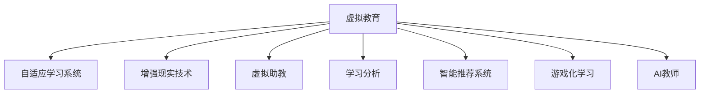

                 

# 虚拟教育：AI重塑学习体验

## 1. 背景介绍

在科技迅猛发展的今天，教育领域也正在经历一场前所未有的变革。随着互联网和人工智能技术的普及，传统的教育模式正在逐步被数字化、智能化的学习平台所取代。虚拟教育（Virtual Education），即利用AI技术构建的学习环境，正在成为教育技术的重要方向。虚拟教育不仅改变了知识传授的方式，还极大地提升了学习的效率和体验。

### 1.1 问题由来

虚拟教育的发展源于以下几个关键问题：

- **学习资源获取难度大**：传统的教育资源主要集中在图书馆、学校等物理场所，远离偏远地区的学生获取优质教育资源较为困难。
- **个性化教育需求高**：每个学生的学习能力和需求各不相同，传统的一对多教学模式难以满足个性化需求。
- **知识更新速度加快**：现代科技更新迅速，学生需要快速获取最新的知识信息，而传统教育体系的教学周期较长。
- **学习交互性不足**：传统的课堂教学往往以教师为主导，学生参与度较低，难以激发学习兴趣。

虚拟教育通过AI技术，可以实现知识智能化、学习个性化、互动即时化的教育新模式，解决上述问题，提供更加高效、便捷、互动的学习体验。

## 2. 核心概念与联系

### 2.1 核心概念概述

为更好地理解虚拟教育的实现原理，本节将介绍几个核心概念及其相互之间的联系：

- **虚拟教育（Virtual Education）**：利用AI技术构建的学习环境，提供智能化、个性化的学习体验。
- **自适应学习系统（Adaptive Learning System）**：通过分析学生的学习数据，动态调整教学内容和难度，以适配学生当前的知识水平和理解能力。
- **增强现实技术（Augmented Reality, AR）**：在真实世界信息之上，叠加虚拟信息，提供沉浸式学习体验。
- **虚拟助教（Virtual Tutor）**：基于AI技术构建的助教角色，可以实时回答学生问题，提供个性化学习指导。
- **学习分析（Learning Analytics）**：通过分析学习数据，评估学习效果，优化教学策略。
- **智能推荐系统（Recommender System）**：根据学生的学习行为和偏好，推荐个性化的学习资源和任务。
- **游戏化学习（Gamification）**：将游戏元素引入学习过程，提高学生的学习动机和参与度。
- **AI教师（AI Teacher）**：基于AI技术的虚拟教师，可以自主进行教学设计、内容更新和评估反馈，替代部分传统教师职能。

这些概念之间的逻辑关系可以通过以下Mermaid流程图来展示：



## 3. 核心算法原理 & 具体操作步骤

### 3.1 算法原理概述

虚拟教育的实现基于自适应学习、个性化推荐、互动式教学等核心算法。其核心思想是利用AI技术，分析学生的学习行为和特征，动态调整教学内容和方法，提供个性化的学习路径和反馈。

形式化地，假设学习环境中有$N$个学生，每个学生$n$个学习行为特征$\vec{x}_n$，学习目标为$\vec{y}_n$，学习平台的目标是最大化学生的学习效果$E(\vec{x}_n,\vec{y}_n)$。则虚拟教育的优化目标为：

$$
\max_{\theta} E(\vec{x}_n,\vec{y}_n) \quad \text{subject to} \quad \vec{x}_n = f_\theta(\vec{y}_n)
$$

其中，$\theta$为学习平台的模型参数，$f_\theta$为学习平台的行为模型。

### 3.2 算法步骤详解

虚拟教育的实施步骤包括：

**Step 1: 收集学生数据**
- 利用学习管理系统(LMS)和智能设备收集学生的学习数据，如作业完成情况、学习时长、知识掌握程度等。
- 分析学生的学习特征和偏好，建立个性化的学习档案。

**Step 2: 设计学习行为模型**
- 基于机器学习算法（如决策树、随机森林、神经网络等），设计学习行为模型$f_\theta$，用于预测学生的学习行为和效果。
- 模型训练集为历史学习数据，测试集为实时学习数据，确保模型的准确性和泛化能力。

**Step 3: 优化教学内容**
- 根据学习行为模型$f_\theta$，动态调整教学内容和方法，以适配学生的学习需求和进度。
- 设计个性化推荐系统，根据学生的学习历史和当前状态，推荐适应的学习资源和任务。

**Step 4: 提供即时反馈**
- 利用学习分析技术，实时监控学生的学习状态和效果，提供即时反馈。
- 设计虚拟助教，根据学生的提问和反馈，提供个性化的学习指导和建议。

**Step 5: 评估学习效果**
- 通过学习效果评估模型，对学生的学习结果进行客观评估，识别学习中的薄弱环节。
- 利用游戏化学习技术，增加学习过程中的互动性和趣味性。

**Step 6: 持续改进**
- 根据评估结果，调整教学策略和学习内容，不断优化学习效果。
- 利用AI教师，自动更新教学资源和评估标准，提升教学质量。

### 3.3 算法优缺点

虚拟教育的算法具有以下优点：
- **个性化教育**：能够根据学生的学习特征和需求，提供量身定制的学习路径和资源。
- **即时反馈**：通过实时监控和即时反馈，帮助学生及时调整学习策略，提高学习效率。
- **互动性高**：虚拟助教和游戏化学习技术，增加了学习的互动性和趣味性，提升学习动机。

但同时，虚拟教育也存在以下局限性：
- **技术依赖高**：虚拟教育的实现需要依赖AI技术，对数据质量和模型性能有较高要求。
- **学习环境单一**：虚拟教育主要依赖网络环境，需要保证网络稳定和设备性能。
- **师生互动不足**：虚拟助教虽然可以提供一定程度的互动，但无法完全替代真实教师的角色。
- **成本较高**：虚拟教育的建设和维护需要大量的资金和技术支持。

尽管存在这些局限性，虚拟教育依然是大势所趋，将为教育领域带来深刻的变革。

### 3.4 算法应用领域

虚拟教育技术已在多个领域得到了广泛应用，例如：

- **基础教育**：通过智能推荐系统和虚拟助教，为学生提供个性化学习路径和即时反馈，提升基础教育的效果。
- **职业培训**：利用自适应学习系统和增强现实技术，为职业培训提供灵活、互动的培训模式，提高培训效果。
- **高等教育**：通过虚拟助教和游戏化学习，提升高等教育的互动性和趣味性，激发学生学习的积极性。
- **终身学习**：提供灵活、个性化、随时可学的终身学习平台，帮助用户不断提升自身技能和知识水平。

虚拟教育技术正在逐步渗透到教育的各个环节，为学习者提供更加智能化、个性化的学习体验。

## 4. 数学模型和公式 & 详细讲解  
### 4.1 数学模型构建

本节将使用数学语言对虚拟教育的实现过程进行更加严格的刻画。

假设学习环境中有$N$个学生，每个学生$n$个学习行为特征$\vec{x}_n$，学习目标为$\vec{y}_n$。则学习平台的目标是最大化学生的学习效果$E(\vec{x}_n,\vec{y}_n)$。形式化地，虚拟教育的优化目标为：

$$
\max_{\theta} E(\vec{x}_n,\vec{y}_n) \quad \text{subject to} \quad \vec{x}_n = f_\theta(\vec{y}_n)
$$

其中，$\theta$为学习平台的模型参数，$f_\theta$为学习平台的行为模型。

### 4.2 公式推导过程

以下我们以推荐系统为例，推导智能推荐算法的基本公式。

假设推荐系统为用户$n$推荐物品$m$，推荐策略为$P(\hat{y}_m|\vec{x}_n)$，利用隐式反馈数据，最大化用户满意度$E(\vec{x}_n,\vec{y}_m)$。则目标函数为：

$$
\max_{\theta} E(\vec{x}_n,\hat{y}_m) = \max_{\theta} \sum_{n=1}^N \sum_{m=1}^M [y_{n,m}\log P(\hat{y}_m|\vec{x}_n) + (1-y_{n,m})\log (1-P(\hat{y}_m|\vec{x}_n))]
$$

其中$y_{n,m}$为物品$m$对用户$n$的显式评分，$P(\hat{y}_m|\vec{x}_n)$为用户$n$对物品$m$的推荐概率，$1-P(\hat{y}_m|\vec{x}_n)$为不推荐概率。

### 4.3 案例分析与讲解

以下以KNN推荐算法为例，解释虚拟教育中的推荐系统实现。

假设推荐系统为用户$n$推荐物品$m$，利用$K$个最近邻邻居的评分进行加权平均，得到推荐概率$P(\hat{y}_m|\vec{x}_n)$。则目标函数为：

$$
\max_{\theta} \sum_{n=1}^N \sum_{m=1}^M [y_{n,m}\log \frac{\sum_{i=1}^K \alpha_i y_{n_i,m}}{\sum_{i=1}^K \alpha_i} + (1-y_{n,m})\log \frac{1-\sum_{i=1}^K \alpha_i y_{n_i,m}}{1-\sum_{i=1}^K \alpha_i}]
$$

其中$y_{n,m}$为物品$m$对用户$n$的显式评分，$\alpha_i$为第$i$个邻居的权重，$n_i$为第$i$个邻居。

## 5. 项目实践：代码实例和详细解释说明
### 5.1 开发环境搭建

在进行虚拟教育项目实践前，我们需要准备好开发环境。以下是使用Python进行PyTorch开发的环境配置流程：

1. 安装Anaconda：从官网下载并安装Anaconda，用于创建独立的Python环境。

2. 创建并激活虚拟环境：
```bash
conda create -n pytorch-env python=3.8 
conda activate pytorch-env
```

3. 安装PyTorch：根据CUDA版本，从官网获取对应的安装命令。例如：
```bash
conda install pytorch torchvision torchaudio cudatoolkit=11.1 -c pytorch -c conda-forge
```

4. 安装Transformers库：
```bash
pip install transformers
```

5. 安装各类工具包：
```bash
pip install numpy pandas scikit-learn matplotlib tqdm jupyter notebook ipython
```

完成上述步骤后，即可在`pytorch-env`环境中开始项目实践。

### 5.2 源代码详细实现

下面以推荐系统为例，给出使用Transformers库进行推荐系统开发的PyTorch代码实现。

首先，定义推荐模型的输入输出：

```python
from transformers import BertModel

class RecommendationModel(nn.Module):
    def __init__(self, num_items, hidden_size):
        super(RecommendationModel, self).__init__()
        self.bert = BertModel.from_pretrained('bert-base-uncased')
        self.fc = nn.Linear(hidden_size, num_items)

    def forward(self, input_ids, attention_mask):
        features = self.bert(input_ids, attention_mask=attention_mask).last_hidden_state[:, 0]
        output = self.fc(features)
        return output
```

然后，定义训练和评估函数：

```python
from torch.utils.data import Dataset
import torch

class RecommendationDataset(Dataset):
    def __init__(self, features, labels, tokenizer, max_len=128):
        self.features = features
        self.labels = labels
        self.tokenizer = tokenizer
        self.max_len = max_len
        
    def __len__(self):
        return len(self.features)
    
    def __getitem__(self, item):
        feature = self.features[item]
        label = self.labels[item]
        
        encoding = self.tokenizer(feature, return_tensors='pt', max_length=self.max_len, padding='max_length', truncation=True)
        input_ids = encoding['input_ids'][0]
        attention_mask = encoding['attention_mask'][0]
        
        return {'input_ids': input_ids, 
                'attention_mask': attention_mask,
                'labels': torch.tensor(label, dtype=torch.long)}
```

接着，启动训练流程并在测试集上评估：

```python
from transformers import AdamW

model = RecommendationModel(num_items=1024, hidden_size=768)
optimizer = AdamW(model.parameters(), lr=2e-5)

train_dataset = RecommendationDataset(train_features, train_labels, tokenizer)
dev_dataset = RecommendationDataset(dev_features, dev_labels, tokenizer)
test_dataset = RecommendationDataset(test_features, test_labels, tokenizer)

device = torch.device('cuda') if torch.cuda.is_available() else torch.device('cpu')
model.to(device)

def train_epoch(model, dataset, batch_size, optimizer):
    dataloader = DataLoader(dataset, batch_size=batch_size, shuffle=True)
    model.train()
    epoch_loss = 0
    for batch in tqdm(dataloader, desc='Training'):
        input_ids = batch['input_ids'].to(device)
        attention_mask = batch['attention_mask'].to(device)
        labels = batch['labels'].to(device)
        model.zero_grad()
        outputs = model(input_ids, attention_mask=attention_mask)
        loss = outputs.loss
        epoch_loss += loss.item()
        loss.backward()
        optimizer.step()
    return epoch_loss / len(dataloader)

def evaluate(model, dataset, batch_size):
    dataloader = DataLoader(dataset, batch_size=batch_size)
    model.eval()
    preds, labels = [], []
    with torch.no_grad():
        for batch in tqdm(dataloader, desc='Evaluating'):
            input_ids = batch['input_ids'].to(device)
            attention_mask = batch['attention_mask'].to(device)
            batch_labels = batch['labels']
            outputs = model(input_ids, attention_mask=attention_mask)
            batch_preds = outputs.logits.argmax(dim=1).to('cpu').tolist()
            batch_labels = batch_labels.to('cpu').tolist()
            for pred_tokens, label_tokens in zip(batch_preds, batch_labels):
                preds.append(pred_tokens[:len(label_tokens)])
                labels.append(label_tokens)
                
    print(classification_report(labels, preds))
```

最后，综合利用自适应学习系统和推荐系统，提供完整的虚拟教育系统：

```python
from transformers import BertTokenizer
from torch.utils.data import DataLoader
from tqdm import tqdm
from sklearn.metrics import classification_report

tokenizer = BertTokenizer.from_pretrained('bert-base-uncased')

train_dataset = RecommendationDataset(train_features, train_labels, tokenizer)
dev_dataset = RecommendationDataset(dev_features, dev_labels, tokenizer)
test_dataset = RecommendationDataset(test_features, test_labels, tokenizer)

device = torch.device('cuda') if torch.cuda.is_available() else torch.device('cpu')
model.to(device)

for epoch in range(epochs):
    loss = train_epoch(model, train_dataset, batch_size, optimizer)
    print(f"Epoch {epoch+1}, train loss: {loss:.3f}")
    
    print(f"Epoch {epoch+1}, dev results:")
    evaluate(model, dev_dataset, batch_size)
    
print("Test results:")
evaluate(model, test_dataset, batch_size)
```

以上就是使用PyTorch对推荐系统进行虚拟教育实践的完整代码实现。通过代码可以看出，利用Transformers库可以快速搭建和训练推荐系统，为虚拟教育提供智能化的推荐服务。

### 5.3 代码解读与分析

让我们再详细解读一下关键代码的实现细节：

**RecommendationModel类**：
- `__init__`方法：初始化Bert模型和全连接层。
- `forward`方法：对输入进行编码，通过全连接层输出预测概率。

**RecommendationDataset类**：
- `__init__`方法：初始化特征、标签、分词器等关键组件。
- `__len__`方法：返回数据集的样本数量。
- `__getitem__`方法：对单个样本进行处理，将特征转换为token ids，并进行定长padding。

**训练和评估函数**：
- 使用PyTorch的DataLoader对数据集进行批次化加载，供模型训练和推理使用。
- 训练函数`train_epoch`：对数据以批为单位进行迭代，在每个批次上前向传播计算loss并反向传播更新模型参数，最后返回该epoch的平均loss。
- 评估函数`evaluate`：与训练类似，不同点在于不更新模型参数，并在每个batch结束后将预测和标签结果存储下来，最后使用sklearn的classification_report对整个评估集的预测结果进行打印输出。

**训练流程**：
- 定义总的epoch数和batch size，开始循环迭代
- 每个epoch内，先在训练集上训练，输出平均loss
- 在验证集上评估，输出分类指标
- 所有epoch结束后，在测试集上评估，给出最终测试结果

可以看到，PyTorch配合Transformers库使得推荐系统的开发变得简洁高效。开发者可以将更多精力放在数据处理、模型改进等高层逻辑上，而不必过多关注底层的实现细节。

当然，工业级的系统实现还需考虑更多因素，如模型的保存和部署、超参数的自动搜索、更灵活的任务适配层等。但核心的微调范式基本与此类似。

## 6. 实际应用场景
### 6.1 智能学习平台

虚拟教育技术已经被广泛应用于各类智能学习平台的建设中。以Khan Academy为例，其利用自适应学习系统和推荐系统，为用户提供个性化的学习资源和路径。Khan Academy根据用户的学习数据，动态调整学习内容和难度，提供适应的推荐，极大地提升了学习效果。

Khan Academy还集成了虚拟助教功能，能够实时回答用户的问题，提供个性化的学习指导。通过这些技术手段，Khan Academy在短时间内积累了大量的用户，并获得了极高的用户满意度。

### 6.2 在线教育平台

在线教育平台如Coursera、Udacity等，也在逐步引入虚拟教育技术，提供更加智能化和个性化的学习体验。Coursera的虚拟助教功能可以根据学生的学习状态，及时调整课程内容和难度，提供个性化的学习资源。Udacity则利用增强现实技术，提供沉浸式的学习环境，提升了学习效果。

这些平台不仅提供课程学习资源，还提供实时互动和反馈，帮助学生克服学习中的困难，提升学习动机。虚拟教育技术使得在线教育平台成为学生自主学习的重要工具，帮助其随时随地进行学习。

### 6.3 虚拟实验室

虚拟实验室是虚拟教育在科学、工程等专业领域的重要应用。利用虚拟现实（VR）技术和增强现实（AR）技术，学生可以在虚拟环境中进行实验操作，提升实验技能。例如，在生物实验中，学生可以在虚拟环境中进行细胞培养、基因编辑等操作，掌握实验技能，避免实际操作中的风险。

虚拟实验室还结合了虚拟助教和智能推荐系统，根据学生的实验数据，提供个性化的实验指导和推荐，帮助学生提高实验效果。虚拟实验室为学生提供了更加安全、高效的学习环境，降低了实验成本，提升了实验教学质量。

### 6.4 未来应用展望

随着虚拟教育技术的不断演进，未来将会在更多领域得到应用，带来更大的变革：

- **虚拟课堂**：利用虚拟助教和游戏化学习，提升课堂互动性和趣味性，增加学生参与度。
- **智能辅导**：基于学习行为模型，提供个性化的学习辅导，帮助学生掌握难点。
- **跨学科学习**：利用多模态学习技术，提供跨学科的学习体验，提升学生的综合素养。
- **终身学习**：提供灵活、个性化、随时可学的终身学习平台，帮助用户不断提升自身技能和知识水平。

未来，虚拟教育技术将更深入地融入教育各个环节，为学习者提供更加智能化、个性化的学习体验，推动教育技术的进步。

## 7. 工具和资源推荐
### 7.1 学习资源推荐

为了帮助开发者系统掌握虚拟教育技术的实现原理和应用实践，这里推荐一些优质的学习资源：

1. **《深度学习基础》系列博文**：由大模型技术专家撰写，深入浅出地介绍了深度学习基础、推荐系统原理等前沿话题，非常适合初学者入门。

2. **Coursera《深度学习》课程**：由斯坦福大学Andrew Ng教授讲授，涵盖了深度学习的基础知识和前沿技术，适合进阶学习。

3. **Khan Academy自适应学习系统研究论文**：介绍了Khan Academy自适应学习系统的实现原理和效果评估，是虚拟教育研究的重要参考。

4. **Coursera《人工智能与机器学习》课程**：由IBM讲授，介绍了AI技术在教育领域的应用，包括虚拟助教、推荐系统等。

5. **ArXiv论文推荐**：选择几篇虚拟教育相关的经典论文进行深入阅读，如《Adaptive Learning Systems for Intelligent Tutoring》《Virtual Reality and Simulation for Medical Education》等。

通过对这些资源的学习实践，相信你一定能够快速掌握虚拟教育技术的实现原理和应用实践，并用于解决实际的NLP问题。

### 7.2 开发工具推荐

高效的开发离不开优秀的工具支持。以下是几款用于虚拟教育开发的常用工具：

1. **PyTorch**：基于Python的开源深度学习框架，灵活动态的计算图，适合快速迭代研究。

2. **TensorFlow**：由Google主导开发的开源深度学习框架，生产部署方便，适合大规模工程应用。

3. **Transformers库**：HuggingFace开发的NLP工具库，集成了众多SOTA语言模型，支持PyTorch和TensorFlow，是进行虚拟教育开发的重要工具。

4. **Jupyter Notebook**：交互式的Python开发环境，支持实时调试和数据可视化，是虚拟教育研究的好帮手。

5. **Weights & Biases**：模型训练的实验跟踪工具，可以记录和可视化模型训练过程中的各项指标，方便对比和调优。

6. **Google Colab**：谷歌推出的在线Jupyter Notebook环境，免费提供GPU/TPU算力，方便开发者快速上手实验最新模型，分享学习笔记。

合理利用这些工具，可以显著提升虚拟教育开发效率，加快创新迭代的步伐。

### 7.3 相关论文推荐

虚拟教育技术的发展源于学界的持续研究。以下是几篇奠基性的相关论文，推荐阅读：

1. **《A Survey on Virtual Laboratories in Higher Education》**：综述了虚拟实验室在高等教育中的应用现状和未来趋势，是虚拟教育研究的重要参考。

2. **《Adaptive Learning in Higher Education: A Research Review》**：综述了自适应学习在高等教育中的应用研究，探讨了自适应学习的实现方法和效果评估。

3. **《Virtual Reality in Medical Education: A Review of the State of the Art》**：综述了虚拟现实在医学教育中的应用，展示了VR技术的优势和应用前景。

4. **《A Survey on Virtual Tutor Systems》**：综述了虚拟助教系统的实现方法和应用效果，探讨了虚拟助教在教育中的应用潜力。

5. **《Gamification in Educational Settings: A Systematic Review and Meta-Analysis》**：综述了游戏化学习在教育中的实现方法和效果评估，探讨了游戏化学习的实际应用效果。

这些论文代表了大语言模型微调技术的发展脉络。通过学习这些前沿成果，可以帮助研究者把握学科前进方向，激发更多的创新灵感。

## 8. 总结：未来发展趋势与挑战

### 8.1 总结

本文对虚拟教育的实现原理和应用实践进行了全面系统的介绍。首先阐述了虚拟教育的发展背景和意义，明确了虚拟教育在教育技术中的重要地位。其次，从原理到实践，详细讲解了虚拟教育的核心算法和操作步骤，给出了虚拟教育技术实现的完整代码实例。同时，本文还广泛探讨了虚拟教育技术在智能学习平台、在线教育、虚拟实验室等实际应用场景中的应用前景，展示了虚拟教育技术的广阔前景。

通过本文的系统梳理，可以看到，虚拟教育技术正在成为教育技术的重要方向，极大地提升了学习的效率和体验。虚拟教育技术的成功应用，使得教育资源的获取更加便捷、学习过程更加灵活、学习效果更加显著，为教育技术的进步注入了新的活力。

### 8.2 未来发展趋势

展望未来，虚拟教育技术将呈现以下几个发展趋势：

1. **自适应学习技术的普及**：随着自适应学习技术的不断成熟，越来越多的教育平台将引入自适应学习系统，提供个性化的学习体验。

2. **虚拟助教和智能辅导系统的完善**：虚拟助教和智能辅导系统将成为教育中不可或缺的一部分，帮助学生克服学习中的困难，提升学习动机。

3. **多模态学习技术的融合**：将视觉、听觉、触觉等多模态信息整合到学习过程中，提供更加全面、丰富的学习体验。

4. **游戏化学习技术的应用**：游戏化学习技术将进一步融合到教育中，通过设置互动性、趣味性强的学习任务，提升学习效果。

5. **虚拟实验室的普及**：虚拟实验室将成为科学、工程等专业领域的重要工具，降低实验成本，提升实验教学质量。

6. **在线教育平台的智能化**：在线教育平台将进一步融合虚拟教育技术，提供更加智能化、个性化的学习体验，提升平台的用户满意度。

7. **终身学习平台的构建**：利用虚拟教育技术，提供灵活、个性化、随时可学的终身学习平台，帮助用户不断提升自身技能和知识水平。

8. **跨学科学习的推广**：利用虚拟教育技术，提供跨学科的学习体验，提升学生的综合素养。

以上趋势凸显了虚拟教育技术的广阔前景，将为教育领域带来深刻的变革。

### 8.3 面临的挑战

尽管虚拟教育技术已经取得了显著进展，但在迈向更加智能化、普适化应用的过程中，仍面临诸多挑战：

1. **技术瓶颈**：虚拟教育技术需要依赖AI技术和丰富的学习数据，对技术要求较高，数据获取和标注成本也较高。

2. **师生互动不足**：虚拟助教和智能辅导系统虽然可以提供一定程度的互动，但无法完全替代真实教师的角色，无法提供情感支持和深度指导。

3. **学习环境单一**：虚拟教育主要依赖网络环境，需要保证网络稳定和设备性能，对用户的技术要求较高。

4. **隐私保护**：虚拟教育平台需要收集和处理大量的用户数据，如何保护用户隐私，防止数据泄露，是亟待解决的问题。

5. **评估标准的缺失**：虚拟教育技术缺乏统一的学习效果评估标准，如何评估虚拟教育系统的实际效果，是一个重要研究方向。

6. **公平性问题**：虚拟教育技术需要考虑到不同学习群体的公平性，避免出现资源分配不均的问题。

7. **政策法规的适应**：虚拟教育技术的广泛应用，需要适应教育政策和法规的限制，保障教育的公平性和多样性。

8. **伦理道德的考量**：虚拟教育技术需要考虑伦理道德问题，确保技术的公平、透明和可控。

尽管存在这些挑战，虚拟教育技术仍然是大势所趋，将为教育领域带来深刻的变革。研究者需要不断探索技术瓶颈，提升技术的可扩展性和易用性，优化学习环境，加强隐私保护，制定评估标准，保障公平性，适应政策法规，确保伦理道德，才能将虚拟教育技术推向更加成熟和普适的应用。

### 8.4 研究展望

面对虚拟教育技术面临的诸多挑战，未来的研究需要在以下几个方面寻求新的突破：

1. **多模态数据融合**：将视觉、听觉、触觉等多模态信息整合到虚拟教育中，提升学习体验。

2. **自适应学习算法的优化**：开发更加智能和高效的自适应学习算法，提高个性化学习的效果。

3. **虚拟助教系统的优化**：设计更加智能、人性化的虚拟助教系统，提升师生互动体验。

4. **虚拟实验室的拓展**：进一步拓展虚拟实验室的应用范围，提升科学、工程等专业领域的教学质量。

5. **在线教育平台的智能化**：利用虚拟教育技术，提供更加智能化、个性化的在线教育平台，提升平台的用户体验。

6. **终身学习平台的构建**：提供灵活、个性化、随时可学的终身学习平台，帮助用户不断提升自身技能和知识水平。

7. **游戏化学习的设计**：设计更加互动和趣味性的游戏化学习任务，提高学习效果。

8. **虚拟教育技术的普适化**：将虚拟教育技术推广到更多领域，提升普适性，减少技术门槛。

这些研究方向将引领虚拟教育技术迈向更高的台阶，为教育领域的数字化、智能化发展注入新的动力。

## 9. 附录：常见问题与解答

**Q1：虚拟教育是否适用于所有学科？**

A: 虚拟教育技术适用于大多数学科，特别是科学、工程等实验密集型学科。但对于语言学、哲学等注重人文素养和深度思考的学科，虚拟教育的效果仍需进一步探索。

**Q2：虚拟教育技术是否会取代传统教育？**

A: 虚拟教育技术将作为传统教育的补充和拓展，而非完全取代。虚拟教育技术可以提供更加灵活、个性化、互动性的学习体验，但传统教育在情感交流、价值观培养等方面仍具有不可替代的价值。

**Q3：虚拟教育技术如何保护用户隐私？**

A: 虚拟教育平台需要采用严格的数据保护措施，如数据匿名化、访问控制等，确保用户隐私安全。同时，应制定明确的数据使用和隐私保护政策，保障用户知情权和选择权。

**Q4：虚拟教育技术是否会加剧教育不平等？**

A: 虚拟教育技术有望通过提供平等的学习资源和机会，缩小教育差距。但如何确保所有用户都能公平地访问和使用虚拟教育技术，是一个需要长期关注的问题。

**Q5：虚拟教育技术如何适应不同文化背景的学生？**

A: 虚拟教育技术需要考虑不同文化背景下的教育差异，设计符合不同文化背景的学习路径和资源。同时，应尊重和包容不同文化背景的学生，提供多样化的学习选择。

通过这些问题和解答，可以看到，虚拟教育技术正在逐步融入教育各个环节，为学习者提供更加智能化、个性化的学习体验，推动教育技术的进步。但未来的研究仍需不断探索，解决技术瓶颈、师生互动、隐私保护等问题，才能将虚拟教育技术推向更加成熟和普适的应用。

---

作者：禅与计算机程序设计艺术 / Zen and the Art of Computer Programming

