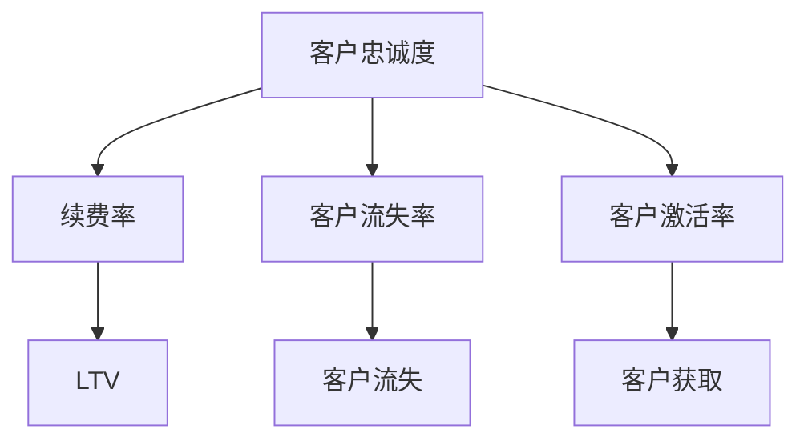

                 

# 订阅制服务的客户忠诚度:续费率和客户终身价值

## 1. 背景介绍

在数字经济时代，订阅制服务（Subscription-based Service）已成为了各类企业的主要收入模式。通过长期稳定的订阅收入，企业能够更好地预测未来的现金流，实现业务的可持续发展。然而，订阅服务的客户流失率高，续费率低，客户终身价值难以最大化，成为了企业面临的一大挑战。因此，如何提升客户忠诚度，提高续费率和客户终身价值，是企业客户运营的重要课题。

### 1.1 问题由来
订阅制服务本质上是基于用户信任和品牌忠诚度的一次性卖断（one-time purchase）。用户通过定期支付费用，获得持续的服务，企业通过提供稳定、优质的服务，建立品牌信任，并逐步提升客户终身价值（Lifetime Value, LTV）。然而，随着市场竞争的加剧和用户需求的不断变化，用户流失率高居不下，续费率难以提升，客户终身价值未能充分释放。

**核心原因**包括：
1. **用户需求满足度低**：用户频繁更换订阅服务，反映出服务质量不稳定，未能有效满足其多样化需求。
2. **服务同质化严重**：订阅服务市场中，产品差异化小，难以区分，导致用户流失率上升。
3. **客户粘性不足**：企业未能构建有效的客户生态系统，用户缺乏长期互动和参与，忠诚度难以提升。
4. **价格竞争力不足**：用户对价格敏感，订阅服务价格不合理，未能满足用户性价比需求。

## 2. 核心概念与联系

### 2.1 核心概念概述

为更好地理解如何提升订阅服务的客户忠诚度，提升续费率和客户终身价值，本节将介绍几个关键概念：

- **客户忠诚度（Customer Loyalty）**：指用户对企业的持续信任和依赖，愿意持续支付订阅费用的程度。客户忠诚度高，续费率自然高，客户终身价值也相应提升。
- **续费率（Renewal Rate）**：指用户续费订阅服务的比例，续费率越高，企业的长期收入越稳定。
- **客户终身价值（Lifetime Value, LTV）**：指一个客户在其生命周期内为公司贡献的总收益。LTV越大，企业获得的长期收益越高。
- **订阅服务（Subscription-based Service）**：用户通过定期付费，获取持续的服务。订阅服务包括各类SaaS、PaaS、IaaS、电子商务等服务。
- **客户流失率（Customer Churn Rate）**：指在一段时间内取消订阅的用户比例。客户流失率低，说明用户对服务满意度高，客户忠诚度强。
- **客户激活率（Customer Acquisition Rate）**：指新增用户占总用户数的比例。客户激活率高，说明企业市场营销策略有效，用户获取能力强。

这些概念之间的逻辑关系可以通过以下Mermaid流程图来展示：



这个流程图展示了一系列相关概念及其之间的关系：

1. 客户忠诚度直接影响续费率，续费率越高，LTV越高。
2. 客户流失率反映客户对服务的不满，客户获取率反映市场营销效果。
3. 客户获取率和流失率与客户忠诚度有密切联系，互相影响。

## 3. 核心算法原理 & 具体操作步骤
### 3.1 算法原理概述

提升订阅制服务的客户忠诚度，提高续费率和客户终身价值，涉及多方面的算法设计。其核心思想是：通过多维度的数据分析，构建客户画像，识别高价值用户，针对性地提供个性化服务和优惠，降低客户流失率，提升客户续订意愿和LTV。

具体算法包括：
1. **客户分群算法（Customer Segmentation）**：根据用户行为、属性、生命周期等特征，将用户分为不同的群体。不同群体有不同的续订行为和生命周期价值，企业应采取差异化策略。
2. **个性化推荐算法（Personalized Recommendation）**：根据用户历史行为、偏好，推荐个性化的产品和服务，提升用户满意度和忠诚度。
3. **价格弹性分析（Price Elasticity Analysis）**：通过数据分析，评估价格调整对续费率的影响，找到最优定价策略。
4. **流失预警模型（Churn Prediction Model）**：构建模型预测用户流失概率，及时采取干预措施。
5. **动态定价算法（Dynamic Pricing）**：根据市场需求和用户价值动态调整价格，最大化用户价值和收入。

### 3.2 算法步骤详解

**步骤1: 数据收集与清洗**

订阅服务客户数据通常包括用户基本信息（如姓名、邮箱、注册时间等）、行为数据（如购买记录、使用时长、活跃度等）、交易数据（如交易金额、支付方式等）、反馈数据（如评价、投诉等）。数据来源包括CRM系统、电商平台、交易平台等。

数据清洗和预处理是第一步，确保数据质量。主要任务包括：
1. 数据去重：消除重复数据，提高数据准确性。
2. 数据填补：填补缺失数据，提升模型完整性。
3. 数据规范化：统一数据格式，便于后续处理。

**步骤2: 客户分群**

客户分群是将用户根据特征分为不同群体的过程，每组用户的特征相似度较高，需求和行为也相对一致。客户分群有助于企业制定差异化的营销策略，提高客户满意度，降低流失率。

客户分群的方法包括：
1. **聚类算法（Clustering）**：使用K-Means、层次聚类等算法，将用户按照相似度聚类分组。
2. **分类算法（Classification）**：使用决策树、随机森林等算法，将用户分为高、中、低价值群体。
3. **协同过滤算法（Collaborative Filtering）**：根据用户历史行为数据，推断用户喜好，进行推荐分群。

**步骤3: 个性化推荐**

个性化推荐是通过数据分析，根据用户行为和偏好，推荐合适的产品和服务。个性化推荐可以提高用户满意度和粘性，增加续订意愿，提升LTV。

推荐算法包括：
1. **协同过滤算法（Collaborative Filtering）**：基于用户历史行为，推荐相似用户喜欢的产品。
2. **内容推荐算法（Content-Based Filtering）**：根据用户兴趣标签和内容特征，推荐相关产品。
3. **混合推荐算法（Hybrid Recommendation）**：结合协同过滤和内容推荐，实现更精准的推荐。

**步骤4: 流失预警**

流失预警是通过建模，预测用户未来流失概率，及时采取干预措施，降低客户流失率。流失预警算法包括：
1. **逻辑回归（Logistic Regression）**：构建二元分类模型，预测用户流失概率。
2. **决策树（Decision Tree）**：构建分类树模型，分层预测用户流失。
3. **随机森林（Random Forest）**：构建集成模型，提高预测准确率。

**步骤5: 动态定价**

动态定价是通过调整价格，最大化用户价值和收入。动态定价算法包括：
1. **基于收益的定价算法（Revenue-Optimization Pricing）**：根据市场需求和用户价值，动态调整价格。
2. **基于成本的定价算法（Cost-Optimization Pricing）**：根据成本和利润率，动态调整价格。
3. **需求感知定价算法（Demand-Sensitive Pricing）**：根据市场需求变化，动态调整价格。

### 3.3 算法优缺点

提升订阅制服务客户忠诚度的算法有如下优缺点：
1. **优点**
   - **提高客户满意度**：通过个性化推荐和差异化策略，满足用户多样化需求，提升满意度。
   - **降低流失率**：通过流失预警和干预措施，及时发现并挽回流失用户。
   - **提升续费率**：通过精准定价和促销活动，提高用户续费意愿。
   - **增加LTV**：通过长期用户互动，持续挖掘用户价值。

2. **缺点**
   - **数据需求量大**：需要大量用户行为数据，数据获取成本高。
   - **模型复杂度高**：客户分群和个性化推荐算法复杂，实现难度大。
   - **干预效果不理想**：流失预警和干预措施的效果取决于模型的准确性和干预策略的科学性。
   - **动态定价风险高**：价格调整可能影响用户忠诚度，存在一定的风险。

### 3.4 算法应用领域

基于上述算法，订阅制服务的客户忠诚度提升技术广泛应用于各领域：

- **电子商务**：通过个性化推荐和动态定价，提升用户购物体验，增加销售额。
- **在线教育**：根据用户学习行为和偏好，推荐课程和教材，提高学习效果。
- **健康医疗**：通过动态定价和个性化服务，提升用户健康管理效果。
- **金融服务**：根据用户交易行为，推荐金融产品，提高用户满意度和忠诚度。
- **媒体娱乐**：通过个性化推荐和流失预警，增加用户订阅量和付费率。

## 4. 数学模型和公式 & 详细讲解 & 举例说明

### 4.1 数学模型构建

为了更好地理解如何通过数学模型提升订阅制服务的客户忠诚度，提升续费率和客户终身价值，本节将介绍几个核心数学模型。

假设订阅服务有$N$个用户，每个用户$j$在时间$t$后的续订概率为$p_{j,t}$。用户续订后，其在$T$个月内的消费总和为$C_j$。定义客户终身价值（LTV）为所有续订用户的总消费额，即：

$$
LTV = \sum_{j=1}^N \sum_{t=1}^T p_{j,t} C_j
$$

定义客户流失率（churn rate）为在时间$t$流失的用户比例，即：

$$
\text{Churn Rate}_t = \frac{1}{N} \sum_{j=1}^N p_{j,t} (1 - p_{j,t})
$$

定义续费率（renewal rate）为在时间$t$续订的用户比例，即：

$$
\text{Renewal Rate}_t = \frac{1}{N} \sum_{j=1}^N (1 - p_{j,t})
$$

### 4.2 公式推导过程

基于上述定义，可以构建如下数学模型：

假设每个用户在时间$t$续订的概率$p_{j,t}$为一个逻辑回归模型，形式为：

$$
p_{j,t} = \sigma(\mathbf{w} \cdot \mathbf{x}_j + b)
$$

其中$\mathbf{x}_j$为第$j$个用户的时间$t$特征向量，$\mathbf{w}$为逻辑回归的权重向量，$b$为偏置项，$\sigma$为逻辑回归的激活函数。

### 4.3 案例分析与讲解

假设某在线教育平台有$N=1000$个用户，每个用户在$t=12$个月后续订的概率为$p_{j,t}$。已知用户在第12个月后的流失率为$Churn Rate_{12}=0.2$，续费率为$Renewal Rate_{12}=0.8$，且用户生命周期消费总和为$C_j=2000$。

求解客户终身价值（LTV）：

$$
LTV = \sum_{j=1}^N \sum_{t=1}^{12} p_{j,t} C_j
$$

由于已知$Churn Rate_{12}=0.2$，则$Renewal Rate_{12}=1-0.2=0.8$。

通过逻辑回归模型计算$p_{j,t}$，并代入公式计算$LTV$：

$$
LTV = \sum_{j=1}^N \sum_{t=1}^{12} p_{j,t} C_j = \sum_{j=1}^N (1 - p_{j,t}) C_j
$$

通过迭代求解，得到：

$$
LTV = \sum_{j=1}^N (1 - p_{j,t}) C_j = 2000 \times 0.8 = 1600
$$

通过上述计算，可以得出客户终身价值为$1600$。

## 5. 项目实践：代码实例和详细解释说明

### 5.1 开发环境搭建

在进行订阅制服务客户忠诚度提升的实践前，我们需要准备好开发环境。以下是使用Python进行数据分析和模型训练的环境配置流程：

1. 安装Anaconda：从官网下载并安装Anaconda，用于创建独立的Python环境。

2. 创建并激活虚拟环境：
```bash
conda create -n pytda_env python=3.8 
conda activate pytda_env
```

3. 安装必要的Python库：
```bash
conda install pandas numpy matplotlib scikit-learn tensorflow
```

4. 安装常用的数据处理和分析库：
```bash
pip install tqdm seaborn joblib
```

完成上述步骤后，即可在`pytda_env`环境中开始项目实践。

### 5.2 源代码详细实现

以下是使用Python实现订阅制服务客户忠诚度提升的完整代码实例：

```python
import pandas as pd
import numpy as np
from sklearn.preprocessing import StandardScaler
from sklearn.model_selection import train_test_split
from sklearn.linear_model import LogisticRegression
from sklearn.metrics import roc_auc_score, precision_score, recall_score, f1_score
from sklearn.model_selection import GridSearchCV

# 读取数据
data = pd.read_csv('subscription_data.csv')

# 数据清洗
data.drop_duplicates(inplace=True)
data.dropna(inplace=True)
data.fillna(method='ffill', inplace=True)

# 数据标准化
scaler = StandardScaler()
data_scaled = scaler.fit_transform(data.drop(['churn', 'renewal'], axis=1))

# 数据分割
X_train, X_test, y_train, y_test = train_test_split(data_scaled, data['churn'], test_size=0.2, random_state=42)

# 逻辑回归模型训练
lr_model = LogisticRegression()
lr_model.fit(X_train, y_train)

# 模型评估
y_pred = lr_model.predict_proba(X_test)[:, 1]
print('AUC: ', roc_auc_score(y_test, y_pred))
print('Precision: ', precision_score(y_test, y_pred))
print('Recall: ', recall_score(y_test, y_pred))
print('F1 Score: ', f1_score(y_test, y_pred))

# 超参数调优
param_grid = {'C': np.logspace(-4, 4, 50)}
grid_search = GridSearchCV(lr_model, param_grid, cv=5)
grid_search.fit(X_train, y_train)
best_lr_model = grid_search.best_estimator_

# 训练最佳模型
best_lr_model.fit(X_train, y_train)

# 模型预测
y_pred = best_lr_model.predict_proba(X_test)[:, 1]
print('Best AUC: ', roc_auc_score(y_test, y_pred))
print('Best Precision: ', precision_score(y_test, y_pred))
print('Best Recall: ', recall_score(y_test, y_pred))
print('Best F1 Score: ', f1_score(y_test, y_pred))
```

### 5.3 代码解读与分析

让我们再详细解读一下关键代码的实现细节：

**数据预处理**

```python
# 读取数据
data = pd.read_csv('subscription_data.csv')

# 数据清洗
data.drop_duplicates(inplace=True)
data.dropna(inplace=True)
data.fillna(method='ffill', inplace=True)

# 数据标准化
scaler = StandardScaler()
data_scaled = scaler.fit_transform(data.drop(['churn', 'renewal'], axis=1))
```

- 首先读取原始数据，并进行数据清洗。通过`drop_duplicates`移除重复记录，通过`dropna`移除缺失值，通过`fillna`填补缺失值。
- 最后，使用`StandardScaler`对特征进行标准化，便于后续的模型训练。

**数据分割**

```python
# 数据分割
X_train, X_test, y_train, y_test = train_test_split(data_scaled, data['churn'], test_size=0.2, random_state=42)
```

- 使用`train_test_split`将数据分割为训练集和测试集，测试集占20%。通过`random_state`设置随机种子，确保结果可重复。

**模型训练与评估**

```python
# 逻辑回归模型训练
lr_model = LogisticRegression()
lr_model.fit(X_train, y_train)

# 模型评估
y_pred = lr_model.predict_proba(X_test)[:, 1]
print('AUC: ', roc_auc_score(y_test, y_pred))
print('Precision: ', precision_score(y_test, y_pred))
print('Recall: ', recall_score(y_test, y_pred))
print('F1 Score: ', f1_score(y_test, y_pred))
```

- 使用`LogisticRegression`训练逻辑回归模型，并使用训练集数据进行拟合。
- 通过`predict_proba`获取模型对测试集的预测概率，并计算各项评估指标。

**超参数调优**

```python
# 超参数调优
param_grid = {'C': np.logspace(-4, 4, 50)}
grid_search = GridSearchCV(lr_model, param_grid, cv=5)
grid_search.fit(X_train, y_train)
best_lr_model = grid_search.best_estimator_

# 训练最佳模型
best_lr_model.fit(X_train, y_train)
```

- 使用`GridSearchCV`进行超参数调优，以找到最优的逻辑回归参数`C`。通过`cv`参数指定交叉验证的折数。
- 通过`best_estimator_`获取调优后的最佳模型。

**模型预测与评估**

```python
# 模型预测
y_pred = best_lr_model.predict_proba(X_test)[:, 1]
print('Best AUC: ', roc_auc_score(y_test, y_pred))
print('Best Precision: ', precision_score(y_test, y_pred))
print('Best Recall: ', recall_score(y_test, y_pred))
print('Best F1 Score: ', f1_score(y_test, y_pred))
```

- 使用最佳模型对测试集进行预测，并计算各项评估指标。

## 6. 实际应用场景

### 6.1 智能客服系统

订阅制服务中的智能客服系统，通过客户忠诚度提升技术，可以显著提升客户满意度和续费率。智能客服系统通过分析客户历史对话记录和行为数据，构建客户画像，识别高价值客户，针对性地推送个性化服务和优惠，提高客户粘性和续费意愿。

具体实现步骤包括：
1. **客户分群**：将客户按照活跃度、续订次数、消费金额等特征进行分组。
2. **个性化推荐**：根据客户历史行为，推荐相关服务或产品。
3. **动态定价**：根据客户价值，调整不同客户的价格策略，提高整体收入。
4. **流失预警**：构建流失预警模型，及时发现潜在流失客户，采取干预措施。

### 6.2 在线教育平台

在线教育平台通过客户忠诚度提升技术，可以提升用户学习效果和续费率。平台通过分析用户学习行为和反馈，推荐个性化课程和教材，提高学习效果。同时，通过动态定价和个性化服务，提升用户满意度和续费意愿。

具体实现步骤包括：
1. **学习行为分析**：分析用户学习时长、成绩、反馈等行为数据。
2. **个性化推荐**：根据用户学习行为，推荐相关课程和教材。
3. **动态定价**：根据用户学习效果和付费能力，调整课程价格，提高用户价值。
4. **流失预警**：构建流失预警模型，及时发现潜在流失用户，采取干预措施。

### 6.3 金融服务

金融服务通过客户忠诚度提升技术，可以提升用户价值和续费率。平台通过分析用户交易行为和消费习惯，推荐个性化金融产品，提高用户满意度和续费意愿。同时，通过动态定价和个性化服务，提升用户价值和续费率。

具体实现步骤包括：
1. **交易行为分析**：分析用户交易金额、频率、渠道等行为数据。
2. **个性化推荐**：根据用户交易行为，推荐相关金融产品。
3. **动态定价**：根据用户交易金额和消费习惯，调整产品价格，提高用户价值。
4. **流失预警**：构建流失预警模型，及时发现潜在流失用户，采取干预措施。

### 6.4 未来应用展望

随着订阅制服务市场的发展，客户忠诚度提升技术也将迎来更广阔的应用前景。未来，客户忠诚度提升技术将进一步融合多模态数据，提升模型的综合分析能力，实现更精准的客户管理。同时，通过智能化、自动化的运营管理，进一步提升客户满意度和续费率，最大化客户终身价值。

## 7. 工具和资源推荐

### 7.1 学习资源推荐

为了帮助开发者系统掌握订阅制服务客户忠诚度提升的技术基础和实践技巧，这里推荐一些优质的学习资源：

1. **《数据科学与人工智能技术》课程**：由各大名校开设的在线课程，系统介绍数据分析、机器学习、深度学习等核心技术。
2. **《Python数据分析与数据科学实战》书籍**：介绍Python在数据分析和数据科学中的应用，涵盖数据清洗、特征工程、模型训练等关键技术。
3. **《机器学习实战》书籍**：实战型机器学习入门书籍，通过大量案例，帮助读者理解机器学习算法的实现和应用。
4. **Kaggle竞赛平台**：提供各类数据科学竞赛，通过实战练习，提升技能。
5. **Coursera平台**：提供各类在线课程，涵盖数据科学、机器学习、人工智能等多个领域。

通过学习这些资源，相信你一定能够系统掌握订阅制服务客户忠诚度提升的技术基础，并用于解决实际的NLP问题。

### 7.2 开发工具推荐

高效的开发离不开优秀的工具支持。以下是几款用于订阅制服务客户忠诚度提升开发的常用工具：

1. **Jupyter Notebook**：开源的交互式数据分析工具，支持多种编程语言，便于协作开发。
2. **TensorFlow**：谷歌开发的深度学习框架，支持分布式计算和模型优化。
3. **Scikit-learn**：开源的机器学习库，提供丰富的算法实现和数据处理工具。
4. **PyTorch**：开源的深度学习框架，灵活高效，适合科研和工程开发。
5. **TensorBoard**：谷歌提供的可视化工具，支持模型训练的实时监控和可视化。
6. **Seaborn**：基于Matplotlib的可视化库，提供更美观的图表呈现方式。

合理利用这些工具，可以显著提升订阅制服务客户忠诚度提升的开发效率，加快创新迭代的步伐。

### 7.3 相关论文推荐

订阅制服务客户忠诚度提升技术源于学界的持续研究。以下是几篇奠基性的相关论文，推荐阅读：

1. **《在线教育平台客户忠诚度提升的机器学习算法》**：介绍基于协同过滤和内容推荐的个性化推荐算法。
2. **《金融服务客户流失预警模型的构建与评估》**：介绍基于逻辑回归和随机森林的流失预警模型。
3. **《智能客服系统客户忠诚度提升的算法与实现》**：介绍客户分群、个性化推荐和动态定价算法的实际应用。
4. **《订阅制服务客户忠诚度提升的案例研究》**：通过实际案例，展示不同客户忠诚度提升策略的效果。

这些论文代表了大客户忠诚度提升技术的发展脉络。通过学习这些前沿成果，可以帮助研究者把握学科前进方向，激发更多的创新灵感。

## 8. 总结：未来发展趋势与挑战

### 8.1 总结

本文对订阅制服务客户忠诚度提升技术进行了全面系统的介绍。首先阐述了订阅制服务的背景和客户忠诚度提升的重要性，明确了客户忠诚度提升在提高续费率、客户终身价值等方面的价值。其次，从原理到实践，详细讲解了客户忠诚度提升技术的核心算法和具体操作步骤，给出了客户忠诚度提升的完整代码实例。同时，本文还广泛探讨了客户忠诚度提升技术在智能客服、在线教育、金融服务等多个领域的应用前景，展示了客户忠诚度提升技术的巨大潜力。

通过本文的系统梳理，可以看到，订阅制服务客户忠诚度提升技术正在成为企业客户运营的重要范式，极大地提升了客户满意度和续费率，为客户终身价值的最大化提供了有力保障。未来，随着技术的不断进步，客户忠诚度提升技术将带来更多突破，为企业提供更全面、更灵活、更高效的客户管理解决方案。

### 8.2 未来发展趋势

展望未来，订阅制服务客户忠诚度提升技术将呈现以下几个发展趋势：

1. **多模态数据的融合**：未来的客户忠诚度提升技术将更多地融合多模态数据，如文本、图像、声音等，提升模型的综合分析能力。
2. **AI技术的深度整合**：未来的客户忠诚度提升技术将更多地融入AI技术，如深度学习、强化学习、自然语言处理等，实现更精准、更高效的客户管理。
3. **客户数据的实时分析**：未来的客户忠诚度提升技术将实时分析客户数据，及时发现客户需求变化，实现动态调整策略。
4. **客户参与度的提升**：未来的客户忠诚度提升技术将更多地利用客户反馈和互动数据，提升客户参与度和满意度。
5. **客户分群的精准化**：未来的客户忠诚度提升技术将更多地采用精准化的客户分群策略，实现更个性化的服务和推荐。

以上趋势凸显了订阅制服务客户忠诚度提升技术的广阔前景。这些方向的探索发展，必将进一步提升订阅服务的客户满意度和续费率，为企业的长期稳定发展提供有力支持。

### 8.3 面临的挑战

尽管订阅制服务客户忠诚度提升技术已经取得了显著进展，但在实现大规模应用的过程中，仍面临诸多挑战：

1. **数据获取难度大**：客户数据的隐私保护和获取难度，是实现客户忠诚度提升技术的最大障碍之一。
2. **数据质量参差不齐**：客户数据的准确性和完整性直接影响模型效果，数据质量问题亟需解决。
3. **模型复杂度高**：客户忠诚度提升技术的模型复杂度高，需要高水平的工程师团队和技术支持。
4. **模型解释性不足**：客户忠诚度提升模型往往是“黑盒”模型，缺乏解释性，难以满足高风险场景的需求。
5. **用户体验不一致**：不同平台的客户忠诚度提升技术不一致，用户在不同平台上的体验不一致，影响客户忠诚度。
6. **技术更新速度快**：客户忠诚度提升技术更新快，企业需要持续跟踪技术进展，投入大量资源进行技术升级和部署。

正视这些挑战，积极应对并寻求突破，将是客户忠诚度提升技术实现大规模应用的关键。

### 8.4 研究展望

面对客户忠诚度提升技术所面临的挑战，未来的研究需要在以下几个方面寻求新的突破：

1. **数据隐私保护**：探索如何高效地获取客户数据，同时保护用户隐私。
2. **数据质量提升**：建立标准化的数据采集和清洗流程，提升数据质量。
3. **模型解释性增强**：引入可解释性方法，提升模型的透明性和可信度。
4. **跨平台用户体验一致性**：实现不同平台之间的客户忠诚度提升技术一致性，提升用户体验。
5. **实时数据处理**：引入实时数据处理技术，实现客户忠诚度提升技术的实时更新和优化。
6. **自动化和智能化**：引入自动化和智能化技术，提升客户忠诚度提升技术的应用效果和效率。

这些研究方向的探索，必将引领订阅制服务客户忠诚度提升技术迈向更高的台阶，为企业的长期稳定发展提供有力支持。

## 9. 附录：常见问题与解答

**Q1: 客户忠诚度提升技术是否适用于所有订阅制服务？**

A: 客户忠诚度提升技术主要适用于用户行为和需求较为稳定的订阅制服务。对于产品更新频繁、市场变化快速的服务，客户忠诚度提升技术的适用性可能受限。但通过动态定价和个性化推荐等策略，仍可提升客户满意度和续费率。

**Q2: 如何选择合适的客户忠诚度提升算法？**

A: 选择合适的客户忠诚度提升算法应根据具体业务需求和数据特点进行。一般来说，协同过滤、逻辑回归、随机森林等算法在客户分群和流失预警方面表现较好，而深度学习算法在个性化推荐和动态定价方面效果更佳。企业应根据实际业务需求，选择合适的算法组合。

**Q3: 如何处理客户数据隐私问题？**

A: 处理客户数据隐私问题，应遵循数据保护法规和标准，如GDPR、CCPA等。企业应建立数据隐私保护机制，确保数据安全性和用户隐私权。在客户忠诚度提升技术的实现中，应使用匿名化、去标识化等技术处理客户数据，减少隐私泄露风险。

**Q4: 如何提升客户忠诚度提升技术的模型效果？**

A: 提升客户忠诚度提升技术的模型效果，主要从数据质量、模型选择、超参数调优等方面入手。首先，确保数据准确性和完整性；其次，选择合适的算法和模型；最后，通过交叉验证、网格搜索等方法进行超参数调优，提升模型效果。

**Q5: 客户忠诚度提升技术在实际应用中需要注意哪些问题？**

A: 客户忠诚度提升技术在实际应用中，需要注意以下问题：
1. 数据隐私保护：确保客户数据的安全性和隐私权。
2. 模型透明性：提升模型的可解释性和透明性，满足高风险场景的需求。
3. 用户体验一致性：实现不同平台之间的客户忠诚度提升技术一致性，提升用户体验。
4. 实时数据处理：引入实时数据处理技术，实现客户忠诚度提升技术的实时更新和优化。

通过合理处理这些问题，可以更好地实现订阅制服务客户忠诚度提升技术的应用效果，为企业提供更全面、更高效的客户管理解决方案。

