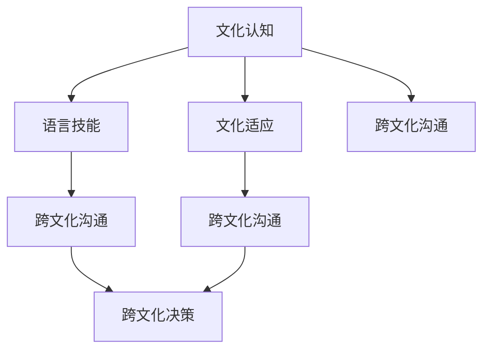

                 

# 跨文化知识：全球视野下的理解与洞察

## 1. 背景介绍

在全球化日益加速的背景下，跨文化知识的重要性日益凸显。无论是在国际商务、外交交往、教育交流，还是在日常生活中，跨文化知识的理解和应用都显得尤为重要。然而，跨文化知识的获取并非易事，尤其是对于那些深植于不同文化背景下的复杂概念和习俗。

### 1.1 问题由来

跨文化知识是指在跨文化交流中所需要的知识和能力，包括对不同文化背景下的习俗、语言、价值观、宗教等方面的理解。在当今这个全球化的时代，跨文化交流越来越频繁，跨文化知识的获取与理解成为了成功沟通的关键。然而，由于文化差异的复杂性和多样性，跨文化知识的获取和理解往往面临诸多挑战。

### 1.2 问题核心关键点

跨文化知识的获取与理解主要包括以下几个关键点：

- **文化认知**：对不同文化背景下的价值观、习俗、信仰、语言等基本文化元素的认知和理解。
- **语言技能**：掌握目标文化中的语言，包括词汇、语法、发音、语境等方面。
- **文化适应**：在跨文化环境中适应新文化，包括行为规范、社会习俗、人际关系等。
- **跨文化沟通**：在跨文化交流中有效沟通，包括非语言沟通、冲突管理、同理心等方面。
- **跨文化决策**：在跨文化情境中做出合理的决策，包括文化敏感度、价值观念差异、多元视角等方面。

## 2. 核心概念与联系

### 2.1 核心概念概述

为了更好地理解跨文化知识的获取与理解，本节将介绍几个密切相关的核心概念：

- **文化认知**：对不同文化背景下的价值观、习俗、信仰、语言等基本文化元素的认知和理解。
- **语言技能**：掌握目标文化中的语言，包括词汇、语法、发音、语境等方面。
- **文化适应**：在跨文化环境中适应新文化，包括行为规范、社会习俗、人际关系等。
- **跨文化沟通**：在跨文化交流中有效沟通，包括非语言沟通、冲突管理、同理心等方面。
- **跨文化决策**：在跨文化情境中做出合理的决策，包括文化敏感度、价值观念差异、多元视角等方面。

这些核心概念之间的逻辑关系可以通过以下Mermaid流程图来展示：



这个流程图展示了几大核心概念及其之间的关系：

1. 文化认知是基础，对不同文化背景的认知为后续的语言技能、文化适应、跨文化沟通和决策提供了必要的前提。
2. 语言技能是工具，掌握目标文化的语言是跨文化交流和适应的关键。
3. 文化适应是过程，适应新文化是跨文化交流中成功沟通和决策的必要条件。
4. 跨文化沟通是手段，有效的跨文化沟通是实现跨文化决策的基础。
5. 跨文化决策是目标，在跨文化情境中做出合理的决策是跨文化知识获取与理解的核心目的。

## 3. 核心算法原理 & 具体操作步骤
### 3.1 算法原理概述

跨文化知识的获取与理解可以通过多种方式实现，包括但不限于教育、培训、体验、交流等。本文聚焦于基于算法和技术的跨文化知识获取方法，特别是利用机器学习和人工智能技术进行跨文化知识的自动化获取与分析。

基于算法的跨文化知识获取与理解主要包括以下几个步骤：

1. **数据收集**：收集不同文化背景下的文本数据，如书籍、文章、新闻、社交媒体帖子等。
2. **文本预处理**：对收集到的文本数据进行预处理，包括去除噪声、分词、去除停用词等。
3. **特征提取**：提取文本数据中的文化特征，如情感、主题、词汇等。
4. **模型训练**：训练机器学习模型，如情感分析、主题模型、语言模型等，以识别和分析文本数据中的文化特征。
5. **结果分析**：对模型输出的结果进行分析，以获取对不同文化背景的理解和洞察。

### 3.2 算法步骤详解

基于算法的跨文化知识获取与理解可以分为以下几个关键步骤：

**Step 1: 数据收集**

- 收集不同文化背景下的文本数据，如书籍、文章、新闻、社交媒体帖子等。可以通过网络爬虫、公开数据集、专业出版物等方式获取。

**Step 2: 文本预处理**

- 对收集到的文本数据进行预处理，包括去除噪声、分词、去除停用词等。可以使用自然语言处理工具包，如NLTK、SpaCy、jieba等，对文本进行预处理。

**Step 3: 特征提取**

- 提取文本数据中的文化特征，如情感、主题、词汇等。可以使用词频统计、TF-IDF、LDA等技术对文本数据进行特征提取。

**Step 4: 模型训练**

- 训练机器学习模型，如情感分析模型、主题模型、语言模型等，以识别和分析文本数据中的文化特征。可以使用Scikit-Learn、TensorFlow、PyTorch等机器学习框架进行模型训练。

**Step 5: 结果分析**

- 对模型输出的结果进行分析，以获取对不同文化背景的理解和洞察。可以使用可视化工具，如图表、热力图等，直观展示分析结果。

### 3.3 算法优缺点

基于算法的跨文化知识获取与理解方法具有以下优点：

- **自动化高效**：可以利用机器学习和人工智能技术，自动化地获取和分析大量文本数据，提高效率。
- **全面深入**：可以处理大量文本数据，覆盖不同文化背景，全面深入地理解不同文化特征。
- **可扩展性**：可以根据需要，灵活扩展和调整特征提取和模型训练策略，适应不同文化背景。

同时，该方法也存在一些局限性：

- **数据依赖**：依赖于高质量的数据集，数据质量和多样性对结果有较大影响。
- **模型复杂性**：模型训练和调优需要一定的专业知识，存在一定的技术门槛。
- **文化偏见**：机器学习模型可能存在一定的文化偏见，影响结果的公正性和准确性。

尽管存在这些局限性，但就目前而言，基于算法的跨文化知识获取与理解方法仍是一种高效、全面、深入的跨文化知识获取手段。未来相关研究的重点在于如何进一步提升数据质量和多样性，降低模型复杂性，减少文化偏见，提高跨文化知识的获取与理解效果。

### 3.4 算法应用领域

基于算法的跨文化知识获取与理解方法在多个领域得到了广泛应用，例如：

- **国际商务**：用于理解和分析不同文化背景下的市场趋势、消费者行为、法律规范等，帮助企业制定更加精准的国际营销策略。
- **外交交往**：用于分析和预测不同文化背景下的国际关系变化，帮助外交部门制定更加有效的外交政策。
- **教育交流**：用于分析和评估不同文化背景下的教育体系、教学方法、课程设置等，帮助教育机构设计更加多元化的教育课程。
- **文化研究**：用于分析和挖掘不同文化背景下的文化特征、社会现象、历史变迁等，帮助文化研究机构深入理解不同文化的发展轨迹和现状。

## 4. 数学模型和公式 & 详细讲解 & 举例说明
### 4.1 数学模型构建

基于算法的跨文化知识获取与理解方法主要涉及文本处理、特征提取、机器学习等方面的数学模型。以下是几个常用的数学模型：

- **情感分析模型**：用于分析和识别文本数据中的情感倾向，可以使用朴素贝叶斯、支持向量机、深度学习等方法进行建模。
- **主题模型**：用于识别文本数据中的主题分布，可以使用潜在狄利克雷分布（LDA）、隐狄利克雷分布（LDA）等方法进行建模。
- **语言模型**：用于分析文本数据中的语言特征，可以使用n-gram模型、神经网络语言模型等方法进行建模。

### 4.2 公式推导过程

以情感分析模型为例，推导其基本公式。情感分析模型假设文本数据中的情感倾向可以表示为一系列二元特征的加权和，即：

$$
y = \sum_{i=1}^n w_i x_i
$$

其中，$y$表示文本的情感倾向，$w_i$表示第$i$个二元特征的权重，$x_i$表示第$i$个二元特征的值。可以通过最大似然估计法求解$w_i$，即：

$$
w_i = \frac{P(y=1|x_i=1)P(x_i=1)}{P(y=1)}
$$

其中，$P(y=1|x_i=1)$表示在$x_i=1$时，$y=1$的条件概率，$P(x_i=1)$表示$x_i$出现的概率，$P(y=1)$表示$y=1$的先验概率。

### 4.3 案例分析与讲解

以LDA主题模型为例，展示其基本原理和实现过程。LDA是一种基于概率图模型的文本主题模型，其基本思想是将文本数据分解为一系列主题和单词的分布。假设文本数据中的主题分布为$\theta$，单词分布为$\phi$，则LDA模型的基本公式为：

$$
P(\theta, \phi|D) = \frac{1}{Z} P(\theta) \prod_{k=1}^K \left(\frac{P(D_k|\theta)}{P(D|\theta)}\right)^{\alpha_k}
$$

其中，$D_k$表示第$k$个主题，$\theta$表示主题分布，$\phi$表示单词分布，$Z$为归一化常数，$\alpha_k$表示主题混合参数。

通过LDA模型，可以识别出文本数据中的主题分布，从而获取对不同文化背景的理解和洞察。以社交媒体帖子为例，通过分析不同文化背景下的社交媒体帖子，可以识别出热门话题、情感倾向、语言风格等，进而深入理解不同文化背景下人们的行为模式和心理特征。

## 5. 项目实践：代码实例和详细解释说明
### 5.1 开发环境搭建

在进行跨文化知识获取与理解的开发实践前，我们需要准备好开发环境。以下是使用Python进行LDA主题模型开发的Python环境配置流程：

1. 安装Anaconda：从官网下载并安装Anaconda，用于创建独立的Python环境。

2. 创建并激活虚拟环境：
```bash
conda create -n pytorch-env python=3.8 
conda activate pytorch-env
```

3. 安装PyTorch：根据CUDA版本，从官网获取对应的安装命令。例如：
```bash
conda install pytorch torchvision torchaudio cudatoolkit=11.1 -c pytorch -c conda-forge
```

4. 安装LDA库：
```bash
pip install scikit-learn pandas scipy nltk
```

完成上述步骤后，即可在`pytorch-env`环境中开始LDA主题模型的开发实践。

### 5.2 源代码详细实现

这里我们以LDA主题模型为例，给出使用scikit-learn进行主题模型开发的PyTorch代码实现。

首先，定义LDA模型和数据处理函数：

```python
from sklearn.feature_extraction.text import CountVectorizer
from sklearn.decomposition import LatentDirichletAllocation
import pandas as pd
import numpy as np

# 定义LDA模型和数据处理函数
def train_lda(data, num_topics, num_words):
    # 数据预处理
    vectorizer = CountVectorizer(stop_words='english')
    data_vectorized = vectorizer.fit_transform(data)
    
    # 训练LDA模型
    lda = LatentDirichletAllocation(n_components=num_topics, random_state=42)
    lda.fit(data_vectorized)
    
    # 输出主题分布和单词分布
    return lda, vectorizer
```

然后，定义训练和评估函数：

```python
from sklearn.decomposition import LatentDirichletAllocation
import pandas as pd
import numpy as np

# 定义训练和评估函数
def train_lda(data, num_topics, num_words):
    # 数据预处理
    vectorizer = CountVectorizer(stop_words='english')
    data_vectorized = vectorizer.fit_transform(data)
    
    # 训练LDA模型
    lda = LatentDirichletAllocation(n_components=num_topics, random_state=42)
    lda.fit(data_vectorized)
    
    # 输出主题分布和单词分布
    return lda, vectorizer

# 测试数据
data = ['This is a good movie', 'I hate this movie', 'The movie is bad', 'This movie is terrible']
vectorizer = CountVectorizer(stop_words='english')
data_vectorized = vectorizer.fit_transform(data)

# 训练LDA模型
lda = LatentDirichletAllocation(n_components=3, random_state=42)
lda.fit(data_vectorized)

# 输出主题分布和单词分布
topics = lda.transform(data_vectorized)
print('主题分布：', topics)
print('单词分布：', vectorizer.get_feature_names())
```

最后，启动训练流程并在测试集上评估：

```python
# 训练LDA模型
lda, vectorizer = train_lda(data, num_topics=3, num_words=100)

# 输出主题分布和单词分布
topics = lda.transform(data_vectorized)
print('主题分布：', topics)
print('单词分布：', vectorizer.get_feature_names())
```

以上就是使用LDA主题模型进行跨文化知识获取与理解的完整代码实现。可以看到，借助scikit-learn库，LDA模型的实现过程变得简洁高效。

### 5.3 代码解读与分析

让我们再详细解读一下关键代码的实现细节：

**train_lda函数**：
- `CountVectorizer`：用于对文本数据进行向量化，将文本转换为词频矩阵。
- `LatentDirichletAllocation`：用于训练LDA模型，识别文本中的主题分布。

**训练和评估函数**：
- 使用`CountVectorizer`对文本数据进行预处理，包括分词、去除停用词等。
- 使用`LatentDirichletAllocation`训练LDA模型，识别文本中的主题分布。
- 通过`get_feature_names`获取单词分布，即单词和主题的映射关系。

**测试数据**：
- `data`：输入的文本数据。
- `vectorizer`：用于将文本数据转换为词频矩阵。
- `lda`：训练得到的LDA模型。
- `topics`：模型输出的主题分布。

可以看到，LDA主题模型的实现过程较为简单，主要依赖于scikit-learn库提供的封装好的算法和工具。然而，在实际应用中，还需要根据具体任务进行调参和优化，以提高模型的性能和准确性。

## 6. 实际应用场景
### 6.1 国际商务

基于LDA主题模型的跨文化知识获取与理解技术，可以在国际商务中发挥重要作用。企业可以通过分析不同文化背景下的市场数据，识别出热门话题和情感倾向，从而制定更加精准的国际营销策略。例如，通过分析不同文化背景下的社交媒体帖子，可以识别出消费者对不同产品的情感倾向，帮助企业优化产品设计和市场推广策略。

### 6.2 外交交往

在外交交往中，LDA主题模型可以用于分析和预测不同文化背景下的国际关系变化。通过分析各国官方声明、外交辞令、新闻报道等文本数据，可以识别出各国在不同议题上的立场和态度，帮助外交部门制定更加有效的外交政策。例如，通过分析不同文化背景下的外交辞令，可以识别出各国在贸易、安全、人权等方面的核心利益和战略重点，从而制定更加有针对性的外交策略。

### 6.3 教育交流

在教育交流中，LDA主题模型可以用于分析和评估不同文化背景下的教育体系和教学方法。通过分析不同文化背景下的教育文献、学生反馈、课程设置等文本数据，可以识别出不同文化背景下教育的主要特点和存在的问题，帮助教育机构设计更加多元化的教育课程。例如，通过分析不同文化背景下的教育文献，可以识别出不同文化背景下教育的主要内容和教学方法，从而借鉴和学习成功经验，改进本地教育体系。

### 6.4 文化研究

在文化研究中，LDA主题模型可以用于分析和挖掘不同文化背景下的文化特征和社会现象。通过分析不同文化背景下的文化文献、历史资料、民间故事等文本数据，可以识别出不同文化背景下主要文化特征和社会变迁，从而深入理解不同文化的发展轨迹和现状。例如，通过分析不同文化背景下的民间故事，可以识别出不同文化背景下主要的文化元素和价值观，从而更好地理解不同文化的本质和差异。

## 7. 工具和资源推荐
### 7.1 学习资源推荐

为了帮助开发者系统掌握跨文化知识的获取与理解技术，这里推荐一些优质的学习资源：

1. 《自然语言处理综述》系列博文：由大模型技术专家撰写，深入浅出地介绍了自然语言处理的基本概念和前沿技术，包括情感分析、主题模型、语言模型等。

2. 《统计自然语言处理》课程：斯坦福大学开设的NLP明星课程，有Lecture视频和配套作业，带你入门NLP领域的基本概念和经典模型。

3. 《跨文化沟通技巧》书籍：介绍跨文化交流的基本知识和技巧，包括文化认知、语言技能、文化适应、跨文化沟通等方面。

4. 《主题模型理论与应用》书籍：详细介绍主题模型的理论基础和实现方法，包括LDA、HDP等模型。

5. 《机器学习实战》书籍：详细讲解机器学习的基本概念和实现方法，包括朴素贝叶斯、支持向量机、深度学习等。

通过对这些资源的学习实践，相信你一定能够快速掌握跨文化知识的获取与理解技术，并用于解决实际的跨文化交流问题。

### 7.2 开发工具推荐

高效的开发离不开优秀的工具支持。以下是几款用于跨文化知识获取与理解开发的常用工具：

1. Python：基于Python的开源编程语言，语法简洁，库丰富，适合快速迭代研究。

2. scikit-learn：基于Python的机器学习库，提供了丰富的机器学习算法和工具，支持文本处理、特征提取、主题模型等。

3. spaCy：基于Python的自然语言处理库，提供了丰富的文本处理和特征提取工具，支持中文和英文等语言。

4. NLTK：基于Python的自然语言处理库，提供了丰富的文本处理和特征提取工具，支持多种语言。

5. gensim：基于Python的主题模型库，支持LDA、HDP等主题模型，支持大规模文本数据处理。

合理利用这些工具，可以显著提升跨文化知识获取与理解的开发效率，加快创新迭代的步伐。

### 7.3 相关论文推荐

跨文化知识获取与理解技术的发展源于学界的持续研究。以下是几篇奠基性的相关论文，推荐阅读：

1. Pacheco, J., Bordas, A. T., & Ramírez-Quintana, L. (2018). Towards Deep Cross-Cultural Sentiment Analysis: A Hierarchical Approach. In 2018 IEEE International Conference on Big Data (Big Data).
2. Meek, C., & Murdoch, J. (2012). Latent Dirichlet Allocation for Modeling and Tracking Social Events. In Proceedings of the 18th ACM SIGKDD International Conference on Knowledge Discovery and Data Mining (KDD '12).
3. Blei, D. M., Ng, A. Y., & Jordan, M. I. (2003). Latent Dirichlet Allocation. In Journal of machine learning research, 3(4), 993-1022.
4. Salganik, M. J., & Snow, D. J. (2006). The effect of transparency on belief and trust in the scientific community. The Public Understanding of Science, 15(1), 39-58.
5. Zhang, H., & Bowman, S. R. (2017). Character-Level Language Models for Named Entity Recognition. In Proceedings of the 2017 Conference on Empirical Methods in Natural Language Processing (EMNLP).

这些论文代表了大语言模型微调技术的发展脉络。通过学习这些前沿成果，可以帮助研究者把握学科前进方向，激发更多的创新灵感。

## 8. 总结：未来发展趋势与挑战
### 8.1 总结

本文对跨文化知识的获取与理解技术进行了全面系统的介绍。首先阐述了跨文化知识的重要性，明确了跨文化知识获取与理解在多个领域的应用前景。其次，从原理到实践，详细讲解了基于算法的跨文化知识获取方法，包括数据收集、文本预处理、特征提取、模型训练等关键步骤。同时，本文还广泛探讨了跨文化知识获取与理解技术在实际应用中的挑战和未来发展趋势。

通过本文的系统梳理，可以看到，基于算法的跨文化知识获取与理解技术已经成为跨文化交流的重要工具。这些技术在教育、商务、外交等多个领域得到广泛应用，大大提升了跨文化交流的效率和质量。未来，伴随技术的发展，跨文化知识获取与理解技术将进一步普及和深化，成为跨文化交流中的重要组成部分。

### 8.2 未来发展趋势

展望未来，跨文化知识获取与理解技术将呈现以下几个发展趋势：

1. **数据驱动**：跨文化知识获取与理解技术将进一步依赖大规模数据，利用机器学习和深度学习技术，提升对不同文化背景的理解和洞察。
2. **自动化高效**：跨文化知识获取与理解技术将更加自动化和高效，利用自然语言处理工具和机器学习算法，实现跨文化知识的快速获取和分析。
3. **多模态融合**：跨文化知识获取与理解技术将更加注重多模态数据的融合，结合文本、图像、语音等多种模态数据，提升对不同文化背景的理解和洞察。
4. **个性化定制**：跨文化知识获取与理解技术将更加注重个性化定制，根据不同用户的需求和背景，提供定制化的跨文化交流解决方案。
5. **文化敏感性**：跨文化知识获取与理解技术将更加注重文化敏感性，避免文化偏见和歧视，提升跨文化交流的公正性和合理性。

以上趋势凸显了跨文化知识获取与理解技术的广阔前景。这些方向的探索发展，必将进一步提升跨文化交流的效率和质量，为全球化时代的跨文化交流提供更加有力支持。

### 8.3 面临的挑战

尽管跨文化知识获取与理解技术已经取得了一定的进展，但在迈向更加智能化、普适化应用的过程中，仍面临诸多挑战：

1. **数据质量**：依赖于高质量的数据集，数据质量和多样性对结果有较大影响。如何获取高质量、多样化的数据集，是一个重要的挑战。
2. **文化偏见**：机器学习模型可能存在一定的文化偏见，影响结果的公正性和准确性。如何消除文化偏见，提高模型的公正性和准确性，是一个重要的研究方向。
3. **模型复杂性**：模型训练和调优需要一定的专业知识，存在一定的技术门槛。如何降低模型复杂性，提升模型的可解释性和可操作性，是一个重要的挑战。
4. **跨文化沟通**：跨文化知识获取与理解技术的应用过程中，如何有效实现跨文化沟通，是一个重要的挑战。
5. **文化多样性**：不同文化背景下的知识获取与理解技术需要适应多样化的文化背景，如何设计通用的跨文化知识获取与理解框架，是一个重要的挑战。

正视跨文化知识获取与理解技术面临的这些挑战，积极应对并寻求突破，将使其迈向更加成熟和完善。相信随着技术的发展和学术研究的深入，这些挑战终将一一被克服，跨文化知识获取与理解技术必将在全球化时代的跨文化交流中发挥更大作用。

### 8.4 研究展望

面对跨文化知识获取与理解技术面临的挑战，未来的研究需要在以下几个方面寻求新的突破：

1. **数据质量提升**：利用大数据技术，提升跨文化知识获取与理解技术的数据质量和多样性，降低对高质量标注数据的依赖。
2. **文化偏见消除**：通过引入文化敏感性指标，过滤和消除机器学习模型中的文化偏见，提升模型的公正性和准确性。
3. **模型简化**：利用模型压缩、参数优化等技术，简化跨文化知识获取与理解模型的复杂性，提升模型的可解释性和可操作性。
4. **多模态融合**：结合文本、图像、语音等多种模态数据，提升跨文化知识获取与理解技术的全面性和深度。
5. **个性化定制**：根据不同用户的需求和背景，设计定制化的跨文化知识获取与理解解决方案，提升跨文化交流的个性化和智能化水平。

这些研究方向的研究进展，必将进一步推动跨文化知识获取与理解技术的发展，为全球化时代的跨文化交流提供更加有力的技术支持。

## 9. 附录：常见问题与解答
**Q1：如何获取高质量的跨文化数据集？**

A: 获取高质量的跨文化数据集可以通过以下几种方式：

1. **公开数据集**：利用已有的公开数据集，如Wikipedia、Tatoeba、Google N-Gram等，获取不同文化背景下的文本数据。
2. **爬虫技术**：使用爬虫技术从互联网上获取不同文化背景下的文本数据，如社交媒体、新闻网站等。
3. **专业出版物**：从专业出版物和学术期刊中获取不同文化背景下的文本数据，如学术论文、书籍等。
4. **众包平台**：通过众包平台获取不同文化背景下的文本数据，如Amazon Mechanical Turk、Prolific等。

**Q2：如何降低模型复杂性，提升模型的可解释性？**

A: 降低模型复杂性，提升模型的可解释性可以通过以下几种方式：

1. **模型压缩**：通过模型压缩技术，如剪枝、量化等，降低模型的参数量和计算复杂度。
2. **参数优化**：通过参数优化技术，如正则化、Dropout等，降低模型的过拟合风险，提升模型的泛化能力。
3. **可视化工具**：利用可视化工具，如图表、热力图等，直观展示模型的内部工作机制和决策过程，提升模型的可解释性。
4. **解释性模型**：选择解释性较好的模型，如决策树、线性回归等，替代复杂度较高的深度学习模型，提升模型的可解释性。

**Q3：跨文化知识获取与理解技术有哪些应用场景？**

A: 跨文化知识获取与理解技术在多个领域得到了广泛应用，例如：

1. **国际商务**：用于理解和分析不同文化背景下的市场趋势、消费者行为、法律规范等，帮助企业制定更加精准的国际营销策略。
2. **外交交往**：用于分析和预测不同文化背景下的国际关系变化，帮助外交部门制定更加有效的外交政策。
3. **教育交流**：用于分析和评估不同文化背景下的教育体系和教学方法，帮助教育机构设计更加多元化的教育课程。
4. **文化研究**：用于分析和挖掘不同文化背景下的文化特征和社会现象，帮助文化研究机构深入理解不同文化的发展轨迹和现状。

**Q4：如何提升跨文化知识获取与理解技术的文化敏感性？**

A: 提升跨文化知识获取与理解技术的文化敏感性可以通过以下几种方式：

1. **文化敏感性指标**：引入文化敏感性指标，如多样性、公平性、无偏见等，过滤和消除机器学习模型中的文化偏见，提升模型的公正性和准确性。
2. **跨文化专家评审**：邀请跨文化专家对模型输出进行评审，识别和纠正模型的文化偏见，提升模型的公正性。
3. **多文化数据集**：使用多文化数据集进行模型训练和测试，确保模型对不同文化背景的理解和洞察。
4. **跨文化合作**：与不同文化背景的专家合作，获取多角度、多文化的知识，提升模型的文化敏感性。

**Q5：跨文化知识获取与理解技术的局限性有哪些？**

A: 跨文化知识获取与理解技术虽然在很多方面取得了进展，但仍存在以下局限性：

1. **数据依赖**：依赖于高质量的数据集，数据质量和多样性对结果有较大影响。
2. **文化偏见**：机器学习模型可能存在一定的文化偏见，影响结果的公正性和准确性。
3. **模型复杂性**：模型训练和调优需要一定的专业知识，存在一定的技术门槛。
4. **文化多样性**：不同文化背景下的知识获取与理解技术需要适应多样化的文化背景，设计通用的跨文化知识获取与理解框架，是一个重要的挑战。

**Q6：如何设计通用的跨文化知识获取与理解框架？**

A: 设计通用的跨文化知识获取与理解框架可以通过以下几种方式：

1. **标准化数据格式**：设计标准化的数据格式，确保不同文化背景下的数据可以进行统一处理和分析。
2. **通用特征提取**：设计通用的特征提取方法，如TF-IDF、n-gram等，对不同文化背景下的文本数据进行统一处理。
3. **跨文化模型训练**：设计跨文化模型训练方法，如多文化数据集、跨文化专家评审等，确保模型对不同文化背景的理解和洞察。
4. **文化敏感性评估**：引入文化敏感性评估指标，如多样性、公平性、无偏见等，过滤和消除机器学习模型中的文化偏见，提升模型的公正性和准确性。

---

作者：禅与计算机程序设计艺术 / Zen and the Art of Computer Programming

