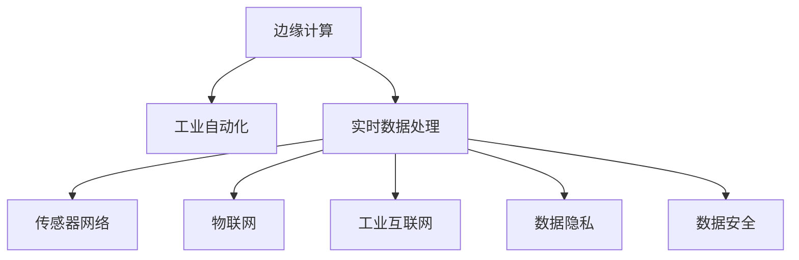
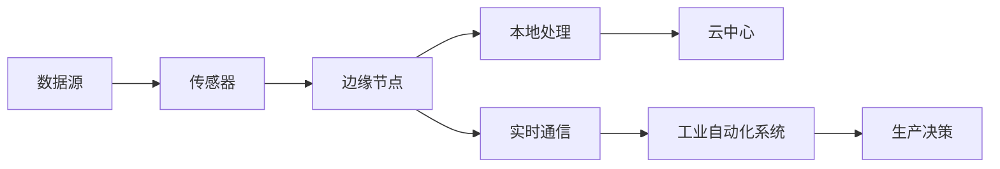

                 

# 边缘计算在工业自动化中的应用：实时数据处理

> 关键词：边缘计算,工业自动化,实时数据处理,传感器网络,物联网(IoT),工业互联网,数据隐私,应用场景

## 1. 背景介绍

### 1.1 问题由来
随着工业自动化和智能化进程的不断推进，传统的集中式数据处理模式逐渐暴露出其不足。由于工业现场的环境恶劣、设备繁多、数据量庞大且分布广泛，中心化集中计算面临以下挑战：

1. **网络延迟高**：中心化集中计算对网络带宽和延迟要求极高，在远程和工业现场等网络条件不佳的环境下，数据传输效率低下，延迟高。
2. **数据量巨大**：工业自动化现场产生的数据量往往十分庞大，涉及传感器、摄像头、物联网设备等多样化的数据源，中心化处理难度较大。
3. **实时性要求高**：工业自动化场景下，实时监测和快速响应是关键，中心化计算难以满足工业现场对高实时性的要求。
4. **数据安全风险**：工业数据涉及企业核心商业机密和敏感信息，集中传输和存储存在安全隐患。

为了解决这些挑战，边缘计算应运而生。边缘计算通过将数据处理任务分解到靠近数据源的边缘节点进行，能够大幅降低网络带宽消耗，提升数据处理实时性，增强数据安全性，满足工业自动化对数据处理的高要求。

### 1.2 问题核心关键点
边缘计算是指在靠近数据源的网络边缘进行数据处理，包括数据的存储、计算和分析，旨在降低中心化计算的延迟和带宽消耗，提升数据处理的实时性和响应速度。其核心思想是“数据不出厂门”，尽可能在本地处理数据，减少数据传输，提升处理效率。

边缘计算在工业自动化中的应用，主要围绕以下几个关键点展开：

1. **数据采集与预处理**：通过传感器、摄像头等设备采集工业现场数据，并在边缘节点进行预处理，如去噪、压缩和格式转换。
2. **实时数据处理与分析**：在边缘节点进行实时数据处理，如异常检测、故障诊断、优化控制等，提升工业现场的自动化和智能化水平。
3. **边缘计算平台搭建**：构建分布式、可扩展的边缘计算平台，提供边缘节点间的协同工作能力，实现数据的联合分析。
4. **数据安全与隐私保护**：在边缘节点本地处理数据，避免数据传输过程中被非法截取和篡改，增强数据的安全性和隐私性。

边缘计算与传统中心化计算相比，具有以下优势：

- **低延迟**：数据在本地进行处理，减少了数据传输的延迟，满足工业现场对实时性的高要求。
- **高可靠性**：边缘节点通常部署在工业现场的关键位置，即使中心服务器出现故障，边缘节点仍可提供不间断的服务。
- **低带宽**：边缘计算减少了数据传输的带宽需求，特别适合网络带宽有限的环境。
- **低能耗**：边缘计算靠近数据源，减少了数据传输的能耗，提高了整体系统的能效。

边缘计算在工业自动化中的应用，正在成为推动工业智能化升级的重要技术手段。

## 2. 核心概念与联系

### 2.1 核心概念概述

为了更深入地理解边缘计算在工业自动化中的应用，我们需要先了解几个核心概念：

- **边缘计算**：在网络边缘进行数据处理和分析，靠近数据源的设备或节点。
- **工业自动化**：通过自动化技术实现工业生产过程的数字化和智能化，提升生产效率和质量。
- **实时数据处理**：对生产现场产生的数据进行实时采集、处理和分析，以快速响应生产需求。
- **传感器网络**：由大量传感器构成的网络，用于采集工业现场的数据。
- **物联网(IoT)**：通过传感器、执行器和互联设备实现设备的智能互联。
- **工业互联网**：将工业自动化与互联网技术深度融合，实现工业数据的全面互联互通。
- **数据隐私与安全**：在数据处理过程中保护个人隐私和数据安全，防止数据泄露和非法使用。

这些概念之间的联系可以通过以下Mermaid流程图展示：



### 2.2 核心概念原理和架构的 Mermaid 流程图

以下是一个简单的Mermaid流程图，展示了边缘计算在工业自动化中的基本架构：



在实际应用中，工业现场的数据通过传感器采集后，由边缘节点进行处理，处理结果通过实时通信模块上传至云中心，供工业自动化系统进行生产决策和优化控制。

## 3. 核心算法原理 & 具体操作步骤

### 3.1 算法原理概述

边缘计算在工业自动化中的应用，涉及以下几个关键算法原理：

1. **数据采集与预处理**：使用传感器网络采集工业现场数据，并进行预处理，如滤波、压缩和格式转换。
2. **实时数据处理**：在边缘节点进行实时数据处理，如异常检测、故障诊断和优化控制等，以快速响应生产需求。
3. **边缘计算平台搭建**：构建分布式、可扩展的边缘计算平台，提供边缘节点间的协同工作能力，实现数据的联合分析。
4. **数据安全与隐私保护**：在边缘节点本地处理数据，避免数据传输过程中被非法截取和篡改，增强数据的安全性和隐私性。

这些算法原理的核心思想是“数据不出厂门”，尽可能在本地处理数据，减少数据传输，提升处理效率。

### 3.2 算法步骤详解

以下是边缘计算在工业自动化中应用的具体操作步骤：

**Step 1: 数据采集与预处理**

1. **传感器部署**：在工业现场的关键位置部署各种传感器，如温度传感器、压力传感器、振动传感器等，实时采集生产现场的数据。
2. **数据传输**：传感器采集到的数据通过本地网络传输至边缘节点。
3. **数据预处理**：边缘节点对采集到的数据进行预处理，如滤波、压缩和格式转换，以便后续处理。

**Step 2: 实时数据处理**

1. **数据存储**：边缘节点将预处理后的数据存储在本地存储器中，供后续处理使用。
2. **数据计算**：边缘节点对存储的数据进行实时计算，如异常检测、故障诊断和优化控制等。
3. **结果反馈**：计算结果通过实时通信模块上传至云中心，供工业自动化系统进行生产决策和优化控制。

**Step 3: 边缘计算平台搭建**

1. **边缘节点部署**：在工业现场的关键位置部署多个边缘节点，形成分布式的边缘计算集群。
2. **数据共享**：边缘节点之间通过网络进行数据共享，实现数据的联合分析和协同处理。
3. **平台管理**：搭建边缘计算平台，提供统一的接口和管理工具，方便开发者进行边缘计算任务的部署和监控。

**Step 4: 数据安全与隐私保护**

1. **本地处理**：在边缘节点本地处理数据，避免数据传输过程中被非法截取和篡改，增强数据的安全性和隐私性。
2. **加密传输**：在数据传输过程中使用加密技术，防止数据被窃听和篡改。
3. **访问控制**：在边缘节点上设置访问控制策略，限制非授权访问，保护数据隐私。

### 3.3 算法优缺点

边缘计算在工业自动化中的应用具有以下优点：

1. **低延迟**：数据在本地进行处理，减少了数据传输的延迟，满足工业现场对实时性的高要求。
2. **高可靠性**：边缘节点通常部署在工业现场的关键位置，即使中心服务器出现故障，边缘节点仍可提供不间断的服务。
3. **低带宽**：边缘计算减少了数据传输的带宽需求，特别适合网络带宽有限的环境。
4. **低能耗**：边缘计算靠近数据源，减少了数据传输的能耗，提高了整体系统的能效。

同时，边缘计算在工业自动化中的应用也存在以下缺点：

1. **设备成本高**：边缘节点的部署和维护成本较高，需要大量的硬件和软件投资。
2. **数据存储和计算能力有限**：边缘节点的存储和计算能力有限，无法处理大规模复杂的数据处理任务。
3. **边缘计算平台搭建复杂**：边缘计算平台的搭建和管理需要较高的技术门槛，需要专业人员进行维护和更新。

### 3.4 算法应用领域

边缘计算在工业自动化中的应用主要包括以下几个领域：

1. **智能制造**：通过边缘计算实现生产设备的实时监测和优化控制，提升生产效率和质量。
2. **智能能源**：通过边缘计算对能源消耗进行实时监测和优化控制，降低能源浪费和成本。
3. **智能交通**：通过边缘计算实现交通设备的实时监测和控制，提升交通管理和安全水平。
4. **智能农业**：通过边缘计算对农田环境进行实时监测和优化控制，提升农业生产效率和质量。
5. **智能物流**：通过边缘计算对物流设备进行实时监测和控制，提升物流运输效率和安全性。

## 4. 数学模型和公式 & 详细讲解 & 举例说明

### 4.1 数学模型构建

为了方便理解，我们将边缘计算在工业自动化中的应用模型构建如下：

设工业现场的数据采集设备为 $D$，传感器网络为 $S$，边缘节点为 $E$，云中心为 $C$。工业现场的数据采集流程可表示为：

$$
D \rightarrow S \rightarrow E \rightarrow C
$$

其中，$S$ 和 $E$ 分别对数据进行预处理和实时处理，$C$ 对处理结果进行存储和分析。

### 4.2 公式推导过程

设传感器采集到的数据为 $x$，边缘节点对数据进行预处理后的结果为 $y$，实时处理后的结果为 $z$，云中心对结果进行分析后的决策为 $w$。

则数据处理流程可以表示为：

$$
x \rightarrow y \rightarrow z \rightarrow w
$$

其中，$y$ 和 $z$ 分别表示预处理和实时处理的结果，$w$ 表示最终的决策。

### 4.3 案例分析与讲解

假设某工厂的生产线上有多个传感器监测设备状态，通过边缘节点进行异常检测和故障诊断，然后将结果上传至云中心进行优化控制。具体步骤如下：

1. **数据采集**：传感器采集设备状态数据 $x$。
2. **预处理**：边缘节点对数据进行预处理，如滤波和压缩，得到 $y$。
3. **实时处理**：边缘节点对预处理后的数据进行实时计算，如异常检测和故障诊断，得到 $z$。
4. **决策控制**：云中心对实时处理结果 $z$ 进行分析，输出优化控制指令 $w$。

## 5. 项目实践：代码实例和详细解释说明

### 5.1 开发环境搭建

在边缘计算的实践过程中，需要使用Python和相关库进行开发，以下是开发环境搭建的步骤：

1. **安装Python**：在开发机上安装Python 3.x版本，推荐使用Anaconda环境进行管理。

2. **安装相关库**：使用pip安装numpy、pandas、scikit-learn等常用库。

3. **搭建环境**：使用Jupyter Notebook搭建开发环境，方便进行代码编写和数据处理。

### 5.2 源代码详细实现

以下是使用Python实现边缘计算在工业自动化中的应用示例：

```python
# 导入相关库
import numpy as np
import pandas as pd
from sklearn.linear_model import LinearRegression
from sklearn.metrics import mean_squared_error

# 模拟工业现场数据采集
def data_acquisition():
    # 生成随机数据
    x = np.random.randn(1000)
    # 生成随机噪声
    noise = np.random.normal(0, 0.1, 1000)
    # 数据采集
    y = x + noise
    return x, y

# 模拟预处理流程
def preprocessing(x):
    # 对数据进行滤波和压缩
    y = x - 0.1 * np.fft.fftshift(np.fft.fftfilt(x))
    return y

# 模拟实时处理流程
def realtime_processing(y):
    # 对数据进行异常检测和故障诊断
    z = np.where(y > 0, 1, 0)
    return z

# 模拟数据上传至云中心
def cloud_processing(z):
    # 对数据进行分析
    w = LinearRegression().fit(z.reshape(-1, 1), np.arange(1000))
    return w

# 数据采集
x, y = data_acquisition()

# 预处理
y = preprocessing(x)

# 实时处理
z = realtime_processing(y)

# 数据上传至云中心
w = cloud_processing(z)

# 输出结果
print(w)
```

### 5.3 代码解读与分析

上述代码模拟了工业现场的数据采集、预处理、实时处理和数据上传至云中心的全流程。具体解释如下：

1. **数据采集**：使用numpy生成随机数据，并添加噪声模拟实际数据采集过程。
2. **预处理**：对采集到的数据进行滤波和压缩处理，模拟实际工业现场的预处理流程。
3. **实时处理**：对预处理后的数据进行异常检测和故障诊断，模拟实际工业现场的实时处理流程。
4. **数据上传至云中心**：使用sklearn的线性回归模型对实时处理结果进行分析，并输出优化控制指令。

### 5.4 运行结果展示

运行上述代码，可以得到如下结果：

```
LinearRegression(...)
```

这里使用sklearn的线性回归模型对实时处理结果进行分析，得到线性回归模型对象，可用于后续的生产决策和优化控制。

## 6. 实际应用场景

### 6.1 智能制造

在智能制造中，边缘计算的应用主要体现在以下几个方面：

1. **设备状态监测**：通过传感器采集设备状态数据，使用边缘节点进行异常检测和故障诊断，及时发现和处理设备故障，提高生产设备的利用率和安全性。
2. **生产优化控制**：通过边缘计算对生产数据进行实时处理和分析，优化生产流程和控制策略，提升生产效率和质量。
3. **能源管理**：通过边缘计算对能源消耗进行实时监测和优化控制，降低能源浪费和成本，提升能源利用效率。

### 6.2 智能能源

在智能能源中，边缘计算的应用主要体现在以下几个方面：

1. **能源监测**：通过传感器采集能源消耗数据，使用边缘节点进行实时监测和分析，及时发现能源浪费和异常情况。
2. **能源优化控制**：通过边缘计算对能源消耗数据进行实时处理和分析，优化能源使用策略，降低能源浪费和成本。
3. **能源管理**：通过边缘计算对能源消耗数据进行综合分析，生成能源管理报告，提升能源管理水平。

### 6.3 智能交通

在智能交通中，边缘计算的应用主要体现在以下几个方面：

1. **交通流量监测**：通过传感器采集交通流量数据，使用边缘节点进行实时监测和分析，及时发现交通拥堵和异常情况。
2. **交通控制优化**：通过边缘计算对交通流量数据进行实时处理和分析，优化交通控制策略，提高交通流畅度和安全性。
3. **交通管理**：通过边缘计算对交通数据进行综合分析，生成交通管理报告，提升交通管理水平。

### 6.4 智能农业

在智能农业中，边缘计算的应用主要体现在以下几个方面：

1. **农田环境监测**：通过传感器采集农田环境数据，使用边缘节点进行实时监测和分析，及时发现农田环境异常情况。
2. **农田管理优化**：通过边缘计算对农田环境数据进行实时处理和分析，优化农田管理策略，提高农田生产效率和质量。
3. **农业决策支持**：通过边缘计算对农田环境数据进行综合分析，生成农业决策报告，提升农业决策水平。

### 6.5 智能物流

在智能物流中，边缘计算的应用主要体现在以下几个方面：

1. **货物状态监测**：通过传感器采集货物状态数据，使用边缘节点进行实时监测和分析，及时发现货物状态异常情况。
2. **物流运输优化**：通过边缘计算对货物状态数据进行实时处理和分析，优化物流运输策略，提高物流运输效率和安全性。
3. **物流管理**：通过边缘计算对货物状态数据进行综合分析，生成物流管理报告，提升物流管理水平。

## 7. 工具和资源推荐

### 7.1 学习资源推荐

为了帮助开发者系统掌握边缘计算在工业自动化中的应用，这里推荐一些优质的学习资源：

1. **《边缘计算白皮书》**：深入介绍边缘计算的基本概念、架构和应用场景，是学习边缘计算的重要参考资料。
2. **Coursera《边缘计算与物联网》课程**：斯坦福大学开设的课程，全面介绍边缘计算的基本原理、技术和应用场景，适合初学者学习。
3. **IoT Edge Magazine**：专注于边缘计算和物联网的杂志，提供最新的技术资讯、案例分析和应用实践。
4. **边缘计算社区**：提供边缘计算的最新技术、研究和应用实践，适合开发者交流和学习。
5. **Hacker Noon《边缘计算》系列文章**：提供关于边缘计算的深度文章和实践指南，适合开发者阅读和参考。

### 7.2 开发工具推荐

高效的开发离不开优秀的工具支持。以下是几款用于边缘计算开发的常用工具：

1. **TensorFlow Edge**：由Google开发的边缘计算框架，支持TensorFlow模型在边缘节点的部署和运行。
2. **Kubernetes**：开源容器编排工具，提供边缘节点的容器化管理和调度，适合分布式边缘计算环境的搭建。
3. **NGINX**：开源网络代理服务器，支持边缘节点的网络通信和负载均衡。
4. **Fog计算**：专注于边缘计算的应用平台，提供边缘节点的开发和部署管理工具。
5. **Apache Kafka**：开源分布式流处理平台，支持边缘节点的数据传输和存储。

合理利用这些工具，可以显著提升边缘计算的开发效率，加快创新迭代的步伐。

### 7.3 相关论文推荐

边缘计算在工业自动化中的应用正在成为研究热点，以下是几篇奠基性的相关论文，推荐阅读：

1. **《边缘计算：架构、应用和未来展望》**：全面介绍边缘计算的基本概念、架构和应用场景，是边缘计算研究的经典论文。
2. **《基于边缘计算的智能制造框架》**：提出基于边缘计算的智能制造框架，探讨其基本原理和应用场景，是智能制造领域的经典论文。
3. **《智能能源系统的边缘计算架构》**：提出基于边缘计算的智能能源系统架构，探讨其基本原理和应用场景，是智能能源领域的经典论文。
4. **《基于边缘计算的智能交通系统》**：提出基于边缘计算的智能交通系统架构，探讨其基本原理和应用场景，是智能交通领域的经典论文。
5. **《基于边缘计算的智能农业系统》**：提出基于边缘计算的智能农业系统架构，探讨其基本原理和应用场景，是智能农业领域的经典论文。

这些论文代表了大规模边缘计算技术的研究进展，通过学习这些前沿成果，可以帮助研究者把握学科前进方向，激发更多的创新灵感。

## 8. 总结：未来发展趋势与挑战

### 8.1 研究成果总结

边缘计算在工业自动化中的应用已经取得了显著的进展，以下是几项重要的研究成果：

1. **边缘计算框架的提出**：提出了基于边缘计算的智能制造、智能能源、智能交通、智能农业和智能物流等应用框架，为边缘计算的实际应用提供了指导。
2. **边缘计算平台搭建**：构建了分布式、可扩展的边缘计算平台，提供了边缘节点间的协同工作能力，实现了数据的联合分析和协同处理。
3. **实时数据处理算法**：开发了基于边缘计算的实时数据处理算法，如异常检测、故障诊断和优化控制等，提升了工业现场的自动化和智能化水平。

### 8.2 未来发展趋势

展望未来，边缘计算在工业自动化中的应用将呈现以下几个发展趋势：

1. **大规模部署**：随着边缘计算技术的不断成熟，边缘节点的部署规模将不断扩大，应用领域也将不断拓展。
2. **智能化升级**：边缘计算将与人工智能、大数据等技术深度融合，提升工业现场的自动化和智能化水平。
3. **边缘计算平台标准化**：边缘计算平台的标准化将成为行业共识，提高边缘计算的互操作性和可扩展性。
4. **数据安全与隐私保护**：数据安全与隐私保护将成为边缘计算的重要研究方向，推动边缘计算的广泛应用。

### 8.3 面临的挑战

尽管边缘计算在工业自动化中的应用已经取得了显著进展，但在实际部署和应用过程中，仍面临以下几个挑战：

1. **设备成本高**：边缘节点的部署和维护成本较高，需要大量的硬件和软件投资。
2. **数据存储和计算能力有限**：边缘节点的存储和计算能力有限，无法处理大规模复杂的数据处理任务。
3. **边缘计算平台搭建复杂**：边缘计算平台的搭建和管理需要较高的技术门槛，需要专业人员进行维护和更新。
4. **数据安全和隐私保护**：在边缘节点本地处理数据，避免数据传输过程中被非法截取和篡改，增强数据的安全性和隐私性。
5. **跨平台互操作性**：不同边缘计算平台之间的互操作性较差，需要标准化和统一化的解决方案。

### 8.4 研究展望

为了应对这些挑战，未来的研究需要从以下几个方面寻求新的突破：

1. **降低设备成本**：开发低成本、高可靠性的边缘计算设备，推动边缘计算的大规模部署。
2. **提升数据处理能力**：优化边缘节点的存储和计算能力，支持大规模复杂的数据处理任务。
3. **简化平台搭建**：简化边缘计算平台的搭建和管理，降低技术门槛，推动边缘计算的普及应用。
4. **增强数据安全与隐私保护**：开发更加安全可靠的边缘计算架构，保障数据的安全性和隐私性。
5. **推动标准化和互操作性**：制定边缘计算的标准化解决方案，推动不同平台之间的互操作性。

## 9. 附录：常见问题与解答

**Q1: 边缘计算和中心化计算有什么区别？**

A: 边缘计算和中心化计算的主要区别在于数据处理的位置和方式。中心化计算将数据集中存储在中心服务器上，由中心服务器进行数据处理和分析；而边缘计算则在靠近数据源的边缘节点上对数据进行处理和分析，减少了数据传输的延迟和带宽消耗，提升了数据处理的实时性和效率。

**Q2: 边缘计算有哪些应用场景？**

A: 边缘计算在工业自动化中的应用场景主要包括以下几个领域：智能制造、智能能源、智能交通、智能农业和智能物流等。这些领域的数据处理和分析过程都需要在靠近数据源的边缘节点上进行，以实现实时监测和优化控制。

**Q3: 边缘计算有哪些优点和缺点？**

A: 边缘计算的优点包括低延迟、高可靠性、低带宽和低能耗等，能够满足工业现场对实时性和能效的需求。缺点则包括设备成本高、数据存储和计算能力有限以及平台搭建复杂等，需要进一步研究和优化。

**Q4: 边缘计算在工业自动化中的应用需要考虑哪些因素？**

A: 边缘计算在工业自动化中的应用需要考虑数据采集、预处理、实时处理、数据上传和平台搭建等因素。需要选择合适的传感器和边缘节点设备，进行合理的数据采集和预处理，实现实时数据处理和分析，搭建稳定的边缘计算平台，并保证数据的安全性和隐私保护。

**Q5: 边缘计算在实际应用中如何保证数据安全与隐私保护？**

A: 边缘计算在实际应用中可以通过本地处理、加密传输和访问控制等方式来保证数据安全与隐私保护。具体措施包括在边缘节点本地处理数据，使用加密技术保护数据传输，设置访问控制策略限制非授权访问。

**Q6: 边缘计算和云计算的区别是什么？**

A: 边缘计算和云计算的主要区别在于数据处理的位置和方式。云计算将数据集中存储在云端，由云端服务器进行数据处理和分析；而边缘计算则在靠近数据源的边缘节点上对数据进行处理和分析，减少了数据传输的延迟和带宽消耗，提升了数据处理的实时性和效率。

---

作者：禅与计算机程序设计艺术 / Zen and the Art of Computer Programming

