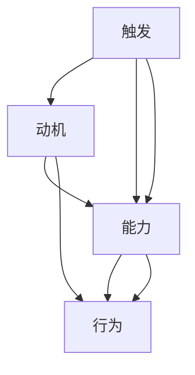

                 

# 运用福格模型培养团队良习惯

> 关键词：行为设计, 行为改变, 动机能级模型, 心理与行为科学, 团队文化

## 1. 背景介绍

### 1.1 问题由来
在快速发展的科技行业中，团队的发展离不开一个良好的工作习惯和氛围。但是，在现代团队建设过程中，经常会遇到以下问题：
- 团队成员之间沟通不畅，导致任务交接和项目推进困难；
- 团队缺乏有效的协作机制，导致效率低下和目标达成困难；
- 团队成员士气低落，导致创新和执行力不足；
- 团队文化缺乏，导致成员归属感和凝聚力不强。

为了解决这些问题，很多企业尝试采用各种管理和培训方法，如绩效考核、培训讲座、团队建设活动等。但这些方法往往收效甚微，原因在于它们没有触及到团队行为的深层次原因。为了更有效地培养团队的良好习惯，本文将介绍福格行为设计模型（Fogg’s Model），并结合心理与行为科学原理，提出一套基于福格模型的团队行为改变策略。

### 1.2 问题核心关键点
福格行为设计模型由行为设计师B.J.福格（B.J. Fogg）提出，用于描述和设计人们的行为，将行为拆解为触发、动机和能力三个关键要素，并强调动机和能力之间的平衡。该模型认为，任何行为都可以通过控制触发、动机和能力三个要素来改变。

- **触发**：指的是触发行为发生的情境或事件，如一个邮件提醒，一个工作报告的截止日期等。
- **动机**：指的是行为发生的内在驱动，如成就感、归属感、利益等。
- **能力**：指的是完成行为所需的资源，如时间、金钱、技能等。

通过优化触发、动机和能力三个要素，可以有效地引导和改变团队成员的行为。在团队建设过程中，福格模型可以帮助设计出具有可持续性、适应性和高效性的行为模式。

## 2. 核心概念与联系

### 2.1 核心概念概述

为了更好地理解福格模型在团队行为改变中的应用，本节将介绍几个密切相关的核心概念：

- **行为设计**：基于心理学和行为科学的理论，设计出能够引导和改变人们行为的方法和工具。
- **动机能级模型**：由B.J.福格提出，将动机分为六个等级，从无动机到高动机，并强调动机与行为之间的关系。
- **触发设计**：通过设计具体的触发情境，提高行为发生的可能性。
- **能力增强**：通过提供必要的资源和支持，降低完成行为的难度。
- **习惯培养**：将行为设计为自动化过程，形成长期稳定的习惯。

这些核心概念之间的逻辑关系可以通过以下Mermaid流程图来展示：



这个流程图展示出触发、动机和能力三个要素如何共同作用于行为改变：

1. 触发为行为的发生提供情境，动机驱动行为的发生，能力增强行为的可执行性。
2. 通过合理的触发设计，可以显著提高行为的发生频率。
3. 通过增强能力，可以降低行为发生的难度，提高行为的可持续性。
4. 通过习惯培养，将行为自动化，形成长期稳定的习惯。

这些核心概念共同构成了福格模型的理论框架，并应用于团队行为改变的设计中。

## 3. 核心算法原理 & 具体操作步骤
### 3.1 算法原理概述

福格模型的核心原理是通过控制触发、动机和能力三个要素，设计出能够引导和改变人们行为的方法和工具。该模型的具体应用包括以下步骤：

1. **识别关键行为**：明确需要改变的行为，并分析该行为的具体触发、动机和能力要素。
2. **触发设计**：设计具体的触发情境，如邮件提醒、日程安排等，以提高行为发生的可能性。
3. **动机设计**：通过奖励机制、荣誉体系等方法，增强行为的动机，如成就感、归属感等。
4. **能力增强**：提供必要的资源和支持，降低完成行为的难度，如时间、技能培训等。
5. **习惯培养**：将行为设计为自动化过程，形成长期稳定的习惯，如设定每日任务清单、周期性复盘等。

通过以上步骤，可以有效地引导和改变团队成员的行为，提升团队的协作效率和执行力。

### 3.2 算法步骤详解

以下是福格模型在团队行为改变中的具体应用步骤：

**Step 1: 识别关键行为**

在团队建设过程中，首先需要识别出需要改变的关键行为，并分析其触发、动机和能力要素。例如，对于“及时交付任务”这一行为，触发要素可以是任务截止日期或团队会议；动机要素可以是成就感、团队认可；能力要素可以是任务理解和执行技能。

**Step 2: 触发设计**

为了提高关键行为的发生频率，需要设计具体的触发情境。例如，可以为每个任务设置提醒，定期更新进度，并在任务截止前发送邮件提醒。通过这些具体的触发情境，团队成员会更有可能按时完成任务。

**Step 3: 动机设计**

增强行为的动机是行为改变的关键。可以通过设置奖励机制、荣誉体系等方法，增加行为的吸引力。例如，对于按时完成任务的成员，可以给予奖金、表彰或晋升机会。通过这些动机设计，团队成员会更有动力去完成任务。

**Step 4: 能力增强**

降低关键行为执行的难度是提升行为可持续性的关键。可以通过提供必要的资源和支持，增强团队成员的能力。例如，为团队成员提供技能培训、工具支持，或分配更有经验的人员协助。通过这些能力增强措施，团队成员可以更轻松地完成任务。

**Step 5: 习惯培养**

将关键行为自动化，形成长期稳定的习惯是行为改变的关键。可以通过设定每日任务清单、周期性复盘等方法，将行为设计为自动化过程。例如，每天早上分配任务，并定期进行进度复盘和反馈。通过这些习惯培养措施，团队成员可以更高效地完成任务。

### 3.3 算法优缺点

福格模型的优点包括：
1. **系统化**：通过明确的行为设计步骤，系统地解决团队行为问题，减少混乱和冲突。
2. **可执行性**：提供了具体可行的触发和动机设计方法，易于实施。
3. **可扩展性**：适用于各类团队行为问题的解决，具有广泛的应用范围。
4. **高效性**：通过科学的设计和实施，可以快速提升团队协作效率和执行力。

福格模型的缺点包括：
1. **复杂性**：需要详细分析行为要素，设计出具体的触发、动机和能力方案，过程较为复杂。
2. **个体差异**：不同团队成员的动机和能力差异较大，需要个性化设计。
3. **长期效果**：短期效果显著，但长期效果需要持续的维护和管理。

尽管存在这些局限性，福格模型仍是一种有效的团队行为改变方法，特别是对于需要快速提升团队协作效率的场景。

### 3.4 算法应用领域

福格模型在团队行为改变中的应用非常广泛，主要包括以下几个领域：

- **项目管理**：通过触发设计和能力增强，提升团队成员的任务完成率和项目管理效率。
- **团队协作**：通过动机设计和习惯培养，增强团队成员的归属感和凝聚力。
- **知识分享**：通过触发设计和能力增强，促进团队成员的积极参与和知识共享。
- **绩效提升**：通过动机设计和习惯培养，提升团队成员的工作积极性和绩效水平。

除了这些核心领域外，福格模型还可以应用于创新、安全管理、客户服务等多个团队行为管理的场景中。

## 4. 数学模型和公式 & 详细讲解 & 举例说明（备注：数学公式请使用latex格式，latex嵌入文中独立段落使用 $$，段落内使用 $)
### 4.1 数学模型构建

福格模型的数学模型可以描述为：
$$
\text{行为} = \text{触发} \times \text{动机} \times \text{能力}
$$

这个公式表明，行为的发生取决于触发、动机和能力三个要素的组合。我们可以通过调整这三个要素，设计出有效的行为改变方案。

### 4.2 公式推导过程

为了更好地理解福格模型的数学模型，我们将其展开：

1. **触发**：设触发强度为 $T$，其中 $T \in [0, 1]$，$T=1$ 表示触发强度最大。
2. **动机**：设动机强度为 $M$，其中 $M \in [0, 1]$，$M=1$ 表示动机强度最大。
3. **能力**：设能力强度为 $C$，其中 $C \in [0, 1]$，$C=1$ 表示能力强度最大。

根据福格模型，行为的发生概率为：
$$
P(\text{行为}) = T \times M \times C
$$

这意味着，通过调整触发、动机和能力三个要素，可以显著提高行为的发生概率。例如，如果将触发强度设置为1，动机强度设置为0.9，能力强度设置为0.8，则行为的发生概率为：
$$
P(\text{行为}) = 1 \times 0.9 \times 0.8 = 0.72
$$

这个例子展示了如何通过具体的触发、动机和能力设计，提高行为的发生概率。

### 4.3 案例分析与讲解

为了进一步说明福格模型的应用，我们可以举一个具体的案例：

**案例：提升团队日常沟通效率**

背景：某团队在日常工作中，经常遇到沟通不畅的问题，导致任务推进困难，项目周期延长。

**目标**：通过福格模型设计出具体的行为改变方案，提升团队日常沟通效率。

**Step 1: 识别关键行为**
- **行为**：团队成员之间的日常沟通。
- **触发**：定期会议、工作报告等。
- **动机**：提升工作效率、减少误解等。
- **能力**：沟通技巧、工具使用等。

**Step 2: 触发设计**
- **设计**：每天早晨10点，使用在线协作工具（如Trello）进行10分钟的团队日报，汇报昨日进展和今日计划。

**Step 3: 动机设计**
- **设计**：设置奖励机制，对于连续三周定期参与日报的成员，给予奖金或表彰。

**Step 4: 能力增强**
- **设计**：提供沟通技巧培训、使用在线协作工具的培训，并分配更有经验的成员协助。

**Step 5: 习惯培养**
- **设计**：每天早上10点固定进行日报，并定期进行复盘和反馈，形成长期稳定的习惯。

通过这些具体的设计，团队成员更有可能参与日报，提升日常沟通效率，减少误解和任务推进困难。

## 5. 项目实践：代码实例和详细解释说明
### 5.1 开发环境搭建

在进行福格模型应用实践前，我们需要准备好开发环境。以下是使用Python进行Flask开发的环境配置流程：

1. 安装Anaconda：从官网下载并安装Anaconda，用于创建独立的Python环境。

2. 创建并激活虚拟环境：
```bash
conda create -n bjf-env python=3.8 
conda activate bjf-env
```

3. 安装Flask：从官网获取对应的安装命令。例如：
```bash
conda install flask -c anaconda
```

4. 安装相关库：
```bash
pip install flask-restful
pip install flask-mongoengine
pip install pandas
pip install numpy
```

5. 安装Flask实现的具体代码，例如Flask的应用逻辑、数据库连接等。

完成上述步骤后，即可在`bjf-env`环境中开始福格模型应用实践。

### 5.2 源代码详细实现

下面我们以提升团队日常沟通效率为例，给出使用Flask实现福格模型应用的具体代码实现。

首先，定义Flask应用程序：

```python
from flask import Flask, request
from flask_restful import Resource, Api
from flask_mongoengine import MongoEngine
import pandas as pd
import numpy as np

app = Flask(__name__)
api = Api(app)
mongo = MongoEngine(app)

class DailyReport(Resource):
    def get(self):
        daily_reports = mongo.db.daily_reports.find()
        report_data = pd.DataFrame([report for report in daily_reports])
        return report_data.to_json(), 200

    def post(self):
        daily_report = request.get_json()
        mongo.db.daily_reports.insert(daily_report)
        return {'message': 'Daily report inserted'}, 201

api.add_resource(DailyReport, '/daily_reports')
```

然后，实现每日日报的触发设计和能力增强：

```python
# 触发设计：设置提醒和固定时间
daily_report_time = pd.Timestamp('10:00:00')
daily_report_reminder = "Daily report reminder at {}!".format(daily_report_time.strftime('%H:%M:%S'))

# 能力增强：提供培训和协作工具
daily_report_trainings = [
    'Communication skills',
    'Collaboration tools',
]

# 定义数据模型
class DailyReport(mongo.Document):
    report_time = mongo.DateField(required=True)
    team = mongo.StringField(required=True)
    members = mongo.ListField(mongo.StringField())
    tasks = mongo.ListField(mongo.StringField())
    progress = mongo.DictField()

# 初始化数据库
mongo.db.create_collection('daily_reports')
```

最后，实现动机设计和习惯培养：

```python
# 动机设计：设置奖励机制
reward_threshold = 3
reward_count = 0

# 习惯培养：固定日报时间和复盘
daily_report_time = pd.Timestamp('10:00:00')
daily_report_frequency = pd.Timedelta(days=1)
daily_report_reminder = "Daily report reminder at {}!".format(daily_report_time.strftime('%H:%M:%S'))

# 每日日报逻辑
def daily_report_logic():
    global reward_count
    if reward_count >= reward_threshold:
        reward_count = 0
        mongo.db.daily_reports.insert_one({'reward_count': reward_count})
    else:
        reward_count += 1
        mongo.db.daily_reports.insert_one({'reward_count': reward_count})

# 周期性复盘逻辑
def weekly_report_logic():
    mongo.db.daily_reports.aggregate([
        {
            '$group': {
                '_id': '$team',
                'total_members': {'$sum': 1},
                'total_reports': {'$sum': 1},
                'total_tasks': {'$sum': 1},
                'total_progress': {'$sum': 1}
            }
        }
    ])

# 运行周期性复盘
def weekly_report_schedule():
    weekly_report_logic()
```

通过上述代码实现，可以有效地提升团队成员的日报参与率和日常沟通效率，并通过奖励机制和复盘逻辑，增强行为的动机和持续性。

### 5.3 代码解读与分析

让我们再详细解读一下关键代码的实现细节：

**DailyReport类**：
- `get`方法：获取日报数据，转换为DataFrame格式并返回JSON格式。
- `post`方法：接收日报数据，并将其保存到数据库。

**trigger设计和capability增强**：
- `daily_report_time`：定义日报的时间。
- `daily_report_reminder`：设置每日日报的提醒信息。
- `daily_report_trainings`：提供必要的培训资源。

**动机设计和习惯培养**：
- `reward_threshold`：设置奖励阈值，用于记录日报的连续参与情况。
- `daily_report_logic`：通过固定日报时间和复盘逻辑，培养习惯。
- `weekly_report_logic`：周期性复盘团队日报的参与情况。
- `weekly_report_schedule`：定期触发周期性复盘。

可以看到，通过Flask和MongoDB的结合，可以有效地实现福格模型的触发设计、动机设计、能力增强和习惯培养，从而提升团队成员的日常沟通效率。

## 6. 实际应用场景
### 6.1 智能客服系统

福格模型在智能客服系统中的应用非常广泛。通过福格模型，可以设计出高效、可执行的行为方案，提升客服人员的服务质量和工作效率。

具体而言，可以设计触发情境，如自动响应、任务提醒等，以提高客服人员的响应速度和处理效率。同时，通过动机设计，如设置绩效奖励、客户满意度反馈等，增强客服人员的动力。通过能力增强，如技能培训、工具支持等，提升客服人员的处理能力。通过习惯培养，如设定定期复盘、经验分享等，提升客服人员的服务质量和满意度。

### 6.2 金融舆情监测

在金融舆情监测中，福格模型可以帮助设计出具体的行为改变方案，提高舆情监测的效率和准确性。

具体而言，可以设计触发情境，如新闻报道、社交媒体话题等，以提高舆情监测的响应速度。同时，通过动机设计，如设置舆情分析奖励、风险预警等，增强监测人员的动力。通过能力增强，如数据处理技能培训、舆情分析工具支持等，提升监测人员的能力。通过习惯培养，如定期复盘、经验分享等，提升舆情监测的效率和质量。

### 6.3 个性化推荐系统

在个性化推荐系统中，福格模型可以帮助设计出具体的行为改变方案，提升推荐系统的效果和用户体验。

具体而言，可以设计触发情境，如用户行为触发、时间节点等，以提高推荐算法的运行频率。同时，通过动机设计，如设置推荐奖励、用户满意度反馈等，增强推荐算法的动力。通过能力增强，如推荐算法优化、数据处理能力提升等，提升推荐算法的性能。通过习惯培养，如定期复盘、经验分享等，提升推荐算法的稳定性和可持续性。

### 6.4 未来应用展望

随着福格模型的不断发展和应用，其在团队行为改变中的应用前景将更加广阔。未来，福格模型将会在更多的领域得到应用，如医疗、教育、制造等。福格模型的系统化、可执行性、可扩展性和高效性，将使其成为企业提升团队协作效率、增强员工动力的重要工具。

在未来的发展中，福格模型将进一步结合心理与行为科学的研究成果，设计出更加科学、精细的行为改变方案。同时，随着AI和大数据技术的发展，福格模型将能够更好地融合技术手段，提升行为的智能化和自动化水平。总之，福格模型将在未来的企业管理和团队建设中发挥更大的作用，帮助企业实现更高效、更可持续的发展。

## 7. 工具和资源推荐
### 7.1 学习资源推荐

为了帮助开发者系统掌握福格模型的理论基础和实践技巧，这里推荐一些优质的学习资源：

1. **《行为设计之美》（行为设计师B.J.福格著）**：福格行为设计模型的经典著作，详细介绍了行为设计的原理和方法，是理解福格模型的必读书籍。
2. **《心理与行为科学导论》**：介绍心理与行为科学的经典教材，帮助理解福格模型背后的理论基础。
3. **《行为经济学》**：行为经济学领域的经典著作，深入探讨人类行为的心理学原理和经济学规律。

4. **Coursera上的《行为设计与用户体验》课程**：由行为设计师B.J.福格开设的在线课程，系统讲解行为设计的原理和应用。

5. **Udemy上的《行为设计：设计改变世界》课程**：深入讲解行为设计的方法和工具，并结合实际案例进行讲解。

通过学习这些资源，相信你一定能够系统掌握福格模型的理论基础和实践技巧，并应用于实际的工作中。

### 7.2 开发工具推荐

高效的开发离不开优秀的工具支持。以下是几款用于福格模型行为改变应用的常用工具：

1. **Flask**：轻量级Web框架，易于上手，适合快速原型开发和应用部署。
2. **MongoDB**：NoSQL数据库，适用于存储结构化数据，支持大规模数据处理。
3. **Jupyter Notebook**：数据科学和机器学习的常用开发环境，支持交互式数据处理和可视化。
4. **TensorBoard**：用于可视化模型训练和推理过程的工具，帮助调试和优化模型。
5. **Weights & Biases**：模型训练的实验跟踪工具，记录和可视化模型训练过程。

合理利用这些工具，可以显著提升福格模型行为改变应用的开发效率，加速创新迭代的步伐。

### 7.3 相关论文推荐

福格模型的发展源于学界的持续研究。以下是几篇奠基性的相关论文，推荐阅读：

1. **《行为设计：如何打造让人难以抗拒的产品》**：福格行为设计模型的经典著作，详细介绍行为设计的方法和工具。
2. **《习惯的力量》**：通过大量的行为心理学实验，揭示习惯形成的原理和应用。
3. **《触发设计：如何设计触发行为》**：详细介绍触发设计的原理和方法，是行为设计的重要组成部分。

这些论文代表了大语言模型微调技术的发展脉络。通过学习这些前沿成果，可以帮助研究者把握学科前进方向，激发更多的创新灵感。

## 8. 总结：未来发展趋势与挑战
### 8.1 总结

本文对福格模型在团队行为改变中的应用进行了全面系统的介绍。首先阐述了福格模型的研究背景和意义，明确了行为改变在团队管理中的重要性。其次，从原理到实践，详细讲解了福格模型的核心概念和具体应用步骤，给出了福格模型应用的具体代码实例。同时，本文还探讨了福格模型在智能客服、金融舆情监测、个性化推荐等多个领域的应用前景，展示了福格模型的广泛应用潜力。此外，本文精选了福格模型的学习资源，力求为读者提供全方位的理论支持。

通过本文的系统梳理，可以看到，福格模型通过控制触发、动机和能力三个要素，设计出具体的行为改变方案，从而提升团队成员的协作效率和执行力。福格模型系统化、可执行性和可扩展性的特点，使其成为团队管理中的重要工具。未来，福格模型将继续发展，结合心理与行为科学的最新研究成果，设计出更加科学、精细的行为改变方案，为团队管理和企业发展带来新的突破。

### 8.2 未来发展趋势

展望未来，福格模型的发展趋势将更加多样化和智能化：

1. **个性化设计**：结合人工智能和大数据技术，设计个性化的行为改变方案，满足不同团队成员的需求。
2. **智能推荐**：通过机器学习和数据分析，智能推荐触发情境和动机设计方案，提高行为改变的效果。
3. **自适应优化**：结合自动化算法和反馈机制，实时优化行为改变方案，提高行为的持续性和适应性。
4. **跨领域应用**：将行为设计思想应用于更多领域，如医疗、教育、制造等，提升各行业的管理效率。

以上趋势凸显了福格模型的广泛应用前景，其将结合先进技术和科学理论，为团队管理带来更多突破。

### 8.3 面临的挑战

尽管福格模型已经取得了不少成功，但在应用过程中仍面临一些挑战：

1. **复杂性**：行为设计的复杂性和多样性，可能导致实际操作中的困难和不确定性。
2. **个体差异**：不同团队成员的行为动机和能力差异较大，需要个性化设计。
3. **长期效果**：短期效果显著，但长期效果需要持续的维护和管理。
4. **数据依赖**：行为设计需要大量的数据支持和反馈机制，可能面临数据获取和处理的困难。

尽管存在这些挑战，福格模型仍是一种有效的团队行为改变方法，特别是对于需要快速提升团队协作效率的场景。

### 8.4 研究展望

面对福格模型面临的挑战，未来的研究需要在以下几个方面寻求新的突破：

1. **自适应算法**：开发更加智能的自适应行为设计算法，根据团队成员的行为数据实时调整触发、动机和能力方案。
2. **混合设计**：结合行为设计和自动化算法的优点，设计出更加高效、灵活的行为改变方案。
3. **大数据应用**：结合大数据技术和行为科学原理，设计出更加个性化、智能化的行为改变方案。
4. **跨学科融合**：结合心理学、行为科学、计算机科学等多学科知识，设计出更加科学、全面的行为改变方案。

这些研究方向的探索，将推动福格模型向更高的台阶发展，为团队管理和企业发展带来新的突破。

## 9. 附录：常见问题与解答
**Q1: 福格模型适用于所有团队行为改变吗？**

A: 福格模型适用于大多数团队行为改变，特别是需要快速提升协作效率和执行力的场景。但对于一些特定领域的团队，如医疗、教育等，需要结合领域特点进行具体设计。

**Q2: 福格模型如何应对团队成员个体差异？**

A: 福格模型需要结合具体团队成员的个体差异进行个性化设计。可以通过数据采集和分析，了解每个成员的行为特征，制定针对性的触发、动机和能力方案。同时，可以通过团队协作和经验分享，逐步提升团队成员的共同能力。

**Q3: 福格模型如何应对数据获取和处理的困难？**

A: 福格模型需要大量的数据支持，但数据获取和处理可能存在困难。可以通过定期反馈、数据匿名化等方法，简化数据采集过程。同时，可以采用自动化数据处理工具，提高数据处理效率。

**Q4: 福格模型如何应对复杂性和不确定性？**

A: 福格模型需要复杂的设计和调整过程，可能存在不确定性。可以通过反复实验和验证，逐步优化行为设计方案。同时，可以引入自动化工具和机器学习算法，提高设计的效率和精度。

通过本文的系统梳理，可以看到，福格模型通过控制触发、动机和能力三个要素，设计出具体的行为改变方案，从而提升团队成员的协作效率和执行力。福格模型系统化、可执行性和可扩展性的特点，使其成为团队管理中的重要工具。未来，福格模型将继续发展，结合先进技术和科学理论，为团队管理带来更多突破。

---

作者：禅与计算机程序设计艺术 / Zen and the Art of Computer Programming

