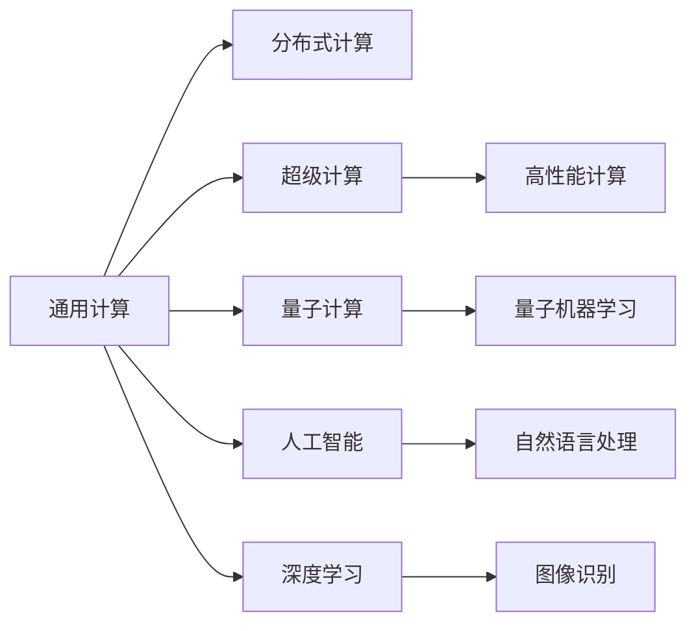

                 

# 释放人类潜力的无限可能：人类计算的目标

> 关键词：人类计算,量子计算,人工智能,深度学习,超级计算,分布式计算,量子机器学习

## 1. 背景介绍

### 1.1 问题由来

在人类社会进入信息时代的今天，计算能力已经成为推动经济、科技、文化、社会等各个领域发展的关键引擎。从早期的机械式计算，到后来的电子计算机，再到如今蓬勃发展的量子计算、人工智能等前沿技术，计算形式正经历着翻天覆地的变化。

当前，我们正处在一个计算能力空前强大的时代。以人工智能为代表的技术，正在不断突破人类认知的边界，为解决复杂问题、推动创新提供了新的可能。与此同时，计算形式和计算工具也在不断进化，从传统的通用计算机，到现在的超级计算机、量子计算机、人工智能、深度学习等新型计算形态，计算技术的应用范围和能力正以我们难以想象的速度扩张。

在这个过程中，人类计算的概念也得到了新的诠释。人类计算不再局限于传统意义上的计算工作，而是扩展到了利用计算能力解决各种复杂问题的全过程。从对海量数据的处理，到对深度学习的训练，再到对量子计算的研究，人类计算正在不断拓展其边界，释放人类潜力的无限可能。

### 1.2 问题核心关键点

在当前技术发展态势下，人类计算的核心关键点主要包括以下几个方面：

1. **计算范式的扩展**：从传统的二进制计算，到量子计算、人工智能、深度学习等新型计算形态，计算范式正在不断扩展。
2. **计算能力的提升**：超级计算机、量子计算机、分布式计算等新型计算技术，正在不断提升计算能力，解决更加复杂的问题。
3. **计算工具的丰富**：各种计算工具和框架（如TensorFlow、PyTorch、OpenAI Gym等）正在不断丰富，为各种复杂问题的解决提供了强有力的支持。
4. **计算应用的多样化**：从科学研究、工程设计、金融分析，到娱乐游戏、医疗健康、社交媒体等，计算应用正在日益广泛地渗透到各个领域。
5. **计算能力的普及**：计算能力正在不断普及，从超级计算机的大规模计算，到普通计算机的日常计算，每个人都可以享受计算带来的便利。

这些关键点共同构成了当前人类计算的核心内容，推动着计算技术的发展和应用。

## 2. 核心概念与联系

### 2.1 核心概念概述

为了更好地理解人类计算的概念和应用，本节将介绍几个核心概念：

- **通用计算**：指能够在各种计算任务中通用执行的计算方法，通常包括传统的二进制计算和电子计算机。
- **分布式计算**：指通过多个计算节点的协同工作，共同完成大规模计算任务的方法，可以大幅度提升计算效率。
- **超级计算**：指基于并行计算和分布式计算技术，能够在短时间内处理海量数据的计算能力，通常用于科学研究和高性能计算。
- **量子计算**：指利用量子力学原理，通过量子比特的纠缠和叠加等特性，实现比传统计算更加强大的计算能力。
- **人工智能**：指通过机器学习和深度学习等技术，使计算机具备人类智能的模拟能力，能够理解和处理自然语言、图像、声音等多种数据形式。
- **深度学习**：指利用神经网络模型，对大量数据进行学习，实现对复杂模式的识别和预测。

这些核心概念之间的逻辑关系可以通过以下Mermaid流程图来展示：



这个流程图展示了许多核心概念的相互联系，它们共同构成了当前人类计算的基础框架。

## 3. 核心算法原理 & 具体操作步骤

### 3.1 算法原理概述

人类计算的核心算法原理包括以下几个方面：

1. **分布式计算框架**：利用分布式计算技术，通过多个计算节点的协同工作，共同完成大规模计算任务。
2. **超级计算系统**：通过并行计算和分布式计算技术，实现对海量数据的快速处理和分析。
3. **量子计算模型**：利用量子比特的量子叠加和纠缠特性，实现比传统计算更加强大的计算能力。
4. **人工智能模型**：通过机器学习和深度学习技术，使计算机具备人类智能的模拟能力，能够理解和处理自然语言、图像、声音等多种数据形式。
5. **深度学习框架**：利用神经网络模型，对大量数据进行学习，实现对复杂模式的识别和预测。

这些算法原理共同构成了人类计算的基础，推动着计算技术的不断发展和应用。

### 3.2 算法步骤详解

人类计算的算法步骤主要包括以下几个方面：

1. **问题定义**：明确需要解决的问题，如科学计算、数据分析、人工智能训练等。
2. **数据准备**：收集和准备问题所需的数据，确保数据的质量和完整性。
3. **算法选择**：选择合适的计算算法或框架，如分布式计算框架、超级计算系统、量子计算模型、人工智能模型、深度学习框架等。
4. **模型训练**：利用准备好的数据，对模型进行训练，优化模型参数，提升模型性能。
5. **结果分析**：对模型训练的结果进行分析，评估模型性能，发现问题并进行调整。
6. **应用部署**：将训练好的模型部署到实际应用场景中，进行性能评估和优化。

这些步骤构成了人类计算的核心流程，确保了计算任务的有效执行。

### 3.3 算法优缺点

人类计算的算法优缺点如下：

#### 优点：
1. **计算能力强大**：基于超级计算、量子计算、分布式计算等技术，能够处理海量数据，解决复杂问题。
2. **计算效率高**：分布式计算和并行计算技术，能够在短时间内完成大规模计算任务。
3. **应用范围广**：从科学研究、工程设计、金融分析，到娱乐游戏、医疗健康、社交媒体等，人类计算正在日益广泛地渗透到各个领域。
4. **技术先进**：利用人工智能和深度学习等前沿技术，实现对复杂模式的识别和预测。

#### 缺点：
1. **资源消耗大**：超级计算机、量子计算机等高性能设备需要大量的电力和维护成本。
2. **技术门槛高**：分布式计算、量子计算、深度学习等技术复杂度高，需要专业的知识和技能。
3. **数据隐私问题**：处理大规模数据时，可能面临数据隐私和安全问题。
4. **计算成本高**：高性能计算设备昂贵，计算成本较高。

尽管存在这些缺点，人类计算的优点依然十分显著，其应用前景和发展潜力不容小觑。

### 3.4 算法应用领域

人类计算在各个领域都有广泛的应用，例如：

- **科学研究**：利用超级计算机和大数据分析，研究气候变化、生物医药等复杂问题。
- **工程设计**：通过分布式计算和仿真技术，优化设计方案，提高生产效率。
- **金融分析**：利用人工智能和深度学习技术，进行风险预测和投资分析。
- **医疗健康**：利用医疗影像处理和自然语言处理技术，辅助诊断和治疗。
- **娱乐游戏**：利用人工智能和深度学习技术，提升游戏体验和互动性。
- **社交媒体**：利用自然语言处理和数据分析技术，优化推荐系统，提升用户体验。

这些应用领域充分展示了人类计算的强大能力，推动了各个行业的数字化转型和创新。

## 4. 数学模型和公式 & 详细讲解 & 举例说明

### 4.1 数学模型构建

在人类计算中，数学模型的构建是非常重要的环节。通常，我们需要根据问题的特点，选择合适的数学模型，并进行参数优化，以确保模型的准确性和性能。

以深度学习模型为例，常见的数学模型包括：

- **前馈神经网络**：利用多个层次的神经元进行数据处理，实现对复杂模式的识别和预测。
- **卷积神经网络**：利用卷积操作，对图像和视频等高维数据进行特征提取和识别。
- **递归神经网络**：利用递归结构，处理序列数据，如文本和语音。

### 4.2 公式推导过程

以下以卷积神经网络为例，展示其公式推导过程。

卷积神经网络的基本公式如下：

$$
y_i = f(w_i \cdot x_i + b_i)
$$

其中，$x_i$ 为输入数据，$w_i$ 为卷积核，$b_i$ 为偏置项，$f$ 为激活函数，$y_i$ 为输出数据。

在深度学习中，通常采用反向传播算法进行参数优化，即通过计算损失函数对模型参数的梯度，更新参数值，以最小化损失函数。

### 4.3 案例分析与讲解

以图像分类任务为例，展示卷积神经网络的实际应用。

在图像分类任务中，我们需要将输入的图像数据，通过卷积层、池化层等操作，提取图像的特征，并利用全连接层进行分类。具体流程如下：

1. **输入数据**：将图像数据作为输入，进行预处理和归一化。
2. **卷积层**：通过多个卷积核，提取图像的局部特征。
3. **池化层**：对卷积层的输出进行下采样，减小数据维度。
4. **全连接层**：将池化层的输出作为输入，进行分类。
5. **输出结果**：利用softmax函数，输出每个类别的概率。

通过这些步骤，我们可以利用卷积神经网络，对图像数据进行高效处理和分类，实现复杂的图像识别任务。

## 5. 项目实践：代码实例和详细解释说明

### 5.1 开发环境搭建

在进行人类计算的项目实践前，我们需要准备好开发环境。以下是使用Python进行TensorFlow开发的环境配置流程：

1. 安装Anaconda：从官网下载并安装Anaconda，用于创建独立的Python环境。

2. 创建并激活虚拟环境：
```bash
conda create -n tf-env python=3.8 
conda activate tf-env
```

3. 安装TensorFlow：根据CUDA版本，从官网获取对应的安装命令。例如：
```bash
conda install tensorflow-gpu -c conda-forge -c pytorch -c pypi
```

4. 安装各类工具包：
```bash
pip install numpy pandas scikit-learn matplotlib tqdm jupyter notebook ipython
```

完成上述步骤后，即可在`tf-env`环境中开始项目实践。

### 5.2 源代码详细实现

下面我们以图像分类任务为例，给出使用TensorFlow进行卷积神经网络训练的PyTorch代码实现。

首先，定义图像数据处理函数：

```python
import tensorflow as tf
from tensorflow.keras.datasets import cifar10
from tensorflow.keras.preprocessing.image import ImageDataGenerator

(train_images, train_labels), (test_images, test_labels) = cifar10.load_data()

train_datagen = ImageDataGenerator(rescale=1./255)
test_datagen = ImageDataGenerator(rescale=1./255)

train_generator = train_datagen.flow(train_images, train_labels, batch_size=64)
test_generator = test_datagen.flow(test_images, test_labels, batch_size=64)
```

然后，定义卷积神经网络模型：

```python
from tensorflow.keras import layers

model = tf.keras.Sequential()
model.add(layers.Conv2D(32, (3, 3), activation='relu', input_shape=(32, 32, 3)))
model.add(layers.MaxPooling2D((2, 2)))
model.add(layers.Conv2D(64, (3, 3), activation='relu'))
model.add(layers.MaxPooling2D((2, 2)))
model.add(layers.Conv2D(64, (3, 3), activation='relu'))
model.add(layers.Flatten())
model.add(layers.Dense(64, activation='relu'))
model.add(layers.Dense(10))
```

接着，定义训练和评估函数：

```python
from tensorflow.keras.optimizers import RMSprop
from tensorflow.keras.utils import to_categorical

model.compile(optimizer=RMSprop(lr=0.001),
              loss='categorical_crossentropy',
              metrics=['accuracy'])

train_loss, train_acc = model.fit(train_generator, epochs=10, validation_data=test_generator)
test_loss, test_acc = model.evaluate(test_generator)
```

最后，启动训练流程并在测试集上评估：

```python
print('Test accuracy:', test_acc)
```

以上就是使用TensorFlow进行卷积神经网络训练的完整代码实现。可以看到，利用TensorFlow的高级API，我们可以以非常简洁的代码实现复杂的神经网络模型，并进行高效的训练和评估。

### 5.3 代码解读与分析

让我们再详细解读一下关键代码的实现细节：

**train_datagen和test_datagen**：
- 定义了图像数据增强和归一化操作，用于数据预处理。

**train_generator和test_generator**：
- 使用ImageDataGenerator生成批次的图像数据，并对数据进行归一化处理。

**model**：
- 定义卷积神经网络模型，包含多个卷积层、池化层、全连接层。

**model.compile**：
- 定义优化器、损失函数和评估指标，准备训练过程。

**model.fit**：
- 进行模型训练，在每个epoch中更新模型参数，并记录训练和验证损失和准确率。

**model.evaluate**：
- 对模型在测试集上进行评估，返回测试损失和准确率。

**print**：
- 输出测试集上的最终准确率，展示模型训练的效果。

可以看到，TensorFlow提供了丰富的API和工具，使得神经网络模型的构建和训练变得异常简便，大大降低了开发难度和复杂度。

当然，工业级的系统实现还需考虑更多因素，如模型的保存和部署、超参数的自动搜索、更灵活的架构设计等。但核心的计算流程基本与此类似。

## 6. 实际应用场景

### 6.1 科学研究

在科学研究中，超级计算和高性能计算发挥着重要作用。例如，利用超级计算机进行大规模气候模拟，可以更准确地预测气候变化趋势；利用量子计算进行复杂分子结构模拟，可以更高效地研究药物开发和生物工程。这些计算技术的应用，极大地推动了科学研究的发展和突破。

### 6.2 工程设计

在工程设计中，分布式计算和仿真技术发挥着重要作用。例如，利用分布式计算进行大规模CAD模型的渲染，可以显著提升设计效率；利用仿真技术进行虚拟样机测试，可以降低设计和实验成本。这些计算技术的应用，极大地推动了工程设计的创新和效率提升。

### 6.3 金融分析

在金融分析中，人工智能和深度学习技术发挥着重要作用。例如，利用机器学习进行股票价格预测，可以更准确地评估市场风险；利用深度学习进行信用评分，可以更精确地评估贷款申请人的信用风险。这些计算技术的应用，极大地推动了金融分析的自动化和精准化。

### 6.4 医疗健康

在医疗健康中，深度学习和自然语言处理技术发挥着重要作用。例如，利用自然语言处理进行医学文献检索，可以更高效地获取相关研究信息；利用深度学习进行医学影像分析，可以更准确地辅助诊断和治疗。这些计算技术的应用，极大地推动了医疗健康的智能化和精准化。

### 6.5 娱乐游戏

在娱乐游戏中，人工智能和深度学习技术发挥着重要作用。例如，利用自然语言处理进行游戏对话，可以提升游戏的互动性和沉浸感；利用深度学习进行游戏AI设计，可以更智能地生成游戏行为和决策。这些计算技术的应用，极大地推动了娱乐游戏的创新和沉浸感提升。

### 6.6 社交媒体

在社交媒体中，自然语言处理和数据分析技术发挥着重要作用。例如，利用自然语言处理进行用户情感分析，可以更准确地理解用户反馈；利用数据分析进行推荐系统优化，可以更精准地推荐内容。这些计算技术的应用，极大地推动了社交媒体的个性化和精准化。

## 7. 工具和资源推荐

### 7.1 学习资源推荐

为了帮助开发者系统掌握人类计算的理论基础和实践技巧，这里推荐一些优质的学习资源：

1. 《深度学习》系列书籍：由深度学习领域的权威专家撰写，系统介绍了深度学习的原理和应用，适合初学者和进阶开发者。
2. 《TensorFlow官方文档》：TensorFlow的官方文档，提供了丰富的API、工具和样例，是学习TensorFlow的重要资源。
3. 《PyTorch官方文档》：PyTorch的官方文档，提供了丰富的API、工具和样例，是学习PyTorch的重要资源。
4. CS231n《卷积神经网络》课程：斯坦福大学开设的计算机视觉经典课程，系统介绍了卷积神经网络的基本原理和应用，适合计算机视觉领域的开发者。
5. CS224d《深度学习自然语言处理》课程：斯坦福大学开设的NLP经典课程，系统介绍了深度学习在自然语言处理中的应用，适合NLP领域的开发者。

通过对这些资源的学习实践，相信你一定能够快速掌握人类计算的精髓，并用于解决实际的计算问题。

### 7.2 开发工具推荐

高效的开发离不开优秀的工具支持。以下是几款用于人类计算开发的常用工具：

1. TensorFlow：由Google主导开发的开源深度学习框架，生产部署方便，适合大规模工程应用。
2. PyTorch：由Facebook主导开发的开源深度学习框架，灵活性和可扩展性高，适合快速迭代研究。
3. Jupyter Notebook：开源的交互式编程环境，方便开发者进行代码实验和数据可视化。
4. Anaconda：开源的数据科学平台，提供了丰富的科学计算和数据分析工具。
5. GPU和TPU：高性能计算设备，用于加速深度学习和分布式计算任务。

合理利用这些工具，可以显著提升人类计算任务的开发效率，加快创新迭代的步伐。

### 7.3 相关论文推荐

人类计算的发展源于学界的持续研究。以下是几篇奠基性的相关论文，推荐阅读：

1. 《Deep Learning》（深度学习）：由深度学习领域的权威专家Ian Goodfellow撰写，系统介绍了深度学习的基本原理和应用。
2. 《TensorFlow: A System for Large-Scale Machine Learning》（TensorFlow：大规模机器学习系统）：Google的研究团队发表的论文，介绍了TensorFlow的设计和应用。
3. 《ImageNet Classification with Deep Convolutional Neural Networks》（使用卷积神经网络进行ImageNet分类）：AlexNet的作者发表论文，介绍了卷积神经网络在图像分类任务中的应用。
4. 《Natural Language Processing (almost) for Free with Transformers》（使用Transformer进行免费自然语言处理）：Google的研究团队发表论文，介绍了Transformer在自然语言处理任务中的应用。
5. 《The Unreasonable Effectiveness of Transfer Learning》（转移学习的惊人效果）：Google的研究团队发表论文，介绍了转移学习在大规模深度学习模型中的应用。

这些论文代表了大计算领域的研究方向，通过学习这些前沿成果，可以帮助研究者把握学科前进方向，激发更多的创新灵感。

## 8. 总结：未来发展趋势与挑战

### 8.1 总结

本文对人类计算的概念和应用进行了全面系统的介绍。首先阐述了人类计算的背景和重要性，明确了计算技术在各个领域中的独特价值。其次，从原理到实践，详细讲解了人类计算的数学模型和算法步骤，给出了实际项目开发的完整代码实例。同时，本文还广泛探讨了人类计算在科学研究、工程设计、金融分析、医疗健康、娱乐游戏、社交媒体等众多领域的应用前景，展示了人类计算的巨大潜力。此外，本文精选了人类计算的各种学习资源，力求为读者提供全方位的技术指引。

通过本文的系统梳理，可以看到，人类计算技术正在不断拓展其应用边界，释放人类潜力的无限可能。未来，伴随计算技术的不断进步，人类计算必将在更广阔的领域得到应用，为人类社会带来更深远的影响。

### 8.2 未来发展趋势

展望未来，人类计算的发展趋势如下：

1. **计算能力持续增强**：超级计算机、量子计算机等高性能计算设备将不断提升计算能力，解决更加复杂的问题。
2. **计算应用日益广泛**：人类计算将在科学研究、工程设计、金融分析、医疗健康、娱乐游戏、社交媒体等众多领域得到广泛应用。
3. **技术融合不断深化**：计算技术将与其他前沿技术如量子计算、人工智能、深度学习等进行更深入的融合，提升综合性能。
4. **计算成本逐步降低**：随着计算技术的不断发展，计算设备的成本将逐渐降低，计算能力的普及性将进一步提升。
5. **计算安全备受重视**：随着计算能力的大幅提升，数据安全、隐私保护等计算安全问题将备受关注，计算伦理和安全机制将不断完善。

这些趋势将进一步推动人类计算的发展，释放人类潜力的无限可能。

### 8.3 面临的挑战

尽管人类计算技术正在不断发展和应用，但在迈向更加智能化、普适化应用的过程中，它仍面临诸多挑战：

1. **数据隐私和安全问题**：处理大规模数据时，可能面临数据隐私和安全问题。
2. **计算资源成本高昂**：超级计算机、量子计算机等高性能设备需要大量的电力和维护成本。
3. **计算技术复杂度高**：分布式计算、量子计算、深度学习等技术复杂度高，需要专业的知识和技能。
4. **计算结果难以解释**：深度学习和人工智能模型的黑盒性质，使得计算结果难以解释和调试。
5. **计算伦理和安全问题**：计算技术可能被用于不道德、非法的用途，带来伦理和安全风险。

尽管存在这些挑战，人类计算的优点依然十分显著，其应用前景和发展潜力不容小觑。未来，伴随技术不断进步，这些挑战将逐步被克服，人类计算必将在构建人机协同的智能时代中扮演越来越重要的角色。

### 8.4 研究展望

面对人类计算面临的种种挑战，未来的研究需要在以下几个方面寻求新的突破：

1. **提升计算能力**：通过新型计算技术如量子计算、分布式计算等，提升计算能力，解决更加复杂的问题。
2. **降低计算成本**：通过技术创新和资源优化，降低计算成本，提升计算能力的普及性。
3. **增强计算安全性**：通过安全机制和隐私保护技术，提升计算结果的安全性和可靠性。
4. **改进计算模型**：通过优化计算模型，提升计算结果的可解释性和可理解性。
5. **研究计算伦理**：通过计算伦理和安全机制，确保计算技术的应用符合人类价值观和伦理道德。

这些研究方向的探索，必将引领人类计算技术迈向更高的台阶，为构建安全、可靠、可解释、可控的智能系统铺平道路。面向未来，人类计算技术还需要与其他人工智能技术进行更深入的融合，如知识表示、因果推理、强化学习等，多路径协同发力，共同推动人类计算的发展。只有勇于创新、敢于突破，才能不断拓展计算技术的边界，释放人类潜力的无限可能。

## 9. 附录：常见问题与解答

**Q1：人类计算与通用计算有什么区别？**

A: 人类计算不仅包括传统的通用计算，还包括利用计算能力解决各种复杂问题的全过程。它包括了从数据预处理、模型训练、结果分析到应用部署的各个环节，能够更全面地发挥计算技术的作用。

**Q2：什么是分布式计算？**

A: 分布式计算指通过多个计算节点的协同工作，共同完成大规模计算任务。它可以大幅度提升计算效率，适用于处理大规模数据和复杂计算任务。

**Q3：深度学习与传统机器学习有什么区别？**

A: 深度学习是一种基于神经网络模型的机器学习技术，相较于传统机器学习，它能够处理更复杂的模式识别和预测任务，且需要大量的数据和计算资源。

**Q4：人类计算的应用场景有哪些？**

A: 人类计算在科学研究、工程设计、金融分析、医疗健康、娱乐游戏、社交媒体等众多领域都有广泛的应用。它正在日益广泛地渗透到各个领域，推动各行各业的数字化转型和创新。

**Q5：人类计算的发展趋势是什么？**

A: 人类计算的发展趋势包括计算能力的持续增强、计算应用的日益广泛、技术融合不断深化、计算成本逐步降低、计算安全备受重视等方面。这些趋势将进一步推动人类计算的发展，释放人类潜力的无限可能。

通过这些常见问题的解答，可以更全面地理解人类计算的概念和应用，帮助开发者更好地进行实践和创新。

---

作者：禅与计算机程序设计艺术 / Zen and the Art of Computer Programming

