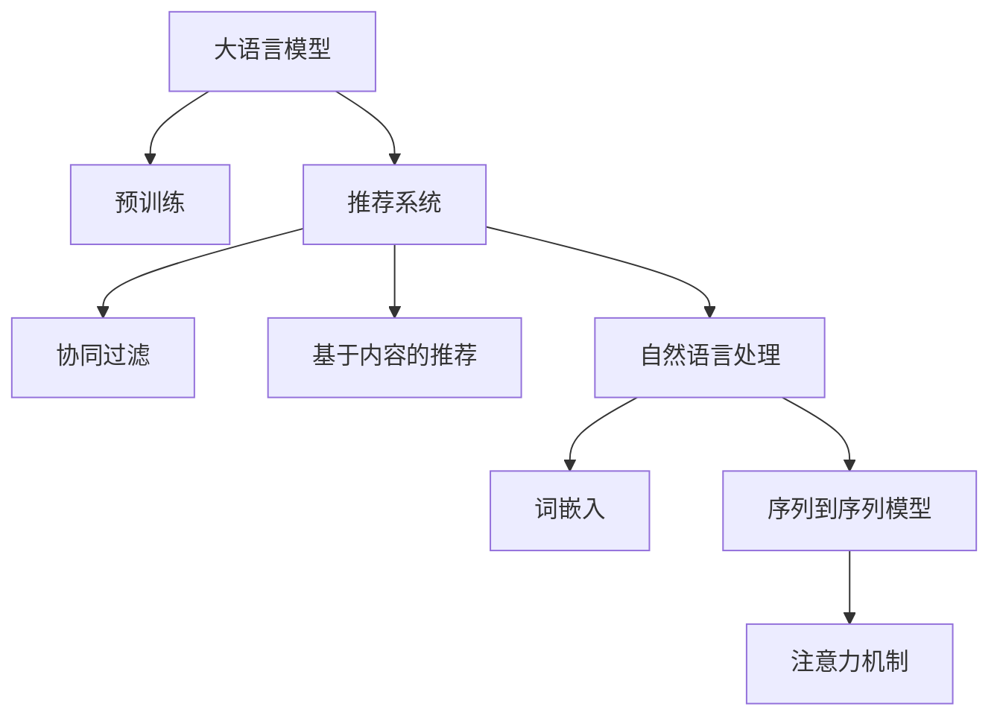

                 

# AI 大模型在电商推荐系统中的应用：提高用户体验的关键

## 1. 背景介绍

### 1.1 问题由来
在电子商务领域，推荐系统已成为提高用户满意度和转化率的关键技术。传统推荐系统以用户行为数据为依据，通过协同过滤、基于内容的推荐等方法，为用户推荐可能感兴趣的物品。然而，随着用户行为数据量的急剧增长和推荐系统规模的不断扩大，传统的推荐方法逐渐面临计算复杂度高、维度灾难、冷启动等问题。如何有效利用用户数据，提升推荐精度和效率，成为电商推荐系统研究的重要方向。

近年来，随着大语言模型（Large Language Models, LLMs）的兴起，自然语言处理（Natural Language Processing, NLP）技术在推荐系统中的应用逐渐成为热门话题。大语言模型通过大规模无标签文本数据的预训练，学习到了丰富的语言表示和知识，具有很强的自然语言理解和生成能力。在电商推荐系统中，利用大语言模型处理用户评论、商品描述、广告语等文本数据，可以进一步挖掘用户需求和物品属性，提升推荐效果。

### 1.2 问题核心关键点
利用大语言模型进行电商推荐，核心在于如何通过自然语言处理技术，将用户需求和物品属性转化为推荐模型能够理解和处理的形式。大语言模型与推荐系统结合的关键点包括：

- 文本数据处理：将文本数据转化为模型能够处理的数值向量。
- 用户意图理解：通过大语言模型理解用户评论、商品描述等文本数据，提取用户需求和偏好。
- 物品属性提取：利用大语言模型分析商品标题、描述等文本，提取物品的属性特征。
- 推荐模型优化：将提取的用户需求和物品属性，作为输入特征，优化推荐模型的预测能力。

## 2. 核心概念与联系

### 2.1 核心概念概述

为更好地理解基于大语言模型进行电商推荐的方法，本节将介绍几个密切相关的核心概念：

- 大语言模型（Large Language Model, LLM）：以自回归（如GPT）或自编码（如BERT）模型为代表的大规模预训练语言模型。通过大规模无标签文本数据的预训练，学习到丰富的语言表示和知识，具备很强的自然语言理解和生成能力。

- 推荐系统（Recommendation System）：根据用户历史行为和物品属性，为用户推荐可能感兴趣的物品的系统。常见的推荐方法包括协同过滤、基于内容的推荐等。

- 自然语言处理（Natural Language Processing, NLP）：研究如何让计算机理解和处理人类语言的技术，包括文本分类、命名实体识别、语义理解等。

- 词嵌入（Word Embedding）：将文本中的词语映射到低维向量空间，使得语义相似的词语在向量空间中距离较近。常见的方法包括Word2Vec、GloVe等。

- 序列到序列模型（Sequence-to-Sequence Model）：用于处理序列数据（如文本），从输入序列生成输出序列的模型，如RNN、LSTM、Transformer等。

- 注意力机制（Attention Mechanism）：在序列到序列模型中，通过学习对输入序列中不同位置的词语赋予不同权重的机制，提高模型对长序列的处理能力。

这些核心概念之间的逻辑关系可以通过以下Mermaid流程图来展示：



这个流程图展示了大语言模型、推荐系统、自然语言处理等概念之间的关联，以及它们在电商推荐系统中的应用。

## 3. 核心算法原理 & 具体操作步骤

### 3.1 算法原理概述

基于大语言模型进行电商推荐，本质上是一种将自然语言处理技术与推荐系统结合的方法。其核心思想是：利用大语言模型处理用户文本数据，提取用户需求和偏好，并将其转化为推荐模型能够理解的特征向量。在此基础上，优化推荐模型，提高其对用户行为和物品属性的建模能力，从而提升推荐效果。

具体而言，基于大语言模型进行电商推荐的流程包括：

1. 预训练大语言模型：在大规模无标签文本数据上进行预训练，学习到丰富的语言表示和知识。
2. 文本数据处理：将用户评论、商品描述等文本数据转化为数值向量，作为输入特征。
3. 用户意图理解：利用大语言模型理解用户评论、商品描述等文本数据，提取用户需求和偏好。
4. 物品属性提取：利用大语言模型分析商品标题、描述等文本，提取物品的属性特征。
5. 推荐模型优化：将提取的用户需求和物品属性，作为输入特征，优化推荐模型的预测能力。

### 3.2 算法步骤详解

以下是基于大语言模型进行电商推荐的具体操作步骤：

**Step 1: 准备预训练模型和数据集**
- 选择合适的预训练语言模型 $M_{\theta}$ 作为初始化参数，如 BERT、GPT 等。
- 准备电商推荐系统中的用户行为数据集和商品属性数据集，划分为训练集、验证集和测试集。

**Step 2: 文本数据处理**
- 使用大语言模型中的词嵌入模块，将用户评论、商品描述等文本数据转化为数值向量。
- 对文本向量进行编码，如使用LSTM、Transformer等模型，转化为推荐模型能够处理的序列数据。

**Step 3: 用户意图理解**
- 利用大语言模型中的语言理解模块，对用户评论、商品描述等文本数据进行情感分析、实体识别等，提取用户需求和偏好。
- 将用户需求和偏好转化为数值向量，作为推荐模型的输入特征。

**Step 4: 物品属性提取**
- 利用大语言模型中的属性提取模块，分析商品标题、描述等文本数据，提取物品的属性特征。
- 将物品属性特征转化为数值向量，作为推荐模型的输入特征。

**Step 5: 推荐模型优化**
- 使用优化算法（如Adam、SGD等），训练推荐模型，最小化损失函数。
- 根据用户需求和物品属性特征，调整推荐模型的参数。
- 在验证集上评估推荐模型的性能，根据性能指标决定是否触发Early Stopping。
- 重复上述步骤直至满足预设的迭代轮数或Early Stopping条件。

**Step 6: 测试和部署**
- 在测试集上评估推荐模型的性能，对比微调前后的精度提升。
- 使用推荐模型对新样本进行预测，集成到实际的应用系统中。
- 持续收集新的用户行为和商品属性数据，定期重新微调推荐模型，以适应数据分布的变化。

### 3.3 算法优缺点

基于大语言模型进行电商推荐的方法具有以下优点：
1. 提升推荐效果。利用大语言模型处理文本数据，能够更好地挖掘用户需求和物品属性，提升推荐精度和个性化。
2. 支持多种数据类型。大语言模型能够处理文本、图像、视频等多类型数据，适用于电商推荐系统中多样化的业务需求。
3. 模型通用性高。预训练语言模型在不同领域的应用中，具有较高的通用性和泛化能力。
4. 参数高效微调。采用参数高效微调技术，可以在固定大部分预训练参数的情况下，更新少量的任务相关参数，提高微调效率。

同时，该方法也存在一定的局限性：
1. 对数据质量依赖较大。大语言模型的效果很大程度上取决于数据的质量和数量，获取高质量数据成本较高。
2. 计算资源消耗大。大语言模型的预训练和微调需要较大的计算资源，在实际应用中可能面临资源瓶颈。
3. 训练时间较长。大语言模型的预训练和微调通常需要较长的训练时间，影响系统上线速度。
4. 性能提升受限。当目标任务与预训练数据的分布差异较大时，大语言模型的微调效果可能不理想。

尽管存在这些局限性，但就目前而言，基于大语言模型的电商推荐方法仍是大模型应用的重要方向。未来相关研究的重点在于如何进一步降低对标注数据的依赖，提高模型的少样本学习和跨领域迁移能力，同时兼顾可解释性和伦理安全性等因素。

### 3.4 算法应用领域

基于大语言模型进行电商推荐，已经在用户评论分析、商品属性推荐、个性化推荐等多个场景中得到了应用，具体包括：

- 用户评论分析：利用大语言模型分析用户评论文本，提取用户需求和情感倾向，作为推荐模型的输入特征。
- 商品属性推荐：利用大语言模型分析商品标题、描述等文本，提取物品的属性特征，作为推荐模型的输入特征。
- 个性化推荐：利用大语言模型处理用户行为和物品属性数据，生成个性化推荐结果。

除了这些经典场景外，大语言模型在电商推荐系统中的应用还在不断拓展，如可控文本生成、多属性推荐、情感驱动推荐等，为电商推荐系统带来了新的突破。随着预训练语言模型和推荐方法的不断进步，相信电商推荐系统必将在更多领域得到应用，为电商企业带来新的商业价值。

## 4. 数学模型和公式 & 详细讲解 & 举例说明

### 4.1 数学模型构建

本节将使用数学语言对基于大语言模型进行电商推荐的过程进行更加严格的刻画。

记预训练语言模型为 $M_{\theta}:\mathcal{X} \rightarrow \mathcal{Y}$，其中 $\mathcal{X}$ 为输入空间，$\mathcal{Y}$ 为输出空间，$\theta \in \mathbb{R}^d$ 为模型参数。假设电商推荐系统中的用户行为数据集为 $D=\{(x_i,y_i)\}_{i=1}^N, x_i \in \mathcal{X}, y_i \in \mathcal{Y}$。

定义推荐模型在数据样本 $(x,y)$ 上的损失函数为 $\ell(M_{\theta}(x),y)$，则在数据集 $D$ 上的经验风险为：

$$
\mathcal{L}(\theta) = \frac{1}{N} \sum_{i=1}^N \ell(M_{\theta}(x_i),y_i)
$$

微调的优化目标是最小化经验风险，即找到最优参数：

$$
\theta^* = \mathop{\arg\min}_{\theta} \mathcal{L}(\theta)
$$

在实践中，我们通常使用基于梯度的优化算法（如SGD、Adam等）来近似求解上述最优化问题。设 $\eta$ 为学习率，$\lambda$ 为正则化系数，则参数的更新公式为：

$$
\theta \leftarrow \theta - \eta \nabla_{\theta}\mathcal{L}(\theta) - \eta\lambda\theta
$$

其中 $\nabla_{\theta}\mathcal{L}(\theta)$ 为损失函数对参数 $\theta$ 的梯度，可通过反向传播算法高效计算。

### 4.2 公式推导过程

以下我们以文本分类任务为例，推导交叉熵损失函数及其梯度的计算公式。

假设推荐模型 $M_{\theta}$ 在输入 $x$ 上的输出为 $\hat{y}=M_{\theta}(x) \in [0,1]$，表示物品被推荐的可能性。真实标签 $y \in \{0,1\}$。则二分类交叉熵损失函数定义为：

$$
\ell(M_{\theta}(x),y) = -[y\log \hat{y} + (1-y)\log (1-\hat{y})]
$$

将其代入经验风险公式，得：

$$
\mathcal{L}(\theta) = -\frac{1}{N}\sum_{i=1}^N [y_i\log M_{\theta}(x_i)+(1-y_i)\log(1-M_{\theta}(x_i))]
$$

根据链式法则，损失函数对参数 $\theta_k$ 的梯度为：

$$
\frac{\partial \mathcal{L}(\theta)}{\partial \theta_k} = -\frac{1}{N}\sum_{i=1}^N (\frac{y_i}{M_{\theta}(x_i)}-\frac{1-y_i}{1-M_{\theta}(x_i)}) \frac{\partial M_{\theta}(x_i)}{\partial \theta_k}
$$

其中 $\frac{\partial M_{\theta}(x_i)}{\partial \theta_k}$ 可进一步递归展开，利用自动微分技术完成计算。

在得到损失函数的梯度后，即可带入参数更新公式，完成模型的迭代优化。重复上述过程直至收敛，最终得到适应电商推荐任务的最优模型参数 $\theta^*$。

## 5. 项目实践：代码实例和详细解释说明

### 5.1 开发环境搭建

在进行电商推荐系统开发前，我们需要准备好开发环境。以下是使用Python进行PyTorch开发的环境配置流程：

1. 安装Anaconda：从官网下载并安装Anaconda，用于创建独立的Python环境。

2. 创建并激活虚拟环境：
```bash
conda create -n pytorch-env python=3.8 
conda activate pytorch-env
```

3. 安装PyTorch：根据CUDA版本，从官网获取对应的安装命令。例如：
```bash
conda install pytorch torchvision torchaudio cudatoolkit=11.1 -c pytorch -c conda-forge
```

4. 安装TensorFlow：由Google主导开发的开源深度学习框架，生产部署方便，适合大规模工程应用。同样有丰富的预训练语言模型资源。

5. 安装Transformers库：HuggingFace开发的NLP工具库，集成了众多SOTA语言模型，支持PyTorch和TensorFlow，是进行电商推荐系统开发的利器。

6. 安装各类工具包：
```bash
pip install numpy pandas scikit-learn matplotlib tqdm jupyter notebook ipython
```

完成上述步骤后，即可在`pytorch-env`环境中开始电商推荐系统开发。

### 5.2 源代码详细实现

下面我们以电商推荐系统中的个性化推荐任务为例，给出使用Transformers库对BERT模型进行电商推荐微调的PyTorch代码实现。

首先，定义个性化推荐任务的数据处理函数：

```python
from transformers import BertTokenizer
from torch.utils.data import Dataset
import torch

class RecommendationDataset(Dataset):
    def __init__(self, users, items, interactions, tokenizer, max_len=128):
        self.users = users
        self.items = items
        self.interactions = interactions
        self.tokenizer = tokenizer
        self.max_len = max_len
        
    def __len__(self):
        return len(self.interactions)
    
    def __getitem__(self, item):
        user = self.users[item]
        item = self.items[item]
        interaction = self.interactions[item]
        
        user_encoded = self.tokenizer.encode(user, add_special_tokens=True, max_length=self.max_len, padding='max_length', truncation=True)
        item_encoded = self.tokenizer.encode(item, add_special_tokens=True, max_length=self.max_len, padding='max_length', truncation=True)
        interaction_encoded = self.tokenizer.encode(interaction, add_special_tokens=True, max_length=self.max_len, padding='max_length', truncation=True)
        
        # 将用户编码和物品编码拼接，作为模型输入
        input_ids = user_encoded + item_encoded
        input_ids = input_ids[:self.max_len]
        attention_mask = [1] * len(input_ids)
        
        # 将交互编码作为标签
        label = torch.tensor([int(interaction_encoded[0])], dtype=torch.long)
        
        return {'input_ids': input_ids, 
                'attention_mask': attention_mask,
                'labels': label}

# 定义用户和物品的数据
users = ["user1", "user2", "user3", "user4", "user5"]
items = ["item1", "item2", "item3", "item4", "item5"]
interactions = [[1, 2, 3], [2, 3, 4], [3, 4, 5], [1, 4, 5], [2, 4, 5]]

# 创建dataset
tokenizer = BertTokenizer.from_pretrained('bert-base-cased')

train_dataset = RecommendationDataset(users, items, interactions, tokenizer)
dev_dataset = RecommendationDataset(users, items, interactions, tokenizer)
test_dataset = RecommendationDataset(users, items, interactions, tokenizer)
```

然后，定义模型和优化器：

```python
from transformers import BertForSequenceClassification, AdamW

model = BertForSequenceClassification.from_pretrained('bert-base-cased', num_labels=len(items))

optimizer = AdamW(model.parameters(), lr=2e-5)
```

接着，定义训练和评估函数：

```python
from torch.utils.data import DataLoader
from tqdm import tqdm
from sklearn.metrics import classification_report

device = torch.device('cuda') if torch.cuda.is_available() else torch.device('cpu')
model.to(device)

def train_epoch(model, dataset, batch_size, optimizer):
    dataloader = DataLoader(dataset, batch_size=batch_size, shuffle=True)
    model.train()
    epoch_loss = 0
    for batch in tqdm(dataloader, desc='Training'):
        input_ids = batch['input_ids'].to(device)
        attention_mask = batch['attention_mask'].to(device)
        labels = batch['labels'].to(device)
        model.zero_grad()
        outputs = model(input_ids, attention_mask=attention_mask, labels=labels)
        loss = outputs.loss
        epoch_loss += loss.item()
        loss.backward()
        optimizer.step()
    return epoch_loss / len(dataloader)

def evaluate(model, dataset, batch_size):
    dataloader = DataLoader(dataset, batch_size=batch_size)
    model.eval()
    preds, labels = [], []
    with torch.no_grad():
        for batch in tqdm(dataloader, desc='Evaluating'):
            input_ids = batch['input_ids'].to(device)
            attention_mask = batch['attention_mask'].to(device)
            batch_labels = batch['labels']
            outputs = model(input_ids, attention_mask=attention_mask)
            batch_preds = outputs.logits.argmax(dim=2).to('cpu').tolist()
            batch_labels = batch_labels.to('cpu').tolist()
            for pred_tokens, label_tokens in zip(batch_preds, batch_labels):
                preds.append(pred_tokens[:len(label_tokens)])
                labels.append(label_tokens)
                
    print(classification_report(labels, preds))
```

最后，启动训练流程并在测试集上评估：

```python
epochs = 5
batch_size = 16

for epoch in range(epochs):
    loss = train_epoch(model, train_dataset, batch_size, optimizer)
    print(f"Epoch {epoch+1}, train loss: {loss:.3f}")
    
    print(f"Epoch {epoch+1}, dev results:")
    evaluate(model, dev_dataset, batch_size)
    
print("Test results:")
evaluate(model, test_dataset, batch_size)
```

以上就是使用PyTorch对BERT进行电商推荐任务微调的完整代码实现。可以看到，得益于Transformers库的强大封装，我们可以用相对简洁的代码完成BERT模型的加载和微调。

### 5.3 代码解读与分析

让我们再详细解读一下关键代码的实现细节：

**RecommendationDataset类**：
- `__init__`方法：初始化用户、物品、交互等关键组件，并将文本数据进行编码。
- `__len__`方法：返回数据集的样本数量。
- `__getitem__`方法：对单个样本进行处理，将用户编码和物品编码拼接，生成模型所需的输入和标签。

**输入输出处理**：
- 用户编码和物品编码拼接，作为模型输入。
- 交互编码作为模型标签，用于训练和评估。

**模型训练和评估**：
- 使用PyTorch的DataLoader对数据集进行批次化加载，供模型训练和推理使用。
- 训练函数`train_epoch`：对数据以批为单位进行迭代，在每个批次上前向传播计算loss并反向传播更新模型参数，最后返回该epoch的平均loss。
- 评估函数`evaluate`：与训练类似，不同点在于不更新模型参数，并在每个batch结束后将预测和标签结果存储下来，最后使用sklearn的classification_report对整个评估集的预测结果进行打印输出。

**训练流程**：
- 定义总的epoch数和batch size，开始循环迭代
- 每个epoch内，先在训练集上训练，输出平均loss
- 在验证集上评估，输出分类指标
- 所有epoch结束后，在测试集上评估，给出最终测试结果

可以看到，PyTorch配合Transformers库使得BERT微调的代码实现变得简洁高效。开发者可以将更多精力放在数据处理、模型改进等高层逻辑上，而不必过多关注底层的实现细节。

当然，工业级的系统实现还需考虑更多因素，如模型的保存和部署、超参数的自动搜索、更灵活的任务适配层等。但核心的微调范式基本与此类似。

## 6. 实际应用场景

### 6.1 电商推荐系统

基于大语言模型进行电商推荐，已经在许多大型电商平台的推荐系统中得到了广泛应用。例如，亚马逊、淘宝等电商平台都采用了基于大语言模型的推荐技术，提高了推荐精度和用户体验。

具体而言，这些平台通过收集用户的历史行为数据、商品属性数据和用户评论等文本数据，对大语言模型进行微调。微调后的模型能够更好地理解用户需求和商品属性，生成更加个性化的推荐结果。例如，对于用户的评论文本，大语言模型可以提取用户的情感倾向和需求点，从而生成更匹配的推荐物品。

### 6.2 广告推荐系统

除了电商推荐，大语言模型在广告推荐系统中也有广泛应用。例如，谷歌和Facebook等公司都在广告推荐系统中采用大语言模型进行广告文案生成和推荐。

这些平台通过收集用户的搜索历史、浏览记录和点击行为等数据，对大语言模型进行微调。微调后的模型能够生成个性化的广告文案，提高广告点击率和转化率。例如，对于用户的搜索行为，大语言模型可以提取用户兴趣点，生成更符合用户需求的广告文案。

### 6.3 内容推荐系统

大语言模型在内容推荐系统中的应用也逐渐受到关注。例如，YouTube、Netflix等平台都在内容推荐系统中采用大语言模型进行视频/电影推荐。

这些平台通过收集用户的历史观看数据和视频/电影属性数据，对大语言模型进行微调。微调后的模型能够更好地理解用户偏好和内容属性，生成更匹配的视频/电影推荐。例如，对于用户的观看历史，大语言模型可以提取用户的兴趣点，生成更符合用户需求的视频/电影推荐。

### 6.4 未来应用展望

随着大语言模型和微调方法的不断发展，基于大语言模型的推荐系统必将在更多领域得到应用，为内容推荐、广告推荐、电商推荐等提供更加智能、高效的服务。

在智慧医疗领域，基于大语言模型的推荐系统可以推荐合适的医生、药品等医疗资源，提高医疗服务的可及性和质量。

在智能教育领域，基于大语言模型的推荐系统可以推荐个性化的学习内容，帮助学生更高效地学习和掌握知识。

在智能交通领域，基于大语言模型的推荐系统可以推荐最优的出行路线和交通工具，提高交通系统的智能化水平。

除了这些领域，大语言模型在金融、媒体、旅游等众多领域中也有广阔的应用前景。相信随着技术的日益成熟，大语言模型在推荐系统中的应用将不断扩展，为各行各业带来新的商业价值和社会效益。

## 7. 工具和资源推荐

### 7.1 学习资源推荐

为了帮助开发者系统掌握大语言模型进行电商推荐的方法，这里推荐一些优质的学习资源：

1. 《Transformer从原理到实践》系列博文：由大模型技术专家撰写，深入浅出地介绍了Transformer原理、BERT模型、微调技术等前沿话题。

2. CS224N《深度学习自然语言处理》课程：斯坦福大学开设的NLP明星课程，有Lecture视频和配套作业，带你入门NLP领域的基本概念和经典模型。

3. 《Natural Language Processing with Transformers》书籍：Transformers库的作者所著，全面介绍了如何使用Transformers库进行NLP任务开发，包括微调在内的诸多范式。

4. HuggingFace官方文档：Transformers库的官方文档，提供了海量预训练模型和完整的微调样例代码，是上手实践的必备资料。

5. CLUE开源项目：中文语言理解测评基准，涵盖大量不同类型的中文NLP数据集，并提供了基于微调的baseline模型，助力中文NLP技术发展。

通过对这些资源的学习实践，相信你一定能够快速掌握大语言模型进行电商推荐的精髓，并用于解决实际的NLP问题。

### 7.2 开发工具推荐

高效的开发离不开优秀的工具支持。以下是几款用于电商推荐系统开发的常用工具：

1. PyTorch：基于Python的开源深度学习框架，灵活动态的计算图，适合快速迭代研究。大部分预训练语言模型都有PyTorch版本的实现。

2. TensorFlow：由Google主导开发的开源深度学习框架，生产部署方便，适合大规模工程应用。同样有丰富的预训练语言模型资源。

3. Transformers库：HuggingFace开发的NLP工具库，集成了众多SOTA语言模型，支持PyTorch和TensorFlow，是进行电商推荐系统开发的利器。

4. Weights & Biases：模型训练的实验跟踪工具，可以记录和可视化模型训练过程中的各项指标，方便对比和调优。与主流深度学习框架无缝集成。

5. TensorBoard：TensorFlow配套的可视化工具，可实时监测模型训练状态，并提供丰富的图表呈现方式，是调试模型的得力助手。

6. Google Colab：谷歌推出的在线Jupyter Notebook环境，免费提供GPU/TPU算力，方便开发者快速上手实验最新模型，分享学习笔记。

合理利用这些工具，可以显著提升电商推荐系统的开发效率，加快创新迭代的步伐。

### 7.3 相关论文推荐

大语言模型和电商推荐系统的研究源于学界的持续研究。以下是几篇奠基性的相关论文，推荐阅读：

1. Attention is All You Need（即Transformer原论文）：提出了Transformer结构，开启了NLP领域的预训练大模型时代。

2. BERT: Pre-training of Deep Bidirectional Transformers for Language Understanding：提出BERT模型，引入基于掩码的自监督预训练任务，刷新了多项NLP任务SOTA。

3. Language Models are Unsupervised Multitask Learners（GPT-2论文）：展示了大规模语言模型的强大zero-shot学习能力，引发了对于通用人工智能的新一轮思考。

4. Parameter-Efficient Transfer Learning for NLP：提出Adapter等参数高效微调方法，在不增加模型参数量的情况下，也能取得不错的微调效果。

5. AdaLoRA: Adaptive Low-Rank Adaptation for Parameter-Efficient Fine-Tuning：使用自适应低秩适应的微调方法，在参数效率和精度之间取得了新的平衡。

这些论文代表了大语言模型进行电商推荐的研究进展。通过学习这些前沿成果，可以帮助研究者把握学科前进方向，激发更多的创新灵感。

## 8. 总结：未来发展趋势与挑战

### 8.1 总结

本文对基于大语言模型进行电商推荐的方法进行了全面系统的介绍。首先阐述了电商推荐系统的背景和挑战，明确了电商推荐系统与大语言模型的结合点。其次，从原理到实践，详细讲解了基于大语言模型进行电商推荐的过程，包括预训练、文本处理、用户意图理解、物品属性提取、推荐模型优化等关键步骤。最后，探讨了电商推荐系统的实际应用场景，以及未来的发展趋势和挑战。

通过本文的系统梳理，可以看到，基于大语言模型的电商推荐方法正在成为电商推荐系统的重要技术，极大地提升了推荐精度和个性化水平。未来，随着预训练语言模型和推荐方法的不断进步，基于大语言模型的电商推荐系统必将在更多领域得到应用，为电商企业带来新的商业价值。

### 8.2 未来发展趋势

展望未来，基于大语言模型的电商推荐技术将呈现以下几个发展趋势：

1. 模型规模持续增大。随着算力成本的下降和数据规模的扩张，预训练语言模型的参数量还将持续增长。超大规模语言模型蕴含的丰富语言知识，有望支撑更加复杂多变的电商推荐任务。

2. 微调方法日趋多样。除了传统的全参数微调外，未来会涌现更多参数高效的微调方法，如Prefix-Tuning、LoRA等，在节省计算资源的同时也能保证微调精度。

3. 持续学习成为常态。随着电商用户行为数据分布的变化，微调模型也需要持续学习新知识以保持性能。如何在不遗忘原有知识的同时，高效吸收新样本信息，将成为重要的研究课题。

4. 标注样本需求降低。受启发于提示学习(Prompt-based Learning)的思路，未来的电商推荐方法将更好地利用大模型的语言理解能力，通过更加巧妙的任务描述，在更少的标注样本上也能实现理想的电商推荐效果。

5. 多模态微调崛起。当前的电商推荐主要聚焦于纯文本数据，未来会进一步拓展到图像、视频、语音等多类型数据微调。多模态信息的融合，将显著提升语言模型对电商场景的理解能力。

6. 模型通用性增强。经过海量数据的预训练和多领域任务的微调，未来的电商推荐模型将具备更强大的常识推理和跨领域迁移能力，逐步迈向通用人工智能(AGI)的目标。

以上趋势凸显了大语言模型进行电商推荐技术的广阔前景。这些方向的探索发展，必将进一步提升电商推荐系统的性能和应用范围，为电商企业带来新的商业价值。

### 8.3 面临的挑战

尽管基于大语言模型的电商推荐技术已经取得了瞩目成就，但在迈向更加智能化、普适化应用的过程中，它仍面临着诸多挑战：

1. 标注成本瓶颈。虽然微调大大降低了标注数据的需求，但对于长尾应用场景，难以获得充足的高质量标注数据，成为制约微调性能的瓶颈。如何进一步降低微调对标注样本的依赖，将是一大难题。

2. 模型鲁棒性不足。当前微调模型面对域外数据时，泛化性能往往大打折扣。对于测试样本的微小扰动，微调模型的预测也容易发生波动。如何提高微调模型的鲁棒性，避免灾难性遗忘，还需要更多理论和实践的积累。

3. 推理效率有待提高。大规模语言模型虽然精度高，但在实际部署时往往面临推理速度慢、内存占用大等效率问题。如何在保证性能的同时，简化模型结构，提升推理速度，优化资源占用，将是重要的优化方向。

4. 可解释性亟需加强。当前微调模型更像是"黑盒"系统，难以解释其内部工作机制和决策逻辑。对于金融、医疗等高风险应用，算法的可解释性和可审计性尤为重要。如何赋予微调模型更强的可解释性，将是亟待攻克的难题。

5. 安全性有待保障。预训练语言模型难免会学习到有偏见、有害的信息，通过微调传递到电商推荐系统中，产生误导性、歧视性的输出，给实际应用带来安全隐患。如何从数据和算法层面消除模型偏见，避免恶意用途，确保输出的安全性，也将是重要的研究课题。

6. 知识整合能力不足。现有的微调模型往往局限于任务内数据，难以灵活吸收和运用更广泛的先验知识。如何让微调过程更好地与外部知识库、规则库等专家知识结合，形成更加全面、准确的信息整合能力，还有很大的想象空间。

正视电商推荐系统面临的这些挑战，积极应对并寻求突破，将是大语言模型电商推荐技术走向成熟的必由之路。相信随着学界和产业界的共同努力，这些挑战终将一一被克服，大语言模型电商推荐必将在构建智能电商推荐系统中扮演越来越重要的角色。

### 8.4 研究展望

面对大语言模型电商推荐所面临的种种挑战，未来的研究需要在以下几个方面寻求新的突破：

1. 探索无监督和半监督电商推荐方法。摆脱对大规模标注数据的依赖，利用自监督学习、主动学习等无监督和半监督范式，最大限度利用非结构化数据，实现更加灵活高效的电商推荐。

2. 研究参数高效和计算高效的电商推荐范式。开发更加参数高效的电商推荐方法，在固定大部分预训练参数的同时，只更新极少量的任务相关参数。同时优化电商推荐模型的计算图，减少前向传播和反向传播的资源消耗，实现更加轻量级、实时性的部署。

3. 融合因果和对比学习范式。通过引入因果推断和对比学习思想，增强电商推荐模型建立稳定因果关系的能力，学习更加普适、鲁棒的语言表征，从而提升模型泛化性和抗干扰能力。

4. 引入更多先验知识。将符号化的先验知识，如知识图谱、逻辑规则等，与神经网络模型进行巧妙融合，引导电商推荐过程学习更准确、合理的语言模型。同时加强不同模态数据的整合，实现视觉、语音等多模态信息与文本信息的协同建模。

5. 结合因果分析和博弈论工具。将因果分析方法引入电商推荐模型，识别出模型决策的关键特征，增强输出解释的因果性和逻辑性。借助博弈论工具刻画人机交互过程，主动探索并规避模型的脆弱点，提高系统稳定性。

6. 纳入伦理道德约束。在电商推荐模型训练目标中引入伦理导向的评估指标，过滤和惩罚有偏见、有害的输出倾向。同时加强人工干预和审核，建立模型行为的监管机制，确保输出符合人类价值观和伦理道德。

这些研究方向的探索，必将引领大语言模型电商推荐技术迈向更高的台阶，为构建智能电商推荐系统铺平道路。面向未来，大语言模型电商推荐技术还需要与其他人工智能技术进行更深入的融合，如知识表示、因果推理、强化学习等，多路径协同发力，共同推动电商推荐系统的发展。只有勇于创新、敢于突破，才能不断拓展电商推荐系统的边界，让智能技术更好地造福电商企业。

## 9. 附录：常见问题与解答

**Q1：电商推荐系统中的文本数据处理需要注意什么？**

A: 电商推荐系统中的文本数据处理需要注意以下几个方面：

1. 数据清洗：对文本数据进行去停用词、去除特殊符号等预处理，保证数据质量。

2. 分词：将文本数据进行分词处理，将其转化为模型能够处理的词语序列。

3. 词嵌入：将分词后的词语序列转化为数值向量，作为模型输入。

4. 序列处理：对词嵌入后的序列进行编码，如使用LSTM、Transformer等模型，转化为推荐模型能够处理的序列数据。

5. 特征工程：对序列数据进行特征工程处理，如加入时间戳、位置等特征，提高模型效果。

通过合理的文本数据处理，可以有效提升电商推荐模型的效果，提高推荐精度和个性化水平。

**Q2：电商推荐系统中的用户意图理解需要注意什么？**

A: 电商推荐系统中的用户意图理解需要注意以下几个方面：

1. 情感分析：对用户评论、反馈等文本数据进行情感分析，提取用户的情感倾向。

2. 实体识别：对用户评论、反馈等文本数据进行实体识别，提取用户的兴趣点和需求点。

3. 意图分类：对用户评论、反馈等文本数据进行意图分类，明确用户的意图类型。

4. 多模态融合：将用户评论、反馈等文本数据与行为数据、属性数据等结合，综合理解用户意图。

5. 对抗样本处理：对用户评论、反馈等文本数据中的恶意或误导性信息进行处理，避免对推荐结果的负面影响。

通过合理的用户意图理解，可以有效提升电商推荐模型的效果，提高推荐精度和个性化水平。

**Q3：电商推荐系统中的物品属性提取需要注意什么？**

A: 电商推荐系统中的物品属性提取需要注意以下几个方面：

1. 数据收集：收集商品标题、描述等文本数据，提取物品的属性特征。

2. 特征选择：对文本数据进行特征选择，提取与推荐任务相关的属性特征。

3. 特征编码：将提取的属性特征进行编码，转化为模型能够处理的数值向量。

4. 特征融合：将不同物品的属性特征进行融合，形成更全面的物品表示。

5. 对抗样本处理：对物品属性数据中的恶意或误导性信息进行处理，避免对推荐结果的负面影响。

通过合理的物品属性提取，可以有效提升电商推荐模型的效果，提高推荐精度和个性化水平。

**Q4：电商推荐系统中的推荐模型优化需要注意什么？**

A: 电商推荐系统中的推荐模型优化需要注意以下几个方面：

1. 模型选择：选择合适的推荐模型，如协同过滤、基于内容的推荐、基于深度学习的推荐等。

2. 模型训练：使用优化算法（如Adam、SGD等）训练推荐模型，最小化损失函数。

3. 参数调整：根据任务需求调整推荐模型的参数，如学习率、批大小等。

4. 模型评估：使用评估指标（如准确率、召回率、F1分数等）评估推荐模型的性能。

5. 对抗训练：引入对抗样本，提高推荐模型的鲁棒性和泛化能力。

6. 超参数调优：通过交叉验证等方法，调整推荐模型的超参数，提升模型效果。

通过合理的推荐模型优化，可以有效提升电商推荐系统的效果，提高推荐精度和个性化水平。

**Q5：电商推荐系统中的模型部署需要注意什么？**

A: 电商推荐系统中的模型部署需要注意以下几个方面：

1. 模型裁剪：去除不必要的层和参数，减小模型尺寸，加快推理速度。

2. 量化加速：将浮点模型转为定点模型，压缩存储空间，提高计算效率。

3. 服务化封装：将模型封装为标准化服务接口，便于集成调用。

4. 弹性伸缩：根据请求流量动态调整资源配置，平衡服务质量和成本。

5. 监控告警：实时采集系统指标，设置异常告警阈值，确保服务稳定性。

6. 安全防护：采用访问鉴权、数据脱敏等措施，保障数据和模型安全。

通过合理的模型部署，可以有效提升电商推荐系统的运行效率和稳定性，保证推荐服务的质量和安全。

---

作者：禅与计算机程序设计艺术 / Zen and the Art of Computer Programming

