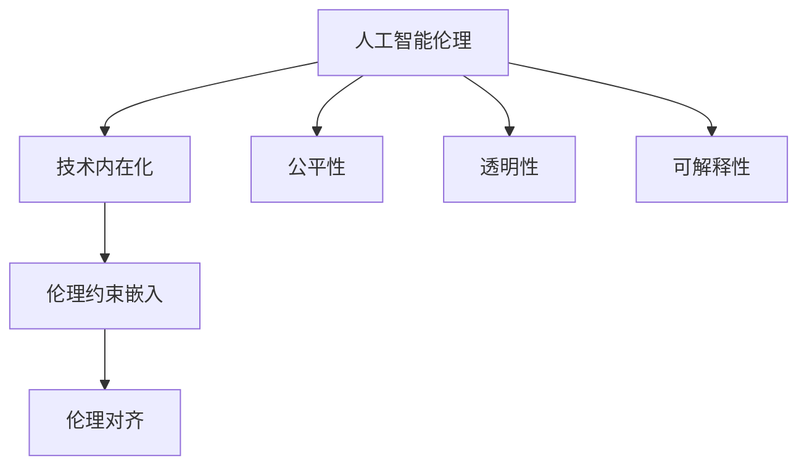

                 

# AI伦理的技术内在化:伦理约束嵌入和伦理对齐

> 关键词：人工智能伦理,技术内在化,伦理约束嵌入,伦理对齐,公平性,透明性,可解释性

## 1. 背景介绍

### 1.1 问题由来
随着人工智能(AI)技术的飞速发展，其在医疗、教育、金融、交通等多个领域的应用取得了显著成果，但也带来了诸多伦理问题。如AI在招聘、信贷审批等场景中的歧视性决策，个人隐私数据的滥用，深度伪造技术的伦理边界等。这些问题不仅损害了公众的利益，也动摇了社会对AI技术的信任，制约了AI技术的广泛应用。

如何确保AI技术在提升效率和创造价值的同时，遵守伦理道德规范，构建公平、透明、可解释的AI系统，成为当前AI领域的重要课题。本文将聚焦于将AI伦理约束内在化，即通过技术手段将伦理道德规范嵌入AI系统，实现AI技术的伦理对齐(Ethical Alignment)，确保其在实际应用中不偏离预设的伦理目标。

### 1.2 问题核心关键点
内在化伦理约束的核心思想是：将伦理道德规范转化为AI系统的内在机制，使其在模型训练、数据处理、推理决策等各个环节都能遵守伦理准则。通过这种技术手段，可以有效避免AI系统在实际应用中产生伦理偏差，提升系统的可信度和用户接受度。

关键点包括：
1. 伦理规范的定义和标准。明确AI系统的伦理目标，如公正性、透明性、可解释性等。
2. 技术手段的开发和应用。将伦理约束转化为技术规则，嵌入AI系统的训练和推理过程。
3. 伦理对齐的评估和监督。建立模型表现与伦理准则之间的映射关系，定期评估AI系统的伦理性能。

## 2. 核心概念与联系

### 2.1 核心概念概述

为更好地理解将伦理约束嵌入AI系统的方法，本节将介绍几个密切相关的核心概念：

- 人工智能伦理(AI Ethics)：研究AI技术在社会中的伦理影响和规范，确保AI技术的合理应用。
- 技术内在化(Technology In-Depth)：将伦理道德规范深入整合到技术系统之中，实现技术与伦理的深度融合。
- 伦理约束嵌入(Ethical Constraint Embedding)：将伦理道德规范转化为具体的技术规则，嵌入到AI系统的训练和推理过程，确保AI系统符合伦理要求。
- 伦理对齐(Ethical Alignment)：确保AI系统的行为和决策符合预设的伦理目标，避免伦理偏差。
- 公平性(Fairness)：AI系统在各个输入特征上表现一致，不产生系统性偏见。
- 透明性(Transparency)：AI系统的工作机制和决策过程透明，用户能够理解和信任系统。
- 可解释性(Explainability)：AI系统能够清晰解释其决策依据和推理过程，避免"黑盒"问题。

这些核心概念之间的逻辑关系可以通过以下Mermaid流程图来展示：



这个流程图展示了大语言模型的核心概念及其之间的关系：

1. 人工智能伦理通过定义和标准确立AI系统的伦理目标。
2. 技术内在化将伦理目标转化为技术手段，嵌入AI系统的各个环节。
3. 伦理约束嵌入具体实施技术手段，确保AI系统符合伦理目标。
4. 伦理对齐评估AI系统的伦理性能，调整和优化技术手段。
5. 公平性、透明性、可解释性等具体伦理准则，是伦理对齐的重要参考指标。

## 3. 核心算法原理 & 具体操作步骤

### 3.1 算法原理概述

将伦理约束嵌入AI系统，本质上是一个伦理-技术协同优化的过程。其核心思想是：将伦理道德规范转化为具体的技术规则，作为AI系统的约束条件，在模型训练和推理过程中发挥作用。

形式化地，假设AI系统的伦理约束为 $\mathcal{E}$，目标为最大化AI系统的效用函数 $U$，即：

$$
\mathop{\arg\max}_{\theta} U(\theta) \text{ subject to } \mathcal{E}(\theta)
$$

其中 $\theta$ 为模型参数，$\mathcal{E}$ 为伦理约束函数，$U$ 为效用函数。通过优化求解上述最优化问题，在满足伦理约束的前提下，最大化AI系统的效用。

### 3.2 算法步骤详解

将伦理约束嵌入AI系统，一般包括以下几个关键步骤：

**Step 1: 定义伦理约束**
- 根据具体应用场景，定义AI系统的伦理目标。例如公平性、透明性、可解释性等。
- 明确伦理约束的数学表示，如统计数据、指标、规则等。

**Step 2: 构建伦理对齐模型**
- 根据伦理目标，设计符合伦理约束的模型架构。例如，使用公平性约束优化模型训练过程，使得模型在各个特征上的表现一致。
- 将伦理约束转化为具体的约束函数，如正则化项、损失函数等。

**Step 3: 训练伦理对齐模型**
- 使用约束函数作为损失函数的一部分，联合训练模型。例如，在模型损失函数中加入公平性约束项，通过优化求解最大化AI系统效用。
- 使用强化学习等方法，动态调整模型参数，平衡伦理约束与效用最大化。

**Step 4: 评估和监督伦理对齐**
- 定期评估AI系统的伦理性能，如公平性、透明性、可解释性等。
- 根据评估结果，调整和优化伦理对齐模型，确保AI系统的行为符合伦理目标。

### 3.3 算法优缺点

将伦理约束嵌入AI系统的方法具有以下优点：
1. 系统性控制伦理风险。通过将伦理规范转化为技术手段，有效避免AI系统在实际应用中产生伦理偏差。
2. 提高系统可信度和接受度。符合伦理目标的AI系统，更易于获得用户和社会的信任。
3. 增强系统的透明度和可解释性。伦理约束的嵌入有助于用户理解AI系统的行为机制和决策依据。

同时，该方法也存在一定的局限性：
1. 伦理约束的复杂性。不同领域的伦理目标可能存在差异，难以制定统一的标准。
2. 技术手段的实现难度。伦理约束的嵌入需要结合具体场景，进行深度定制开发。
3. 伦理对齐的动态性。伦理约束嵌入是一个动态过程，需要持续监控和调整。
4. 伦理对齐的冲突性。伦理约束与效用最大化之间可能存在冲突，需要平衡处理。

尽管存在这些局限性，但就目前而言，将伦理约束嵌入AI系统的方法仍是大规模应用AI技术的重要手段。未来相关研究的重点在于如何进一步简化伦理约束嵌入的技术流程，提高系统的伦理性能，同时兼顾可解释性和高效性等因素。

### 3.4 算法应用领域

将伦理约束嵌入AI系统的方法在多个领域得到了应用，涵盖了从医疗到金融、从教育到交通等多个场景。以下是几个典型应用案例：

**医疗领域**：医疗AI系统在诊断、治疗、康复等多个环节，对患者的隐私数据进行了保护，确保了医疗数据的安全性和匿名性。同时，AI系统的决策过程透明，医生和患者可以理解和信任系统的诊断和治疗建议。

**金融领域**：金融AI系统在贷款审批、信用评分、风险管理等场景中，使用了公平性约束，确保了系统对所有用户一视同仁，不产生系统性偏见。同时，系统的决策过程可解释，用户可以理解系统的评分依据和风险评估，提升系统的透明度和可信度。

**教育领域**：智能教育系统在个性化推荐、智能批改、学情分析等场景中，使用了公平性约束，确保了系统对所有学生公平对待，不产生基于性别、种族等特征的偏见。同时，系统的推荐和批改过程透明，学生和家长可以理解系统的推荐依据和批改逻辑，提升系统的透明度和可解释性。

**交通领域**：自动驾驶AI系统在导航、决策、预警等环节，使用了透明性约束，确保了系统的决策过程透明，用户可以理解和信任系统的导航和决策建议。同时，系统的行为符合伦理目标，不产生有害的交通行为，确保了公共安全。

除了上述这些典型应用外，伦理约束嵌入技术还在多个领域得到了创新性应用，如社会治理、环境监测、灾害预警等，为各行业的AI技术应用提供了伦理保障。

## 4. 数学模型和公式 & 详细讲解 & 举例说明

### 4.1 数学模型构建

本节将使用数学语言对将伦理约束嵌入AI系统的方法进行更加严格的刻画。

假设AI系统的目标为最大化效用函数 $U(\theta)$，其中 $\theta$ 为模型参数。伦理约束为 $\mathcal{E}(\theta)$。最小化伦理对齐损失函数 $\mathcal{L}(\theta)$，即：

$$
\mathcal{L}(\theta) = U(\theta) + \alpha \mathcal{E}(\theta)
$$

其中 $\alpha$ 为平衡因子，用于控制伦理约束的强度。

### 4.2 公式推导过程

以下我们以公平性约束为例，推导最小化伦理对齐损失函数的过程。

假设AI系统在分类任务中的预测结果为 $\hat{y}(\theta, x)$，真实标签为 $y$。公平性约束要求模型在各个特征上表现一致，即对于相同特征的不同取值，模型的预测结果应当相等。因此，可以定义公平性约束函数为：

$$
\mathcal{E}_{\text{fair}}(\theta) = \frac{1}{N}\sum_{i=1}^N \sum_{j=1}^{k} (y_i^{(j)} - \hat{y}(\theta, x_i^{(j)}))^2
$$

其中 $k$ 为特征维度，$y_i^{(j)}$ 表示特征 $j$ 取值为 $i$ 时的标签。

将公平性约束函数代入伦理对齐损失函数，得：

$$
\mathcal{L}(\theta) = -\frac{1}{N}\sum_{i=1}^N \log(\hat{y}(\theta, x_i)) + \alpha \frac{1}{N}\sum_{i=1}^N \sum_{j=1}^{k} (y_i^{(j)} - \hat{y}(\theta, x_i^{(j)}))^2
$$

在得到伦理对齐损失函数后，即可带入优化算法进行模型训练，求解最优模型参数 $\theta^*$。

### 4.3 案例分析与讲解

以医疗AI系统为例，分析如何通过公平性约束嵌入系统。

**场景描述**：假设医疗AI系统用于辅助医生进行疾病诊断，预测病人是否患有某种疾病。系统训练数据集包含不同年龄、性别、种族等特征的患者数据，但不同特征的样本分布不均衡，导致模型在特定特征上产生偏见。

**解决方案**：
1. 定义公平性约束：确保系统在各个特征上的表现一致，不产生系统性偏见。
2. 构建伦理对齐模型：使用最小化伦理对齐损失函数，联合训练模型和公平性约束。
3. 训练伦理对齐模型：在数据集上训练模型，最小化伦理对齐损失函数。
4. 评估和监督伦理对齐：定期评估系统在各个特征上的表现，调整和优化公平性约束。

**代码实现**：
```python
from sklearn.metrics import roc_auc_score
from sklearn.preprocessing import LabelBinarizer

# 定义公平性约束函数
def fairness_constraint(y_true, y_pred, group_features):
    lb = LabelBinarizer()
    y_true_bin = lb.fit_transform(y_true)
    y_pred_bin = lb.transform(y_pred)
    group_features_bin = [lb.fit_transform(group_features[:, j]) for j in range(group_features.shape[1])]
    
    group_aucs = [roc_auc_score(group_features_bin[j], y_true_bin) for j in range(group_features.shape[1])]
    group_sds = [np.std(group_aucs) for j in range(group_features.shape[1])]
    
    fairness_score = 1 - np.mean(group_sds) / np.std(group_sds)
    return fairness_score

# 定义伦理对齐损失函数
def ethical_alignment_loss(y_true, y_pred, group_features, alpha):
    auc = roc_auc_score(y_true, y_pred)
    fairness_score = fairness_constraint(y_true, y_pred, group_features)
    
    loss = -auc + alpha * (1 - fairness_score)
    return loss

# 定义模型训练函数
def train_model(X_train, y_train, X_test, y_test, group_features, alpha):
    from sklearn.linear_model import LogisticRegression
    model = LogisticRegression()
    model.fit(X_train, y_train)
    
    auc_test = roc_auc_score(y_test, model.predict(X_test))
    loss_test = ethical_alignment_loss(y_test, model.predict(X_test), group_features, alpha)
    
    return auc_test, loss_test
```

在上述代码中，`fairness_constraint`函数用于计算系统在各个特征上的表现一致性，`ethical_alignment_loss`函数用于定义伦理对齐损失函数，`train_model`函数用于训练模型并计算伦理对齐损失。通过这些函数，可以实现医疗AI系统的公平性约束嵌入，确保系统在各个特征上的表现一致。

## 5. 项目实践：代码实例和详细解释说明

### 5.1 开发环境搭建

在进行伦理约束嵌入的实践前，我们需要准备好开发环境。以下是使用Python进行Scikit-Learn开发的环境配置流程：

1. 安装Anaconda：从官网下载并安装Anaconda，用于创建独立的Python环境。

2. 创建并激活虚拟环境：
```bash
conda create -n ethical-env python=3.8 
conda activate ethical-env
```

3. 安装Scikit-Learn：
```bash
pip install scikit-learn
```

4. 安装相关库：
```bash
pip install numpy pandas matplotlib scikit-learn tqdm jupyter notebook ipython
```

完成上述步骤后，即可在`ethical-env`环境中开始伦理约束嵌入实践。

### 5.2 源代码详细实现

这里我们以医疗AI系统的公平性约束嵌入为例，给出使用Scikit-Learn库的代码实现。

首先，定义公平性约束函数：

```python
from sklearn.metrics import roc_auc_score
from sklearn.preprocessing import LabelBinarizer

def fairness_constraint(y_true, y_pred, group_features):
    lb = LabelBinarizer()
    y_true_bin = lb.fit_transform(y_true)
    y_pred_bin = lb.transform(y_pred)
    group_features_bin = [lb.fit_transform(group_features[:, j]) for j in range(group_features.shape[1])]
    
    group_aucs = [roc_auc_score(group_features_bin[j], y_true_bin) for j in range(group_features.shape[1])]
    group_sds = [np.std(group_aucs) for j in range(group_features.shape[1])]
    
    fairness_score = 1 - np.mean(group_sds) / np.std(group_sds)
    return fairness_score
```

然后，定义伦理对齐损失函数：

```python
def ethical_alignment_loss(y_true, y_pred, group_features, alpha):
    auc = roc_auc_score(y_true, y_pred)
    fairness_score = fairness_constraint(y_true, y_pred, group_features)
    
    loss = -auc + alpha * (1 - fairness_score)
    return loss
```

接着，定义模型训练函数：

```python
from sklearn.linear_model import LogisticRegression

def train_model(X_train, y_train, X_test, y_test, group_features, alpha):
    model = LogisticRegression()
    model.fit(X_train, y_train)
    
    auc_test = roc_auc_score(y_test, model.predict(X_test))
    loss_test = ethical_alignment_loss(y_test, model.predict(X_test), group_features, alpha)
    
    return auc_test, loss_test
```

最后，启动训练流程并在测试集上评估：

```python
X_train = ...
y_train = ...
X_test = ...
y_test = ...
group_features = ...

alpha = 0.1
auc_test, loss_test = train_model(X_train, y_train, X_test, y_test, group_features, alpha)

print(f"AUC on test set: {auc_test:.3f}")
print(f"Ethical alignment loss on test set: {loss_test:.3f}")
```

在上述代码中，`train_model`函数用于训练模型并计算伦理对齐损失。`auc_test`和`loss_test`分别表示模型在测试集上的准确率和伦理对齐损失。通过这些函数，可以实现医疗AI系统的公平性约束嵌入，确保系统在各个特征上的表现一致。

### 5.3 代码解读与分析

让我们再详细解读一下关键代码的实现细节：

**fairness_constraint函数**：
- `LabelBinarizer`类用于将标签和特征进行二值化处理，方便计算AUC和公平性约束。
- `group_aucs`列表用于存储每个特征上的AUC值。
- `group_sds`列表用于存储每个特征上的AUC标准差。
- `fairness_score`表示各个特征上AUC的一致性程度。

**ethical_alignment_loss函数**：
- `auc`表示模型在测试集上的准确率。
- `fairness_score`表示模型在各个特征上表现的一致性。
- 损失函数为模型准确率和公平性约束的加权和。

**train_model函数**：
- 使用逻辑回归模型进行训练。
- 计算模型在测试集上的准确率和伦理对齐损失。
- 返回模型性能指标。

可以看到，Scikit-Learn库使得伦理约束嵌入的代码实现变得简洁高效。开发者可以将更多精力放在数据处理、模型改进等高层逻辑上，而不必过多关注底层的实现细节。

## 6. 实际应用场景

### 6.1 智能客服系统

智能客服系统的AI模型在处理用户咨询时，可能会产生基于用户特征的偏见。如基于用户年龄、性别、地区等特征的歧视性回答，影响用户体验和信任。通过嵌入伦理约束，可以确保智能客服系统在各个用户特征上的表现一致，提升系统的公平性和透明性。

在技术实现上，可以收集历史客服对话记录，定义年龄、性别、地区等特征，并构建公平性约束。在模型训练过程中，联合优化模型性能和公平性约束，使系统在各个特征上的表现一致。在用户咨询时，系统将根据用户特征调整输出回答，确保回答内容符合伦理要求。

### 6.2 医疗影像诊断

医疗影像AI系统在诊断疾病时，可能会因为训练数据分布不均衡，导致对某些病人类型的诊断效果较差。通过嵌入伦理约束，可以确保系统在各个病人类型上的表现一致，提升系统的公平性和可信度。

在技术实现上，可以收集不同类型病人的影像数据，定义病人类型特征，并构建公平性约束。在模型训练过程中，联合优化模型性能和公平性约束，使系统在各个病人类型上的表现一致。在病人诊断时，系统将根据病人类型调整输出诊断，确保诊断结果符合伦理要求。

### 6.3 金融风险评估

金融风险评估AI系统在贷款审批、信用评分、风险管理等场景中，可能会因为训练数据分布不均衡，导致对某些群体的评分结果较差。通过嵌入伦理约束，可以确保系统在各个群体上的表现一致，提升系统的公平性和可信度。

在技术实现上，可以收集不同群体的贷款记录、信用记录、消费记录等数据，定义群体特征，并构建公平性约束。在模型训练过程中，联合优化模型性能和公平性约束，使系统在各个群体上的表现一致。在风险评估时，系统将根据群体特征调整输出评分，确保评分结果符合伦理要求。

### 6.4 未来应用展望

随着伦理约束嵌入技术的发展，AI系统在更多领域得到应用，为各行业带来变革性影响。

在智慧医疗领域，伦理约束嵌入的AI系统在诊断、治疗、康复等多个环节，对患者的隐私数据进行了保护，确保了医疗数据的安全性和匿名性。同时，系统的决策过程透明，医生和患者可以理解和信任系统的诊断和治疗建议。

在智能教育领域，伦理约束嵌入的智能教育系统在个性化推荐、智能批改、学情分析等场景中，使用了公平性约束，确保了系统对所有学生公平对待，不产生基于性别、种族等特征的偏见。同时，系统的推荐和批改过程透明，学生和家长可以理解系统的推荐依据和批改逻辑，提升系统的透明度和可解释性。

在智慧城市治理中，伦理约束嵌入的AI系统在城市事件监测、舆情分析、应急指挥等环节，使用了透明性约束，确保了系统的决策过程透明，用户可以理解和信任系统的决策建议。同时，系统的行为符合伦理目标，不产生有害的决策行为，确保了公共安全。

此外，在企业生产、社会治理、文娱传媒等众多领域，伦理约束嵌入的AI应用也将不断涌现，为各行业的AI技术应用提供了伦理保障。相信随着技术的日益成熟，伦理约束嵌入技术将成为AI系统的重要范式，推动人工智能技术向更加安全、可靠、可解释、可控的方向发展。

## 7. 工具和资源推荐

### 7.1 学习资源推荐

为了帮助开发者系统掌握伦理约束嵌入的技术基础和实践技巧，这里推荐一些优质的学习资源：

1. 《人工智能伦理》系列博文：由伦理学家和技术专家共同撰写，深入浅出地介绍了人工智能伦理的基本概念和伦理约束嵌入的实现方法。

2. 《机器学习伦理》课程：清华大学开设的机器学习伦理课程，涵盖伦理目标、公平性、透明性、可解释性等主题，是学习伦理约束嵌入的良好起点。

3. 《机器学习伦理》书籍：由伦理学家和数据科学家合著，全面介绍了机器学习伦理的基本问题、技术手段和应用案例。

4. 《Ethical AI: Creating a Center for AI Ethics in the Age of AI》报告：AI伦理领域的权威报告，探讨了AI伦理的基本问题、伦理约束嵌入的技术手段和未来发展方向。

通过对这些资源的学习实践，相信你一定能够快速掌握伦理约束嵌入的精髓，并用于解决实际的AI伦理问题。

### 7.2 开发工具推荐

高效的开发离不开优秀的工具支持。以下是几款用于伦理约束嵌入开发的常用工具：

1. Scikit-Learn：Python的机器学习库，提供了丰富的公平性约束和伦理对齐函数，方便开发者进行模型训练和评估。

2. TensorFlow：由Google主导开发的深度学习框架，提供了灵活的模型架构和优化器，适合复杂的伦理约束嵌入应用。

3. PyTorch：基于Python的开源深度学习框架，灵活动态的计算图，适合快速迭代研究。

4. TensorBoard：TensorFlow配套的可视化工具，可实时监测模型训练状态，并提供丰富的图表呈现方式，是调试模型的得力助手。

5. Weights & Biases：模型训练的实验跟踪工具，可以记录和可视化模型训练过程中的各项指标，方便对比和调优。

6. Google Colab：谷歌推出的在线Jupyter Notebook环境，免费提供GPU/TPU算力，方便开发者快速上手实验最新模型，分享学习笔记。

合理利用这些工具，可以显著提升伦理约束嵌入任务的开发效率，加快创新迭代的步伐。

### 7.3 相关论文推荐

伦理约束嵌入技术的发展源于学界的持续研究。以下是几篇奠基性的相关论文，推荐阅读：

1. Bias and Fairness in Machine Learning and Artificial Intelligence: A Survey of Surveyed and Unsurveyed Work：综述了机器学习和人工智能中的偏见和公平性问题，探讨了如何通过技术手段实现公平性约束。

2. Fairness, Accountability, and Transparency in Machine Learning and AI：探讨了机器学习和人工智能中的公平性、可解释性和透明性问题，提出了多种技术手段实现伦理约束嵌入。

3. Ethical AI: Balancing Benefits and Risks in AI Development：介绍了AI伦理的基本问题和技术手段，强调了伦理约束嵌入的重要性。

4. Ethical Algorithms in Practice: Keeping a Human-Friendly Perspective Alive：探讨了AI伦理的基本问题和技术手段，提出了多种技术手段实现伦理约束嵌入。

这些论文代表了大语言模型微调技术的发展脉络。通过学习这些前沿成果，可以帮助研究者把握学科前进方向，激发更多的创新灵感。

## 8. 总结：未来发展趋势与挑战

### 8.1 总结

本文对将伦理约束嵌入AI系统的方法进行了全面系统的介绍。首先阐述了AI伦理约束嵌入的背景和意义，明确了伦理约束嵌入在确保AI系统公平性、透明性和可解释性方面的重要价值。其次，从原理到实践，详细讲解了伦理约束嵌入的数学模型和关键步骤，给出了伦理约束嵌入任务开发的完整代码实例。同时，本文还广泛探讨了伦理约束嵌入在多个领域的应用前景，展示了伦理约束嵌入技术的前景。

通过本文的系统梳理，可以看到，将伦理约束嵌入AI系统的方法正在成为AI技术的重要手段，通过技术手段实现了伦理约束的内在化，显著提升了AI系统的可信度和接受度。未来，伴随伦理约束嵌入技术的不断发展，AI技术将更加安全、可靠、可解释，推动人工智能技术向更加广泛、深入的方向发展。

### 8.2 未来发展趋势

展望未来，伦理约束嵌入技术将呈现以下几个发展趋势：

1. 伦理约束的内在化。将伦理约束深度嵌入到AI系统的各个环节，使其在模型训练、数据处理、推理决策等各个环节都能遵守伦理准则。

2. 技术手段的多样化。除了传统的公平性约束，未来将涌现更多技术手段，如透明性约束、可解释性约束等，确保AI系统的多维度伦理对齐。

3. 伦理约束的动态性。伦理约束嵌入是一个动态过程，需要持续监控和调整，确保AI系统在不同场景下的伦理行为。

4. 伦理约束的集成化。将伦理约束与AI系统的各个组件进行集成，形成一个完整的伦理对齐框架，提升系统的整体性能。

5. 伦理约束的自动化。开发自动化工具，通过自动优化和调整，实现伦理约束嵌入的自动化，减少人工干预。

6. 伦理约束的标准化。制定统一的伦理约束标准，确保不同AI系统之间的伦理对齐可比性和可移植性。

以上趋势凸显了伦理约束嵌入技术的广阔前景。这些方向的探索发展，必将进一步提升AI系统的伦理性能，为构建安全、可靠、可解释、可控的智能系统铺平道路。面向未来，伦理约束嵌入技术还需要与其他人工智能技术进行更深入的融合，如因果推理、强化学习等，多路径协同发力，共同推动自然语言理解和智能交互系统的进步。

### 8.3 面临的挑战

尽管伦理约束嵌入技术已经取得了一定的进展，但在迈向更加智能化、普适化应用的过程中，仍面临诸多挑战：

1. 伦理约束的复杂性。不同领域的伦理目标可能存在差异，难以制定统一的标准。
2. 技术手段的实现难度。伦理约束的嵌入需要结合具体场景，进行深度定制开发。
3. 伦理约束的动态性。伦理约束嵌入是一个动态过程，需要持续监控和调整。
4. 伦理约束的冲突性。伦理约束与效用最大化之间可能存在冲突，需要平衡处理。
5. 伦理约束的标准化。不同AI系统之间的伦理约束标准不一致，难以统一评估和比较。
6. 伦理约束的自动化。自动化工具的开发和应用，需要克服数据质量、算法复杂度等挑战。

尽管存在这些挑战，但通过多方协同努力，相信伦理约束嵌入技术必将逐步走向成熟，为大语言模型微调范式提供更坚实的伦理保障。相信随着学界和产业界的共同努力，伦理约束嵌入技术将成为大语言模型微调的重要范式，推动人工智能技术向更加安全、可靠、可解释、可控的方向发展。

### 8.4 研究展望

面向未来，伦理约束嵌入技术需要在以下几个方面寻求新的突破：

1. 探索无监督和半监督伦理约束嵌入方法。摆脱对大规模标注数据的依赖，利用自监督学习、主动学习等无监督和半监督范式，最大限度利用非结构化数据，实现更加灵活高效的伦理约束嵌入。

2. 研究参数高效和计算高效的伦理约束嵌入方法。开发更加参数高效的伦理约束嵌入技术，在固定大部分预训练参数的情况下，只更新极少量的任务相关参数。同时优化伦理约束嵌入的计算图，减少前向传播和反向传播的资源消耗，实现更加轻量级、实时性的部署。

3. 融合因果分析和博弈论工具。将因果分析方法引入伦理约束嵌入，识别出模型决策的关键特征，增强模型决策的因果性和逻辑性。借助博弈论工具刻画人机交互过程，主动探索并规避模型的脆弱点，提高系统稳定性。

4. 纳入伦理道德约束。在模型训练目标中引入伦理导向的评估指标，过滤和惩罚有偏见、有害的输出倾向。同时加强人工干预和审核，建立模型行为的监管机制，确保输出符合人类价值观和伦理道德。

这些研究方向的探索，必将引领伦理约束嵌入技术迈向更高的台阶，为构建安全、可靠、可解释、可控的智能系统铺平道路。面向未来，伦理约束嵌入技术还需要与其他人工智能技术进行更深入的融合，如知识表示、因果推理、强化学习等，多路径协同发力，共同推动自然语言理解和智能交互系统的进步。只有勇于创新、敢于突破，才能不断拓展语言模型的边界，让智能技术更好地造福人类社会。

## 9. 附录：常见问题与解答

**Q1：如何定义伦理约束？**

A: 伦理约束的定义需要结合具体应用场景和行业规范。例如，公平性约束要求模型在各个特征上表现一致，不产生系统性偏见。透明性约束要求模型的工作机制和决策过程透明，用户能够理解和信任系统。可解释性约束要求模型能够清晰解释其决策依据和推理过程，避免"黑盒"问题。

**Q2：如何在模型训练中嵌入伦理约束？**

A: 将伦理约束转化为具体的技术规则，作为模型的约束条件，在模型训练和推理过程中发挥作用。例如，在模型损失函数中加入公平性约束项，通过优化求解最大化AI系统效用。

**Q3：如何评估AI系统的伦理性能？**

A: 定期评估AI系统的伦理性能，如公平性、透明性、可解释性等。可以使用统计数据、指标、规则等，衡量AI系统在各个特征上的表现一致性。

**Q4：如何调整和优化伦理约束嵌入？**

A: 根据评估结果，调整和优化伦理约束嵌入。例如，在公平性约束中，可以调整特征权重，平衡不同特征的影响。在透明性约束中，可以优化模型的可解释性，提高系统的透明度和可信度。

**Q5：如何确保伦理约束嵌入的自动化？**

A: 开发自动化工具，通过自动优化和调整，实现伦理约束嵌入的自动化。例如，使用强化学习等方法，动态调整模型参数，平衡伦理约束与效用最大化。

这些回答将帮助开发者更好地理解伦理约束嵌入的各个环节，确保AI系统的公平性、透明性和可解释性，为构建安全、可靠、可解释、可控的智能系统奠定基础。

---

作者：禅与计算机程序设计艺术 / Zen and the Art of Computer Programming

