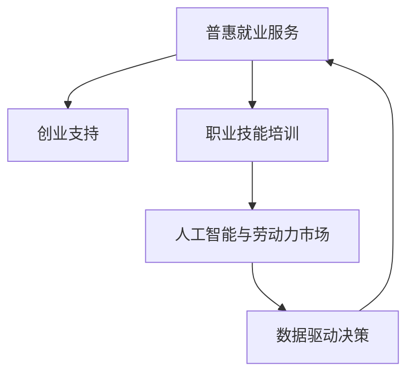

                 

# AI时代的就业政策创新:普惠就业服务和创业支持

> 关键词：AI技术,普惠就业服务,创业支持,就业政策创新,职业技能培训,人工智能与劳动力市场

## 1. 背景介绍

### 1.1 问题由来
随着人工智能（AI）技术的发展，劳动力市场正在经历深刻变革。AI和自动化技术不仅在生产制造、服务业等领域广泛应用，也在改变传统的就业模式和职业要求。AI的兴起，一方面创造了大量新岗位，另一方面也对传统岗位造成了冲击。如何应对这些变化，实现AI技术与人力资源的有机结合，成为了当前就业政策创新的核心问题。

### 1.2 问题核心关键点
就业政策创新应注重以下几个关键点：
- **普惠就业服务**：确保所有人都能平等地享受到就业支持服务，无论其教育背景、技能水平、地域分布。
- **创业支持**：通过政策激励和资源支持，激发人们的创业意愿，特别是青年人和低收入群体。
- **职业技能培训**：根据市场变化，提供定制化的职业培训项目，帮助劳动者提升技能，适应新兴岗位需求。
- **数据驱动决策**：利用大数据、人工智能等技术，实现就业政策的精准化、智能化，提高政策效果和公平性。

### 1.3 问题研究意义
AI时代的就业政策创新，旨在构建一个公平、包容、可持续的就业生态系统，助力全社会共同发展。

- **提升就业质量**：通过技能培训和创业支持，提高劳动者的就业质量，减少失业率，增加收入。
- **促进经济增长**：AI技术的应用，不仅能提高生产效率，还能创造新的产业和就业机会，推动经济增长。
- **社会稳定**：通过公平的政策分配，减少因技术变革带来的社会不平等，促进社会和谐。

## 2. 核心概念与联系

### 2.1 核心概念概述

为更好地理解就业政策的创新，本文将介绍几个密切相关的核心概念：

- **普惠就业服务**：面向所有劳动者提供的就业服务，包括职业介绍、职业培训、就业指导、就业援助等，确保每个人都有平等的发展机会。
- **创业支持**：通过提供资金支持、税收优惠、创业培训、市场准入等服务，激发和支持创业活动，降低创业门槛，促进就业。
- **职业技能培训**：根据市场需求和劳动力素质，提供针对性的培训课程，提升劳动者的技能水平，适应新兴产业和岗位。
- **人工智能与劳动力市场**：AI技术对劳动力市场的影响，包括就业结构变化、技能需求更新、工作模式转变等，以及这些变化对就业政策创新的要求。
- **数据驱动决策**：利用大数据、AI等技术，对就业市场进行动态监测和分析，提供政策建议，实现精准就业服务。

这些概念之间的逻辑关系可以通过以下Mermaid流程图来展示：



这个流程图展示了几者之间的联系和作用机制：

1. 普惠就业服务通过提供基础就业支持，为创业者提供成长的环境。
2. 创业支持通过激发创业活动，创造就业机会。
3. 职业技能培训提升劳动者技能，适应新兴产业。
4. AI与劳动力市场的研究分析就业趋势，为政策制定提供依据。
5. 数据驱动决策通过技术手段，实现就业政策的精准化和智能化。

## 3. 核心算法原理 & 具体操作步骤
### 3.1 算法原理概述

AI时代的就业政策创新，主要基于数据驱动和人工智能技术，进行精准化、个性化的就业服务。其核心算法原理包括：

- **数据挖掘与分析**：利用大数据技术，从劳动力市场、就业政策、企业需求等多个维度，挖掘潜在的就业机会和挑战。
- **机器学习与预测**：构建就业预测模型，基于历史数据和市场趋势，预测未来的就业需求和岗位变化。
- **自然语言处理与情感分析**：分析社交媒体、招聘网站上的就业信息，识别公众对就业政策的反馈和情感倾向。
- **决策支持系统**：将AI模型与政策制定系统结合，提供基于数据支持的就业政策建议，帮助决策者制定科学的政策。

### 3.2 算法步骤详解

基于AI的就业政策创新主要包括以下几个关键步骤：

**Step 1: 数据收集与预处理**
- 收集劳动市场数据、就业政策数据、企业招聘数据等，使用ETL工具进行清洗和标准化。
- 利用数据挖掘技术，识别就业市场趋势、需求变化、技能缺口等信息。

**Step 2: 构建就业预测模型**
- 使用机器学习算法（如回归、分类、序列模型等），构建就业预测模型，预测未来的就业岗位、失业率、技能需求等。
- 模型训练集为历史数据，测试集为最新数据，评估模型预测性能。

**Step 3: 分析公众反馈与情感**
- 使用自然语言处理技术（如NLP、情感分析等），分析社交媒体、招聘网站上的用户反馈，识别公众对就业政策的情感倾向和具体诉求。
- 通过情感分析，了解不同群体的就业期望、担忧和建议。

**Step 4: 政策优化与推广**
- 基于模型预测和公众反馈，制定和优化就业政策。政策可以包括就业补贴、创业激励、职业培训等。
- 利用社交媒体、政府网站等平台，宣传和推广新政策，提高公众知晓度和参与度。

### 3.3 算法优缺点

基于AI的就业政策创新具有以下优点：
1. **精准化**：通过数据驱动，可以实现就业政策的精准化，提高资源分配的公平性和有效性。
2. **实时化**：AI技术可以实时监测就业市场变化，快速响应需求，提高政策的及时性。
3. **个性化**：根据个体差异和市场需求，提供个性化的就业服务，提升就业效果。

但该方法也存在一些局限性：
1. **数据隐私**：大规模数据收集和分析可能引发隐私问题，需要严格的数据保护措施。
2. **算法偏见**：AI模型可能继承数据中的偏见，影响政策的公平性。
3. **成本高**：数据收集、模型训练和政策优化都需要高额成本。
4. **解释性不足**：AI模型的决策过程难以解释，缺乏透明度，可能影响政策的可信度。

### 3.4 算法应用领域

AI技术在就业政策创新中的应用领域广泛，涵盖多个方面：

- **就业预测与市场分析**：使用AI预测就业趋势、技能需求，辅助政策制定。
- **公共就业服务**：通过AI技术优化职业介绍、求职匹配、培训资源推荐等就业服务。
- **创业支持与创新孵化**：利用AI分析创业机会，提供创业指导和融资支持。
- **人才流动与移民政策**：分析劳动力流动趋势，优化人才引进和移民政策。
- **社会保障与失业救济**：使用AI评估失业风险，提供个性化的就业援助和救济。

## 4. 数学模型和公式 & 详细讲解 & 举例说明

### 4.1 数学模型构建

就业预测模型通常基于时间序列数据构建，以回归模型为例，基本模型为：

$$
y_t = \alpha + \beta_1 x_{t-1} + \beta_2 x_{t-2} + \cdots + \beta_p x_{t-p} + \epsilon_t
$$

其中，$y_t$为第t期预测值，$x_t$为第t期特征值，$\alpha$为截距项，$\beta_1, \beta_2, \cdots, \beta_p$为回归系数，$\epsilon_t$为误差项。

### 4.2 公式推导过程

以线性回归模型为例，推导预测公式如下：

$$
y_t = \alpha + \beta_1 x_{t-1} + \beta_2 x_{t-2} + \cdots + \beta_p x_{t-p} + \epsilon_t
$$

其中，$y_t$为第t期的就业需求量，$x_t$为第t期的经济增长率、失业率、人口增长率等特征值，$\alpha$为常数项，$\beta_i$为回归系数，$\epsilon_t$为随机误差。

### 4.3 案例分析与讲解

以某城市劳动力市场数据为例，使用线性回归模型预测就业需求，步骤如下：

1. **数据收集与预处理**：收集该城市历年的经济增长率、失业率、人口增长率等数据，进行清洗和标准化。
2. **特征工程**：构建经济增长率、失业率等特征向量。
3. **模型训练**：使用历史数据训练线性回归模型，得到回归系数。
4. **模型评估**：使用最新数据验证模型预测效果。
5. **政策建议**：根据预测结果，提出就业政策建议。

## 5. 项目实践：代码实例和详细解释说明
### 5.1 开发环境搭建

在进行就业政策创新项目开发前，我们需要准备好开发环境。以下是使用Python进行PyTorch开发的环境配置流程：

1. 安装Anaconda：从官网下载并安装Anaconda，用于创建独立的Python环境。

2. 创建并激活虚拟环境：
```bash
conda create -n pytorch-env python=3.8 
conda activate pytorch-env
```

3. 安装PyTorch：根据CUDA版本，从官网获取对应的安装命令。例如：
```bash
conda install pytorch torchvision torchaudio cudatoolkit=11.1 -c pytorch -c conda-forge
```

4. 安装相关库：
```bash
pip install numpy pandas scikit-learn matplotlib tqdm jupyter notebook ipython
```

完成上述步骤后，即可在`pytorch-env`环境中开始项目开发。

### 5.2 源代码详细实现

以下是一个简单的就业预测项目，使用线性回归模型进行预测的代码实现。

```python
import pandas as pd
from sklearn.linear_model import LinearRegression
from sklearn.metrics import mean_squared_error

# 数据加载
data = pd.read_csv('employment_data.csv')

# 数据预处理
X = data[['gdp_growth', 'unemployment_rate', 'population_growth']]
y = data['employment']

# 模型训练
model = LinearRegression()
model.fit(X, y)

# 模型评估
y_pred = model.predict(X)
mse = mean_squared_error(y, y_pred)
print(f"Mean Squared Error: {mse}")

# 政策建议
if mse < 0.1:
    print("政策建议：维持当前经济政策，稳定就业市场。")
else:
    print("政策建议：调整经济政策，刺激就业增长。")
```

### 5.3 代码解读与分析

让我们再详细解读一下关键代码的实现细节：

**数据加载与预处理**：
- 使用pandas库加载CSV格式的数据集，并进行特征选择和数据标准化。

**模型训练与评估**：
- 使用scikit-learn库中的LinearRegression模型，进行线性回归训练。
- 计算模型预测值与实际值之间的均方误差（Mean Squared Error, MSE），评估模型性能。

**政策建议**：
- 根据模型评估结果，提出相应的就业政策建议。

可以看到，PyTorch配合scikit-learn库使得就业预测项目的代码实现变得简洁高效。开发者可以将更多精力放在数据处理、模型改进等高层逻辑上，而不必过多关注底层的实现细节。

## 6. 实际应用场景

### 6.1 智能招聘平台

智能招聘平台利用AI技术，为用户提供精准的职位推荐和候选人筛选服务。平台可以根据用户的简历、求职意向、技能水平等数据，结合市场岗位需求，实时匹配合适的职位。同时，平台还可以分析候选人的历史表现和反馈，推荐合适的岗位。

### 6.2 职业教育与培训机构

职业教育与培训机构可以通过AI技术，分析市场对不同技能的需求，定制化职业培训项目。例如，根据AI分析结果，推出数据科学、AI算法、机器学习等热门课程，帮助劳动者提升技能，增强就业竞争力。

### 6.3 政府就业服务

政府就业服务部门可以利用AI技术，优化就业信息发布、职业介绍、职业培训等服务。例如，通过AI分析求职者的简历和技能，提供个性化的就业指导和推荐；利用AI分析招聘信息，预测未来就业趋势，提供政策建议。

### 6.4 未来应用展望

随着AI技术的持续进步，就业政策创新将呈现以下几个发展趋势：

1. **个性化服务**：利用AI技术，实现就业服务的个性化定制，根据个体差异提供精准的就业支持和职业指导。
2. **智能匹配**：通过AI技术优化职位推荐和候选人筛选，提升匹配效率和效果。
3. **市场预测**：利用AI模型预测就业市场趋势，为政策制定提供依据。
4. **多模态融合**：结合图像、语音、文本等多种数据源，提升就业服务的全面性和准确性。
5. **跨领域合作**：推动政府、企业、教育机构等多方合作，共同推进就业政策的创新和实施。

## 7. 工具和资源推荐
### 7.1 学习资源推荐

为了帮助开发者系统掌握就业政策创新的技术基础和实践技巧，这里推荐一些优质的学习资源：

1. 《人工智能与就业》系列书籍：全面介绍了AI技术在就业领域的应用，包括就业预测、职业培训、创业支持等。

2. Coursera《机器学习》课程：斯坦福大学开设的机器学习课程，系统介绍了机器学习算法和实践应用。

3. Kaggle：提供丰富的就业数据分析竞赛和数据集，帮助开发者实践AI技术。

4. OpenAI《Transformers》书籍：介绍Transformer模型及其在NLP任务中的应用，为就业预测提供理论基础。

5. GitHub《就业政策创新》项目：提供多种就业政策创新项目的开源代码和文档，供开发者学习和参考。

通过对这些资源的学习实践，相信你一定能够快速掌握就业政策创新的精髓，并用于解决实际的就业问题。

### 7.2 开发工具推荐

高效的开发离不开优秀的工具支持。以下是几款用于就业政策创新开发的常用工具：

1. PyTorch：基于Python的开源深度学习框架，灵活动态的计算图，适合快速迭代研究。

2. TensorFlow：由Google主导开发的开源深度学习框架，生产部署方便，适合大规模工程应用。

3. Scikit-learn：基于Python的机器学习库，提供简单易用的API，适合数据挖掘和机器学习任务。

4. Weights & Biases：模型训练的实验跟踪工具，可以记录和可视化模型训练过程中的各项指标，方便对比和调优。

5. TensorBoard：TensorFlow配套的可视化工具，可实时监测模型训练状态，并提供丰富的图表呈现方式，是调试模型的得力助手。

6. Jupyter Notebook：支持Python代码的交互式开发，方便代码调试和结果展示。

合理利用这些工具，可以显著提升就业政策创新的开发效率，加快创新迭代的步伐。

### 7.3 相关论文推荐

就业政策创新领域的研究，近年来取得了一些重要进展。以下是几篇奠基性的相关论文，推荐阅读：

1. "AI for Workforce Transformation: The Future of Work"：探讨AI技术如何改变劳动力市场和就业政策。

2. "Towards a Data-Driven Policy: The Role of Big Data in Employment Policy"：分析大数据在就业政策中的应用和挑战。

3. "Economic Impact of AI and Automation on Employment"：研究AI技术对就业市场的影响和政策应对策略。

4. "Robust Adaptive Skill Training for the Future of Work"：提出适应未来就业市场的技能培训方法。

5. "AI in HR: Predictive Analytics and Employer Decision-Making"：探讨AI在人力资源管理中的应用和效果。

这些论文代表了大数据、AI技术在就业政策创新中的最新进展，为政策制定者提供了理论支持和实践指导。

## 8. 总结：未来发展趋势与挑战

### 8.1 总结

本文对AI时代的就业政策创新进行了全面系统的介绍。首先阐述了就业政策创新的背景和意义，明确了AI技术在就业服务、创业支持、技能培训等领域的独特价值。其次，从原理到实践，详细讲解了就业政策的AI驱动过程，给出了项目开发的全流程代码实现。同时，本文还广泛探讨了就业政策创新的实际应用场景，展示了AI技术在就业服务中的广泛应用。

通过本文的系统梳理，可以看到，AI时代的就业政策创新正在成为就业服务领域的核心驱动力，极大地提升了就业服务的精准化、智能化水平，为全社会带来了新的就业机会和发展机遇。未来，随着AI技术的不断进步，就业政策创新将继续推进，为构建公平、包容、可持续的就业生态系统贡献力量。

### 8.2 未来发展趋势

展望未来，就业政策创新的发展趋势主要体现在以下几个方面：

1. **技术融合**：AI技术将与大数据、区块链、物联网等多种技术融合，提升就业服务的全面性和安全性。

2. **政策智能化**：利用AI技术构建智能决策系统，实现政策制定的自动化和智能化，提高决策效率和公平性。

3. **普惠性提升**：通过AI技术优化就业服务，提升所有群体的就业机会和就业质量，减少社会不平等。

4. **市场预测精准化**：利用AI模型预测就业市场变化，为政策制定提供科学依据，优化资源分配。

5. **跨领域合作**：推动政府、企业、教育机构等多方协同，共同推进就业政策创新和实施。

### 8.3 面临的挑战

尽管AI时代的就业政策创新取得了显著进展，但仍面临诸多挑战：

1. **数据隐私和安全**：大规模数据收集和分析可能引发隐私和安全问题，需要严格的数据保护措施。

2. **算法偏见和公平性**：AI模型可能继承数据中的偏见，影响政策的公平性，需要引入公平性评估和校验机制。

3. **成本高**：数据收集、模型训练和政策优化都需要高额成本，需要更多的资源投入和支持。

4. **政策透明性不足**：AI模型的决策过程难以解释，缺乏透明度，可能影响政策的可信度和接受度。

### 8.4 研究展望

面向未来，就业政策创新的研究需要在以下几个方面寻求新的突破：

1. **隐私保护技术**：研发高效的数据隐私保护技术，确保数据的隐私和安全。

2. **公平性保障**：设计公平性评估和校验机制，确保AI模型的公平性。

3. **成本优化**：探索低成本的数据收集和模型训练方法，降低就业政策创新的门槛。

4. **政策透明性提升**：加强AI模型的可解释性研究，提升政策的可信度和接受度。

5. **跨领域协同**：推动政府、企业、教育机构等多方协同，共同推进就业政策创新和实施。

这些研究方向的探索，必将引领就业政策创新的技术突破，为构建公平、包容、可持续的就业生态系统提供坚实的技术基础。面向未来，就业政策创新需要多学科交叉、多方协同，共同推进，方能实现更加精准、公平、可持续的就业服务。

## 9. 附录：常见问题与解答

**Q1：如何确保就业政策创新的公平性和透明性？**

A: 确保就业政策创新的公平性和透明性，需要从以下几个方面着手：

1. **数据隐私保护**：制定严格的数据隐私保护措施，确保数据收集和使用的合规性。
2. **公平性评估**：引入公平性评估和校验机制，确保AI模型不继承数据中的偏见。
3. **透明性提升**：加强AI模型的可解释性研究，提供政策制定的透明性和可解释性。
4. **多方协同**：建立多方协同机制，确保政策制定过程中的多方参与和公平性。

**Q2：AI技术在就业政策创新中存在哪些局限性？**

A: AI技术在就业政策创新中存在以下局限性：

1. **数据隐私**：大规模数据收集和分析可能引发隐私问题，需要严格的数据保护措施。
2. **算法偏见**：AI模型可能继承数据中的偏见，影响政策的公平性。
3. **成本高**：数据收集、模型训练和政策优化都需要高额成本，需要更多的资源投入和支持。
4. **透明性不足**：AI模型的决策过程难以解释，缺乏透明度，可能影响政策的可信度。

**Q3：如何利用AI技术优化就业服务？**

A: 利用AI技术优化就业服务，可以通过以下几种方式：

1. **职位推荐**：使用AI技术分析求职者的简历和技能，提供个性化的职位推荐。
2. **候选人筛选**：利用AI技术优化候选人筛选过程，提升匹配效率和效果。
3. **职业培训**：基于AI技术分析市场对不同技能的需求，定制化职业培训项目。
4. **市场预测**：利用AI模型预测就业市场变化，为政策制定提供科学依据。

**Q4：AI技术在就业服务中的未来发展方向是什么？**

A: AI技术在就业服务中的未来发展方向主要体现在以下几个方面：

1. **技术融合**：AI技术将与大数据、区块链、物联网等多种技术融合，提升就业服务的全面性和安全性。
2. **政策智能化**：利用AI技术构建智能决策系统，实现政策制定的自动化和智能化。
3. **普惠性提升**：通过AI技术优化就业服务，提升所有群体的就业机会和就业质量。
4. **市场预测精准化**：利用AI模型预测就业市场变化，为政策制定提供科学依据，优化资源分配。

---

作者：禅与计算机程序设计艺术 / Zen and the Art of Computer Programming

