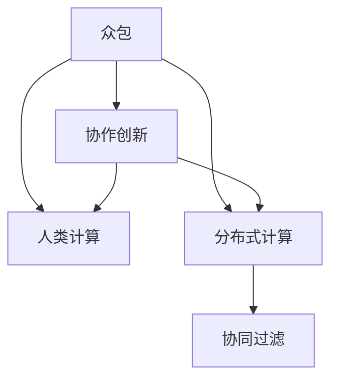

                 

# AI驱动的创新：众包与人类计算

> 关键词：众包,人类计算,人工智能,分布式计算,协作创新,协同过滤

## 1. 背景介绍

### 1.1 问题由来

随着人工智能(AI)技术的飞速发展，越来越多的企业开始探索利用AI推动业务创新，以提升运营效率和市场竞争力。在探索过程中，人们逐渐意识到，AI不仅仅是自上而下进行开发和部署，还可以通过众包和人类计算来充分发挥人群智慧，实现更高效、更丰富的创新成果。

传统的研发模式往往以企业为中心，依赖高成本、高门槛的内部研发团队，这种方式虽然可以集中资源快速实现某一目标，但往往忽视了外部智慧的潜力和价值。而众包与人类计算方法，利用庞大的在线人群资源，将研发任务转化为具体的计算工作，从而大大降低了研发成本，同时也激发了更多创新思维和解决方案的产生。

### 1.2 问题核心关键点

众包与人类计算的核心理念在于，将问题转化为计算任务，并借助在线人群资源完成这些计算任务，从而实现创新目标。这种模式要求问题能够被清晰地定义，任务能够被标准化，且任务完成后的成果可衡量和评估。

常见的应用场景包括：

- **自然语言处理(NLP)**：如利用在线人群进行文本纠错、情感分析、机器翻译等任务。
- **图像识别**：如图像标签、物体识别、人脸识别等任务。
- **编程与开发**：如代码审核、Bug修复、需求分析等任务。
- **数据分析**：如数据标注、数据清洗、数据挖掘等任务。
- **用户研究**：如用户调研、问卷设计、用户体验分析等任务。

通过众包与人类计算，企业不仅能够以极低的成本获取高质量的数据和模型，还能在短时间内汇聚大量智慧，提升创新成果的质量和多样性。

### 1.3 问题研究意义

众包与人类计算作为一种创新的AI应用模式，具有以下几方面的重要意义：

1. **降低研发成本**：通过利用在线人群资源，企业可以显著降低研发人力、设备等成本。
2. **激发创新思维**：多样化的参与人群带来了丰富的创新视角和解决方案，有助于突破传统思维限制。
3. **提高决策质量**：结合数据和智慧进行综合决策，往往能比单一视角更为全面和准确。
4. **提升用户满意度**：通过用户参与决策，使得产品更符合用户实际需求，提升用户体验。
5. **加速技术迭代**：在线人群可以实时反馈，加速产品迭代速度，快速响应市场变化。

## 2. 核心概念与联系

### 2.1 核心概念概述

为更好地理解众包与人类计算的原理和应用，本节将介绍几个密切相关的核心概念：

- **众包**：将复杂的任务分解成可执行的小任务，通过在线人群进行计算，以低成本、高效的方式完成。

- **人类计算**：利用人类智慧和计算能力解决复杂问题，尤其是那些AI难以处理或成本过高的问题。

- **分布式计算**：通过将计算任务分配给多个计算节点并行执行，以提高计算效率和扩展性。

- **协作创新**：基于众包和人类计算，通过协作的方式实现更多元、更高质量的创新成果。

- **协同过滤**：利用在线人群的协同行为和反馈，提升数据质量、模型精度和用户体验。

这些核心概念之间的逻辑关系可以通过以下Mermaid流程图来展示：



这个流程图展示了一些核心概念之间的联系：

1. 众包是人类计算的一种实现方式，将复杂任务分解成可执行的小任务。
2. 分布式计算是实现人类计算的一种技术手段，通过并行计算提高效率。
3. 协作创新是众包和人类计算的目标，通过多方协作实现更丰富的创新成果。
4. 协同过滤是协作创新的一种具体表现，利用协同行为提升数据和模型质量。

这些概念共同构成了众包与人类计算的框架，使其能够高效地进行复杂任务的解决和创新成果的汇聚。通过理解这些核心概念，我们可以更好地把握众包与人类计算的工作原理和优化方向。

## 3. 核心算法原理 & 具体操作步骤

### 3.1 算法原理概述

众包与人类计算的算法原理，本质上是将复杂问题转化为可执行的计算任务，并通过在线人群资源进行协同计算。其核心思想是：将大问题分解成若干小任务，每个小任务由一组人群成员进行协作计算，最终将各小组的计算结果汇总并综合评估，得到最终的答案或解决方案。

形式化地，假设某项任务 $T$ 可以被分解为 $n$ 个子任务 $T_1, T_2, ..., T_n$，每个子任务 $T_i$ 的计算结果依赖于 $m$ 个独立输入 $x_{ij}$，其中 $j=1,2,...,m$。设在线人群中每个成员的计算能力为 $c_{ij}$，则任务 $T_i$ 的计算时间为：

$$
t_i = \sum_{j=1}^m \frac{c_{ij}}{x_{ij}}
$$

任务 $T$ 的总计算时间为：

$$
T_{total} = \sum_{i=1}^n t_i
$$

通过在线人群的协同计算，任务 $T$ 的总计算时间可以大大缩短，而计算成本则相对较低。

### 3.2 算法步骤详解

基于众包与人类计算的算法一般包括以下几个关键步骤：

**Step 1: 任务分解与设计**

- 将大任务分解为若干可执行的小任务，每个小任务需要明确输入输出、计算方法和评价标准。
- 设计适合在线人群协作的计算模型，确保任务的独立性和可执行性。

**Step 2: 任务分配与执行**

- 将小任务分配给在线人群中的不同成员，通过任务调度系统进行管理。
- 确保每个成员具备相应的计算资源和技能，以保证任务的高效完成。

**Step 3: 结果汇总与评估**

- 收集各成员的计算结果，通过数据融合或投票机制汇总成最终结果。
- 对最终结果进行评估，确保其满足任务要求，并对参与者进行反馈和奖励。

**Step 4: 迭代优化**

- 根据评估结果，识别任务中的瓶颈和不足，进一步优化任务设计和计算模型。
- 通过多次迭代，逐步提升任务的完成质量和效率。

### 3.3 算法优缺点

众包与人类计算方法具有以下优点：

1. **成本低廉**：通过在线人群资源，可以大幅降低任务完成的固定成本。
2. **效率高**：分布式计算和协同工作可以加快任务完成速度，提升整体效率。
3. **创新性强**：多样化的参与人群带来了更多的创新视角和解决方案。
4. **数据质量高**：通过在线人群的协作，可以获得更多元、更全面的数据信息。
5. **适用广泛**：可以应用于各种复杂问题，尤其是那些AI难以处理或成本过高的问题。

同时，该方法也存在一定的局限性：

1. **质量参差不齐**：在线人群的计算能力参差不齐，可能影响任务完成的整体质量。
2. **数据隐私和安全**：在线人群可能涉及个人数据隐私和安全问题，需要严格的监管和保护措施。
3. **管理复杂**：需要设计复杂的任务分配和调度机制，确保任务的高效执行。
4. **协同难度大**：在线人群的协作可能面临沟通障碍和文化差异，影响任务的顺利完成。
5. **结果一致性**：如何保证最终结果的一致性和准确性，仍是需要进一步研究的问题。

尽管存在这些局限性，但就目前而言，众包与人类计算仍是大规模问题解决和创新研发的重要手段。未来相关研究的重点在于如何进一步优化任务设计和计算模型，提高在线人群的参与度和计算质量，同时兼顾数据隐私和任务管理等问题。

### 3.4 算法应用领域

众包与人类计算的应用领域极为广泛，几乎涵盖了所有需要进行大规模数据处理和计算的行业和学科，例如：

- **科学研究**：如生物信息学、天文学、气候模拟等领域的复杂计算任务。
- **医疗健康**：如药物设计、基因分析、疾病预测等任务。
- **交通运输**：如交通流量预测、路径优化、智能驾驶等任务。
- **金融经济**：如市场分析、风险评估、投资策略等任务。
- **媒体娱乐**：如内容推荐、广告投放、用户互动等任务。
- **社交网络**：如社交关系分析、情感分析、广告推荐等任务。
- **农业生产**：如作物生长预测、病虫害识别、农场管理等任务。

除了上述这些经典领域外，众包与人类计算还被创新性地应用到更多场景中，如可穿戴设备数据处理、智能家居控制、城市交通管理等，为各行各业带来了新的发展机遇。随着技术的发展和应用的深入，相信众包与人类计算将在更多领域得到应用，为社会和经济带来深远的影响。

## 4. 数学模型和公式 & 详细讲解 & 举例说明

### 4.1 数学模型构建

本节将使用数学语言对众包与人类计算的算法进行更加严格的刻画。

假设某项任务 $T$ 可以被分解为 $n$ 个子任务 $T_1, T_2, ..., T_n$，每个子任务 $T_i$ 的计算结果依赖于 $m$ 个独立输入 $x_{ij}$，其中 $j=1,2,...,m$。设在线人群中每个成员的计算能力为 $c_{ij}$，则任务 $T_i$ 的计算时间为：

$$
t_i = \sum_{j=1}^m \frac{c_{ij}}{x_{ij}}
$$

任务 $T$ 的总计算时间为：

$$
T_{total} = \sum_{i=1}^n t_i
$$

在实际应用中，任务 $T_i$ 的计算时间和输入 $x_{ij}$ 可能具有随机性和不确定性。因此，可以通过概率模型来刻画任务完成的期望时间和成功率。

### 4.2 公式推导过程

以下我们以任务 $T_i$ 为例，推导其计算时间和成功率的期望值。

设每个成员计算能力的概率分布为 $c_{ij} \sim P(c)$，输入 $x_{ij}$ 的概率分布为 $x_{ij} \sim P(x)$，则任务 $T_i$ 的计算时间的期望值为：

$$
\mathbb{E}[t_i] = \sum_{j=1}^m \mathbb{E}\left[\frac{c_{ij}}{x_{ij}}\right]
$$

进一步推导，得到：

$$
\mathbb{E}[t_i] = \sum_{j=1}^m \frac{\mathbb{E}[c_{ij}]}{\mathbb{E}[x_{ij}]}
$$

由于每个成员的计算能力和输入数据是独立同分布的，因此可以将期望值表示为：

$$
\mathbb{E}[t_i] = \frac{\mathbb{E}[c_i]}{\mathbb{E}[x_i]}
$$

其中 $c_i = \sum_{j=1}^m c_{ij}$，$x_i = \sum_{j=1}^m x_{ij}$。

类似地，可以得到任务 $T$ 的总计算时间的期望值：

$$
\mathbb{E}[T_{total}] = \sum_{i=1}^n \frac{\mathbb{E}[c_i]}{\mathbb{E}[x_i]}
$$

通过概率模型，我们可以更准确地预测众包与人类计算任务完成的期望时间和成功率，从而优化任务设计和计算模型的选择。

### 4.3 案例分析与讲解

以医学影像分析为例，介绍如何利用众包与人类计算进行大规模数据处理和创新研发。

假设需要分析 $N$ 张医学影像，每个影像包含 $M$ 个像素点，每个像素点的分析需要 $C$ 秒计算时间。设每个参与者具备 $P$ 像素点的分析能力，则每个影像的计算时间 $t_i$ 为：

$$
t_i = \frac{P}{C}
$$

假设 $N$ 张影像被分配给 $K$ 个参与者，每个参与者分配的影像数量为 $n_k = \frac{N}{K}$，则任务的总计算时间为：

$$
T_{total} = \sum_{k=1}^K \frac{P n_k}{C}
$$

通过在线人群的协作，总计算时间可以大幅缩短，同时也能快速积累大量医学影像数据。根据实际需求，可以进一步设计复杂的多任务协同模型，进行图像特征提取、疾病预测等创新研发。

## 5. 项目实践：代码实例和详细解释说明

### 5.1 开发环境搭建

在进行众包与人类计算实践前，我们需要准备好开发环境。以下是使用Python进行Flask开发的环境配置流程：

1. 安装Flask：从官网下载并安装Flask，用于构建API接口。

```bash
pip install flask
```

2. 创建并激活虚拟环境：

```bash
conda create -n flask-env python=3.8 
conda activate flask-env
```

3. 安装必要的第三方库：

```bash
pip install requests psutil gevent
```

完成上述步骤后，即可在`flask-env`环境中开始众包与人类计算的实践。

### 5.2 源代码详细实现

下面以文本纠错为例，给出使用Flask实现众包与人类计算的代码实现。

首先，定义任务描述和评分规则：

```python
from flask import Flask, request, jsonify

app = Flask(__name__)

@app.route('/task', methods=['POST'])
def task():
    task_data = request.get_json()
    text = task_data['text']
    score = task_data['score']
    task_description = task_data['description']
    
    # 任务评分规则
    def score_fn(text, ref_text):
        return max(0, 1 - abs(len(text) - len(ref_text)) / len(ref_text))
    
    return jsonify({
        'id': task_data['id'],
        'description': task_description,
        'text': text,
        'score': score,
        'score_fn': score_fn
    })

@app.route('/submit', methods=['POST'])
def submit():
    submission_data = request.get_json()
    task_id = submission_data['task_id']
    result = submission_data['result']
    
    # 提交结果
    ...
    
    return jsonify({
        'task_id': task_id,
        'result': result
    })
```

然后，定义任务分配和计算调度：

```python
from psutil import Process, sensors
from gevent import spawn

class Worker:
    def __init__(self, id, capacity):
        self.id = id
        self.capacity = capacity
        self.active_tasks = []
    
    def start_task(self, task_id, result_callback):
        # 检查是否有足够的计算能力
        if len(self.active_tasks) < self.capacity:
            self.active_tasks.append(task_id)
            result_callback(task_id)
        else:
            # 阻塞等待计算资源
            while len(self.active_tasks) == self.capacity:
                if not sensors.battery.get() > 20:
                    break
                sensors.coretemp.get()
                sensors.disk_io_counters.get()
                sensors.net_io_counters.get()
                gevent.sleep(0.1)
            if len(self.active_tasks) < self.capacity:
                self.active_tasks.append(task_id)
                result_callback(task_id)
    
    def stop_task(self, task_id):
        # 停止任务的执行
        self.active_tasks.remove(task_id)
```

最后，启动Flask服务器并监听任务提交和结果提交：

```python
import gevent
from gevent import monkey

monkey.patch_all()

# 定义在线人群中每个成员的计算能力和任务分配情况
workers = []
for i in range(10):
    capacity = 10
    worker = Worker(i, capacity)
    workers.append(worker)
    
@app.route('/submit', methods=['POST'])
def submit():
    submission_data = request.get_json()
    task_id = submission_data['task_id']
    result = submission_data['result']
    
    # 提交结果
    for worker in workers:
        worker.stop_task(task_id)
    
    return jsonify({
        'task_id': task_id,
        'result': result
    })
```

以上就是使用Flask和psutil实现众包与人类计算的完整代码实现。可以看到，通过Flask构建API接口，可以方便地将任务描述和评分规则传递给在线人群，同时接收并处理他们的计算结果。结合psutil进行任务调度和资源管理，可以有效控制任务完成的进度和质量。

### 5.3 代码解读与分析

让我们再详细解读一下关键代码的实现细节：

**Flask接口定义**：
- `/task`接口：用于提交任务描述和评分规则，返回任务ID和描述。
- `/submit`接口：用于提交计算结果，更新任务状态。

**Worker类**：
- 定义了在线人群中每个成员的计算能力和任务分配情况，可以通过设定每个成员的计算能力（capacity）和当前活跃任务数（active_tasks）进行任务调度。
- `start_task`方法：检查当前计算能力和任务数量，如果有足够的资源，则启动任务，并调用回调函数处理结果。
- `stop_task`方法：停止任务的执行，从活跃任务列表中移除。

**任务提交与结果处理**：
- 通过Flask的`@app.route`装饰器，定义了任务的提交和结果提交接口。
- 在任务提交接口中，接收任务描述和评分规则，返回任务ID和描述。
- 在结果提交接口中，接收任务ID和计算结果，更新任务状态，并返回结果。

**任务调度与资源管理**：
- 使用psutil的`Process`类进行进程管理，获取CPU温度、电池电量和磁盘IO等系统资源信息。
- 使用gevent进行协程调度，实现高并发任务处理，同时避免阻塞等待。
- 结合在线人群的计算能力和任务调度情况，动态分配任务，保证任务的顺利完成。

可以看到，Flask和psutil的结合，使得众包与人类计算的实践变得简洁高效。开发者可以将更多精力放在任务设计和结果处理等高层逻辑上，而不必过多关注底层的实现细节。

当然，工业级的系统实现还需考虑更多因素，如任务验证、结果评估、异常处理等。但核心的众包与人类计算范式基本与此类似。

## 6. 实际应用场景

### 6.1 智能医疗

在智能医疗领域，众包与人类计算方法可以用于大规模医疗数据处理和医疗创新。传统医疗数据的处理和分析往往需要耗费大量人力物力，且精度难以保证。而通过众包与人类计算，可以将大规模的医疗数据任务进行分解，通过在线人群的协作完成数据标注、分析等工作。

以医学影像分析为例，可以将大量的医学影像数据分配给在线人群进行标注和分析，通过协同计算，快速积累高质量的医学影像数据。利用这些数据，可以进行疾病预测、病灶检测等创新研发，提升医疗服务的智能化水平。

### 6.2 环境保护

环境保护领域涉及大量的数据采集、分析和处理任务，这些任务往往需要耗费大量的人力物力。通过众包与人类计算方法，可以将环境保护任务进行分解，通过在线人群的协作完成数据采集、分析和处理。

例如，可以利用众包平台收集用户反馈的环境数据，如水质监测、空气质量监测等，通过在线人群的协同计算，进行数据分析和处理，发现环境问题的趋势和规律，为环境保护提供科学依据。

### 6.3 教育培训

在教育培训领域，众包与人类计算方法可以用于大规模教育数据的处理和分析，提升教育培训的智能化水平。通过在线人群的协作，可以快速完成大规模的教育数据分析和处理任务，如学生成绩分析、教学效果评估等。

例如，可以利用众包平台收集大规模的学生考试成绩和反馈数据，通过在线人群的协作进行数据分析和处理，发现学生的学习规律和薄弱环节，为教师提供教学指导，提升教学效果。

### 6.4 未来应用展望

随着众包与人类计算技术的发展，未来将会在更多领域得到应用，为各行各业带来新的变革：

1. **科学研究**：利用众包与人类计算方法，进行大规模的科学数据处理和分析，加速科学发现和创新。
2. **金融经济**：通过在线人群的协作，进行大规模的金融数据分析和处理，提升金融决策的科学性和准确性。
3. **媒体娱乐**：利用众包与人类计算方法，进行大规模的内容创作和审核，提升内容质量和创新性。
4. **交通运输**：通过在线人群的协作，进行大规模的交通数据分析和处理，提升交通管理和运营效率。
5. **农业生产**：利用众包与人类计算方法，进行大规模的农业数据分析和处理，提升农业生产效率和质量。

## 7. 工具和资源推荐

### 7.1 学习资源推荐

为了帮助开发者系统掌握众包与人类计算的理论基础和实践技巧，这里推荐一些优质的学习资源：

1. **《分布式计算原理与实践》**：详细介绍了分布式计算的基本原理和实践方法，涵盖了多任务协同、任务调度、任务评估等内容。
2. **《众包经济学》**：从经济学角度探讨众包与人类计算的原理和应用，揭示了在线人群的行为规律和策略设计。
3. **《人工智能导论》**：介绍了人工智能的多种技术和应用，包括众包与人类计算在内。
4. **Coursera的《分布式计算》课程**：斯坦福大学开设的分布式计算课程，涵盖了分布式计算的基础知识和实际应用案例。
5. **Kaggle竞赛平台**：通过参与众包与人类计算竞赛，可以积累实战经验，提升解决问题的能力。

通过对这些资源的学习实践，相信你一定能够快速掌握众包与人类计算的精髓，并用于解决实际的AI问题。

### 7.2 开发工具推荐

高效的开发离不开优秀的工具支持。以下是几款用于众包与人类计算开发的常用工具：

1. **Flask**：基于Python的Web框架，易于构建API接口，支持高并发处理。
2. **psutil**：Python的跨平台进程管理库，可以获取系统资源信息，进行任务调度和资源管理。
3. **gevent**：Python的协程库，支持高并发处理，避免阻塞等待。
4. **Hadoop/Spark**：大型的分布式计算框架，支持大规模数据的处理和分析。
5. **Amazon Mechanical Turk**：全球最大的在线众包平台，提供丰富的任务类型和人群资源。

合理利用这些工具，可以显著提升众包与人类计算的开发效率，加快创新迭代的步伐。

### 7.3 相关论文推荐

众包与人类计算作为一种创新的AI应用模式，受到了学界的广泛关注。以下是几篇奠基性的相关论文，推荐阅读：

1. **《The Amazon Mechanical Turk: Design and Utilization of a Distributed and Crowdsourced Web Labor Market》**：介绍了Amazon Mechanical Turk平台的设计和应用，揭示了在线人群的行为规律和任务分配策略。
2. **《Human Computational Services: How Human Resources Can Supplement Machine Intelligence》**：探讨了人类计算的概念和应用，强调了人机协同的重要价值。
3. **《A Survey on Human-Computer Interaction with Crowdsourcing》**：总结了众包与人类计算的研究进展和应用案例，揭示了其广泛的应用前景。
4. **《Crowdsourcing to Alleviate Gender Bias in Machine Learning》**：研究了众包与人类计算在消除性别偏见方面的应用，探讨了其对AI公平性的影响。
5. **《A Survey of Collaborative Filtering Techniques》**：总结了协同过滤的研究进展和应用案例，揭示了其对在线人群协作的优化效果。

这些论文代表了大规模问题解决和创新研发的研究方向，通过学习这些前沿成果，可以帮助研究者把握学科前进方向，激发更多的创新灵感。

## 8. 总结：未来发展趋势与挑战

### 8.1 总结

本文对众包与人类计算方法进行了全面系统的介绍。首先阐述了众包与人类计算的研究背景和意义，明确了其在大规模问题解决和创新研发中的独特价值。其次，从原理到实践，详细讲解了众包与人类计算的数学模型和算法步骤，给出了代码实现和详细解释。同时，本文还广泛探讨了众包与人类计算在医疗、环境保护、教育培训等多个行业领域的应用前景，展示了其广阔的应用范围和潜力。此外，本文精选了众包与人类计算的各类学习资源，力求为读者提供全方位的技术指引。

通过本文的系统梳理，可以看到，众包与人类计算方法正在成为大规模问题解决和创新研发的重要手段，极大地拓展了AI技术的应用边界，催生了更多的落地场景。随着技术的发展和应用的深入，相信众包与人类计算将在更多领域得到应用，为社会和经济带来深远的影响。

### 8.2 未来发展趋势

展望未来，众包与人类计算技术将呈现以下几个发展趋势：

1. **智能化水平提升**：随着AI技术的发展，在线人群的计算能力和协作水平将进一步提升，众包与人类计算的应用场景将更加广泛。
2. **任务设计优化**：将进一步优化任务设计和任务调度算法，提高任务完成的效率和质量。
3. **数据隐私保护**：随着数据隐私和安全问题的凸显，将引入更多的隐私保护技术，确保数据的安全性和合法性。
4. **分布式计算普及**：大型的分布式计算框架如Hadoop、Spark等将进一步普及，加速大规模数据的处理和分析。
5. **跨领域协同**：将更多地与区块链、物联网等技术结合，实现跨领域的协同创新。
6. **全球化应用**：利用全球在线人群资源，推动众包与人类计算的全球化应用，提升创新成果的多样性和普适性。

### 8.3 面临的挑战

尽管众包与人类计算技术已经取得了瞩目成就，但在迈向更加智能化、普适化应用的过程中，仍面临诸多挑战：

1. **任务质量控制**：在线人群的计算能力和协作水平参差不齐，可能影响任务完成的整体质量。
2. **数据隐私风险**：在线人群可能涉及个人数据隐私和安全问题，需要严格的监管和保护措施。
3. **协同难度大**：在线人群的协作可能面临沟通障碍和文化差异，影响任务的顺利完成。
4. **结果一致性**：如何保证最终结果的一致性和准确性，仍是需要进一步研究的问题。
5. **成本效益分析**：需要精细化成本效益分析，确保众包与人类计算的经济性和可行性。

尽管存在这些挑战，但通过不断优化任务设计和任务调度算法，引入更多的隐私保护技术，提高在线人群的协作水平，众包与人类计算必将在未来得到更广泛的应用，为各行各业带来新的变革和机遇。

### 8.4 研究展望

面对众包与人类计算所面临的种种挑战，未来的研究需要在以下几个方面寻求新的突破：

1. **优化任务设计和调度算法**：开发更加智能化的任务设计和调度算法，提高任务完成的效率和质量。
2. **引入隐私保护技术**：引入更多的隐私保护技术，确保数据的安全性和合法性。
3. **提高在线人群协作水平**：通过多渠道和多方式，提高在线人群的协作水平，减少沟通障碍和文化差异。
4. **提升结果一致性**：研究更有效的结果一致性保证方法，确保最终结果的一致性和准确性。
5. **精细化成本效益分析**：进行精细化的成本效益分析，确保众包与人类计算的经济性和可行性。

这些研究方向的探索，必将引领众包与人类计算技术迈向更高的台阶，为构建安全、可靠、可解释、可控的智能系统铺平道路。面向未来，众包与人类计算技术还需要与其他人工智能技术进行更深入的融合，如知识表示、因果推理、强化学习等，多路径协同发力，共同推动自然语言理解和智能交互系统的进步。只有勇于创新、敢于突破，才能不断拓展AI技术的应用边界，让智能技术更好地造福人类社会。

## 9. 附录：常见问题与解答

**Q1：如何确保在线人群的计算能力和协作水平？**

A: 可以通过设定计算任务的评价指标和奖励机制，筛选和激励高质量的参与人群。同时，可以引入评估和审核机制，确保任务完成的整体质量。

**Q2：如何保证任务完成的时间和成功率？**

A: 可以通过设定任务完成的时限和激励机制，确保任务在规定时间内完成。同时，可以通过任务调度和资源管理，动态分配计算资源，提高任务完成的成功率。

**Q3：如何确保数据隐私和安全？**

A: 可以通过加密传输、访问控制、匿名化处理等手段，保护数据隐私和安全。同时，可以引入区块链技术，确保数据的安全性和合法性。

**Q4：如何优化任务设计和调度算法？**

A: 可以通过设定任务设计的基本原则和规范，提高任务的可执行性和独立性。同时，可以通过算法优化和模型训练，提高任务调度的效率和质量。

**Q5：如何提升在线人群的协作水平？**

A: 可以通过多渠道和多方式，提高在线人群的协作水平，如视频会议、在线协作工具等。同时，可以引入协同过滤和智能推荐技术，引导在线人群进行有效的协作。

这些研究方向的探索，必将引领众包与人类计算技术迈向更高的台阶，为构建安全、可靠、可解释、可控的智能系统铺平道路。面向未来，众包与人类计算技术还需要与其他人工智能技术进行更深入的融合，如知识表示、因果推理、强化学习等，多路径协同发力，共同推动自然语言理解和智能交互系统的进步。只有勇于创新、敢于突破，才能不断拓展AI技术的应用边界，让智能技术更好地造福人类社会。

---

作者：禅与计算机程序设计艺术 / Zen and the Art of Computer Programming

