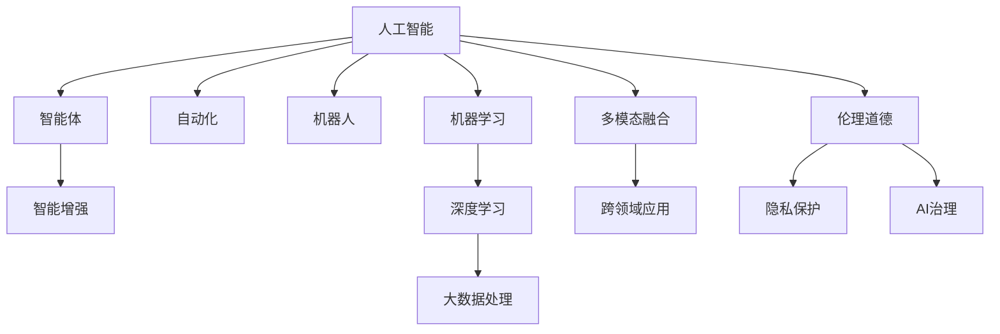

                 

# 人工智能：社会影响与思考

> 关键词：人工智能, 社会影响, 伦理道德, 技术创新, 隐私保护, 人工智能治理

## 1. 背景介绍

人工智能(Artificial Intelligence, AI)作为当今最为活跃的技术领域之一，正以前所未有的速度和规模影响着人类的生产生活方式。从智能家居、智能医疗到智能交通、智能制造，AI技术的应用范围几乎无所不包。然而，正如任何一把双刃剑，AI在带来便捷、提升效率的同时，也引发了诸多社会问题，如就业失业、隐私侵犯、伦理道德冲突等。如何正确认识AI的社会影响，构建合理的人工智能治理框架，成为亟待探讨的重要议题。本文将系统梳理AI的社会影响和相关治理问题，探讨未来AI技术发展的路径。

## 2. 核心概念与联系

### 2.1 核心概念概述

为更好地理解AI的社会影响，本节将介绍几个关键概念：

- 人工智能(AI)：通过计算机算法、数据和计算资源实现模拟人类智能行为的技术，涵盖感知、推理、学习、规划等多个方面。
- 智能体(Agent)：能够感知环境、采取行动，并能基于反馈进行学习、优化的系统实体。
- 智能增强(Intelligence Augmentation)：利用AI技术增强人类的感知、决策能力，提升工作效率和生活质量。
- 自动化(Automation)：AI技术在特定任务上的自动化应用，替代人力完成重复性工作，释放人的创造力和潜力。
- 机器人(Robot)：具备自主感知、行动能力的智能体，可以执行复杂任务，参与人机协作。
- 机器学习(Machine Learning)：AI的核心技术之一，通过学习数据中的规律，提高算法决策能力。
- 深度学习(Deep Learning)：基于神经网络结构的机器学习技术，擅长处理复杂模式识别和大规模数据处理。

这些核心概念构成了AI技术的基石，反映了AI在各个领域的广泛应用和其带来的深远影响。

### 2.2 核心概念原理和架构的 Mermaid 流程图



这个流程图展示了人工智能的多个核心概念及其相互关系：

1. 人工智能作为核心技术，涵盖了多个子领域，如智能体、自动化、机器人等。
2. 智能增强和自动化展示了AI技术如何提升人类能力。
3. 深度学习和机器学习是实现AI决策的核心算法。
4. 大数据处理和多模态融合展示了AI技术在处理复杂任务中的优势。
5. 伦理道德和隐私保护是AI应用必须考量的重要社会维度。
6. AI治理是确保AI技术安全、合规、公正使用的关键框架。

这些概念共同构成了AI的社会影响框架，帮助我们深入理解AI的广泛应用和潜在问题。

## 3. 核心算法原理 & 具体操作步骤

### 3.1 算法原理概述

AI技术的基础是机器学习和深度学习。机器学习通过算法和数据训练模型，自动从数据中学习规律，实现预测、分类、聚类等功能。深度学习则是通过多层次神经网络结构，模仿人脑处理复杂模式的能力，适用于图像识别、语音识别、自然语言处理等高维度数据处理任务。

AI算法的核心在于其学习能力，即能够从数据中自动学习到有效的特征表示，并应用这些表示进行决策。然而，这种学习能力同时也带来了诸多社会问题，如数据偏见、算法黑盒、对抗攻击等。解决这些问题需要从算法设计、数据治理、社会伦理等多个维度进行综合考虑。

### 3.2 算法步骤详解

AI算法的主要操作步骤包括以下几个方面：

**Step 1: 数据准备**
- 收集数据：获取与任务相关的数据集，确保数据的多样性和代表性。
- 数据预处理：对数据进行清洗、归一化、标注等处理，以便模型训练。

**Step 2: 模型训练**
- 模型选择：根据任务特点选择合适的模型结构，如CNN、RNN、GAN等。
- 训练算法：选择合适的优化器，如SGD、Adam等，设置学习率、批大小等超参数。
- 训练过程：通过前向传播和反向传播，更新模型参数，最小化损失函数。

**Step 3: 模型评估与优化**
- 评估指标：定义合适的评估指标，如准确率、召回率、F1值等，评估模型性能。
- 模型调优：根据评估结果调整模型超参数，进行模型集成、特征选择等优化。

**Step 4: 模型应用**
- 模型部署：将训练好的模型部署到生产环境中，进行实时推理或批量处理。
- 性能监控：监控模型输出，及时发现和修复问题，优化模型性能。

### 3.3 算法优缺点

AI算法在解决复杂问题、提升效率等方面具有显著优势，但也存在以下局限性：

**优点：**
1. 高效自动化：AI算法能够高效自动完成大量重复性工作，提高工作效率。
2. 精准预测：基于大数据的深度学习算法，能够在高维度数据中学习到精准的规律。
3. 快速迭代：通过模型训练和优化，AI算法能够快速适应新任务，提升决策能力。

**缺点：**
1. 数据依赖：AI算法依赖于高质量的数据，数据偏见和噪声可能影响模型性能。
2. 算法黑盒：深度学习等复杂模型难以解释其内部决策过程，存在一定的不可解释性。
3. 对抗攻击：AI模型容易受到对抗样本的攻击，导致输出错误。
4. 计算资源消耗大：训练和推理大型AI模型需要大量计算资源，存在成本和效率问题。
5. 伦理道德风险：AI算法可能被用于不道德的用途，如隐私侵犯、假新闻等。

### 3.4 算法应用领域

AI算法广泛应用于多个领域，包括但不限于：

- **智能医疗**：利用AI算法辅助诊断疾病、制定治疗方案、预测疾病风险等。
- **智能制造**：通过AI技术优化生产流程、提高生产效率、减少资源浪费。
- **智能交通**：利用AI算法进行交通流量预测、自动驾驶、智能调度等。
- **智能安防**：利用AI技术进行面部识别、行为分析、异常检测等。
- **智能金融**：利用AI算法进行风险评估、欺诈检测、投资分析等。
- **智能客服**：利用AI技术提供24小时不间断客服服务，提升客户满意度。

## 4. 数学模型和公式 & 详细讲解 & 举例说明

### 4.1 数学模型构建

AI算法的数学模型主要基于统计学习理论和机器学习理论。以下以线性回归为例，介绍基本的数学模型构建过程。

假设样本集为 $\{(x_i,y_i)\}_{i=1}^N$，其中 $x_i$ 为特征向量，$y_i$ 为真实标签。线性回归的目标是找到一个线性函数 $y=\theta^Tx$，使得模型输出尽可能接近真实标签。

模型参数 $\theta$ 的求解可以通过最小二乘法实现，即最小化误差平方和：

$$
\min_{\theta} \sum_{i=1}^N (y_i - \theta^Tx_i)^2
$$

通过求偏导数，可得最优解：

$$
\theta = (\sum_{i=1}^N x_ix_i^T)^{-1}\sum_{i=1}^N x_iy_i
$$

### 4.2 公式推导过程

线性回归的推导过程如下：

1. 构建目标函数：根据误差平方和定义损失函数。
2. 求解导数：对目标函数求偏导数，得到参数更新公式。
3. 迭代求解：通过前向传播和反向传播，更新模型参数，实现模型训练。

### 4.3 案例分析与讲解

以线性回归为例，其应用场景包括房价预测、股票价格预测等。假设我们有一组房屋特征和价格数据，通过线性回归模型，可以建立特征与价格之间的映射关系，从而预测新房屋的价格。

在实际应用中，线性回归模型常常需要结合其他算法进行组合优化，如决策树、支持向量机等。通过模型集成，可以实现更精准的预测效果。

## 5. 项目实践：代码实例和详细解释说明

### 5.1 开发环境搭建

在进行AI项目开发前，需要准备开发环境。以下是使用Python进行TensorFlow开发的环境配置流程：

1. 安装Anaconda：从官网下载并安装Anaconda，用于创建独立的Python环境。

2. 创建并激活虚拟环境：
```bash
conda create -n tensorflow-env python=3.8 
conda activate tensorflow-env
```

3. 安装TensorFlow：根据CUDA版本，从官网获取对应的安装命令。例如：
```bash
conda install tensorflow -c conda-forge -c pytorch -c intel tensorflow-gpu=2.3
```

4. 安装各类工具包：
```bash
pip install numpy pandas scikit-learn matplotlib tqdm jupyter notebook ipython
```

完成上述步骤后，即可在`tensorflow-env`环境中开始AI项目开发。

### 5.2 源代码详细实现

下面以线性回归为例，给出使用TensorFlow进行模型训练的PyTorch代码实现。

首先，定义线性回归模型：

```python
import tensorflow as tf

class LinearRegression(tf.keras.Model):
    def __init__(self, input_dim):
        super(LinearRegression, self).__init__()
        self.linear = tf.keras.layers.Dense(1, input_dim)

    def call(self, x):
        return self.linear(x)
```

然后，定义损失函数和优化器：

```python
def mean_squared_error(y_true, y_pred):
    return tf.reduce_mean(tf.square(y_true - y_pred))

model = LinearRegression(input_dim=4)
optimizer = tf.keras.optimizers.SGD(learning_rate=0.01)
```

接着，定义训练函数：

```python
def train_epoch(model, dataset, batch_size, optimizer):
    for batch in dataset:
        x, y = batch
        with tf.GradientTape() as tape:
            y_pred = model(x)
            loss = mean_squared_error(y, y_pred)
        gradients = tape.gradient(loss, model.trainable_variables)
        optimizer.apply_gradients(zip(gradients, model.trainable_variables))
```

最后，启动训练流程：

```python
epochs = 100
batch_size = 32

for epoch in range(epochs):
    for batch in train_dataset:
        x, y = batch
        train_epoch(model, x, y, optimizer)
```

以上代码实现了使用TensorFlow进行线性回归模型的训练过程。可以看到，TensorFlow提供了便捷的API，使得模型训练变得简单高效。

### 5.3 代码解读与分析

让我们再详细解读一下关键代码的实现细节：

**LinearRegression类**：
- `__init__`方法：定义模型的线性层。
- `call`方法：实现模型的前向传播。

**mean_squared_error函数**：
- 计算预测值与真实值之间的均方误差。

**train_epoch函数**：
- 定义前向传播和反向传播过程，计算损失函数和参数梯度。
- 通过optimizer应用梯度更新模型参数。

**训练流程**：
- 循环训练多轮，每次遍历训练集进行一次epoch训练。
- 在每次epoch中，逐批次读取训练集，进行模型训练和参数更新。

可以看到，TensorFlow使得线性回归模型的训练过程变得简洁高效。开发者可以将更多精力放在模型设计和应用场景上，而不必过多关注底层的实现细节。

当然，工业级的系统实现还需考虑更多因素，如模型的保存和部署、超参数的自动搜索、更灵活的模型结构等。但核心的模型训练过程基本与此类似。

## 6. 实际应用场景

### 6.1 智能医疗

AI在智能医疗领域具有广泛的应用前景。通过AI算法，可以实现疾病诊断、手术辅助、药物研发等多个环节的自动化和智能化。例如，利用深度学习算法对医学影像进行分析，实现对肿瘤、脑部疾病等重大疾病的精准诊断。

AI还可以通过自然语言处理技术，辅助医生撰写病历、总结患者信息，提高医疗服务效率。AI技术在药物研发领域也展现出巨大的潜力，利用机器学习算法进行药物筛选和设计，大幅缩短药物研发周期。

### 6.2 智能制造

AI在智能制造中的应用，主要集中在生产流程优化、设备状态监控、预测性维护等方面。通过AI算法，可以实现对生产线的实时监控和预测，优化生产流程，减少资源浪费。AI还可以对设备状态进行实时监控，预测设备故障，实现预测性维护，降低设备停机时间，提高生产效率。

此外，AI技术还可以在供应链管理、质量控制等方面发挥作用，提升企业的整体运营效率。

### 6.3 智能交通

AI在智能交通领域的应用，主要集中在交通流量预测、自动驾驶、智能调度等方面。通过AI算法，可以实现对交通流量的实时预测，优化交通信号灯控制，减少交通拥堵。AI还可以用于自动驾驶，实现对道路环境的实时感知和决策，提升交通安全性和效率。

AI还可以用于交通管理系统的智能调度，优化车辆通行路线，提高交通系统的整体效率。

### 6.4 未来应用展望

随着AI技术的不断发展，未来AI将进一步拓展到更多领域，带来更广泛的社会影响：

1. **智慧城市**：AI技术将在城市治理、公共安全、环境监测等方面发挥重要作用，提升城市管理的智能化水平。
2. **教育**：AI技术将用于智能教育、个性化学习、虚拟教师等领域，提升教育质量和学习效率。
3. **金融**：AI技术将用于金融风险评估、智能投顾、反欺诈检测等领域，提升金融服务的效率和安全性。
4. **农业**：AI技术将用于农业智能化、精准农业、智能农机等领域，提升农业生产效率和质量。

未来，随着AI技术的不断进步和应用场景的不断拓展，AI将在更多领域发挥关键作用，带来更深远的社会影响。

## 7. 工具和资源推荐

### 7.1 学习资源推荐

为了帮助开发者系统掌握AI技术，这里推荐一些优质的学习资源：

1. **《深度学习》系列书籍**：由Ian Goodfellow等人编写，深入浅出地介绍了深度学习的理论基础和应用方法。
2. **CS231n《深度学习计算机视觉》课程**：斯坦福大学开设的深度学习课程，涵盖计算机视觉领域的核心算法和应用。
3. **Kaggle**：数据科学竞赛平台，提供丰富的数据集和挑战，帮助开发者练习AI项目开发。
4. **ArXiv**：科学论文数据库，提供最新的AI研究成果和论文，帮助开发者跟踪前沿动态。

通过对这些资源的学习实践，相信你一定能够快速掌握AI技术的精髓，并用于解决实际的AI问题。

### 7.2 开发工具推荐

高效的开发离不开优秀的工具支持。以下是几款用于AI项目开发的常用工具：

1. **TensorFlow**：由Google主导开发的深度学习框架，功能强大，易于使用。
2. **PyTorch**：Facebook开源的深度学习框架，灵活高效，支持动态图计算。
3. **Jupyter Notebook**：交互式开发环境，支持Python、R等语言，方便实验和分享代码。
4. **GitHub**：代码托管平台，支持版本控制和协作开发，方便代码管理和分享。
5. **HuggingFace Transformers**：自然语言处理工具库，集成了众多预训练语言模型，支持微调、推理等操作。

合理利用这些工具，可以显著提升AI项目开发的效率，加快创新迭代的步伐。

### 7.3 相关论文推荐

AI技术的快速发展得益于学界的持续研究。以下是几篇奠基性的相关论文，推荐阅读：

1. **《神经网络与深度学习》书籍**：Michael Nielsen等人编写，全面介绍了神经网络的基础理论和应用方法。
2. **《强化学习：从理论到算法》书籍**：Richard S. Sutton和Andrew G. Barto编写，介绍了强化学习的核心算法和应用。
3. **《机器学习实战》书籍**：Peter Harrington编写，提供了丰富的机器学习应用案例和代码实现。
4. **《TensorFlow实战》书籍**：Cahit Ture和Michael top编写，介绍了TensorFlow的核心功能和应用实践。

这些论文代表了大数据、机器学习、深度学习等AI技术的最新进展。通过学习这些前沿成果，可以帮助研究者把握学科前进方向，激发更多的创新灵感。

## 8. 总结：未来发展趋势与挑战

### 8.1 研究成果总结

本文对AI的社会影响和相关治理问题进行了系统梳理。首先，介绍了AI技术在多个领域的应用和其带来的深远影响。其次，分析了AI算法在数据依赖、算法黑盒、对抗攻击等方面的局限性。最后，探讨了未来AI技术的发展趋势和面临的挑战。

通过本文的探讨，读者可以更好地理解AI技术的社会影响和相关问题，为AI技术的应用和发展提供参考。

### 8.2 未来发展趋势

AI技术的未来发展将呈现以下几个趋势：

1. **智能化提升**：AI技术将在更多领域实现智能化应用，提升生产效率和服务质量。
2. **跨领域融合**：AI技术将与其他领域的技术进行深度融合，形成更加全面的智能化解决方案。
3. **伦理道德规范**：随着AI技术的广泛应用，伦理道德问题将受到更多关注，形成更为严格的人工智能治理框架。
4. **隐私保护加强**：AI技术的应用将受到更严格的隐私保护要求，数据隐私和安全将成为重要课题。
5. **可持续发展**：AI技术的发展将更加注重环保和可持续性，实现与自然和谐共生。

这些趋势凸显了AI技术的广阔前景和深远影响，预示着AI技术将不断拓展其应用边界，推动社会的全面进步。

### 8.3 面临的挑战

尽管AI技术发展迅速，但在走向大规模应用的过程中，仍然面临诸多挑战：

1. **数据隐私和安全**：AI技术对数据的依赖使得数据隐私和安全问题日益突出。如何保障数据安全，防止数据滥用和隐私泄露，将是重要课题。
2. **伦理道德困境**：AI技术的应用可能引发伦理道德冲突，如自动驾驶中的责任归属、AI招聘中的算法偏见等。如何制定伦理道德规范，防止技术滥用，将是重要挑战。
3. **技术标准化**：AI技术的应用需要统一的标准和规范，避免技术之间的兼容性问题。如何制定统一的AI技术标准，将是重要课题。
4. **人机协作难题**：AI技术虽然能够提升工作效率，但过度依赖AI可能导致人类技能退化，如何实现人机协作，提升人类能力，将是重要课题。
5. **技术迭代速度**：AI技术的快速迭代可能导致技术体系的不稳定性，如何实现技术的稳定发展和应用，将是重要课题。

这些挑战凸显了AI技术的复杂性和多维度性，预示着未来AI技术需要从技术、伦理、社会等多个维度进行综合考虑。

### 8.4 研究展望

面对AI技术面临的诸多挑战，未来的研究需要在以下几个方面寻求新的突破：

1. **伦理道德框架**：制定和完善AI技术的伦理道德规范，确保技术应用符合人类价值观和伦理道德。
2. **隐私保护技术**：研发更先进的隐私保护技术，保障数据隐私和安全。
3. **技术标准化**：制定统一的AI技术标准，促进技术互操作性。
4. **人机协作机制**：研究人机协作机制，提升人类技能和能力，实现人机协同。
5. **技术体系稳定**：构建稳定的AI技术体系，保障技术稳定发展和应用。

这些研究方向的研究突破，将有助于解决AI技术面临的诸多挑战，推动AI技术的可持续发展。

## 9. 附录：常见问题与解答

**Q1: AI技术会取代人类吗？**

A: AI技术在自动化、智能化方面的应用已经展示出了强大的能力，但目前AI技术还难以完全取代人类。AI技术更多是作为人类能力的增强工具，提升人类生产和生活效率。AI技术在处理复杂任务、创新突破等方面仍存在局限性，无法替代人类的创造性和情感。

**Q2: AI技术有哪些伦理道德风险？**

A: AI技术在应用过程中可能引发诸多伦理道德风险，如数据偏见、算法黑盒、隐私侵犯等。数据偏见可能导致算法歧视，算法黑盒可能引发不透明的决策过程，隐私侵犯可能侵害用户权益。解决这些问题需要从数据治理、算法透明、隐私保护等多个维度进行综合考虑。

**Q3: AI技术的未来发展趋势是什么？**

A: AI技术的未来发展将呈现智能化提升、跨领域融合、伦理道德规范、隐私保护加强和可持续发展等多个趋势。这些趋势预示着AI技术将在更多领域实现应用，带来深远的社会影响。

**Q4: 如何确保AI技术的可持续发展？**

A: 确保AI技术的可持续发展需要从技术、伦理、社会等多个维度进行综合考虑。制定伦理道德规范，保障数据隐私和安全，构建稳定的技术体系，研究人机协作机制，都是确保AI技术可持续发展的重要措施。

**Q5: 如何平衡AI技术与人类发展的关系？**

A: 平衡AI技术与人类发展的关系需要从多个方面进行考虑。首先，明确AI技术的应用场景，避免过度依赖AI技术。其次，制定伦理道德规范，确保AI技术的应用符合人类价值观和伦理道德。最后，通过AI技术的智能化提升，提升人类生产和生活效率，实现人机协同发展。

通过本文的系统梳理，可以看到，AI技术正在快速改变人类的生产生活方式，带来深远的社会影响。如何正确认识AI技术的社会影响，构建合理的人工智能治理框架，将是未来AI技术应用和发展的重要课题。

---

作者：禅与计算机程序设计艺术 / Zen and the Art of Computer Programming

