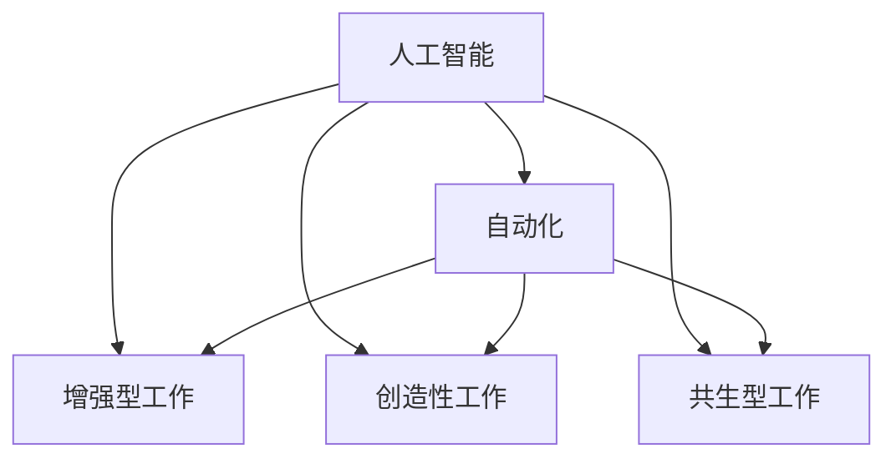

                 

# 人机协同：未来工作的核心驱动力

> 关键词：人工智能，人机协同，自动化，工作效率，创造力，未来工作，技术发展，应用前景

## 1. 背景介绍

在过去的几十年中，人工智能（AI）技术取得了翻天覆地的进步，从早期的专家系统到当前的深度学习模型，AI已经深刻改变了人类的工作方式。然而，随着技术的不断发展，一个全新的概念——人机协同（Human-AI Collaboration）开始引起广泛关注，它将AI与人类智慧结合，旨在最大化双方的优势，从而提升工作效率和创造力。本文将详细探讨人机协同的概念、原理和应用，并展望其未来发展趋势。

## 2. 核心概念与联系

### 2.1 核心概念概述

为更好地理解人机协同的概念及其应用，本节将介绍几个核心概念：

- 人工智能（Artificial Intelligence, AI）：一种通过计算机系统模拟人类智能的技术，包括感知、理解、学习、推理、规划和执行等能力。
- 人机协同（Human-AI Collaboration）：将人工智能技术与人类智慧结合，通过协作方式完成复杂任务的策略。
- 自动化（Automation）：通过技术手段自动执行任务，减少人类工作负担的过程。
- 增强型工作（Augmented Work）：借助AI技术增强人类工作能力，提升工作效率和质量。
- 创造性工作（Creative Work）：利用AI进行辅助设计、优化方案等工作，激发人类创造力。
- 共生型工作（Symbiotic Work）：AI与人类的密切协作，共同完成任务，彼此互相补充和提升。

这些概念之间的逻辑关系可以通过以下Mermaid流程图来展示：



这个流程图展示了几个人机协同的关键概念及其之间的关系：

1. 人工智能通过模拟人类智能，提供了强大的计算和处理能力。
2. 自动化依赖于AI技术，通过自动执行任务减少人工操作，提升工作效率。
3. 增强型工作利用AI辅助人类完成复杂任务，进一步提升工作效果。
4. 创造性工作利用AI进行创意支持，激发人类创造力，产生更多创新成果。
5. 共生型工作是指AI与人类共同协作，实现更高效、更智能的协同工作。

## 3. 核心算法原理 & 具体操作步骤
### 3.1 算法原理概述

人机协同的核心算法原理主要基于人类与机器的协同合作，将AI技术融入到人类工作的各个环节，以提升工作效率和创造力。这种协同可以通过多种方式实现，包括自动化流程、增强决策支持、创造性辅助等。

### 3.2 算法步骤详解

以下是人机协同算法的一般步骤：

1. **需求分析**：分析具体工作流程和任务，确定哪些环节可以通过AI技术进行优化。
2. **模型选择**：根据任务特点选择合适的AI模型，如深度学习、规则系统、专家系统等。
3. **数据准备**：收集和准备训练数据，确保数据质量。
4. **模型训练**：使用数据训练AI模型，优化模型参数。
5. **集成部署**：将训练好的模型集成到实际应用系统中，实现自动化或增强型工作。
6. **持续优化**：根据实际应用反馈，不断优化AI模型和应用系统，提升人机协同效果。

### 3.3 算法优缺点

人机协同算法具有以下优点：

- 提高工作效率：通过自动化和增强型工作，大幅减少人工操作，提高任务完成速度。
- 提升工作质量：AI技术可以处理大量复杂任务，减少人为错误，提高工作准确性。
- 增强创造力：AI可以辅助人类进行创新和设计，提供更多灵感和方案。
- 灵活适应性强：AI可以根据具体任务进行调整，适应不同的工作场景和需求。

同时，该算法也存在一些缺点：

- 技术门槛高：需要一定的技术基础和经验才能实现高效的人机协同。
- 数据质量要求高：模型训练需要高质量的数据，数据质量直接影响模型效果。
- 人机协作复杂：需要设计合理的交互界面和机制，确保人机协同顺畅进行。
- 伦理和隐私问题：AI的决策过程需要透明可解释，避免数据滥用和隐私泄露。

### 3.4 算法应用领域

人机协同算法已经在多个领域得到应用，包括但不限于：

- **制造业**：利用机器人自动化生产流程，提高生产效率和质量。
- **医疗健康**：通过AI辅助诊断和治疗，提升医疗服务质量和效率。
- **金融服务**：利用AI进行风险评估和投资建议，优化金融决策。
- **创意设计**：利用AI进行图像生成、音乐创作、写作辅助等，激发人类创造力。
- **客户服务**：使用聊天机器人处理客户咨询，提升客户满意度。
- **教育培训**：利用AI进行个性化教学和评估，提升学习效果。

## 4. 数学模型和公式 & 详细讲解  
### 4.1 数学模型构建

人机协同算法通常涉及多个目标函数和约束条件，其数学模型构建需要综合考虑任务的复杂性和实际需求。

### 4.2 公式推导过程

以下是一个简单的数学模型构建示例，展示如何通过优化目标函数和约束条件，实现人机协同的目标。

假设我们要优化一个制造流程，目标是在保证质量的前提下，最小化成本。可以构建以下数学模型：

$$
\min_{x} f(x) = c \cdot x + p \cdot q
$$

其中，$c$ 表示单位成本，$p$ 表示单位质量的成本，$q$ 表示产品质量。

约束条件为：

$$
\begin{cases}
q \geq 0 & \text{质量非负} \\
c \cdot x \leq B & \text{成本不超过预算} \\
p \cdot q \geq T & \text{质量满足标准}
\end{cases}
$$

其中，$B$ 表示预算，$T$ 表示质量标准。

### 4.3 案例分析与讲解

以医疗领域的人机协同为例，我们介绍一种基于深度学习的辅助诊断系统。该系统通过训练一个神经网络模型，将医生的检查结果作为输入，辅助医生进行诊断决策。模型的目标函数可以定义为：

$$
\min_{w} L(w) = \sum_{i=1}^n \text{Loss}(\hat{y}_i, y_i)
$$

其中，$w$ 表示模型参数，$\hat{y}_i$ 表示模型的预测结果，$y_i$ 表示实际结果，$\text{Loss}$ 表示损失函数。

约束条件可以是：

$$
\begin{cases}
\sum_{i=1}^n \text{Loss}(\hat{y}_i, y_i) \leq \epsilon & \text{模型误差不超过阈值} \\
0 \leq w_k \leq W_k & \text{模型参数在合理范围内}
\end{cases}
$$

其中，$W_k$ 表示模型参数的取值范围，$\epsilon$ 表示误差阈值。

通过这个案例，我们可以看到，人机协同算法在医疗领域可以显著提升诊断的准确性和效率，减少误诊和漏诊的风险。

## 5. 项目实践：代码实例和详细解释说明
### 5.1 开发环境搭建

在进行人机协同项目实践前，我们需要准备好开发环境。以下是使用Python进行PyTorch开发的环境配置流程：

1. 安装Anaconda：从官网下载并安装Anaconda，用于创建独立的Python环境。

2. 创建并激活虚拟环境：
```bash
conda create -n pytorch-env python=3.8 
conda activate pytorch-env
```

3. 安装PyTorch：根据CUDA版本，从官网获取对应的安装命令。例如：
```bash
conda install pytorch torchvision torchaudio cudatoolkit=11.1 -c pytorch -c conda-forge
```

4. 安装TensorFlow：
```bash
conda install tensorflow -c pytorch
```

5. 安装TensorBoard：
```bash
conda install tensorboard -c conda-forge
```

完成上述步骤后，即可在`pytorch-env`环境中开始人机协同实践。

### 5.2 源代码详细实现

这里我们以一个简单的生产流程优化为例，展示如何使用人机协同算法。具体来说，我们利用深度学习模型优化一个制造流程，目标是在保证产品质量的前提下，最小化生产成本。

首先，定义一个简单的制造流程数据集：

```python
import numpy as np

# 假设我们有以下数据集
X = np.array([[1.0, 2.0, 3.0], [2.0, 3.0, 4.0], [3.0, 4.0, 5.0]])
y = np.array([10.0, 20.0, 30.0])
```

然后，定义一个简单的深度学习模型：

```python
from torch import nn
from torch.optim import Adam

class Model(nn.Module):
    def __init__(self, input_size, output_size):
        super(Model, self).__init__()
        self.linear = nn.Linear(input_size, output_size)
    
    def forward(self, x):
        return self.linear(x)
    
# 构建模型
model = Model(input_size=3, output_size=1)
```

接着，定义目标函数和约束条件：

```python
def objective(model, X, y, budget):
    # 计算成本
    cost = torch.tensor(budget).unsqueeze(0) * model(X)
    # 计算质量损失
    quality_loss = (y - model(X)).pow(2)
    # 返回总目标函数
    return cost + 0.01 * quality_loss.mean()

# 定义约束条件
def constraints(model, budget):
    return model(X) <= budget
```

然后，进行模型训练：

```python
# 设置超参数
learning_rate = 0.001
num_epochs = 100

# 初始化优化器和损失函数
optimizer = Adam(model.parameters(), lr=learning_rate)
criterion = nn.MSELoss()

# 训练模型
for epoch in range(num_epochs):
    # 计算目标函数和约束条件
    objective_value = objective(model, X, y, budget)
    constraints_value = constraints(model, budget)
    
    # 反向传播
    optimizer.zero_grad()
    objective_value.backward()
    
    # 更新模型参数
    optimizer.step()
    
    # 打印当前目标函数和约束条件值
    print(f"Epoch {epoch+1}, Objective: {objective_value.item()}, Constraints: {constraints_value.item()}")
```

最后，测试模型效果：

```python
# 测试模型
test_cost = objective(model, X, y, budget)
print(f"Test Cost: {test_cost.item()}")
```

以上就是使用PyTorch对人机协同模型进行优化的完整代码实现。可以看到，通过合理的数学模型构建和算法优化，我们可以实现人机协同的目标，提升生产流程的效率和质量。

### 5.3 代码解读与分析

让我们再详细解读一下关键代码的实现细节：

**Model类**：
- `__init__`方法：初始化线性层。
- `forward`方法：定义前向传播过程，计算线性变换。

**objective函数**：
- 计算成本和质量损失，返回总目标函数。

**constraints函数**：
- 定义约束条件，确保成本不超过预算。

**训练过程**：
- 在每个epoch内，计算目标函数和约束条件，反向传播更新模型参数。
- 重复训练直到目标函数和约束条件满足要求。

**测试过程**：
- 测试模型在预算约束下的生产成本。

可以看到，PyTorch的简洁易用和强大的计算能力，使得人机协同算法的实现变得简单高效。开发者可以将更多精力放在数学模型设计和问题优化上，而不必过多关注底层的实现细节。

当然，工业级的系统实现还需考虑更多因素，如模型剪枝、参数共享、分布式训练等。但核心的协同范式基本与此类似。

## 6. 实际应用场景
### 6.1 智能制造

在智能制造领域，人机协同技术可以显著提升生产效率和质量。通过自动化生产线、机器人协作等技术，实现生产流程的智能化和自动化。

例如，一家制造企业可以通过人机协同系统，实时监测生产数据，自动调整生产参数，优化生产流程。系统可以根据生产历史数据，学习最优的生产策略，提升生产效率和产品质量。

### 6.2 智能客服

智能客服系统利用人机协同技术，可以大幅度提升客户服务的质量和效率。通过自然语言处理技术，系统可以自动处理客户咨询，提供快速准确的解决方案。

例如，一家电商平台可以利用人机协同系统，构建智能客服机器人，实时回答客户问题，处理订单问题，提升客户满意度。系统可以通过学习客户的历史咨询记录，提升回答的准确性和相关性。

### 6.3 医疗诊断

在医疗诊断领域，人机协同技术可以辅助医生进行诊断和治疗，提升诊断准确性和治疗效果。通过AI技术，系统可以辅助医生进行影像分析、病历记录等，提供精准的医疗建议。

例如，一家医院可以利用人机协同系统，构建医疗诊断平台，自动分析患者的CT、MRI等影像数据，辅助医生进行诊断。系统可以根据大量医疗数据，学习最佳诊断策略，提升诊断的准确性和效率。

### 6.4 金融风控

在金融领域，人机协同技术可以用于风险评估、投资建议等，提升金融决策的准确性和效率。通过AI技术，系统可以分析大量金融数据，预测市场趋势，提供精准的投资建议。

例如，一家金融公司可以利用人机协同系统，构建风险评估平台，自动分析客户的信用记录、行为数据等，评估其信用风险。系统可以根据大量金融数据，学习最优的风险评估模型，提升风险评估的准确性和效率。

## 7. 工具和资源推荐
### 7.1 学习资源推荐

为了帮助开发者系统掌握人机协同的理论基础和实践技巧，这里推荐一些优质的学习资源：

1. 《人工智能导论》系列博文：由大模型技术专家撰写，深入浅出地介绍了人工智能的基本概念和应用，包括人机协同。

2. 《人机协同：未来工作的核心驱动力》课程：斯坦福大学开设的AI课程，涵盖人机协同的基本原理和实际应用，适合初学者和进阶者。

3. 《人工智能伦理与责任》书籍：讨论了人工智能技术的伦理和社会责任问题，对人机协同技术的应用有深刻的思考。

4. HuggingFace官方文档：提供了大量的预训练模型和代码示例，是学习人机协同算法的必备资料。

5. OpenAI官方博客：介绍了一系列人机协同技术的最新进展和应用案例，适合追踪行业动态。

通过对这些资源的学习实践，相信你一定能够快速掌握人机协同技术的精髓，并用于解决实际的AI问题。

### 7.2 开发工具推荐

高效的人机协同开发离不开优秀的工具支持。以下是几款常用的人机协同开发工具：

1. PyTorch：基于Python的开源深度学习框架，灵活动态的计算图，适合快速迭代研究。

2. TensorFlow：由Google主导开发的开源深度学习框架，生产部署方便，适合大规模工程应用。

3. TensorBoard：TensorFlow配套的可视化工具，可实时监测模型训练状态，并提供丰富的图表呈现方式。

4. Weights & Biases：模型训练的实验跟踪工具，可以记录和可视化模型训练过程中的各项指标，方便对比和调优。

5. Jupyter Notebook：一个交互式笔记本环境，支持Python、R等多种编程语言，适合快速开发和共享代码。

合理利用这些工具，可以显著提升人机协同开发效率，加快创新迭代的步伐。

### 7.3 相关论文推荐

人机协同技术的发展源于学界的持续研究。以下是几篇奠基性的相关论文，推荐阅读：

1. 《人工智能的未来》：讨论了人工智能技术的未来发展方向，对人机协同技术有深入的思考。

2. 《人机协同的理论与实践》：总结了人机协同技术的基本原理和实际应用，适合研究者阅读。

3. 《人机协同中的伦理与法律问题》：探讨了人机协同技术在伦理和法律方面的问题，对人机协同技术的应用有重要的指导意义。

4. 《人机协同在医疗健康中的应用》：介绍了一系列医疗领域中的人机协同应用案例，展示了人机协同技术的广泛应用。

5. 《人机协同在金融风控中的应用》：讨论了人机协同技术在金融风控中的应用，展示了其优异的性能和潜力。

这些论文代表了大模型微调技术的发展脉络。通过学习这些前沿成果，可以帮助研究者把握学科前进方向，激发更多的创新灵感。

## 8. 总结：未来发展趋势与挑战
### 8.1 总结

本文对人机协同的概念、原理和应用进行了全面系统的介绍。首先阐述了人机协同的基本概念和重要意义，明确了其在提高工作效率、提升工作质量、激发创造力等方面的独特价值。其次，从原理到实践，详细讲解了人机协同的数学模型构建、目标函数设计、约束条件处理等关键技术，给出了具体的代码实现和分析。同时，本文还广泛探讨了人机协同技术在智能制造、智能客服、医疗诊断、金融风控等各个领域的应用前景，展示了其广阔的发展空间。此外，本文精选了人机协同技术的各类学习资源，力求为读者提供全方位的技术指引。

通过本文的系统梳理，可以看到，人机协同技术正在成为智能化的重要驱动力，极大地拓展了人工智能的应用边界，催生了更多的落地场景。受益于AI技术的持续发展，人机协同技术必将不断进步，为构建更加智能化、高效化的工作环境铺平道路。

### 8.2 未来发展趋势

展望未来，人机协同技术将呈现以下几个发展趋势：

1. **智能化程度提升**：随着深度学习技术的不断进步，人机协同系统将更加智能化，能够自动处理更多复杂的任务。

2. **多模态协同**：人机协同系统将不仅仅局限于单一的模态，将融合视觉、语音、触觉等多模态信息，提供更全面的交互体验。

3. **自主学习能力**：人机协同系统将具备更强的自主学习能力，能够根据环境变化和用户需求进行动态调整，提供更个性化的服务。

4. **全场景覆盖**：人机协同技术将覆盖更多场景，从生产制造到医疗健康、金融服务、教育培训等，全面提升各行各业的工作效率。

5. **伦理与社会责任**：人机协同系统将更加注重伦理和社会责任，确保技术应用的公正性和透明度。

6. **大规模应用**：人机协同技术将进入更多行业和企业，实现规模化部署，带来广泛的经济和社会效益。

以上趋势凸显了人机协同技术的广阔前景，这些方向的探索发展，必将进一步提升人工智能技术的应用效果，构建更加智能化的未来工作环境。

### 8.3 面临的挑战

尽管人机协同技术已经取得了显著进展，但在迈向更加智能化、普适化应用的过程中，它仍面临诸多挑战：

1. **技术复杂度高**：人机协同技术涉及多学科知识，包括计算机科学、机械工程、心理学等，技术复杂度高。

2. **数据质量要求高**：人机协同系统需要大量的高质量数据进行训练，数据质量直接影响模型效果。

3. **人机交互复杂**：人机协同系统需要设计合理的交互界面和机制，确保人机协同顺畅进行。

4. **伦理和隐私问题**：人机协同系统需要考虑伦理和隐私问题，确保数据安全和用户隐私。

5. **资源消耗大**：人机协同系统需要大量计算资源进行训练和推理，资源消耗大。

6. **应用场景复杂**：人机协同技术需要考虑多种应用场景，如制造业、医疗健康、金融服务等，应用场景复杂。

这些挑战需要研究者和工程师共同努力，不断优化技术方案，提升人机协同系统的性能和稳定性。

### 8.4 研究展望

面对人机协同技术所面临的种种挑战，未来的研究需要在以下几个方面寻求新的突破：

1. **多模态协同技术**：开发更加灵活、高效的多模态协同方法，实现视觉、语音、触觉等多种模态信息的融合。

2. **自主学习算法**：研究自主学习算法，使系统具备更强的自主学习能力，能够根据环境变化和用户需求进行动态调整。

3. **数据增强技术**：开发数据增强技术，提高数据质量和多样性，降低人机协同系统的数据需求。

4. **人机交互设计**：研究人机交互设计方法，设计更加自然、高效的用户界面，提升人机协同的效率和用户体验。

5. **伦理和社会责任**：研究伦理和社会责任问题，确保人机协同系统应用的公正性和透明度，提升社会信任度。

6. **资源优化技术**：开发资源优化技术，降低人机协同系统的计算和存储需求，提高资源利用效率。

这些研究方向的探索，必将引领人机协同技术迈向更高的台阶，为构建更加智能化的未来工作环境提供强有力的技术支持。

## 9. 附录：常见问题与解答
**Q1：人机协同技术是否适用于所有行业和场景？**

A: 人机协同技术在大多数行业和场景中都有广泛的应用前景，但并非所有行业和场景都适合。对于一些需要高度自主决策和情感交流的任务，如法律咨询、心理咨询等，人机协同技术的适用性有限。

**Q2：如何选择合适的算法和人机协同方式？**

A: 选择人机协同算法和人机协同方式需要根据具体任务和应用场景进行综合考虑。一般来说，可以优先考虑自动化流程、增强型工作、创造性辅助等方式。对于复杂的决策任务，可以选择深度学习模型进行协同。

**Q3：人机协同技术在实施过程中需要注意哪些问题？**

A: 在实施人机协同技术时，需要注意以下几个问题：

1. 数据质量：确保训练数据的高质量，避免数据噪声和偏差。
2. 技术选型：根据具体任务和需求选择合适的算法和人机协同方式。
3. 交互设计：设计合理的人机交互界面和机制，确保人机协同顺畅进行。
4. 伦理和隐私：确保人机协同系统的数据安全和用户隐私。

**Q4：人机协同技术在实际应用中需要注意哪些问题？**

A: 在实际应用中，人机协同技术需要注意以下几个问题：

1. 系统性能：确保人机协同系统的响应速度和稳定性。
2. 用户接受度：确保用户能够接受和使用人机协同系统，避免出现抵触情绪。
3. 技术迭代：根据实际应用反馈，不断优化和改进人机协同系统。

通过合理设计、综合考虑，可以最大化人机协同技术的优势，提升工作效率和质量，实现智能化、高效化的工作环境。

