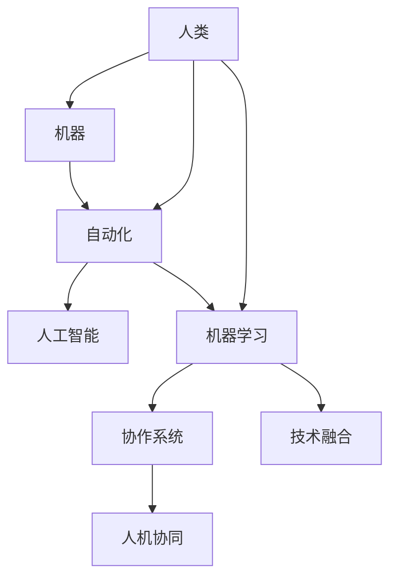

                 

# 人机协同：未来工作的核心驱动力

> 关键词：人机协同,自动化,人工智能,机器学习,协作,技术融合,未来工作

## 1. 背景介绍

### 1.1 问题由来
随着科技进步，尤其是人工智能(AI)和机器学习(ML)的迅速发展，机器正在逐渐取代人类完成一些重复性和低价值的任务。这不仅提高了生产效率，也为人类提供了更多的时间和空间，从事更有创造性和价值的工作。然而，这种技术变革也带来了新的挑战：人类与机器如何更好地协作？如何充分利用AI的强大能力，同时保留人类的独特价值？

人机协同（Human-Machine Collaboration），成为未来工作的核心驱动力。通过人机协同，可以最大程度发挥人类的创造力和决策能力，同时提升机器的工作效率和精度。

### 1.2 问题核心关键点
人机协同的核心在于构建一个既高效又灵活的工作系统，使机器能够支持人类在复杂、创造性的任务中发挥所长。这种协同不仅能提高工作效率，还能带来更优质的成果。关键点包括：

- **任务分配与协同：**根据任务类型和复杂度，合理分配给人类和机器。
- **数据处理与分析：**利用机器处理大量数据，提取关键信息，辅助人类决策。
- **知识整合与创新：**结合人类的经验与机器的深度学习，实现跨学科的创新。
- **用户体验与反馈：**通过用户的反馈不断优化人机协作模式。
- **伦理与法律：**在协同过程中保护个人隐私和数据安全，遵守相关法律规定。

### 1.3 问题研究意义
研究人机协同的深刻意义在于，它不仅是一个技术问题，更是一个社会问题。通过对这一领域的研究，我们可以更深刻地理解未来工作模式的变化，为教育、职场、社会治理等各个领域提供指导和解决方案。

未来，随着AI技术的不断成熟，人机协同将成为驱动工作变革的重要力量，推动社会向智能化、自动化方向发展。

## 2. 核心概念与联系

### 2.1 核心概念概述

为了更好地理解人机协同的核心概念，本节将介绍几个密切相关的核心概念：

- **人机协同（Human-Machine Collaboration, HMC）**：指在特定任务中，人类与机器通过协作完成工作的一种模式。这种模式充分利用了人类和机器的各自优势，提高了工作效率和质量。

- **自动化（Automation）**：指利用技术手段自动完成某些任务，减少人工干预。自动化是人机协同的基础。

- **人工智能（Artificial Intelligence, AI）**：指模拟人类智能行为的技术，包括机器学习、深度学习等。AI技术在自动化和协同中起着关键作用。

- **机器学习（Machine Learning, ML）**：指通过算法和数据训练模型，使其具备特定任务的能力。机器学习是人机协同中的重要工具。

- **协作系统（Collaborative Systems）**：指由人类和机器组成，共同完成特定任务的系统。协作系统是人机协同的实现形式。

- **技术融合（Technology Integration）**：指不同技术手段的整合应用，形成协同效应。技术融合是人机协同的实现手段。

这些核心概念之间的逻辑关系可以通过以下Mermaid流程图来展示：



这个流程图展示了核心概念之间的关联性：

1. 人类和机器通过协作系统进行任务协同。
2. 自动化技术减少人工操作，提升效率。
3. 人工智能和机器学习提供协同工具。
4. 技术融合实现协同效应的最大化。

## 3. 核心算法原理 & 具体操作步骤
### 3.1 算法原理概述

人机协同的算法原理，主要是利用人工智能和机器学习技术，构建一个高效、灵活的协作系统。其核心思想是：根据任务特点和需求，合理分配任务给人类和机器，通过协作提升工作效率和质量。

在人机协同过程中，一般包括以下几个关键步骤：

1. **任务识别与分配**：识别任务的性质和复杂度，分配适合的任务给人类或机器。
2. **数据处理与分析**：利用机器处理数据，提取关键信息，辅助人类决策。
3. **协作模型构建**：构建协作模型，描述人类和机器的角色、任务、交互方式等。
4. **反馈与优化**：根据任务执行结果和用户反馈，不断优化协作模型。

### 3.2 算法步骤详解

以下将详细介绍人机协同的具体操作步骤：

**Step 1: 任务识别与分配**
- 定义任务的性质和复杂度，包括任务类型、所需技能、预期成果等。
- 使用AI技术对任务进行分类，识别出适合自动化的部分和需要人类介入的部分。
- 根据任务特点，合理分配任务给人类和机器。

**Step 2: 数据处理与分析**
- 收集任务相关的数据，包括历史数据、实时数据、用户反馈等。
- 利用机器学习技术，对数据进行预处理、特征提取、模型训练等。
- 提取关键信息，生成任务执行所需的输入数据。

**Step 3: 协作模型构建**
- 定义协作模型，描述人类和机器的角色、任务、交互方式等。
- 使用协作工具，如协作平台、通信系统等，实现人类与机器的交互。
- 构建协同决策框架，确定任务执行中的决策机制。

**Step 4: 反馈与优化**
- 收集任务执行结果和用户反馈，评估协作模型的效果。
- 根据评估结果，调整任务分配、数据处理、协作模型等。
- 不断迭代优化，提升协作系统的性能和效率。

### 3.3 算法优缺点

人机协同算法具有以下优点：

1. **效率提升**：自动化和协同可以大幅提高工作效率，减少人工干预。
2. **质量提升**：通过合理分配任务，结合人类和机器的各自优势，提升工作质量。
3. **灵活性**：协同系统可以根据任务和环境变化，灵活调整任务分配和协作模式。

同时，该算法也存在一些局限性：

1. **依赖数据质量**：协同系统的性能很大程度上取决于数据的质量和完整性。
2. **技术复杂性**：构建和维护协同系统需要较高的技术水平。
3. **成本高**：初期投入较大，需要购买昂贵的硬件和软件设备。
4. **依赖人类技能**：需要具备一定技能和经验的人类，才能高效协同。
5. **安全与隐私**：协同过程中可能涉及敏感数据，需要采取相应的安全措施。

尽管存在这些局限性，但人机协同仍是大势所趋，尤其在自动化水平较高的领域，人机协同显得尤为重要。

### 3.4 算法应用领域

人机协同技术已经在多个领域得到了广泛应用，涵盖了工业、医疗、教育、金融等多个行业。以下是几个典型的应用场景：

- **工业生产**：通过自动化和机器学习，优化生产流程，提高生产效率和产品质量。
- **医疗诊断**：结合医生的经验和AI技术，辅助诊断疾病，提升诊断准确率。
- **教育培训**：利用AI技术，提供个性化的学习方案，提升教学效果。
- **金融分析**：利用机器学习，分析市场数据，预测股票走势，辅助投资决策。
- **客服支持**：通过自动回复和人工客服相结合，提高客户服务质量。

这些应用场景展示了人机协同技术在各行各业中带来的显著效益。未来，随着AI技术的不断进步，人机协同将深入更多领域，带来更多变革性的影响。

## 4. 数学模型和公式 & 详细讲解 & 举例说明

### 4.1 数学模型构建

人机协同模型的构建，需要结合人工智能和机器学习技术。以下是一个简单的协同模型构建示例：

设有一项任务T，任务类型为X，所需技能为S，预期成果为R。假设任务T需要人类和机器协同完成，其中自动化的部分为A，需要人类介入的部分为H。

1. **任务识别与分配**：
   - 任务类型：X
   - 所需技能：S
   - 预期成果：R
   - 自动化部分：A
   - 人类介入部分：H

2. **数据处理与分析**：
   - 历史数据：D_h
   - 实时数据：D_r
   - 用户反馈：F
   - 处理结果：D processed

3. **协作模型构建**：
   - 角色定义：R角色
   - 任务分配：T分配
   - 交互方式：M交互
   - 协同决策：D协同

4. **反馈与优化**：
   - 任务执行结果：R结果
   - 用户反馈：F反馈
   - 优化结果：R优化

### 4.2 公式推导过程

以下我们将推导一个简单的协同模型公式：

设任务的自动化部分为A，人类介入部分为H。根据任务性质和复杂度，我们定义一个优化目标函数：

$$
\mathop{\arg\min}_{A, H} C(A, H) = \alpha f_A(A) + \beta f_H(H) + \gamma \text{cost}(A, H)
$$

其中：
- $\alpha$ 为自动化部分的权重，$\beta$ 为人类介入部分的权重。
- $f_A(A)$ 和 $f_H(H)$ 分别为自动化部分和人类介入部分的效益函数。
- $\text{cost}(A, H)$ 为协同成本函数，包括硬件、软件、人力等成本。

该优化问题可以通过线性规划、非线性规划等方法求解。

### 4.3 案例分析与讲解

以下我们以医疗诊断为例，分析人机协同的实际应用。

假设有一项医疗诊断任务，需要医生和AI协同完成。任务类型包括病历分析、图像识别、诊断报告等。

1. **任务识别与分配**：
   - 任务类型：病历分析、图像识别、诊断报告
   - 所需技能：医学知识、图像处理、语言理解
   - 预期成果：准确诊断结果

2. **数据处理与分析**：
   - 历史数据：患者病历、影像数据、实验室报告等
   - 实时数据：患者当前病情、检查结果等
   - 用户反馈：医生诊断意见、患者反馈等
   - 处理结果：经过AI处理的病历摘要、影像分析结果等

3. **协作模型构建**：
   - 角色定义：医生、AI助手
   - 任务分配：病历分析、影像识别、报告生成等
   - 交互方式：语音交互、界面操作等
   - 协同决策：基于AI分析结果，医生进行最终诊断

4. **反馈与优化**：
   - 任务执行结果：诊断报告
   - 用户反馈：诊断准确性、医生满意度等
   - 优化结果：调整任务分配、优化协同模型

## 5. 项目实践：代码实例和详细解释说明

### 5.1 开发环境搭建

在进行人机协同项目实践前，我们需要准备好开发环境。以下是使用Python进行协同开发的环境配置流程：

1. 安装Anaconda：从官网下载并安装Anaconda，用于创建独立的Python环境。

2. 创建并激活虚拟环境：
```bash
conda create -n collaboratory python=3.8 
conda activate collaboratory
```

3. 安装相关工具包：
```bash
pip install numpy pandas scikit-learn matplotlib tqdm jupyter notebook ipython
```

4. 安装协作工具：
```bash
pip install ray
```

完成上述步骤后，即可在`collaboratory`环境中开始协同项目实践。

### 5.2 源代码详细实现

下面我们以医疗诊断协同项目为例，给出使用Ray进行人机协同开发的PyTorch代码实现。

首先，定义协同任务的数据处理函数：

```python
from ray import tune
from transformers import BertTokenizer, BertForTokenClassification
from torch.utils.data import Dataset

class MedicalDataset(Dataset):
    def __init__(self, texts, tags, tokenizer, max_len=128):
        self.texts = texts
        self.tags = tags
        self.tokenizer = tokenizer
        self.max_len = max_len
        
    def __len__(self):
        return len(self.texts)
    
    def __getitem__(self, item):
        text = self.texts[item]
        tags = self.tags[item]
        
        encoding = self.tokenizer(text, return_tensors='pt', max_length=self.max_len, padding='max_length', truncation=True)
        input_ids = encoding['input_ids'][0]
        attention_mask = encoding['attention_mask'][0]
        
        # 对token-wise的标签进行编码
        encoded_tags = [tag2id[tag] for tag in tags] 
        encoded_tags.extend([tag2id['O']] * (self.max_len - len(encoded_tags)))
        labels = torch.tensor(encoded_tags, dtype=torch.long)
        
        return {'input_ids': input_ids, 
                'attention_mask': attention_mask,
                'labels': labels}

# 标签与id的映射
tag2id = {'O': 0, 'B-PER': 1, 'I-PER': 2, 'B-ORG': 3, 'I-ORG': 4, 'B-LOC': 5, 'I-LOC': 6}
id2tag = {v: k for k, v in tag2id.items()}

# 创建dataset
tokenizer = BertTokenizer.from_pretrained('bert-base-cased')

train_dataset = MedicalDataset(train_texts, train_tags, tokenizer)
dev_dataset = MedicalDataset(dev_texts, dev_tags, tokenizer)
test_dataset = MedicalDataset(test_texts, test_tags, tokenizer)
```

然后，定义模型和优化器：

```python
from transformers import BertForTokenClassification, AdamW

model = BertForTokenClassification.from_pretrained('bert-base-cased', num_labels=len(tag2id))

optimizer = AdamW(model.parameters(), lr=2e-5)
```

接着，定义训练和评估函数：

```python
from torch.utils.data import DataLoader
from tqdm import tqdm
from sklearn.metrics import classification_report

device = torch.device('cuda') if torch.cuda.is_available() else torch.device('cpu')
model.to(device)

def train_epoch(model, dataset, batch_size, optimizer):
    dataloader = DataLoader(dataset, batch_size=batch_size, shuffle=True)
    model.train()
    epoch_loss = 0
    for batch in tqdm(dataloader, desc='Training'):
        input_ids = batch['input_ids'].to(device)
        attention_mask = batch['attention_mask'].to(device)
        labels = batch['labels'].to(device)
        model.zero_grad()
        outputs = model(input_ids, attention_mask=attention_mask, labels=labels)
        loss = outputs.loss
        epoch_loss += loss.item()
        loss.backward()
        optimizer.step()
    return epoch_loss / len(dataloader)

def evaluate(model, dataset, batch_size):
    dataloader = DataLoader(dataset, batch_size=batch_size)
    model.eval()
    preds, labels = [], []
    with torch.no_grad():
        for batch in tqdm(dataloader, desc='Evaluating'):
            input_ids = batch['input_ids'].to(device)
            attention_mask = batch['attention_mask'].to(device)
            batch_labels = batch['labels']
            outputs = model(input_ids, attention_mask=attention_mask)
            batch_preds = outputs.logits.argmax(dim=2).to('cpu').tolist()
            batch_labels = batch_labels.to('cpu').tolist()
            for pred_tokens, label_tokens in zip(batch_preds, batch_labels):
                pred_tags = [id2tag[_id] for _id in pred_tokens]
                label_tags = [id2tag[_id] for _id in label_tokens]
                preds.append(pred_tags[:len(label_tags)])
                labels.append(label_tags)
                
    print(classification_report(labels, preds))
```

最后，启动训练流程并在测试集上评估：

```python
epochs = 5
batch_size = 16

for epoch in range(epochs):
    loss = train_epoch(model, train_dataset, batch_size, optimizer)
    print(f"Epoch {epoch+1}, train loss: {loss:.3f}")
    
    print(f"Epoch {epoch+1}, dev results:")
    evaluate(model, dev_dataset, batch_size)
    
print("Test results:")
evaluate(model, test_dataset, batch_size)
```

以上就是使用PyTorch和Ray进行医疗诊断协同项目开发的完整代码实现。可以看到，通过Ray等协作工具，可以更加灵活地实现人机协同的开发和调试。

### 5.3 代码解读与分析

让我们再详细解读一下关键代码的实现细节：

**MedicalDataset类**：
- `__init__`方法：初始化文本、标签、分词器等关键组件。
- `__len__`方法：返回数据集的样本数量。
- `__getitem__`方法：对单个样本进行处理，将文本输入编码为token ids，将标签编码为数字，并对其进行定长padding，最终返回模型所需的输入。

**tag2id和id2tag字典**：
- 定义了标签与数字id之间的映射关系，用于将token-wise的预测结果解码回真实的标签。

**训练和评估函数**：
- 使用PyTorch的DataLoader对数据集进行批次化加载，供模型训练和推理使用。
- 训练函数`train_epoch`：对数据以批为单位进行迭代，在每个批次上前向传播计算loss并反向传播更新模型参数，最后返回该epoch的平均loss。
- 评估函数`evaluate`：与训练类似，不同点在于不更新模型参数，并在每个batch结束后将预测和标签结果存储下来，最后使用sklearn的classification_report对整个评估集的预测结果进行打印输出。

**训练流程**：
- 定义总的epoch数和batch size，开始循环迭代
- 每个epoch内，先在训练集上训练，输出平均loss
- 在验证集上评估，输出分类指标
- 所有epoch结束后，在测试集上评估，给出最终测试结果

可以看到，PyTorch配合Ray等协作工具使得协同项目的代码实现变得简洁高效。开发者可以将更多精力放在数据处理、模型改进等高层逻辑上，而不必过多关注底层的实现细节。

当然，工业级的系统实现还需考虑更多因素，如模型的保存和部署、超参数的自动搜索、更灵活的任务适配层等。但核心的协同范式基本与此类似。

## 6. 实际应用场景
### 6.1 智能客服系统

基于协同技术的智能客服系统，可以广泛应用于智能客服系统的构建。传统客服往往需要配备大量人力，高峰期响应缓慢，且一致性和专业性难以保证。而使用协同技术的客服系统，可以7x24小时不间断服务，快速响应客户咨询，用自然流畅的语言解答各类常见问题。

在技术实现上，可以收集企业内部的历史客服对话记录，将问题和最佳答复构建成监督数据，在此基础上对协同模型进行微调。协同模型能够自动理解用户意图，匹配最合适的答案模板进行回复。对于客户提出的新问题，还可以接入检索系统实时搜索相关内容，动态组织生成回答。如此构建的智能客服系统，能大幅提升客户咨询体验和问题解决效率。

### 6.2 金融舆情监测

金融机构需要实时监测市场舆论动向，以便及时应对负面信息传播，规避金融风险。传统的人工监测方式成本高、效率低，难以应对网络时代海量信息爆发的挑战。基于协同技术的文本分类和情感分析技术，为金融舆情监测提供了新的解决方案。

具体而言，可以收集金融领域相关的新闻、报道、评论等文本数据，并对其进行主题标注和情感标注。在此基础上对协同模型进行微调，使其能够自动判断文本属于何种主题，情感倾向是正面、中性还是负面。将协同模型应用到实时抓取的网络文本数据，就能够自动监测不同主题下的情感变化趋势，一旦发现负面信息激增等异常情况，系统便会自动预警，帮助金融机构快速应对潜在风险。

### 6.3 个性化推荐系统

当前的推荐系统往往只依赖用户的历史行为数据进行物品推荐，无法深入理解用户的真实兴趣偏好。基于协同技术的个性化推荐系统，可以更好地挖掘用户行为背后的语义信息，从而提供更精准、多样的推荐内容。

在实践中，可以收集用户浏览、点击、评论、分享等行为数据，提取和用户交互的物品标题、描述、标签等文本内容。将文本内容作为协同模型的输入，用户的后续行为（如是否点击、购买等）作为监督信号，在此基础上微调协同模型。协同模型能够从文本内容中准确把握用户的兴趣点。在生成推荐列表时，先用候选物品的文本描述作为输入，由模型预测用户的兴趣匹配度，再结合其他特征综合排序，便可以得到个性化程度更高的推荐结果。

### 6.4 未来应用展望

随着协同技术的不断发展，协同技术将在更多领域得到应用，为传统行业带来变革性影响。

在智慧医疗领域，基于协同技术的医疗问答、病历分析、药物研发等应用将提升医疗服务的智能化水平，辅助医生诊疗，加速新药开发进程。

在智能教育领域，协同技术可应用于作业批改、学情分析、知识推荐等方面，因材施教，促进教育公平，提高教学质量。

在智慧城市治理中，协同技术可应用于城市事件监测、舆情分析、应急指挥等环节，提高城市管理的自动化和智能化水平，构建更安全、高效的未来城市。

此外，在企业生产、社会治理、文娱传媒等众多领域，基于协同技术的智能应用也将不断涌现，为经济社会发展注入新的动力。相信随着技术的日益成熟，协同技术将成为驱动人工智能技术落地应用的重要范式，推动人工智能技术向更广阔的领域加速渗透。

## 7. 工具和资源推荐
### 7.1 学习资源推荐

为了帮助开发者系统掌握协同技术的基础理论和实践技巧，这里推荐一些优质的学习资源：

1. 《Human-Machine Collaboration: A Survey》系列博文：由协同技术专家撰写，深入浅出地介绍了协同技术的基本概念、最新进展和应用案例。

2. CS223《人工智能与机器人学导论》课程：斯坦福大学开设的AI课程，有Lecture视频和配套作业，带你入门协同技术的核心思想和关键算法。

3. 《Human-Machine Collaboration in AI》书籍：全面介绍了协同技术在多个领域的应用，提供了丰富的案例和实践指导。

4. IBM AI-Series Webinar：IBM组织的协同技术专题讲座，涵盖技术前沿、实际应用和未来趋势，是了解协同技术的最佳平台之一。

5. GitHub协同技术项目：GitHub上许多协同技术的开源项目，包括代码实现、文档和社区讨论，提供了丰富的学习资源。

通过对这些资源的学习实践，相信你一定能够快速掌握协同技术的精髓，并用于解决实际的NLP问题。
### 7.2 开发工具推荐

高效的协同开发离不开优秀的工具支持。以下是几款用于协同开发和部署的工具：

1. Ray：开源的分布式计算框架，支持多节点协同计算，适合大规模机器学习项目。

2. TensorFlow：由Google主导开发的开源深度学习框架，支持分布式计算和GPU/TPU加速。

3. PyTorch：基于Python的开源深度学习框架，支持动态计算图，适合灵活的协同开发。

4. Weights & Biases：模型训练的实验跟踪工具，可以记录和可视化模型训练过程中的各项指标，方便对比和调优。

5. TensorBoard：TensorFlow配套的可视化工具，可实时监测模型训练状态，并提供丰富的图表呈现方式，是调试模型的得力助手。

6. HuggingFace Transformers库：提供了众多预训练语言模型和协作工具，方便开发者进行协同模型的构建和微调。

合理利用这些工具，可以显著提升协同项目的开发效率，加快创新迭代的步伐。

### 7.3 相关论文推荐

协同技术的研究始于学界的持续探索。以下是几篇奠基性的相关论文，推荐阅读：

1. HUMAN-CENTERED MACHINE COLLABORATION: A SURVEY OF HUMAN-MACHINE COOPERATION, PATTERN RECOGNITION, AND USER MODELING IN HCI （Collaboration Survey）：综述了人机协作的研究现状和未来趋势。

2. Collaborative Filtering Recommendation Systems：介绍了协同过滤推荐系统的发展历程和算法原理。

3. Multi-task Learning with Co-attention Networks：提出了协同注意力网络，用于多个任务间的协同学习。

4. HUMAN-MACHINE COLLABORATION IN ROBOTIC MANIPULATION （Collaboration in Robotics）：介绍了人机协同在机器人操作中的应用。

5. Collaborative Filtering with Deep Learning （Collaborative Filtering with DL）：介绍了深度学习在协同过滤推荐系统中的应用。

这些论文代表了大协同技术的发展脉络。通过学习这些前沿成果，可以帮助研究者把握学科前进方向，激发更多的创新灵感。

## 8. 总结：未来发展趋势与挑战

### 8.1 总结

本文对基于协同技术的人机协同方法进行了全面系统的介绍。首先阐述了协同技术的研究背景和意义，明确了协同技术在提升工作效率和质量方面的独特价值。其次，从原理到实践，详细讲解了协同算法的数学模型和关键步骤，给出了协同项目开发的完整代码实例。同时，本文还广泛探讨了协同技术在智能客服、金融舆情、个性化推荐等多个行业领域的应用前景，展示了协同技术的广泛应用潜力。

通过本文的系统梳理，可以看到，基于协同技术的人机协同方法正在成为AI技术的重要范式，极大地提升了各类系统的工作效率和质量。未来，随着协同技术的发展，人机协同必将在更多领域得到应用，为社会带来深刻变革。

### 8.2 未来发展趋势

展望未来，协同技术的发展趋势包括：

1. **自动化水平提升**：随着AI技术的不断进步，越来越多的任务将实现自动化，人类和机器的协作将更加深入。
2. **数据驱动的协同**：通过大数据分析，更好地理解用户需求，优化协同模型，提高协同效果。
3. **多模态协同**：结合图像、语音、文本等多种模态数据，实现更加全面、深入的协同。
4. **协作平台化**：通过构建统一的协作平台，实现跨部门、跨领域的协同，提升整体效率。
5. **伦理与法律保障**：在协同过程中，保障用户隐私和数据安全，遵守相关法律规定，确保协作的公平性和透明度。
6. **智能决策支持**：协同技术将更多地应用于决策支持系统，提供智能化的决策参考。

以上趋势凸显了协同技术的广阔前景。这些方向的探索发展，必将进一步提升协同系统的性能和应用范围，为社会带来更深刻的影响。

### 8.3 面临的挑战

尽管协同技术已经取得了显著成就，但在迈向更加智能化、普适化应用的过程中，它仍面临诸多挑战：

1. **依赖数据质量**：协同系统的性能很大程度上取决于数据的质量和完整性，数据获取和处理成本较高。
2. **技术复杂性**：协同技术涉及多个学科，实现协同系统需要较高的技术水平和跨学科知识。
3. **计算资源消耗大**：协同计算通常需要高性能硬件支持，初期投入较大。
4. **系统复杂性高**：协同系统构建和维护复杂，需要持续优化和改进。
5. **安全性与隐私**：协同过程中可能涉及敏感数据，需要采取相应的安全措施。
6. **模型可解释性不足**：协同模型往往较为复杂，其决策过程难以解释。

尽管存在这些挑战，协同技术仍然是大势所趋，尤其在自动化水平较高的领域，协同技术显得尤为重要。通过不断克服技术瓶颈，协同技术必将在更多领域得到广泛应用。

### 8.4 研究展望

面对协同技术所面临的挑战，未来的研究需要在以下几个方面寻求新的突破：

1. **无监督学习和半监督学习**：探索不需要大量标注数据的协同方法，降低协同系统的依赖性。
2. **联邦学习**：通过分布式协同学习，实现跨部门、跨领域的协同，提高协同系统的泛化能力。
3. **多任务学习**：探索协同模型在不同任务之间的协同关系，提升协同系统的适应性和性能。
4. **模型压缩与优化**：研究协同模型的压缩和优化方法，提高协同系统的效率和可扩展性。
5. **跨领域知识整合**：将不同领域的知识整合到协同模型中，提升系统的跨领域适应能力。
6. **协同决策优化**：研究协同模型的决策优化方法，提升系统的决策效率和准确性。

这些研究方向的探索，必将引领协同技术迈向更高的台阶，为构建安全、可靠、可解释、可控的智能系统铺平道路。面向未来，协同技术还需要与其他人工智能技术进行更深入的融合，如知识表示、因果推理、强化学习等，多路径协同发力，共同推动自然语言理解和智能交互系统的进步。只有勇于创新、敢于突破，才能不断拓展协同技术的边界，让智能技术更好地造福人类社会。

## 9. 附录：常见问题与解答

**Q1：协同技术是否适用于所有任务？**

A: 协同技术在大多数任务上都能取得不错的效果，特别是对于数据量较大的任务。但对于一些特定领域的任务，如医学、法律等，仅仅依靠通用语料协同的模型可能难以很好地适应。此时需要在特定领域语料上进一步协同训练，才能获得理想效果。此外，对于一些需要时效性、个性化很强的任务，如对话、推荐等，协同方法也需要针对性的改进优化。

**Q2：协同系统如何保证协同的公平性和透明度？**

A: 协同系统的公平性和透明度主要通过以下几个方面保证：
1. 数据透明：保证数据收集和处理过程的透明性，确保数据来源的多样性和代表性。
2. 算法透明：采用可解释性强的算法，提供决策依据，增强用户信任。
3. 用户参与：通过用户反馈和参与，不断优化协同模型，确保系统的公平性。
4. 法律合规：遵守相关法律法规，保障用户隐私和数据安全。

这些措施可以最大程度地保证协同系统的公平性和透明度。

**Q3：协同系统如何应对异常情况？**

A: 协同系统应对异常情况主要通过以下几个方面：
1. 异常检测：通过异常检测算法，实时监测系统运行状态，识别异常情况。
2. 应急预案：制定应急预案，在异常情况下快速响应，避免系统崩溃。
3. 系统恢复：采用备份和容错机制，确保系统在异常情况下能够快速恢复。
4. 用户反馈：通过用户反馈，及时调整协同模型，提升系统的鲁棒性。

这些措施可以有效地应对协同系统中的异常情况，保障系统的稳定性和可靠性。

**Q4：协同系统如何处理多模态数据？**

A: 协同系统处理多模态数据主要通过以下几个方面：
1. 数据融合：将不同模态的数据进行融合，提取多模态特征，提升协同模型的适应性。
2. 跨模态学习：利用跨模态学习算法，将不同模态的数据进行协同学习，提升协同模型的泛化能力。
3. 协同框架设计：构建多模态协同框架，实现不同模态数据之间的协同，提高系统的综合能力。
4. 任务定制：根据任务需求，设计多模态协同模型，提升系统的任务适应能力。

这些方法可以有效地处理多模态数据，提升协同系统的综合能力。

---

作者：禅与计算机程序设计艺术 / Zen and the Art of Computer Programming

