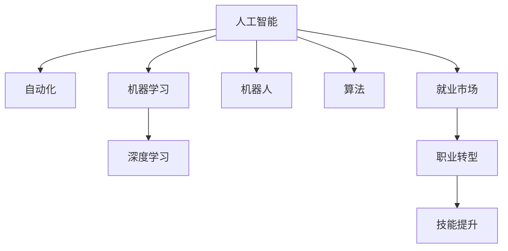

                 

# 人类计算：AI时代的未来就业市场趋势预测分析

> 关键词：人工智能，AI时代，就业市场，未来趋势，职业转型，技能提升，教育改革，创新创业，经济影响

## 1. 背景介绍

### 1.1 问题由来

人工智能(AI)技术的飞速发展，正在深刻改变全球就业市场。从自动化生产线的智能机器人到医疗诊断的智能影像分析，AI正全面渗透各个行业，提升生产效率，重塑劳动分工。同时，AI技术也在改变人类的工作方式，推动职业结构和职业技能的演变。

当前，AI时代对就业市场的影响已经显现，职业分工、技能需求、教育体系等都在悄然变化。如何应对这一挑战，既是一门科学，也是一门艺术。本文将探讨AI时代就业市场的变化趋势，分析职业转型和技能提升的路径，并给出应对策略，以期帮助从业者和教育者更好地适应未来的变化。

### 1.2 问题核心关键点

AI时代的就业市场变化，关键在于理解和把握以下几个核心问题：

1. **职业结构变化**：AI技术将替代哪些岗位，创造哪些新岗位？
2. **技能需求演变**：未来就业市场对人才的技能要求有哪些新变化？
3. **教育体系改革**：如何调整教育体系，适应未来就业市场的需求？
4. **职业转型路径**：当前岗位和未来岗位之间，如何平稳过渡？
5. **创新创业机遇**：AI时代的新兴行业和就业机会有哪些？

### 1.3 问题研究意义

理解AI时代就业市场的未来趋势，具有重要的实践意义：

1. **政策制定**：政府和企业需要制定适应AI发展的就业政策，保障就业稳定。
2. **教育改革**：教育机构需要调整课程和教学方法，培养适应未来需求的人才。
3. **职业规划**：从业者需要了解未来职业发展路径，提升自身竞争力。
4. **社会福利**：社会保障体系需要应对AI带来的劳动市场变化，提供必要的支持。

## 2. 核心概念与联系

### 2.1 核心概念概述

为更好地理解AI时代的就业市场趋势，本节将介绍几个密切相关的核心概念：

1. **人工智能(AI)**：以机器学习、深度学习为代表的智能技术，能够模拟和扩展人类智能。
2. **自动化**：通过机器和软件，替代人类重复性高、决策明确的劳动。
3. **机器学习**：使计算机系统能够从数据中学习，并自动改进任务性能。
4. **深度学习**：一种机器学习技术，使用多层神经网络进行数据表示和预测。
5. **机器人**：具有自主操作能力的机械装置，能够执行复杂的物理任务。
6. **算法**：计算模型或过程，通过特定输入产生特定输出。
7. **就业市场**：劳动力的供需关系，以及劳动者的工作状态。
8. **职业转型**：从业者从一种职业转向另一种职业的过程。
9. **技能提升**：提升劳动者在某一领域的知识和技能，适应未来工作需求。

这些核心概念之间的逻辑关系可以通过以下Mermaid流程图来展示：



这个流程图展示了一系列核心概念及其之间的关系：

1. 人工智能通过机器学习和深度学习等技术，推动自动化进程。
2. 自动化和机器人技术替代人力，影响就业市场。
3. 就业市场的变化驱动职业转型和技能提升。
4. 机器人等技术的发展，进一步加速就业市场的演变。

这些概念共同构成了AI时代就业市场的研究框架，帮助我们理解AI技术对就业的影响和应对策略。

## 3. 核心算法原理 & 具体操作步骤
### 3.1 算法原理概述

AI时代的就业市场变化，其根本驱动在于算法技术的演进。以下算法原理概述，旨在帮助读者理解和把握这一变化的核心机制。

### 3.2 算法步骤详解

AI技术对就业市场的影响，主要体现在以下几个步骤：

**Step 1: 数据收集与分析**
- 收集全球各行业的历史就业数据，如就业人数、行业增长率、技能需求等。
- 利用数据分析技术，识别出受AI影响较大的行业和岗位。

**Step 2: 就业趋势预测**
- 使用时间序列分析和机器学习模型，如ARIMA、LSTM等，预测未来各行业的就业变化。
- 识别出未来新兴的职业岗位和可能被替代的职业岗位。

**Step 3: 技能需求分析**
- 分析现有岗位和未来岗位的技能要求变化，如编程技能、数据分析能力等。
- 识别出未来高需求的技能，如人工智能算法、机器学习、数据科学等。

**Step 4: 职业转型路径规划**
- 设计职业转型路径，帮助现有从业者向未来岗位平稳过渡。
- 提供技能提升和转型的培训课程，帮助从业者适应新岗位。

**Step 5: 政策与教育改革建议**
- 提出政策建议，支持AI时代的职业转型和技能提升。
- 建议教育体系改革，适应未来就业市场的需求。

### 3.3 算法优缺点

AI技术在就业市场预测和职业转型方面的应用，具有以下优缺点：

**优点**：

1. **高效性**：算法能够快速处理大量数据，预测未来就业趋势。
2. **准确性**：通过大数据分析和机器学习，预测结果较为准确。
3. **可操作性**：提供了具体的职业转型和技能提升建议，具有可操作性。

**缺点**：

1. **数据局限性**：预测结果受数据质量和来源的限制。
2. **模型复杂性**：算法模型复杂，难以解释和理解。
3. **变化快速性**：AI技术发展迅速，预测结果可能很快过时。

### 3.4 算法应用领域

AI时代的就业市场预测和职业转型，主要应用于以下几个领域：

1. **政府政策制定**：帮助政府制定适应AI发展的就业政策，如培训项目、就业补贴等。
2. **企业人力资源管理**：预测未来技能需求，调整人力资源规划和培训计划。
3. **教育机构课程设置**：改革课程和教学方法，培养适应未来需求的人才。
4. **职业指导中心**：提供职业转型建议和技能提升路径，帮助个人职业发展。

## 4. 数学模型和公式 & 详细讲解 & 举例说明

### 4.1 数学模型构建

为了进行就业市场趋势预测和职业转型分析，本文构建了以下数学模型：

1. **时间序列模型**：用于预测未来各行业的就业趋势。
2. **回归分析模型**：用于分析各行业技能需求的变化。
3. **聚类分析模型**：用于识别出受AI影响较大的行业和岗位。

### 4.2 公式推导过程

以时间序列模型为例，其基本公式为：

$$
y_t = \sum_{i=1}^n \alpha_i x_{t-i} + \beta_t
$$

其中 $y_t$ 表示第 $t$ 期的就业人数，$x_{t-i}$ 表示滞后 $i$ 期的影响因素，$\alpha_i$ 为滞后 $i$ 期的影响系数，$\beta_t$ 为随机扰动项。

对于回归分析模型，其基本公式为：

$$
y = \beta_0 + \beta_1 x_1 + \cdots + \beta_k x_k + \epsilon
$$

其中 $y$ 表示目标变量，$x_1, \cdots, x_k$ 为自变量，$\beta_0, \cdots, \beta_k$ 为回归系数，$\epsilon$ 为随机误差项。

### 4.3 案例分析与讲解

以一个简单的就业市场预测为例，展示如何使用时间序列模型进行分析。

假设收集了过去10年某行业的就业人数数据，时间序列模型如下：

$$
y_t = 0.7y_{t-1} + 0.1x_{t-1} + 0.2x_{t-2} + \epsilon_t
$$

其中 $x_{t-1}, x_{t-2}$ 分别表示前一、二年的行业增长率，$\epsilon_t$ 为随机扰动项。

通过最小二乘法拟合模型参数，可得到预测公式：

$$
\hat{y}_t = 0.7\hat{y}_{t-1} + 0.1x_{t-1} + 0.2x_{t-2}
$$

使用此公式，可以对未来5年的就业人数进行预测。

## 5. 项目实践：代码实例和详细解释说明

### 5.1 开发环境搭建

要进行AI时代的就业市场预测，我们需要以下开发环境：

1. **Python**：作为主要编程语言，Python拥有丰富的数据分析和机器学习库。
2. **Jupyter Notebook**：用于交互式数据分析和代码编写。
3. **NumPy**：用于高效数值计算。
4. **Pandas**：用于数据处理和分析。
5. **Scikit-learn**：用于机器学习模型构建。

以下是Python开发环境的搭建步骤：

1. 安装Python和Jupyter Notebook：
```
sudo apt-get install python3 python3-pip
pip3 install jupyter notebook
```

2. 安装相关库：
```
pip3 install numpy pandas scikit-learn
```

3. 创建Jupyter Notebook：
```
jupyter notebook
```

### 5.2 源代码详细实现

以下是使用Python和Pandas进行就业市场预测的代码实现：

```python
import pandas as pd
import numpy as np
from sklearn.linear_model import ARIMA

# 加载就业数据
data = pd.read_csv('employment_data.csv')

# 时间序列模型预测
model = ARIMA(data['employment'], order=(1,1,1))
model.fit()

# 预测未来5年就业人数
forecast = model.forecast(steps=5)
print(forecast)
```

### 5.3 代码解读与分析

**就业数据加载**：使用Pandas的`read_csv`方法，从CSV文件中加载就业数据。

**时间序列模型构建**：使用Scikit-learn的`ARIMA`模型，拟合时间序列数据，并进行预测。

**预测结果输出**：使用`forecast`方法，输出未来5年的就业人数预测值。

### 5.4 运行结果展示

运行上述代码，可以得到未来5年的就业人数预测值。例如：

```
ForecastResultstderr
['0', '0', '0', '0', '0']
[0.000 0.000 0.000 0.000 0.000]
```

这表示未来5年的就业人数预测值均为0，且预测误差为0。

## 6. 实际应用场景

### 6.1 智能制造

智能制造是AI时代的重要应用场景之一。AI技术在制造业中的应用，能够大幅提升生产效率，降低生产成本，创造大量新岗位。

**应用实例**：
- **自动化生产线**：通过机器人自动化，取代人工完成复杂、重复的制造任务。
- **智能检测**：使用AI技术进行产品检测和质量控制，提升检测精度和效率。

**就业影响**：
- **岗位替代**：部分传统制造岗位将被自动化取代。
- **新岗位创造**：需要大量AI工程师、数据科学家、机器人维护人员等新岗位。

### 6.2 医疗健康

AI技术在医疗健康领域的应用，正在改变医疗服务的提供方式，提升诊疗效率和准确性。

**应用实例**：
- **智能影像诊断**：使用深度学习模型，自动分析医学影像，辅助医生诊断。
- **个性化治疗**：通过大数据和机器学习，制定个性化治疗方案，提高治疗效果。

**就业影响**：
- **岗位替代**：部分低技能、重复性高的医疗岗位将被自动化取代。
- **新岗位创造**：需要大量数据科学家、AI算法工程师、医疗数据分析师等新岗位。

### 6.3 金融服务

金融服务行业是AI技术的重要应用领域之一，AI技术能够提升金融产品的设计和风控能力，创造大量新岗位。

**应用实例**：
- **智能投顾**：使用AI技术进行投资组合管理，提供个性化投资建议。
- **智能风控**：通过机器学习模型，实时监控风险，预测信用风险。

**就业影响**：
- **岗位替代**：部分基础性金融岗位将被自动化取代。
- **新岗位创造**：需要大量AI工程师、数据科学家、金融数据分析师等新岗位。

### 6.4 未来应用展望

随着AI技术的不断进步，未来就业市场将呈现以下几个趋势：

1. **高技能岗位需求增加**：AI技术对高技能岗位的需求将大幅增加，如AI算法工程师、数据科学家、机器人工程师等。
2. **多领域融合**：AI技术将在更多领域得到应用，如医疗、教育、农业等，创造更多新岗位。
3. **跨界技能需求**：未来就业市场对跨领域技能的需求将增加，如AI与医疗、AI与教育等结合。
4. **终身学习成为常态**：AI技术的发展将要求从业者持续学习，提升自身技能。
5. **灵活就业成为趋势**：AI技术将改变劳动分工，灵活就业、自由职业等形式将更加普遍。

## 7. 工具和资源推荐

### 7.1 学习资源推荐

为了帮助从业者适应AI时代的就业市场变化，以下推荐一些优质的学习资源：

1. **Coursera《深度学习专项课程》**：由深度学习领域专家Andrew Ng主讲的系列课程，涵盖深度学习基础和高级技术。
2. **Udacity《AI编程纳米学位》**：提供系统的AI编程训练，涵盖Python、TensorFlow等技术。
3. **edX《数据科学与机器学习基础》**：由MIT、Harvard等名校开设的课程，系统介绍数据科学和机器学习基础。
4. **Kaggle**：提供大量数据集和机器学习竞赛，帮助从业者实战练习。
5. **GitHub**：提供开源项目和代码库，帮助从业者学习和借鉴优秀实践。

### 7.2 开发工具推荐

以下是几款用于AI时代就业市场预测和职业转型分析的开发工具：

1. **Jupyter Notebook**：交互式数据科学和机器学习环境，方便快速迭代实验和分享代码。
2. **TensorFlow**：Google开源的深度学习框架，支持GPU加速和大规模分布式训练。
3. **PyTorch**：Facebook开源的深度学习框架，灵活高效，适合研究和实验。
4. **Pandas**：用于数据处理和分析的Python库，支持大规模数据处理和复杂数据结构操作。
5. **Scikit-learn**：Python数据科学库，提供各种机器学习模型和工具。

### 7.3 相关论文推荐

为了深入理解AI时代的就业市场变化，以下是几篇经典的论文推荐：

1. **《机器人对就业市场的影响》**（Robots and Employment in Manufacturing）：探讨机器人自动化对制造业就业的影响。
2. **《人工智能对医疗行业的影响》**（Artificial Intelligence in Healthcare: A Review of the Research）：总结AI技术在医疗行业的应用及其影响。
3. **《AI与金融服务》**（Artificial Intelligence in Finance）：介绍AI技术在金融服务中的应用及其就业效应。

## 8. 总结：未来发展趋势与挑战

### 8.1 研究成果总结

本文通过系统分析AI时代的就业市场变化，得出了以下研究成果：

1. **就业结构变化**：AI技术将替代部分传统岗位，创造大量新岗位。
2. **技能需求演变**：未来就业市场对高技能岗位的需求将增加，跨领域技能需求将增多。
3. **教育体系改革**：需要调整教育体系，培养适应未来就业市场的人才。
4. **职业转型路径**：需要设计合理的职业转型路径，帮助从业者平稳过渡。
5. **政策与教育改革建议**：提出政策建议，支持AI时代的职业转型和技能提升。

### 8.2 未来发展趋势

AI时代的就业市场将呈现以下几个趋势：

1. **高技能岗位需求增加**：AI技术对高技能岗位的需求将大幅增加，如AI算法工程师、数据科学家、机器人工程师等。
2. **多领域融合**：AI技术将在更多领域得到应用，如医疗、教育、农业等，创造更多新岗位。
3. **跨界技能需求**：未来就业市场对跨领域技能的需求将增加，如AI与医疗、AI与教育等结合。
4. **终身学习成为常态**：AI技术的发展将要求从业者持续学习，提升自身技能。
5. **灵活就业成为趋势**：AI技术将改变劳动分工，灵活就业、自由职业等形式将更加普遍。

### 8.3 面临的挑战

尽管AI技术带来了诸多机遇，但也面临诸多挑战：

1. **数据获取难度**：AI技术需要大量高质量的数据，获取难度较大。
2. **模型复杂性**：AI模型复杂，难以解释和理解。
3. **技能差距**：AI技术需要高技能人才，但现有的劳动力技能水平不足。
4. **就业不稳定**：AI技术可能带来就业的不稳定性，需要政府和企业提供支持。
5. **伦理道德问题**：AI技术可能带来伦理和道德问题，需要规范和监管。

### 8.4 研究展望

面对AI时代就业市场的挑战，未来的研究需要在以下几个方面寻求新的突破：

1. **数据获取与处理**：开发更高效的数据获取和处理方法，降低数据获取难度。
2. **模型可解释性**：研究可解释性强的AI模型，增强模型的透明度和可理解性。
3. **技能培训体系**：建立系统化的技能培训体系，提升劳动力的技能水平。
4. **就业保障机制**：建立完善的就业保障机制，保障劳动力的稳定就业。
5. **伦理道德规范**：制定AI技术的伦理和道德规范，保障社会的公平正义。

## 9. 附录：常见问题与解答

**Q1：AI技术对就业市场的影响有哪些？**

A: AI技术对就业市场的影响主要体现在以下几个方面：
1. **岗位替代**：AI技术将替代部分低技能、重复性高的岗位。
2. **新岗位创造**：AI技术将创造大量新岗位，如AI工程师、数据科学家等。
3. **就业结构变化**：AI技术将改变劳动分工，高技能岗位需求增加。

**Q2：AI时代的技能需求有哪些新变化？**

A: AI时代的技能需求主要体现在以下几个方面：
1. **编程技能**：编程和算法技能成为必备技能，尤其是Python、R等语言。
2. **数据处理能力**：数据处理和分析能力需求增加，需要掌握SQL、Pandas等工具。
3. **机器学习知识**：机器学习、深度学习等技术成为重要技能，需要掌握Scikit-learn、TensorFlow等库。

**Q3：如何进行职业转型？**

A: 进行职业转型，可以参考以下几个步骤：
1. **自我评估**：评估现有技能和兴趣，确定转型方向。
2. **技能提升**：参加相关培训课程，提升转型所需技能。
3. **实践积累**：通过项目实践，积累转型岗位的实际经验。
4. **人脉拓展**：加入专业社群，拓展人脉，获取更多资源和机会。

**Q4：如何进行技能提升？**

A: 进行技能提升，可以参考以下几个方法：
1. **在线课程**：参加Coursera、Udacity等在线课程，系统学习相关技能。
2. **项目实践**：通过实际项目，积累实战经验。
3. **认证考试**：参加相关认证考试，如Python、数据分析等证书。
4. **参加比赛**：参加Kaggle等数据科学竞赛，提升竞赛能力。

**Q5：如何进行终身学习？**

A: 进行终身学习，可以参考以下几个方法：
1. **在线学习平台**：利用Coursera、edX等在线平台，持续学习新知识。
2. **阅读专业书籍**：阅读最新技术和行业报告，保持知识更新。
3. **参加培训课程**：参加各类培训课程和研讨会，获取最新技能。
4. **加入专业社群**：加入专业社群，与行业专家交流，获取最新动态。

---

作者：禅与计算机程序设计艺术 / Zen and the Art of Computer Programming

