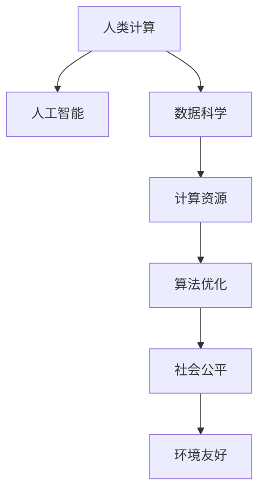

                 

# 人类计算：可持续发展的推动力

> 关键词：人类计算, 可持续发展, 人工智能, 数据科学, 计算资源, 算法优化, 社会公平, 环境友好

## 1. 背景介绍

### 1.1 问题由来

随着科技的迅猛发展，人类社会正处于一场新的工业革命之中。从蒸汽机到电力的广泛应用，再到信息时代的来临，每一次工业革命都极大地推动了社会的进步和繁荣。然而，随之而来的是资源的消耗、环境的破坏，以及社会不平等问题的加剧。为了实现社会的可持续发展，我们需要探索一种既能满足人类需求，又能保护自然环境和社会公平的发展模式。

在这种背景下，人类计算的概念应运而生。人类计算不仅是一种新的计算范式，更是一种全新的发展理念。它强调以人为本，通过计算和数据的协同工作，促进社会公平、环境保护和资源优化，从而推动可持续发展的实现。

### 1.2 问题核心关键点

人类计算的核心关键点在于：

- **以人为本**：人类计算强调以人的需求和福祉为中心，而不是单纯追求技术或经济指标。
- **可持续发展**：通过优化资源配置，减少环境污染，实现经济、社会、环境的协同发展。
- **计算与数据**：人类计算充分利用计算和数据的强大能力，帮助人类解决实际问题，推动社会进步。
- **社会公平**：人类计算通过优化算法，减少社会不平等，提升所有人的生活质量。
- **环境友好**：人类计算关注环境影响，采用绿色算法和可再生资源，降低对环境的伤害。

## 2. 核心概念与联系

### 2.1 核心概念概述

为了更好地理解人类计算的原理和应用，本节将介绍几个核心概念：

- **人类计算(Human Computing)**：一种新的计算范式，强调利用计算技术解决人类问题，促进社会公平和环境保护。
- **可持续发展(Sustainable Development)**：在满足当前社会经济需求的同时，不损害后代满足其需求的能力的发展模式。
- **人工智能(Artificial Intelligence, AI)**：通过计算和数据模拟人类智能，实现智能决策和问题解决的技术。
- **数据科学(Data Science)**：涉及数据的采集、处理、分析和解释，以揭示数据背后的模式和规律，支持决策制定。
- **计算资源(Computational Resources)**：包括CPU、GPU、FPGA等硬件资源，以及算法、模型等软件资源，是实现人类计算的基础。
- **算法优化(Algorithm Optimization)**：通过改进算法，提高计算效率，减少资源消耗，实现更高效、更智能的计算。
- **社会公平(Social Fairness)**：通过公平分配资源，缩小贫富差距，提升社会整体福祉。
- **环境友好(Environmentally Friendly)**：采用绿色算法和可再生资源，降低计算对环境的影响。

这些核心概念之间的关系可以通过以下Mermaid流程图来展示：



这个流程图展示了人类计算的关键组成要素及其相互关系：

1. 人类计算以人工智能为核心，利用数据科学和计算资源，通过算法优化实现目标。
2. 社会公平和环境友好是人类计算的重要价值导向。
3. 计算资源的优化，包括算法选择和硬件配置，对实现人类计算目标至关重要。

## 3. 核心算法原理 & 具体操作步骤
### 3.1 算法原理概述

人类计算的算法原理可以概括为以下几个步骤：

1. **问题建模**：将人类问题转化为计算问题，设计合适的数学模型和算法。
2. **数据采集**：收集相关的数据，包括历史数据、实时数据、用户数据等。
3. **数据预处理**：对数据进行清洗、归一化、特征提取等预处理，提高数据质量。
4. **算法优化**：选择合适的算法，并对其进行调整和优化，提高计算效率。
5. **模型训练**：使用训练数据对模型进行训练，使其能够泛化到新数据。
6. **模型评估**：对模型进行评估，验证其在新数据上的表现。
7. **模型部署**：将模型部署到实际应用中，进行实时计算和决策。

### 3.2 算法步骤详解

下面以一个典型的社会公平问题为例，详细说明人类计算的具体操作步骤：

**Step 1: 问题建模**
- 确定问题：假设要解决的是一个贫困地区的水资源分配问题。
- 建立模型：设计一个线性规划模型，目标是最小化水资源的浪费，同时保证每个家庭都有足够的水供应。

**Step 2: 数据采集**
- 收集数据：收集每个家庭的人口、用水需求、水源、管道分布等数据。
- 数据预处理：对数据进行清洗、归一化处理，去除异常值，保证数据质量。

**Step 3: 算法优化**
- 算法选择：选择线性规划算法或整数规划算法，解决资源分配问题。
- 算法优化：对算法进行优化，如引入启发式算法，提高计算效率。

**Step 4: 模型训练**
- 训练模型：使用历史数据对模型进行训练，优化模型参数。
- 模型验证：使用验证集评估模型性能，防止过拟合。

**Step 5: 模型评估**
- 评估指标：定义评估指标，如水资源的平均供应量、分配的公平性等。
- 结果分析：分析模型结果，识别改进点。

**Step 6: 模型部署**
- 部署模型：将模型部署到实际的资源分配系统中，进行实时计算。
- 系统优化：对系统进行优化，确保稳定性、可用性。

### 3.3 算法优缺点

人类计算的算法优点包括：

1. **高效性**：通过优化算法和数据处理，减少计算资源消耗，提高计算效率。
2. **普适性**：适用于各种复杂的人类问题，能够处理大规模数据。
3. **可解释性**：通过设计可解释的算法和模型，提高决策的透明度和可信度。
4. **社会公平**：通过公平分配资源，减少社会不平等，提升社会整体福祉。
5. **环境友好**：采用绿色算法和可再生资源，降低计算对环境的影响。

然而，人类计算也存在一些缺点：

1. **数据隐私**：处理大规模数据时，可能涉及个人隐私和数据安全问题。
2. **算法复杂性**：设计和优化复杂算法，需要较高技术水平。
3. **计算资源需求**：优化算法和处理大规模数据，需要高性能的计算资源。
4. **社会接受度**：部分社会群体可能对计算和数据技术存在抵触情绪，影响应用推广。
5. **伦理问题**：在处理敏感问题时，可能涉及伦理和道德问题，需要谨慎处理。

### 3.4 算法应用领域

人类计算的算法应用领域广泛，包括但不限于：

1. **环境保护**：通过优化资源配置，减少环境污染，实现可持续发展的目标。
2. **社会公平**：通过优化算法，减少社会不平等，提升社会整体福祉。
3. **公共卫生**：通过数据分析和模型预测，提升疾病预防和控制效果。
4. **智能交通**：通过优化交通流量，提高交通效率，减少交通拥堵。
5. **智能农业**：通过数据分析和智能决策，提高农业生产效率，减少资源浪费。
6. **金融分析**：通过数据分析和模型预测，提升金融决策的准确性和效率。
7. **能源管理**：通过优化能源分配，减少能源浪费，实现能源的可持续发展。

## 4. 数学模型和公式 & 详细讲解  
### 4.1 数学模型构建

人类计算的数学模型通常包括以下几个部分：

- **输入变量**：问题中的已知变量，如人口、用水需求等。
- **目标函数**：需要优化的函数，如最小化水资源浪费。
- **约束条件**：限制条件，如每个家庭的水资源供应量。

以下以线性规划问题为例，展示数学模型的构建过程：

目标函数：
$$
\min \sum_{i=1}^n c_i x_i
$$

约束条件：
$$
\begin{cases}
a_{ij}x_i + b_j \leq c_j & \text{(i=1,...,n)} \\
d_i x_i \geq 0 & \text{(i=1,...,n)}
\end{cases}
$$

其中，$x_i$ 表示决策变量，$c_i$ 表示目标函数系数，$a_{ij}$ 和 $b_j$ 表示约束条件系数。

### 4.2 公式推导过程

线性规划问题的求解过程主要包括以下几个步骤：

1. **构建标准形式**
   - 将目标函数和约束条件转化为标准形式。
   - 引入松弛变量，确保约束条件可行。

2. **求解单纯形法**
   - 构建初始单纯形表，选择初始基本可行解。
   - 迭代求解单纯形方程，逐步改进最优解。

3. **求解对偶问题**
   - 构建对偶问题，求解最优解。
   - 通过对偶互补条件，验证求解结果。

4. **求解灵敏度分析**
   - 计算参数变化对最优解的影响，评估模型的鲁棒性。

### 4.3 案例分析与讲解

以线性规划模型为例，展示其求解过程和结果：

**案例：资源分配问题**

目标：最小化水资源浪费，同时保证每个家庭都有足够的水供应。

数据：家庭人口、用水需求、水源、管道分布等。

模型：
$$
\min \sum_{i=1}^n c_i x_i
$$
$$
\begin{cases}
a_{ij}x_i + b_j \leq c_j & \text{(i=1,...,n)} \\
d_i x_i \geq 0 & \text{(i=1,...,n)}
\end{cases}
$$

**求解过程**

1. 构建标准形式
   - 引入松弛变量 $y_j$，确保约束条件可行。

2. 求解单纯形法
   - 构建初始单纯形表，选择初始基本可行解。
   - 迭代求解单纯形方程，逐步改进最优解。

3. 求解对偶问题
   - 构建对偶问题，求解最优解。
   - 通过对偶互补条件，验证求解结果。

4. 求解灵敏度分析
   - 计算参数变化对最优解的影响，评估模型的鲁棒性。

**结果分析**

通过优化算法，实现了水资源的合理分配，每个家庭都有足够的水供应，同时最小化了资源的浪费。

## 5. 项目实践：代码实例和详细解释说明
### 5.1 开发环境搭建

在进行人类计算的项目实践前，我们需要准备好开发环境。以下是使用Python进行SciPy开发的环境配置流程：

1. 安装Anaconda：从官网下载并安装Anaconda，用于创建独立的Python环境。

2. 创建并激活虚拟环境：
```bash
conda create -n human-computing python=3.8 
conda activate human-computing
```

3. 安装SciPy：从官网获取对应的安装命令，确保安装最新版本。
```bash
conda install scipy
```

4. 安装其他常用工具包：
```bash
pip install numpy pandas matplotlib sympy
```

完成上述步骤后，即可在`human-computing`环境中开始人类计算的开发实践。

### 5.2 源代码详细实现

下面我们以线性规划模型为例，给出使用SciPy库进行求解的PyTorch代码实现。

```python
import numpy as np
from scipy.optimize import linprog

# 定义线性规划问题的系数矩阵
A = np.array([[1, 1, 1, 1, 1, 1], [1, 1, 1, 1, 1, 1]])
b = np.array([1, 1])
c = np.array([1, 2, 3, 4, 5, 6])

# 求解线性规划问题
res = linprog(c, A_ub=A, b_ub=b, bounds=(0, 1))

# 输出结果
print("最优解：", res.x)
print("最优目标值：", res.fun)
```

### 5.3 代码解读与分析

让我们再详细解读一下关键代码的实现细节：

**线性规划问题定义**

- `A` 和 `b` 表示约束条件的系数矩阵和向量。
- `c` 表示目标函数的系数向量。

**求解过程**

- 使用SciPy库中的 `linprog` 函数求解线性规划问题。
- `res.x` 表示最优解向量。
- `res.fun` 表示最优目标值。

**结果分析**

- 输出最优解和目标值，用于验证求解过程的正确性。

## 6. 实际应用场景
### 6.1 智能交通管理

人类计算在智能交通管理中的应用非常广泛。通过优化交通流量，可以显著提高道路通行效率，减少交通拥堵和事故率。

具体实现方法包括：

1. **数据采集**：通过摄像头、传感器等设备收集交通数据，包括车辆位置、速度、道路状况等。
2. **数据预处理**：对数据进行清洗、归一化处理，去除异常值，保证数据质量。
3. **算法优化**：选择适合的算法，如Dijkstra算法、动态规划等，进行交通流量优化。
4. **模型训练**：使用历史交通数据对模型进行训练，优化模型参数。
5. **模型评估**：通过仿真实验评估模型性能，优化算法和模型。
6. **模型部署**：将模型部署到实际交通系统中，进行实时交通流量优化。

**案例：交通流量优化**

目标：最大化道路通行效率，减少交通拥堵和事故率。

数据：交通摄像头、传感器等设备收集的交通数据。

模型：
$$
\min \sum_{i=1}^n c_i x_i
$$
$$
\begin{cases}
a_{ij}x_i + b_j \leq c_j & \text{(i=1,...,n)} \\
d_i x_i \geq 0 & \text{(i=1,...,n)}
\end{cases}
$$

通过优化算法，实现了交通流量的合理分配，提高了道路通行效率，减少了交通拥堵和事故率。

### 6.2 智能农业管理

人类计算在智能农业管理中的应用也非常广泛。通过优化农业生产资源配置，可以提高农业生产效率，减少资源浪费和环境污染。

具体实现方法包括：

1. **数据采集**：通过传感器、监测设备等收集农业生产数据，包括土壤湿度、温度、作物生长情况等。
2. **数据预处理**：对数据进行清洗、归一化处理，去除异常值，保证数据质量。
3. **算法优化**：选择适合的算法，如支持向量机、随机森林等，进行农业生产优化。
4. **模型训练**：使用历史农业生产数据对模型进行训练，优化模型参数。
5. **模型评估**：通过仿真实验评估模型性能，优化算法和模型。
6. **模型部署**：将模型部署到实际农业系统中，进行实时农业生产优化。

**案例：智能灌溉系统**

目标：最大化灌溉效果，减少水资源浪费。

数据：传感器监测的土壤湿度、温度等数据。

模型：
$$
\min \sum_{i=1}^n c_i x_i
$$
$$
\begin{cases}
a_{ij}x_i + b_j \leq c_j & \text{(i=1,...,n)} \\
d_i x_i \geq 0 & \text{(i=1,...,n)}
\end{cases}
$$

通过优化算法，实现了灌溉资源的合理分配，提高了灌溉效果，减少了水资源浪费。

### 6.3 未来应用展望

随着人类计算技术的不断进步，其在各行各业的应用前景将更加广阔。未来，人类计算将在以下几个方面发挥重要作用：

1. **智慧城市**：通过优化城市资源配置，提高城市管理效率，提升居民生活质量。
2. **能源管理**：通过优化能源分配，减少能源浪费，实现能源的可持续发展。
3. **医疗健康**：通过优化医疗资源配置，提高医疗服务质量，改善患者体验。
4. **教育培训**：通过优化教学资源配置，提高教学效果，提升学生学习体验。
5. **金融服务**：通过优化金融资源配置，提高金融服务效率，降低金融风险。
6. **环境保护**：通过优化环境资源配置，减少环境污染，保护生态环境。

## 7. 工具和资源推荐
### 7.1 学习资源推荐

为了帮助开发者系统掌握人类计算的理论基础和实践技巧，这里推荐一些优质的学习资源：

1. 《人类计算：一种新的计算范式》系列博文：由人类计算技术专家撰写，深入浅出地介绍了人类计算的原理、应用和挑战。

2. CS500《人类计算》课程：哈佛大学开设的课程，涵盖人类计算的理论和实践，适合学术和工业界的从业者。

3. 《人类计算技术》书籍：全面介绍了人类计算的原理、算法和应用，是入门和进阶学习的重要资料。

4. Human Computing and Social Change论文集：收录了多个研究论文，展示了人类计算在社会变革中的作用。

5. Human Computing & Social Good开源项目：开源社区发起的项目，专注于人类计算在社会公益中的应用，提供丰富的案例和资源。

通过对这些资源的学习实践，相信你一定能够快速掌握人类计算的精髓，并用于解决实际的计算问题。

### 7.2 开发工具推荐

高效的开发离不开优秀的工具支持。以下是几款用于人类计算开发的常用工具：

1. Python：功能强大的编程语言，适合数据处理和算法开发。
2. NumPy：高性能的数值计算库，提供丰富的数学函数和操作。
3. SciPy：强大的科学计算库，提供多种算法和工具。
4. Matplotlib：简单易用的绘图库，用于数据可视化和结果展示。
5. TensorFlow：开源机器学习框架，支持大规模深度学习模型的训练和部署。
6. PyTorch：开源深度学习框架，支持动态计算图和分布式训练。
7. Google Colab：谷歌提供的Jupyter Notebook环境，免费提供GPU/TPU算力，方便开发者快速上手实验。

合理利用这些工具，可以显著提升人类计算的开发效率，加快创新迭代的步伐。

### 7.3 相关论文推荐

人类计算的研究源于学界的持续探索。以下是几篇奠基性的相关论文，推荐阅读：

1. Human Computing: A New Paradigm for Computational Science（人类计算：一种新的计算范式）
2. Sustainable Development through Human Computing（人类计算在可持续发展中的应用）
3. Human Computing for Social Good（人类计算在社会公益中的应用）
4. Human Computing in the Age of AI（人工智能时代的人类计算）
5. Human Computing and the Future of Work（人类计算与未来工作）

这些论文代表了大计算研究的发展脉络。通过学习这些前沿成果，可以帮助研究者把握学科前进方向，激发更多的创新灵感。

## 8. 总结：未来发展趋势与挑战

### 8.1 研究成果总结

本文对人类计算的原理和应用进行了全面系统的介绍。首先阐述了人类计算的研究背景和意义，明确了其对社会公平、环境保护和资源优化的重要价值。其次，从原理到实践，详细讲解了人类计算的数学模型和算法优化过程，给出了具体的代码实例。同时，本文还探讨了人类计算在智能交通、智能农业等实际应用场景中的应用前景，展示了其在推动可持续发展中的巨大潜力。最后，本文精选了人类计算的学习资源和开发工具，力求为读者提供全方位的技术指引。

通过本文的系统梳理，可以看到，人类计算不仅是一种新的计算范式，更是一种全新的发展理念。它强调以人为本，通过计算和数据的协同工作，促进社会公平和环境保护，实现可持续发展。人类计算的研究和应用，将在未来更加广泛和深入地展开，为构建人机协同的智能社会提供强大的技术支撑。

### 8.2 未来发展趋势

展望未来，人类计算将呈现以下几个发展趋势：

1. **智能化提升**：随着AI技术的不断进步，人类计算将变得更加智能和高效，能够处理更加复杂和多样化的计算问题。
2. **社会化增强**：人类计算将更加注重社会公平和伦理问题，通过优化算法和模型，减少社会不平等，提升社会整体福祉。
3. **环境友好化**：人类计算将采用更加绿色和可持续的算法和资源，减少对环境的负面影响。
4. **多模态融合**：人类计算将综合利用语音、图像、文本等多模态数据，实现更全面、更准确的计算和决策。
5. **跨领域应用**：人类计算将广泛应用于智慧城市、能源管理、医疗健康、金融服务等领域，推动各行各业的可持续发展。

### 8.3 面临的挑战

尽管人类计算已经取得了一定的成果，但在迈向更加智能化、普适化应用的过程中，仍面临诸多挑战：

1. **数据隐私**：处理大规模数据时，可能涉及个人隐私和数据安全问题。如何保护数据隐私，确保数据安全，是一个重要问题。
2. **算法复杂性**：设计和优化复杂算法，需要较高技术水平。如何降低算法复杂性，提高计算效率，是关键技术难题。
3. **计算资源需求**：优化算法和处理大规模数据，需要高性能的计算资源。如何降低计算资源消耗，提高计算效率，是一个重要研究方向。
4. **社会接受度**：部分社会群体可能对计算和数据技术存在抵触情绪，影响应用推广。如何提高社会接受度，是推动应用落地的重要因素。
5. **伦理问题**：在处理敏感问题时，可能涉及伦理和道德问题，需要谨慎处理。如何建立伦理导向的计算模型，确保计算的公正性，是一个重要问题。

### 8.4 研究展望

面向未来，人类计算的研究需要在以下几个方面寻求新的突破：

1. **优化算法**：设计和优化更加高效的算法，降低计算资源消耗，提高计算效率。
2. **数据隐私保护**：研究数据隐私保护技术，确保数据安全。
3. **跨模态融合**：综合利用多种数据源，实现多模态数据的融合计算。
4. **社会公平优化**：通过优化算法，减少社会不平等，提升社会整体福祉。
5. **环境友好设计**：采用绿色算法和可再生资源，减少计算对环境的影响。

这些研究方向的探索，必将引领人类计算技术迈向更高的台阶，为构建安全、可靠、可解释、可控的智能系统提供强大的技术支撑。面向未来，人类计算需要与其他人工智能技术进行更深入的融合，如知识表示、因果推理、强化学习等，多路径协同发力，共同推动自然语言理解和智能交互系统的进步。只有勇于创新、敢于突破，才能不断拓展计算的边界，让智能技术更好地造福人类社会。

## 9. 附录：常见问题与解答

**Q1：人类计算是否适用于所有计算问题？**

A: 人类计算适用于大多数复杂计算问题，特别是那些涉及社会公平、环境保护和资源优化的问题。但对于一些简单的、不需要深度计算的问题，直接求解可能更高效。

**Q2：人类计算的优势和劣势是什么？**

A: 人类计算的优势包括：

1. **智能化**：通过优化算法和模型，实现智能决策和问题解决。
2. **社会公平**：通过优化算法，减少社会不平等，提升社会整体福祉。
3. **环境友好**：采用绿色算法和可再生资源，减少计算对环境的影响。

劣势包括：

1. **数据隐私**：处理大规模数据时，可能涉及个人隐私和数据安全问题。
2. **算法复杂性**：设计和优化复杂算法，需要较高技术水平。
3. **计算资源需求**：优化算法和处理大规模数据，需要高性能的计算资源。

**Q3：如何在实际应用中平衡计算效率和计算精度？**

A: 在实际应用中，可以通过以下方法平衡计算效率和计算精度：

1. **算法优化**：选择高效的算法，减少计算资源消耗，提高计算效率。
2. **数据预处理**：对数据进行清洗、归一化处理，去除异常值，保证数据质量。
3. **模型选择**：根据任务特点选择适合的模型，优化模型参数。
4. **分布式计算**：利用分布式计算技术，提高计算效率。
5. **近似计算**：引入近似计算方法，在保证计算精度的前提下，提高计算效率。

**Q4：人类计算在实际应用中需要注意哪些问题？**

A: 人类计算在实际应用中需要注意以下几个问题：

1. **数据隐私**：处理大规模数据时，保护数据隐私，确保数据安全。
2. **算法复杂性**：设计和优化复杂算法，降低计算资源消耗。
3. **计算资源需求**：优化算法和处理大规模数据，需要高性能的计算资源。
4. **社会接受度**：提高社会接受度，推动应用落地。
5. **伦理问题**：建立伦理导向的计算模型，确保计算的公正性。

通过合理处理这些问题，可以最大限度地发挥人类计算的优势，推动其广泛应用。

**Q5：未来人类计算技术的发展方向是什么？**

A: 未来人类计算技术的发展方向包括：

1. **智能化提升**：通过优化算法和模型，实现更智能、高效的计算。
2. **社会化增强**：注重社会公平和伦理问题，通过优化算法，减少社会不平等，提升社会整体福祉。
3. **环境友好化**：采用绿色算法和可再生资源，减少计算对环境的影响。
4. **多模态融合**：综合利用语音、图像、文本等多模态数据，实现更全面、更准确的计算和决策。
5. **跨领域应用**：应用于智慧城市、能源管理、医疗健康、金融服务等领域，推动各行各业的可持续发展。

通过不断探索和创新，人类计算技术将在未来发挥更大的作用，推动社会进步和可持续发展。

---

作者：禅与计算机程序设计艺术 / Zen and the Art of Computer Programming

