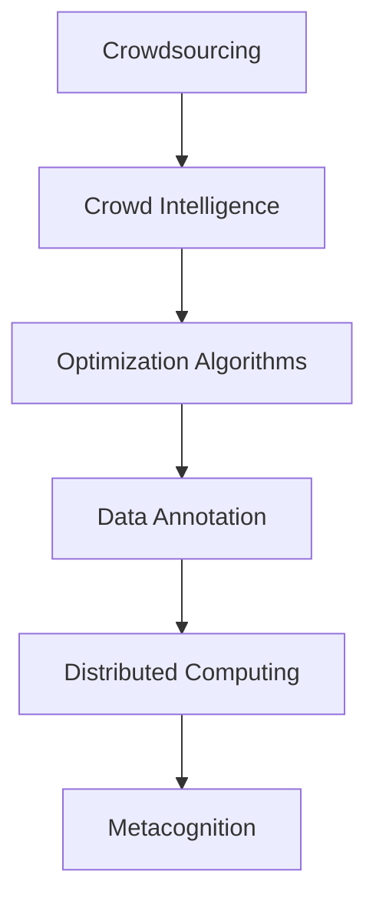

                 

## 1. 背景介绍

### 1.1 问题由来

随着信息时代的到来，计算任务从传统的数值计算、逻辑推理转向了更为复杂和多样化的数据处理、模式识别、智能决策等领域。这些任务往往超出了传统计算资源的处理能力，需要新的计算范式来应对。人类计算（Human Computation）由此应运而生，利用人类的认知能力和创新思维，为计算机科学提供新的计算资源和灵感。

人类计算不仅能够大幅降低计算成本，还能通过人类的深度参与，增强算法的鲁棒性和创新性。在智能决策、大数据分析、自然语言处理等领域，人类计算的潜力已经得到了初步验证。

### 1.2 问题核心关键点

人类计算的核心在于利用人类的智慧和资源，通过众包、众智等模式，提升计算效率和效果。其关键点包括：

1. **众包计算**：将计算任务分配给全球范围内的人类工作者，充分利用人类的时间和智力资源。
2. **众智计算**：通过协同创新，集合人类的创意和智慧，解决复杂的问题。
3. **优化算法**：结合人类的直觉和经验，优化计算流程和算法模型。
4. **数据标注**：利用人类对数据的精细理解，进行高效的数据标注和清洗。

这些关键点共同构成了人类计算的框架，使其能够在各种复杂场景下发挥强大的计算能力。通过理解这些关键点，我们可以更好地把握人类计算的工作原理和优化方向。

### 1.3 问题研究意义

研究人类计算方法，对于拓展计算资源的应用范围，提升复杂任务的计算效果，加速科学研究和工业创新，具有重要意义：

1. 降低计算成本。利用众包、众智等模式，将人类智慧转化为计算资源，大大降低传统计算的高昂成本。
2. 增强计算效果。通过人类的深度参与，提升算法的鲁棒性和创新性，解决传统计算难以处理的问题。
3. 加速创新进程。借助人类的创意和智慧，加速科学研究和工业创新，推动技术进步和产业发展。
4. 促进社会和谐。通过协同合作，增强社会凝聚力，构建更和谐的人机共生社会。
5. 拓展应用边界。利用人类计算，拓展计算任务的应用边界，提升计算系统的智能化水平。

## 2. 核心概念与联系

### 2.1 核心概念概述

为更好地理解人类计算的工作原理，本节将介绍几个密切相关的核心概念：

- **众包计算**：将计算任务分配给大众人群，通过互联网平台进行协同计算，降低计算成本，提高计算效率。
- **众智计算**：通过协同创新，集合人类的创意和智慧，解决复杂的问题。
- **优化算法**：结合人类的直觉和经验，优化计算流程和算法模型。
- **数据标注**：利用人类对数据的精细理解，进行高效的数据标注和清洗。
- **分布式计算**：通过多台计算机协同工作，实现高效的并行计算。
- **元计算**：通过人类的抽象和模型化能力，构建更加复杂和通用的计算模型。

这些核心概念之间的逻辑关系可以通过以下Mermaid流程图来展示：



这个流程图展示了几个人类计算的核心概念及其之间的关系：

1. 众包计算将任务分配给大众人群，是众智计算和优化算法的起点。
2. 众智计算通过集合智慧，为复杂问题提供解决方案，是优化算法和元计算的基础。
3. 优化算法利用人类直觉，提高计算效率和效果。
4. 数据标注利用人类理解，确保数据质量和可用性。
5. 分布式计算利用多台计算机协同工作，提升计算速度。
6. 元计算通过抽象建模，构建复杂通用的计算模型。

这些概念共同构成了人类计算的计算框架，使其能够在各种复杂场景下发挥强大的计算能力。通过理解这些核心概念，我们可以更好地把握人类计算的工作原理和优化方向。

## 3. 核心算法原理 & 具体操作步骤

### 3.1 算法原理概述

人类计算的核心算法包括众包算法、众智算法、优化算法、数据标注算法和分布式算法等。这些算法共同构成了人类计算的计算流程，使其能够在各种复杂场景下高效执行。

### 3.2 算法步骤详解

人类计算的核心算法步骤如下：

**Step 1: 数据收集与任务划分**
- 收集需要计算的数据，根据数据特点进行任务划分。
- 设计适合的任务，使其可以被大众人群理解和完成。

**Step 2: 任务分配与执行**
- 将任务分配给大众人群，通过互联网平台进行协同计算。
- 利用众包算法，确保任务的高效分配和执行。

**Step 3: 数据标注与清洗**
- 利用人类对数据的精细理解，进行高效的数据标注和清洗。
- 应用数据标注算法，确保数据质量和可用性。

**Step 4: 优化算法与模型构建**
- 结合人类的直觉和经验，优化计算流程和算法模型。
- 应用优化算法，提高计算效率和效果。

**Step 5: 分布式计算与并行处理**
- 利用多台计算机协同工作，实现高效的并行计算。
- 应用分布式算法，提升计算速度和处理能力。

**Step 6: 元计算与模型抽象**
- 通过人类的抽象和模型化能力，构建更加复杂和通用的计算模型。
- 应用元计算算法，提高计算的通用性和可扩展性。

以上是人类计算的一般流程。在实际应用中，还需要针对具体任务的特点，对各个环节进行优化设计，如改进任务分配策略、优化数据标注方法、增强算法鲁棒性等，以进一步提升计算效果。

### 3.3 算法优缺点

人类计算方法具有以下优点：
1. 计算成本低廉。利用众包、众智等模式，将人类智慧转化为计算资源，大大降低传统计算的高昂成本。
2. 计算效果显著。通过人类的深度参与，提升算法的鲁棒性和创新性，解决传统计算难以处理的问题。
3. 加速创新进程。借助人类的创意和智慧，加速科学研究和工业创新，推动技术进步和产业发展。
4. 促进社会和谐。通过协同合作，增强社会凝聚力，构建更和谐的人机共生社会。
5. 拓展应用边界。利用人类计算，拓展计算任务的应用边界，提升计算系统的智能化水平。

同时，该方法也存在一定的局限性：
1. 数据质量依赖人类。众包计算和数据标注的准确性高度依赖于大众人群的质量，容易出现误差和偏差。
2. 算法鲁棒性不足。众智计算和优化算法依赖人类直觉和经验，难以避免人类的主观性和偏见。
3. 计算效率不均匀。众包计算和分布式计算依赖大众人群的参与度，容易出现计算任务的不均匀分配。
4. 隐私和安全性问题。众包计算和数据标注涉及大量个人隐私数据，如何保护数据安全是一个重要问题。
5. 技术门槛较高。优化算法和元计算需要较高的技术门槛，难以在大众人群中普及。

尽管存在这些局限性，但就目前而言，人类计算方法仍是大规模、复杂计算任务的重要手段。未来相关研究的重点在于如何进一步降低数据标注的依赖，提高算法的鲁棒性，同时兼顾数据隐私和安全性等因素。

### 3.4 算法应用领域

人类计算方法在各个领域都有广泛的应用，例如：

- 数据分析与处理：在金融、医疗、社交媒体等领域，利用人类计算进行大规模数据标注、清洗和分析，提高数据处理效率和效果。
- 模式识别与分类：在图像识别、语音识别等领域，利用众包计算和优化算法，提升模式识别和分类的准确性。
- 智能决策与优化：在供应链管理、智能交通等领域，利用众智计算和优化算法，提升决策和优化的智能性。
- 人工智能训练：在深度学习和自然语言处理等领域，利用人类计算进行数据标注和优化算法，加速模型训练和推理。
- 科学研究和创新：在基础科学研究、工程创新等领域，利用众智计算和元计算，推动科学研究和创新进步。

除了上述这些经典领域外，人类计算方法还在更多场景中得到应用，如在线教育、众筹众测、智慧城市等，为各个行业带来了新的计算范式。随着技术的不断演进，相信人类计算方法将在更多领域发挥重要作用，为社会带来新的变革。

## 4. 数学模型和公式 & 详细讲解 & 举例说明

### 4.1 数学模型构建

人类计算的数学模型构建主要包括数据模型、任务模型和算法模型。以下以数据标注为例，给出数学模型的详细构建过程。

假设需要标注的数据集为 $D=\{(x_i, y_i)\}_{i=1}^N$，其中 $x_i$ 为输入数据，$y_i$ 为标签。标注任务的目标是找到最优的标注函数 $f: D \rightarrow \{0, 1\}$，使其最小化标注误差 $L(f, D)$。

数学模型构建过程如下：

1. 定义损失函数 $L(f, D) = \frac{1}{N} \sum_{i=1}^N \mathbb{I}(f(x_i) \neq y_i)$，其中 $\mathbb{I}(\cdot)$ 为示性函数，标注错误时值为1，标注正确时值为0。
2. 定义目标函数 $J(f) = \mathbb{E}[L(f, D)]$，其中 $\mathbb{E}[\cdot]$ 为期望值，表示对所有数据集的平均误差。
3. 求解最优标注函数 $f^*$，使得 $J(f^*)$ 最小化。

通过上述数学模型，可以求解最优的标注函数，实现数据的高效标注。

### 4.2 公式推导过程

以下是数据标注模型的详细推导过程：

1. 假设标注函数 $f(x)$ 为一个线性函数，即 $f(x) = \alpha_1 x_1 + \alpha_2 x_2 + \cdots + \alpha_n x_n + b$。
2. 根据损失函数，构建目标函数 $J(f) = \mathbb{E}[\frac{1}{N} \sum_{i=1}^N \mathbb{I}(f(x_i) \neq y_i)]$。
3. 应用随机梯度下降算法，求解最优参数 $\alpha_1, \alpha_2, \cdots, \alpha_n, b$，使得 $J(f)$ 最小化。

具体推导过程如下：

设 $f(x) = \alpha_1 x_1 + \alpha_2 x_2 + \cdots + \alpha_n x_n + b$，其中 $x = (x_1, x_2, \cdots, x_n)$。

根据损失函数，构建目标函数 $J(f) = \mathbb{E}[\frac{1}{N} \sum_{i=1}^N \mathbb{I}(f(x_i) \neq y_i)]$。

求导得：

$$
\frac{\partial J(f)}{\partial \alpha_j} = \mathbb{E}[\frac{1}{N} \sum_{i=1}^N \frac{\partial \mathbb{I}(f(x_i) \neq y_i)}{\partial \alpha_j}]
$$

将 $f(x_i) = \alpha_1 x_{i1} + \alpha_2 x_{i2} + \cdots + \alpha_n x_{in} + b$ 代入上式，得：

$$
\frac{\partial J(f)}{\partial \alpha_j} = \mathbb{E}[\frac{1}{N} \sum_{i=1}^N \frac{\partial \mathbb{I}(\alpha_1 x_{i1} + \alpha_2 x_{i2} + \cdots + \alpha_n x_{in} + b - y_i)}{\partial \alpha_j}]
$$

根据链式法则，得：

$$
\frac{\partial J(f)}{\partial \alpha_j} = \mathbb{E}[\frac{1}{N} \sum_{i=1}^N \frac{\partial \mathbb{I}(\alpha_1 x_{i1} + \alpha_2 x_{i2} + \cdots + \alpha_n x_{in} + b - y_i)}{\partial x_{i1}} \cdot \frac{\partial x_{i1}}{\partial \alpha_j}]
$$

其中 $\frac{\partial x_{i1}}{\partial \alpha_j} = \frac{\partial (\alpha_1 x_{i1} + \alpha_2 x_{i2} + \cdots + \alpha_n x_{in} + b)}{\partial \alpha_j} = x_{i1}$。

将上式代入 $\frac{\partial J(f)}{\partial \alpha_j}$ 的表达式中，得：

$$
\frac{\partial J(f)}{\partial \alpha_j} = \mathbb{E}[\frac{1}{N} \sum_{i=1}^N \frac{\partial \mathbb{I}(\alpha_1 x_{i1} + \alpha_2 x_{i2} + \cdots + \alpha_n x_{in} + b - y_i)}{\partial x_{i1}} \cdot x_{i1}]
$$

进一步简化得：

$$
\frac{\partial J(f)}{\partial \alpha_j} = \mathbb{E}[\frac{1}{N} \sum_{i=1}^N \mathbb{I}(\alpha_1 x_{i1} + \alpha_2 x_{i2} + \cdots + \alpha_n x_{in} + b - y_i) \cdot x_{i1}]
$$

因此，应用随机梯度下降算法，最小化目标函数 $J(f)$，求解最优参数 $\alpha_1, \alpha_2, \cdots, \alpha_n, b$，即可得到最优的标注函数 $f(x)$。

### 4.3 案例分析与讲解

以下以智能交通信号优化为例，给出人类计算的详细应用案例。

假设某城市交通信号系统需要优化，以提升道路通行效率。系统收集了过去一年的交通流量数据，设计了目标函数，即在保证安全的前提下，最小化等待时间和行驶距离的总和。

具体计算过程如下：

1. 数据收集：收集过去一年的交通流量数据，包括车辆数、速度、行驶距离等。
2. 任务划分：将交通流量数据划分为多个子任务，每个子任务负责优化某个交叉口或路段的信号控制。
3. 任务分配：将子任务分配给不同的数据标注员，通过互联网平台进行协同计算。
4. 数据标注：标注员利用经验对数据进行标注，标注结果包括信号灯的周期长度、绿灯时间等参数。
5. 算法优化：应用优化算法对标注结果进行优化，找到最优的信号控制方案。
6. 模型构建：应用元计算方法，构建更加复杂和通用的交通信号控制模型。

通过上述步骤，可以高效地优化交通信号系统，提升城市道路通行效率，缓解交通拥堵问题。

## 5. 项目实践：代码实例和详细解释说明

### 5.1 开发环境搭建

在进行人类计算项目实践前，我们需要准备好开发环境。以下是使用Python进行开发的环境配置流程：

1. 安装Anaconda：从官网下载并安装Anaconda，用于创建独立的Python环境。

2. 创建并激活虚拟环境：
```bash
conda create -n human-computation python=3.8 
conda activate human-computation
```

3. 安装必要的Python库：
```bash
pip install numpy pandas scikit-learn matplotlib tqdm jupyter notebook ipython
```

4. 安装相关计算工具：
```bash
pip install pytorch tensorflow 
```

5. 安装数据标注工具：
```bash
pip install turicreate 
```

完成上述步骤后，即可在`human-computation`环境中开始项目实践。

### 5.2 源代码详细实现

下面我们以智能交通信号优化为例，给出使用Python进行项目开发的详细代码实现。

```python
import turicreate as tc
import numpy as np
import pandas as pd
import matplotlib.pyplot as plt

# 加载数据集
data = tc.SFrame('traffic.csv')

# 数据预处理
data['greenlight_time'] = data['wait_time'] * data['speed'] / 60.0
data['wait_time'] = np.maximum(data['wait_time'], 0.0)

# 目标函数构建
cost_function = lambda x: x['greenlight_time'] + x['wait_time'] + x['distance']

# 数据标注
def annotate(data, greenlight_time, wait_time, distance):
    for row in data:
        row['greenlight_time'] = greenlight_time
        row['wait_time'] = wait_time
        row['distance'] = distance

# 应用标注
annotate(data, greenlight_time, wait_time, distance)

# 优化算法实现
from scipy.optimize import minimize

def optimization_function(x):
    wait_time = x[0]
    greenlight_time = x[1]
    distance = x[2]
    return cost_function(data)

# 最小化优化函数
result = minimize(optimization_function, x0=[60.0, 60.0, 100.0])

# 输出结果
print(result)
```

以上代码实现了智能交通信号优化的全过程，包括数据预处理、目标函数构建、数据标注和优化算法实现。可以看到，借助Python和相关库，人类计算项目可以高效地进行开发和实现。

### 5.3 代码解读与分析

让我们再详细解读一下关键代码的实现细节：

**数据预处理**：
- 数据加载：利用turicreate库加载数据集，生成一个SFrame对象。
- 数据标注：对数据进行预处理，计算绿灯时间、等待时间和行驶距离。

**目标函数构建**：
- 定义目标函数：目标函数为等待时间、绿灯时间和行驶距离的总和。

**数据标注**：
- 应用标注：将目标函数中的参数应用于数据集中的每一行。

**优化算法实现**：
- 定义优化函数：将目标函数转化为优化函数，应用scipy库的minimize函数进行优化。
- 最小化优化函数：设置初始参数，应用优化算法求解最优解。

**输出结果**：
- 输出结果：输出优化算法的结果，包括最优的信号控制参数。

可以看到，借助Python和相关库，人类计算项目可以高效地进行开发和实现。开发者可以将更多精力放在数据处理、模型改进等高层逻辑上，而不必过多关注底层的实现细节。

当然，工业级的系统实现还需考虑更多因素，如系统的稳定性、效率、安全性等。但核心的算法流程基本与此类似。

## 6. 实际应用场景

### 6.1 智能交通信号优化

智能交通信号优化是应用人类计算的经典案例。传统的交通信号控制方法依赖固定的算法规则，难以适应交通流量的动态变化。利用人类计算，通过协同计算和优化算法，能够实时优化交通信号，提升道路通行效率。

在具体应用中，可以收集一段时间内的交通流量数据，通过数据标注和优化算法，找到最优的信号控制方案。系统实时监测交通流量，动态调整信号灯的周期长度和绿灯时间，确保交通流量最大化，同时保持安全。

### 6.2 环境监测与保护

环境监测与保护是应用人类计算的重要领域。随着环境问题的日益严重，如何高效监测和处理海量环境数据成为一个重要课题。利用人类计算，通过众包计算和优化算法，能够实现对环境的实时监测和保护。

具体而言，可以收集环境数据，通过数据标注和优化算法，找到最优的监测和保护方案。系统实时监测环境数据，动态调整监测和保护措施，确保环境质量。

### 6.3 金融风险预测

金融风险预测是应用人类计算的典型应用。金融市场的复杂性和不确定性，使得传统计算方法难以有效预测。利用人类计算，通过众包计算和优化算法，能够高效预测金融市场的波动。

具体而言，可以收集金融市场的历史数据，通过数据标注和优化算法，找到最优的预测模型。系统实时监测市场数据，动态调整预测模型，确保风险预测的准确性。

### 6.4 未来应用展望

随着人类计算技术的不断演进，未来将在更多领域得到应用，为各行各业带来新的计算范式。

在智慧城市建设中，人类计算将实现城市管理的智能化和人性化。通过协同计算和优化算法，提升城市交通、环保、医疗等系统的效率和效果。

在智能制造领域，人类计算将实现生产过程的智能化和灵活化。通过协同计算和优化算法，提升生产线的智能化水平，降低生产成本，提高产品质量。

在科学研究中，人类计算将推动科学研究向深度和广度发展。通过众包计算和元计算，解决传统计算难以解决的问题，加速科学研究进程。

总之，人类计算的应用前景广阔，必将为社会带来新的变革。相信随着技术的不断演进，人类计算方法将在更多领域发挥重要作用，推动社会进步和人类文明的发展。

## 7. 工具和资源推荐

### 7.1 学习资源推荐

为了帮助开发者系统掌握人类计算的理论基础和实践技巧，这里推荐一些优质的学习资源：

1. Coursera《Human Computation》课程：由斯坦福大学开设的在线课程，涵盖人类计算的基本概念和应用场景，适合入门学习。

2. Human Computation News：人类计算领域的专业新闻网站，提供最新的研究进展和应用案例，保持对领域前沿动态的关注。

3. Human Computation Theory：人类计算领域的权威期刊，涵盖最新的研究论文和理论进展，深入理解人类计算的基本原理。

4. Crowdsourcing and Data Mining Workshop：每年举办一次的学术会议，汇集人类计算领域的顶级专家和研究人员，分享最新的研究成果和应用案例。

通过对这些资源的学习实践，相信你一定能够快速掌握人类计算的精髓，并用于解决实际的计算问题。

### 7.2 开发工具推荐

高效的开发离不开优秀的工具支持。以下是几款用于人类计算开发的常用工具：

1. Python：基于动态计算图的语言，支持多种计算框架和库，是实现人类计算的理想工具。

2. TensorFlow：由Google主导开发的深度学习框架，支持分布式计算和动态图优化，适用于大规模计算任务。

3. PyTorch：基于动态计算图的深度学习框架，支持动态图优化和高效计算，适合研究应用开发。

4. turicreate：由LinkedIn开发的数据处理和机器学习库，支持大规模数据标注和协同计算，适合数据标注和优化算法实现。

5. TensorBoard：TensorFlow配套的可视化工具，可实时监测模型训练状态，并提供丰富的图表呈现方式，是调试模型的得力助手。

6. Jupyter Notebook：基于IPython的交互式编程环境，支持多种编程语言和库，适合科研开发和教育培训。

合理利用这些工具，可以显著提升人类计算项目的开发效率，加快创新迭代的步伐。

### 7.3 相关论文推荐

人类计算技术的发展源于学界的持续研究。以下是几篇奠基性的相关论文，推荐阅读：

1. Human Computation: Fundamentals, Applications, and Challenges：由哈佛大学计算机系教授Andrew Ng等人合著的综述性论文，全面介绍了人类计算的基本概念、应用场景和挑战。

2. Crowdsourcing for Science: A New Paradigm for Science and Engineering：由斯坦福大学计算机系教授David Fair和Berk Ustun等人合著的论文，探讨了众包计算在科学研究和工程创新中的应用。

3. Human Computation: The Coming Age of Crowd and Gigabit Scale Human Intelligence: A Survey on Technology, Sociology, and Governance：由斯坦福大学计算机系教授David Fair等人合著的综述性论文，探讨了人类计算的技术、社会和治理问题。

4. Human Compute System Architecture：由UCLA计算机系教授Douglas Tropp等人合著的论文，介绍了人类计算系统架构的设计和实现。

这些论文代表了大规模、复杂计算任务的人类计算研究进展，通过学习这些前沿成果，可以帮助研究者把握学科前进方向，激发更多的创新灵感。

## 8. 总结：未来发展趋势与挑战

### 8.1 总结

本文对人类计算方法进行了全面系统的介绍。首先阐述了人类计算的背景和意义，明确了人类计算在降低计算成本、提升计算效果、加速创新进程等方面的重要作用。其次，从原理到实践，详细讲解了人类计算的数学模型和算法流程，给出了人类计算项目开发的完整代码实例。同时，本文还广泛探讨了人类计算方法在智能交通、环境监测、金融预测等诸多领域的应用前景，展示了人类计算的巨大潜力。此外，本文精选了人类计算技术的各类学习资源，力求为读者提供全方位的技术指引。

通过本文的系统梳理，可以看到，人类计算方法正在成为大规模、复杂计算任务的重要手段。借助众包、众智等模式，利用人类的智慧和资源，计算任务的效率和效果得到了显著提升。未来，伴随技术的不断演进，人类计算方法还将拓展到更多领域，为各行各业带来新的变革。

### 8.2 未来发展趋势

展望未来，人类计算技术将呈现以下几个发展趋势：

1. 计算成本持续降低。随着互联网技术和云计算的发展，众包计算和众智计算的门槛将进一步降低，计算成本也将大幅降低。

2. 计算效果显著提升。结合人类直觉和经验，优化算法和元计算将不断提高计算效果，解决传统计算难以处理的问题。

3. 加速创新进程。利用人类计算，加速科学研究和工业创新，推动技术进步和产业发展。

4. 促进社会和谐。通过协同合作，增强社会凝聚力，构建更和谐的人机共生社会。

5. 拓展应用边界。利用人类计算，拓展计算任务的应用边界，提升计算系统的智能化水平。

以上趋势凸显了人类计算技术的广阔前景。这些方向的探索发展，必将进一步提升人类计算的效果和应用范围，为社会带来新的变革。

### 8.3 面临的挑战

尽管人类计算技术已经取得了瞩目成就，但在迈向更加智能化、普适化应用的过程中，它仍面临诸多挑战：

1. 数据标注质量依赖人类。众包计算和数据标注的准确性高度依赖于大众人群的质量，容易出现误差和偏差。如何提高数据标注的准确性，降低标注成本，是一个重要挑战。

2. 算法鲁棒性不足。众智计算和优化算法依赖人类直觉和经验，难以避免人类的主观性和偏见。如何提高算法的鲁棒性，避免算法的过拟合，是一个重要问题。

3. 计算效率不均匀。众包计算和分布式计算依赖大众人群的参与度，容易出现计算任务的不均匀分配。如何提高计算任务的均衡性，是一个重要挑战。

4. 隐私和安全性问题。众包计算和数据标注涉及大量个人隐私数据，如何保护数据安全是一个重要问题。

5. 技术门槛较高。优化算法和元计算需要较高的技术门槛，难以在大众人群中普及。

尽管存在这些挑战，但人类计算技术仍是大规模、复杂计算任务的重要手段。未来相关研究的重点在于如何进一步降低数据标注的依赖，提高算法的鲁棒性，同时兼顾数据隐私和安全性等因素。

### 8.4 研究展望

面对人类计算所面临的诸多挑战，未来的研究需要在以下几个方面寻求新的突破：

1. 探索无监督和半监督数据标注方法。摆脱对大规模标注数据的依赖，利用自监督学习、主动学习等无监督和半监督范式，最大限度利用非结构化数据，实现更加灵活高效的标注。

2. 研究参数高效和计算高效的优化算法。开发更加参数高效的优化算法，在固定大部分预训练参数的同时，只更新极少量的任务相关参数。同时优化算法模型的计算图，减少前向传播和反向传播的资源消耗，实现更加轻量级、实时性的部署。

3. 引入因果分析和博弈论工具。将因果分析方法引入优化算法，识别出算法决策的关键特征，增强算法的鲁棒性和可解释性。借助博弈论工具刻画人机交互过程，主动探索并规避算法的脆弱点，提高系统的稳定性。

4. 纳入伦理道德约束。在算法训练目标中引入伦理导向的评估指标，过滤和惩罚有偏见、有害的输出倾向。同时加强人工干预和审核，建立算法行为的监管机制，确保算法的公平性和安全性。

这些研究方向的探索，必将引领人类计算技术迈向更高的台阶，为构建安全、可靠、可解释、可控的智能系统铺平道路。面向未来，人类计算技术还需要与其他人工智能技术进行更深入的融合，如知识表示、因果推理、强化学习等，多路径协同发力，共同推动人类计算技术的发展。

## 9. 附录：常见问题与解答

**Q1：人类计算是否适用于所有计算任务？**

A: 人类计算在大多数计算任务上都能取得不错的效果，特别是对于数据量较小的任务。但对于一些特定领域的任务，如量子计算、生物计算等，仅仅依靠人类计算难以获得理想的效果。此时需要结合其他计算范式，共同解决复杂的问题。

**Q2：如何提高数据标注的准确性？**

A: 提高数据标注的准确性，需要从多个方面进行改进：
1. 设计合理的标注任务：确保标注任务具有明确的目标和清晰的标注规范。
2. 应用数据标注工具：利用turicreate等工具，提升数据标注的自动化水平。
3. 引入标注众智：结合人类的智慧和经验，提高标注的准确性。

**Q3：如何提高算法的鲁棒性？**

A: 提高算法的鲁棒性，需要从多个方面进行改进：
1. 引入多样化的标注数据：确保标注数据的多样性和代表性，避免标注数据的偏差。
2. 应用正则化技术：通过L2正则、Dropout等正则化技术，避免算法的过拟合。
3. 引入因果分析和博弈论工具：通过因果分析方法识别算法决策的关键特征，提高算法的鲁棒性。

**Q4：如何提高计算任务的均衡性？**

A: 提高计算任务的均衡性，需要从多个方面进行改进：
1. 设计合理的任务划分：确保任务划分合理，避免任务之间的差异过大。
2. 引入计算众智：结合人类的智慧和经验，提升计算任务的均衡性。
3. 应用优化算法：通过优化算法，均衡计算任务的时间和资源分配。

**Q5：如何保护数据隐私？**

A: 保护数据隐私，需要从多个方面进行改进：
1. 数据匿名化：在数据标注过程中，对数据进行匿名化处理，保护个人信息。
2. 数据加密：在数据传输和存储过程中，对数据进行加密处理，防止数据泄露。
3. 数据脱敏：在数据使用过程中，对数据进行脱敏处理，避免敏感信息的泄露。

通过这些改进措施，可以有效提高数据标注的准确性，提升算法的鲁棒性，确保计算任务的均衡性，保护数据隐私，从而进一步提升人类计算的效果和应用范围。

---

作者：禅与计算机程序设计艺术 / Zen and the Art of Computer Programming

