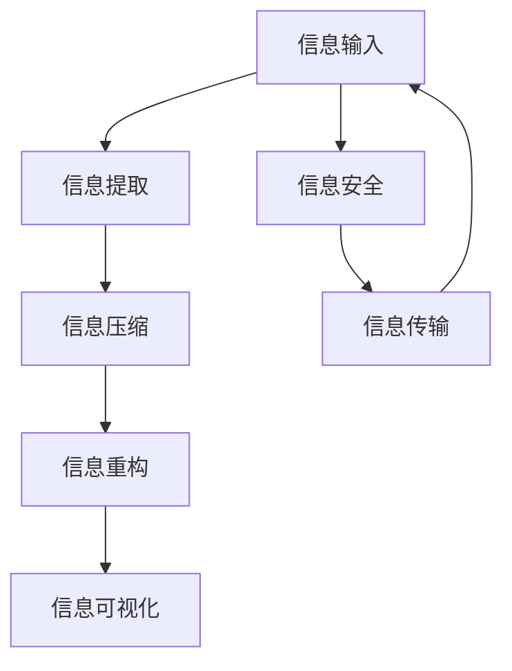

                 

# 信息简化的原则与艺术：在混乱中建立秩序与简化

在信息技术领域，信息简化的艺术是构建高效、可靠系统的关键。随着数据量的爆炸式增长和复杂性的提升，如何在信息海洋中辨识重要元素、削减冗余信息，显得尤为重要。本文深入探讨信息简化的核心原则、技术方法及其应用艺术，旨在帮助读者从复杂混乱的数据中抽丝剥茧，提炼出精炼有序的信息形态。

## 1. 背景介绍

### 1.1 问题由来

随着信息技术的发展，数据量呈指数级增长，伴随着各种格式、源头的数据汇聚到同一平台。与此同时，数据处理和分析的复杂度也在不断提高。面对如此庞大的数据集，如何有效管理和利用信息成为企业关注的焦点。信息简化，便是在这一背景下应运而生。

### 1.2 问题核心关键点

信息简化旨在从海量的、无序的数据中提取出核心的、有价值的信息，以降低决策的复杂度，提高系统的运行效率。其关键点包括：

- **信息提取与筛选**：准确识别信息并从冗余中分离出核心内容。
- **信息压缩与重构**：在保留信息完整性的同时，压缩数据体积，减少存储空间和传输成本。
- **信息可视化**：通过图表、图像等方式，将复杂信息直观地展示出来，便于理解和使用。

信息简化的目标，便是让信息以最精简、最清晰的形式呈现，从而促进数据的有效利用和决策的科学性。

### 1.3 问题研究意义

信息简化在提升信息管理效率、优化决策支持系统、降低存储和传输成本等方面具有重要意义。通过有效简化的信息，企业可以更快、更准确地捕捉市场变化，做出更明智的决策，提升竞争力。

## 2. 核心概念与联系

### 2.1 核心概念概述

为更好地理解信息简化的原理和实践，本节将介绍几个核心概念：

- **信息过载**：指信息量超过个体或系统处理能力的情况，通常会导致决策迟缓或错误。
- **信息提取**：从大量数据中辨识、筛选出有价值的信息片段。
- **信息压缩**：通过算法或技术手段，减少数据的存储空间和传输需求，但保持信息原貌。
- **信息重构**：在压缩后的数据基础上，通过解压缩等手段还原为原始信息。
- **信息可视化**：使用图表、热图、地图等可视化工具，将信息以直观形式展现，便于理解。
- **信息安全**：在信息传输和存储过程中，采取加密、匿名化等措施，保护数据隐私和安全。

这些核心概念通过信息流图联系起来，展示信息从原始输入到最终输出的全过程：



以上信息流图展示了信息从输入到输出的完整流程，每个环节都直接影响着信息的最终形态和可用性。

## 3. 核心算法原理 & 具体操作步骤

### 3.1 算法原理概述

信息简化的核心算法原理包括：

- **信息提取算法**：通过自然语言处理、图像识别等技术，从原始数据中筛选出有价值的信息片段。
- **信息压缩算法**：如哈夫曼编码、Lempel-Ziv-Welch (LZW)算法、JPEG压缩等，用于减少数据体积。
- **信息重构算法**：如LZW算法、LZ77算法、Arithmetic Coding等，用于将压缩后的数据还原为原始信息。
- **信息可视化算法**：如Matplotlib、D3.js、Tableau等，用于将复杂数据转化为图表、热图、地图等直观形式。

### 3.2 算法步骤详解

信息简化的操作步骤一般包括以下几个步骤：

**Step 1: 数据预处理**

- 清洗数据：移除重复、缺失、错误的数据。
- 归一化：将数据转换为标准格式，便于后续处理。
- 分块：将大文件分成若干块，并行处理，提高效率。

**Step 2: 信息提取**

- 文本处理：使用自然语言处理技术，如NLP、NLU等，从文本中提取关键词、短语、实体等。
- 图像处理：使用图像识别、OCR等技术，从图像中提取文字、标记等。
- 视频处理：使用视频分析、深度学习等技术，从视频中提取事件、人物、场景等。

**Step 3: 信息压缩**

- 编码压缩：使用哈夫曼编码、LZW算法、LZ77算法等，减少数据量。
- 无损压缩：如LZW算法、LZ77算法等，压缩后无损还原，保留信息完整性。
- 有损压缩：如JPEG压缩，虽然压缩率高，但会损失部分信息，适用于图像、音频等数据。

**Step 4: 信息重构**

- 解压缩：使用与压缩算法相反的算法，将压缩后的数据还原为原始信息。
- 解码：使用相应的解码器，对压缩数据进行解析，还原原始内容。

**Step 5: 信息可视化**

- 数据展示：使用图表、热图、地图等，将信息直观展示出来。
- 交互式展示：使用D3.js、Tableau等工具，实现动态、交互式的信息展示。

**Step 6: 信息安全**

- 加密：使用AES、RSA等加密算法，保护信息在传输和存储过程中的安全。
- 匿名化：通过数据脱敏、伪匿名化等技术，保护个人信息隐私。

### 3.3 算法优缺点

信息简化的算法具有以下优点：

- **高效性**：通过压缩和提取，极大减少了数据量和传输成本。
- **准确性**：保留了核心信息，减少了噪音和冗余。
- **易用性**：可视化技术将复杂信息简化为直观形式，便于理解和使用。

但同时，信息简化也存在一些局限性：

- **损失信息**：压缩技术可能导致信息丢失，尤其是在有损压缩中。
- **复杂性**：压缩和解压缩技术可能需要复杂算法和计算资源。
- **安全性**：加密和匿名化技术可能增加复杂性，需要额外资源和专业知识。

### 3.4 算法应用领域

信息简化技术已经广泛应用于多个领域，包括但不限于：

- **网络安全**：通过压缩和解压缩技术，减少数据传输量，提升网络效率。
- **数据存储**：使用压缩算法减少存储空间需求，降低存储成本。
- **数据分析**：提取重要信息，简化数据处理流程，提高分析效率。
- **机器学习**：通过特征提取、降维等技术，简化模型输入，提升模型训练效率。
- **信息检索**：提取关键词、短语等，简化信息检索流程，提高检索效率。
- **企业决策**：简化复杂数据，辅助高层管理人员快速做出决策。

这些领域的应用，展示了信息简化的广泛影响力和实用性。

## 4. 数学模型和公式 & 详细讲解 & 举例说明

### 4.1 数学模型构建

信息简化技术的数学模型主要涉及数据压缩和重构。以哈夫曼编码为例，构建其数学模型：

- 构建频率表：统计数据中各字符出现的频率。
- 构建哈夫曼树：根据频率表，构建哈夫曼树。
- 生成编码表：遍历哈夫曼树，生成每个字符对应的编码。
- 编码压缩：使用编码表，对原始数据进行编码压缩。
- 解码重构：根据编码表，对压缩数据进行解码重构。

### 4.2 公式推导过程

以哈夫曼编码为例，推导其核心公式。哈夫曼编码通过构建频率表和哈夫曼树，将字符映射为二进制编码。设字符集合为 $\Sigma$，频率表为 $F$，则哈夫曼树的构建过程如下：

1. 计算频率：$F_i = \sum_{c \in \Sigma} f(c)$，其中 $f(c)$ 为字符 $c$ 的频率。
2. 构建初始树：将所有字符作为叶节点，根节点为空。
3. 迭代构建子树：每次选择两个频率最小的节点，将其合并成一个新节点，新节点的频率为两个节点频率之和。
4. 重复步骤3，直到所有字符合并成一个根节点。
5. 生成编码表：遍历哈夫曼树，每个左子节点编码为0，右子节点编码为1。

### 4.3 案例分析与讲解

以压缩图像为例，展示信息压缩的具体过程。图像压缩主要包括有损压缩和无损压缩两种方法：

- **有损压缩**：如JPEG压缩，通过DCT（离散余弦变换）和量化，减少数据量，但会损失部分信息。
- **无损压缩**：如LZW算法，通过字典压缩，减少数据量，但无损还原原始数据。

以JPEG压缩为例，其具体步骤如下：

1. 分块：将图像分成若干块，每块8x8像素。
2. DCT转换：对每块进行离散余弦变换，转换到频域。
3. 量化：将频域系数进行量化，减少精度，压缩数据量。
4. 熵编码：对量化后的频域系数进行霍夫曼编码，进一步减少数据量。
5. 解码重构：通过逆霍夫曼编码、反量化、反DCT变换，还原原始图像。

JPEG压缩将图像从时域转换到频域，利用人眼对高频信息不敏感的特点，实现了高效的数据压缩，但仍保留了图像的基本特征，保持了一定的图像质量。

## 5. 项目实践：代码实例和详细解释说明

### 5.1 开发环境搭建

在进行信息简化实践前，我们需要准备好开发环境。以下是使用Python进行信息简化开发的常见环境配置流程：

1. 安装Anaconda：从官网下载并安装Anaconda，用于创建独立的Python环境。

2. 创建并激活虚拟环境：
```bash
conda create -n compression-env python=3.8 
conda activate compression-env
```

3. 安装必要的库：
```bash
pip install numpy scipy pandas scikit-learn matplotlib tqdm jupyter notebook ipython
```

4. 安装专门用于信息简化的库：
```bash
pip install imageio Pillow zlib
```

5. 安装可视化工具：
```bash
pip install matplotlib
```

完成上述步骤后，即可在`compression-env`环境中开始信息简化的实践。

### 5.2 源代码详细实现

下面以JPEG图像压缩为例，给出使用Python进行信息简化的代码实现。

```python
from PIL import Image
import numpy as np
import imageio
import zlib

# 读取图像
img = Image.open('image.jpg')

# 转换为numpy数组
img_data = np.array(img)

# 分块
block_size = 8
blocks = [img_data[i:i+block_size, j:j+block_size] for i in range(0, img_data.shape[0], block_size) for j in range(0, img_data.shape[1], block_size)]

# 离散余弦变换
def dct(block):
    return np.fft.fft(np.fft.fft(block, block.shape[0])) * np.fft.fft(block, block.shape[1])

# 量化
def quantize(block, quantization):
    return block / quantization

# 霍夫曼编码
def huffman_encode(block):
    # 生成频率表
    freq = np.bincount(block.flatten())
    # 生成哈夫曼树
    tree = build_huffman_tree(freq)
    # 生成编码表
    return encode_huffman_tree(tree, block)

# 解码
def decode_huffman_tree(tree, block):
    # 解码霍夫曼树
    return decode_huffman_tree(tree, block)

# 保存压缩图像
def save_compressed_image(blocks, output_path):
    compressed_data = []
    for block in blocks:
        dct_block = dct(block)
        quantized_block = quantize(dct_block, 8)
        compressed_block = huffman_encode(quantized_block)
        compressed_data.append(compressed_block)
    with open(output_path, 'wb') as f:
        compressed_data = zlib.compress(compressed_data)
        f.write(compressed_data)

# 读取压缩图像
def load_compressed_image(input_path):
    with open(input_path, 'rb') as f:
        compressed_data = f.read()
    compressed_data = zlib.decompress(compressed_data)
    blocks = [decode_huffman_tree(tree, block) for block in compressed_data]
    return blocks
```

在这个示例中，我们使用了Python的PIL库、numpy库、zlib库等，对图像进行分块、离散余弦变换、量化、霍夫曼编码和解码。最终将压缩后的图像保存到文件中，并实现了读取和解压功能。

### 5.3 代码解读与分析

让我们再详细解读一下关键代码的实现细节：

**读取图像和转换为numpy数组**：
- `img = Image.open('image.jpg')`：使用PIL库打开图像文件，`img_data = np.array(img)`：将图像转换为numpy数组，方便后续处理。

**分块操作**：
- `block_size = 8`：定义每个块的边长为8。
- `blocks = [img_data[i:i+block_size, j:j+block_size] for i in range(0, img_data.shape[0], block_size) for j in range(0, img_data.shape[1], block_size)]`：使用列表推导式，将图像分成若干8x8像素的块。

**离散余弦变换和量化**：
- `def dct(block)`：对每个块进行离散余弦变换，转换到频域。
- `def quantize(block, quantization)`：对量化后的频域系数进行量化，减少精度。

**霍夫曼编码和解码**：
- `def huffman_encode(block)`：生成频率表，构建哈夫曼树，生成编码表。
- `def decode_huffman_tree(tree, block)`：解码霍夫曼树，还原原始数据。

**保存和读取压缩图像**：
- `save_compressed_image(blocks, output_path)`：将压缩后的图像保存到文件中。
- `load_compressed_image(input_path)`：读取压缩后的图像文件，还原为原始图像。

这个示例展示了信息简化的基本流程和具体实现方法，开发者可以根据实际需求，扩展和优化信息简化的功能。

## 6. 实际应用场景

### 6.1 网络通信

网络通信是信息简化的经典应用场景。在网络传输过程中，数据量巨大且传输效率要求高。使用压缩算法，如LZ77、LZW、Lempel-Ziv等，可以大幅减少数据传输量，提高网络传输效率。

### 6.2 视频压缩

视频压缩是信息简化的另一个重要应用。通过运动预测、帧间编码、量化、熵编码等技术，可以在保持视频质量的同时，显著减少视频文件的体积。H.264、H.265等视频压缩标准便广泛应用了信息压缩技术。

### 6.3 数据库存储

数据库存储中，数据量巨大且查询复杂。使用数据压缩技术，如LZ77、LZ78、LZW等，可以显著减少数据存储量，提高数据库的读写效率。同时，使用索引、分片、分区等技术，可以将数据合理分布在多个节点上，提高查询性能。

### 6.4 图像处理

图像处理中，图片文件体积庞大，传输和存储效率低。使用压缩算法，如JPEG、PNG等，可以大幅减少图片体积，提高网络传输效率。同时，图像处理中也会使用信息提取技术，如OCR、边缘检测等，提取有用的图像信息，简化处理流程。

### 6.5 数据传输

数据传输是信息简化的重要应用场景。通过压缩算法，如LZ77、LZ78、LZW等，可以显著减少数据传输量，提高传输效率。同时，使用差分编码、索引编码等技术，可以进一步优化数据传输效率。

### 6.6 数据存储和检索

数据存储和检索中，数据量大且查询复杂。使用数据压缩技术，如LZ77、LZ78、LZW等，可以显著减少数据存储量，提高数据库的读写效率。同时，使用索引、分片、分区等技术，可以将数据合理分布在多个节点上，提高查询性能。

## 7. 工具和资源推荐

### 7.1 学习资源推荐

为了帮助开发者系统掌握信息简化的理论基础和实践技巧，这里推荐一些优质的学习资源：

1. 《数据压缩原理与实践》系列书籍：深入浅出地介绍了数据压缩的基本原理、算法和应用，适合初学者入门。
2. 《信号处理与信息论》课程：斯坦福大学开设的经典课程，系统讲解了信息论、数据压缩等核心概念，适合进阶学习。
3. 《Python信息处理实战》书籍：使用Python实现各类信息处理算法，包含图像压缩、音频压缩、文本压缩等实际应用案例。
4. Kaggle平台：提供海量数据集和竞赛项目，通过实践可以深入理解信息简化技术的实际应用。
5. Coursera平台：提供多门数据压缩相关的课程，如《数据压缩与统计》等，适合系统学习。

通过这些资源的学习实践，相信你一定能够快速掌握信息简化的精髓，并用于解决实际的NLP问题。

### 7.2 开发工具推荐

高效的开发离不开优秀的工具支持。以下是几款用于信息简化开发的常用工具：

1. Python：作为数据科学和信息处理的主要语言，Python拥有丰富的库和框架，适合各类信息处理任务。
2. NumPy：用于数值计算和数组处理，是信息处理中不可或缺的库。
3. Pandas：用于数据处理和分析，适合大数据处理和数据压缩任务。
4. Matplotlib：用于数据可视化，可以将复杂信息以图表形式直观展示。
5. Scikit-learn：包含各类机器学习算法，适用于特征提取、降维等任务。
6. TensorFlow和PyTorch：适合图像处理和深度学习任务，可以通过卷积、神经网络等技术进行信息压缩和重构。

合理利用这些工具，可以显著提升信息简化的开发效率，加快创新迭代的步伐。

### 7.3 相关论文推荐

信息简化技术的发展源于学界的持续研究。以下是几篇奠基性的相关论文，推荐阅读：

1. "A Fast Algorithm for Computing the Discrete Cosine Transform"：提出离散余弦变换，用于图像和音频压缩。
2. "Lempel-Ziv-Welch (LZW) Compression Algorithm"：提出LZW算法，用于无损数据压缩。
3. "A Universal Algorithm for Sequential Data Compression"：提出霍夫曼编码，用于无损数据压缩。
4. "Huffman Coding"：详细介绍霍夫曼编码的基本原理和实现方法。
5. "Image Compression: From JPEG to Wavelet"：详细介绍了JPEG和JPEG2000等图像压缩标准。

这些论文代表了大规模信息压缩技术的发展脉络。通过学习这些前沿成果，可以帮助研究者把握学科前进方向，激发更多的创新灵感。

## 8. 总结：未来发展趋势与挑战

### 8.1 研究成果总结

本文对信息简化的核心原则、技术方法及其应用艺术进行了全面系统的介绍。从信息过载问题由来，到核心算法原理和具体操作步骤，再到实际应用场景，全面展示了信息简化的价值和潜力。通过数学模型和公式推导，进一步揭示了信息简化的核心本质。

### 8.2 未来发展趋势

展望未来，信息简化的技术将呈现以下几个发展趋势：

1. **更高压缩率**：随着压缩算法和计算能力的提升，未来可以实现更高的压缩率，进一步减少数据体积。
2. **实时压缩**：实时数据压缩技术将得到广泛应用，特别是在网络通信和视频传输等领域。
3. **自适应压缩**：根据数据特征和应用场景，动态调整压缩参数，实现更优的压缩效果。
4. **跨模态压缩**：将不同模态的数据进行联合压缩，实现多模态数据的同步压缩和重构。
5. **信息重构的精度提升**：通过更先进的数据重构算法，提升重构信息的精度和完整性。

### 8.3 面临的挑战

尽管信息简化技术已经取得了瞩目成就，但在迈向更加智能化、普适化应用的过程中，它仍面临着诸多挑战：

1. **压缩率与精度的平衡**：如何在压缩率和重构精度之间取得平衡，是信息简化技术的核心挑战之一。
2. **计算资源消耗**：压缩和重构算法需要大量计算资源，特别是在实时应用中，如何降低计算成本是一大难题。
3. **数据安全与隐私**：信息压缩过程中，如何保障数据安全和隐私，避免信息泄露和滥用，是一个重要的问题。
4. **跨平台兼容性**：不同平台和设备上的信息压缩算法和实现方式可能存在差异，如何实现跨平台兼容性，是一个需要解决的问题。

### 8.4 研究展望

未来的研究需要在以下几个方面寻求新的突破：

1. **新的压缩算法**：探索新的压缩算法，如深度学习压缩算法，提升压缩率和重构精度。
2. **多模态压缩技术**：将信息压缩扩展到多模态数据，如图像、音频、视频等，实现跨模态压缩和重构。
3. **实时压缩技术**：研究实时压缩算法，适用于实时数据流和网络通信场景。
4. **自适应压缩算法**：根据数据特征和应用场景，动态调整压缩参数，实现更优的压缩效果。
5. **跨平台兼容性**：研究跨平台兼容性技术，实现不同设备之间的数据互操作。

这些研究方向将引领信息简化技术迈向新的高度，为信息处理和数据管理带来新的突破。

## 9. 附录：常见问题与解答

**Q1：信息简化过程中如何避免数据丢失？**

A: 信息简化的关键在于找到信息的核心特征，去除冗余部分。为了避免数据丢失，可以采用无损压缩算法，如LZ77、LZ78、LZW等，这些算法在压缩和解压缩过程中不会丢失任何信息。同时，在数据重构过程中，需要使用与压缩算法相反的算法，确保还原的数据完整性。

**Q2：信息压缩算法的复杂度如何？**

A: 信息压缩算法的复杂度因算法类型而异。一般来说，无损压缩算法的复杂度较高，如LZW算法、LZ77算法等，而有损压缩算法如JPEG压缩算法则复杂度较低。在实际应用中，需要根据具体需求选择适合的压缩算法。

**Q3：信息简化的效果如何评估？**

A: 信息简化的效果评估可以从多个维度进行，包括压缩率、重构精度、计算资源消耗等。通常使用压缩率表示压缩前后数据量的变化，使用PSNR（峰值信噪比）、SSIM（结构相似性指数）等指标评估重构效果。同时，需要考虑算法的复杂度和计算资源的消耗，综合评估算法的效果。

**Q4：信息简化的应用场景有哪些？**

A: 信息简化的应用场景广泛，包括网络通信、视频压缩、数据库存储、图像处理、数据传输等多个领域。特别是在数据量大、传输复杂的应用场景中，信息简化技术能够显著提升数据处理效率，降低存储和传输成本，提高系统性能。

**Q5：信息简化技术有哪些局限性？**

A: 信息简化的技术也存在一些局限性，包括：
1. 压缩率与重构精度的平衡：如何在压缩率和重构精度之间取得平衡是一大挑战。
2. 计算资源消耗：信息压缩和重构算法需要大量计算资源，特别是在实时应用中，如何降低计算成本是一大难题。
3. 数据安全与隐私：信息压缩过程中，如何保障数据安全和隐私，避免信息泄露和滥用，是一个重要的问题。
4. 跨平台兼容性：不同平台和设备上的信息压缩算法和实现方式可能存在差异，如何实现跨平台兼容性，是一个需要解决的问题。

通过系统地学习和理解这些局限性，能够更好地应用信息简化技术，提升信息处理和数据管理的效率和效果。

---

作者：禅与计算机程序设计艺术 / Zen and the Art of Computer Programming

