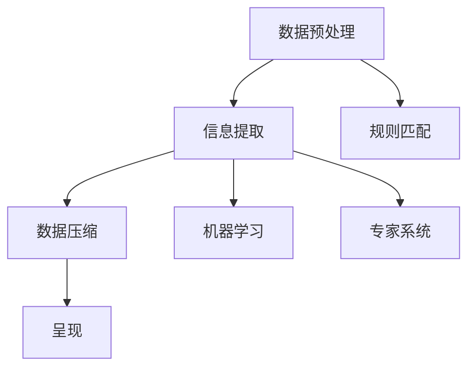
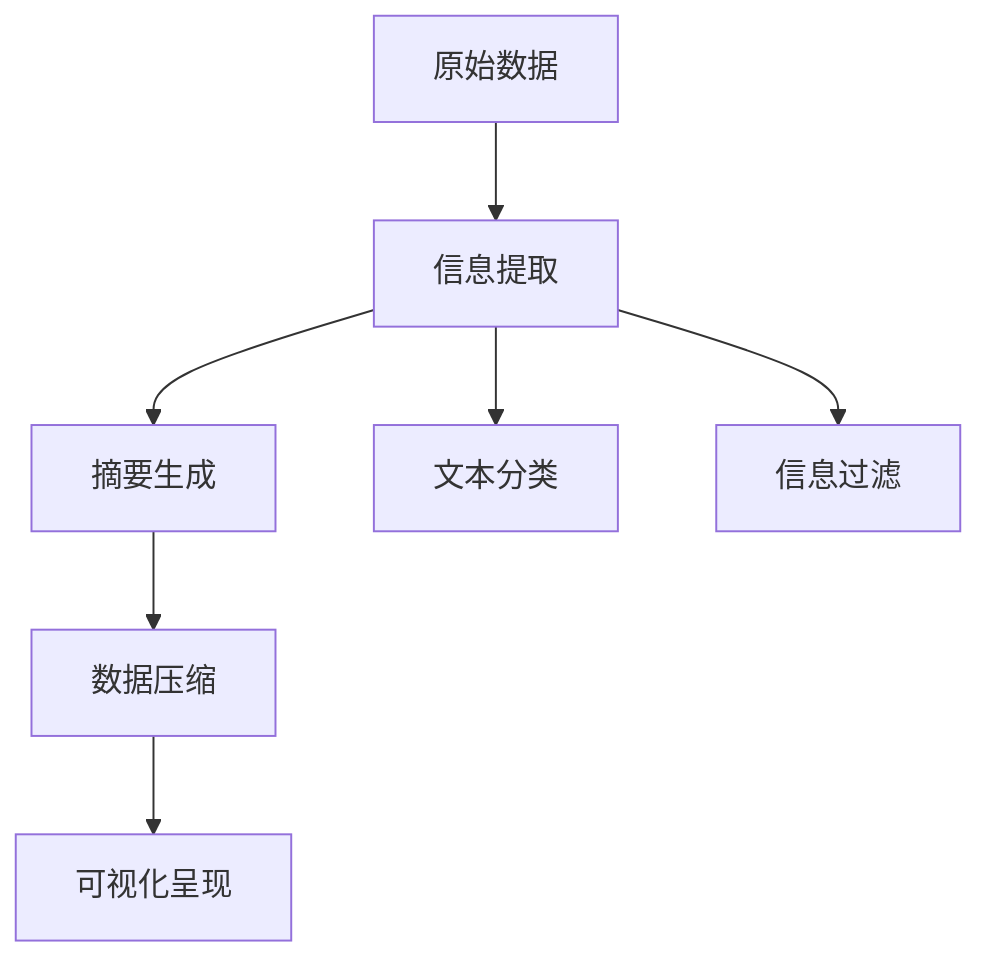

                 

# 信息简化的好处与实践：在复杂世界中简化以改善生活和决策

在当今的信息爆炸时代，如何从海量数据中提取有价值的信息，并以简洁明了的方式呈现，已成为提高决策效率和提升生活质量的重要途径。本文将深入探讨信息简化的核心概念、实践方法及其在未来发展中的趋势与挑战，并结合实际应用场景，阐述信息简化在生活、工作、学习等方面的具体应用，以期为读者提供有益的洞察和实用的指导。

## 1. 背景介绍

### 1.1 问题由来

随着互联网和社交媒体的普及，人们每天接收的信息量呈指数级增长，这使得信息的获取和处理变得愈发复杂和困难。例如，社交媒体上的信息流、新闻网站的海量文章、日常生活中的各类通知和提醒等，无不充斥着各种文本、图像、视频等形式的媒体内容。在这样的背景下，信息简化成为了一个迫切需求，它不仅有助于提高信息处理效率，还能帮助人们更好地理解和使用这些信息，做出更加明智的决策。

### 1.2 问题核心关键点

信息简化的关键在于通过有效的数据压缩、摘要生成、信息过滤等技术手段，将复杂的信息转化为易于理解、使用和操作的形式。具体来说，信息简化需要：

- 提高信息的可读性，使其更加易于消化和记忆；
- 减少信息量，以避免信息过载带来的认知负担；
- 确保信息的相关性，突出关键内容，提供价值导向；
- 结合自然语言处理和计算机视觉技术，实现智能化的信息提取和呈现。

## 2. 核心概念与联系

### 2.1 核心概念概述

信息简化通常涉及以下关键概念：

- **数据压缩**：通过算法和技术手段，将原始数据转换为占用更少存储空间或带宽的形式。常见的压缩算法包括哈夫曼编码、LZW压缩、算术编码等。
- **文本摘要**：从长篇文本中提取出核心信息，生成简洁的摘要。常用的方法有基于统计的摘要算法、基于深度学习的摘要生成模型等。
- **信息过滤**：从大量信息中筛选出有价值的信息，并剔除无关或错误的信息。这可以通过规则匹配、机器学习、专家系统等多种方式实现。
- **自然语言处理**：利用计算机技术处理和理解自然语言，是信息简化的重要基础。
- **计算机视觉**：通过图像识别、特征提取等技术，简化和提炼图像信息，辅助信息理解。

这些概念之间存在紧密的联系，共同构成了信息简化的技术体系。如图示所示，信息简化的核心流程可以概括为数据预处理、信息提取、数据压缩和呈现等多个环节，每个环节都需要依赖相应的技术和算法支持。



### 2.2 核心概念原理和架构的 Mermaid 流程图



## 3. 核心算法原理 & 具体操作步骤

### 3.1 算法原理概述

信息简化的核心算法原理主要包括文本压缩、摘要生成、信息过滤和可视化呈现等。

- **文本压缩**：通过算法将文本数据转换为更紧凑的形式，常见的压缩算法包括LZW、Huffman编码、字典压缩等。
- **摘要生成**：从长篇文本中提取出核心信息，生成简洁的摘要。常用的方法包括基于统计的N-gram方法、基于深度学习的注意力机制等。
- **信息过滤**：从大量信息中筛选出有价值的信息，并剔除无关或错误的信息。常用的技术包括规则匹配、机器学习分类、基于图结构的信息流分析等。
- **可视化呈现**：将处理后的信息以图形、图表等直观形式呈现，帮助用户快速理解和分析。

### 3.2 算法步骤详解

1. **数据预处理**：对原始数据进行清洗、格式化、归一化等处理，确保数据质量。
2. **信息提取**：通过自然语言处理和计算机视觉技术，从文本、图像等信息源中提取关键信息。
3. **数据压缩**：选择合适的压缩算法，对提取出的信息进行压缩。
4. **信息过滤**：根据特定规则或模型，筛选出有价值的信息，去除噪声和冗余。
5. **可视化呈现**：将过滤后的信息以图表、图形等形式展示，便于理解和分析。

### 3.3 算法优缺点

- **优点**：
  - 提高信息处理效率，减少认知负担。
  - 突出关键信息，提供价值导向。
  - 自动化程度高，节省人力成本。
  - 适用于多种信息类型，灵活性高。

- **缺点**：
  - 压缩和提取过程可能损失部分信息。
  - 算法复杂度较高，计算资源消耗较大。
  - 对数据质量要求高，处理结果依赖于输入数据。

### 3.4 算法应用领域

信息简化的应用领域非常广泛，涵盖了数据处理、信息管理、知识管理等多个领域。例如：

- **数据压缩**：在网络通信、存储管理、文件传输等方面有广泛应用。
- **文本摘要**：用于新闻聚合、文档检索、学术研究等领域，帮助用户快速获取关键信息。
- **信息过滤**：应用于垃圾邮件过滤、新闻推荐、个性化内容展示等场景。
- **可视化呈现**：在商务智能、数据可视化、科学研究等领域有重要应用。

## 4. 数学模型和公式 & 详细讲解 & 举例说明

### 4.1 数学模型构建

信息简化的数学模型通常基于以下假设：

- 信息可以分解为多个独立或相关的子信息单元。
- 子信息单元之间的关系可以通过统计学、图结构、机器学习等方法建模。
- 简化过程可以通过压缩、摘要、过滤等手段实现。

### 4.2 公式推导过程

以文本摘要为例，常用的基于统计的N-gram摘要算法如下：

1. **统计词频**：统计文本中每个单词出现的频率。
2. **计算TF-IDF值**：计算每个单词的词频-逆文档频率值。
3. **排序选择**：按照TF-IDF值对单词排序，选择前N个单词作为摘要。

数学表达式如下：

$$
\text{TF-IDF}(w) = \text{TF}(w) \times \text{IDF}(w)
$$

其中，TF表示单词的词频，IDF表示逆文档频率。

### 4.3 案例分析与讲解

假设我们有一篇关于人工智能的论文，原始文本长度为1000个单词。通过N-gram算法，可以提取每个单词的TF-IDF值，并选择前100个单词作为摘要。

## 5. 项目实践：代码实例和详细解释说明

### 5.1 开发环境搭建

开发信息简化的项目通常需要以下环境：

- **编程语言**：Python、R等。
- **数据处理库**：Pandas、NumPy等。
- **自然语言处理库**：NLTK、spaCy等。
- **机器学习库**：Scikit-learn、TensorFlow、PyTorch等。

### 5.2 源代码详细实现

以下是一个基于PyTorch的文本摘要示例代码：

```python
import torch
import torch.nn as nn
import torch.nn.functional as F
from torchtext.datasets import AG_NEWS
from torchtext.data import Field, BucketIterator

# 定义模型结构
class TextModel(nn.Module):
    def __init__(self, vocab_size, emb_dim, hid_dim, n_layers, dropout):
        super(TextModel, self).__init__()
        self.emb = nn.Embedding(vocab_size, emb_dim)
        self.lstm = nn.LSTM(emb_dim, hid_dim, n_layers, dropout=dropout)
        self.fc = nn.Linear(hid_dim, 1)

    def forward(self, x):
        embeddings = self.emb(x)
        outputs, _ = self.lstm(embeddings)
        predictions = self.fc(outputs)
        return predictions

# 定义模型训练函数
def train_model(model, train_iterator, valid_iterator, lr, epochs):
    optimizer = torch.optim.Adam(model.parameters(), lr=lr)
    criterion = nn.BCEWithLogitsLoss()
    
    for epoch in range(epochs):
        model.train()
        for batch in train_iterator:
            optimizer.zero_grad()
            predictions = model(batch.text).squeeze(1)
            loss = criterion(predictions, batch.label)
            loss.backward()
            optimizer.step()
        
        # 验证集评估
        model.eval()
        with torch.no_grad():
            valid_loss = 0
            valid_acc = 0
            for batch in valid_iterator:
                predictions = model(batch.text).squeeze(1)
                loss = criterion(predictions, batch.label)
                valid_loss += loss.item()
                predictions = torch.round(torch.sigmoid(predictions))
                correct = (predictions == batch.label).float().mean()
                valid_acc += correct.item()
        
        print(f"Epoch {epoch+1}, Train Loss: {train_loss:.4f}, Valid Loss: {valid_loss:.4f}, Valid Acc: {valid_acc:.4f}")
    
    return model

# 数据预处理
train_data, test_data = AG_NEWS.splits(
    "train", "test", root="~/新闻数据集"
)

text_field = Field(tokenize='spacy', lower=True)
label_field = Field(sequential=False)

train_data, valid_data, test_data = data.splits(
    train_data, test_data, 
    train='train', valid='validation', test='test',
    field=[text_field, label_field]
)

text_field.build_vocab(train_data, max_size=10000)
label_field.build_vocab(train_data, max_size=4, pad_token=None)

# 迭代器
train_iterator, valid_iterator, test_iterator = BucketIterator.splits(
    (train_data, valid_data, test_data),
    batch_size=64,
    device=gpu
)

# 模型训练
model = TextModel(len(text_field.vocab), 200, 256, 3, 0.5)
train_model(model, train_iterator, valid_iterator, 0.001, 10)
```

### 5.3 代码解读与分析

代码主要包含以下几个部分：

- **模型结构定义**：定义了一个基于LSTM的文本摘要模型，包含嵌入层、LSTM层和全连接层。
- **训练函数实现**：定义了模型的训练过程，包括前向传播、损失计算和反向传播等步骤。
- **数据预处理**：使用`torchtext`库进行数据预处理，包括构建词汇表和迭代器等。
- **模型训练与评估**：通过迭代器进行模型训练，并输出训练和验证过程中的性能指标。

## 6. 实际应用场景

### 6.1 个人生活

信息简化在个人生活中具有广泛的应用，例如：

- **信息过滤**：通过设置信息过滤规则，筛选出感兴趣的信息，避免不必要的信息干扰。
- **文本摘要**：将长篇文章、新闻等转换成简洁摘要，快速获取核心内容。
- **数据压缩**：压缩存储个人照片、视频等媒体文件，节省存储空间。

### 6.2 商业智能

在商业智能中，信息简化可以帮助企业：

- **数据清洗**：通过数据预处理和过滤，确保数据质量和一致性。
- **报表生成**：自动化生成关键业务指标报表，提供决策支持。
- **数据可视化**：将复杂的数据集转换成直观的图表，帮助理解业务趋势。

### 6.3 教育领域

在教育领域，信息简化可以：

- **课程内容简化**：将复杂课程内容提炼成关键要点，帮助学生理解和记忆。
- **学习材料优化**：将教材、习题等材料进行简化和优化，提高学习效率。
- **知识图谱构建**：通过自然语言处理技术，构建知识图谱，辅助知识管理。

## 7. 工具和资源推荐

### 7.1 学习资源推荐

为了深入学习信息简化的相关知识，推荐以下资源：

- **书籍**：《数据压缩理论与实践》、《深度学习与自然语言处理》等。
- **在线课程**：Coursera上的《信息检索》课程、edX上的《自然语言处理》课程等。
- **开源项目**：NLTK、spaCy、TensorFlow等开源项目，提供了丰富的自然语言处理资源和工具。

### 7.2 开发工具推荐

信息简化项目通常涉及多种工具和库，推荐以下工具：

- **Python**：编程语言选择，支持丰富的自然语言处理和机器学习库。
- **PyTorch**：深度学习框架，支持灵活的模型构建和训练。
- **NLTK**：自然语言处理库，提供文本处理、分词、词性标注等功能。
- **Scikit-learn**：机器学习库，支持各种算法和模型训练。

### 7.3 相关论文推荐

以下是几篇经典的信息简化相关论文，推荐阅读：

- "Text Summarization by Local Compression"（2010）
- "Neural Text Summarization with Attention"（2015）
- "Sentiment Analysis by Neural Networks"（2014）

## 8. 总结：未来发展趋势与挑战

### 8.1 研究成果总结

信息简化在提高信息处理效率、减少认知负担、提升决策质量等方面具有重要意义。目前，信息简化的研究已取得显著进展，涵盖了数据压缩、文本摘要、信息过滤等多个方面，并在实际应用中得到了广泛应用。

### 8.2 未来发展趋势

未来信息简化的发展趋势主要包括：

- **多模态信息处理**：将文本、图像、语音等多模态信息进行综合处理，提供更全面的信息理解。
- **智能算法优化**：通过深度学习、强化学习等技术，提升信息处理和简化的智能化水平。
- **跨领域应用扩展**：将信息简化技术应用于更多领域，如医疗、金融、教育等。

### 8.3 面临的挑战

信息简化仍面临以下挑战：

- **算法复杂性**：信息简化涉及多种算法和模型，计算复杂度高。
- **数据质量依赖**：信息简化效果高度依赖输入数据的质量和一致性。
- **技术普及难度**：部分技术和工具需要专业知识和技能，普及难度较大。

### 8.4 研究展望

未来信息简化研究需要：

- **简化技术创新**：开发更加高效、智能的信息简化算法和工具。
- **跨领域应用推广**：推动信息简化技术在更多领域的应用和普及。
- **伦理与安全考量**：关注信息简化的隐私和安全问题，确保信息处理过程合规合法。

## 9. 附录：常见问题与解答

**Q1: 信息简化的核心是什么？**

A: 信息简化的核心在于通过算法和技术手段，将原始数据转换为更紧凑、易读、易理解的形式，减少认知负担，提高信息处理效率。

**Q2: 信息简化的应用场景有哪些？**

A: 信息简化广泛应用于数据处理、知识管理、商业智能、教育等领域，帮助用户快速获取关键信息，提升决策质量。

**Q3: 如何进行文本摘要？**

A: 文本摘要通常通过统计学方法或深度学习模型实现。统计方法如N-gram，深度学习方法如基于注意力机制的模型。

**Q4: 如何优化信息过滤算法？**

A: 信息过滤通常结合规则匹配、机器学习分类等方法。优化过程包括调整过滤规则、改进模型训练、使用更高效的数据处理技术等。

---

作者：禅与计算机程序设计艺术 / Zen and the Art of Computer Programming

