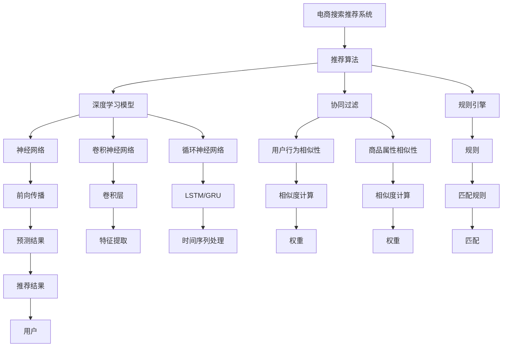

                 

# 大数据时代的电商搜索推荐：AI 模型融合技术是核心

## 1. 背景介绍

在数字化时代，电商平台的搜索推荐系统已成为提升用户体验、促进交易转化率的关键。随着用户需求的多样化，传统的推荐算法已经难以满足日益复杂多变的市场需求。大数据和人工智能技术的迅猛发展，为电商搜索推荐系统的升级迭代带来了新的契机。其中，AI模型融合技术，通过对多种智能算法的整合优化，已经成为构建智能推荐系统的核心。

本文旨在深入探讨AI模型融合技术在电商搜索推荐中的应用，从理论到实践，全面分析其在推荐系统中的融合策略、优化方法、性能提升等方面，为电商平台的搜索推荐系统提供系统性的指导。

## 2. 核心概念与联系

### 2.1 核心概念概述

为更好地理解AI模型融合技术，首先对几个核心概念进行概述：

- **电商搜索推荐系统**：指通过分析用户行为数据，对商品进行分类、排序，向用户推荐可能感兴趣的商品的系统。推荐系统一般由召回和排序两个子系统构成。
- **推荐算法**：指根据用户历史行为、商品属性等信息，预测用户对商品的偏好和选择概率，从而进行推荐的技术。
- **AI模型融合技术**：指将多种人工智能模型，如深度学习模型、协同过滤模型、规则引擎等，通过有效融合提升推荐系统性能的方法。
- **深度学习模型**：如神经网络、卷积神经网络(CNN)、循环神经网络(RNN)等，是构建推荐系统的重要工具。
- **协同过滤**：通过用户行为相似性、商品属性相似性等维度，进行推荐的技术。
- **规则引擎**：通过规则匹配，进行精确推荐的技术。
- **模型融合**：指将不同模型结合，发挥各自优势，构建更加复杂、稳健的推荐系统。

### 2.2 核心概念原理和架构的 Mermaid 流程图(Mermaid 流程节点中不要有括号、逗号等特殊字符)



## 3. 核心算法原理 & 具体操作步骤

### 3.1 算法原理概述

AI模型融合技术的核心在于将多种推荐算法进行有机结合，形成功能互补、相互协同的推荐系统。其基本原理可以概括为以下几步：

1. **数据预处理**：对原始数据进行清洗、归一化、特征提取等处理，构建输入特征。
2. **模型训练**：利用深度学习模型、协同过滤模型、规则引擎等进行分别训练，获得各个模型的预测结果。
3. **模型融合**：将训练好的模型结果进行融合，通过加权、投票、融合网络等方法，提升推荐结果的准确性和多样性。
4. **性能评估**：在测试数据集上评估融合后的推荐系统性能，根据指标优化模型参数。
5. **系统部署**：将优化后的模型部署到生产环境，实时提供推荐服务。

### 3.2 算法步骤详解

下面详细讲解AI模型融合技术的各个步骤：

**Step 1: 数据预处理**

数据预处理是推荐系统构建的基础。其主要内容包括：

1. **数据清洗**：处理缺失值、异常值、噪声等。
2. **数据归一化**：将数据缩放到相同范围，方便后续计算。
3. **特征提取**：从原始数据中提取有意义的特征，如商品描述、用户画像、历史行为等。
4. **数据划分**：将数据划分为训练集、验证集和测试集。

**Step 2: 模型训练**

模型训练是推荐系统构建的核心。其主要内容包括：

1. **深度学习模型训练**：使用神经网络、卷积神经网络(CNN)、循环神经网络(RNN)等进行训练，构建推荐模型的预测部分。
2. **协同过滤模型训练**：使用用户行为相似性、商品属性相似性等进行训练，构建推荐模型的召回部分。
3. **规则引擎训练**：使用规则匹配技术进行训练，构建推荐系统的规则部分。

**Step 3: 模型融合**

模型融合是推荐系统构建的关键。其主要内容包括：

1. **加权融合**：根据模型性能，给不同模型分配不同的权重，提升融合后模型的准确性。
2. **投票融合**：对不同模型的预测结果进行投票，提升融合后模型的多样性。
3. **融合网络**：构建复杂的融合网络，通过多个子网络进行信息传递和融合。

**Step 4: 性能评估**

性能评估是推荐系统构建的保障。其主要内容包括：

1. **离线评估**：使用测试数据集进行离线评估，计算准确率、召回率、F1值等指标。
2. **在线评估**：使用生产环境中的实际数据进行在线评估，计算点击率、转化率等指标。
3. **超参数调优**：根据评估结果，调整模型参数和融合策略，优化系统性能。

**Step 5: 系统部署**

系统部署是推荐系统构建的终极目标。其主要内容包括：

1. **模型优化**：使用模型压缩、量化加速等技术，优化模型性能。
2. **服务化封装**：将模型封装为标准API，便于调用。
3. **弹性伸缩**：根据实时流量，动态调整资源配置。
4. **监控告警**：实时监控系统指标，设置异常告警机制。

### 3.3 算法优缺点

AI模型融合技术具有以下优点：

1. **综合利用多种算法**：融合多种推荐算法，充分利用不同算法的优势，提升推荐系统性能。
2. **鲁棒性强**：通过模型融合，降低单个模型的错误对系统性能的影响，提高系统的鲁棒性。
3. **灵活性强**：可以根据不同业务场景，灵活调整模型融合策略，适应多样化的需求。

同时，该技术也存在以下缺点：

1. **计算复杂度高**：多种模型融合涉及复杂的计算和信息传递，计算成本较高。
2. **模型融合难度大**：不同的推荐算法具有不同的预测逻辑和性能指标，需要进行深入研究和实验。
3. **数据量大**：融合模型需要大量的数据进行训练和调优，数据获取和处理成本较高。

### 3.4 算法应用领域

AI模型融合技术在电商搜索推荐系统中具有广泛的应用，具体包括：

- **商品推荐**：根据用户历史行为和商品属性，推荐可能感兴趣的商品。
- **个性化推荐**：根据用户画像和历史行为，提供个性化的商品推荐。
- **活动推荐**：根据用户行为和市场活动，推荐参与活动的商品。
- **竞品推荐**：推荐与当前浏览商品相似的商品。
- **多商品推荐**：推荐多商品组合，提升用户体验。

## 4. 数学模型和公式 & 详细讲解

### 4.1 数学模型构建

假设电商平台的推荐系统具有两个模块，一个基于深度学习模型，另一个基于协同过滤模型。分别定义两个模块的预测函数和损失函数：

1. **深度学习模型**：
   - 输入：$x$，包含用户历史行为、商品属性等特征。
   - 预测函数：$y_{DL} = f(x)$，其中$f$为深度学习模型。
   - 损失函数：$L_{DL} = \sum_{i=1}^N (y_i - y_{DL}(x_i))^2$。

2. **协同过滤模型**：
   - 输入：$x$，包含用户历史行为、商品属性等特征。
   - 预测函数：$y_{CF} = g(x)$，其中$g$为协同过滤模型。
   - 损失函数：$L_{CF} = \sum_{i=1}^N (y_i - y_{CF}(x_i))^2$。

### 4.2 公式推导过程

将两个模型的预测函数和损失函数进行融合：

$$
\hat{y} = \alpha y_{DL} + (1-\alpha) y_{CF}
$$

其中$\alpha$为模型权重，需要根据实际数据进行优化。融合后的预测函数为：

$$
L_{fused} = \sum_{i=1}^N (y_i - \hat{y}(x_i))^2
$$

定义模型融合后的损失函数为：

$$
L_{fused} = \alpha L_{DL} + (1-\alpha) L_{CF}
$$

通过优化上述损失函数，可以获得最优的模型融合权重$\alpha$。

### 4.3 案例分析与讲解

以电商平台的商品推荐为例，假设用户A最近浏览了一款耳机，商品ID为123，同时购买了另一款手机，商品ID为456。使用深度学习模型和协同过滤模型分别进行预测，结果如下：

1. **深度学习模型预测**：预测用户A购买耳机的概率为0.8，手机为0.2。
2. **协同过滤模型预测**：预测用户A购买耳机的概率为0.6，手机为0.4。

根据上述预测结果，计算加权融合后的预测概率：

$$
\hat{y} = \alpha \cdot 0.8 + (1-\alpha) \cdot 0.6
$$

假设$\alpha = 0.7$，则：

$$
\hat{y} = 0.7 \cdot 0.8 + 0.3 \cdot 0.6 = 0.62
$$

预测用户A购买耳机的概率为0.62，手机为0.38。综合两个模型的结果，提升推荐精度。

## 5. 项目实践：代码实例和详细解释说明

### 5.1 开发环境搭建

在进行项目实践前，需要准备好开发环境。以下是使用Python和TensorFlow进行推荐系统开发的环境配置流程：

1. 安装Anaconda：从官网下载并安装Anaconda，用于创建独立的Python环境。
2. 创建并激活虚拟环境：
   ```bash
   conda create -n tf-env python=3.8 
   conda activate tf-env
   ```
3. 安装TensorFlow：根据CUDA版本，从官网获取对应的安装命令。例如：
   ```bash
   conda install tensorflow
   ```
4. 安装相关工具包：
   ```bash
   pip install numpy pandas scikit-learn tflearn nltk gensim scikit-learn metrics
   ```
5. 下载预训练模型和数据集：
   ```bash
   git clone https://github.com/tensorflow/models.git
   cd models/research/recommenders
   ```

完成上述步骤后，即可在`tf-env`环境中开始推荐系统的实践。

### 5.2 源代码详细实现

我们以基于TensorFlow和Keras实现的商品推荐系统为例，给出完整的代码实现。

首先，定义深度学习模型的输入输出：

```python
from tensorflow.keras.models import Sequential
from tensorflow.keras.layers import Dense, Input
from tensorflow.keras.optimizers import Adam

# 定义输入层
input_layer = Input(shape=(10, ), name='input_layer')
# 定义隐层
hidden_layer = Dense(128, activation='relu', name='hidden_layer')(input_layer)
# 定义输出层
output_layer = Dense(1, activation='sigmoid', name='output_layer')(hidden_layer)
# 定义深度学习模型
dl_model = Sequential([input_layer, hidden_layer, output_layer])
# 编译深度学习模型
dl_model.compile(optimizer=Adam(lr=0.001), loss='binary_crossentropy', metrics=['accuracy'])
```

然后，定义协同过滤模型的输入输出：

```python
from tensorflow.keras.models import Sequential
from tensorflow.keras.layers import Dense, Input
from tensorflow.keras.optimizers import Adam

# 定义输入层
input_layer = Input(shape=(10, ), name='input_layer')
# 定义隐层
hidden_layer = Dense(128, activation='relu', name='hidden_layer')(input_layer)
# 定义输出层
output_layer = Dense(1, activation='sigmoid', name='output_layer')(hidden_layer)
# 定义协同过滤模型
cf_model = Sequential([input_layer, hidden_layer, output_layer])
# 编译协同过滤模型
cf_model.compile(optimizer=Adam(lr=0.001), loss='binary_crossentropy', metrics=['accuracy'])
```

接着，定义模型融合的代码实现：

```python
from tensorflow.keras.models import Model
from tensorflow.keras.layers import Add

# 定义融合模型
merged_input = Input(shape=(10, ), name='merged_input')
merged_hidden = Dense(128, activation='relu', name='merged_hidden')(merged_input)
merged_output = Dense(1, activation='sigmoid', name='merged_output')(merged_hidden)
merged_model = Model(inputs=merged_input, outputs=merged_output)

# 定义深度学习模型和协同过滤模型输出
dl_output = dl_model.predict(input_data)
cf_output = cf_model.predict(input_data)

# 定义融合模型输入
merged_input = Input(shape=(10, ), name='merged_input')
merged_output = Add()([dl_output, cf_output])
merged_model.add(merged_output)
```

最后，进行模型训练和测试：

```python
from tensorflow.keras.callbacks import EarlyStopping

# 定义训练参数
epochs = 10
batch_size = 128

# 训练深度学习模型
dl_model.fit(train_data, train_labels, epochs=epochs, batch_size=batch_size, callbacks=[EarlyStopping(patience=2)])

# 训练协同过滤模型
cf_model.fit(train_data, train_labels, epochs=epochs, batch_size=batch_size, callbacks=[EarlyStopping(patience=2)])

# 训练融合模型
merged_model.fit(train_data, train_labels, epochs=epochs, batch_size=batch_size, callbacks=[EarlyStopping(patience=2)])

# 测试融合模型
merged_model.evaluate(test_data, test_labels)
```

### 5.3 代码解读与分析

让我们再详细解读一下关键代码的实现细节：

**深度学习模型**：
- 使用Keras库定义输入层、隐层和输出层，并通过Sequential模型将它们串联起来。
- 使用Adam优化器进行模型训练，损失函数为二分类交叉熵。

**协同过滤模型**：
- 与深度学习模型类似，使用Keras库定义输入层、隐层和输出层。
- 使用Adam优化器进行模型训练，损失函数为二分类交叉熵。

**模型融合**：
- 使用Model层定义融合模型，将深度学习模型和协同过滤模型的输出进行加和。
- 在融合模型中，使用Add层进行预测输出。

**模型训练和测试**：
- 使用EarlyStopping回调函数，在模型验证集上监测性能，避免过拟合。
- 在训练过程中，分别训练深度学习模型、协同过滤模型和融合模型，并在测试集上评估融合模型的性能。

可以看到，TensorFlow和Keras提供的强大API，使得模型融合的实现变得简洁高效。开发者可以将更多精力放在模型调参和业务逻辑优化上，而不必过多关注底层的实现细节。

## 6. 实际应用场景

### 6.1 智能客服系统

基于AI模型融合技术的智能客服系统，可以提供更加精准、智能的客户服务。系统通过分析用户的历史行为和对话内容，使用深度学习模型和协同过滤模型进行推荐，提供个性化的咨询服务。同时，系统可以通过规则引擎进行精细化控制，确保客服服务的专业性和规范性。

在技术实现上，可以收集企业的历史客服对话记录，将问题和最佳答复构建成监督数据，在此基础上对深度学习模型和协同过滤模型进行训练。训练好的模型用于生成推荐回复，规则引擎则用于控制回复格式和内容。如此构建的智能客服系统，能大幅提升客户咨询体验和问题解决效率。

### 6.2 金融舆情监测

金融机构的舆情监测系统需要实时监测市场舆论动向，以便及时应对负面信息传播，规避金融风险。通过AI模型融合技术，可以将深度学习模型、协同过滤模型和规则引擎进行融合，提升舆情监测的准确性和实时性。

具体而言，可以收集金融领域相关的新闻、报道、评论等文本数据，并对其进行主题标注和情感标注。在此基础上对深度学习模型和协同过滤模型进行训练，使其能够自动判断文本属于何种主题，情感倾向是正面、中性还是负面。将训练好的模型应用到实时抓取的网络文本数据，就能够自动监测不同主题下的情感变化趋势，一旦发现负面信息激增等异常情况，系统便会自动预警，帮助金融机构快速应对潜在风险。

### 6.3 个性化推荐系统

当前的推荐系统往往只依赖用户的历史行为数据进行物品推荐，无法深入理解用户的真实兴趣偏好。基于AI模型融合技术的个性化推荐系统，可以更好地挖掘用户行为背后的语义信息，从而提供更精准、多样的推荐内容。

在实践中，可以收集用户浏览、点击、评论、分享等行为数据，提取和用户交互的物品标题、描述、标签等文本内容。将文本内容作为模型输入，用户的后续行为（如是否点击、购买等）作为监督信号，在此基础上训练深度学习模型和协同过滤模型。融合后的模型能够从文本内容中准确把握用户的兴趣点。在生成推荐列表时，先用候选物品的文本描述作为输入，由融合模型预测用户的兴趣匹配度，再结合其他特征综合排序，便可以得到个性化程度更高的推荐结果。

### 6.4 未来应用展望

随着AI模型融合技术的不断发展，其在推荐系统中的应用前景将更加广阔。未来，该技术可能会在以下几个方面取得突破：

1. **多模态推荐**：融合视觉、语音、文本等多模态数据，构建更加全面、准确的用户画像。
2. **动态调整**：实时更新推荐模型，根据用户行为和市场变化进行动态调整，保持推荐内容的新鲜性和多样性。
3. **自适应学习**：引入自适应学习机制，自动优化模型参数，提升推荐效果。
4. **跨领域应用**：将推荐技术应用于不同领域，如电商、医疗、教育等，构建更多类型的智能推荐系统。
5. **情感分析**：结合情感分析技术，推荐更加符合用户情感需求的内容，提升用户体验。

## 7. 工具和资源推荐

### 7.1 学习资源推荐

为了帮助开发者系统掌握AI模型融合技术，这里推荐一些优质的学习资源：

1. **《推荐系统实战》**：该书系统讲解了推荐系统的构建和优化方法，并提供了丰富的代码实现案例。
2. **《深度学习与推荐系统》**：该书介绍了深度学习在推荐系统中的应用，并提供了大量实验代码。
3. **Coursera课程**：由斯坦福大学开设的推荐系统课程，提供深度学习推荐系统的理论讲解和实践案例。
4. **Kaggle竞赛**：Kaggle平台上有多个推荐系统相关的竞赛，提供实战练习机会。
5. **HuggingFace博客**：HuggingFace社区提供的深度学习推荐系统相关博客，涵盖多种算法和实现细节。

通过对这些资源的学习实践，相信你一定能够快速掌握AI模型融合技术的精髓，并用于解决实际的推荐问题。

### 7.2 开发工具推荐

高效的开发离不开优秀的工具支持。以下是几款用于AI模型融合技术开发的常用工具：

1. **TensorFlow**：由Google主导开发的深度学习框架，生产部署方便，适合大规模工程应用。
2. **Keras**：基于TensorFlow等后端的高级API，提供便捷的模型定义和训练功能。
3. **Scikit-learn**：Python机器学习库，提供丰富的模型选择和评估工具。
4. **Pandas**：Python数据处理库，提供高效的数据处理和分析功能。
5. **Nltk**：自然语言处理库，提供丰富的文本处理工具和数据集。

合理利用这些工具，可以显著提升AI模型融合技术的开发效率，加快创新迭代的步伐。

### 7.3 相关论文推荐

AI模型融合技术的发展源于学界的持续研究。以下是几篇奠基性的相关论文，推荐阅读：

1. **《Deep Interest Fusion》**：提出Deep Interest Fusion方法，将深度学习模型和协同过滤模型进行融合，提升了推荐系统性能。
2. **《Hybrid Recommendation System》**：提出Hybrid Recommendation System方法，通过混合不同的推荐算法，构建更加稳健的推荐系统。
3. **《Click-based Multi-task Learning for Recommendation》**：提出Click-based Multi-task Learning方法，通过多任务学习提升推荐系统性能。
4. **《A Survey on Hybrid Recommendation Systems》**：对多种混合推荐算法进行系统性综述，介绍了不同算法的融合策略和应用场景。

这些论文代表了大语言模型微调技术的发展脉络。通过学习这些前沿成果，可以帮助研究者把握学科前进方向，激发更多的创新灵感。

## 8. 总结：未来发展趋势与挑战

### 8.1 研究成果总结

本文对基于AI模型融合技术的电商搜索推荐系统进行了全面系统的介绍。首先，阐述了AI模型融合技术在推荐系统中的基本原理和操作步骤，从数据预处理到模型训练，再到模型融合，逐步深入探讨了推荐系统的构建过程。其次，通过TensorFlow和Keras的代码实现，展示了深度学习模型和协同过滤模型的融合方法。最后，通过实际应用场景，展示了AI模型融合技术在智能客服、金融舆情、个性化推荐等领域的应用前景。

通过本文的系统梳理，可以看到，AI模型融合技术在电商搜索推荐系统中的重要性。该技术通过融合多种推荐算法，充分发挥了不同算法的优势，提升了推荐系统性能。未来，随着AI技术的发展，该技术必将在更多领域得到广泛应用，为构建智能推荐系统提供更加坚实的基础。

### 8.2 未来发展趋势

展望未来，AI模型融合技术将呈现以下几个发展趋势：

1. **多模态推荐**：融合视觉、语音、文本等多模态数据，构建更加全面、准确的用户画像。
2. **动态调整**：实时更新推荐模型，根据用户行为和市场变化进行动态调整，保持推荐内容的新鲜性和多样性。
3. **自适应学习**：引入自适应学习机制，自动优化模型参数，提升推荐效果。
4. **跨领域应用**：将推荐技术应用于不同领域，如电商、医疗、教育等，构建更多类型的智能推荐系统。
5. **情感分析**：结合情感分析技术，推荐更加符合用户情感需求的内容，提升用户体验。

### 8.3 面临的挑战

尽管AI模型融合技术已经取得了一定的进展，但在迈向更加智能化、普适化应用的过程中，它仍面临着诸多挑战：

1. **数据量大**：融合模型需要大量的数据进行训练和调优，数据获取和处理成本较高。
2. **模型复杂度**：融合多个模型会增加系统的复杂度和计算成本。
3. **实时性要求高**：推荐系统需要实时响应用户请求，对计算速度和资源配置要求较高。
4. **可解释性不足**：推荐模型往往具有较高的复杂度，难以解释其内部工作机制和决策逻辑。
5. **安全性有待加强**：推荐模型可能学习到有害信息，对系统安全构成威胁。

### 8.4 研究展望

面对AI模型融合技术所面临的挑战，未来的研究需要在以下几个方面寻求新的突破：

1. **数据高效利用**：研究如何从海量数据中高效提取有用信息，减少数据处理成本。
2. **模型简化**：探索更加简洁高效的模型结构，降低计算成本。
3. **实时推荐**：研究如何在保证推荐质量的同时，提升推荐系统的实时性。
4. **模型可解释性**：研究如何赋予推荐模型更强的可解释性，确保其决策透明公正。
5. **安全性保障**：研究如何从数据采集、模型训练到系统部署的各个环节，保障系统的安全性。

这些研究方向的探索，必将引领AI模型融合技术迈向更高的台阶，为构建智能推荐系统提供更加坚实的技术保障。

## 9. 附录：常见问题与解答

**Q1：AI模型融合技术在推荐系统中如何具体实现？**

A: AI模型融合技术在推荐系统中的具体实现，可以分为以下几个步骤：

1. **数据预处理**：对原始数据进行清洗、归一化、特征提取等处理，构建输入特征。
2. **模型训练**：利用深度学习模型、协同过滤模型等进行分别训练，获得各个模型的预测结果。
3. **模型融合**：将训练好的模型结果进行融合，通过加权、投票等方法，提升推荐结果的准确性和多样性。
4. **性能评估**：在测试数据集上评估融合后的推荐系统性能，根据指标优化模型参数。
5. **系统部署**：将优化后的模型部署到生产环境，实时提供推荐服务。

**Q2：AI模型融合技术有哪些优点？**

A: AI模型融合技术具有以下优点：

1. **综合利用多种算法**：融合多种推荐算法，充分利用不同算法的优势，提升推荐系统性能。
2. **鲁棒性强**：通过模型融合，降低单个模型的错误对系统性能的影响，提高系统的鲁棒性。
3. **灵活性强**：可以根据不同业务场景，灵活调整模型融合策略，适应多样化的需求。

**Q3：AI模型融合技术有哪些缺点？**

A: AI模型融合技术存在以下缺点：

1. **计算复杂度高**：多种模型融合涉及复杂的计算和信息传递，计算成本较高。
2. **模型融合难度大**：不同的推荐算法具有不同的预测逻辑和性能指标，需要进行深入研究和实验。
3. **数据量大**：融合模型需要大量的数据进行训练和调优，数据获取和处理成本较高。

**Q4：AI模型融合技术如何提升推荐系统性能？**

A: AI模型融合技术通过融合多种推荐算法，充分发挥了不同算法的优势，提升了推荐系统性能。具体而言，可以通过以下几个方面提升推荐系统性能：

1. **数据融合**：通过融合多种数据源，构建更加全面、准确的用户画像。
2. **算法融合**：通过融合不同的推荐算法，构建更加稳健的推荐系统。
3. **特征融合**：通过融合多种特征，提升推荐系统的准确性和多样性。

**Q5：AI模型融合技术在实际应用中需要注意哪些问题？**

A: 在实际应用中，AI模型融合技术需要注意以下几个问题：

1. **数据质量**：确保数据的质量和多样性，避免过拟合和偏差。
2. **模型选择**：根据具体业务场景，选择合适的算法和模型，避免盲目选择。
3. **模型融合**：根据不同算法和模型的特点，合理设计融合策略，提升融合效果。
4. **系统优化**：通过模型优化和系统调优，提升推荐系统的性能和稳定性。
5. **安全保障**：确保数据和模型的安全性，避免信息泄露和恶意攻击。

---

作者：禅与计算机程序设计艺术 / Zen and the Art of Computer Programming

