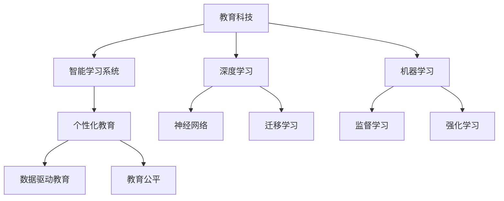

                 

# 如何利用技术能力进行教育科技革命

> 关键词：教育科技,人工智能,智能学习系统,个性化教育,技术赋能,教育公平,深度学习,机器学习,大数据

## 1. 背景介绍

### 1.1 问题由来
当前，全球正经历着一场深刻的教育科技革命。传统的教育模式面临着诸多挑战，如教育资源分配不均、教学质量参差不齐、学习动力不足等。这些问题的根源在于传统教育方式缺乏个性化和效率化的支持。如何利用先进的技术手段，提升教育质量和公平性，是时代赋予我们的使命。

### 1.2 问题核心关键点
教育科技的核心在于通过技术的创新，实现教育的个性化、智能化和高效化。这需要我们综合利用人工智能、深度学习、大数据等前沿技术，构建智能学习系统，赋能教育过程，促进教育公平，提升学习效果。

### 1.3 问题研究意义
技术赋能教育，不仅能够改善传统教育模式中的不足之处，还能开创全新的教育路径，激发学生的潜能，推动教育事业的可持续发展。通过技术手段，我们可以实现以下目标：

- 个性化教学：根据学生的学习特点和需求，提供量身定制的教学内容和方案。
- 智能化评估：通过数据驱动的智能评估系统，及时反馈学习进度，调整教学策略。
- 高效化资源：利用大数据和云计算技术，优化教育资源的分配和管理。
- 促进公平：打破地理、经济等因素的限制，让优质教育资源惠及更多学生。

## 2. 核心概念与联系

### 2.1 核心概念概述

为更好地理解教育科技的核心技术和实践方法，本节将介绍几个关键概念：

- **教育科技(EdTech)**：利用信息技术手段改进教育方式和学习效果的实践。
- **智能学习系统(Intelligent Learning Systems)**：基于人工智能技术，能够自适应地提供个性化学习建议和指导的系统。
- **个性化教育(Personalized Education)**：根据学生的个性化需求和特点，定制化教学内容和路径。
- **数据驱动教育(Data-Driven Education)**：通过大数据分析，优化教学策略，提升教育质量。
- **教育公平(Educational Equity)**：通过技术手段，减少教育资源分配的不均衡，提升教育的普及性和包容性。
- **深度学习(Deep Learning)**：一种基于多层神经网络的学习方式，能够从数据中学习到复杂的关系。
- **机器学习(Machine Learning)**：通过算法使机器能够从数据中学习并做出决策。

这些核心概念之间的逻辑关系可以通过以下Mermaid流程图来展示：



这个流程图展示出教育科技的各个关键环节和核心技术：

1. 教育科技通过智能学习系统和深度学习等技术，实现个性化教育。
2. 个性化教育应用大数据和机器学习，提供智能化的教学建议。
3. 数据驱动教育通过深度学习算法，优化教学策略，提升教学效果。
4. 教育公平旨在通过技术手段，缩小教育资源的差距。
5. 深度学习和机器学习是实现上述目标的基础技术。

## 3. 核心算法原理 & 具体操作步骤
### 3.1 算法原理概述

教育科技的核心在于利用人工智能和大数据技术，优化教育过程和资源分配，实现个性化教育和智能化评估。其中，基于深度学习的智能学习系统是实现个性化教育的关键。其核心算法原理如下：

- **神经网络**：构建多层神经网络模型，通过反向传播算法，最小化损失函数，优化模型参数，实现从数据中学习。
- **监督学习**：通过有标签数据训练模型，使其能够预测新数据标签。
- **无监督学习**：通过无标签数据训练模型，挖掘数据中的隐含模式和结构。
- **迁移学习**：利用预训练模型的知识，在特定领域上进行微调，提升模型的泛化能力。

### 3.2 算法步骤详解

基于深度学习的智能学习系统开发一般包括以下几个关键步骤：

**Step 1: 数据收集与预处理**
- 收集学生的学习数据，包括作业、测试成绩、行为数据等。
- 对数据进行清洗和归一化，去除异常值和噪声，确保数据质量。

**Step 2: 模型构建与训练**
- 设计神经网络模型结构，包括输入层、隐藏层和输出层。
- 选择合适的损失函数和优化器，如交叉熵损失、Adam优化器等。
- 使用标注数据训练模型，调整模型参数，使其能够准确预测学生学习状态。

**Step 3: 特征提取与嵌入**
- 提取学生的学习特征，如成绩、行为等，作为神经网络的输入。
- 使用词嵌入或自编码器等技术，将特征转换为向量表示，增强模型对数据的学习能力。

**Step 4: 模型评估与优化**
- 使用验证集评估模型性能，计算准确率、召回率、F1值等指标。
- 根据评估结果，调整模型结构和参数，提升模型预测能力。

**Step 5: 应用与反馈**
- 将训练好的模型应用于实际教学场景，实时预测学生的学习状态。
- 根据预测结果，提供个性化的学习建议，如推荐学习资源、调整教学策略等。
- 收集学生反馈，优化模型和算法，不断提升教育效果。

### 3.3 算法优缺点

基于深度学习的智能学习系统具有以下优点：
1. 能够实现高度个性化的教学。通过学习学生的行为和成绩，提供量身定制的学习建议。
2. 能够实时监测学生的学习状态，及时反馈和调整教学策略。
3. 能够优化教育资源的分配和管理，提高教学效率。

同时，该系统也存在一些局限性：
1. 对数据质量和多样性要求较高。需要收集丰富的学习数据，才能训练出有效的模型。
2. 需要大量的计算资源。神经网络模型参数量庞大，训练和推理需要高性能的计算设备。
3. 数据隐私和安全问题。学生学习数据的收集和使用需要严格遵守隐私保护法规。

尽管存在这些局限性，但基于深度学习的智能学习系统在个性化教育和智能化评估中展现了巨大的潜力，得到了广泛应用。未来，随着技术的不断进步，这些问题将逐步得到解决，智能学习系统的应用范围将更加广泛。

### 3.4 算法应用领域

基于深度学习的智能学习系统在教育领域的应用涵盖了多个方面，例如：

- **自适应学习系统**：根据学生的学习状态和表现，动态调整教学内容和难度。
- **智能推荐系统**：推荐适合学生学习兴趣和需求的学习资源和课程。
- **智能测评系统**：通过数据驱动的方式，进行智能化的学习效果评估。
- **心理辅导系统**：分析学生的行为数据，提供心理健康的支持和建议。
- **课程生成系统**：根据学生的学习轨迹，自动生成个性化的学习路径和课程。
- **虚拟课堂**：通过虚拟现实技术，构建沉浸式的学习环境。

除了这些经典应用外，智能学习系统还在教育管理、教育研究、教育科技创业等领域发挥着越来越重要的作用。

## 4. 数学模型和公式 & 详细讲解  
### 4.1 数学模型构建

基于深度学习的智能学习系统的数学模型构建涉及多个关键步骤，包括特征提取、模型训练和优化等。

记学生学习数据为 $\mathcal{D}=\{(x_i, y_i)\}_{i=1}^N$，其中 $x_i$ 为学生的行为数据（如作业成绩、出勤率等），$y_i$ 为学生的学习状态（如学习效果、心理状态等）。

定义神经网络模型 $M_\theta$，其中 $\theta$ 为模型参数。模型的输入层接收学生行为数据，隐藏层进行特征提取，输出层预测学生学习状态。模型的损失函数为交叉熵损失函数：

$$
\mathcal{L}(\theta) = -\frac{1}{N}\sum_{i=1}^N \log M_\theta(x_i)
$$

其中，$M_\theta(x_i)$ 为模型在输入 $x_i$ 上的输出，$\log$ 为自然对数函数。

### 4.2 公式推导过程

以二分类任务为例，推导交叉熵损失函数及其梯度的计算公式。

假设模型 $M_\theta$ 在输入 $x$ 上的输出为 $\hat{y}=M_\theta(x) \in [0,1]$，表示学生处于学习状态的概率。真实标签 $y \in \{0,1\}$。则二分类交叉熵损失函数定义为：

$$
\ell(M_\theta(x),y) = -[y\log \hat{y} + (1-y)\log (1-\hat{y})]
$$

将其代入经验风险公式，得：

$$
\mathcal{L}(\theta) = -\frac{1}{N}\sum_{i=1}^N [y_i\log M_\theta(x_i)+(1-y_i)\log(1-M_\theta(x_i))]
$$

根据链式法则，损失函数对参数 $\theta_k$ 的梯度为：

$$
\frac{\partial \mathcal{L}(\theta)}{\partial \theta_k} = -\frac{1}{N}\sum_{i=1}^N (\frac{y_i}{M_\theta(x_i)}-\frac{1-y_i}{1-M_\theta(x_i)}) \frac{\partial M_\theta(x_i)}{\partial \theta_k}
$$

其中 $\frac{\partial M_\theta(x_i)}{\partial \theta_k}$ 可进一步递归展开，利用自动微分技术完成计算。

### 4.3 案例分析与讲解

以一个简单的自适应学习系统为例，分析模型的构建和优化过程。

首先，收集学生的学习数据，包括作业成绩、出勤率、学习时间等，将其作为模型的输入特征。然后，设计神经网络模型，使用一个或多个隐藏层进行特征提取和分类。最后，使用标注数据训练模型，最小化交叉熵损失函数，优化模型参数。

在模型构建完成后，可以使用验证集评估模型性能，计算准确率、召回率等指标。根据评估结果，调整模型结构和参数，提升模型预测能力。最终，将训练好的模型应用于实际教学场景，实时预测学生的学习状态，提供个性化的学习建议。

## 5. 项目实践：代码实例和详细解释说明
### 5.1 开发环境搭建

在进行智能学习系统开发前，我们需要准备好开发环境。以下是使用Python进行TensorFlow开发的环境配置流程：

1. 安装Anaconda：从官网下载并安装Anaconda，用于创建独立的Python环境。

2. 创建并激活虚拟环境：
```bash
conda create -n tf-env python=3.8 
conda activate tf-env
```

3. 安装TensorFlow：根据CUDA版本，从官网获取对应的安装命令。例如：
```bash
conda install tensorflow -c conda-forge -c pytorch
```

4. 安装相关库：
```bash
pip install numpy pandas scikit-learn tensorflow-gpu matplotlib tqdm jupyter notebook ipython
```

完成上述步骤后，即可在`tf-env`环境中开始智能学习系统开发。

### 5.2 源代码详细实现

下面我们以一个简单的自适应学习系统为例，给出使用TensorFlow进行深度学习的PyTorch代码实现。

首先，定义模型和优化器：

```python
import tensorflow as tf
from tensorflow.keras import layers, models

model = models.Sequential([
    layers.Dense(64, activation='relu', input_shape=(5,)),
    layers.Dense(32, activation='relu'),
    layers.Dense(1, activation='sigmoid')
])

optimizer = tf.keras.optimizers.Adam(learning_rate=0.001)
```

然后，定义训练和评估函数：

```python
def train_model(model, data, epochs):
    model.compile(optimizer=optimizer, loss='binary_crossentropy', metrics=['accuracy'])
    model.fit(data['train'], data['train_labels'], epochs=epochs, validation_data=(data['test'], data['test_labels']))

def evaluate_model(model, data):
    model.evaluate(data['test'], data['test_labels'])
```

接着，加载数据集并进行模型训练：

```python
# 加载数据集
train_data = np.load('train_data.npy')
train_labels = np.load('train_labels.npy')
test_data = np.load('test_data.npy')
test_labels = np.load('test_labels.npy')

# 构建数据集
data = tf.data.Dataset.from_tensor_slices((train_data, train_labels)).shuffle(10000).batch(32)
test_data = tf.data.Dataset.from_tensor_slices((test_data, test_labels)).batch(32)

# 训练模型
train_model(model, data, epochs=100)
```

最后，在测试集上评估模型性能：

```python
# 评估模型
evaluate_model(model, test_data)
```

以上就是使用TensorFlow进行自适应学习系统开发的完整代码实现。可以看到，TensorFlow提供了高度灵活的API，便于构建和训练复杂的神经网络模型。

### 5.3 代码解读与分析

让我们再详细解读一下关键代码的实现细节：

**train_model函数**：
- 定义神经网络模型结构，包括输入层、隐藏层和输出层。
- 使用Adam优化器进行梯度下降优化。
- 定义损失函数为二分类交叉熵。
- 使用fit方法进行模型训练，设置训练轮数和验证集。

**evaluate_model函数**：
- 使用evaluate方法在测试集上评估模型性能，计算准确率和损失值。

**数据加载与处理**：
- 使用numpy加载训练和测试数据集，构建TensorFlow数据集对象。
- 通过from_tensor_slices方法将数据和标签转换为TensorFlow兼容格式。
- 使用shuffle和batch方法对数据集进行打乱和分批次处理。

可以看到，TensorFlow使得深度学习的模型构建和训练变得简洁高效。开发者可以将更多精力放在数据处理、模型改进等高层逻辑上，而不必过多关注底层的实现细节。

当然，工业级的系统实现还需考虑更多因素，如模型的保存和部署、超参数的自动搜索、更灵活的任务适配层等。但核心的深度学习范式基本与此类似。

## 6. 实际应用场景
### 6.1 智能辅导系统

基于深度学习的智能学习系统，可以广泛应用于智能辅导系统的构建。传统辅导方式往往依赖人力，无法覆盖更多学生，且辅导效果参差不齐。而智能辅导系统，通过实时监测和个性化指导，可以大幅提升学生的学习效率和成绩。

在技术实现上，可以构建一个基于智能学习系统的辅导平台，根据学生的学习行为和成绩数据，自动生成个性化的学习计划和推荐资源。在辅导过程中，实时评估学生学习状态，提供针对性指导和反馈。

### 6.2 在线教育平台

在线教育平台是教育科技的重要应用场景，通过智能学习系统，可以实现对学生的全方位支持。在线教育平台不仅提供丰富的学习资源，还可以根据学生的学习进度和偏好，推荐最适合的学习路径和课程。

在平台中，智能学习系统可以集成到各个教学环节，如智能答疑、智能测评、智能作业批改等。通过数据分析，及时发现学生的学习难点和兴趣点，动态调整教学内容和策略。

### 6.3 教育数据分析

教育数据分析是教育科技的重要组成部分，通过智能学习系统，可以实现对海量教育数据的深度挖掘和分析。数据分析结果可以用于教育政策的制定、教育资源的优化分配、教学质量的评估等。

在数据分析过程中，智能学习系统可以集成自然语言处理、图像识别、机器学习等技术，对教育数据进行自动标注和特征提取，从而实现更高效、精准的分析。

### 6.4 未来应用展望

随着深度学习和大数据技术的不断发展，基于智能学习系统的教育科技将迎来更多创新应用。

在智慧校园建设中，智能学习系统可以集成到校园管理系统，实现对学生行为数据的实时监测和分析，优化校园资源的使用和管理。

在终身学习中，智能学习系统可以根据用户的学习历史和偏好，提供个性化的学习建议和资源推荐，支持用户的终身学习和发展。

在职业培训中，智能学习系统可以提供基于实际工作需求的课程和技能培训，帮助员工提升技能，增强竞争力。

总之，随着技术的不断进步和应用场景的拓展，基于深度学习的智能学习系统将在教育科技中扮演越来越重要的角色，为实现教育公平和质量提升做出更大贡献。

## 7. 工具和资源推荐
### 7.1 学习资源推荐

为了帮助开发者系统掌握深度学习在教育科技中的应用，这里推荐一些优质的学习资源：

1. **Deep Learning for Good**：由Deep Learning for Good联盟发起，汇集了多领域应用深度学习的案例和研究，包括教育科技领域。

2. **Coursera - Machine Learning**：斯坦福大学开设的深度学习入门课程，涵盖基础概念和应用场景。

3. **Kaggle**：数据科学竞赛平台，提供丰富的教育科技数据集和竞赛任务，有助于实践和探索。

4. **Google AI教育**：Google AI提供的教育科技工具和资源，包括智能学习系统、深度学习框架等。

5. **IEEE Xplore**：IEEE的学术论文库，包含大量关于教育科技的深度学习研究论文，适合深入学习。

通过对这些资源的学习实践，相信你一定能够快速掌握深度学习在教育科技中的应用，并用于解决实际的NLP问题。

### 7.2 开发工具推荐

高效的开发离不开优秀的工具支持。以下是几款用于深度学习在教育科技开发的常用工具：

1. **TensorFlow**：由Google主导开发的开源深度学习框架，生产部署方便，适合大规模工程应用。

2. **PyTorch**：基于Python的开源深度学习框架，灵活动态的计算图，适合快速迭代研究。

3. **TensorFlow Hub**：提供了丰富的预训练模型和组件，方便快速搭建智能学习系统。

4. **Jupyter Notebook**：交互式笔记本，支持Python、R等多种编程语言，适合数据探索和模型开发。

5. **Google Colab**：谷歌提供的免费Jupyter Notebook环境，适合进行实验研究。

合理利用这些工具，可以显著提升深度学习在教育科技开发的效率，加快创新迭代的步伐。

### 7.3 相关论文推荐

深度学习在教育科技中的应用源于学界的持续研究。以下是几篇奠基性的相关论文，推荐阅读：

1. **DNNs for Good: Educational Outcomes**：介绍了使用深度学习提升教育效果的案例，涵盖了在线教育、智能辅导等多个场景。

2. **Deep Learning for Scaling Education**：探讨了深度学习在教育科技中的广泛应用，包括智能辅导、在线教育等。

3. **Data Mining for Educational Research**：介绍了使用数据挖掘技术对教育数据进行分析的方法和工具。

4. **Rethinking Learning Analytics for Education**：探讨了使用机器学习改进教育分析的方法和策略。

5. **Teaching Machines to Think**：经典论文，探讨了机器学习在教育中的应用，为深度学习在教育科技中的应用提供了理论基础。

这些论文代表了大数据和深度学习在教育科技中的发展脉络。通过学习这些前沿成果，可以帮助研究者把握学科前进方向，激发更多的创新灵感。

## 8. 总结：未来发展趋势与挑战

### 8.1 总结

本文对基于深度学习的智能学习系统进行了全面系统的介绍。首先阐述了深度学习在教育科技中的应用背景和意义，明确了智能学习系统的目标和潜力。其次，从原理到实践，详细讲解了深度学习在教育科技中的数学模型和核心算法，给出了系统开发的完整代码实例。同时，本文还广泛探讨了智能学习系统在智能辅导、在线教育、教育数据分析等多个领域的应用前景，展示了深度学习在教育科技中的巨大潜力。

通过本文的系统梳理，可以看到，基于深度学习的智能学习系统正在成为教育科技的重要范式，极大地提升了教育质量和公平性。未来，伴随深度学习和大数据技术的持续演进，智能学习系统的应用范围将更加广泛。

### 8.2 未来发展趋势

展望未来，基于深度学习的智能学习系统将呈现以下几个发展趋势：

1. **个性化学习**：通过深度学习算法，实现对学生学习行为的全面监测和分析，提供个性化的学习建议和资源推荐。

2. **智能化评估**：利用深度学习模型，进行自动化的学习效果评估，及时发现学生的学习难点和兴趣点。

3. **数据驱动决策**：通过大数据和机器学习，优化教育资源的分配和管理，提升教学质量和效率。

4. **多模态学习**：将语音、图像、文本等多种模态数据结合，实现更全面的学习分析和智能辅导。

5. **跨学科应用**：将深度学习技术应用于更多学科领域，实现学科间的交叉融合，提升教学效果。

6. **开源社区**：推动深度学习在教育科技中的开源和共享，促进教育资源的普及和应用。

以上趋势凸显了深度学习在教育科技中的广阔前景。这些方向的探索发展，必将进一步提升教育系统的智能化水平，为学生的学习和发展提供更全面的支持。

### 8.3 面临的挑战

尽管基于深度学习的智能学习系统已经取得了瞩目成就，但在迈向更加智能化、普适化应用的过程中，它仍面临着诸多挑战：

1. **数据隐私和安全**：学生学习数据的收集和使用需要严格遵守隐私保护法规，确保数据安全。

2. **计算资源限制**：深度学习模型的训练和推理需要高性能的计算设备，如何优化计算资源使用，降低成本，是重要的研究课题。

3. **算法透明性**：深度学习模型的决策过程缺乏可解释性，需要进一步研究模型的透明性和可解释性，提高用户的信任度。

4. **应用落地难度**：深度学习模型需要与现有教育系统进行深度融合，如何优化模型和算法，实现无缝集成，是重要的技术难题。

5. **教育公平性**：深度学习模型需要确保对所有学生的公平性，避免数字鸿沟等问题的出现。

6. **师资培训**：教师需要掌握深度学习技术，才能有效利用智能学习系统，提升教学效果。

正视这些挑战，积极应对并寻求突破，将使深度学习在教育科技中发挥更大的价值。相信随着学界和产业界的共同努力，这些问题终将一一被克服，深度学习在教育科技中必将迎来更广泛的应用。

### 8.4 研究展望

未来的研究需要在以下几个方面寻求新的突破：

1. **可解释性算法**：开发具有可解释性的深度学习模型，增强用户对模型的信任度，提升模型的透明度和可解释性。

2. **跨模态学习**：将深度学习应用于多模态数据融合，提升模型的综合分析和智能辅导能力。

3. **实时学习**：实现实时学习效果的评估和反馈，提升教学质量和学生的学习体验。

4. **跨学科应用**：将深度学习应用于更多学科领域，实现学科间的交叉融合，提升教学效果。

5. **开源教育平台**：推动深度学习在教育科技中的开源和共享，促进教育资源的普及和应用。

这些研究方向将使深度学习在教育科技中发挥更大的价值，为实现教育公平和质量提升做出更大贡献。面向未来，深度学习在教育科技中的应用还需与其他人工智能技术进行更深入的融合，如知识表示、因果推理、强化学习等，多路径协同发力，共同推动教育事业的可持续发展。

## 9. 附录：常见问题与解答

**Q1：如何选择合适的深度学习模型？**

A: 选择合适的深度学习模型需要考虑多个因素，包括数据量、任务复杂度、计算资源等。一般而言，数据量较大的任务适合使用深度神经网络模型，而数据量较小或计算资源有限的任务适合使用轻量级模型。常见的深度学习模型包括卷积神经网络(CNN)、循环神经网络(RNN)、深度信念网络(DBN)、深度自编码器(Deep Autoencoder)等。

**Q2：如何进行深度学习的超参数调优？**

A: 深度学习的超参数调优是一个重要的研究课题。常见的超参数包括学习率、批量大小、层数、神经元数等。通常使用网格搜索、随机搜索、贝叶斯优化等方法进行调优。可以通过交叉验证和模型评估指标来评估不同超参数组合的效果，选择最优的超参数组合。

**Q3：如何提高深度学习模型的泛化能力？**

A: 提高深度学习模型的泛化能力可以通过以下方法：
1. 数据增强：通过数据扩充、回译等方式增加训练数据的多样性。
2. 正则化技术：使用L2正则、Dropout、Early Stopping等避免模型过拟合。
3. 迁移学习：在已有预训练模型的基础上，进行微调或适配，提高模型的泛化能力。
4. 模型集成：将多个深度学习模型集成，取平均输出，提高模型的泛化能力。

**Q4：如何保障深度学习模型的安全性？**

A: 深度学习模型的安全性保障需要从数据和模型两个方面进行考虑：
1. 数据隐私保护：确保数据收集和使用符合隐私保护法规，避免数据泄露和滥用。
2. 模型透明性：确保模型的决策过程透明可解释，避免模型的偏见和歧视。
3. 模型审计：定期对模型进行审计和评估，发现和修复潜在的安全漏洞。

**Q5：如何评估深度学习模型的性能？**

A: 评估深度学习模型的性能通常使用以下指标：
1. 准确率(Accuracy)：模型正确预测的样本数占总样本数的比例。
2. 精确率(Precision)：模型正确预测的正样本数占预测为正样本数的比例。
3. 召回率(Recall)：模型正确预测的正样本数占实际正样本数的比例。
4. F1分数(F1 Score)：精确率和召回率的调和平均，综合衡量模型的性能。

这些指标可以根据具体任务进行调整和优化，以评估模型的实际效果。

---

作者：禅与计算机程序设计艺术 / Zen and the Art of Computer Programming

