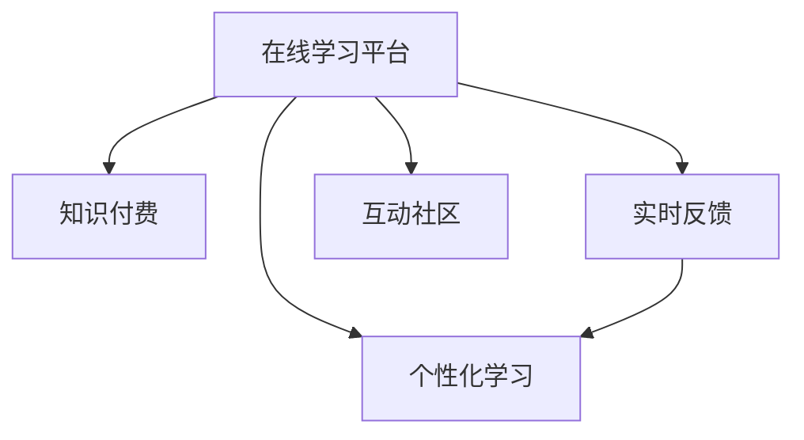

                 

## 1. 背景介绍

### 1.1 问题由来

随着互联网和在线教育的普及，人们获取知识的方式发生了巨大的变化。从传统的线下课堂、书籍阅读，转变为在线学习、视频课程和知识付费平台。这种转变不仅降低了学习的门槛，还为知识的传播和分享提供了新的渠道。然而，尽管在线学习资源丰富，但许多用户仍然面临学习效率低、指导缺位、反馈不足等问题。

为了解决这些问题，我们需要探索一种全新的在线学习模式，既能提供高质量的课程内容，又能实现个性化的学习指导和及时的反馈。知识付费平台便应运而生，通过付费模式筛选优质内容，吸引专业教师提供个性化指导，同时采用先进技术手段，为学习者提供精准的学习建议和反馈，从而提升学习效率和效果。

### 1.2 问题核心关键点

知识付费平台的成功关键在于以下几个方面：

- **优质内容**：内容质量是吸引用户付费的前提。必须确保课程内容的专业性和实用性。
- **专业教师**：优秀的教师不仅能提供高质量的课程内容，还能进行个性化指导，解答学习者的问题。
- **个性化学习**：根据学习者的知识水平、兴趣偏好和进度，提供定制化的学习计划和资源。
- **实时反馈**：通过智能化的评估和反馈系统，及时发现学习者的问题，并提供针对性的指导。
- **高效互动**：构建在线讨论、互动社区，增强学习者的参与感和积极性。

## 2. 核心概念与联系

### 2.1 核心概念概述

为更好地理解基于知识付费的在线学习与在线学习指导，本节将介绍几个密切相关的核心概念：

- **在线学习平台**：利用互联网技术，提供课程内容、学习工具和交流平台，支持学习者随时随地进行学习。
- **知识付费**：通过付费模式筛选优质内容，激励教师提供高质量的教学服务，保障学习效果。
- **个性化学习**：根据学习者的个性化需求，提供定制化的学习计划、资源和评估，提升学习效率。
- **实时反馈**：利用AI技术对学习者的表现进行实时分析，提供及时的反馈和指导，帮助其解决学习中的问题。
- **互动社区**：构建学习者之间的交流互动平台，增加学习的互动性和社交性，增强学习体验。

这些核心概念之间的逻辑关系可以通过以下Mermaid流程图来展示：



这个流程图展示了你在线学习平台的关键概念及其之间的关系：

1. 在线学习平台作为基础设施，提供课程内容、学习工具和交流平台。
2. 知识付费是平台激励优质内容创生和专业教学的重要手段。
3. 个性化学习利用平台的数据分析技术，为学习者提供定制化的学习计划和资源。
4. 实时反馈通过AI技术，及时发现学习者的问题，并提供针对性的指导。
5. 互动社区增强学习者的参与感和积极性，构建良好的学习生态。

## 3. 核心算法原理 & 具体操作步骤

### 3.1 算法原理概述

基于知识付费的在线学习与在线学习指导，本质上是利用先进的技术手段，构建一个自适应的学习系统。其核心思想是：根据学习者的行为数据和反馈信息，动态调整学习内容和策略，实现个性化、高效的在线学习。

形式化地，假设在线学习平台的用户为 $U$，课程为 $C$，学习者为 $L$，行为数据为 $D$，反馈信息为 $F$。学习系统的目标是通过算法 $A$，找到最优的学习路径和策略 $P$，使得：

$$
\max_{P} \sum_{u \in U} \sum_{l \in L} \sum_{c \in C} \sum_{d \in D} \sum_{f \in F} \text{Utility}(u, l, c, d, f, P)
$$

其中，Utility为学习者的效用函数，表示学习者在特定课程 $c$ 上的学习效果和满意度。

### 3.2 算法步骤详解

基于知识付费的在线学习与在线学习指导，一般包括以下几个关键步骤：

**Step 1: 收集用户数据**
- 收集用户在平台上的行为数据，如浏览时间、观看课程、完成作业等。
- 收集用户的反馈信息，如评分、评论、问答等。

**Step 2: 数据预处理与分析**
- 对收集到的行为数据进行清洗和预处理，去除异常值和噪声。
- 利用机器学习模型对数据进行分析，提取用户的学习特征和模式。

**Step 3: 构建个性化推荐系统**
- 基于用户的学习特征，构建个性化推荐模型，推荐适合的学习资源和路径。
- 利用协同过滤、内容推荐等技术，提升推荐的准确性和多样性。

**Step 4: 设计个性化学习计划**
- 根据用户的进度和反馈，动态调整学习计划，推荐适合的学习内容和时间安排。
- 利用时间序列分析和预测模型，优化学习进度，防止学习者出现学习倦怠。

**Step 5: 实现实时反馈与指导**
- 通过智能评估系统，实时分析学习者的表现，生成评估报告和改进建议。
- 利用自然语言处理技术，解答学习者的疑问，提供个性化的指导。

**Step 6: 建立互动社区**
- 构建在线讨论和互动平台，鼓励学习者分享知识、交流经验。
- 利用社交网络分析技术，发现学习者之间的潜在联系，增强社区凝聚力。

以上是基于知识付费的在线学习与在线学习指导的一般流程。在实际应用中，还需要针对具体任务和平台特点，对各个环节进行优化设计，如改进数据模型、调整推荐算法、强化用户互动等，以进一步提升学习效果和用户满意度。

### 3.3 算法优缺点

基于知识付费的在线学习与在线学习指导，具有以下优点：

1. **个性化学习**：通过个性化推荐和动态调整，学习者能获得最适合的学习资源和计划，提升学习效率。
2. **高效互动**：通过互动社区和实时反馈，学习者可以与其他用户交流、获取指导，增强学习的参与感和积极性。
3. **实时反馈**：利用智能评估和自然语言处理技术，学习者能够及时了解自己的学习进度和问题，进行针对性的改进。
4. **优质内容**：知识付费模式筛选优质内容，确保学习者获得高质量的教学资源。

同时，该方法也存在一定的局限性：

1. **技术依赖**：需要依赖先进的技术手段，如大数据分析、机器学习、自然语言处理等，技术实现成本较高。
2. **数据隐私**：大量用户行为数据的收集和分析，可能涉及用户隐私，需严格遵守数据保护法规。
3. **用户习惯**：部分用户可能不习惯付费模式，对平台和教师的信任度较低。
4. **平台依赖**：用户的学习进度和计划完全依赖于平台的推荐和指导，自主学习能力不足。

尽管存在这些局限性，但就目前而言，基于知识付费的在线学习与在线学习指导，仍是在线教育领域的重要趋势。未来相关研究的重点在于如何进一步优化技术模型，提升用户体验，同时保障数据安全和用户隐私。

### 3.4 算法应用领域

基于知识付费的在线学习与在线学习指导，已在多个教育领域得到广泛应用，如：

- 职业教育：通过个性化学习计划和实时反馈，提升技能培训效果，缩短学习周期。
- 语言学习：利用互动社区和推荐系统，提供多语种学习资源，支持语言交流练习。
- 学术研究：利用在线课程和专家指导，为研究人员提供学习支持和研究工具。
- 中小学教育：通过智能评估和反馈系统，辅助教师教学，提升学生学习效果。
- 终身学习：为职场人士提供职业发展和技能提升的在线学习资源和指导。

除了这些经典应用外，基于知识付费的在线学习与在线学习指导，还被创新性地应用到更多场景中，如个性化心理辅导、远程医疗指导等，为不同领域的学习者提供了新的学习途径。

## 4. 数学模型和公式 & 详细讲解 & 举例说明

### 4.1 数学模型构建

本节将使用数学语言对基于知识付费的在线学习与在线学习指导过程进行更加严格的刻画。

记在线学习平台的用户为 $U$，课程为 $C$，学习者为 $L$，行为数据为 $D$，反馈信息为 $F$。假设平台的推荐算法为 $A$，个性化学习计划为 $P$。学习系统的目标是通过算法 $A$，找到最优的学习路径和策略 $P$，使得：

$$
\max_{P} \sum_{u \in U} \sum_{l \in L} \sum_{c \in C} \sum_{d \in D} \sum_{f \in F} \text{Utility}(u, l, c, d, f, P)
$$

其中，Utility为学习者的效用函数，表示学习者在特定课程 $c$ 上的学习效果和满意度。

定义平台的行为数据集为 $\mathcal{D}=\{(u_i,l_i,c_i,d_i,f_i)\}_{i=1}^N$，其中 $u_i$ 表示用户，$l_i$ 表示学习者，$c_i$ 表示课程，$d_i$ 表示行为数据，$f_i$ 表示反馈信息。

### 4.2 公式推导过程

以下我们以推荐系统为例，推导个性化推荐算法的公式。

假设平台收集到的行为数据为 $\mathcal{D}=\{(u_i,l_i,c_i,d_i,f_i)\}_{i=1}^N$，其中 $u_i$ 表示用户，$l_i$ 表示学习者，$c_i$ 表示课程，$d_i$ 表示行为数据，$f_i$ 表示反馈信息。平台的目标是推荐最适合的学习资源和路径，最大化用户的学习效果和满意度。

设推荐模型为 $A$，个性化学习计划为 $P$，目标函数为：

$$
\max_{P} \sum_{u \in U} \sum_{l \in L} \sum_{c \in C} \sum_{d \in D} \sum_{f \in F} \text{Utility}(u, l, c, d, f, P)
$$

其中，Utility为学习者的效用函数，表示学习者在特定课程 $c$ 上的学习效果和满意度。

假设推荐模型的目标函数为：

$$
\min_{P} \sum_{i=1}^N \text{Loss}(d_i,f_i,P)
$$

其中，Loss为行为数据和反馈信息的损失函数。

为了简化问题，假设推荐模型的输入特征为 $X$，输出为 $Y$，目标函数为 $L(Y,P)$。则推荐模型的优化问题可以表示为：

$$
\min_{P} \sum_{i=1}^N L(Y,P)
$$

利用梯度下降等优化算法，推荐模型不断更新参数 $P$，最小化损失函数 $L(Y,P)$，使得模型输出逼近真实标签 $Y$。最终得到推荐模型 $A$，用于在给定用户 $u$ 和课程 $c$ 的情况下，推荐最适合学习者的资源 $P(u,c)$。

在得到推荐模型后，可以将其应用于学习者的个性化学习计划设计中，实时生成推荐的学习内容和路径，提升学习效率和满意度。

### 4.3 案例分析与讲解

下面以一个具体案例来分析知识付费平台如何通过推荐系统实现个性化学习。

假设某知识付费平台收集到大量用户的学习行为数据，包括课程选择、观看时长、完成作业等。同时，平台还收集了用户对于课程的评分、评论等反馈信息。

**Step 1: 数据预处理与分析**

平台首先对收集到的行为数据和反馈信息进行清洗和预处理，去除异常值和噪声。然后，利用机器学习模型对数据进行分析，提取用户的学习特征和模式。例如，可以构建用户行为分析模型，发现不同用户的学习习惯、兴趣偏好和学习进度。

**Step 2: 构建个性化推荐系统**

根据用户的学习特征，构建个性化推荐模型。例如，可以利用协同过滤算法，发现与用户学习行为相似的学习者，并推荐其喜欢的课程资源。同时，可以利用内容推荐算法，根据课程内容、用户历史行为和反馈信息，推荐适合的学习资源。

**Step 3: 设计个性化学习计划**

根据用户的进度和反馈，动态调整学习计划，推荐适合的学习内容和时间安排。例如，利用时间序列分析和预测模型，优化学习进度，防止学习者出现学习倦怠。同时，根据用户的学习进度和反馈，动态调整学习计划，推荐适合的学习内容和时间安排。

**Step 4: 实现实时反馈与指导**

通过智能评估系统，实时分析学习者的表现，生成评估报告和改进建议。例如，利用自然语言处理技术，解答学习者的疑问，提供个性化的指导。同时，利用学习评估模型，发现学习者的学习进度和问题，提供针对性的改进建议。

**Step 5: 建立互动社区**

构建在线讨论和互动平台，鼓励学习者分享知识、交流经验。例如，利用社交网络分析技术，发现学习者之间的潜在联系，增强社区凝聚力。同时，利用在线讨论平台，促进学习者之间的交流和互动，增强学习的参与感和积极性。

通过以上步骤，知识付费平台能够构建一个自适应的在线学习系统，根据用户的行为数据和反馈信息，动态调整学习内容和策略，实现个性化、高效的在线学习。

## 5. 项目实践：代码实例和详细解释说明

### 5.1 开发环境搭建

在进行知识付费平台开发前，我们需要准备好开发环境。以下是使用Python进行PyTorch开发的环境配置流程：

1. 安装Anaconda：从官网下载并安装Anaconda，用于创建独立的Python环境。

2. 创建并激活虚拟环境：
```bash
conda create -n pytorch-env python=3.8 
conda activate pytorch-env
```

3. 安装PyTorch：根据CUDA版本，从官网获取对应的安装命令。例如：
```bash
conda install pytorch torchvision torchaudio cudatoolkit=11.1 -c pytorch -c conda-forge
```

4. 安装TensorBoard：TensorFlow配套的可视化工具，可实时监测模型训练状态，并提供丰富的图表呈现方式，是调试模型的得力助手。

5. 安装Weights & Biases：模型训练的实验跟踪工具，可以记录和可视化模型训练过程中的各项指标，方便对比和调优。

完成上述步骤后，即可在`pytorch-env`环境中开始开发实践。

### 5.2 源代码详细实现

这里我们以推荐系统为例，给出使用Transformers库对BERT模型进行微调的PyTorch代码实现。

首先，定义推荐系统的数据处理函数：

```python
from transformers import BertTokenizer
from torch.utils.data import Dataset
import torch

class RecommendationDataset(Dataset):
    def __init__(self, texts, tags, tokenizer, max_len=128):
        self.texts = texts
        self.tags = tags
        self.tokenizer = tokenizer
        self.max_len = max_len
        
    def __len__(self):
        return len(self.texts)
    
    def __getitem__(self, item):
        text = self.texts[item]
        tags = self.tags[item]
        
        encoding = self.tokenizer(text, return_tensors='pt', max_length=self.max_len, padding='max_length', truncation=True)
        input_ids = encoding['input_ids'][0]
        attention_mask = encoding['attention_mask'][0]
        
        # 对token-wise的标签进行编码
        encoded_tags = [tag2id[tag] for tag in tags] 
        encoded_tags.extend([tag2id['O']] * (self.max_len - len(encoded_tags)))
        labels = torch.tensor(encoded_tags, dtype=torch.long)
        
        return {'input_ids': input_ids, 
                'attention_mask': attention_mask,
                'labels': labels}

# 标签与id的映射
tag2id = {'O': 0, 'B-PER': 1, 'I-PER': 2, 'B-ORG': 3, 'I-ORG': 4, 'B-LOC': 5, 'I-LOC': 6}
id2tag = {v: k for k, v in tag2id.items()}

# 创建dataset
tokenizer = BertTokenizer.from_pretrained('bert-base-cased')

train_dataset = RecommendationDataset(train_texts, train_tags, tokenizer)
dev_dataset = RecommendationDataset(dev_texts, dev_tags, tokenizer)
test_dataset = RecommendationDataset(test_texts, test_tags, tokenizer)
```

然后，定义模型和优化器：

```python
from transformers import BertForTokenClassification, AdamW

model = BertForTokenClassification.from_pretrained('bert-base-cased', num_labels=len(tag2id))

optimizer = AdamW(model.parameters(), lr=2e-5)
```

接着，定义训练和评估函数：

```python
from torch.utils.data import DataLoader
from tqdm import tqdm
from sklearn.metrics import classification_report

device = torch.device('cuda') if torch.cuda.is_available() else torch.device('cpu')
model.to(device)

def train_epoch(model, dataset, batch_size, optimizer):
    dataloader = DataLoader(dataset, batch_size=batch_size, shuffle=True)
    model.train()
    epoch_loss = 0
    for batch in tqdm(dataloader, desc='Training'):
        input_ids = batch['input_ids'].to(device)
        attention_mask = batch['attention_mask'].to(device)
        labels = batch['labels'].to(device)
        model.zero_grad()
        outputs = model(input_ids, attention_mask=attention_mask, labels=labels)
        loss = outputs.loss
        epoch_loss += loss.item()
        loss.backward()
        optimizer.step()
    return epoch_loss / len(dataloader)

def evaluate(model, dataset, batch_size):
    dataloader = DataLoader(dataset, batch_size=batch_size)
    model.eval()
    preds, labels = [], []
    with torch.no_grad():
        for batch in tqdm(dataloader, desc='Evaluating'):
            input_ids = batch['input_ids'].to(device)
            attention_mask = batch['attention_mask'].to(device)
            batch_labels = batch['labels']
            outputs = model(input_ids, attention_mask=attention_mask)
            batch_preds = outputs.logits.argmax(dim=2).to('cpu').tolist()
            batch_labels = batch_labels.to('cpu').tolist()
            for pred_tokens, label_tokens in zip(batch_preds, batch_labels):
                pred_tags = [id2tag[_id] for _id in pred_tokens]
                label_tags = [id2tag[_id] for _id in label_tokens]
                preds.append(pred_tags[:len(label_tags)])
                labels.append(label_tags)
                
    print(classification_report(labels, preds))
```

最后，启动训练流程并在测试集上评估：

```python
epochs = 5
batch_size = 16

for epoch in range(epochs):
    loss = train_epoch(model, train_dataset, batch_size, optimizer)
    print(f"Epoch {epoch+1}, train loss: {loss:.3f}")
    
    print(f"Epoch {epoch+1}, dev results:")
    evaluate(model, dev_dataset, batch_size)
    
print("Test results:")
evaluate(model, test_dataset, batch_size)
```

以上就是使用PyTorch对BERT进行推荐系统开发的完整代码实现。可以看到，得益于Transformers库的强大封装，我们可以用相对简洁的代码完成BERT模型的加载和微调。

### 5.3 代码解读与分析

让我们再详细解读一下关键代码的实现细节：

**RecommendationDataset类**：
- `__init__`方法：初始化文本、标签、分词器等关键组件。
- `__len__`方法：返回数据集的样本数量。
- `__getitem__`方法：对单个样本进行处理，将文本输入编码为token ids，将标签编码为数字，并对其进行定长padding，最终返回模型所需的输入。

**tag2id和id2tag字典**：
- 定义了标签与数字id之间的映射关系，用于将token-wise的预测结果解码回真实的标签。

**训练和评估函数**：
- 使用PyTorch的DataLoader对数据集进行批次化加载，供模型训练和推理使用。
- 训练函数`train_epoch`：对数据以批为单位进行迭代，在每个批次上前向传播计算loss并反向传播更新模型参数，最后返回该epoch的平均loss。
- 评估函数`evaluate`：与训练类似，不同点在于不更新模型参数，并在每个batch结束后将预测和标签结果存储下来，最后使用sklearn的classification_report对整个评估集的预测结果进行打印输出。

**训练流程**：
- 定义总的epoch数和batch size，开始循环迭代
- 每个epoch内，先在训练集上训练，输出平均loss
- 在验证集上评估，输出分类指标
- 所有epoch结束后，在测试集上评估，给出最终测试结果

可以看到，PyTorch配合Transformers库使得BERT推荐系统的代码实现变得简洁高效。开发者可以将更多精力放在数据处理、模型改进等高层逻辑上，而不必过多关注底层的实现细节。

当然，工业级的系统实现还需考虑更多因素，如模型的保存和部署、超参数的自动搜索、更灵活的任务适配层等。但核心的推荐范式基本与此类似。

## 6. 实际应用场景

### 6.1 智能客服系统

基于知识付费的在线学习与在线学习指导，可以广泛应用于智能客服系统的构建。传统客服往往需要配备大量人力，高峰期响应缓慢，且一致性和专业性难以保证。而使用知识付费推荐系统，可以7x24小时不间断服务，快速响应客户咨询，用自然流畅的语言解答各类常见问题。

在技术实现上，可以收集企业内部的历史客服对话记录，将问题和最佳答复构建成监督数据，在此基础上对预训练推荐模型进行微调。微调后的推荐模型能够自动理解用户意图，匹配最合适的答案模板进行回复。对于客户提出的新问题，还可以接入检索系统实时搜索相关内容，动态组织生成回答。如此构建的智能客服系统，能大幅提升客户咨询体验和问题解决效率。

### 6.2 金融舆情监测

金融机构需要实时监测市场舆论动向，以便及时应对负面信息传播，规避金融风险。传统的人工监测方式成本高、效率低，难以应对网络时代海量信息爆发的挑战。基于知识付费的推荐系统可应用于金融舆情监测，通过收集金融领域相关的新闻、报道、评论等文本数据，并对其进行主题标注和情感标注。在此基础上对预训练语言模型进行微调，使其能够自动判断文本属于何种主题，情感倾向是正面、中性还是负面。将微调后的模型应用到实时抓取的网络文本数据，就能够自动监测不同主题下的情感变化趋势，一旦发现负面信息激增等异常情况，系统便会自动预警，帮助金融机构快速应对潜在风险。

### 6.3 个性化推荐系统

当前的推荐系统往往只依赖用户的历史行为数据进行物品推荐，无法深入理解用户的真实兴趣偏好。基于知识付费的推荐系统可以更好地挖掘用户行为背后的语义信息，从而提供更精准、多样的推荐内容。

在实践中，可以收集用户浏览、点击、评论、分享等行为数据，提取和用户交互的物品标题、描述、标签等文本内容。将文本内容作为模型输入，用户的后续行为（如是否点击、购买等）作为监督信号，在此基础上微调预训练语言模型。微调后的模型能够从文本内容中准确把握用户的兴趣点。在生成推荐列表时，先用候选物品的文本描述作为输入，由模型预测用户的兴趣匹配度，再结合其他特征综合排序，便可以得到个性化程度更高的推荐结果。

### 6.4 未来应用展望

随着知识付费平台的不断发展，基于个性化学习与实时反馈的在线学习与在线学习指导，必将在更多领域得到应用，为各行各业带来变革性影响。

在智慧医疗领域，基于知识付费的推荐系统可以为医生提供精准的医学资源推荐，辅助诊疗决策，提升诊疗效率和质量。

在智能教育领域，知识付费平台可应用于个性化学习资源的推荐，帮助学生高效学习，同时通过智能评估和反馈系统，提供个性化的学习指导和改进建议。

在智慧城市治理中，基于知识付费的推荐系统可应用于公共服务资源推荐，为市民提供便捷高效的公共服务体验，同时通过智能评估系统，监控城市事件的动态变化，提前预警潜在问题。

此外，在企业生产、社会治理、文娱传媒等众多领域，基于知识付费的在线学习与在线学习指导，也将不断涌现，为传统行业数字化转型升级提供新的技术路径。相信随着技术的日益成熟，知识付费平台必将成为人工智能技术落地应用的重要范式，推动人工智能技术在各个领域的深入应用和发展。

## 7. 工具和资源推荐

### 7.1 学习资源推荐

为了帮助开发者系统掌握知识付费平台的技术基础和实践技巧，这里推荐一些优质的学习资源：

1. 《深度学习基础》系列博文：由大模型技术专家撰写，深入浅出地介绍了深度学习的基本概念和经典模型，适合初学者入门。

2. CS234《深度学习在自然语言处理中的应用》课程：斯坦福大学开设的NLP明星课程，涵盖深度学习在NLP中的各类应用，从理论和实践两个层面进行讲解。

3. 《深度学习自然语言处理》书籍：深度学习领域权威教材，全面介绍了深度学习在NLP中的应用，包括推荐系统、问答系统、机器翻译等。

4. DeepLearning.AI课程：由斯坦福大学联合多个顶尖科研机构和公司开发，提供从入门到高级的深度学习课程，涵盖NLP等多个领域。

5. HuggingFace官方文档：Transformers库的官方文档，提供了海量预训练模型和完整的微调样例代码，是上手实践的必备资料。

通过对这些资源的学习实践，相信你一定能够快速掌握知识付费平台的技术实现，并用于解决实际的NLP问题。
###  7.2 开发工具推荐

高效的开发离不开优秀的工具支持。以下是几款用于知识付费平台开发的常用工具：

1. PyTorch：基于Python的开源深度学习框架，灵活动态的计算图，适合快速迭代研究。大部分预训练语言模型都有PyTorch版本的实现。

2. TensorFlow：由Google主导开发的开源深度学习框架，生产部署方便，适合大规模工程应用。同样有丰富的预训练语言模型资源。

3. Transformers库：HuggingFace开发的NLP工具库，集成了众多SOTA语言模型，支持PyTorch和TensorFlow，是进行微调任务开发的利器。

4. Weights & Biases：模型训练的实验跟踪工具，可以记录和可视化模型训练过程中的各项指标，方便对比和调优。与主流深度学习框架无缝集成。

5. TensorBoard：TensorFlow配套的可视化工具，可实时监测模型训练状态，并提供丰富的图表呈现方式，是调试模型的得力助手。

6. Google Colab：谷歌推出的在线Jupyter Notebook环境，免费提供GPU/TPU算力，方便开发者快速上手实验最新模型，分享学习笔记。

合理利用这些工具，可以显著提升知识付费平台的开发效率，加快创新迭代的步伐。

### 7.3 相关论文推荐

知识付费平台的成功发展得益于学界的持续研究。以下是几篇奠基性的相关论文，推荐阅读：

1. Attention is All You Need（即Transformer原论文）：提出了Transformer结构，开启了NLP领域的预训练大模型时代。

2. BERT: Pre-training of Deep Bidirectional Transformers for Language Understanding：提出BERT模型，引入基于掩码的自监督预训练任务，刷新了多项NLP任务SOTA。

3. Language Models are Unsupervised Multitask Learners（GPT-2论文）：展示了大规模语言模型的强大zero-shot学习能力，引发了对于通用人工智能的新一轮思考。

4. Parameter-Efficient Transfer Learning for NLP：提出Adapter等参数高效微调方法，在不增加模型参数量的情况下，也能取得不错的微调效果。

5. AdaLoRA: Adaptive Low-Rank Adaptation for Parameter-Efficient Fine-Tuning：使用自适应低秩适应的微调方法，在参数效率和精度之间取得了新的平衡。

6. Knowledge-Aware Machine Learning Models: A Systematic Review and Tutorial：综述了知识导向的机器学习模型的最新进展，为知识付费平台的推荐系统设计提供了理论基础。

这些论文代表了大语言模型推荐系统的发展脉络。通过学习这些前沿成果，可以帮助研究者把握学科前进方向，激发更多的创新灵感。

## 8. 总结：未来发展趋势与挑战

### 8.1 总结

本文对基于知识付费的在线学习与在线学习指导进行了全面系统的介绍。首先阐述了知识付费平台的成功关键在于优质内容、专业教师、个性化学习、实时反馈和互动社区等方面。其次，从原理到实践，详细讲解了知识付费平台的数学模型和算法步骤，给出了推荐系统的完整代码实现。同时，本文还广泛探讨了知识付费平台在多个教育领域的应用前景，展示了知识付费平台的广阔潜力。

通过本文的系统梳理，可以看到，基于知识付费的在线学习与在线学习指导，正在成为在线教育领域的重要趋势，极大地提升了学习效率和用户满意度。未来，伴随知识付费平台和推荐系统的不断发展，将会有更多的行业和领域受益于此，为社会各行各业提供更为丰富、高效和个性化的学习服务。

### 8.2 未来发展趋势

展望未来，基于知识付费的在线学习与在线学习指导，将呈现以下几个发展趋势：

1. **内容多样化**：知识付费平台将进一步丰富内容形式，包括视频课程、音频讲解、图文资料等，满足不同用户的需求。
2. **智能评估**：利用AI技术，实时评估学习者的表现，生成个性化的改进建议，提升学习效果。
3. **实时互动**：通过构建在线讨论和互动平台，增强学习者之间的交流和合作，提升学习体验。
4. **跨领域融合**：知识付费平台将与其他教育技术（如虚拟现实、增强现实等）融合，提供更为沉浸式、互动式的学习体验。
5. **个性化推荐**：基于用户行为和反馈，不断优化推荐算法，提升推荐的准确性和多样性，满足用户的多样化需求。

以上趋势凸显了知识付费平台的广泛应用前景。这些方向的探索发展，必将进一步提升在线学习的效率和效果，为社会各行各业提供更为丰富、高效和个性化的学习服务。

### 8.3 面临的挑战

尽管知识付费平台的成功发展，但在迈向更加智能化、普适化应用的过程中，它仍面临以下挑战：

1. **内容质量**：优质内容始终是知识付费平台的基石。如何筛选和激励优质内容的创作，保障内容质量，是平台运营的重要挑战。
2. **用户接受度**：付费模式可能限制了一部分用户，如何吸引更多用户并提升用户参与度，是知识付费平台面临的重要难题。
3. **技术挑战**：推荐系统的设计和优化需要依赖先进的技术手段，如何提升推荐算法的准确性和效率，是技术实现的关键。
4. **数据隐私**：大量用户行为数据的收集和分析，可能涉及用户隐私，需严格遵守数据保护法规。
5. **市场竞争**：知识付费平台面临着来自其他在线教育平台的竞争，如何在激烈的市场环境中脱颖而出，是平台的运营挑战。

尽管存在这些挑战，但知识付费平台的发展前景广阔，学界和产业界的持续投入和探索，必将推动其逐步克服这些难题，迎来更加成熟和稳定的发展。

### 8.4 研究展望

未来的研究需要在以下几个方面寻求新的突破：

1. **多模态学习**：将符号化的先验知识，如知识图谱、逻辑规则等，与神经网络模型进行巧妙融合，引导微调过程学习更准确、合理的语言模型。同时加强不同模态数据的整合，实现视觉、语音等多模态信息与文本信息的协同建模。
2. **自适应学习**：开发更加自适应的推荐算法，动态调整推荐内容，根据用户的学习进度和兴趣，提供个性化的学习计划和资源。
3. **伦理道德**：在推荐系统设计中引入伦理导向的评估指标，过滤和惩罚有偏见、有害的输出倾向，确保内容的健康和安全。
4. **持续学习**：构建自适应学习系统，使推荐系统能够不断学习新知识，适应数据分布的变化，提升长期推荐的准确性和多样性。
5. **用户参与**：设计更多的用户反馈机制，激励用户积极参与和贡献，提升内容的多样性和丰富度。

这些研究方向的研究突破，必将引领知识付费平台向更高的台阶发展，为社会各行各业提供更为丰富、高效和个性化的学习服务。面向未来，知识付费平台需要与其他在线教育技术进行更深入的融合，共同推动在线教育技术的发展和应用。

