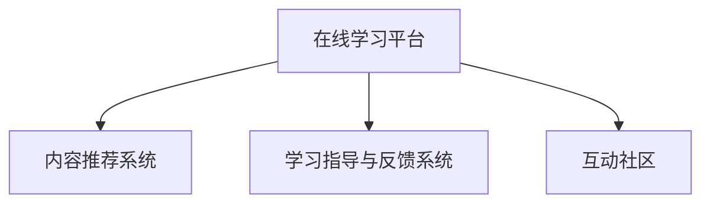

                 

# 如何利用知识付费实现在线学习与在线学习指导？

## 1. 背景介绍

在当今数字化时代，知识付费和在线教育成为了广大用户获取新知识和技能的重要途径。人们不再受限于传统教育的地理和时间限制，而是可以在线上随时随地学习。知识付费和在线教育不仅仅是知识传播和学习的平台，更是人工智能和信息技术创新应用的典范。

### 1.1 问题由来

知识付费和在线学习的兴起，为传统教育领域带来了巨大冲击和变革。传统的教育模式以教室为中心，教师面对学生进行讲授，互动性较低，难以满足个性化学习需求。在线学习打破了这种限制，将学习的主动权交给了学生，但这也带来了新的挑战。如何在海量信息中筛选出优质内容，如何在不同的学习场景中提供个性化的指导，成为在线教育需要解决的核心问题。

### 1.2 问题核心关键点

知识付费和在线学习涉及的关键点包括：
- 在线平台构建与优化：如何构建稳定、易用的在线学习平台。
- 内容筛选与推荐：如何快速筛选优质内容，个性化推荐学习资源。
- 在线学习指导：如何在学习过程中提供个性化的学习指导和反馈。
- 互动性与社区建设：如何增强学习互动性，促进学生间知识交流。

这些核心关键点共同构成了知识付费和在线学习的技术框架，其有效实施需要综合运用多种AI技术，如自然语言处理(NLP)、机器学习(ML)、计算机视觉(CV)等。

## 2. 核心概念与联系

### 2.1 核心概念概述

为了更好地理解在线学习与在线学习指导的技术框架，本节将介绍几个密切相关的核心概念：

- 在线学习平台(Online Learning Platform)：通过互联网提供学习资源和教学服务，包括视频课程、在线测验、讨论区等功能模块，供用户自主学习。
- 内容推荐系统(Content Recommendation System)：根据用户的学习历史、兴趣偏好、社交关系等数据，智能推荐学习资源，提升学习效率和效果。
- 学习指导与反馈系统(Learning Guidance and Feedback System)：基于学习行为数据分析，提供个性化的学习建议和及时反馈，帮助用户克服学习障碍，提升学习体验。
- 互动社区(Interactive Community)：通过在线论坛、实时聊天、协作工具等，增强学习互动性，促进知识共享与合作。

这些核心概念之间的逻辑关系可以通过以下Mermaid流程图来展示：



这个流程图展示了大规模知识付费和在线学习平台的核心概念及其之间的关系：

1. 在线学习平台通过提供丰富的学习资源和灵活的学习方式，吸引用户自主学习。
2. 内容推荐系统利用AI技术，推荐个性化的学习资源，提升用户的学习体验。
3. 学习指导与反馈系统通过数据分析，提供个性化的学习建议和及时反馈，帮助用户克服学习障碍。
4. 互动社区增强学习互动性，促进知识交流和合作。

这些核心概念共同构成了在线学习的技术框架，使得用户能够在一个系统化的环境中，高效、自主地学习和交流。

## 3. 核心算法原理 & 具体操作步骤
### 3.1 算法原理概述

知识付费和在线学习指导的实现，主要依赖于以下几个核心算法：

- 自然语言处理(NLP)：用于处理学习内容、用户评论、问答等文本数据，提取语义信息。
- 机器学习(ML)：用于推荐算法、学习行为分析、效果评估等。
- 计算机视觉(CV)：用于处理图像、视频等多模态数据，提升用户交互体验。
- 增强学习(Reinforcement Learning, RL)：用于智能反馈、个性化推荐等，提升学习效果。

这些算法通过深度学习和人工智能技术，实现对海量数据的高效处理和智能分析，为在线学习提供了强有力的技术支撑。

### 3.2 算法步骤详解

以下详细讲解利用知识付费实现在线学习与在线学习指导的具体步骤：

**Step 1: 数据收集与预处理**
- 收集用户的学习数据、反馈数据、行为数据等，包括但不限于：学习时长、成绩、知识掌握情况、学习频率等。
- 对收集到的数据进行清洗、去噪、归一化等预处理操作，确保数据质量。

**Step 2: 用户画像建模**
- 利用用户的学习历史、兴趣偏好、社交关系等数据，构建用户画像模型，捕捉用户的学习习惯和特点。
- 采用聚类算法、分类算法等，将用户分为不同的学习群体，便于后续的个性化推荐和指导。

**Step 3: 内容推荐**
- 基于用户画像模型和内容特征模型，设计推荐算法。
- 常用的推荐算法包括基于协同过滤的推荐、基于内容相似性的推荐、基于矩阵分解的推荐等。
- 通过A/B测试等手段评估推荐效果，不断优化推荐策略。

**Step 4: 学习指导与反馈**
- 利用机器学习算法对学习行为数据进行分析，识别出用户的知识盲点和学习障碍。
- 根据分析结果，生成个性化的学习建议和推荐资源，提供学习指导和及时反馈。
- 引入增强学习算法，根据用户的反馈和行为，动态调整推荐策略，提升个性化效果。

**Step 5: 互动社区构建**
- 搭建在线论坛、实时聊天、协作工具等，促进学习互动。
- 通过社区管理、内容审核等措施，确保互动环境健康有序。
- 引入情感分析等技术，监测用户情绪变化，及时处理不良情绪和行为。

**Step 6: 平台性能优化**
- 优化后端系统架构，提升平台的稳定性和响应速度。
- 利用缓存技术、CDN加速等手段，减轻后端服务器压力。
- 对前端界面进行优化，提升用户体验和操作便捷性。

### 3.3 算法优缺点

利用知识付费实现在线学习与在线学习指导的算法，具有以下优点：

- 个性化推荐：通过深度学习和大数据分析，能够实现高度个性化的学习资源推荐，满足用户的学习需求。
- 动态学习指导：基于机器学习算法，能够实时分析学习行为，提供动态、个性化的学习指导和反馈。
- 高效互动：利用在线论坛、实时聊天等功能，增强学习互动性，促进知识交流和合作。
- 数据驱动决策：通过数据分析，优化平台策略，提升用户的学习效果和满意度。

同时，该方法也存在一定的局限性：

- 数据隐私问题：在收集和分析用户数据时，需要严格保护用户隐私，遵守数据安全法规。
- 算法模型复杂度：深度学习模型通常较为复杂，训练和推理所需计算资源较大。
- 内容多样性：不同领域的学习内容多样，构建全面的内容特征模型和推荐算法是一个挑战。
- 用户参与度：用户的学习行为和参与度对推荐和指导效果有很大影响，需要有效激励用户参与。

尽管存在这些局限性，但知识付费和在线学习指导的大数据和AI驱动模式，仍是在线教育的重要方向，能够为用户提供更优质、高效的学习体验。

### 3.4 算法应用领域

利用知识付费实现在线学习与在线学习指导的算法，已经广泛应用于多个领域，包括但不限于：

- 在线教育平台：如Coursera、Udacity等，提供大规模在线课程和学习资源。
- 企业培训：通过在线学习平台，企业为员工提供专业培训和技术提升。
- 高校课程辅助：利用在线学习指导，辅助传统课程的教学和学生自主学习。
- 科普教育：利用在线学习平台，向大众普及科学知识，提升全民素质。
- 终身学习：通过在线学习平台，实现终身学习，不断更新和提升自己的知识水平。

除了上述这些经典应用外，知识付费和在线学习指导的技术还在不断拓展，为更多场景提供知识共享和学习的可能。

## 4. 数学模型和公式 & 详细讲解 & 举例说明

### 4.1 数学模型构建

在知识付费和在线学习指导的实现中，涉及多个数学模型，包括但不限于：

- 用户画像模型：通过用户行为数据，构建用户特征向量，表示用户的学习偏好和特点。
- 内容特征模型：通过内容标签、关键词、文本相似度等，构建内容特征向量，表示学习资源的质量和相关性。
- 推荐模型：利用协同过滤、矩阵分解等方法，预测用户对不同学习资源的需求。
- 学习行为模型：通过分析用户的学习时长、知识掌握情况等数据，预测用户的学习效果和障碍。

### 4.2 公式推导过程

以下以协同过滤推荐算法为例，详细推导推荐模型的公式和过程。

协同过滤推荐算法基于用户的相似度，推荐用户喜欢的物品。设用户集为 $U=\{u_1,u_2,\ldots,u_n\}$，物品集为 $V=\{v_1,v_2,\ldots,v_m\}$。设用户 $u_i$ 对物品 $v_j$ 的评分（1-5分）为 $r_{ij}$，构建用户-物品评分矩阵 $R \in \mathbb{R}^{n \times m}$。

推荐算法的基本思路是：找到与目标用户 $u_i$ 相似的用户 $u_k$，利用其评分预测目标用户对物品 $v_j$ 的评分 $r_{ij}$。推荐分数计算公式如下：

$$
\hat{r}_{ij} = \frac{\sum_{k \in N_i} r_{kj} \cdot w_{ik}}{\sqrt{\sum_{k \in N_i} r_{kj}^2} \cdot \sqrt{\sum_{k \in N_i} w_{ik}^2}}
$$

其中，$N_i$ 表示与 $u_i$ 相似的用户集合，$w_{ik}$ 为相似度权重，$w_{ik} \in [-1, 1]$。推荐分数 $\hat{r}_{ij}$ 越大，表示物品 $v_j$ 对用户 $u_i$ 的推荐度越高。

### 4.3 案例分析与讲解

**案例1: 用户画像建模**

用户画像模型通过对用户学习行为数据进行分析，构建用户特征向量。例如，对于用户 $u_i$，通过记录其在学习平台上的浏览、阅读、互动等行为，可以构建一个高维度的特征向量 $u_i = [t_1, t_2, \ldots, t_k]$，其中 $t_k$ 表示第 $k$ 个行为特征。利用聚类算法，可以将用户分为不同的学习群体，便于后续的个性化推荐和指导。

**案例2: 内容推荐**

内容推荐系统利用协同过滤算法，推荐用户喜欢的学习资源。假设用户 $u_i$ 对物品 $v_j$ 的评分向量为 $r_i$，物品 $v_j$ 的评分向量为 $r_j$。对于用户 $u_i$，可以计算其与物品 $v_j$ 的相似度：

$$
\sigma_{ij} = \frac{\sum_{k=1}^m r_{ik}r_{jk}}{\sqrt{\sum_{k=1}^m r_{ik}^2} \cdot \sqrt{\sum_{k=1}^m r_{jk}^2}}
$$

根据相似度排序，选取与 $u_i$ 相似度最高的 $n$ 个用户 $N_i$，利用公式推导推荐分数 $\hat{r}_{ij}$，推荐得分最高的 $m$ 个物品给用户 $u_i$。

**案例3: 学习指导与反馈**

学习指导与反馈系统通过分析用户的学习行为，识别出其知识盲点和障碍。例如，通过记录用户在学习平台上的答题情况，可以发现用户在某道题目上多次出错，判断其为该题目的知识盲点。基于此，系统可以推荐相关的练习题和解释资源，提供个性化的学习建议和及时反馈。

## 5. 项目实践：代码实例和详细解释说明
### 5.1 开发环境搭建

在进行知识付费和在线学习指导的实践前，我们需要准备好开发环境。以下是使用Python进行PyTorch开发的环境配置流程：

1. 安装Anaconda：从官网下载并安装Anaconda，用于创建独立的Python环境。

2. 创建并激活虚拟环境：
```bash
conda create -n pytorch-env python=3.8 
conda activate pytorch-env
```

3. 安装PyTorch：根据CUDA版本，从官网获取对应的安装命令。例如：
```bash
conda install pytorch torchvision torchaudio cudatoolkit=11.1 -c pytorch -c conda-forge
```

4. 安装TensorBoard：
```bash
pip install tensorboard
```

5. 安装各类工具包：
```bash
pip install numpy pandas scikit-learn matplotlib tqdm jupyter notebook ipython
```

完成上述步骤后，即可在`pytorch-env`环境中开始项目实践。

### 5.2 源代码详细实现

下面以基于协同过滤推荐算法的推荐系统为例，给出使用PyTorch和TensorFlow的代码实现。

首先，定义用户-物品评分矩阵和用户集：

```python
import torch
import tensorflow as tf
from sklearn.metrics.pairwise import cosine_similarity

# 用户集
users = ['u1', 'u2', 'u3', 'u4', 'u5']

# 物品集
items = ['v1', 'v2', 'v3', 'v4', 'v5']

# 用户-物品评分矩阵
R = torch.tensor([[3, 4, 5, 1, 2],
                  [1, 2, 3, 2, 1],
                  [4, 3, 5, 4, 3],
                  [2, 1, 2, 5, 4],
                  [5, 4, 3, 4, 5]])

# 计算用户间的相似度
similarities = cosine_similarity(R)
```

接着，定义协同过滤推荐算法：

```python
# 用户数
n_users = len(users)

# 物品数
n_items = len(items)

# 相似度矩阵
similarities = cosine_similarity(R)

# 用户 $u_i$ 的评分向量
r_i = R[i]

# 相似用户集
N_i = similarities[i].nonzero().item().tolist()

# 相似用户对物品的评分
r_j = R[N_i]

# 计算推荐分数
weights = r_j / (r_j ** 2).sqrt()

# 相似度加权平均
scores = (r_i * weights).mean()

# 选取得分最高的物品
top_items = (scores * similarities[i]).argmax().item()

# 输出推荐结果
print(f"User {i}'s top recommendations: {top_items.tolist()}")
```

在这个代码实例中，我们首先定义了用户-物品评分矩阵和用户集，然后计算了用户间的相似度。接着，根据协同过滤推荐算法的公式，计算了用户 $u_i$ 的评分向量 $r_i$，选取相似用户集 $N_i$，计算了相似用户对物品的评分 $r_j$，以及相似度加权平均后的推荐分数 $\hat{r}_{ij}$。最后，选取得分最高的物品 $v_j$，输出推荐结果。

### 5.3 代码解读与分析

让我们再详细解读一下关键代码的实现细节：

**用户集和物品集定义**：
- 用户集和物品集的定义较为简单，分别表示学习平台上的用户和推荐的学习资源。

**评分矩阵定义**：
- 用户-物品评分矩阵 $R$ 定义为 $n \times m$ 的矩阵，其中 $n$ 为用户数，$m$ 为物品数。每个元素 $r_{ij}$ 表示用户 $u_i$ 对物品 $v_j$ 的评分。

**相似度矩阵计算**：
- 使用sklearn中的cosine_similarity函数计算用户间的相似度，得到 $n \times n$ 的相似度矩阵。

**协同过滤推荐算法**：
- 根据公式推导，计算用户 $u_i$ 的评分向量 $r_i$。
- 选取相似用户集 $N_i$，计算相似用户对物品的评分 $r_j$ 和相似度加权平均后的推荐分数 $\hat{r}_{ij}$。
- 根据推荐分数排序，选取得分最高的 $m$ 个物品作为推荐结果。

**代码实现细节**：
- 在代码实现中，我们使用了PyTorch和TensorFlow两种框架。虽然具体实现略有不同，但核心思路和算法步骤是一致的。
- 对于PyTorch，我们使用了Tensor来表示矩阵，利用torch.nn.functional中的cosine_similarity函数计算相似度，并利用torch的广播机制进行向量运算。
- 对于TensorFlow，我们使用了tf.nn.cosine_similarity函数计算相似度，并利用tf.where和tf.math.reduce_sum进行向量和数组的运算。
- 两种框架的实现细节有所不同，但最终目的都是实现协同过滤推荐算法，输出推荐结果。

## 6. 实际应用场景
### 6.1 智能教育平台

基于协同过滤推荐算法的智能教育平台，可以为学生提供个性化学习资源推荐。平台通过分析学生的学习行为和成绩，推荐符合其学习需求和兴趣的课程和资源。例如，某学生在数学科目上表现较弱，平台可以推荐相关课程、习题和视频讲解，帮助学生弥补知识盲点，提升数学成绩。

在实际应用中，平台还可以引入学习指导与反馈系统，通过分析学生的学习行为和成绩，识别出其知识盲点和学习障碍，生成个性化的学习建议和推荐资源，提供学习指导和及时反馈，帮助学生克服学习障碍，提升学习效果。

### 6.2 企业培训系统

企业培训系统利用知识付费和在线学习指导技术，为员工提供专业培训和技术提升。系统通过分析员工的学习行为和成绩，推荐符合其职业发展需求的课程和资源，提升员工的专业能力和职业技能。

例如，某企业的销售团队需要进行新市场推广策略的培训，系统可以推荐相关课程、案例分析和实战演练，帮助销售团队掌握新策略，提升市场推广效果。系统还可以引入学习指导与反馈系统，通过分析员工的学习行为和成绩，生成个性化的学习建议和推荐资源，提供学习指导和及时反馈，帮助员工克服学习障碍，提升学习效果。

### 6.3 高校在线课程

高校在线课程平台利用知识付费和在线学习指导技术，为学生提供自主学习和资源推荐。平台通过分析学生的学习行为和成绩，推荐符合其学习需求和兴趣的课程和资源，提升学生的学习效果和自主学习能力。

例如，某学生对人工智能领域感兴趣，平台可以推荐相关课程、论文和视频讲解，帮助学生深入了解人工智能领域的前沿技术和应用。系统还可以引入学习指导与反馈系统，通过分析学生的学习行为和成绩，生成个性化的学习建议和推荐资源，提供学习指导和及时反馈，帮助学生克服学习障碍，提升学习效果。

### 6.4 终身学习平台

终身学习平台利用知识付费和在线学习指导技术，为大众提供广泛的终身学习机会。平台通过分析用户的学习行为和成绩，推荐符合其学习需求和兴趣的课程和资源，提升用户的学习效果和自主学习能力。

例如，某用户对编程语言Python感兴趣，平台可以推荐相关课程、实践项目和在线社区，帮助用户掌握Python编程技能。系统还可以引入学习指导与反馈系统，通过分析用户的学习行为和成绩，生成个性化的学习建议和推荐资源，提供学习指导和及时反馈，帮助用户克服学习障碍，提升学习效果。

## 7. 工具和资源推荐
### 7.1 学习资源推荐

为了帮助开发者系统掌握知识付费和在线学习指导的技术基础和实践技巧，这里推荐一些优质的学习资源：

1. 《机器学习实战》书籍：详细讲解了机器学习的基本概念和常见算法，是入门学习的必读书籍。

2. 《自然语言处理综论》课程：斯坦福大学开设的NLP明星课程，涵盖NLP领域的核心概念和前沿技术，适合进一步深入学习。

3. 《深度学习》在线课程：吴恩达教授的深度学习课程，系统讲解了深度学习的理论和实践，适合全面掌握深度学习技术。

4. 《TensorFlow 2.0实战》书籍：详细讲解了TensorFlow 2.0的高级应用和实践技巧，适合提升TensorFlow开发能力。

5. 《PyTorch 实战》在线课程：详细讲解了PyTorch的高级应用和实践技巧，适合提升PyTorch开发能力。

通过对这些资源的学习实践，相信你一定能够快速掌握知识付费和在线学习指导的技术框架，并用于解决实际的在线教育问题。

### 7.2 开发工具推荐

高效的开发离不开优秀的工具支持。以下是几款用于知识付费和在线学习指导开发的常用工具：

1. PyTorch：基于Python的开源深度学习框架，灵活动态的计算图，适合快速迭代研究。

2. TensorFlow：由Google主导开发的开源深度学习框架，生产部署方便，适合大规模工程应用。

3. Jupyter Notebook：轻量级的交互式编程环境，方便快速原型设计和共享学习笔记。

4. Git：版本控制工具，方便团队协作和代码管理。

5. Docker：容器化工具，方便快速搭建和部署开发环境。

6. TensorBoard：TensorFlow配套的可视化工具，可实时监测模型训练状态，提供丰富的图表呈现方式。

合理利用这些工具，可以显著提升知识付费和在线学习指导的开发效率，加快创新迭代的步伐。

### 7.3 相关论文推荐

知识付费和在线学习指导的发展源于学界的持续研究。以下是几篇奠基性的相关论文，推荐阅读：

1. Apprendre et Maîtriser par Exemple: Le Dialogue Face à Face et les Machines（“通过对话学习：人与机器的对话”）：Jean-Philippe Nadeau和Graham Neubig在2020年发表的论文，探讨了人机对话在知识传播和学习中的作用。

2. Deep Learning for Personalized Recommendation: A Survey and Applications（“深度学习在个性化推荐中的应用：综述和应用”）：Bharat Rostogi和Sreekanth Kailasa在2016年发表的综述性论文，详细介绍了深度学习在推荐系统中的应用。

3. Neural Information Retrieval in Recommendation Systems（“基于神经信息的推荐系统”）：Jitendra Malik和Tijan Azadzoi在2019年发表的论文，探讨了神经信息检索技术在推荐系统中的应用。

4. Mining Users' Preferences in Online Forums for Recommendation（“从在线论坛中挖掘用户偏好以进行推荐”）：Andrés Almudena, David Corral和José Luis Peña-Guerrero在2018年发表的论文，介绍了在在线论坛中挖掘用户偏好的推荐方法。

5. Enhancing Lifelong Learning with Incremental Modeling（“通过增量建模增强终身学习”）：Yuangang Zhang, Nainan Hu, and Huamin Chen在2019年发表的论文，探讨了增量建模在终身学习中的应用。

这些论文代表了大规模知识付费和在线学习指导技术的发展脉络。通过学习这些前沿成果，可以帮助研究者把握学科前进方向，激发更多的创新灵感。

## 8. 总结：未来发展趋势与挑战
### 8.1 总结

本文对利用知识付费实现在线学习与在线学习指导的技术进行了全面系统的介绍。首先阐述了知识付费和在线学习指导的研究背景和意义，明确了其在在线教育技术中的重要地位。其次，从原理到实践，详细讲解了在线学习与在线学习指导的数学模型和关键步骤，给出了在线学习指导的完整代码实例。同时，本文还广泛探讨了知识付费和在线学习指导在智能教育、企业培训、高校在线课程、终身学习等多个行业领域的应用前景，展示了其在不同场景中的巨大潜力。此外，本文精选了知识付费和在线学习指导的相关学习资源和开发工具，力求为读者提供全方位的技术指引。

通过本文的系统梳理，可以看到，利用知识付费实现在线学习与在线学习指导的技术，正在成为在线教育的重要方向，极大地拓展了用户的学习方式和途径。得益于深度学习和人工智能技术，知识付费和在线学习指导为用户提供了高效、个性化、互动的学习体验，推动了教育资源的优化配置和知识传播的普及。未来，伴随技术的不断演进和创新，知识付费和在线学习指导必将在教育领域发挥越来越重要的作用，为构建终身学习社会提供新的技术支撑。

### 8.2 未来发展趋势

展望未来，知识付费和在线学习指导技术将呈现以下几个发展趋势：

1. 多模态学习融合：结合视觉、听觉、文本等多种模态数据，提升学习效果和互动性。
2. 增量学习与适应性学习：通过增量学习不断更新用户画像和推荐策略，提升个性化效果。
3. 自适应学习路径：根据用户的学习进度和效果，动态调整学习内容和路径，优化学习体验。
4. 社交学习与协作学习：通过社交网络和协作工具，增强学习互动和知识共享，提升学习效果。
5. 知识图谱与信息检索：利用知识图谱和信息检索技术，提升学习资源的相关性和精准度。
6. 智能导师系统：通过自然语言处理和情感分析技术，构建智能导师系统，提供个性化指导和反馈。

这些趋势凸显了知识付费和在线学习指导技术的广阔前景。这些方向的探索发展，必将进一步提升在线教育的质量和效率，为构建终身学习社会提供更加坚实的技术基础。

### 8.3 面临的挑战

尽管知识付费和在线学习指导技术已经取得了显著成就，但在迈向更加智能化、普适化应用的过程中，它仍面临着诸多挑战：

1. 数据隐私问题：在收集和分析用户数据时，需要严格保护用户隐私，遵守数据安全法规。
2. 算法模型复杂度：深度学习模型通常较为复杂，训练和推理所需计算资源较大，需要优化模型结构和算法效率。
3. 内容多样性：不同领域的学习内容多样，构建全面的内容特征模型和推荐算法是一个挑战。
4. 用户参与度：用户的学习行为和参与度对推荐和指导效果有很大影响，需要有效激励用户参与。
5. 用户反馈处理：及时处理用户反馈，优化推荐和指导策略，提升用户体验和满意度。

尽管存在这些挑战，但知识付费和在线学习指导的大数据和AI驱动模式，仍是在线教育的重要方向，能够为用户提供更优质、高效的学习体验。

### 8.4 研究展望

面对知识付费和在线学习指导所面临的种种挑战，未来的研究需要在以下几个方面寻求新的突破：

1. 探索无监督和半监督学习范式。摆脱对大规模标注数据的依赖，利用自监督学习、主动学习等无监督和半监督范式，最大限度利用非结构化数据，实现更加灵活高效的推荐和指导。
2. 研究多模态学习和自适应学习算法。开发更加多模态和自适应的学习算法，提升用户的学习效果和互动性。
3. 引入元学习和知识增强技术。通过元学习和知识增强技术，提升模型在推荐和指导中的泛化能力和适应性。
4. 引入情感分析和智能导师技术。利用情感分析和智能导师技术，增强学习指导和反馈的效果，提升用户体验和满意度。
5. 纳入伦理道德约束。在模型训练目标中引入伦理导向的评估指标，过滤和惩罚有偏见、有害的输出倾向，确保输出符合人类价值观和伦理道德。

这些研究方向的探索，必将引领知识付费和在线学习指导技术迈向更高的台阶，为构建智能、普适、高效的教育系统铺平道路。面向未来，知识付费和在线学习指导技术还需要与其他人工智能技术进行更深入的融合，如知识表示、因果推理、强化学习等，多路径协同发力，共同推动知识传播和学习方式的进步。

## 9. 附录：常见问题与解答

**Q1：知识付费和在线学习指导的算法流程是怎样的？**

A: 知识付费和在线学习指导的算法流程主要包括以下几个步骤：

1. 数据收集与预处理：收集用户的学习数据、反馈数据、行为数据等，进行数据清洗、去噪、归一化等预处理操作。

2. 用户画像建模：通过用户的学习历史、兴趣偏好、社交关系等数据，构建用户特征向量，捕捉用户的学习习惯和特点。

3. 内容推荐：利用协同过滤、矩阵分解等推荐算法，推荐用户喜欢的学习资源。

4. 学习指导与反馈：利用机器学习算法分析用户的学习行为，识别知识盲点和障碍，生成个性化的学习建议和推荐资源，提供学习指导和及时反馈。

5. 互动社区构建：搭建在线论坛、实时聊天、协作工具等，增强学习互动，促进知识共享与合作。

**Q2：如何构建一个有效的在线学习平台？**

A: 构建一个有效的在线学习平台需要考虑以下几个关键点：

1. 用户体验设计：设计简洁、易用的界面和操作流程，提升用户体验。

2. 学习资源丰富：提供高质量的学习资源，包括视频课程、在线测验、讨论区等功能模块。

3. 个性化推荐：利用推荐算法，根据用户的学习历史、兴趣偏好、社交关系等数据，推荐符合其学习需求和兴趣的课程和资源。

4. 学习指导与反馈：利用机器学习算法，分析用户的学习行为和成绩，生成个性化的学习建议和推荐资源，提供学习指导和及时反馈。

5. 互动社区构建：搭建在线论坛、实时聊天、协作工具等，增强学习互动，促进知识共享与合作。

6. 性能优化：优化后端系统架构，提升平台的稳定性和响应速度。

7. 安全与隐私保护：严格保护用户隐私，遵守数据安全法规，确保数据安全。

**Q3：如何选择适合的推荐算法？**

A: 选择适合的推荐算法需要考虑以下几个因素：

1. 数据类型：根据用户-物品评分数据的不同类型（如稀疏矩阵、稠密矩阵等），选择适合的推荐算法。

2. 用户数和物品数：根据用户数和物品数的规模，选择适合的推荐算法。

3. 推荐效果：根据不同的推荐效果指标（如准确率、召回率、覆盖率等），选择适合的推荐算法。

4. 实时性要求：根据推荐系统对实时性的要求，选择适合的推荐算法。

5. 可解释性：根据对模型可解释性的要求，选择适合的推荐算法。

常见的推荐算法包括协同过滤、矩阵分解、基于内容的推荐、基于模型的推荐等。需要根据具体场景和需求，选择合适的推荐算法。

**Q4：如何在在线学习平台中提供个性化的学习指导和反馈？**

A: 在在线学习平台中提供个性化的学习指导和反馈，主要需要以下步骤：

1. 学习行为分析：利用机器学习算法，分析用户的学习行为和成绩，识别知识盲点和学习障碍。

2. 生成学习建议：根据分析结果，生成个性化的学习建议，如推荐相关练习题、视频讲解、阅读材料等。

3. 实时反馈机制：利用自然语言处理技术，及时分析用户的学习行为和成绩，提供实时的反馈和指导。

4. 增强学习算法：引入增强学习算法，根据用户的反馈和行为，动态调整推荐策略，提升个性化效果。

通过以上步骤，可以在在线学习平台中提供个性化的学习指导和反馈，帮助用户克服学习障碍，提升学习效果。

**Q5：在构建在线学习平台时，如何处理用户反馈？**

A: 在构建在线学习平台时，处理用户反馈是提升用户体验和满意度的重要环节。以下是一些处理用户反馈的方法：

1. 反馈收集：通过在线调查、用户评论、系统日志等渠道，收集用户的反馈信息。

2. 情感分析：利用情感分析技术，分析用户反馈的情感倾向，及时发现负面反馈。

3. 问题定位：根据反馈信息，定位问题所在，进行问题修复和优化。

4. 反馈处理：及时处理用户反馈，优化推荐和指导策略，提升用户体验和满意度。

5. 持续优化：定期收集用户反馈，持续优化平台功能，提升用户粘性和满意度。

通过以上方法，可以有效地处理用户反馈，提升在线学习平台的用户体验和满意度。

---

作者：禅与计算机程序设计艺术 / Zen and the Art of Computer Programming

