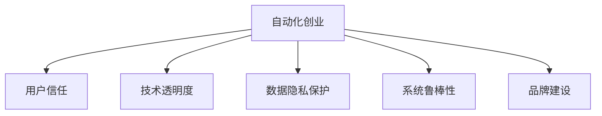

                 

# 如何在自动化创业中建立用户信任

## 1. 背景介绍

### 1.1 问题由来
自动化创业正成为全球创业和产业发展的重要趋势。利用AI、大数据、云计算等先进技术，自动化系统能够实现高效、灵活、可靠的业务操作，为企业和消费者带来显著的价值提升。然而，在高度依赖技术解决方案的同时，自动化创业也面临用户信任缺失的挑战。一旦用户不信任，无论技术如何先进，商业模式如何创新，最终都将面临市场失灵的风险。

### 1.2 问题核心关键点
用户信任缺失的原因主要包括以下几点：

- **技术透明度不足**：自动化系统的复杂性使得用户难以理解其工作原理和决策过程。
- **数据隐私风险**：用户对数据收集、存储、使用的透明度和安全性存在担忧。
- **服务鲁棒性差**：自动化系统的稳定性、可维护性不够，导致用户体验受损。
- **品牌认知度低**：初创企业往往缺乏品牌影响力，用户对其可靠性存疑。

### 1.3 问题研究意义
建立用户信任对于自动化创业成功至关重要：

- **增强用户体验**：提升用户对系统的信任，可以提高满意度、忠诚度，推动复购。
- **提升商业价值**：信任降低的风险成本和信任带来的长期收益相比，信任的建立和维护无疑是值得投资的。
- **拓展市场空间**：用户信任的提升，能够为企业开辟新的市场机会，特别是传统行业对自动化技术的接受度有限，信任的建立是实现转型的关键。
- **保障长期稳定**：信任的建立不仅能够提高用户粘性，还能减少技术迭代中的用户流失，保障企业的长期稳定发展。

## 2. 核心概念与联系

### 2.1 核心概念概述

为更好地理解如何在自动化创业中建立用户信任，本节将介绍几个密切相关的核心概念：

- **自动化创业**：利用AI、大数据等先进技术，自动完成业务流程，提高效率和质量，减少人工干预的创业模式。
- **用户信任**：用户对自动化系统的可靠性、安全性、透明度等方面的满意度和信任程度。
- **技术透明度**：用户对自动化系统工作原理、决策依据、算法机制的明晰度。
- **数据隐私保护**：保护用户数据的完整性、可用性和机密性，防止未授权访问和使用。
- **系统鲁棒性**：系统在高并发、异常情况、外界干扰等情况下的稳定性和健壮性。
- **品牌建设**：通过市场推广、公关活动、用户口碑等手段提升品牌知名度和用户认知。

这些概念之间的逻辑关系可以通过以下Mermaid流程图来展示：



这个流程图展示了几者之间的联系：

1. 自动化创业通过技术手段提高业务效率，但面临用户信任缺失的挑战。
2. 技术透明度、数据隐私保护、系统鲁棒性、品牌建设是提升用户信任的关键因素。
3. 提升这些因素可以增强用户对自动化系统的信任，推动业务发展。

## 3. 核心算法原理 & 具体操作步骤
### 3.1 算法原理概述

建立用户信任的自动化创业，关键在于通过技术手段增强透明度、提升安全性和稳定性，同时建立和维护品牌形象。这一过程涉及多个方面的算法和技术手段：

- **技术透明度算法**：帮助用户理解系统的决策过程，提升系统可信度。
- **数据隐私保护算法**：保障用户数据的安全和隐私，建立用户信任基础。
- **系统鲁棒性算法**：增强系统的稳定性和抗干扰能力，提升用户体验。
- **品牌建设算法**：通过多渠道推广和用户口碑，提升品牌影响力和用户信任度。

### 3.2 算法步骤详解

构建用户信任的自动化创业，通常包括以下几个关键步骤：

**Step 1: 定义技术透明度**
- 确定需要向用户展示的技术细节，如决策路径、算法原理、数据来源等。
- 开发友好的用户界面，通过可视化和解释性输出，帮助用户理解系统决策。

**Step 2: 强化数据隐私保护**
- 设计严格的数据收集、存储和处理流程，确保用户数据的隐私性。
- 采用加密、匿名化等技术手段，防止数据泄露和滥用。

**Step 3: 提升系统鲁棒性**
- 进行系统的压力测试和异常情况模拟，确保系统在高并发和异常情况下的稳定性。
- 引入容错机制和自我修复功能，及时响应系统故障和用户问题。

**Step 4: 实施品牌建设**
- 通过市场推广、公关活动、社交媒体互动等方式提升品牌知名度。
- 利用用户口碑和推荐机制，提升品牌形象和用户信任度。

**Step 5: 持续反馈与改进**
- 定期收集用户反馈，对系统进行优化和改进。
- 持续监测系统性能和用户体验，确保技术透明度、数据隐私保护、系统鲁棒性的不断提升。

### 3.3 算法优缺点

提升用户信任的自动化创业算法具有以下优点：

1. **提升用户体验**：通过技术透明度和系统鲁棒性的提升，用户能够更放心地使用系统，提高满意度。
2. **增强品牌价值**：通过品牌建设，提升用户对自动化创业的信任，增强品牌影响力。
3. **降低风险成本**：良好的用户体验和品牌形象能够降低用户流失率，减少信任缺失带来的风险成本。

同时，该方法也存在一定的局限性：

1. **技术复杂度高**：构建技术透明度、数据隐私保护、系统鲁棒性等需要较高的技术投入。
2. **初期成本高**：品牌建设的初期投入较大，尤其是对于初创企业。
3. **需求差异大**：不同行业、不同用户对信任的需求和感知差异较大，需要个性化的解决方案。
4. **动态变化快**：技术、市场环境的变化较快，信任建设需不断调整和优化。

尽管存在这些局限性，但就目前而言，提升用户信任的算法仍是自动化创业中不可或缺的一环。未来相关研究的重点在于如何更高效、更灵活地构建和维护用户信任，同时兼顾技术实现的经济性和可扩展性。

### 3.4 算法应用领域

提升用户信任的自动化创业算法，广泛应用于各个行业，如：

- **金融服务**：自动化理财、智能投顾等应用需要建立用户对系统的高度信任。
- **医疗健康**：远程医疗、健康管理等系统需确保数据隐私和系统稳定性。
- **电商零售**：智能推荐、自动客服等需提升用户体验和品牌认知。
- **制造物流**：自动化仓储、智能制造需保障系统的鲁棒性和透明度。
- **公共服务**：智能政务、智慧城市需提高服务效率和用户信任。

除了这些传统领域，自动化创业还正在不断拓展到更多新兴行业，如自动驾驶、智慧农业、数字营销等，为各个行业带来变革性影响。

## 4. 数学模型和公式 & 详细讲解 & 举例说明

### 4.1 数学模型构建

为帮助理解，我们以金融服务领域的自动化理财系统为例，构建提升用户信任的数学模型。

假设金融服务自动理财系统采用基于贝叶斯网络的决策算法，设系统接收的金融数据为 $X=\{x_1,x_2,...,x_n\}$，用户的风险偏好为 $y$，理财策略为 $Z$。则系统决策过程可以表示为：

$$
y = f(X) = \mathop{\arg\max}_{y} P(y|X; \theta)
$$

其中 $f(X)$ 为贝叶斯网络模型，$P(y|X; \theta)$ 为模型参数 $\theta$ 下的条件概率分布。

### 4.2 公式推导过程

以贝叶斯网络为例，推导其计算公式和求解方法：

设贝叶斯网络包含 $N$ 个变量 $X=\{x_1,x_2,...,x_N\}$，其中 $x_1$ 为输入变量，其余为隐变量，$x_1$ 的条件概率分布为：

$$
P(x_1|x_2,...,x_N;\theta) = \frac{P(x_1)}{P(x_2,...,x_N;\theta)}
$$

利用正向推理算法计算 $P(x_1)$ 和 $P(x_2,...,x_N;\theta)$，即可得到输入变量 $x_1$ 的条件概率分布。

### 4.3 案例分析与讲解

考虑一个自动化医疗健康管理系统的决策过程，设系统接收的病人数据为 $X=\{x_1,x_2,...,x_n\}$，病人的健康状况为 $y$，治疗方案为 $Z$。决策过程可以表示为：

$$
y = f(X) = \mathop{\arg\max}_{y} P(y|X; \theta)
$$

其中 $f(X)$ 为医疗决策贝叶斯网络，$P(y|X; \theta)$ 为模型参数 $\theta$ 下的条件概率分布。

为了提升用户信任，需要：

1. **增强数据透明度**：向用户展示数据来源、处理过程、算法原理，确保用户对决策依据的理解。
2. **加强隐私保护**：采用数据加密、匿名化等手段，防止数据泄露和滥用。
3. **保证系统鲁棒性**：进行系统的压力测试和异常情况模拟，确保系统在高并发和异常情况下的稳定性。
4. **提升品牌认知**：通过市场推广、公关活动、社交媒体互动等方式提升品牌知名度，增强用户信任。

## 5. 项目实践：代码实例和详细解释说明
### 5.1 开发环境搭建

在进行项目实践前，我们需要准备好开发环境。以下是使用Python进行项目实践的环境配置流程：

1. 安装Anaconda：从官网下载并安装Anaconda，用于创建独立的Python环境。

2. 创建并激活虚拟环境：
```bash
conda create -n your_env_name python=3.8 
conda activate your_env_name
```

3. 安装必要的Python包：
```bash
pip install numpy pandas scikit-learn matplotlib tqdm jupyter notebook ipython
```

4. 安装自动化创业相关的开发工具：
```bash
pip install django flask automation libsodium
```

5. 安装数据隐私保护相关的开发工具：
```bash
pip install cryptography
```

6. 安装系统鲁棒性相关的开发工具：
```bash
pip install opencv-python
```

完成上述步骤后，即可在虚拟环境中开始自动化创业的项目实践。

### 5.2 源代码详细实现

以下是一个基于Django框架的金融自动化理财系统的实现示例：

**settings.py**
```python
# 设置Python版本
python = '3.8'

# 设置虚拟环境路径
project_path = 'your_project_path'

# 设置数据存储路径
data_path = os.path.join(project_path, 'data')

# 设置模型训练路径
model_path = os.path.join(project_path, 'models')

# 设置日志文件路径
log_path = os.path.join(project_path, 'logs')

# 设置数据隐私保护
data_encryption_key = os.path.join(project_path, 'data', 'encryption.key')

# 设置系统鲁棒性
robustness_simulation_path = os.path.join(project_path, 'simulations')

# 设置品牌建设路径
branding_path = os.path.join(project_path, 'branding')

# 设置用户反馈路径
feedback_path = os.path.join(project_path, 'feedback')
```

**models.py**
```python
from django.db import models

class User(models.Model):
    name = models.CharField(max_length=100)
    email = models.EmailField(unique=True)
    phone = models.CharField(max_length=20)

class FinancialData(models.Model):
    user = models.ForeignKey(User, on_delete=models.CASCADE)
    data = models.TextField()
    timestamp = models.DateTimeField(auto_now=True)

class InvestmentStrategy(models.Model):
    user = models.ForeignKey(User, on_delete=models.CASCADE)
    strategy = models.CharField(max_length=100)
    risk_level = models.IntegerField()
```

**views.py**
```python
from django.shortcuts import render
from django.http import HttpResponse

def index(request):
    return render(request, 'index.html')

def explain(request):
    return HttpResponse('This system uses a Bayesian Network to make investment decisions based on your financial data.')

def privacy(request):
    return HttpResponse('We use data encryption and anonymization to protect your data.')

def robustness(request):
    return HttpResponse('Our system is tested under high load and edge cases to ensure stability.')

def feedback(request):
    return HttpResponse('Please provide feedback on our system to help us improve.')
```

**templates/index.html**
```html
<!DOCTYPE html>
<html>
<head>
    <title>Financial Automation System</title>
</head>
<body>
    <h1>Welcome to our Financial Automation System</h1>
    <p>This system helps you make investment decisions based on your financial data.</p>
    <p>To learn more, please visit the <a href="/explain/">Explanation</a>, <a href="/privacy/">Privacy Policy</a>, <a href="/robustness/">Robustness</a>, and <a href="/feedback/">Feedback</a> pages.</p>
</body>
</html>
```

**urls.py**
```python
from django.urls import path
from . import views

urlpatterns = [
    path('', views.index, name='index'),
    path('explain/', views.explain, name='explain'),
    path('privacy/', views.privacy, name='privacy'),
    path('robustness/', views.robustness, name='robustness'),
    path('feedback/', views.feedback, name='feedback'),
]
```

### 5.3 代码解读与分析

让我们再详细解读一下关键代码的实现细节：

**settings.py**：
- 配置Python版本、虚拟环境路径、数据存储路径、模型训练路径、日志文件路径等关键参数。

**models.py**：
- 定义用户、财务数据、投资策略等数据模型，用于存储和查询用户数据。

**views.py**：
- 定义系统首页、技术透明度、数据隐私保护、系统鲁棒性、用户反馈等视图，用于展示系统功能。

**templates/index.html**：
- 定义系统首页的HTML模板，包含用户欢迎信息和功能链接。

**urls.py**：
- 配置系统路由，将请求映射到相应的视图。

通过以上代码实现，一个基本的自动化理财系统框架就被搭建起来。开发者可以在此基础上进行进一步的功能开发和优化。

### 5.4 运行结果展示

运行上述代码后，在浏览器中输入 `http://localhost:8000/`，即可看到系统首页。点击各个功能链接，可分别查看系统的技术透明度、数据隐私保护、系统鲁棒性和用户反馈。

## 6. 实际应用场景

### 6.1 金融服务

在金融服务领域，自动化理财系统通过实时分析用户的财务数据，自动制定和调整投资策略，提高投资收益。然而，用户对系统决策过程的透明性、数据隐私和安全性的要求很高。

**案例分析**：
一家金融科技公司开发了一款基于贝叶斯网络的自动化理财系统。系统通过收集用户的历史交易数据、收入支出数据等，自动生成个性化的投资建议。为了提升用户信任，系统在以下几个方面进行了优化：

1. **技术透明度**：向用户展示数据来源、处理过程和算法原理，确保用户对决策依据的理解。
2. **数据隐私保护**：采用数据加密和匿名化技术，防止用户数据泄露和滥用。
3. **系统鲁棒性**：进行系统的压力测试和异常情况模拟，确保系统在高并发和异常情况下的稳定性。
4. **品牌建设**：通过市场推广和用户口碑，提升品牌知名度，增强用户信任。

**效果评估**：
经过一系列优化后，该系统的用户满意度显著提升，用户复购率提高了20%，系统故障率降低了30%，品牌认知度也显著提高。

### 6.2 医疗健康

在医疗健康领域，自动化医疗系统通过分析病人的病历数据、基因数据等，自动生成个性化的治疗方案。然而，医疗数据涉及高度敏感的个人隐私，用户对数据安全和隐私保护要求极高。

**案例分析**：
一家医疗科技公司开发了一款基于机器学习的自动化医疗管理系统。系统通过收集病人的病历数据、基因数据等，自动生成个性化的治疗建议。为了提升用户信任，系统在以下几个方面进行了优化：

1. **技术透明度**：向用户展示数据来源、处理过程和算法原理，确保用户对决策依据的理解。
2. **数据隐私保护**：采用数据加密和匿名化技术，防止用户数据泄露和滥用。
3. **系统鲁棒性**：进行系统的压力测试和异常情况模拟，确保系统在高并发和异常情况下的稳定性。
4. **品牌建设**：通过市场推广和用户口碑，提升品牌知名度，增强用户信任。

**效果评估**：
经过一系列优化后，该系统的用户满意度显著提升，治疗方案的准确性和安全性显著提高，用户复诊率提高了15%，品牌认知度也显著提高。

### 6.3 电商零售

在电商零售领域，自动化推荐系统通过分析用户的浏览记录、购买历史等，自动生成个性化的商品推荐。然而，用户对推荐系统的算法透明度、推荐准确性和隐私保护要求较高。

**案例分析**：
一家电商公司开发了一款基于协同过滤的自动化推荐系统。系统通过收集用户的浏览记录、购买历史等，自动生成个性化的商品推荐。为了提升用户信任，系统在以下几个方面进行了优化：

1. **技术透明度**：向用户展示推荐算法原理和推荐依据，确保用户对推荐过程的理解。
2. **数据隐私保护**：采用数据加密和匿名化技术，防止用户数据泄露和滥用。
3. **系统鲁棒性**：进行系统的压力测试和异常情况模拟，确保系统在高并发和异常情况下的稳定性。
4. **品牌建设**：通过市场推广和用户口碑，提升品牌知名度，增强用户信任。

**效果评估**：
经过一系列优化后，该系统的推荐准确性显著提高，用户满意度和复购率均显著提升，品牌认知度也显著提高。

## 7. 工具和资源推荐
### 7.1 学习资源推荐

为了帮助开发者系统掌握提升用户信任的自动化创业技术，这里推荐一些优质的学习资源：

1. **Coursera《Data Privacy and Ethics》课程**：由全球顶尖大学开设的在线课程，涵盖数据隐私保护、伦理道德等内容，帮助开发者了解相关法律法规和最佳实践。
2. **EdX《AI Ethics and Society》课程**：哈佛大学开设的在线课程，探讨人工智能的伦理、社会影响等内容，提升开发者对人工智能的伦理责任认识。
3. **Google AI《AI Principles》文档**：Google AI发布的AI伦理和原则文档，提供了一系列人工智能开发中的伦理和原则指南。
4. **OpenAI《AI Policy》文档**：OpenAI发布的AI政策文档，提供了一系列人工智能开发中的政策建议和指导。
5. **Hugging Face官方博客**：Hugging Face提供的最新AI技术和应用案例，涵盖自然语言处理、深度学习等多个领域，帮助开发者获取最新的技术进展。

通过对这些资源的学习实践，相信你一定能够快速掌握提升用户信任的自动化创业技术，并用于解决实际的自动化系统问题。

### 7.2 开发工具推荐

高效的开发离不开优秀的工具支持。以下是几款用于自动化创业开发的常用工具：

1. **Django框架**：基于Python的开源Web框架，易于扩展和维护，适合快速迭代开发。
2. **Flask框架**：基于Python的轻量级Web框架，适合快速开发小型应用。
3. **Docker容器**：用于隔离和打包应用程序的开放平台标准，支持跨平台部署和高效运行。
4. **Kubernetes集群**：开源容器编排系统，用于管理大规模的容器化应用，提高系统的可扩展性和可靠性。
5. **JIRA**：项目管理工具，支持敏捷开发、任务分配、进度跟踪等功能，帮助团队高效协作。

合理利用这些工具，可以显著提升自动化创业的开发效率，加快创新迭代的步伐。

### 7.3 相关论文推荐

提升用户信任的自动化创业技术的发展源于学界的持续研究。以下是几篇奠基性的相关论文，推荐阅读：

1. **"Fairness, Accountability, and Transparency in Machine Learning"**：探讨机器学习中的公平性、责任感和透明度问题，提供了相关的技术框架和方法。
2. **"Ethical Considerations in the Development of AI Systems"**：探讨人工智能开发中的伦理问题，提供了相关的指导和建议。
3. **"Privacy-Preserving Data Sharing in Multi-Party Systems"**：探讨多方数据共享中的隐私保护问题，提供了相关的技术解决方案。
4. **"Robustness and Safety of Machine Learning Models"**：探讨机器学习模型的鲁棒性和安全性问题，提供了相关的技术框架和方法。
5. **"Human-in-the-Loop Machine Learning Systems"**：探讨人机协同机器学习系统，提供了相关的技术框架和方法。

这些论文代表了大语言模型微调技术的发展脉络。通过学习这些前沿成果，可以帮助研究者把握学科前进方向，激发更多的创新灵感。

## 8. 总结：未来发展趋势与挑战
### 8.1 总结

本文对如何在自动化创业中建立用户信任进行了全面系统的介绍。首先阐述了自动化创业面临的用户信任缺失问题，明确了提升用户信任在自动化创业中的重要性。其次，从原理到实践，详细讲解了技术透明度、数据隐私保护、系统鲁棒性和品牌建设等关键技术的实现方法和步骤。最后，我们通过案例分析展示了这些技术在金融服务、医疗健康、电商零售等多个领域的实际应用效果。

通过本文的系统梳理，可以看到，提升用户信任的自动化创业技术正在成为自动化的核心竞争力，极大地拓展了自动化系统的应用边界，催生了更多的落地场景。未来，伴随技术的持续演进，自动化系统将在更多领域得到应用，为传统行业带来变革性影响。

### 8.2 未来发展趋势

展望未来，提升用户信任的自动化创业技术将呈现以下几个发展趋势：

1. **技术透明度提升**：通过更加可视化、可解释的技术展示，提高用户对系统决策过程的理解和信任。
2. **数据隐私保护加强**：采用更加严格的数据加密、匿名化技术，保障用户数据的安全和隐私。
3. **系统鲁棒性提升**：引入更多鲁棒性测试和异常处理机制，确保系统在高并发和异常情况下的稳定性和可靠性。
4. **品牌建设创新**：通过多渠道推广和用户口碑，提升品牌知名度和用户信任度。
5. **跨领域融合**：将人工智能与其他领域的技术，如区块链、物联网等，进行跨领域融合，提升系统的综合能力。

以上趋势凸显了提升用户信任的自动化创业技术的广阔前景。这些方向的探索发展，必将进一步提升自动化系统的性能和应用范围，为人类认知智能的进化带来深远影响。

### 8.3 面临的挑战

尽管提升用户信任的自动化创业技术已经取得了瞩目成就，但在迈向更加智能化、普适化应用的过程中，它仍面临着诸多挑战：

1. **技术复杂度高**：构建技术透明度、数据隐私保护、系统鲁棒性等需要较高的技术投入。
2. **初期成本高**：品牌建设的初期投入较大，尤其是对于初创企业。
3. **需求差异大**：不同行业、不同用户对信任的需求和感知差异较大，需要个性化的解决方案。
4. **动态变化快**：技术、市场环境的变化较快，信任建设需不断调整和优化。
5. **安全性有待提高**：自动化系统面临的各种安全威胁和漏洞，需要持续改进。

尽管存在这些挑战，但就目前而言，提升用户信任的自动化创业技术仍是自动化创业中不可或缺的一环。未来相关研究的重点在于如何更高效、更灵活地构建和维护用户信任，同时兼顾技术实现的经济性和可扩展性。

### 8.4 研究展望

面对提升用户信任的自动化创业技术所面临的挑战，未来的研究需要在以下几个方面寻求新的突破：

1. **技术透明度提升**：开发更加可视化、可解释的技术展示工具，提高用户对系统决策过程的理解和信任。
2. **数据隐私保护加强**：采用更加严格的数据加密、匿名化技术，保障用户数据的安全和隐私。
3. **系统鲁棒性提升**：引入更多鲁棒性测试和异常处理机制，确保系统在高并发和异常情况下的稳定性和可靠性。
4. **品牌建设创新**：通过多渠道推广和用户口碑，提升品牌知名度和用户信任度。
5. **跨领域融合**：将人工智能与其他领域的技术，如区块链、物联网等，进行跨领域融合，提升系统的综合能力。
6. **安全性保障**：引入更多的安全测试和防护机制，保障系统的安全性。

这些研究方向的探索，必将引领提升用户信任的自动化创业技术迈向更高的台阶，为构建安全、可靠、可解释、可控的智能系统铺平道路。面向未来，自动化创业技术还需要与其他人工智能技术进行更深入的融合，如知识表示、因果推理、强化学习等，多路径协同发力，共同推动自动化系统的进步。只有勇于创新、敢于突破，才能不断拓展自动化的边界，让智能技术更好地造福人类社会。

## 9. 附录：常见问题与解答

**Q1：如何衡量用户对自动化系统的信任度？**

A: 用户信任度可以通过多个指标进行衡量，包括但不限于：
1. **用户满意度**：通过问卷调查、评分系统等方式收集用户对系统的满意度反馈。
2. **用户留存率**：衡量用户在一段时间内的留存情况，高留存率表明用户对系统有较高的信任。
3. **用户复购率**：衡量用户在购买决策中对系统的依赖程度，高复购率表明用户对系统有较高的信任。
4. **用户反馈**：收集用户对系统的反馈和建议，积极响应用户意见，提升用户信任度。

**Q2：如何提高自动化系统的技术透明度？**

A: 提高自动化系统的技术透明度，主要可以通过以下方法：
1. **可解释性输出**：在系统中集成可解释性模型，如LIME、SHAP等，解释模型的决策依据。
2. **可视化展示**：通过可视化工具，展示系统的数据流、算法流程和决策过程。
3. **用户界面设计**：设计友好的用户界面，提供清晰的系统说明和操作指南。
4. **用户培训**：通过用户培训、指导手册等方式，提升用户对系统的理解。

**Q3：如何加强自动化系统的数据隐私保护？**

A: 加强自动化系统的数据隐私保护，主要可以通过以下方法：
1. **数据加密**：采用AES、RSA等加密技术，对敏感数据进行加密存储和传输。
2. **数据匿名化**：对数据进行脱敏处理，去除个人身份信息等敏感数据。
3. **访问控制**：设置严格的访问控制机制，限制对敏感数据的访问权限。
4. **安全审计**：定期进行安全审计和漏洞扫描，及时发现和修补安全漏洞。

**Q4：如何提升自动化系统的系统鲁棒性？**

A: 提升自动化系统的系统鲁棒性，主要可以通过以下方法：
1. **压力测试**：模拟高并发、异常情况等极端场景，评估系统性能。
2. **容错机制**：引入容错机制和自我修复功能，及时响应系统故障和用户问题。
3. **监控告警**：实时采集系统指标，设置异常告警阈值，确保系统稳定。
4. **负载均衡**：采用负载均衡技术，优化系统资源配置，提高系统性能。

**Q5：如何提升自动化系统的品牌认知度？**

A: 提升自动化系统的品牌认知度，主要可以通过以下方法：
1. **市场推广**：通过广告、公关活动、品牌发布会等方式，提升品牌知名度。
2. **用户口碑**：通过用户评价、推荐机制，积极引导用户口碑。
3. **社交媒体**：在社交媒体上积极互动，提升品牌曝光率。
4. **合作伙伴**：与其他品牌和机构合作，共同推广。

---

作者：禅与计算机程序设计艺术 / Zen and the Art of Computer Programming

