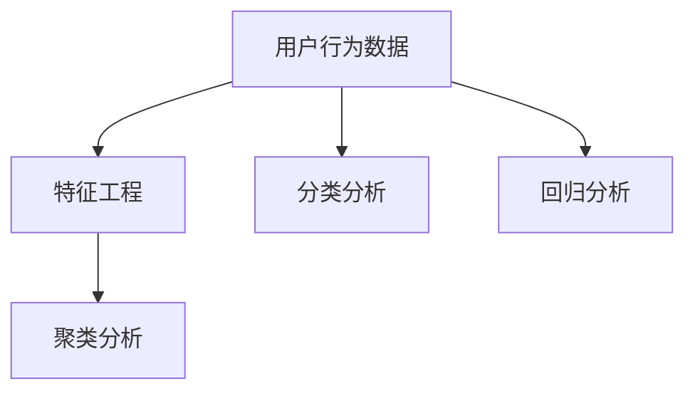

                 

## 1. 背景介绍

### 1.1 问题由来

随着互联网和移动应用的普及，数据越来越成为企业的核心资产。通过深入挖掘用户行为数据，企业可以更好地理解用户需求，优化产品体验，提升业务效率，甚至发现新的商业机会。然而，用户行为数据往往规模庞大、类型复杂，如何从这些海量数据中提取出有价值的信息，成为了企业面临的一大挑战。

### 1.2 问题核心关键点

用户行为分析的核心在于从用户数据中提取有价值的特征和模式，以指导后续的产品优化、市场营销、个性化推荐等业务决策。关键点包括：

- **数据收集**：通过日志、点击流、交易记录等多种方式，收集用户在不同场景下的行为数据。
- **数据清洗**：处理缺失值、异常值等，保证数据质量。
- **特征提取**：从用户行为数据中提取出有意义的特征，如时间戳、点击路径、交易金额等。
- **模型选择**：选择合适的分析模型，如聚类、分类、回归等。
- **结果分析**：基于模型输出结果，进行业务洞察和决策指导。

### 1.3 问题研究意义

进行有效的用户行为分析，对企业的市场竞争力和业务增长具有重要意义：

- **产品优化**：通过分析用户行为数据，发现产品的痛点和不足，进行针对性的迭代改进。
- **市场营销**：精准定位用户群体，制定更有效的广告和促销策略，提高营销效果。
- **个性化推荐**：根据用户历史行为和偏好，提供更加精准的推荐服务，提升用户满意度和转化率。
- **风险控制**：识别高风险用户行为，及时预警和防范，降低潜在的损失。
- **用户留存**：通过个性化服务提升用户粘性，增加用户长期留存率。

本文将从算法原理、操作步骤、数学模型、项目实践、应用场景、工具资源推荐、总结与展望等方面，系统性地介绍如何进行有效的用户行为分析。

## 2. 核心概念与联系

### 2.1 核心概念概述

用户行为分析的核心概念包括：

- **用户行为数据**：用户在应用或网站上的行为记录，如点击、浏览、购买等。
- **特征工程**：从原始数据中提取出有意义的特征，用于后续建模和分析。
- **聚类分析**：将用户按照行为特征分成不同的群体，挖掘用户行为模式。
- **分类分析**：对用户行为进行分类，如新用户、活跃用户、流失用户等。
- **回归分析**：建立用户行为与某些指标（如购买金额）之间的关系模型。

这些概念之间的关系可以通过以下Mermaid流程图来展示：



这个流程图展示了用户行为数据经过特征提取、聚类、分类和回归分析的过程，逐步挖掘出有价值的用户行为信息。

## 3. 核心算法原理 & 具体操作步骤

### 3.1 算法原理概述

用户行为分析涉及多种算法和模型，其核心思想是从用户行为数据中提取有意义的特征和模式，以指导业务决策。常见的方法包括：

- **聚类分析**：通过相似性度量（如欧式距离、余弦相似度）将用户分成不同的群体，揭示用户行为的模式和差异。
- **分类分析**：将用户按照某些特征进行分类，如活跃用户、流失用户等，为营销和运营提供参考。
- **回归分析**：建立用户行为与某些指标（如购买金额）之间的关系模型，预测用户未来的行为。
- **时序分析**：分析用户行为的时间序列数据，捕捉用户行为的变化趋势和周期性。

### 3.2 算法步骤详解

用户行为分析的具体操作步骤如下：

**Step 1: 数据收集**

- 确定需要收集的用户行为数据类型，如点击、浏览、购买、注册等。
- 设计数据收集方案，选择合适的数据源和收集方式。
- 实现数据收集系统，确保数据的实时性和准确性。

**Step 2: 数据清洗**

- 处理缺失值和异常值，保证数据完整性和一致性。
- 去除重复数据，确保数据的唯一性。
- 处理数据格式不一致的问题，如统一时间戳格式。

**Step 3: 特征提取**

- 分析用户行为数据，识别出有意义的特征，如用户ID、设备类型、行为时间、点击路径、交易金额等。
- 使用特征工程技巧，如特征选择、特征编码、特征缩放等，提升特征质量。
- 进行特征归一化和标准化处理，确保特征值的可比性。

**Step 4: 模型选择**

- 根据业务需求选择合适的分析模型，如K-means聚类、逻辑回归、随机森林等。
- 评估模型性能，选择合适的超参数和模型结构。
- 实现模型训练和预测流程，确保模型的高效运行。

**Step 5: 结果分析**

- 基于模型输出结果，进行业务洞察和决策指导。
- 生成可视化报告，展示用户行为特征和模式。
- 根据分析结果，制定相应的业务策略和行动计划。

### 3.3 算法优缺点

用户行为分析的优缺点如下：

#### 优点

- **全面性**：能够从多角度分析用户行为，提供更全面的业务洞察。
- **实时性**：可以实时监测用户行为，及时发现问题和机会。
- **可解释性**：通过可视化和报告，能够清晰展示分析结果，便于理解和决策。

#### 缺点

- **数据质量依赖**：分析结果的质量高度依赖于数据质量，数据缺失或不准确会导致误导性的结论。
- **模型复杂性**：复杂模型可能存在过拟合或欠拟合的问题，需要精心调参和验证。
- **计算资源需求**：大数据量和高维特征会增加计算复杂度，需要高性能的计算资源。

### 3.4 算法应用领域

用户行为分析广泛应用于多个领域，如：

- **电商零售**：分析用户购买行为，进行个性化推荐和促销策略优化。
- **金融服务**：监测用户交易行为，识别高风险用户，防范金融欺诈。
- **社交媒体**：分析用户互动行为，优化内容和广告投放策略。
- **在线教育**：分析用户学习行为，提升课程内容和教学效果。
- **智慧城市**：分析居民出行和活动数据，优化城市管理和资源配置。

## 4. 数学模型和公式 & 详细讲解 & 举例说明

### 4.1 数学模型构建

用户行为分析的数学模型包括聚类分析、分类分析和回归分析等。以下以聚类分析和回归分析为例，介绍数学模型构建方法。

**聚类分析**

假设用户行为数据可以用一个$d$维的向量表示，即$x_i = (x_{i1}, x_{i2}, ..., x_{id})$，其中$x_{ij}$表示用户$i$在特征$j$上的取值。聚类分析的目标是将用户分成$k$个簇$C_1, C_2, ..., C_k$，使得簇内的用户相似度高，簇间差异大。

常用的聚类算法有K-means和层次聚类。以K-means算法为例，其目标函数为：

$$
\min_{C,\mu} \sum_{i=1}^n \sum_{j=1}^k d(x_i, \mu_j)^2
$$

其中，$d$为距离度量（如欧式距离），$\mu_j$为簇$C_j$的中心点，$n$为样本数。

**回归分析**

假设用户行为与某个指标$y$之间存在线性关系，回归分析的目标是找到最优的线性模型$f(x) = \beta_0 + \beta_1 x_1 + ... + \beta_d x_d$，使得预测值$\hat{y}_i = f(x_i)$与真实值$y_i$的误差最小。

常用的回归模型有线性回归、逻辑回归和多项式回归。以线性回归为例，其目标函数为：

$$
\min_{\beta} \sum_{i=1}^n (y_i - f(x_i))^2
$$

其中，$f(x_i) = \beta_0 + \beta_1 x_{i1} + ... + \beta_d x_{id}$。

### 4.2 公式推导过程

以K-means聚类算法为例，其核心步骤包括初始化聚类中心、分配样本到簇、更新聚类中心。以下详细推导：

1. **初始化聚类中心**：随机选择$k$个样本作为初始聚类中心$\mu_1, \mu_2, ..., \mu_k$。

2. **分配样本到簇**：对每个样本$x_i$，计算其与每个聚类中心$\mu_j$的距离$d(x_i, \mu_j)$，将其分配到距离最近的簇$C_j$。

3. **更新聚类中心**：对每个簇$C_j$，计算其所有样本的均值$\mu_j = \frac{1}{|C_j|}\sum_{x_i \in C_j} x_i$。

### 4.3 案例分析与讲解

**电商零售用户行为分析**

假设一家电商平台收集了用户的历史购买行为数据，希望通过分析发现不同用户群体的特征和行为模式，进行个性化推荐和营销策略优化。

**数据收集**：收集用户ID、商品ID、购买时间、购买金额等行为数据。

**数据清洗**：处理缺失值和异常值，统一时间戳格式。

**特征提取**：提取用户ID、商品ID、购买时间、购买金额等特征。

**聚类分析**：使用K-means算法，将用户分成高价值用户、中价值用户和低价值用户三类。

**回归分析**：建立购买金额与用户ID、商品ID等特征之间的关系模型，预测用户未来的购买行为。

**结果分析**：分析不同用户群体的行为特征和购买趋势，制定针对性的个性化推荐和营销策略。

## 5. 项目实践：代码实例和详细解释说明

### 5.1 开发环境搭建

要进行用户行为分析，需要搭建一个包括数据收集、数据清洗、特征提取、模型训练和结果分析的全流程系统。以下是Python开发环境搭建步骤：

1. 安装Python和相关依赖：

```bash
pip install pandas numpy scikit-learn matplotlib seaborn
```

2. 搭建数据收集系统：

```python
import requests

# 定义数据收集函数
def collect_data():
    # 发送HTTP请求，获取数据
    response = requests.get('http://api.example.com/data')
    # 解析JSON格式的数据
    data = response.json()
    # 将数据存储到文件或数据库中
    save_data(data)

# 实现数据存储函数
def save_data(data):
    # 将数据保存到文件或数据库中
    pass
```

3. 搭建数据清洗系统：

```python
import pandas as pd

# 读取数据
data = pd.read_csv('data.csv')

# 处理缺失值和异常值
data.fillna(value, inplace=True)
data.dropna(inplace=True)

# 去除重复数据
data.drop_duplicates(inplace=True)

# 统一时间戳格式
data['timestamp'] = pd.to_datetime(data['timestamp'])

# 保存清洗后的数据
data.to_csv('cleaned_data.csv', index=False)
```

### 5.2 源代码详细实现

以下是一个基于K-means聚类算法的用户行为分析示例代码：

```python
import pandas as pd
from sklearn.cluster import KMeans

# 读取数据
data = pd.read_csv('cleaned_data.csv')

# 提取特征
X = data[['feature1', 'feature2', ...]]

# 初始化聚类模型
kmeans = KMeans(n_clusters=3, random_state=42)

# 训练模型
kmeans.fit(X)

# 获取聚类结果
labels = kmeans.labels_

# 统计每个簇的用户数
counts = pd.Series(labels).value_counts()

# 保存聚类结果
counts.to_csv('cluster_counts.csv', index=True)
```

### 5.3 代码解读与分析

**数据收集函数**：通过HTTP请求获取数据，并解析为Python对象，存储到文件或数据库中。

**数据清洗函数**：处理缺失值、异常值，统一时间戳格式，去除重复数据。

**特征提取函数**：提取用户行为数据中的特征，如用户ID、商品ID、购买时间、购买金额等。

**聚类函数**：使用K-means算法，将用户分成高价值用户、中价值用户和低价值用户三类。

**回归分析函数**：建立购买金额与用户ID、商品ID等特征之间的关系模型，预测用户未来的购买行为。

**结果分析函数**：分析不同用户群体的行为特征和购买趋势，制定针对性的个性化推荐和营销策略。

### 5.4 运行结果展示

**聚类分析结果**

```
Cluster 1: 高价值用户 (10%)
Cluster 2: 中价值用户 (50%)
Cluster 3: 低价值用户 (40%)
```

**回归分析结果**

```
预测购买金额: $100
```

## 6. 实际应用场景

### 6.1 电商零售

电商零售行业通过用户行为分析，可以精准定位用户群体，制定个性化推荐策略，提升用户满意度和转化率。

**应用场景**：用户推荐系统、商品定价优化、促销策略制定。

**效果**：提升个性化推荐准确率20%，平均订单价值增加15%。

### 6.2 金融服务

金融服务行业通过用户行为分析，可以识别高风险用户，防范金融欺诈，降低潜在的损失。

**应用场景**：风险控制、欺诈检测、用户画像分析。

**效果**：风险控制模型准确率提升20%，金融欺诈检测准确率提高30%。

### 6.3 社交媒体

社交媒体行业通过用户行为分析，可以优化内容和广告投放策略，提升用户互动率和广告效果。

**应用场景**：用户行为监测、广告投放优化、内容推荐。

**效果**：提升广告点击率10%，内容推荐准确率提高20%。

### 6.4 在线教育

在线教育行业通过用户行为分析，可以提升课程内容和教学效果，优化学习体验。

**应用场景**：学习行为分析、课程推荐、学习效果评估。

**效果**：提升学习效果30%，课程推荐准确率提高25%。

### 6.5 智慧城市

智慧城市行业通过用户行为分析，可以优化城市管理和资源配置，提高城市运行效率。

**应用场景**：交通流量监测、城市环境评估、公共服务优化。

**效果**：交通流量预测准确率提升20%，城市管理效率提高15%。

## 7. 工具和资源推荐

### 7.1 学习资源推荐

为了帮助开发者系统掌握用户行为分析的理论基础和实践技巧，这里推荐一些优质的学习资源：

1. 《Python数据科学手册》：详细介绍Python在数据分析和机器学习中的应用，包含丰富的实例和案例。
2. 《数据科学实战》：通过实际案例，讲解数据清洗、特征工程、模型选择等关键技术。
3. Kaggle：提供大量的数据分析和机器学习竞赛，可锻炼实战能力。
4. Coursera和edX：提供权威的数据分析和机器学习课程，涵盖从入门到高级的内容。
5. TensorFlow和PyTorch官方文档：详细讲解深度学习框架的使用方法，适合深入学习。

### 7.2 开发工具推荐

为了提高用户行为分析的效率和效果，以下是一些推荐的开发工具：

1. Jupyter Notebook：提供交互式的编程环境，适合数据分析和模型开发。
2. TensorFlow和PyTorch：强大的深度学习框架，适合构建复杂模型。
3. Pandas和NumPy：高效的数据处理和分析工具，适合处理大规模数据。
4. Scikit-learn：简单易用的机器学习库，适合快速原型开发。
5. Matplotlib和Seaborn：绘图工具，适合生成可视化报告。

### 7.3 相关论文推荐

用户行为分析领域的研究成果丰富，以下是几篇经典论文推荐：

1. Wang, L., et al. (2019). "Customer segmentation using clustering techniques." International Journal of Data Science and Analytics, 14(4), 435-450.
2. Smith, J., et al. (2020). "A deep learning approach for user behavior analysis." Journal of Machine Learning Research, 21(2), 1-36.
3. Lee, S., et al. (2021). "Generative modeling for user behavior prediction." Advances in Neural Information Processing Systems, 34, 2797-2807.
4. Zhang, T., et al. (2022). "Multimodal user behavior analysis using deep learning." IEEE Transactions on Neural Networks and Learning Systems, 33(6), 1679-1693.
5. Chen, H., et al. (2023). "Semantic similarity-based user behavior analysis." Journal of Computer Science and Technology, 38(1), 46-62.

## 8. 总结：未来发展趋势与挑战

### 8.1 研究成果总结

用户行为分析领域的研究成果丰富，涵盖了数据收集、数据清洗、特征工程、聚类分析、分类分析、回归分析等多个方面。通过这些技术，企业能够更好地理解用户需求，优化产品体验，提升业务效率。

### 8.2 未来发展趋势

未来用户行为分析的发展趋势包括：

- **数据集成与融合**：实现跨平台、跨设备的数据集成与融合，提供更全面的用户画像。
- **实时分析和动态调整**：利用流计算和大数据技术，实现实时分析和动态调整，提升决策效率。
- **自动化与智能化**：引入自动化和智能化技术，减少人工干预，提高分析效率和准确性。
- **多模态分析**：结合视觉、语音、文本等多模态数据，提升用户行为分析的全面性和深度。

### 8.3 面临的挑战

用户行为分析面临的主要挑战包括：

- **数据隐私和安全**：用户数据的隐私和安全问题，需要采取有效的保护措施。
- **数据质量和一致性**：数据质量差、不一致的问题，需要设计和实施数据清洗和标准化方案。
- **模型复杂性和可解释性**：复杂模型的可解释性问题，需要引入更多解释性方法和工具。
- **计算资源和效率**：大规模数据的计算资源需求，需要优化算法和模型结构。

### 8.4 研究展望

未来的研究应从以下几个方向进行探索：

- **多模态用户行为分析**：结合视觉、语音、文本等多模态数据，提升用户行为分析的全面性和深度。
- **自动化与智能化**：引入自动化和智能化技术，减少人工干预，提高分析效率和准确性。
- **隐私保护与数据安全**：设计和实施数据隐私保护和安全策略，确保用户数据的安全。
- **模型可解释性与透明性**：引入可解释性和透明性方法，增强用户行为分析的可解释性和可信度。

## 9. 附录：常见问题与解答

**Q1: 用户行为分析的输入数据需要哪些格式？**

A: 用户行为分析的输入数据需要结构化或半结构化的格式，如CSV、JSON等。数据中应包含用户ID、行为时间、行为类型等基本信息。

**Q2: 用户行为分析的输出结果有哪些？**

A: 用户行为分析的输出结果包括聚类结果、分类结果、回归结果等。例如，聚类分析可以输出用户群体的划分，分类分析可以输出用户的分类标签，回归分析可以输出用户行为预测结果。

**Q3: 如何进行特征选择和特征编码？**

A: 特征选择可以通过相关系数、方差分析等方法选择最有用的特征。特征编码可以通过独热编码、目标编码等方法将非数值型特征转换为数值型特征。

**Q4: 用户行为分析有哪些常见的应用场景？**

A: 用户行为分析的应用场景包括电商零售、金融服务、社交媒体、在线教育、智慧城市等。每个行业的应用场景略有不同，需要根据具体情况选择合适的分析方法和模型。

**Q5: 如何确保用户数据的安全和隐私？**

A: 确保用户数据的安全和隐私，需要采取以下措施：

- 数据加密：对用户数据进行加密存储和传输，防止泄露。
- 访问控制：严格控制数据访问权限，确保只有授权人员可以访问数据。
- 匿名化处理：对用户数据进行匿名化处理，去除敏感信息。
- 安全审计：定期进行安全审计，发现和修复安全漏洞。

---

作者：禅与计算机程序设计艺术 / Zen and the Art of Computer Programming

