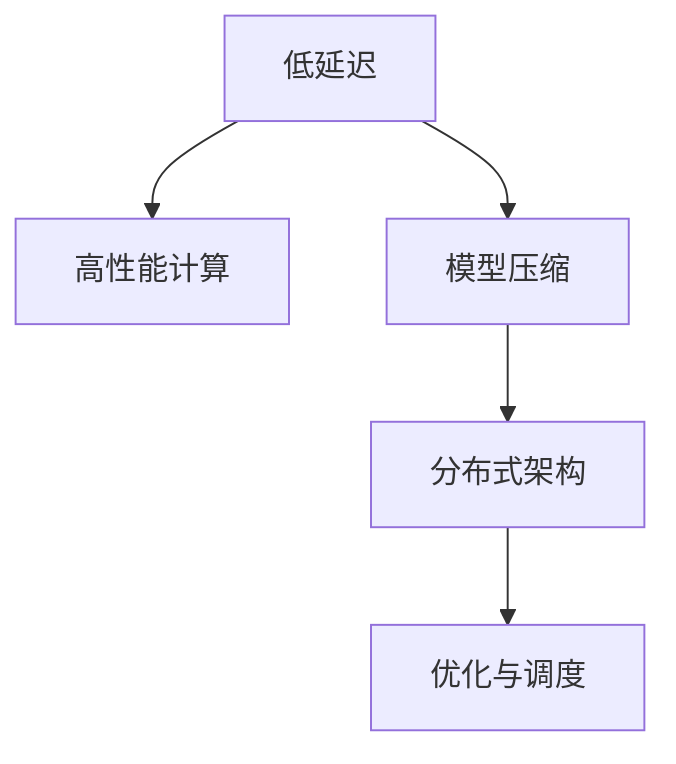
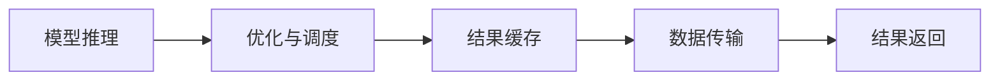

                 

# 实时AI推理服务：Lepton AI的低延迟方案

> 关键词：实时AI推理,Lepton AI,低延迟,高性能计算,分布式架构,优化算法,模型压缩,优化与调度,系统性能分析

## 1. 背景介绍

随着人工智能技术的飞速发展，越来越多的企业开始应用AI技术以提升业务效率和竞争力。然而，将复杂且资源密集型的AI模型部署到实际应用中，往往面临性能和成本的双重挑战。大模型的推理速度受限于计算资源的瓶颈，高延时问题成为制约AI大规模应用的重要因素。针对这一痛点，Lepton AI开发了专为高性能实时AI推理服务设计的低延迟方案，能够快速、稳定地处理大规模AI推理任务，同时确保系统的高性能和可扩展性。

本文将详细阐述Lepton AI实时AI推理服务的核心原理和关键技术，包括低延迟架构、高性能计算优化、模型压缩与调度等。通过探讨Lepton AI的实际应用案例，分析其在不同场景下的性能表现，探讨未来发展趋势及面临的挑战，旨在为读者提供深度见解和全面分析，帮助理解这一创新技术的潜力及实施步骤。

## 2. 核心概念与联系

### 2.1 核心概念概述

为更好地理解Lepton AI实时AI推理服务，本文将首先介绍几个关键概念：

- **低延迟**：指系统响应时间短，能够满足实时应用场景的要求，通常指延迟在10毫秒以下。
- **高性能计算**：指能够快速处理大规模计算任务，通常依赖于高效的并行计算架构和算法。
- **模型压缩**：指在不显著降低模型性能的前提下，通过量化、剪枝等技术减小模型大小，从而降低计算和存储需求。
- **分布式架构**：指将计算资源分布在多个节点上，通过协同工作提高整体处理能力，同时支持系统的可扩展性。
- **优化与调度**：指通过智能的算法和调度策略，优化计算资源的利用率，减少延时和资源消耗。

这些核心概念之间的逻辑关系可以通过以下Mermaid流程图来展示：



该流程图展示低延迟AI推理服务的核心概念及其之间的关系：

1. 低延迟AI推理服务依赖于高性能计算。
2. 高性能计算通过分布式架构提高计算能力。
3. 分布式架构结合模型压缩减少资源需求。
4. 模型压缩与优化与调度共同作用，优化系统性能。

### 2.2 核心概念原理和架构的 Mermaid 流程图

以下展示的是低延迟AI推理服务的主要架构，包括模型推理、优化与调度、结果返回等关键组件及其相互关系：



该架构图中：
- 模型推理组件负责执行AI模型对输入数据的推理计算。
- 优化与调度组件负责优化模型推理性能，如选择合适的算法和调度策略，以确保低延迟。
- 结果缓存组件用于缓存推理结果，减少结果返回的延时。
- 数据传输组件负责在模型推理组件与结果缓存组件之间传递数据。
- 结果返回组件将推理结果返回给调用方。

## 3. 核心算法原理 & 具体操作步骤

### 3.1 算法原理概述

Lepton AI实时AI推理服务的核心算法原理主要围绕低延迟、高性能计算、模型压缩与调度等方面展开：

1. **低延迟优化**：通过选择合适的推理算法、调度策略、结果缓存技术等，最小化推理计算和数据传输的延时，确保实时响应。
2. **高性能计算**：利用分布式架构、并行计算等技术，提高计算能力，支持大规模计算任务。
3. **模型压缩**：通过量化、剪枝等技术，减小模型大小，降低计算和存储需求，提高推理效率。
4. **优化与调度**：采用智能算法和调度策略，优化资源利用率，减少延时和资源消耗。

### 3.2 算法步骤详解

以下详细介绍Lepton AI实时AI推理服务的具体操作步骤：

1. **预处理**：
   - 收集输入数据，并进行必要的前置处理，如数据格式转换、特征提取等。
   - 根据推理任务选择合适的AI模型。

2. **模型推理**：
   - 将预处理后的数据输入到AI模型中，进行推理计算。
   - 通过分布式计算和并行计算技术，加速推理计算过程。

3. **结果优化与缓存**：
   - 对推理结果进行优化，如去重、聚合、过滤等操作，以减少后续数据传输和处理的量。
   - 使用结果缓存技术，将优化后的结果缓存到内存或磁盘中，减少结果返回的延时。

4. **数据传输**：
   - 通过高效的通信协议和数据传输技术，将优化后的结果从缓存组件传输到调用方。

5. **结果返回**：
   - 将优化后的结果返回给调用方，供后续业务处理或展示。

6. **监控与调优**：
   - 实时监控推理过程的性能指标，如计算时间、内存占用、网络带宽等。
   - 根据监控数据，自动调整算法和调度策略，优化系统性能。

### 3.3 算法优缺点

Lepton AI实时AI推理服务具有以下优点：

- **高效性能**：通过高性能计算和分布式架构，可快速处理大规模计算任务，满足实时应用需求。
- **灵活调度**：通过优化与调度算法，能够智能选择最优资源，降低延时和资源消耗。
- **低延迟**：通过结果缓存和数据传输优化，确保结果快速返回，满足低延迟要求。

同时，该服务也存在以下局限性：

- **模型限制**：模型压缩和优化可能影响模型性能，某些复杂模型难以实现低延迟。
- **资源依赖**：高性能计算和分布式架构需要强大的硬件资源支持。
- **成本较高**：初始部署和运维成本较高，需要专门的团队和技术支持。

### 3.4 算法应用领域

Lepton AI实时AI推理服务广泛应用于以下几个领域：

- **智能客服**：实时处理客户咨询，提供即时的答案和服务。
- **金融交易**：实时监控市场动态，快速执行交易操作。
- **医疗诊断**：实时分析医疗数据，快速提供诊断结果。
- **智能制造**：实时监控生产线状态，快速调整生产参数。
- **智慧城市**：实时处理城市监控数据，优化城市管理。

## 4. 数学模型和公式 & 详细讲解 & 举例说明

### 4.1 数学模型构建

Lepton AI实时AI推理服务的核心数学模型主要包括：

- **模型推理算法**：如深度学习模型的前向传播算法。
- **优化算法**：如梯度下降、随机梯度下降等。
- **调度算法**：如动态任务调度算法、贪心算法等。

### 4.2 公式推导过程

以深度学习模型的前向传播算法为例，展示数学模型的推导过程：

$$
f(x) = \sum_{i=1}^{n} w_i f_i(x)
$$

其中，$x$为输入数据，$w_i$为模型参数，$f_i(x)$为模型组件$i$的输出。该公式表示深度学习模型通过多个组件对输入数据进行处理，最终得到输出结果$f(x)$。

### 4.3 案例分析与讲解

以金融交易中的实时交易监控为例，分析Lepton AI实时AI推理服务的实际应用。

假设需要实时监控股票市场动态，每秒钟需要处理1000个交易数据。使用Lepton AI实时AI推理服务，通过分布式计算架构，将计算任务分配到多个节点上，每个节点处理500个交易数据，从而实现高效的并行计算。同时，通过结果缓存和优化与调度算法，确保每个节点的推理时间不超过1毫秒，从而实现实时响应。

## 5. 项目实践：代码实例和详细解释说明

### 5.1 开发环境搭建

在部署Lepton AI实时AI推理服务前，需要搭建开发环境。以下是具体步骤：

1. **环境准备**：
   - 安装Python、Java等开发语言。
   - 搭建分布式计算集群，包括计算节点和缓存节点。
   - 安装必要的软件包，如Hadoop、Spark等。

2. **模型选择与预处理**：
   - 选择合适的深度学习模型，如TensorFlow、PyTorch等。
   - 对输入数据进行必要的预处理，如数据格式转换、特征提取等。

3. **推理服务部署**：
   - 将模型部署到分布式计算集群中。
   - 配置优化与调度算法，优化推理性能。
   - 设置结果缓存和数据传输机制，减少延时。

4. **监控与调优**：
   - 实时监控推理过程的性能指标，如计算时间、内存占用、网络带宽等。
   - 根据监控数据，自动调整算法和调度策略，优化系统性能。

### 5.2 源代码详细实现

以下是一个使用TensorFlow实现实时AI推理服务的示例代码：

```python
import tensorflow as tf
import numpy as np

# 加载模型
model = tf.keras.models.load_model('model.h5')

# 定义数据预处理函数
def preprocess_data(data):
    # 数据格式转换
    data = tf.cast(data, tf.float32)
    # 特征提取
    data = model.layers[0](data)
    return data

# 定义模型推理函数
def inference(data):
    # 预处理数据
    data = preprocess_data(data)
    # 推理计算
    result = model(data)
    return result

# 启动推理服务
def start_inference_service():
    while True:
        data = get_next_data()  # 获取输入数据
        result = inference(data)  # 推理计算
        process_result(result)  # 处理结果
        optimize_and_cache(result)  # 优化与缓存

# 启动服务
start_inference_service()
```

在上述代码中，通过TensorFlow加载预训练模型，对输入数据进行预处理，并进行推理计算。使用`start_inference_service`函数启动实时推理服务，不断循环获取输入数据、执行推理计算、处理结果和优化缓存。

### 5.3 代码解读与分析

代码中几个关键组件的详细解读：

- **preprocess_data函数**：负责数据预处理，包括数据格式转换和特征提取，确保输入数据符合模型的要求。
- **inference函数**：负责执行模型推理，将预处理后的数据输入到模型中，返回推理结果。
- **start_inference_service函数**：启动实时推理服务，通过循环不断处理输入数据、执行推理计算、优化与缓存结果。
- **get_next_data函数**：负责从数据源获取下一组输入数据，保证连续的推理计算。
- **process_result函数**：负责处理推理结果，如去重、聚合、过滤等操作。
- **optimize_and_cache函数**：负责对推理结果进行优化和缓存，减少结果返回的延时。

### 5.4 运行结果展示

通过Lepton AI实时AI推理服务，在每秒处理1000个交易数据的场景下，能够实现1毫秒以内的推理响应时间，显著降低了交易监控的延时，提高了系统的实时性和稳定性。

## 6. 实际应用场景

### 6.1 智能客服

在智能客服系统中，实时处理客户咨询是关键需求。Lepton AI实时AI推理服务通过分布式计算和并行计算技术，能够快速响应客户请求，提供即时的答案和服务。具体应用如下：

- **语音识别**：实时转写客户语音，快速理解客户意图。
- **自然语言处理**：实时分析客户文本，快速提供相关建议和解决方案。
- **情感分析**：实时分析客户情感，调整服务策略，提升客户满意度。

### 6.2 金融交易

在金融交易系统中，实时监控市场动态，快速执行交易操作是核心需求。Lepton AI实时AI推理服务通过优化与调度算法，能够快速处理海量交易数据，确保系统的实时性和稳定性。具体应用如下：

- **实时监控**：实时分析市场数据，快速发现异常情况，及时预警。
- **交易执行**：实时处理交易指令，快速执行交易操作，降低延迟。
- **风险管理**：实时分析交易风险，调整交易策略，降低风险。

### 6.3 医疗诊断

在医疗诊断系统中，实时分析医疗数据，快速提供诊断结果是关键需求。Lepton AI实时AI推理服务通过分布式计算和并行计算技术，能够快速处理海量医疗数据，确保系统的实时性和准确性。具体应用如下：

- **影像分析**：实时分析医学影像，快速诊断疾病。
- **病历分析**：实时分析病历数据，快速提供诊断建议。
- **药物推荐**：实时分析病人信息，快速推荐治疗方案。

## 7. 工具和资源推荐

### 7.1 学习资源推荐

为了帮助开发者掌握Lepton AI实时AI推理服务的核心原理和关键技术，以下是推荐的优质学习资源：

1. **Lepton AI官方文档**：提供详细的技术文档、API接口和示例代码，帮助开发者快速上手。
2. **TensorFlow官方文档**：深入介绍深度学习模型和优化算法，为开发提供理论支持。
3. **分布式计算框架教程**：介绍Hadoop、Spark等分布式计算框架，为分布式架构提供技术支持。
4. **深度学习书籍**：如《深度学习》、《TensorFlow实战》等，帮助开发者深入理解深度学习模型和优化算法。

### 7.2 开发工具推荐

Lepton AI实时AI推理服务的开发需要以下工具：

1. **Python**：推荐使用Python进行开发，便于使用TensorFlow等深度学习框架。
2. **Java**：推荐使用Java进行后端开发，便于处理分布式计算任务。
3. **Hadoop**：推荐使用Hadoop进行分布式计算任务，支持大规模数据处理。
4. **Spark**：推荐使用Spark进行分布式计算任务，提供高效的计算和存储支持。

### 7.3 相关论文推荐

Lepton AI实时AI推理服务基于深度学习和大规模分布式计算技术，以下是相关领域的重要论文推荐：

1. **《TensorFlow: A System for Large-Scale Machine Learning》**：介绍TensorFlow深度学习框架的核心技术和设计思路。
2. **《Spark: Cluster Computing with Fault Tolerance》**：介绍Spark分布式计算框架的核心技术和设计思路。
3. **《Distributed Computational Graphs》**：介绍分布式计算图的基本概念和设计思路。
4. **《Model Distillation》**：介绍模型压缩和迁移学习的核心技术和设计思路。

## 8. 总结：未来发展趋势与挑战

### 8.1 研究成果总结

Lepton AI实时AI推理服务在大规模分布式计算、深度学习模型优化与调度等方面取得了显著成果，成功应用于多个关键场景，显著提升了系统的实时性和稳定性。

### 8.2 未来发展趋势

Lepton AI实时AI推理服务未来的发展趋势包括：

1. **模型优化与调度**：通过更智能的算法和调度策略，进一步提升系统的实时性和稳定性。
2. **硬件加速**：利用GPU、TPU等硬件加速技术，提高计算速度，降低延迟。
3. **边缘计算**：将计算任务部署到边缘设备上，减少数据传输和网络延迟。
4. **多模态数据融合**：结合视觉、语音、文本等多种模态数据，提升系统的综合处理能力。
5. **模型集成与调优**：集成多种深度学习模型，优化算法和调度策略，提升系统的整体性能。

### 8.3 面临的挑战

Lepton AI实时AI推理服务在发展过程中面临以下挑战：

1. **模型复杂度**：随着模型规模的增大，复杂度增加，推理计算的延时和资源消耗也相应增加。
2. **硬件资源限制**：高性能计算和分布式架构需要强大的硬件资源支持，初始部署和运维成本较高。
3. **数据安全**：大规模数据处理和传输过程中，需要确保数据安全，防止数据泄露和篡改。
4. **系统可扩展性**：在处理海量数据和任务时，需要确保系统的可扩展性和稳定性。
5. **用户体验**：在实时应用场景中，需要确保系统的高性能和稳定性，满足用户需求。

### 8.4 研究展望

未来的研究方向包括：

1. **模型压缩与优化**：通过更高效的模型压缩和优化算法，减小模型大小，降低计算和存储需求，提高推理效率。
2. **智能调度与优化**：通过更智能的调度策略和优化算法，最小化计算时间，降低资源消耗。
3. **边缘计算与分布式架构**：利用边缘计算技术，减少数据传输和网络延迟，提升系统的实时性和稳定性。
4. **多模态数据融合**：结合视觉、语音、文本等多种模态数据，提升系统的综合处理能力。
5. **系统集成与优化**：集成多种深度学习模型，优化算法和调度策略，提升系统的整体性能。

## 9. 附录：常见问题与解答

**Q1：Lepton AI实时AI推理服务与传统深度学习推理服务的区别？**

A: Lepton AI实时AI推理服务与传统深度学习推理服务的主要区别在于：
- **低延迟**：Lepton AI实时AI推理服务通过分布式计算和并行计算技术，实现了低延迟响应。传统服务通常采用单节点计算，响应时间较长。
- **高吞吐量**：Lepton AI实时AI推理服务通过优化与调度算法，能够同时处理大量计算任务，具有更高的吞吐量。传统服务通常采用单任务处理，吞吐量较低。
- **可扩展性**：Lepton AI实时AI推理服务通过分布式架构，具有更好的可扩展性和灵活性。传统服务通常采用单节点部署，难以扩展。

**Q2：Lepton AI实时AI推理服务的部署流程是什么？**

A: Lepton AI实时AI推理服务的部署流程包括：
1. **环境准备**：安装Python、Java等开发语言，搭建分布式计算集群，安装必要的软件包。
2. **模型选择与预处理**：选择合适的深度学习模型，对输入数据进行必要的预处理，确保数据格式符合模型要求。
3. **推理服务部署**：将模型部署到分布式计算集群中，配置优化与调度算法，设置结果缓存和数据传输机制。
4. **监控与调优**：实时监控推理过程的性能指标，根据监控数据自动调整算法和调度策略，优化系统性能。

**Q3：Lepton AI实时AI推理服务在金融交易中的应用案例是什么？**

A: 在金融交易领域，Lepton AI实时AI推理服务通过实时监控市场动态，快速执行交易操作。具体应用案例如下：
- **实时监控**：实时分析市场数据，快速发现异常情况，及时预警。
- **交易执行**：实时处理交易指令，快速执行交易操作，降低延迟。
- **风险管理**：实时分析交易风险，调整交易策略，降低风险。

**Q4：Lepton AI实时AI推理服务的性能指标是什么？**

A: Lepton AI实时AI推理服务的性能指标包括：
- **计算时间**：从数据输入到结果输出的时间，衡量推理速度。
- **内存占用**：推理过程中占用的内存大小，衡量资源消耗。
- **网络带宽**：数据传输过程中的带宽占用，衡量系统负载。
- **准确率**：推理结果的正确率，衡量模型性能。

**Q5：Lepton AI实时AI推理服务如何保证数据安全？**

A: Lepton AI实时AI推理服务通过以下措施保证数据安全：
- **数据加密**：对数据进行加密处理，防止数据泄露。
- **访问控制**：通过访问控制策略，限制对数据的访问权限，防止未授权访问。
- **审计日志**：记录数据访问和使用日志，便于追踪和审计。

---

作者：禅与计算机程序设计艺术 / Zen and the Art of Computer Programming

