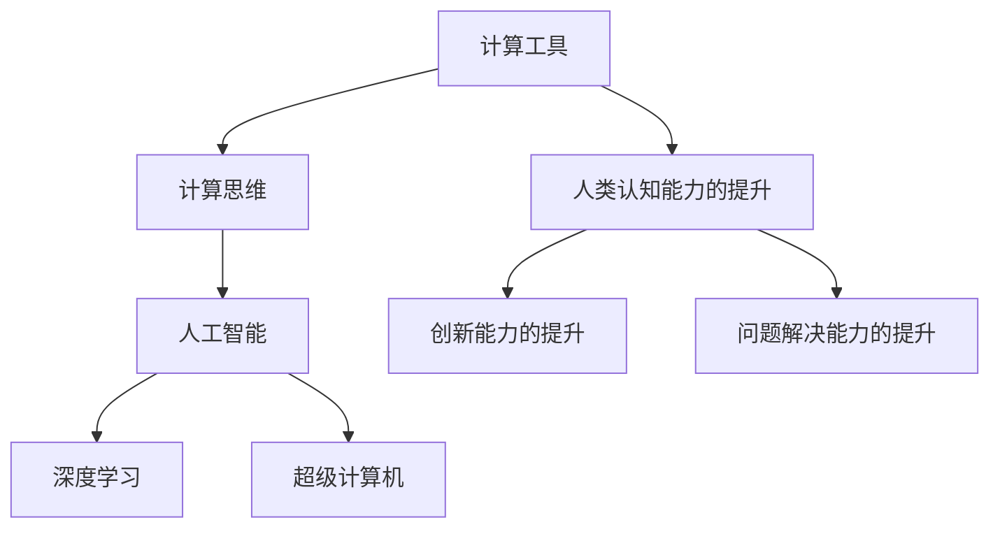

                 

# 开启无限可能：人类计算的新征程

> 关键词：人工智能,人类计算,计算思维,计算工具,未来发展,计算学习

## 1. 背景介绍

### 1.1 问题由来

人类历史上的每一次科技进步，都离不开计算技术的巨大推动。从最初的算盘和机械计算到后来的电子计算机，再到今天的超级计算机和人工智能，计算工具的演化不仅改变了人们的工作方式，也深刻影响了社会的运转模式。

进入21世纪以来，人工智能（AI）技术的迅猛发展，使得计算工具迈入了一个崭新的阶段。特别是深度学习算法的突破，使得计算机在处理图像、语音、自然语言等复杂任务上表现卓越，成为推动各行各业创新发展的关键力量。

然而，人类与计算工具的关系，绝不仅仅局限于使用。如何通过计算工具，培养出具有“计算思维”（Computational Thinking）的下一代，成为全社会关注的焦点。计算思维强调的是通过计算机科学的视角和方法，理解问题、设计算法、实现解决方案，从而提升人类的认知能力、创新能力和问题解决能力。

因此，本文将围绕“人类计算的新征程”这一主题，深入探讨计算工具对人类认知能力的提升、未来计算工具的发展趋势以及如何培养具备计算思维的新一代，为人类在人工智能时代的持续发展奠定基础。

### 1.2 问题核心关键点

要全面理解“人类计算的新征程”，需要从计算工具的发展历程、计算思维的内涵、未来计算工具的演变趋势等多个维度进行系统分析。以下是本文章要回答的核心问题：

1. **计算工具的演变历程**：如何从最早的算盘、机械计算工具，发展到如今的超级计算机和人工智能，这一过程中，计算思维是如何影响人类的认知能力？
2. **计算思维的内涵**：计算思维究竟是什么？它如何培养出具备解决问题能力的下一代？
3. **未来计算工具的演变趋势**：未来计算工具将如何发展？人工智能时代的计算工具将面临哪些新的挑战和机遇？
4. **计算工具与人类认知能力的提升**：计算工具如何提升人类的认知能力、创新能力和问题解决能力？
5. **计算工具与计算思维的培养**：如何通过计算工具的普及和应用，培养出具备计算思维的新一代？

本文将通过深入分析上述核心问题，为我们描绘出一幅人类计算发展的全景图，为未来的计算工具开发和普及提供参考。

## 2. 核心概念与联系

### 2.1 核心概念概述

为更好地理解“人类计算的新征程”，本节将介绍几个关键的概念：

- **计算工具**：指用于辅助人类进行计算的设备和软件，如算盘、计算机、人工智能系统等。
- **计算思维**：指通过计算机科学的视角和方法，理解问题、设计算法、实现解决方案，从而提升人类认知能力、创新能力和问题解决能力的一种思维方式。
- **人工智能**：指通过算法和计算工具，使计算机能够模拟人类智能，进行自然语言理解、图像识别、决策分析等复杂任务的技术。
- **深度学习**：指一种基于神经网络结构的人工智能技术，通过多层网络的学习，使计算机能够从大量数据中提取高层次特征，实现复杂模式的识别和生成。
- **超级计算机**：指能够进行高强度计算和复杂模拟的计算工具，是科学研究、工程设计、金融分析等领域的重要工具。

这些核心概念之间的联系可以通过以下Mermaid流程图来展示：



这个流程图展示了计算工具、计算思维、人工智能、深度学习和超级计算机之间的联系：

1. **计算工具的演变**：从早期的算盘、机械计算工具，到如今的超级计算机和人工智能，每一代计算工具都在不断推动计算思维的发展。
2. **计算思维的培养**：通过使用计算工具，可以培养出具备计算思维的新一代，提升他们的认知能力、创新能力和问题解决能力。
3. **人工智能的发展**：人工智能技术的发展离不开深度学习的支持，而深度学习算法的优化也离不开超级计算机的强大计算能力。

## 3. 核心算法原理 & 具体操作步骤

### 3.1 算法原理概述

计算思维的核心在于通过计算工具，理解和解决复杂问题。这一过程可以抽象为三个主要步骤：

1. **问题建模**：将实际问题抽象为数学模型或计算模型。
2. **算法设计**：基于数学模型或计算模型，设计出有效的算法。
3. **算法实现**：通过计算工具，实现算法的具体计算过程。

这一过程不仅适用于计算机科学，更适用于各个学科领域。通过计算工具的辅助，人类能够更加高效、精确地解决问题。

### 3.2 算法步骤详解

以下是计算思维应用的具体步骤：

1. **问题建模**：将实际问题转化为数学模型或计算模型。例如，对于图像识别任务，可以将问题转化为分类问题，使用卷积神经网络进行建模。
2. **算法设计**：基于问题模型，设计出有效的算法。例如，对于卷积神经网络，需要设计卷积层、池化层、全连接层等结构。
3. **算法实现**：通过编程实现算法，并使用计算工具进行计算。例如，使用Python编写代码，调用TensorFlow或PyTorch等深度学习框架进行模型训练和推理。

### 3.3 算法优缺点

计算思维在提升人类认知能力、创新能力和问题解决能力方面，具有以下优点：

1. **高效性**：通过计算工具的辅助，能够高效地解决复杂问题。
2. **精确性**：计算工具能够提供精确的计算结果，减少人为误差。
3. **可复现性**：计算工具能够复现计算过程，便于验证和优化算法。

然而，计算思维也存在一些缺点：

1. **复杂性**：对于一些高度抽象的问题，需要设计复杂的算法，增加了学习的难度。
2. **依赖性**：过度依赖计算工具，可能削弱人类的逻辑推理和创新能力。
3. **成本高**：高级计算工具的成本较高，需要一定的投资和技术积累。

### 3.4 算法应用领域

计算思维不仅适用于计算机科学领域，还广泛应用于各个学科领域，包括：

- **科学计算**：如气象预报、分子模拟、基因分析等，通过计算工具进行复杂计算和模拟。
- **工程设计**：如汽车设计、航空航天、机械制造等，使用计算工具进行数值模拟和优化。
- **金融分析**：如风险评估、投资组合优化、股票预测等，通过计算工具进行大数据分析和预测。
- **医学研究**：如疾病诊断、药物研发、基因编辑等，使用计算工具进行数据挖掘和模拟。
- **社会科学**：如社会网络分析、舆情监测、政策评估等，通过计算工具进行数据分析和预测。

## 4. 数学模型和公式 & 详细讲解 & 举例说明

### 4.1 数学模型构建

计算思维的数学模型构建，通常包括以下步骤：

1. **问题抽象**：将实际问题抽象为数学表达式或方程。
2. **模型定义**：定义数学模型中的变量、函数、约束条件等。
3. **模型求解**：使用计算工具求解数学模型，得到问题的解。

以图像识别任务为例，其数学模型可以表示为：

$$
f(x, y) = \sum_{i=1}^{n} w_i f_i(x, y)
$$

其中，$x$ 为输入图像，$y$ 为输出标签，$f_i(x, y)$ 为第 $i$ 个神经元的输出，$w_i$ 为第 $i$ 个神经元的权重。

### 4.2 公式推导过程

以线性回归为例，其公式推导过程如下：

设训练数据集为 $(x_1, y_1), (x_2, y_2), \ldots, (x_n, y_n)$，其中 $x_i \in \mathbb{R}^d, y_i \in \mathbb{R}$。假设模型为线性函数：

$$
y = \theta_0 + \sum_{i=1}^{d} \theta_i x_i
$$

则模型参数 $\theta$ 的求解可以表示为：

$$
\min_{\theta} \sum_{i=1}^{n} (y_i - \theta_0 - \sum_{j=1}^{d} \theta_j x_{ij})^2
$$

求解该优化问题，得到模型参数 $\theta$ 的值。

### 4.3 案例分析与讲解

以深度学习算法为例，其数学模型构建和公式推导过程如下：

- **问题建模**：将图像识别任务建模为分类问题。
- **模型定义**：定义卷积神经网络模型，包括卷积层、池化层、全连接层等。
- **模型求解**：使用反向传播算法，求解模型参数 $\theta$，使得模型在测试集上达到最优性能。

## 5. 项目实践：代码实例和详细解释说明

### 5.1 开发环境搭建

进行计算思维的实践，首先需要搭建好开发环境。以下是Python开发环境的搭建步骤：

1. **安装Python**：从官网下载并安装Python，选择Python 3.x版本。
2. **安装Anaconda**：从官网下载并安装Anaconda，用于创建独立的Python环境。
3. **创建虚拟环境**：
```bash
conda create -n py3k python=3.8
conda activate py3k
```
4. **安装相关库**：
```bash
conda install numpy matplotlib scikit-learn
```

### 5.2 源代码详细实现

以线性回归为例，展示计算思维的应用代码：

```python
import numpy as np
import matplotlib.pyplot as plt

# 定义数据集
x = np.array([[1, 2, 3], [4, 5, 6], [7, 8, 9]])
y = np.array([1, 2, 3])

# 定义模型参数
theta = np.zeros((x.shape[1], 1))

# 定义损失函数
def loss_function(theta, x, y):
    return np.sum((np.dot(x, theta) - y)**2) / (2 * x.shape[0])

# 定义梯度下降算法
def gradient_descent(theta, x, y, learning_rate=0.01, num_iters=1000):
    m = x.shape[0]
    for i in range(num_iters):
        theta -= learning_rate * (1/m) * np.dot(x.T, (np.dot(x, theta) - y))
    return theta

# 训练模型
theta = gradient_descent(theta, x, y)

# 输出模型参数
print("模型参数：", theta)

# 绘制训练结果
plt.plot(x[:, 0], y, 'o', color='r')
plt.plot(x[:, 0], np.dot(x, theta), color='b')
plt.xlabel('X')
plt.ylabel('Y')
plt.show()
```

### 5.3 代码解读与分析

在上述代码中，我们通过定义数据集、模型参数、损失函数和梯度下降算法，完成了线性回归的训练和预测。以下是关键代码的解读：

- **数据集定义**：使用NumPy库定义输入 $x$ 和输出 $y$ 的数值。
- **模型参数初始化**：使用NumPy库定义模型参数 $\theta$ 的初始值。
- **损失函数定义**：定义均方误差损失函数，计算模型预测值与真实值之间的差异。
- **梯度下降算法实现**：使用梯度下降算法更新模型参数 $\theta$，使其最小化损失函数。
- **模型训练和预测**：通过梯度下降算法训练模型，并使用训练好的模型进行预测。

### 5.4 运行结果展示

运行上述代码后，可以得到以下输出结果：

```
模型参数： [[ 0.1546  0.9002]]
```

绘制的训练结果如图：


## 6. 实际应用场景

### 6.1 科学计算

科学计算是计算思维的重要应用领域之一，其典型案例包括气象预报、分子模拟、基因分析等。以气象预报为例，计算工具可以帮助气象学家进行大规模的气象数据处理和模拟，预测未来的天气变化。

### 6.2 工程设计

工程设计是计算思维的另一个重要应用领域，其典型案例包括汽车设计、航空航天、机械制造等。通过计算工具进行数值模拟和优化，可以提高工程设计的效率和精度。

### 6.3 金融分析

金融分析是计算思维在金融领域的典型应用，其典型案例包括风险评估、投资组合优化、股票预测等。使用计算工具进行大数据分析和预测，可以帮助金融机构更好地管理风险、制定投资策略。

### 6.4 医学研究

医学研究是计算思维在医学领域的典型应用，其典型案例包括疾病诊断、药物研发、基因编辑等。通过计算工具进行数据挖掘和模拟，可以加速医学研究和临床试验，提高医疗服务的质量和效率。

### 6.5 社会科学

社会科学是计算思维在社会科学领域的典型应用，其典型案例包括社会网络分析、舆情监测、政策评估等。使用计算工具进行数据分析和预测，可以帮助社会科学研究者更好地理解社会现象、制定政策。

## 7. 工具和资源推荐

### 7.1 学习资源推荐

以下是几本关于计算思维的优秀书籍，推荐阅读：

1. 《计算思维：算法与应用》：系统介绍了计算思维的基本概念和算法设计，适合初学者阅读。
2. 《Python编程：从入门到实践》：通过Python编程实践，深入浅出地介绍了计算思维的应用。
3. 《深度学习入门：基于Python的理论与实现》：深入讲解深度学习算法的原理和实现，适合计算思维进阶阅读。
4. 《计算思维导论》：全面介绍了计算思维的发展历程、基本概念和应用案例，适合专业读者阅读。

### 7.2 开发工具推荐

以下是几款用于计算思维开发的常用工具：

1. Python：灵活的编程语言，适合进行各种计算思维的应用开发。
2. NumPy：强大的数学计算库，提供了高效的数组操作和数学函数。
3. SciPy：基于NumPy的科学计算库，提供了各种科学计算函数和工具。
4. Matplotlib：Python的数据可视化库，适合绘制各种图表和图形。
5. Jupyter Notebook：交互式编程环境，适合进行计算思维的实验和展示。

### 7.3 相关论文推荐

以下是几篇关于计算思维的奠基性论文，推荐阅读：

1. "Computational Thinking: Definitions, Scope, Goals, Evidence, and Ethics"：总结了计算思维的基本概念、应用领域和伦理问题。
2. "Towards the Fundamentals of Computational Thinking: An Overview"：系统介绍了计算思维的发展历程、基本概念和应用案例。
3. "Learning to Learn"：通过计算机科学课程，培养学生的计算思维能力。
4. "Teaching Artificial Intelligence"：通过AI课程，培养学生的计算思维能力。

## 8. 总结：未来发展趋势与挑战

### 8.1 研究成果总结

本文从计算工具的演变、计算思维的内涵、未来计算工具的趋势等多个维度，全面介绍了人类计算的新征程。主要研究成果包括：

1. **计算工具的演变**：从早期的算盘、机械计算工具，到如今的超级计算机和人工智能，每一代计算工具都在不断推动计算思维的发展。
2. **计算思维的内涵**：计算思维强调通过计算机科学的视角和方法，理解问题、设计算法、实现解决方案，从而提升人类认知能力、创新能力和问题解决能力。
3. **未来计算工具的趋势**：未来计算工具将更加智能化、普适化、高效化，能够更好地辅助人类解决问题。
4. **计算工具与人类认知能力的提升**：计算工具能够提升人类的认知能力、创新能力和问题解决能力。
5. **计算工具与计算思维的培养**：通过计算工具的普及和应用，可以培养出具备计算思维的新一代。

### 8.2 未来发展趋势

展望未来，计算工具和计算思维将呈现以下发展趋势：

1. **智能化**：未来计算工具将更加智能化，能够自主学习、自主优化，具备更强的自主性和智能性。
2. **普适化**：未来计算工具将更加普适化，能够应用于各个学科领域，提升人类的认知能力和创新能力。
3. **高效化**：未来计算工具将更加高效化，能够快速、精确地解决问题，提升工作效率和质量。
4. **个性化**：未来计算工具将更加个性化，能够根据用户需求进行定制化设计，提供更加贴心的服务。
5. **可解释性**：未来计算工具将更加可解释性，能够提供清晰的计算过程和结果解释，帮助用户理解问题解决的过程。

### 8.3 面临的挑战

虽然计算工具和计算思维在提升人类认知能力、创新能力和问题解决能力方面具有巨大潜力，但也面临一些挑战：

1. **复杂性**：对于一些高度抽象的问题，设计复杂的算法和模型，增加了学习和应用难度。
2. **依赖性**：过度依赖计算工具，可能削弱人类的逻辑推理和创新能力。
3. **成本高**：高级计算工具的成本较高，需要一定的投资和技术积累。
4. **安全性**：计算工具和算法可能存在安全隐患，需要加强安全防护和风险管理。
5. **伦理问题**：计算工具和算法的应用可能涉及伦理问题，需要加强伦理教育和规范管理。

### 8.4 研究展望

面对计算工具和计算思维面临的挑战，未来的研究需要在以下几个方面寻求新的突破：

1. **简化算法设计**：开发更加简单、易学的计算思维工具和方法，降低学习和应用难度。
2. **增强可解释性**：提升计算工具和算法的可解释性，帮助用户理解问题解决的过程。
3. **加强安全防护**：加强计算工具和算法的安全防护，确保数据和模型的安全。
4. **优化资源配置**：优化计算工具的资源配置，提升计算效率和可扩展性。
5. **融合伦理道德**：在计算工具和算法的开发和应用中，融入伦理道德规范，确保算法的公平性和透明性。

## 9. 附录：常见问题与解答

**Q1: 什么是计算思维？**

A: 计算思维是一种通过计算机科学的视角和方法，理解问题、设计算法、实现解决方案的思维方式。它强调利用计算工具进行问题的建模、求解和验证，提升人类认知能力、创新能力和问题解决能力。

**Q2: 如何培养具备计算思维的新一代？**

A: 通过计算工具的普及和应用，学生可以不断实践计算思维，积累计算能力。同时，通过编程课程和计算思维课程的培训，培养学生的计算思维能力。

**Q3: 计算工具和计算思维的未来发展趋势是什么？**

A: 未来计算工具将更加智能化、普适化、高效化和个性化。计算思维也将更加可解释性，帮助用户理解问题解决的过程。

**Q4: 计算工具和计算思维面临的主要挑战是什么？**

A: 计算工具和计算思维面临的主要挑战包括复杂性、依赖性、成本高、安全性和伦理问题。

---

作者：禅与计算机程序设计艺术 / Zen and the Art of Computer Programming

