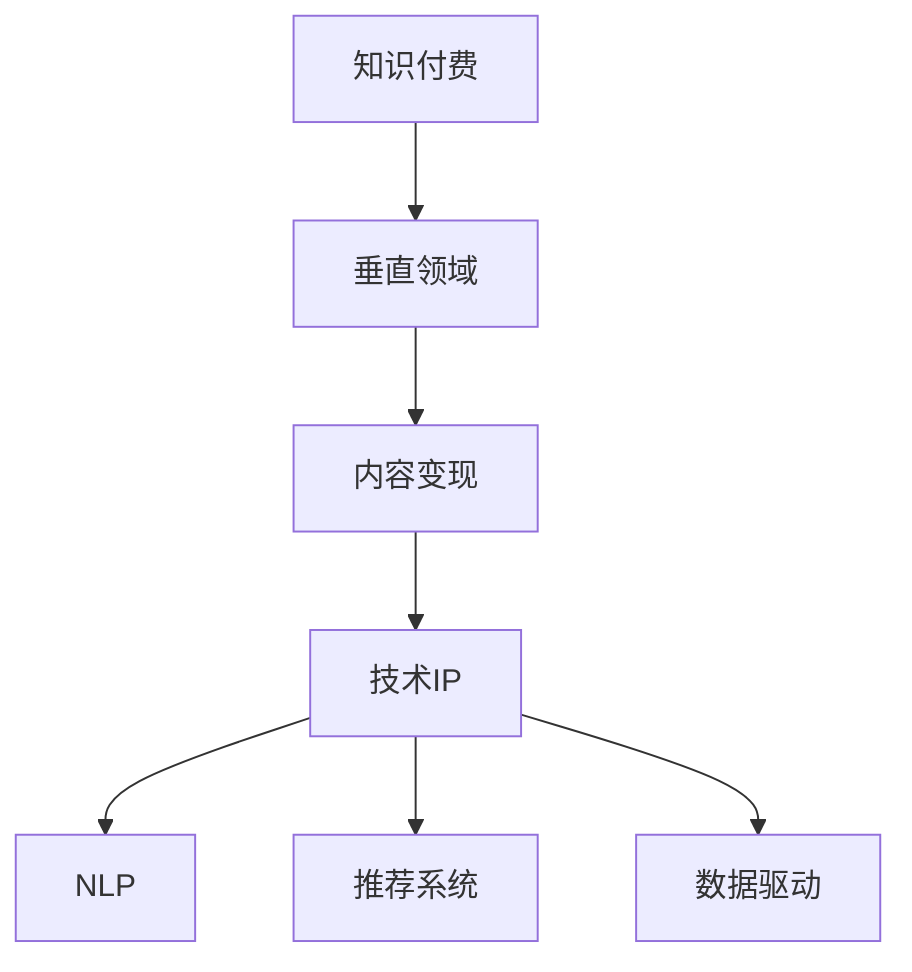

                 

# 打造垂直领域的知识付费IP

> 关键词：知识付费、垂直领域、技术IP、内容变现、用户运营、人工智能、大数据、自然语言处理(NLP)

## 1. 背景介绍

### 1.1 问题由来

随着移动互联网和在线教育的普及，知识付费市场迅速发展。一方面，知识的价值被越来越多的人所认可，用户愿意为高品质的内容买单。另一方面，内容创作者也看到了通过内容变现的巨大商机，纷纷投入到知识付费的浪潮中。然而，高竞争的市场环境也带来了挑战：内容同质化严重，用户获取价值感低，如何打造独特的知识IP、提升用户粘性、实现可持续的内容变现，成为知识付费平台的核心命题。

垂直领域的知识付费IP，指的是在特定领域内，拥有独特知识体系和用户基础的知识创作者。相比于通用领域的内容创作者，垂直领域IP的显著优势在于其在专业知识和行业洞察上的深耕细作。这类内容创作者能够提供更有深度、更有针对性和实用性的知识，更容易获得目标用户的认可。

### 1.2 问题核心关键点

垂直领域知识付费IP的核心在于如何将专业领域的深耕与市场变现相结合，具体问题包括：

- 如何构建具有高价值的知识体系？
- 如何针对特定用户群体进行精准营销？
- 如何通过数据和算法优化内容推荐系统，提升用户体验？
- 如何利用人工智能和大数据技术，实现内容个性化推荐和自动化运营？
- 如何通过多元化变现方式，增强IP的生命力和商业化潜力？

### 1.3 问题研究意义

打造垂直领域知识付费IP对于内容创作者、知识平台和用户均具有重要意义：

- 对于内容创作者，通过独特知识IP的构建，能够提升品牌价值，增强市场竞争力，实现更大的商业化潜力。
- 对于知识平台，IP内容能够吸引更多高价值用户，提升平台的用户粘性和活跃度。
- 对于用户，能够获得更有深度、更有针对性的知识服务，满足自身需求，提升学习效果。

本文将从核心概念、算法原理、具体操作和实际应用等多个角度，系统梳理垂直领域知识付费IP的打造流程，并结合实际案例，深入探讨相关技术和运营策略。

## 2. 核心概念与联系

### 2.1 核心概念概述

为更好地理解垂直领域知识付费IP的打造流程，本节将介绍几个密切相关的核心概念：

- 知识付费(Knowledge-Based Subscription)：指用户支付一定费用，获取深度、专业、高品质的内容服务，满足自身知识需求的一种模式。
- 垂直领域(Vertical Field)：指专注于某一特定行业或学科的知识和服务，具有更强的专业性和深度性。
- 内容变现(Content Monetization)：指通过内容营销、广告、电商、会员等多种方式，实现内容价值的变现。
- 技术IP(Technology IP)：指在某一技术领域拥有核心专长和创新能力，具有显著市场竞争力的技术知识创作者。
- 自然语言处理(Natural Language Processing, NLP)：指使计算机能够理解、生成人类语言的技术，广泛应用于知识付费领域的内容生成和处理。
- 推荐系统(Recommendation System)：指利用算法为用户推荐个性化内容，提升用户粘性和满意度。
- 数据驱动(Data-Driven)：指通过数据分析、模型训练等技术手段，驱动内容运营决策，提升运营效率。

这些核心概念之间的逻辑关系可以通过以下Mermaid流程图来展示：



这个流程图展示的知识付费IP构建流程：

1. 知识付费作为整体模式，为内容创作者提供了变现路径。
2. 垂直领域指明内容的深度和专业性，有助于提升IP价值。
3. 内容变现涉及多种变现方式，丰富IP的商业化手段。
4. 技术IP提供技术支持和创新能力，支撑内容生成和运营。
5. NLP帮助理解和生成自然语言内容，增强内容多样性。
6. 推荐系统提升用户体验，增强用户粘性。
7. 数据驱动优化运营决策，提升运营效率。

这些概念共同构成了知识付费IP打造的框架，使其能够有效地服务于用户和平台，实现高质量的内容变现。

## 3. 核心算法原理 & 具体操作步骤
### 3.1 算法原理概述

打造垂直领域知识付费IP的核心在于构建具有高价值的内容体系，并针对特定用户群体进行精准营销，提升用户粘性和内容变现能力。这一过程涉及多方面的算法和技术，包括自然语言处理(NLP)、推荐系统、数据驱动运营等多个方向。

### 3.2 算法步骤详解

垂直领域知识付费IP的打造流程包括以下关键步骤：

**Step 1: 内容创作与积累**

- 选择专业领域：根据个人兴趣和市场需求，选择具有发展潜力的垂直领域。
- 构建知识体系：梳理领域内的核心知识，形成系统的课程框架和内容体系。
- 持续内容更新：定期发布新内容，保持知识的时效性和多样性。

**Step 2: 用户画像与精准营销**

- 数据收集：通过问卷、行为分析等手段，收集目标用户的画像信息。
- 用户分类：根据用户兴趣、行为特征等，将用户分为不同的细分群体。
- 精准营销：针对不同用户群体，设计不同的营销策略和内容推荐方案。

**Step 3: 内容个性化推荐**

- 算法模型选择：选择适合的内容推荐算法，如协同过滤、基于内容的推荐、深度学习等。
- 特征提取：提取用户和内容的特征，如标签、文本特征、行为数据等。
- 模型训练：使用用户历史行为数据，训练推荐模型，生成个性化内容推荐列表。

**Step 4: 数据驱动运营优化**

- 运营数据分析：利用数据和算法，分析内容运营效果，如用户留存率、内容互动率等。
- 运营策略调整：根据分析结果，调整运营策略，优化内容推荐、广告投放等环节。
- 用户行为预测：通过预测模型，预测用户行为变化，提前进行策略调整。

**Step 5: 内容变现策略**

- 内容付费：根据内容价值，设置合理的付费门槛，吸引付费用户。
- 广告变现：在平台内外的广告位展示内容广告，获取广告收益。
- 电商变现：将内容与电商产品结合，推出专业领域的知识和产品套餐。
- 会员服务：为高价值用户提供专属会员服务，包括专享课程、优先推荐等。

### 3.3 算法优缺点

打造垂直领域知识付费IP的算法具有以下优点：

- 专业性和深度性：通过垂直领域的知识创作，内容具备更强的专业性和深度性，满足用户需求。
- 个性化推荐：通过推荐算法，实现个性化内容推荐，提升用户体验。
- 数据驱动决策：通过数据分析和模型训练，优化运营策略，提升运营效率。

同时，该算法也存在一些局限性：

- 内容创作成本高：垂直领域的深度创作需要大量时间和资源投入。
- 用户获取困难：高专业性和深度的内容，可能难以吸引广泛的非专业用户。
- 内容更新难度大：保持内容的时效性和多样性，需要持续的创作和更新。
- 算法模型复杂：推荐系统的算法模型复杂，需要大量的数据和计算资源支持。

尽管存在这些局限性，但就目前而言，打造垂直领域知识付费IP仍然是一个高效且可行的策略。未来相关研究的重点在于如何进一步降低内容创作的难度和成本，提高推荐算法的精准性和可解释性，同时兼顾用户需求和平台收益。

### 3.4 算法应用领域

打造垂直领域知识付费IP的算法已经在多个领域得到应用，包括但不限于：

- 教育培训：构建垂直领域的课程体系，提供专业的知识服务和认证考试。
- 医学健康：提供专业的健康知识、健康管理方案和在线诊疗服务。
- 财经投资：提供股票、基金、房地产等领域的深度分析报告和投资建议。
- 技术开发：提供编程、大数据、人工智能等技术领域的知识教程和实战项目。
- 生活娱乐：提供烹饪、旅行、音乐等生活领域的知识服务和产品推荐。

除了上述这些经典应用外，随着技术的发展，垂直领域知识付费IP的应用领域还将不断拓展，为各行各业带来新的商业机遇。

## 4. 数学模型和公式 & 详细讲解 & 举例说明

### 4.1 数学模型构建

打造垂直领域知识付费IP的数学模型构建主要涉及以下几个方面：

- 内容推荐模型：利用协同过滤、基于内容的推荐、深度学习等算法，生成个性化内容推荐列表。
- 用户画像模型：通过用户行为数据，建立用户兴趣、行为特征等画像信息。
- 运营效果模型：利用数据分析技术，评估内容运营效果，进行运营策略调整。

假设平台有 $U$ 个用户，$C$ 个内容，用户和内容的兴趣匹配度为 $X_{uc}$，用户历史行为数据为 $Y_u$。则内容推荐模型的目标为最大化用户点击率 $Y_{uc}$。

内容推荐模型的目标函数可以表示为：

$$
\max_{\theta} \sum_{u=1}^U \sum_{c=1}^C X_{uc} Y_{uc}
$$

其中 $\theta$ 为模型参数，$X_{uc}$ 为内容与用户匹配度的打分。

### 4.2 公式推导过程

以协同过滤算法为例，推导其基本原理和实现步骤：

协同过滤算法基于用户的历史行为数据，预测用户对未交互内容的兴趣。假设用户 $u$ 对内容 $c$ 的兴趣表示为 $X_{uc}$，模型目标为最大化用户点击率 $Y_{uc}$。

协同过滤算法的基本思想是：找到与用户 $u$ 兴趣相似的其他用户 $v$，以及这些用户喜欢的内容 $c$，通过计算相似度 $W_{uv}$，生成用户对内容 $c$ 的预测兴趣 $X_{uc}$。协同过滤算法的公式为：

$$
X_{uc} = \sum_{v \in N_u} W_{uv} Y_{vc}
$$

其中 $N_u$ 为与用户 $u$ 相似的其他用户集合，$W_{uv}$ 为相似度权重，$Y_{vc}$ 为内容 $c$ 在用户 $v$ 上的兴趣度。

通过协同过滤算法，可以为每个用户生成一份个性化内容推荐列表，提升用户体验和内容互动率。

### 4.3 案例分析与讲解

以在线教育平台为例，分析如何使用协同过滤算法进行内容推荐：

1. 数据准备：收集用户历史浏览、点击、购买等行为数据，以及内容的学习进度、用户评分等反馈信息。
2. 用户相似度计算：根据用户历史行为数据，计算用户间的相似度，形成用户相似度矩阵 $W$。
3. 内容匹配度计算：根据内容标签、文本特征等，计算内容与用户兴趣的匹配度，形成内容匹配度矩阵 $X$。
4. 协同过滤模型训练：利用用户相似度矩阵和内容匹配度矩阵，训练协同过滤模型，生成个性化内容推荐列表。
5. 内容推荐实践：将推荐结果展示给用户，评估用户互动和点击效果，进行模型调优。

通过协同过滤算法，在线教育平台能够为每个用户提供个性化的课程推荐，提升用户的学习体验和平台的用户粘性。

## 5. 项目实践：代码实例和详细解释说明

### 5.1 开发环境搭建

在进行内容推荐实践前，我们需要准备好开发环境。以下是使用Python进行Scikit-learn开发的环境配置流程：

1. 安装Anaconda：从官网下载并安装Anaconda，用于创建独立的Python环境。

2. 创建并激活虚拟环境：
```bash
conda create -n pyenv python=3.8 
conda activate pyenv
```

3. 安装Scikit-learn：
```bash
conda install scikit-learn
```

4. 安装其他必要的工具包：
```bash
pip install numpy pandas matplotlib seaborn joblib
```

完成上述步骤后，即可在`pyenv`环境中开始内容推荐实践。

### 5.2 源代码详细实现

下面我们以协同过滤算法为例，给出使用Scikit-learn进行内容推荐实践的Python代码实现。

首先，定义数据预处理函数：

```python
from sklearn.feature_extraction.text import TfidfVectorizer
from sklearn.metrics.pairwise import cosine_similarity
import numpy as np

def preprocess_data(train_data, test_data):
    train_texts, train_labels = train_data[:,0], train_data[:,1]
    test_texts, test_labels = test_data[:,0], test_data[:,1]
    
    # 文本特征提取
    tfidf = TfidfVectorizer()
    train_features = tfidf.fit_transform(train_texts)
    test_features = tfidf.transform(test_texts)
    
    # 计算用户相似度矩阵
    user_similarity = cosine_similarity(train_features)
    
    return train_features, user_similarity, test_features
```

然后，定义协同过滤推荐函数：

```python
def collaborative_filtering(train_features, user_similarity, test_features):
    # 计算内容匹配度
    content_match = np.dot(train_features, user_similarity)
    # 生成预测兴趣
    predicted_interest = np.dot(content_match, test_features)
    # 排序生成推荐列表
    top_n = 10
    recommendations = np.argsort(predicted_interest, axis=1)[-top_n:]
    return recommendations
```

最后，启动推荐实践并在测试集上评估：

```python
from sklearn.model_selection import train_test_split

# 数据集划分
train_data, test_data = train_test_split(train_data, test_size=0.2, random_state=42)

# 数据预处理
train_features, user_similarity, test_features = preprocess_data(train_data, test_data)

# 协同过滤推荐
recommendations = collaborative_filtering(train_features, user_similarity, test_features)

# 输出推荐结果
print(recommendations)
```

以上就是使用Scikit-learn进行协同过滤内容推荐的完整代码实现。可以看到，利用Python进行内容推荐开发，可以方便快捷地实现模型训练和推荐实践。

### 5.3 代码解读与分析

让我们再详细解读一下关键代码的实现细节：

**preprocess_data函数**：
- 将训练数据和测试数据拆分为文本和标签两部分。
- 使用TF-IDF算法提取文本特征。
- 计算用户相似度矩阵，用于协同过滤模型训练。

**collaborative_filtering函数**：
- 计算内容匹配度，生成用户对内容的预测兴趣。
- 根据预测兴趣，生成推荐列表，取TopN推荐结果。

**训练流程**：
- 使用train_test_split函数将数据集分为训练集和测试集。
- 调用preprocess_data函数进行数据预处理，提取特征和相似度矩阵。
- 调用collaborative_filtering函数生成推荐列表。
- 打印推荐结果，评估推荐效果。

可以看到，Python和Scikit-learn提供了简单易用的工具，可以高效实现协同过滤模型的训练和推荐实践。

当然，工业级的系统实现还需考虑更多因素，如模型的保存和部署、超参数的自动搜索、更多的特征工程等。但核心的内容推荐算法基本与此类似。

## 6. 实际应用场景

### 6.1 教育培训

在线教育平台可以通过协同过滤等推荐算法，为每个学生推荐适合其学习进度和兴趣的课程。通过个性化推荐，提升学生的学习效果和平台的用户粘性。

在技术实现上，可以收集学生的浏览、点击、评分等行为数据，构建用户画像和内容标签，训练协同过滤模型，生成推荐列表。对于新课程，可以通过模型评估其对现有用户的影响，预测点击率和转化率，决定是否上线。

### 6.2 医学健康

医疗平台可以通过协同过滤推荐系统，为患者推荐适合其病情和需求的治疗方案和健康知识。通过精准推荐，提升用户满意度和平台的市场竞争力。

在技术实现上，可以收集患者的健康记录、用药历史、生活方式等数据，构建用户画像。同时，收集医生推荐的治疗方案和健康知识，构建内容特征库。利用协同过滤模型，生成个性化推荐列表，帮助患者找到最适合的治疗方案。

### 6.3 财经投资

财经投资平台可以通过协同过滤推荐系统，为投资者推荐适合的投资策略和市场分析报告。通过个性化推荐，提升投资者的决策质量和平台的收益潜力。

在技术实现上，可以收集投资者的历史交易记录、分析报告、市场情绪等数据，构建用户画像。同时，收集各类市场分析和投资策略报告，构建内容特征库。利用协同过滤模型，生成个性化推荐列表，帮助投资者发现潜在的投资机会。

### 6.4 未来应用展望

随着协同过滤等推荐算法的不断发展，基于内容的推荐系统将在更多领域得到应用，为各行各业带来新的变革：

- 在智慧医疗领域，推荐系统可以帮助医生精准推荐治疗方案，提升诊疗效率。
- 在智能教育领域，推荐系统可以个性化推荐课程和习题，提升学生的学习效果。
- 在金融投资领域，推荐系统可以帮助投资者发现投资机会，优化投资组合。
- 在电商购物领域，推荐系统可以个性化推荐商品，提升用户购物体验。

除了上述这些应用外，推荐系统还将进一步拓展到更多的场景中，如内容创作、广告投放、社交网络等，为各行各业带来新的商业机遇。

## 7. 工具和资源推荐

### 7.1 学习资源推荐

为了帮助开发者系统掌握推荐系统的内容推荐技术，这里推荐一些优质的学习资源：

1. 《推荐系统实战》书籍：深入浅出地介绍了推荐系统的基本原理和实践技巧，涵盖协同过滤、基于内容的推荐、深度学习等多种算法。
2. 《机器学习实战》书籍：全面介绍了机器学习的基本概念和常用算法，包括协同过滤、决策树、神经网络等。
3. 《Python推荐系统实战》在线课程：结合Scikit-learn和TensorFlow，系统讲解了推荐系统的理论基础和实践操作。
4. Kaggle推荐系统竞赛：通过实际竞赛项目，锻炼推荐系统建模和优化能力。
5. GitHub推荐系统项目：浏览和借鉴开源项目，快速上手推荐系统开发。

通过对这些资源的学习实践，相信你一定能够快速掌握推荐系统的核心技术，并用于解决实际的推荐问题。

### 7.2 开发工具推荐

高效的开发离不开优秀的工具支持。以下是几款用于推荐系统开发的常用工具：

1. Scikit-learn：基于Python的机器学习库，提供了丰富的算法和工具，支持协同过滤、基于内容的推荐等算法。
2. TensorFlow：由Google主导开发的深度学习框架，支持分布式训练和模型部署，适合大规模工程应用。
3. PyTorch：基于Python的开源深度学习框架，灵活的计算图和动态图机制，适合快速迭代研究。
4. Hadoop/Spark：分布式计算平台，支持大规模数据处理和分析，适合推荐系统的数据存储和计算。
5. Elasticsearch：分布式搜索和分析引擎，支持高效的文本查询和推荐列表生成。

合理利用这些工具，可以显著提升推荐系统的开发效率，加快创新迭代的步伐。

### 7.3 相关论文推荐

推荐系统的发展离不开学界的持续研究。以下是几篇奠基性的相关论文，推荐阅读：

1. Personalized Web Search Ranking Using Clustering：介绍了协同过滤算法的原理和实现。
2. Eigentalk：提出了一种基于奇异值分解的协同过滤算法，提高了推荐准确率。
3. Trust-Based Recommender System：介绍了基于信任的推荐算法，提高了推荐系统的鲁棒性和准确性。
4. Deep Matrix Factorization：提出了一种基于矩阵分解的深度学习推荐算法，提升了推荐系统的性能。
5. Neural Collaborative Filtering：介绍了一种基于深度神经网络的协同过滤算法，提升了推荐系统的可解释性和泛化能力。

这些论文代表了的推荐系统的研究进展，通过学习这些前沿成果，可以帮助研究者把握学科前进方向，激发更多的创新灵感。

## 8. 总结：未来发展趋势与挑战

### 8.1 总结

本文对打造垂直领域知识付费IP的内容推荐算法进行了全面系统的介绍。首先阐述了内容推荐在知识付费IP构建中的核心作用，明确了算法在提升用户体验、增强用户粘性和内容变现中的重要价值。其次，从原理到实践，详细讲解了协同过滤等推荐算法的数学模型和实现步骤，给出了推荐系统开发和调优的完整代码实例。同时，本文还广泛探讨了推荐算法在教育培训、医学健康、财经投资等多个行业领域的应用前景，展示了推荐范式的巨大潜力。此外，本文精选了推荐系统相关的学习资源和工具推荐，力求为读者提供全方位的技术指引。

通过本文的系统梳理，可以看到，打造垂直领域知识付费IP的内容推荐技术正在成为知识付费平台的重要支撑，极大地拓展了知识服务的应用范围，提升了平台的商业价值。未来，伴随推荐算法的不断演进和优化，知识付费平台的推荐系统将更加精准、智能，为各行各业带来更多的商业机遇。

### 8.2 未来发展趋势

展望未来，内容推荐系统将呈现以下几个发展趋势：

1. 深度学习技术的应用：随着深度学习算法的发展，推荐系统将更加注重模型的可解释性和泛化能力。
2. 多模态数据的融合：推荐系统将更多地引入图像、音频等多模态数据，提升推荐精度和用户满意度。
3. 个性化推荐系统的普及：推荐系统将成为各行各业的标准配置，提升用户体验和服务质量。
4. 推荐系统的可视化：推荐系统的可视化将更加完善，通过交互式界面帮助用户理解推荐逻辑和优化推荐效果。
5. 推荐系统的自动化：推荐系统的自动化运营将更加广泛，通过智能调参和模型优化，提升推荐效果和运营效率。
6. 推荐系统的伦理和公平性：推荐系统将更加注重用户隐私保护和公平性，防止数据滥用和偏见。

以上趋势凸显了内容推荐系统的广阔前景。这些方向的探索发展，将进一步提升推荐系统的精度和用户粘性，为各行各业带来新的商业机遇。

### 8.3 面临的挑战

尽管内容推荐系统已经取得了显著成果，但在迈向更加智能化、普适化应用的过程中，它仍面临着诸多挑战：

1. 推荐准确性：推荐系统在应对数据变化和新用户时，可能存在冷启动和推荐偏差问题，影响推荐准确性。
2. 模型可解释性：推荐系统的复杂模型，难以解释其内部工作机制和决策逻辑，影响用户信任度。
3. 计算资源需求：推荐系统的算法复杂，需要大量的计算资源支持，特别是在处理大规模数据时。
4. 隐私保护和公平性：推荐系统可能泄露用户隐私，产生偏见，需要加强数据保护和算法公平性。
5. 跨领域应用：推荐系统在不同领域的应用可能需要针对性地调整算法和特征工程，提升普适性。

尽管存在这些挑战，但内容推荐系统仍然具有广阔的应用前景，未来需要通过技术创新和实践优化，克服这些难题，实现推荐系统的可持续发展。

### 8.4 研究展望

面向未来，内容推荐系统需要在以下几个方面寻求新的突破：

1. 多模态推荐算法：结合图像、音频等多模态数据，提升推荐系统的多感官融合能力。
2. 深度学习模型优化：优化深度神经网络的架构和训练策略，提升模型的可解释性和泛化能力。
3. 推荐系统的自动化：引入自动化调参和模型优化技术，提升推荐系统的效率和效果。
4. 用户隐私保护：引入隐私保护技术，如差分隐私、联邦学习等，保障用户隐私安全。
5. 推荐系统的公平性：引入公平性评估指标，避免推荐系统的偏见，提升推荐系统的公平性。

这些研究方向的探索，将引领内容推荐系统迈向更高的台阶，为各行各业带来更加精准、智能、公平的推荐服务，提升用户体验和商业价值。

## 9. 附录：常见问题与解答

**Q1：如何构建具有高价值的知识体系？**

A: 构建高价值的知识体系需要以下步骤：
1. 选择专业领域：根据个人兴趣和市场需求，选择具有发展潜力的垂直领域。
2. 梳理核心知识：在选定领域内，梳理核心概念、理论、方法、应用案例等，形成系统的知识框架。
3. 形成课程体系：将核心知识按逻辑顺序排列，形成系统的课程结构和内容体系，便于用户学习。
4. 持续更新内容：根据领域发展趋势和技术进展，定期更新课程内容，保持知识的时效性和深度性。

**Q2：如何设计个性化的推荐算法？**

A: 设计个性化推荐算法需要以下步骤：
1. 特征提取：提取用户和内容的特征，如文本特征、行为特征等。
2. 算法选择：选择合适的推荐算法，如协同过滤、基于内容的推荐、深度学习等。
3. 模型训练：使用用户历史行为数据，训练推荐模型，生成个性化内容推荐列表。
4. 效果评估：通过A/B测试等手段，评估推荐效果，进行模型调优。

**Q3：如何提升推荐算法的可解释性？**

A: 提升推荐算法的可解释性需要以下步骤：
1. 模型简化：通过模型压缩、特征选择等技术手段，简化模型的复杂度。
2. 特征可视化：通过特征重要性排序、特征贡献度分析等方法，可视化模型的特征选择过程。
3. 算法可视化：通过可视化界面，展示推荐算法的工作机制和决策逻辑。
4. 用户反馈：通过用户反馈和交互数据，调整推荐策略和内容。

**Q4：如何保障推荐系统的隐私保护？**

A: 保障推荐系统的隐私保护需要以下措施：
1. 数据匿名化：通过数据去标识化、差分隐私等技术手段，保障用户隐私安全。
2. 模型加密：对推荐模型的参数和训练数据进行加密保护，防止数据泄露。
3. 用户授权：通过用户授权机制，明确推荐系统的数据使用范围和目的，保障用户知情权。
4. 公平性评估：引入公平性评估指标，避免推荐系统的偏见，提升推荐系统的公平性。

通过这些技术手段，可以有效提升推荐系统的隐私保护和公平性，保障用户权益。

**Q5：如何实现推荐系统的跨领域应用？**

A: 实现推荐系统的跨领域应用需要以下步骤：
1. 特征工程：根据不同领域的特点，设计相应的特征工程方法，提取领域特定的特征。
2. 算法调整：根据不同领域的特点，调整推荐算法，如引入新的特征、调整算法参数等。
3. 模型迁移：利用迁移学习技术，将模型在不同领域进行迁移，提升推荐效果。
4. 数据融合：结合不同领域的数据，进行特征融合，提升推荐系统的泛化能力。

通过这些步骤，可以有效提升推荐系统的跨领域应用能力，满足不同领域的个性化推荐需求。

---

作者：禅与计算机程序设计艺术 / Zen and the Art of Computer Programming

