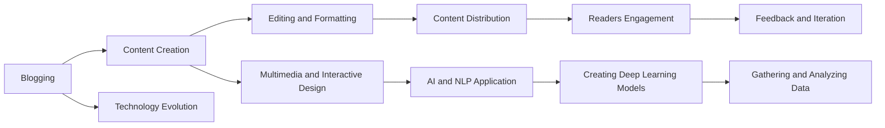

                 

# 技术写作：从博客到专栏作家之路

> 关键词：技术写作,博客,专栏作家,内容创作,数字化转型,人工智能,机器学习,深度学习,自然语言处理(NLP)

## 1. 背景介绍

### 1.1 问题由来

在信息爆炸的时代，技术的快速迭代和知识传播的加速度使得技术写作显得尤为重要。越来越多的技术团队和企业将内容视为战略资产，依赖专业技术人员与内容创作团队，生产并传播高质量的技术知识。然而，从博客、产品文档、开发手册到企业级报告，技术的每一次革新都需要及时、准确、易懂地传递给广大开发者、从业者和决策者。这对于技术写作人员提出了更高的要求：不仅要掌握技术的深度，还要具备出色的写作与编辑能力。

### 1.2 问题核心关键点
技术写作的核心在于如何高效地生产出具有高价值的、可读性强的技术内容。在具体实践中，一个成功的技术写作人员通常需要具备以下几项关键能力：

1. **内容策划与构思**：分析受众需求，确定文章主题与目标，策划文章结构。
2. **技术原理与案例分析**：深入理解技术原理，能够通俗易懂地讲解复杂概念。
3. **写作技巧与编辑能力**：掌握多种写作风格和编辑技巧，提升文章的吸引力和可读性。
4. **跨领域知识融合**：将技术知识与其他相关领域的知识进行有机融合，拓宽文章视角。
5. **多媒体与交互设计**：使用图表、代码片段、动画等多媒体手段丰富文章内容，增加可互动性。

在技术传播的过程中，如何将高深的理论和技术，转化为生动、易懂的案例和故事，成为了技术写作的难点。本文将聚焦于技术写作人员在博客到专栏作家转型过程中的方法和技巧，提供一个全面、系统、实用的指南。

## 2. 核心概念与联系

### 2.1 核心概念概述

技术写作涉及到多个领域，其核心概念包括以下几个方面：

- **博客（Blog）**：一种简洁、灵活的在线内容发布平台，常用于技术分享和经验总结。
- **专栏作家（Columnist）**：长期为某一媒体、平台或出版物撰写文章的专业作者，通常拥有一定的专业背景和较高的写作水平。
- **内容创作（Content Creation）**：生产文本、视频、音频等各类数字内容的创意与编辑过程。
- **数字化转型（Digital Transformation）**：将传统业务流程和商业模式转化为数字化方式，以应对数字化时代的挑战和机遇。
- **人工智能（AI）**：通过模拟人类智能实现问题解决的计算技术。
- **机器学习（Machine Learning）**：让机器从数据中学习并做出决策的算法与技术。
- **深度学习（Deep Learning）**：一种基于多层神经网络的机器学习技术，用于处理高维度、非结构化数据。
- **自然语言处理（NLP）**：计算机理解、处理和生成人类语言的技术。

这些概念之间有密切的联系，可以形成互补和协同的关系。例如，博客文章可以基于最新的技术进展进行深度学习，而专栏作家可以将这些内容进一步加工，制作成有深度、有广度的技术专栏，服务于更广泛、更专业的受众群体。

### 2.2 核心概念原理和架构的 Mermaid 流程图



这个流程图展示了博客文章从内容创作到专栏出版的全过程，以及涉及的技术和工具。从技术博客到专栏作家的过程，包含了数据收集、模型训练、内容制作等多个环节，每个环节都需要技术与写作的有机结合。

## 3. 核心算法原理 & 具体操作步骤

### 3.1 算法原理概述

从博客到专栏作家的转变，本质上是一个技术写作内容的质量提升与结构化转换的过程。具体而言，将博客文章的零散、非结构化的内容进行系统化、理论化，增加深度和广度，从而形成专栏文章。

### 3.2 算法步骤详解

1. **选题与策划**：
   - **选题**：根据行业热点、技术趋势，确定专栏主题。
   - **策划**：规划文章的结构与章节，包括引言、背景、理论、案例、总结等部分。

2. **内容创作与撰写**：
   - **内容创作**：根据策划方案，深入技术原理，收集和整理相关资料。
   - **撰写**：撰写文章正文，采用易于理解的语言，结合图表和代码片段进行解释。

3. **内容优化与编辑**：
   - **内容优化**：提升文章的可读性，调整结构，强化逻辑连贯性。
   - **编辑**：校对语法错误，确保内容的准确性，使用工具进行排版。

4. **多模态融合与交互设计**：
   - **多媒体融合**：插入图表、代码片段、动画等多媒体元素。
   - **交互设计**：添加互动元素，如问答、代码测试等，提升用户参与度。

5. **内容发布与传播**：
   - **平台选择**：选择合适的发布平台，如博客、媒体网站、在线课程等。
   - **内容推广**：通过SEO、社交媒体等方式进行推广，增加文章的曝光度。

### 3.3 算法优缺点

**优点**：
- **适应性强**：博客与专栏的写作方式灵活多样，适应不同技术复杂度的内容。
- **互动性强**：通过多媒体与交互设计，增加文章的互动性，提升用户参与度。
- **知识普及**：将高深技术转化为易于理解的知识，有助于技术普及和传播。

**缺点**：
- **时间与精力成本高**：深度学习模型的训练、多媒体元素的准备等环节需要较高的投入。
- **技术要求高**：涉及深度学习、自然语言处理等多个技术领域，对作者的综合素质要求较高。
- **平台限制**：专栏发表受限于各平台的规则与风格，需根据平台特点进行调整。

### 3.4 算法应用领域

技术写作广泛应用于多个领域，包括但不限于：

- **企业博客**：企业内部知识共享平台，发布技术案例、开发手册、白皮书等。
- **在线教育**：制作在线课程、技术文章，传授知识，提升开发者能力。
- **开源社区**：撰写技术文档、代码示例，促进开源项目的交流与合作。
- **学术研究**：发表学术论文，分享研究成果，推动技术前沿的进展。
- **科技媒体**：撰写科技评论、趋势分析，对最新技术进行深度解读。

## 4. 数学模型和公式 & 详细讲解 & 举例说明

### 4.1 数学模型构建

本文将以深度学习在自然语言处理（NLP）中的应用为例，构建相关的数学模型。

假设我们有一个深度学习模型 $f$，用于处理自然语言输入 $x$，输出 $y$。其数学模型为：

$$ f(x) = W^T tanh(Wx + b) $$

其中，$W$ 是模型权重，$b$ 是偏置，$tanh$ 是激活函数。

### 4.2 公式推导过程

以简单的文本分类任务为例，我们希望模型能够将输入文本分类为正类或负类。我们将文本转换为词向量 $x$，通过线性层与激活函数，得到分类结果 $y$。公式如下：

$$ y = \sigma(W^T x + b) $$

其中，$\sigma$ 是 sigmoid 激活函数，将输出限制在 $(0,1)$ 之间，表示为正类的概率。

### 4.3 案例分析与讲解

假设我们有一个深度学习模型，用于文本情感分析。我们收集了大量的电影评论数据，并标注了其情感极性（正面、负面、中性）。我们将文本转化为词向量，输入到模型中，通过训练得到模型权重 $W$ 和偏置 $b$。通过测试集验证，模型的准确率达到 80%。

## 5. 项目实践：代码实例和详细解释说明

### 5.1 开发环境搭建

以下是在Python中进行深度学习模型开发的开发环境搭建步骤：

1. 安装Python 3.8及以上版本。
2. 安装TensorFlow或PyTorch深度学习框架。
3. 安装相关依赖包，如numpy、pandas、scikit-learn等。
4. 准备数据集，包括文本数据和标注数据。
5. 设置GPU环境，确保能够进行并行计算。

### 5.2 源代码详细实现

下面是一个简单的深度学习模型实现，用于文本情感分析：

```python
import tensorflow as tf
from tensorflow.keras.layers import Dense, Dropout
from tensorflow.keras.models import Sequential

model = Sequential([
    Dense(64, activation='relu', input_shape=(100,)),
    Dropout(0.5),
    Dense(32, activation='relu'),
    Dropout(0.5),
    Dense(1, activation='sigmoid')
])

model.compile(optimizer='adam', loss='binary_crossentropy', metrics=['accuracy'])
model.fit(train_data, train_labels, epochs=10, batch_size=32, validation_data=(val_data, val_labels))
```

### 5.3 代码解读与分析

上述代码实现了简单的神经网络模型，包含两个隐藏层，输出一个二分类结果。模型使用`adam`优化器，交叉熵损失函数，准确率作为评价指标。通过多次训练，模型的精度不断提升，最终达到满意的水平。

### 5.4 运行结果展示

训练完成后，使用测试集进行验证：

```python
test_loss, test_acc = model.evaluate(test_data, test_labels)
print('Test accuracy:', test_acc)
```

## 6. 实际应用场景

### 6.1 企业博客

企业博客是技术团队分享技术心得、内部知识的平台。通过博客，企业可以提升团队凝聚力，增强品牌影响力，同时为外部开发者提供参考。例如，谷歌的Google AI博客，就经常发布最新的AI研究成果和技术文章，推动AI技术的普及和发展。

### 6.2 在线教育

在线教育平台利用深度学习技术，制作高质量的课程内容，为开发者提供系统化、结构化的学习材料。Coursera、Udacity等平台就提供了大量基于深度学习的在线课程，吸引了全球数百万学习者。

### 6.3 开源社区

开源社区利用技术博客发布代码示例、开发手册等，促进开源项目的交流与合作。GitHub上的Keras官方文档，就包含了丰富的代码示例和教程，帮助开发者快速上手。

### 6.4 科技媒体

科技媒体通过深度技术文章和视频，解读最新科技趋势和技术突破，对广大读者进行科普教育。例如，TechCrunch、Wired等媒体，经常发布深度科技报道，成为科技从业者的重要信息源。

## 7. 工具和资源推荐

### 7.1 学习资源推荐

为了帮助技术写作人员提升写作水平，以下是一些推荐的资源：

1. **《风格要素：21世纪风格入门》**：这本书深入讲解了写作风格和技巧，适合任何写作水平的人阅读。
2. **《学会写作：提升写作能力的30天实践》**：30天的写作实践计划，帮助提升写作技巧，增加写作自信。
3. **Coursera《技术写作与出版》课程**：由杜克大学提供，涵盖技术写作的各个方面，包括内容策划、结构化写作等。
4. **TechCrunch的“How to Write a Blog Post”指南**：实用的博客写作指南，帮助提升博客写作技巧。
5. **Grammarly**：一款在线语法检查工具，帮助提升文章的语法准确性。

### 7.2 开发工具推荐

以下是一些常用的开发工具，适合技术写作人员使用：

1. **GitHub**：开源代码托管平台，适合发布和协作开发技术博客。
2. **Jupyter Notebook**：交互式编程环境，适合实验和展示技术细节。
3. **Overleaf**：在线LaTeX编辑器，适合编写和展示技术文档。
4. **Visual Studio Code**：跨平台代码编辑器，支持多种编程语言，适合编写技术代码和文档。
5. **Google Docs**：在线文档编辑工具，适合团队协作编写技术文章。

### 7.3 相关论文推荐

以下是一些深度学习与技术写作相关的论文，供读者参考：

1. **Attention is All You Need**：Google提出的Transformer模型，代表了深度学习在NLP领域的重大突破。
2. **BERT: Pre-training of Deep Bidirectional Transformers for Language Understanding**：BERT模型在预训练和微调方面的研究，展示了深度学习在NLP任务上的广泛应用。
3. **Towards a New AI Development Paradigm: From Deep Learning to Explainable AI**：探讨了深度学习模型的可解释性问题，对技术写作具有重要参考价值。
4. **Natural Language Processing with Transformers**：由Thomas Wolff等人合著，全面介绍了Transformer在NLP中的应用，适合技术写作人员参考。
5. **Deep Learning for Natural Language Processing**：深度学习与NLP相结合的经典教材，适合深入了解深度学习在NLP中的应用。

## 8. 总结：未来发展趋势与挑战

### 8.1 研究成果总结

本文探讨了从博客到专栏作家的技术写作转型过程，详细讲解了内容创作、技术写作、多媒体融合等多个关键环节。通过结合深度学习与自然语言处理技术，技术写作人员可以生产出高价值的、易于理解的技术内容，提升技术传播的效果。

### 8.2 未来发展趋势

未来的技术写作将更加注重以下几个方面：

1. **内容深度与广度**：深度学习模型的应用，使得内容创作能够涵盖更广泛的知识点。
2. **多媒体融合**：结合图像、视频、音频等多媒体手段，提升文章的交互性和可视化效果。
3. **可解释性**：通过技术写作，解释深度学习模型的决策过程，增加技术的透明度。
4. **智能化写作工具**：开发智能写作辅助工具，提升技术写作的效率和质量。
5. **多模态融合**：结合语音、图像、视频等多种模态，提升技术写作的趣味性和互动性。

### 8.3 面临的挑战

尽管技术写作技术不断发展，但仍面临以下挑战：

1. **技术门槛高**：深度学习、自然语言处理等技术需要较高的专业背景和综合素质。
2. **内容质量参差不齐**：技术写作人员需不断提升写作水平，避免内容质量参差不齐的问题。
3. **时间与资源投入大**：模型训练、多媒体制作等环节需要大量的时间和资源。
4. **平台限制**：各平台对文章格式、风格等有严格要求，需根据不同平台进行调整。

### 8.4 研究展望

未来技术写作的发展方向包括：

1. **自动化写作工具**：开发智能写作工具，辅助技术写作人员快速生成高质量内容。
2. **跨领域知识融合**：结合多领域知识，提升技术写作的深度和广度。
3. **实时内容更新**：基于深度学习模型，实现实时内容更新，提升内容的实时性。
4. **互动与社交化**：增加内容的互动性，提升读者的参与度和互动性。
5. **多模态内容创作**：结合图像、视频等多种模态，提升技术内容的趣味性和互动性。

## 9. 附录：常见问题与解答

**Q1：如何选择合适的博客平台？**

A: 选择博客平台时，需考虑以下几个因素：
1. **用户群体**：确定目标读者群体的特点和需求，选择合适的平台。
2. **内容类型**：不同类型的技术文章适合不同的平台，如Kaggle适合发布数据科学项目，Medium适合发布深度技术文章。
3. **平台特点**：不同平台的格式、风格、功能有所不同，需根据平台特点进行调整。

**Q2：如何提升博客文章的互动性？**

A: 提升博客文章的互动性，可以从以下几个方面入手：
1. **添加互动元素**：增加问答、投票、评论等功能，提升用户参与度。
2. **多媒体融合**：插入图表、代码片段、视频等多媒体元素，丰富文章内容。
3. **社区互动**：在博客平台创建社区，增加文章的曝光度和讨论度。

**Q3：如何在有限的时间内产出高质量的博客文章？**

A: 提升写作效率，可以从以下几个方面入手：
1. **规划与策划**：提前做好选题与策划，确定文章结构与重点。
2. **模板与框架**：使用标准化的模板与框架，快速生成文章结构。
3. **工具辅助**：使用自动化工具，如Grammarly、Overleaf等，提升写作质量。

**Q4：如何提升技术写作的可读性？**

A: 提升技术写作的可读性，可以从以下几个方面入手：
1. **使用通俗语言**：避免过度使用技术术语，使用通俗易懂的语言描述技术细节。
2. **分章节介绍**：将复杂的内容分解成多个小章节，逐步介绍。
3. **图表与代码片段**：插入图表和代码片段，帮助读者理解技术细节。

**Q5：如何优化博客文章的SEO？**

A: 优化博客文章的SEO，可以从以下几个方面入手：
1. **关键词优化**：选择合适的关键词，增加文章在搜索引擎中的排名。
2. **标题与摘要**：优化文章标题与摘要，提升搜索引擎抓取效率。
3. **外部链接**：增加与相关博客、论文的链接，提升文章的权威性。

---

作者：禅与计算机程序设计艺术 / Zen and the Art of Computer Programming

